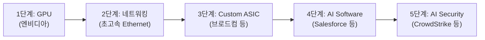
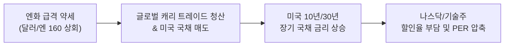

# 2026년 08월 30일(일) 하루치 뉴스정리

- **작성일**: 2026-08-30

AI 사이클의 수요 둔화가 아니라 할인율(금리) 재상승과의 정면충돌 국면에서, 이번 주 워시 발언 여파 vs 브로드컴 실적 및 8월 고용보고서가 9월 초 기술주 방향성을 결정하는 핵심 분수령입니다.

## 요약

| 구분 | 주요 내용 |
| :--- | :--- |
| **핵심 결론** | AI 사이클 둔화가 아닌 **‘다시 상승하는 할인율(금리)’**과의 충돌. 펀더멘털은 견고하나 밸류에이션 재평가 진행 중 |
| **주요 분수령** | 09/02(수) 장 마감 후 **브로드컴(AVGO) 실적 발표** ↔ 09/04(금) **미국 8월 고용보고서 발표** |
| **자금 흐름 변화** | 단일 GPU 하드웨어 중심에서 **네트워킹 / Custom ASIC / 실질 수익화 소프트웨어(CRM, CRWD) / 현금흐름(FCF)**으로 확산 |
| **대응 전략** | 패닉 매도 금지, 브로드컴 Q4 AI 가이던스 및 고용 지표 확인 후 단계적 분할 대응 |

---

## 1. 기사 속 팩트 분석: 워시 발언과 금리 시장의 실체

### 잭슨홀 발언의 3대 핵심 포인트
잭슨홀 미팅에서 케빈 워시(Kevin Warsh)의 발언은 시장의 금리 인하 기대감에 제동을 걸었습니다.

- **① 연준 PCE 2% 목표 재확인**: 최근 물가 지표가 소폭 개선되었으나 인플레이션 고착화 위험이 완전히 해소되지 않았음을 명시
- **② 금융여건 평가**: 현재 금융여건이 인플레이션을 억제할 만큼 충분히 긴축적이지 않을 수 있다고 진단
- **③ 추가 금리 인상 가능성 개방**: 데이터 경로에 따라 필요시 추가 금리 인상 카드도 배제하지 않음을 시사

### 시장 반응과 실질 의미
- **금리 급등**: 연설 직후 9월 금리 인상 확률은 장중 50% 후반까지 급등했으며, 미국 2년물 국채 금리는 하루 만에 약 12bp 오른 4.35%, 10년물은 4.72%를 기록했습니다. ([CBS News](https://www.cbsnews.com/news/kevin-warsh-fed-speech-jackson-hole-inflation/))
- **기술주 동반 하락**: 엔비디아(-4.57%)를 비롯해 필라델피아 반도체 지수 30개 전 종목이 하락 마감했습니다. ([Investing.com](https://www.investing.com/news/stock-market-news/wall-st-futures-steady-after-nvidialed-gains-warshs-jackson-hole-speech-looms-4880398))
- **팩트 교정**: 워시 발언은 "9월 인상 확정"이 아니며 시장 가격(FedWatch 등)이 확률을 반영한 것입니다. TD증권 분석과 같이 9월 인상이 확정적인 단계는 아니며, 향후 발표될 고용 및 CPI 지표가 최종 결정을 내릴 것입니다. ([MarketWatch](https://www.marketwatch.com/livecoverage/jackson-hole-fed-warsh-speech-interest-rates-live-updates/card/don-t-go-overboard-with-expecting-a-rate-hike-in-3-weeks-td-analysts-say-XBGZsBWNNqwEgZZwmZSs))

---

## 2. AI 펀더멘털 점검: 수요 둔화가 아닌 밸류에이션 재평가

금요일 주가 하락을 AI 수요 둔화로 해석하는 것은 펀더멘털 데이터를 오독한 것입니다. 엔비디아의 최근 공식 실적 지표는 여전히 초격차 성장을 증명하고 있습니다.

| 실적 항목 | 발표 수치 | 전년 동기 대비(YoY) |
| :--- | :--- | :--- |
| **분기 총 매출** | 962억 달러 | **+106%** |
| **데이터센터 매출** | 890억 달러 | **+117%** |
| **다음 분기 매출 가이던스** | 1,080억 달러 | 지속 성장세 |
| **FY28 연간 성장률 전망** | 약 70% 수준 | 강력한 가시성 |

출처: [NVIDIA Investor Relations](https://investor.nvidia.com/news/press-release-details/2026/NVIDIA-Announces-Financial-Results-for-Second-Quarter-Fiscal-2027/default.aspx)

!!! note "핵심 구분"
    - **엔비디아 -4.57% ≠ AI 수요 악화**
    - **엔비디아 -4.57% = 금리 상승에 따른 할인율 및 밸류에이션(PER) 재평가**
    - 실적이 우수한 기업을 금리 노이즈로 섣불리 투매하면, 금리 안정화 이후 더 높은 가격에 재매수하는 악순환에 빠질 수 있습니다.

---

## 3. AI 생태계의 확산: 반도체를 넘어 소프트웨어·보안으로

이번 주 데이터에서 가장 주목해야 할 구조적 변화는 AI 자본 투자가 반도체 하드웨어 단일 영역을 넘어 **실질 소프트웨어 수익화(Monetization) 및 보안 영역으로 확산**되고 있다는 점입니다.

### 실적으로 증명된 AI 소프트웨어 성장세
- **세일즈포스 (Salesforce)**:
    - Q2 매출 YoY +11%, cRPO +14% 기록
    - Agentforce + Data 360 ARR 약 39억 달러 달성
    - Agentforce 단독 ARR 15억 달러 돌파 (YoY **+240%** 이상)
    - 연간 매출 가이던스 상향 조정 ([Salesforce IR](https://investor.salesforce.com/news/news-details/2026/Salesforce-Delivers-Record-Second-Quarter-Fiscal-2027-Results/default.aspx))
- **크라우드스트라이크 (CrowdStrike)**:
    - ARR 58.4억 달러 (YoY +25%), 신규 ARR 3.33억 달러 (+51%)
    - FY27 신규 ARR 성장 전망을 **34%**로 대폭 상향 ([CrowdStrike IR](https://ir.crowdstrike.com/news-releases/news-release-details/crowdstrike-reports-second-quarter-fiscal-year-2027-financial))

### 시장 내러티브의 반전
"AI가 기존 SaaS를 소멸시킨다"는 비관론과 달리, AI 에이전트 기능을 핵심 워크플로우에 결합한 엔터프라이즈 소프트웨어 기업은 오히려 성장 가속을 입증하며 실적 발표 후 소프트웨어 섹터 전반의 강력한 반등을 견인했습니다. ([Axios](https://www.axios.com/2026/08/28/ai-software-salesforce-stocks))

---

## 4. 대중의 2대 착시(Illusion) 교정

### 착시 ① "워시가 매파이므로 기술주는 끝났다"
- **실제 시장 메커니즘**: 워시 발언 직후 2년물 단기금리는 상승했으나, 30년물 초장기금리는 오히려 하락했습니다. 시장은 "연준이 인플레이션을 단호히 제압할 경우 장기 인플레이션 프리미엄이 축소된다"고 해석하여 초기에는 기술주가 상승 반응을 보였습니다. ([Barron's](https://www.barrons.com/articles/treasury-bond-market-fed-warsh-inflation-7689b45a))
- **진짜 위험 요인**: 단순한 단기 기준금리 인상 여부보다 **10년·30년 미국 국채 장기금리의 지속적 상승 추세**가 밸류에이션에 미치는 압력이 핵심입니다.

### 착시 ② "고용이 폭락할수록 주식에 호재다"
9월 4일 발표 예정인 미국 8월 고용보고서(컨센서스 +4.5만~5.0만 명, 7월 -2.3만 명)에 대한 시나리오 분석입니다. ([Economic Weekly](https://economicweekly.substack.com/p/economic-weekly-august-28-2026))

| 비농업 고용 증감 | 국채 금리 반응 | 주식 시장 해석 | 판정 |
| :--- | :---: | :--- | :---: |
| **+10만 명 이상** | 상승 (↑) | 연준 금리 인상 우려 재점화 → 기술주 단기 악재 | 주의 |
| **0 ~ +7만 명** | 안정 / 완만 하락 (↓) | **골디락스 (경기 둔화 속 인플레이션 압력 완화)** | **최상** |
| **-5만 ~ -10만 명** | 하락 (↓) | 초기 금리 하락 호재이나 경기 침체 우려 점증 | 중립 |
| **-15만 명 이하 + 실업률 급등** | 급락 (↓↓) | 본격적인 경기 침체(Hard Landing) 공포 발작 | 위험 |

---

## 5. 마벨(Marvell) 폭락의 교훈: AI 시장의 새로운 규칙

마벨 테크놀로지(MRVL)의 2분기 실적은 견고했으나 주가는 약 10% 급락했습니다. ([Marvell SEC Filing](https://investor.marvell.com/sec-filings/all-sec-filings/content/0001835632-26-000022/q227_8kx812026ex-991.htm))

- **실적 수치**: 매출 27.39억 달러(YoY +37%), 데이터센터 매출 +46%, AI 수주 잔고 강세 및 FY27~28 매출 전망 상향
- **주가 하락 원인**: 시장은 단순한 "Google 협력 관계"가 아니라 **"유의미한 매출이 언제 발생하는가"**를 물었습니다. Google 맞춤형 칩의 실질 매출 기여 시점이 FY29로 확인되면서 실망 매물이 출회되었습니다. ([MarketWatch](https://www.marketwatch.com/story/marvell-technology-shares-slump-as-investors-question-google-deal-heres-what-wall-street-is-saying-d69d8e0c))

| 시기 | 시장의 질문 | 시장 반응 |
| :--- | :--- | :--- |
| **2024 ~ 2025년** | "AI 사업을 하는가?" | AI 파트너십 발표만으로 주가 급등 |
| **현재 (2026년)** | "매출 언제 찍히는가? 마진은 얼마인가? 다음 분기 성장률은?" | 구체적인 즉각적 수치 미제시 시 멀티플 디레이팅 |

---

## 6. 브로드컴(AVGO) 실적 프리뷰: AI 인프라 ETF

브로드컴은 9월 2일(수) 미국 정규장 마감 후 실적을 발표합니다. ([Broadcom Event & Presentation](https://investors.broadcom.com/company-information/events-presentations))

- **2분기 실적**: 전체 매출 221.87억 달러(+48%), AI 반도체 매출 108억 달러(+143%)
- **3분기 가이던스**: 전체 매출 294억 달러, AI 반도체 매출 160억 달러 예상 (+200% 이상 성장)
- **AI 비중**: 전체 매출의 약 **54.4%**($160억 / $294억)가 AI 반도체에서 발생하며, 사실상 글로벌 AI 인프라의 핵심 지표 역할을 수행합니다. ([Broadcom PR](https://www.broadcom.com/company/news/financial-releases/64371))

### 4대 핵심 관전 포인트
- **① AI 반도체 매출 160억 달러 달성 및 초과 폭**: 160억 달성 자체를 넘어 시장 기대치 상회 폭이 관건
- **② 4분기 AI 매출 가이던스**: 160억 → 165억 수준의 둔화인지, 가파른 재가속인지 확인
- **③ 고객 다변화 현황**: Google TPU 외 Meta, OpenAI(Jalapeño), 신규 하이퍼스케일러 수주 현황 및 Marvell 참여에 따른 잠식 여부 점검 ([TipRanks](https://www.tipranks.com/news/article/top-analyst-trims-broadcom-stocks-price-target-ahead-of-earnings-heres-why))
- **④ Ethernet 네트워킹 성장세**: AI 클러스터 확장 시 Tomahawk/Jericho 스위칭·라우팅 인프라 병목 해소 수요 지속 여부

### Broadcom 실적 시나리오 매트릭스

| 실적 및 가이던스 결과 | 시장 반응 예상 | 종합 판정 |
| :--- | :--- | :---: |
| **AI 매출 대폭 상회 + Q4 강력한 가이드 + 신규 고객 발표** | 강력한 랠리 지속 | **최상** |
| **AI 네트워킹 + 맞춤형 ASIC 동시 성장 가속 확인** | 멀티플 확장 및 강한 상승 | **이상적** |
| **AI 매출 부합 + Q4 평범한 수준** | 제한적 상승 또는 횡보 | 중립 |
| **헤드라인 EPS 상회 + AI 가이던스 보수적 제시** | 단기 차익 실현 및 하락 가능성 (Marvell 패턴) | 주의 |
| **Google TPU 점유율 분산 우려 부각** | 단기 밸류에이션 디레이팅 | 리스크 |

---

## 7. 스마트 머니(Smart Money) 자금 흐름과 엔화 변수

### 스마트 머니가 이동하는 3대 축
1. **AI 소프트웨어 수익화**: 비용이 아닌 매출과 ARR로 직결되는 엔터프라이즈 소프트웨어(CRM, CRWD)
2. **현 시점 실적 창출 인프라**: 먼 미래(2029년) 청사진이 아닌 현재 분기 매출을 찍어내는 기업(NVDA, AVGO)
3. **잉여현금흐름(FCF) 방어력**: 브로드컴의 Q2 잉여현금흐름은 **102.6억 달러**에 달해, 고금리 장기화 국면에서도 흔들리지 않는 펀더멘털 체력을 보유 ([Broadcom PR](https://www.broadcom.com/company/news/financial-releases/64371))

### 엔화 환율과 미국 국채 금리 연쇄 경로
스콧 베선트(Scott Bessent)의 발언은 엔화의 급격한 약세가 글로벌 강제 청산과 미국 국채 금리 상승으로 이어질 위험을 경고했습니다. 미국은 1998년 이후 최초로 엔화 매수 시장 개입에 동참했습니다. ([Japan Times](https://www.japantimes.co.jp/business/2026/08/29/markets/bessent-disorderly-yen-us-rates/))

---

## 8. 시장 팩트 및 주장 종합 분류

| 구분 | 주요 내용 |
| :--- | :--- |
| **확정된 사실** | - 엔비디아 AI 데이터센터 수요 초격차 지속 (YoY +117%) - Salesforce·CrowdStrike AI 수익화(ARR) 본격 확인 - 워시의 매파적 인플레이션 발언 및 단기 국채 금리 급등 |
| **신뢰도 높은 추정** | - 빅테크 AI CapEx 사이클 확장세 유지 - AI 가치 창출이 인프라에서 엔터프라이즈 소프트웨어로 확산 - 단기 주가 변동성의 최대 요인은 기업 실적이 아닌 국채 금리 |
| **시장의 지배적 해석** | - 9월 FOMC 기준금리 동결/인하 기대 후퇴 및 인상 리스크 반영 - 고멀티플 기술주에 대한 할인율 부담 재점화 - 2~3년 뒤 스토리보다 당장 다음 분기 현금흐름 요구 |
| **과장된 비관론** | - "AI 버블 붕괴론", "엔비디아 성장 피크론", "브로드컴 Google 계약 파기론", "워시 9월 인상 확정론" 등은 데이터 근거가 부족한 과장된 해석 |

---

## 9. 포트폴리오 대응 전략 및 최종 결론

### 종목별 포지셔닝 가이드

| 종목 | 보유자 대응 | 신규 매수자 대응 | 핵심 투자 판단 |
| :--- | :--- | :--- | :--- |
| **브로드컴 (`AVGO`)** | **핵심 비중 유지** | **실적 전후 분할 매수** (실적 전 일부 → 실적 후 → 고용 지표 후) | AI 반도체 매출 비중 54% 및 분기 FCF 102.6억 달러의 압도적 체력 |
| **엔비디아 (`NVDA`)** | **투자 논리 유지** | **금리 추이 확인 후 분할 접근** | 펀더멘털 손상이 아닌 금리 상승에 따른 일시적 PER 압축 구간 |
| **마벨 (`MRVL`)** | **보수적 관망** | **우선순위 후순위 조정** | 장기 성장성은 유효하나 Google 매출 본격화(FY29)까지 시간 소요 |
| **SaaS (`CRM`, `CRWD`)** | **이익 실현 및 유지** | **실적 급등 후 단기 조정 시 관심** | AI Monetization이 확인된 소프트웨어 리더로 중기 비중 확대 고려 |

---

### 주간 이벤트 분수령 및 시나리오 로드맵

이번 주 글로벌 기술주 시장의 향방은 **9/2(수) 브로드컴 실적**과 **9/4(금) 미국 8월 고용보고서**라는 두 가지 초대형 매크로·마이크로 이벤트가 결정합니다.

| 시나리오 구분 | 핵심 조건 및 이벤트 결과 | 시장 반응 및 기술주 방향성 | 포트폴리오 액션 방침 |
| :--- | :--- | :--- | :--- |
| **최적 시나리오 (Bull)** | - AVGO Q4 AI 가이던스 재가속 - 8월 고용 0 ~ +7만 명 (골디락스) | 국채 금리 안정 + AI 인프라 수요 견고함 재확인 → **AI 주도 반등 랠리 재개** | AVGO, NVDA 등 핵심 주도주 적극 분할 매수 |
| **중립 시나리오 (Base)** | - AVGO 실적 부합 (Q4 가이드 완만) - 8월 고용 -5만 ~ +5만 명 수준 | 기술주 박스권 등락, 종목별 실적 차별화 장세 지속 | 지표 확인 후 실적 확인주 위주 선별 대응 |
| **경계 시나리오 (Bear)** | - AVGO AI 가이던스 보수적 제시 - 8월 고용 +10만 명 이상 (금리 급등) | 국채 금리 추가 상승 + 성장 기대 하향 이중 압박 | 현금 비중 유지, 금리 안정 확인 시까지 보수적 관망 |

---

### 최종 종합 제언 (Executive Takeaway)

!!! tip "시장 흔들림 속 투자의 나침반: 'AI 수요'가 아닌 '금리 할인율'을 보라"
    - **본질 파악**: 금요일의 기술주 조정은 AI 사이클의 둔화가 아니라, 잭슨홀 워시 발언에 따른 **할인율(금리) 재상승과의 정면충돌 국면**입니다. 엔비디아(데이터센터 YoY +117%), 브로드컴, 세일즈포스 등 핵심 기업들의 펀더멘털은 여전히 견고합니다.
    - **스마트 머니의 방향**: 시장의 자금은 '스토리만 있는 먼 미래의 AI'에서 '지금 당장 분기 실적과 잉여현금흐름(FCF)을 찍어내는 인프라/수익화 소프트웨어'로 이동하고 있습니다.
    - **실행 원칙**: 이번 주는 공포에 휩쓸려 우량 AI 주식을 투매할 시기가 아닙니다. **브로드컴의 2027년 커스텀 가속기/네트워킹 성장 가시성과 미 국채 금리 안정세를 확인하며, 가격 매력도가 높아진 핵심 주도주를 단계적으로 모아가는 최적의 분할 매수 주간**으로 활용해야 합니다.
