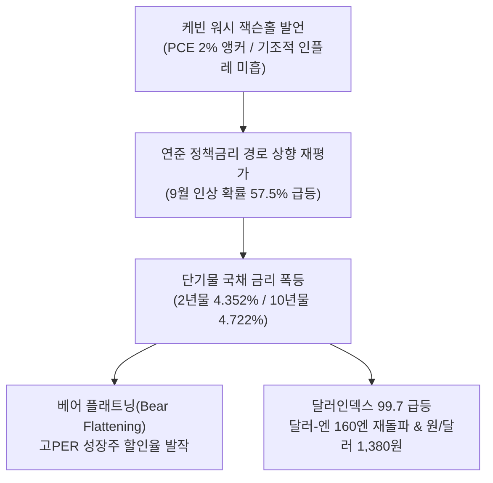
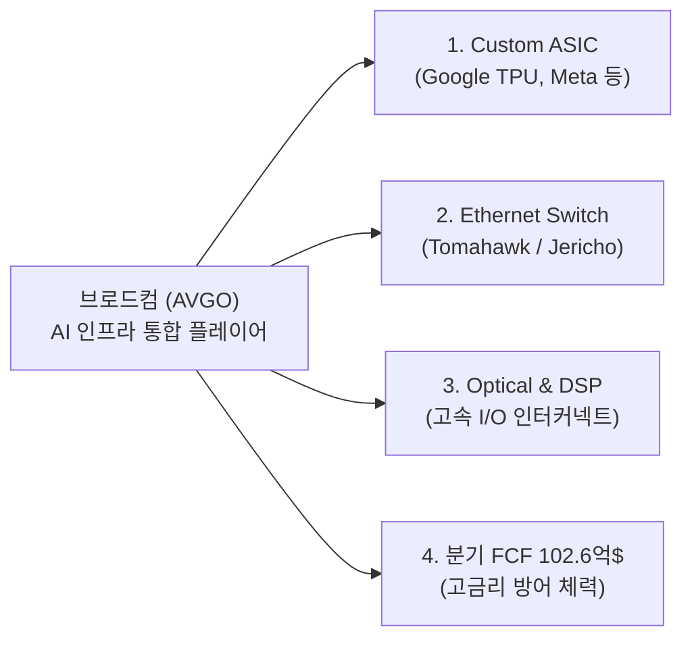
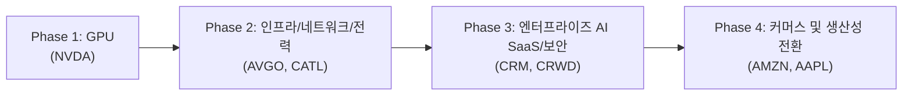
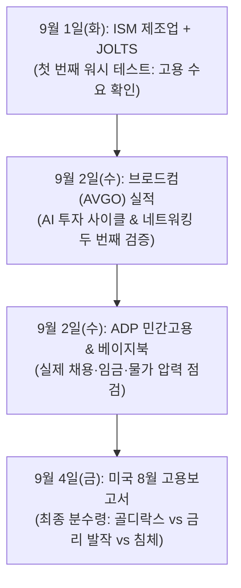
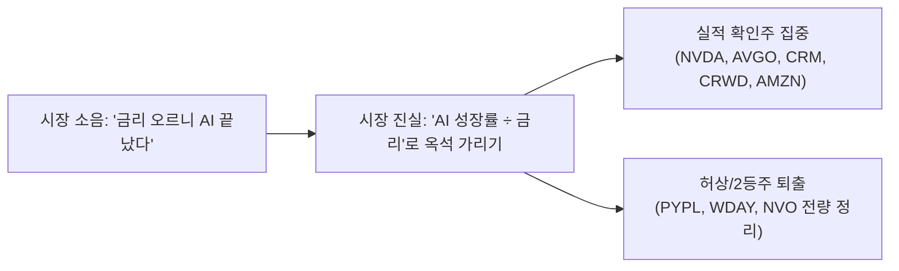

# 2026년 08월 31일(월) 하루치 뉴스정리

- **작성일**: 2026-08-31

AI 펀더멘털의 수요 둔화가 아니라 시장의 평가 프레임이 "AI 성장률"에서 "AI 성장률 ÷ 할인율(금리)"로 이동한 국면이며, 실질적인 현금흐름(FCF)과 과금력을 입증한 독점 기업으로 포트폴리오를 압축 재편해야 합니다.

## 요약

| 구분 | 주요 내용 |
| :--- | :--- |
| **핵심 결론** | AI 펀더멘털은 오히려 더 강력해졌으나, 잭슨홀 워시 발언 이후 **할인율(금리) 재평가 국면** 진입. 무차별 상승 장세에서 실적 가시성 검증 장세로 전환 |
| **매크로 변수** | 美 2년물 4.352%(+12bp)·10년물 4.722%(+5bp) 급등(베어 플래트닝), 달러-엔 160엔 재돌파 및 미 재무부(ESF) 개입 시인, 원/달러 1,380원 상방 압력 |
| **AI 사이클 진화** | Phase 1(GPU) → Phase 2(네트워킹/전력) → **Phase 3(엔터프라이즈 AI 소프트웨어/보안: CRM, CRWD)** → **Phase 4(소비 플랫폼: AMZN)**로 확산 |
| **이번 주 분수령** | 09/01(화) ISM 제조업·JOLTS → **09/02(수) 브로드컴(AVGO) 실적 발표** → 09/04(금) **미국 8월 고용보고서** |
| **행동 지침** | 사모펀드 매각설·해자 붕괴 2등주(`PYPL`, `WDAY`, `NVO`) 즉시 정리, 실적 확인 독점주(`NVDA`, `AVGO`, `CRM`, `CRWD`, `AMZN`) 분할 매수, 달러/단기채 버퍼 20~25% 확보 |

---

## 1. 매크로 팩트 분석: 워시가 바꾼 시장의 게임 룰

케빈 워시(Kevin Warsh) 연준 의장의 잭슨홀 연설은 명시적인 포워드 가이던스를 제시하지 않았으나, 시장의 통화정책 기대치를 근본적으로 뜯어고쳤습니다.

### 1.1 연준 정책 기조와 채권시장 지표

| 지표 / 항목 | 발표 수치 및 동향 | 실질적 시장 의미 |
| :--- | :--- | :--- |
| **12개월 / 6개월 PCE** | 12개월 3.7%, 6개월 4.1% | 연준의 2% 확고한 물가 목표를 크게 상회, 여름철 둔화는 일시적 현상으로 평가 |
| **CME FedWatch (9월)** | 금리 인상 확률 **57.5%**, 동결 43.1% | 잭슨홀 이전 동결 우세(60%대)에서 9월 추가 인상 베팅으로 급격한 프레임 전환 |
| **미국 2년물 국채 금리** | 4.3520% (**+12.00bp**) | 연준 통화정책 경로 재평가로 단기물 가격 폭락 (7월 FOMC 직전 레벨 상회) |
| **미국 10년물 국채 금리** | 4.7220% (**+5.00bp**) | 장기 기대 인플레이션 제압 기대 속에서도 단기금리 상승에 연동되어 동반 상승 |
| **미국 30년물 국채 금리** | 5.2080% (**+1.80bp**) | 10년-2년 스프레드 37bp로 축소 (베어 플래트닝 심화) |

- **① 베어 플래트닝의 본질**: 장기물 금리가 재정위기 우려로 폭발한 것이 아니라, 단기 정책금리 경로가 위로 재평가되면서 곡선이 평평해진 것입니다. "고용이 조금 둔화된다고 연준이 즉각 금리를 내려줄 것"이라는 시장의 나이브한 환상이 박살 났습니다.
- **② 글로벌 외환 방어선 균열**: 달러인덱스가 99.655로 치솟으며 달러-엔이 160엔을 재돌파했습니다. 스콧 베선트 미 재무장관은 엘리자베스 워런 상원의원 서한을 통해 "일본의 급격한 엔화 불안이 미 국채 매도 폭탄을 불러 국채 금리를 폭등시킬 위험이 있어, 환율안정기금(ESF)을 통해 엔화 매수 개입을 단행했다"고 공식 시인했습니다.

---

## 2. AI 반도체 분석: "AI 성장률 ÷ 할인율(금리)"의 법칙

  기업 가치 (Valuation)
  &equals;
  
    AI 실적 성장률 &times; 이익 가시성
    무위험 국채 금리(할인율) + 주식 위험 프리미엄
  

### 2.1 엔비디아(NVDA) 실적과 시장의 오독

| 실적 항목 | 2분기 공식 발표 | 시장 컨센서스 대비 | 차기 가이던스 |
| :--- | :--- | :--- | :--- |
| **총 매출 (Revenue)** | 962억 달러 (**+106% YoY**) | 대폭 상회 | 3분기 1,080억 달러 제시 |
| **데이터센터 매출** | 890억 달러 (**+117% YoY**) | 초격차 성장 지속 | 중국 데이터센터 매출 미반영 (순수 가시성) |
| **FY28 연간 성장률** | **약 70% 수준** | 월가 예상치(45%) 압도 | Vera Rubin 차세대 아키텍처 양산 가속 |
| **투자금 회수 기간 (ROI)** | 1년 미만 입증 | 하이퍼스케일러 수익성 확인 | 고객의 50%가 비-하이퍼스케일러(소버린/기업) |

- **주가 -4.57% 하락의 실체**: 실적이 망가진 것이 아닙니다. 2025년까지는 '좋은 실적'만으로 주가가 올랐다면, 국채 10년물 금리가 4.7%를 넘어선 2026년 현재는 **"극단적으로 높아진 시장 눈높이 ÷ 급등한 무위험 금리"**의 검증대를 통과해야 합니다.
- **클라우드 매출공유 중단 팩트**: 엔비디아가 중소 클라우드사에 대한 매출공유 및 금융지원을 일부 중단한 것은 반독점 규제 당국의 조사를 선제적으로 차단하고 고객 건전성을 정비하기 위한 합리적 조치입니다.

---

### 2.2 마벨(MRVL) -10% 급락이 주는 교훈

마벨 테크놀로지(MRVL)의 2분기 데이터센터 매출은 전년비 46% 증가하며 견고했으나, 주가는 10.28% 폭락했습니다.

- **원인 분석**: 구글과의 차세대 TPU 및 커스텀 ASIC 협력이라는 대형 호재의 실제 매출 반영 시점이 **FY29(2028년 말 이후)**로 확인되었습니다.
- **핵심 교훈**: 마벨의 사업이 훼손된 것이 아니라, **2028~2029년의 미래 스토리를 2026년 현재 주가에 너무 일찍 당겨 쓴 대가**를 치른 것입니다. 시장은 이제 '먼 미래의 파트너십'이 아닌 '다음 분기의 즉각적 현금'을 요구하고 있습니다.

---

### 2.3 이번 주 최대 분수령: 브로드컴(AVGO) 5대 체크포인트

브로드컴은 9월 2일(수) 미국 정규장 마감 후 실적을 발표합니다. 엔비디아가 GPU 수요를 증명했다면, 브로드컴은 **Custom ASIC과 데이터센터 네트워킹으로 AI CapEx가 확장되고 있는지**를 증명하는 최종 시험대입니다.

| 검증 영역 | 핵심 관전 포인트 | 성공 기준 (Bull) | 실패 위험 (Bear) |
| :--- | :--- | :--- | :--- |
| **① Q3 AI 반도체 매출** | 회사가 제시했던 160억 달러(+200% YoY) 상회 폭 | **165억 달러 이상** 달성 | 160억 달러 단순 부합 (기대 미달) |
| **② Q4 AI 매출 가이던스** | AI 매출 성장률의 재가속 여부 | Q4 가속 지속 제시 | 160억 → 165억 수준 성장 둔화 |
| **③ Custom ASIC 다변화** | 구글 외 Meta, OpenAI(Jalapeño) 양산 일정 | 신규 하이퍼스케일러 수주 확인 | 구글 의존도 지속 및 마벨 잠식 우려 |
| **④ AI 네트워킹 병목 해소** | Ethernet, 스위치, DSP, 광학 연결 성장세 | 네트워킹 매출 +50% 이상 가속 | 클러스터 확장 정체 신호 |
| **⑤ 밸류에이션 룸** | FY27 예상 EPS 기준 PER 약 19배 수준 | 멀티플 재평가(Re-rating) | 마벨형 실망 매물 출회 |

---

## 3. 구조적 대전환: AI 4단계 투자 사이클과 소프트웨어의 수익화

이번 뉴스에서 가장 주목해야 할 구조적 변화는 AI 투자가 단순 하드웨어를 넘어 **엔터프라이즈 소프트웨어의 실제 ARR(연간반복매출)과 커머스 소비 전환으로 진입했다는 팩트**입니다.

### 3.1 실적으로 증명된 AI 소프트웨어/보안의 약진

| 기업명 | 핵심 지표 및 실적 성과 | 주가 반응 및 시장 시사점 |
| :--- | :--- | :--- |
| **세일즈포스 (`CRM`)** | - cRPO **+14% YoY**, 매출 +11% - **Agentforce 단독 ARR 15억 달러** 달성 - Agentforce + Data 360 ARR 39억 달러 - 잉여현금흐름(FCF) **+81% YoY** 폭증 | 실적 발표 후 **+22.6% 급등**. "AI가 SaaS를 파괴한다"는 약세론을 짓밟고, 기존 독점 플랫폼이 AI를 얹어 과금력(ARPU)을 증대시킴을 입증 |
| **크라우드스트라이크 (`CRWD`)** | - 신규 ARR **3.33억 달러 (+51% YoY)** - 총 ARR 58.4억 달러 (+25% YoY) - Falcon Flex ARR **+101% 폭증** - AIDR 3배 급증 및 연간 가이던스 상향 | 글로벌 시스템 중단 사태를 딛고 에이전트 AI 도입에 따른 보안 현대화 수요 독점 입증 |

- **"AI를 말하는 회사" vs "AI로 돈 버는 회사"의 잔인한 분리**:
    - **승자 (CRM, CRWD)**: `AI 도입 → 사용량 증가 → 상향 계약 체결 → ARR/cRPO 급증`이라는 실질 수익화 플라이휠 작동
    - **패자 (WDAY)**: AI 도입을 말하지만, 오라클(ORCL) 및 SAP와의 경쟁에서 점유율을 잠식할 신제품을 내놓지 못해 목표가 줄하향 및 사모펀드 매각설로 연명

---

### 3.2 아마존(AMZN)의 Closed-Loop 에이전트 AI 독점력

에버코어 ISI(Evercore ISI) 조사에 따르면 아마존의 에이전트 AI 도입은 단순한 챗봇이 아닌 **실질 GMV(총거래액) 폭증 도구**로 작동하고 있습니다.

- **조사 데이터**:
    - 알렉사 AI 이용자의 **57%**가 "기존에 알지 못했던 제품을 AI 추천으로 구매했다"고 응답
    - 알렉사 AI 이용자의 **36%**가 "AI 기능 도입 이후 아마존 구매 물량이 증가했다"고 응답
    - 온라인 소매 침투율: 아마존 **92%** vs 2위 월마트 **58%** (격차 34%p)
    - Prime 회원의 일일 지출: 비회원 대비 **3.1배** (역대 최고치)
- **플랫폼 해자의 본질**:
    - 기존 검색 경로(`검색 → 광고 노출 → 클릭 → 비교 → 구매`)의 구매 마찰(Friction)을 에이전트 AI가 `의도 파악 → 최적 추천 → 즉각 결제`로 단축
    - 아마존은 **[AI 알고리즘 + 상품 카탈로그 DB + 실사용자 리뷰 + 물류 인프라 + Prime 결제망]**을 모두 폐쇄형으로 쥐고 있어 모델 개발사보다 훨씬 직접적으로 돈을 쓸어 담는 구조를 완성했습니다.

---

## 4. 대중의 눈먼 착시 (Illusion) 교정

### 착시 ① "워시가 매파로 나왔으니 AI 기술주는 끝났다"
- **착시의 실체**: 멍청한 개미들은 국채 금리 상승 헤드라인에 놀라 우량주를 던집니다.
- **교정 팩트**: AI 수요(NVDA 가이던스 $108B, CRM Agentforce ARR $15B, AFRM GMV +36%)는 숫자로 확인되고 있습니다. 이번 조정은 성장 둔화가 아니라 **'금리 상승에 따른 밸류에이션(PER) 디레이팅'**입니다. 실적이 뒷받침되는 독점 기업의 PER 압축은 공포가 아니라 기회입니다.

### 착시 ② "마벨 급락을 보니 커스텀 ASIC 시장은 거품이다"
- **착시의 실체**: 마벨이 실적 후 -10% 빠졌으니 구글 맞춤형 반도체 테마가 끝났다고 착각합니다.
- **교정 팩트**: 구글과의 협력은 사실이며 데이터센터 매출은 46% 성장 중입니다. 시장이 2028년 이후의 미래를 2026년에 너무 과도하게 당겨 반영했던 시차의 문제입니다.

### 착시 ③ "AI 에이전트가 나오면 SaaS 기업들은 다 망한다"
- **착시의 실체**: 코파일럿과 LLM이 기업용 소프트웨어를 대체할 것이라는 막연한 공포입니다.
- **교정 팩트**: 기업 내부의 중요 데이터와 워크플로우를 장악하지 못한 AI 스타트업이 소멸하는 것이며, 세일즈포스처럼 플랫폼을 쥔 기업은 에이전트를 장착해 객단가를 올리고 있습니다.

### 착시 ④ "페이팔 500억 달러 인수설이나 바이오 호재로 한탕 칠 수 있다"
- **착시의 실체**: 페이팔 인수설 찌라시 추격 매수, 모더나 FDA 승인 뉴스 매수.
- **교정 팩트**: 페이팔은 스트라이프 컨소시엄의 인수 철회로 15% 폭락했습니다. 애플페이에 짓밟힌 2등 결제사는 사모펀드도 버립니다. 모더나는 백신 승인 이면에 **0% 무이자 전환사채(CB) 26억 달러(옵션 포함 30억 달러)**를 찍어내 주주가치 희석 우려를 키웠습니다.

---

## 5. 스마트 머니(Smart Money)의 자산 우선순위

스마트 머니는 소음에 흔들리지 않고 가격과 실적이 가리키는 4단계 우선순위에 따라 자금을 재배치하고 있습니다.

| 우선순위 | 해당 종목 / 자산 | 투자 판단 | 핵심 근거 |
| :---: | :--- | :---: | :--- |
| **1순위** | **엔비디아 (`NVDA`), 브로드컴 (`AVGO`)** | **핵심 비중 유지 / 눌림목 매수** | AI CapEx 피크아웃 증거 없음, FY28 70% 성장 및 ASIC/네트워킹 병목 장악 |
| **2순위** | **세일즈포스 (`CRM`), 크라우드스트라이크 (`CRWD`)** | **적극 비중 확대** | AI가 실제 ARR(+51%)과 cRPO(+14%)로 전환되는 소프트웨어/보안 주도주 |
| **3순위** | **아마존 (`AMZN`), 애플 (`AAPL`)** | **안정적 매수** | 에이전트 AI 기반 GMV 전환율 57% 및 구독료 인상(Apple TV+) 독점력 |
| **4순위** | **마벨 (`MRVL`), 어펌 (`AFRM`)** | **조건부 관망 (Watchlist)** | MRVL: 10월 투자자의 날 수익화 경로 점검 / AFRM: 호실적이나 단기 급등에 따른 추격 자제 |
| **퇴출 대상** | **`PYPL`, `WDAY`, `NVO`, `MRNA`** | **전량 매도 / Pass** | PYPL: 인수 무산 본업 시험 / WDAY: 점유율 상실 / NVO: 특허 절벽 / MRNA: 대규모 희석 |

---

## 6. 이번 주 시장을 결정할 4대 일정 및 시나리오 로드맵

### 6.1 주간 핵심 일정 체크포인트
- **① 9월 1일 (화) ISM 제조업 PMI & JOLTS 구인보고서**: 
    - 구인 건수가 예상(739만 건)을 크게 상회할 경우 2년물 국채 금리 추가 상승 및 성장주 압박
- **② 9월 2일 (수) 브로드컴(AVGO) 실적 발표 (장 마감 후)**:
    - 엔비디아(GPU)에 이어 브로드컴(ASIC + 네트워킹)까지 서프라이즈를 내면 "AI CapEx Peak" 논란 완전 종식
- **③ 9월 2일 (수) ADP 민간고용 보고서 & 연준 베이지북**:
    - 기업들의 실제 임금 상승률 둔화 여부 확인
- **④ 9월 4일 (금) 미국 8월 고용보고서 (Non-farm Payrolls)**:
    - 시장 예상치: 비농업 고용 **+4.5만 ~ +5.8만 명**, 실업률 **4.1%**

---

### 6.2 8월 고용보고서 3대 시나리오 매트릭스

| 시나리오 구분 | 비농업 고용 수치 | 국채 금리 및 시장 해석 | 판정 및 전략적 행동 |
| :--- | :--- | :--- | :---: |
| **골디락스 (Goldilocks)** | **+3.0만 ~ +7.0만 명** (실업률 4.1% 유지) | 2년물 금리 하락, 9월 인상 베팅 완화 → **AI 및 대형 기술주 강력한 안도 랠리** | **최상 (적극 매수)** |
| **긴축 발작 (Worst)** | **+10.0만 명 이상** (고용 과열) | "물가도 높은데 고용도 탄탄하다" → 9월 인상 확률 70% 돌파, **기술주 추가 디레이팅** | **주의 (현금 버퍼 확대)** |
| **침체 공포 (Hard Landing)** | **-5.0만 명 이하 급감** (실업률 4.3% 이상) | 초기 금리 하락 호재이나, 시장 프레임이 "경기 침체"로 변질되며 전 섹터 투매 발생 | **위험 (방어주/현금 피신)** |

---

## 7. 포트폴리오 리밸런싱 가이드

| 자산군 / 종목 | 포지셔닝 | 구체적 실행 지침 |
| :--- | :---: | :--- |
| **엔비디아 (`NVDA`)** | **Hold / 눌림목 매수** | 펀더멘털 이상 없음. 금리 발작으로 인한 PER 압축 구간에서 분할 매수 집행 |
| **브로드컴 (`AVGO`)** | **Hold / 실적 확인** | 실적 전 전량 매도 금지. 5대 체크포인트 확인 후 비중 확대 여부 최종 결정 |
| **소프트웨어 (`CRM`, `CRWD`)** | **Buy (비중 확대)** | AI 수익화가 ARR/cRPO 숫자로 입증된 섹터 최선호주로 중기 포트폴리오 편입 |
| **빅테크 커머스 (`AMZN`)** | **Buy (비중 확대)** | 에이전트 AI 기반 구매 전환율 증명, 소비 마찰 해소에 따른 GMV 성장 수혜 |
| **좀비 2등주 (`PYPL`, `WDAY`)** | **Sell (전량 손절)** | M&A 찌라시 및 막연한 반등 기대 제거, 성장 가시성 확인 전까지 완전 배제 |
| **바이오 위험주 (`MRNA`, `NVO`)** | **Pass / 매도** | MRNA: 26억$ CB 발행에 따른 희석 리스크 경계 / NVO: 특허 절벽 우려 반영 매도 |
| **달러 현금 / 단기 국채** | **20 ~ 25% 유지** | 원/달러 1,380원 상방 압력 활용 및 4%대 후반 T-Bills 파킹으로 저점 매수 실탄 장전 |

---

## 8. 최종 종합 결론 및 실행 제언

### 8.1 종합 결론 (Executive Summary)

- **AI 전체 매수에서 '실적이 기대를 증명하는 AI 기업만 매수'하는 장세로의 전환**:
    - 시장은 "AI 테마"만 붙으면 무차별 급등하던 유아기적 단계를 벗어났습니다.
    - 이제는 **[AI 수요 가속 + 인프라 CapEx 지속 + 소프트웨어 ARR 수익화 + 잉여현금흐름(FCF)]**을 숫자로 증명하는 최상위 독점 기업만이 높은 할인율(금리)을 뚫고 살아남습니다.
- **브로드컴(AVGO) 실적의 진정한 의미**:
    - 9월 2일 브로드컴이 160억 달러를 크게 넘어서고 차기 가이던스 가속을 확인시켜준다면, 지금의 반도체 조정은 AI 사이클 종료가 아니라 **'금리 충격에 의한 건전한 밸류에이션 리셋'**으로 확정됩니다.

---

### 8.2 핵심 행동 원칙 (Action Rules)

!!! tip "냉혹한 투자 실행 원칙"
    1. **숫자가 없는 기업에 자비를 베풀지 마라**: 인수설 루머로 연명하는 페이팔(PYPL)이나 점유율을 잃어가는 워크데이(WDAY) 같은 좀비 기업은 당장 계좌에서 도려내십시오.
    2. **AI 수익화의 3·4단계를 선점하라**: 세일즈포스(CRM)와 크라우드스트라이크(CRWD)의 ARR 폭증, 아마존(AMZN)의 에이전트 AI 커머스 전환은 새로운 주도 섹터의 탄생을 알리는 신호탄입니다.
    3. **브로드컴 실적과 고용보고서 전까지 뇌동매매를 금지하라**: 9월 2일 AVGO 실적과 9월 4일 고용보고서(골디락스 여부)를 차분히 확인한 후, 장전해 둔 20~25%의 달러 실탄으로 가격 매력도가 극대화된 1~2순위 핵심 독점주를 분할 매수하십시오.
