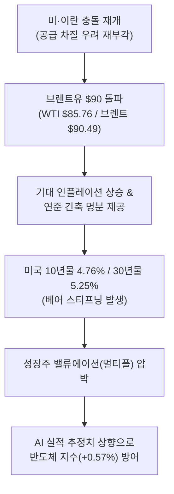
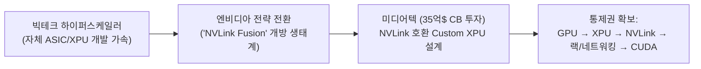
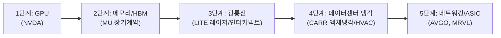
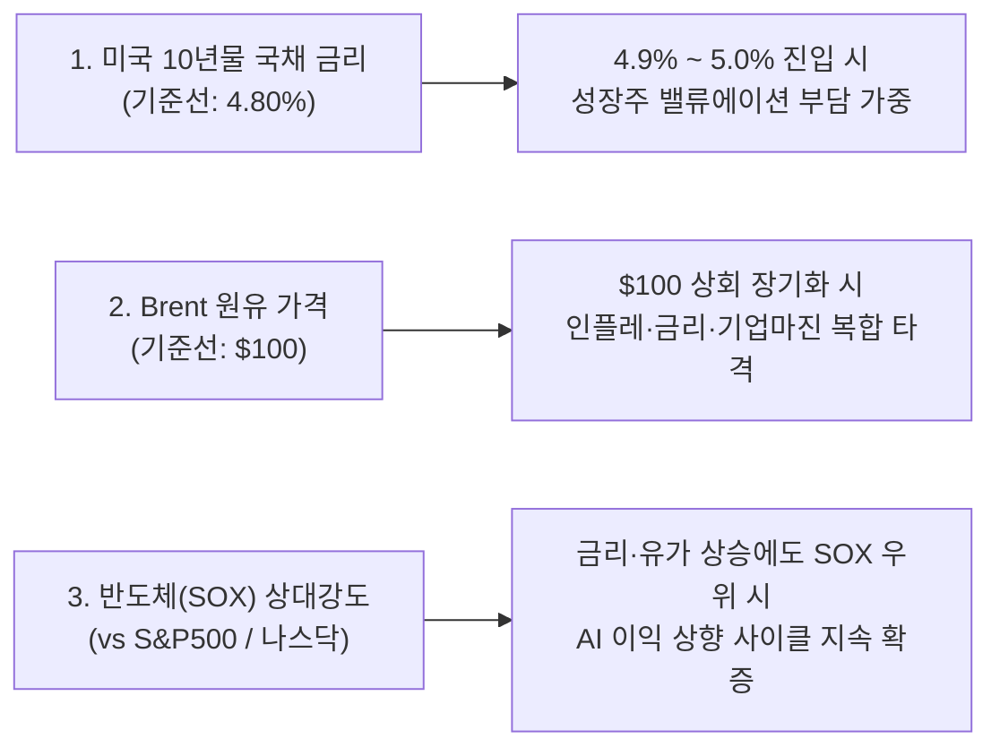
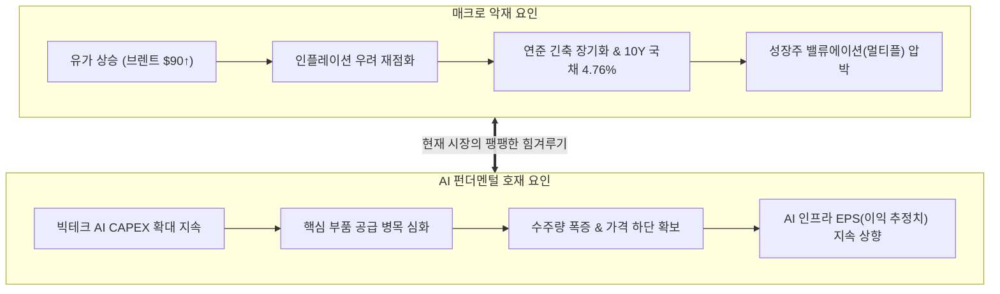

# 2026년 09월 01일(화) 하루치 뉴스정리

- **작성일**: 2026-09-01

거시 환경은 유가 $90 돌파와 10년물 국채 금리 상승(베어 스티프닝)으로 거칠어졌으나, AI 반도체와 인프라의 강력한 이익 추정치 상향 속도가 매크로 악재를 방어하고 있으며, 실질 수주와 공급 병목을 쥔 핵심 밸류체인으로 압축 대응해야 합니다.

## 요약

| 구분 | 주요 내용 |
| :--- | :--- |
| **핵심 정의** | 거시는 상당히 더러워졌으나(유가·장기금리 상승), **AI 인프라의 이익 추정치 상향 속도가 거시 악재를 견인**하는 국면 |
| **매크로 동향** | S&P500 -0.33%, 나스닥 -0.12% 대비 **필라델피아 반도체 +0.57%**. WTI $85.76, 브렌트 $90.49, 美 10년물 4.76%(베어 스티프닝) |
| **AI 판도 변화** | **NVDA-미디어텍($35억 CB)**: 하이퍼스케일러 자체 칩을 NVLink 생태계로 포섭하는 플랫폼 방어 전략 |
| **병목의 이동** | GPU 단일 하드웨어 → **HBM(MU) → 커스텀 ASIC/네트워크(MRVL, AVGO) → 광통신(LITE) → 액체냉각(CARR)** |
| **매일 3대 지표** | ① 미국 10년물 국채 금리 **4.8%** 돌파 여부 / ② Brent 유가 **$100** 지속 여부 / ③ 반도체(SOX) 지수의 **상대강도** |
| **행동 원칙** | 막연한 추격 매수 자제, 1군 Watchlist(`MU`, `MRVL`, `CARR`, `NVDA`) 중심 실적 가시성 기반 선별 분할 접근 |

---

## 1. 매크로 팩트 분석: 유가 $90 돌파와 장기금리의 실체

### 1.1 금리보다 더 골치 아픈 '유가 + 장기금리(베어 스티프닝)'
- **채권시장 동향**: 미 2년물 금리는 약 4.35%에서 횡보했으나, **10년물이 4.76%, 30년물이 5.25% 부근까지 상승**했습니다.
- **베어 스티프닝(Bear Steepening)의 위험성**:
    - 단순히 "연준이 기준금리를 25bp 올린다"는 단기 정책 변수가 아닙니다.
    - **[장기 인플레이션 기대 + 기간 프리미엄 + 재정 적자 우려]**가 장기물에 얹히는 베어 스티프닝 성격이 강합니다.
    - 성장주 관점에서는 기준금리 1회 인상보다 **10년물 국채 금리가 4.8% → 5.0%로 지속 상승하는 것이 밸류에이션에 훨씬 더 치명적**입니다.

### 1.2 금융시장의 전쟁 리스크 반영 수준
- **자산 가격 반응**:
    - WTI +2.83%($85.76), 브렌트 +2.71%($90.49) 상승 ([마켓스크리너](https://www.marketscreener.com/news/oil-jumps-more-than-2-after-us-attack-on-iran-s-larak-island-ce7858dcda81f42c?utm_source=chatgpt.com))
    - S&P500 -0.33%, 나스닥 -0.12%, **VIX 14.92(안정권)**, **필라델피아 반도체 +0.57%**
- **팩트 판정**:
    - 금융시장은 현재 "전면전 및 호르무즈 해협 봉쇄"가 아닌 **제한적 국지 충돌**에 무게를 두고 있습니다.
    - 진짜 악재는 전쟁 뉴스 자체보다, **유가가 $90대에서 장기화되며 연준의 긴축 장기화 명분을 제공하는 것**입니다. 브렌트유가 $100 위로 안착하기 시작하면 시장의 해석은 완전히 달라집니다.

---

## 2. 대중의 2대 착시(Illusion) 교정

### 착시 ① "9월 금리 인상 확률 65% → 금리 인상 확정이다"
- **착시의 실체**: 확률 지표 하나만 보고 긴축 공포에 질려 성장주를 투매합니다.
- **교정 팩트**:
    - 케빈 워시 연준 의장은 인플레이션 미흡 시 추가 조치 가능성을 언급했을 뿐, 9월 인상을 확정한 적이 없습니다.
    - 외부 기관별 시장 확률은 약 57~65% 수준이며, Barclays 등 일부 IB는 9월·12월 각 25bp 인상을 보지만 시장 합의가 완료된 것은 아닙니다. ([The Motley Fool](https://www.fool.com/investing/2026/08/31/fed-chair-warshs-jackson-hole-debut-what-he-said-a/?utm_source=chatgpt.com))
    - 9월 4일 고용보고서와 향후 CPI 결과에 따라 이 확률은 즉시 30~40%대로 급락할 수 있습니다.

---

### 착시 ② "마이크론(MU)은 올해 3배 올랐으니 너무 비싸다"
- **착시의 실체**: 연초 대비 주가 상승 폭(3배)만 보고 밸류에이션 부담을 예단합니다.
- **교정 팩트**:
    - 주가는 3배 상승했으나 **12개월 선행 PER은 약 6배** 수준에 불과합니다.
    - **SEC 공식 공시로 확인된 구조 변화**:
        - 마이크론의 장기 고객 계약(LTA)에는 **Take-or-pay(미인수 시 위약금), 계약 물량 보장, 가격 상/하단 밴드 설정, 일부 고정가격** 구조가 명시되어 있습니다. ([SEC 공식 공시](https://www.sec.gov/Archives/edgar/data/723125/000072312526000015/mu-20260528.htm?utm_source=chatgpt.com))
        - 회사는 계약상 **가격 하단에서도 과거 메모리 사이클 최고점 이상의 매출총이익률(Gross Margin)을 달성 가능**하다고 설명합니다.

| 과거 메모리 사이클 | 2026년 변화된 메모리 구조 |
| :--- | :--- |
| 호황 → 무차별 증설 → 공급 과잉 → 가격 폭락 → 이익 붕괴 | **HBM 극심한 공급 부족 → 장기 LTA 계약 → 가격 하단 확보 → 이익 변동성 축소** |

!!! note "마이크론 밸류에이션 판정"
    이익 변동성이 통제되는 구조적 변화로 인해 **MU의 선행 PER 6배는 강력한 리레이팅(Re-rating) 근거**를 갖춥니다. 다만 중국 업체의 레거시 증설과 글로벌 CAPEX 증가는 지속적인 추적 요소입니다.

---

## 3. AI 인프라 판도 변화: 엔비디아의 미디어텍 투자 본질

엔비디아가 미디어텍(MediaTek) 전환사채(CB)에 35억 달러를 투자하고, 미디어텍은 NVLink Fusion을 기반으로 커스텀 XPU를 설계한다고 공식 발표했습니다. ([NVIDIA Investor Relations](https://investor.nvidia.com/news/press-release-details/2026/NVIDIA-and-MediaTek-Deepen-Long-Standing-Partnership-to-Build-AI-Edge-to-Cloud-Computing-Platforms/default.aspx?utm_source=chatgpt.com))

- **표면적 해석**: "엔비디아가 커스텀 칩 설계 시장에 진출한다."
- **본질적 전략**:
    - 엔비디아는 빅테크 하이퍼스케일러들이 비용과 전력 효율을 위해 자체 ASIC/XPU를 도입하는 흐름을 완벽히 차단할 수 없음을 간파했습니다.
    - 전략의 전환: **"자체 칩을 만들어도 좋다. 단, 엔비디아의 NVLink 네트워크 생태계 안에서 만들어라."**
    - 엔비디아가 방어하려는 핵심은 단순 GPU 판매량 1개가 아니라 **[GPU → XPU → NVLink → 랙 시스템 → 네트워킹 → CUDA/소프트웨어]로 이어지는 전체 AI 인프라의 표준 장악력**입니다. ([TechCrunch](https://techcrunch.com/2026/08/31/nvidias-3-5b-mediatek-bet-reveals-its-plan-for-tackling-big-techs-ai-chip-buildout/?utm_source=chatgpt.com))

---

## 4. 커스텀 ASIC 시장 분석: 브로드컴(AVGO)과 마벨(MRVL)의 진실

미디어텍의 진입이 기존 커스텀 실리콘 강자인 브로드컴(AVGO)과 마벨(MRVL)에 미치는 영향에 대한 정밀 진단입니다.

| 분석 관점 | 팩트 및 진단 | 시장 의미 |
| :--- | :--- | :--- |
| **장기 경쟁 강도 상승 (맞는 부분)** | 미디어텍이 NVLink Fusion을 등에 업고 진입함에 따라 **Broadcom / Marvell / MediaTek 3자 경쟁 구도** 형성 | 브로드컴의 독점적 지위가 영구불변할 것이라는 가정은 재검토 필요 |
| **시장 파이의 급팽창 (틀린 부분)** | "브로드컴/마벨이 끝났다"는 주장은 허구. **커스텀 AI 칩 전체 시장(TAM)이 기하급수적으로 확대** 중 | 개별 점유율 경쟁보다 시장 전체 성장 속도가 훨씬 빠름 |

### 마벨(MRVL) Q2 실적으로 본 인프라 확장 속도
마벨의 지난주 공식 2분기 실적 발표는 AI 커스텀 인프라의 폭발적 성장을 숫자로 증명했습니다. ([Marvell SEC Filing](https://investor.marvell.com/sec-filings/all-sec-filings/content/0001835632-26-000022/q227_8kx812026ex-991.htm?utm_source=chatgpt.com))

- **Q2 전체 매출**: 27.39억 달러 (**+37% YoY**)
- **데이터센터 부문 매출**: 21.72억 달러 (**+46% YoY**, 전체 매출 비중 79%)
- **FY28 연간 가이던스 상향**: 예상 매출 약 180억 달러, **연간 성장률 전망 기존 약 45% → 약 50%로 상향**

!!! tip "브로드컴(AVGO)에 대한 최종 판정"
    **단기 실적 악재 없음 / 장기 경쟁 강도 상승 유효 / AI ASIC TAM(시장 규모) 폭발적 확대 확인**으로 정리할 수 있습니다.

---

## 5. 스마트 머니의 돈길: AI 인프라 병목 이동과 투자 우선순위

AI 자본 지출(CAPEX)의 병목 지점이 GPU에서 전력, 광통신, 냉각, 고속 인터커넥트로 급격히 이동하고 있습니다.

### 5.1 AI 자산군 6단계 우선순위 매트릭스

| 순위 | 영역 | 판단 및 핵심 근거 |
| :---: | :--- | :--- |
| **1** | **메모리 / HBM** | **가장 확실한 공급 부족**, LTA를 통한 가격 하단 및 이익 변동성 통제 확인 |
| **2** | **커스텀 실리콘 · 네트워킹** | 빅테크 자체 칩 수요 및 인프라 확장으로 실적 추정치 지속 상향 |
| **3** | **광통신 (Optical)** | 공급 자체가 극심한 병목 현상 직면 (생산능력 증설을 초과하는 수요) |
| **4** | **데이터센터 냉각 (Cooling)** | 고밀도 AI 랙 구축에 따른 **AI CAPEX 2차 수혜** (비교적 저렴한 밸류에이션) |
| **5** | **AI 소프트웨어** | 에이전트 도입에 따른 실제 ARR/ARPU 창출 기업 선별 단계 |
| **6** | **AI 소비자 서비스** | 트래픽의 실질 광고/구독 수익화 증명 초기 단계 |

---

### 5.2 2차 수혜 핵심 종목 딥다이브

#### 루멘텀 (Lumentum, `LITE`): 공급 부족이 부른 병목
- **인듐인화물(InP) 레이저 및 광학 인터커넥트 공급난**:
    - 회사가 EML(전계흡수변조 레이저) 생산능력을 FY23 이후 **8배 증설했음에도 불구하고 수요 대비 공급이 30% 이상 부족**한 상태입니다.
    - Evercore는 FY28 EPS를 $35, 강세 시 $45~$50까지 전망하고 있습니다.
- **핵심 통찰**: 목표주가 숫자보다 **"생산능력을 8배 늘려도 수요를 못 따라간다"**는 공급 병목 팩트가 핵심입니다.

#### 캐리어 (Carrier, `CARR`): AI 냉각과 본업 턴어라운드의 이중 엔진
- **실적 지표**: 데이터센터 관련 냉각 주문 **YoY +300% 이상 폭증**, 미국 주거용 HVAC 매출도 **+9%**로 회복세 진입.
- **밸류에이션 매력**: 고점 대비 약 20% 조정을 거쳐 **12개월 선행 PER 약 18배** 수준에 거래 중.
- **핵심 통찰**: GPU 기업처럼 40~60배의 멀티플 부담 없이, **[AI 데이터센터 냉각 + 기존 HVAC 경기 회복]**이라는 2개의 실적 엔진을 보유한 모범적 2차 수혜 후보입니다.

---

## 6. 생태계 확장 팩트 체크: AMD, SaaS, OpenAI, SpaceX, Apple, MSTR

### 6.1 AMD · Cisco · 사우디 HUMAIN 인프라 가동
- AMD·Cisco·사우디 HUMAIN은 **MI355X 가속기 기반 AI 인프라를 공식 가동**했으며, 2027년 최대 250MW, 2030년 1GW까지 확장하겠다고 발표했습니다. ([Cisco 뉴스룸](https://newsroom.cisco.com/c/r/newsroom/en/us/a/y2026/m08/amd-cisco-and-humain-expand-saudi-arabia-ai-infrastructure.html?utm_source=chatgpt.com))
- **시사점**: AI 인프라 시장은 NVDA 1개 기업의 독식 구도가 아니며, 고객사의 공급망 다변화 요구로 인해 AMD, 커스텀 ASIC, Ethernet 생태계가 동반 팽창하는 비(非)제로섬 시장입니다.

### 6.2 SaaS-mageddon의 실체: 옥석 가리기
- **세일즈포스 (`CRM`)**: "AI 에이전트가 SaaS를 대체한다"는 공포를 깨고 실적 성장 가속을 증명, Argus는 목표주가를 $300으로 상향.
- **워크데이 (`WDAY`)**: AI ARR이 6억 달러를 돌파했으나 실제 수익화 및 확장 속도가 시장 기대에 미달.
- **판정 기준**: `AI 도입 → 고객당 매출(ARPU) 증가 → 갱신율 상승 → 마진 확대`가 재무제표 숫자로 확인되는 플랫폼 기업만 선별해야 합니다.

### 6.3 OpenAI 연환산 광고 매출 10억 달러($1B) 돌파
- ChatGPT 광고 도입 200일 미만에 연환산 매출 10억 달러 달성 및 주간 활성 사용자(WAU) 10억 명 돌파. ([OpenAI 공식 발표](https://openai.com/index/expanding-access-to-ai-with-chatgpt-ads/?utm_source=chatgpt.com))
- **본질**: 구글·메타 광고의 즉각적 붕괴가 아니라, **AI 서비스가 [구독 + API + 엔터프라이즈 + 광고]로 수익 모델을 다각화**하며 인프라 CAPEX를 지탱할 자체 체력을 확보하기 시작했다는 점이 핵심입니다.

### 6.4 노이즈성 뉴스 팩트 체크 (과도한 환상 배제)
- **SpaceX 궤도 데이터센터**: 2027년 구축 시작, 2028년 네트워크 확대, 의미 있는 실적은 2029년 이후로 당장의 EPS 상향 요인이 아닌 장기 내러티브 영역입니다.
- **Apple 존 터너스 CEO 취임 (9/1)**: 이미 4월 21일 공식 발표된 기지(旣知)의 이벤트입니다. ([Apple Newsroom](https://www.apple.com/ph/newsroom/2026/04/tim-cook-to-become-apple-executive-chairman-john-ternus-to-become-apple-ceo/?utm_source=chatgpt.com)) 향후 관전 포인트는 AI M&A 속도와 아이폰 교체 수요 창출 여부입니다.
- **MicroStrategy (MSTR) 비트코인 4,603개 매수**: 6.03억 달러 규모의 보통주 매각(증자)을 통한 매수입니다. NAV 프리미엄 붕괴 시 [BTC 하락 + 프리미엄 축소 + 주식 희석]의 복합 위험이 발생하므로 순수 BTC 보유와 동일시할 수 없습니다.

---

## 7. 종목별 종합 투자 판정 및 착시 vs 현실 대조표

### 7.1 세부 종목별 투자 판정 등급

| 등급 | 종목 티커 | 투자 매력도 및 핵심 판단 |
| :---: | :--- | :--- |
| **A** | **마이크론 (`MU`)** | **최우선 연구 대상**. 단순 호황을 넘어 LTA 기반 이익 변동성 축소 확인. 선행 PER 6배는 강력한 리레이팅 기회 |
| **A-** | **마벨 (`MRVL`)** | FY28 매출 180억 달러(+50% 성장) 전망 상향. 데이터센터 매출 비중 79%로 가파른 실적 개선 |
| **A-** | **캐리어 (`CARR`)** | 데이터센터 냉각 수주 +300% 폭증 및 HVAC 본업 회복. 선행 PER 18배로 밸류에이션 부담이 적은 2차 수혜주 |
| **A-** | **엔비디아 (`NVDA`)** | 미디어텍 투자를 통한 XPU 및 NVLink 생태계 통제권 방어 전략 탁월 |
| **B+** | **루멘텀 (`LITE`)** | 생산능력 8배 증설에도 30% 공급 부족. 병목 해자 확실하나 단기 주가 반영 폭 감안 분할 접근 |
| **B+** | **AMD / CSCO** | 사우디 기가와트 프로젝트 가동으로 실질 수주 단계 진입. 중장기 멀티벤더 수요 수혜 |
| **B+** | **세일즈포스 (`CRM`)** | SaaS 붕괴론 극복 및 Agentforce 실적 가시화. 순증 매출 연결 추적 필요 |
| **B+** | **HPE / DELL** | AI 서버 채널 체크 강력하나 실적 발표 전 가격 매력도 점검 필요 |
| **B** | **에어비앤비 (`ABNB`)** | Experiences 등록 +30% 긍정적이나 본업 숙박 대비 기여도 및 테이크레이트 검증 필요 |
| **C+** | **워크데이 (`WDAY`)** | AI ARR 6억 달러 달성에도 불구하고 실제 수익화 전환 속도가 더딤 |
| **C** | **페이팔 (`PYPL`)** | 저PER 함정(Value Trap) 경계. 본업 결제의 구조적 성장 동력 부재 |
| **C** | **MSTR** | 보통주 증자 기반 레버리지 매수 구조로 NAV 프리미엄 축소 및 주주가치 희석 리스크 내포 |
| **D** | **PCG / EIX** | 금리 변수가 아닌 산불 책임 및 법률 정책 리스크. 불확실성 해소 전까지 관망 |

---

### 7.2 대중이 보는 착시 vs 스마트 머니가 보는 현실

| 대중이 주목하는 소음 (Noise) | 투자자가 확인해야 할 현실 (Reality) |
| :--- | :--- |
| **미·이란 국지 충돌 뉴스** | 브렌트유가 얼마나 오래 **$90 이상**을 유지하며 인플레를 자극하는가 |
| **9월 금리 인상 확률 65%** | 고용보고서와 CPI 지표가 실제 인상 경로를 지지하는가 |
| **마이크론 주가 3배 급등** | **선행 PER 6배**와 장기 LTA 계약으로 이익 하단이 보장되는가 |
| **NVDA vs Custom ASIC 제로섬** | 엔비디아가 NVLink를 통해 ASIC까지 자체 생태계로 포섭하는가 |
| **SaaS 전면 붕괴 공포** | AI 도입이 실제 ARPU·성장률·영업마진 개선으로 이어지는 승자가 누구인가 |
| **OpenAI 연환산 광고 10억$** | AI 서비스의 수익화(Monetization) 수단이 전방위로 다각화되고 있는가 |
| **SpaceX 우주 데이터센터** | 2029년 이전에는 실적 기여가 없는 장기 미래 내러티브 |
| **Apple CEO 교체 (존 터너스)** | 4개월 전 기발표된 일정이며, 향후 관건은 AI M&A 및 아이폰 교체 수요 |

---

## 8. 매일 점검해야 할 3대 지표 및 행동 지침

### 8.1 시장의 방향을 가를 3대 핵심 숫자

1. **미국 10년물 국채 금리 4.80%**:
    - 4.76% 레벨에서 4.8%를 돌파해 4.9~5.0%로 확장되면 성장주 전반의 멀티플 압축이 가속화됩니다.
2. **Brent 원유 $100**:
    - $90는 부담스러운 수준이나 소화 가능합니다. 그러나 $100 위에서 안착하면 인플레이션 → 금리 → 소비 둔화 → 기업 마진 축소로 이어지는 연쇄 충격이 발생합니다.
3. **반도체(SOX) 상대강도**:
    - 10년물 금리와 유가가 동반 상승하는 악조건에서도 필라델피아 반도체 지수가 시장(S&P, 나스닥)을 아웃퍼폼한다면 AI 이익 추정치 상향 사이클이 유효하다는 명백한 증거입니다.

---

### 8.2 포트폴리오 티어별 관심 목록 (Watchlist)

| 구분 | 해당 종목군 | 운용 및 포지셔닝 전략 |
| :--- | :--- | :--- |
| **1군 Watchlist** | **`MU`, `MRVL`, `CARR`, `NVDA`** | 실적 추정치 상향 및 공급 병목 주도주. 눌림목 발생 시 최우선 분할 매수 |
| **2군 Watchlist** | **`LITE`, `AMD`, `CSCO`, `CRM`, `HPE`, `DELL`** | 인프라 다변화 및 2차 수혜 확인주. 가격 지지선 확인 후 선별 접근 |
| **Wait for Proof** | **`ABNB`, `AFRM`, `WDAY`** | 사업 모델의 지속적 성장성 및 AI 수익화 수치 확인 시까지 대기 |
| **Pass / 제외** | **`PYPL`, `PCG`, `EIX`, `MSTR`** | 펀더멘털 정체, 정책/법률 리스크, 과도한 희석 구조 종목으로 편입 배제 |

---

## 9. 종합 결론 및 투자 실행 원칙

### 9.1 종합 결론 (Executive Summary)

현재 시장은 거시적 악재와 미시적 펀더멘털 호재가 치열하게 힘겨루기를 펼치는 국면입니다.

- **시장 진단의 핵심**:
    - 지금 당장 저지를 수 있는 가장 큰 실수는 **"전쟁 났다 → 주식 전량 매도"**로 패닉에 빠지거나, **"AI 좋다 → 아무 기술주나 맹목적 매수"**하는 나이브한 접근입니다.
    - 현재까지는 AI 인프라의 이익 추정치 상향 속도가 장기금리 및 유가 상승에 따른 멀티플 하락 압력을 이겨내고 있습니다. 따라서 **AI 랠리의 구조적 종료로 볼 근거는 없습니다.**
- **달라진 장세의 성격**:
    - 과거처럼 "AI 테마"만 붙으면 PER 멀티플을 무한정 띄워주던 유동성 장세는 종료되었습니다.
    - 이제 돈이 향하는 곳은 **[실제 수주가 넘치고, 공급이 부족하며, 장기계약(LTA)으로 가격 하단을 방어하고, 향후 EPS 추정치가 상향되는 기업]**으로 명확히 압축됩니다.

---

### 9.2 핵심 투자 실행 원칙 (Action Rules)

| 실행 단계 | 핵심 행동 지침 | 목표 대상 및 기준 |
| :--- | :--- | :--- |
| **원칙 1: 실적과 공급 병목에 집중** | 단순 내러티브나 먼 미래 스토리주를 배제하고, 실질 병목과 LTA 계약을 쥔 핵심주로 압축 | 메모리(`MU`), 커스텀 ASIC(`MRVL`), 광통신(`LITE`), 냉각(`CARR`) |
| **원칙 2: 3대 거시 지표 추적** | 10년물 4.8% 상회, 브렌트 $100 지속 여부를 매일 점검하며 시장 레짐(Regime) 변화 감지 | 美 10년물 금리, Brent 유가, SOX 상대강도 |
| **원칙 3: 눌림목 분할 매수** | 금리·유가 노이즈로 주가가 일시적으로 눌릴 때 실적 가시성이 높은 1군 종목을 단계적 매집 | 1군 Watchlist 중심 밸류에이션 버퍼 확보 |

!!! tip "최종 요약 제언 (Executive Takeaway)"
    시장의 거시 환경이 험악해질수록 독점적 해자를 지닌 1등 기업과 단순 테마주의 격차는 극단적으로 벌어집니다. 막연한 공포에 휩쓸리지 말고, **마이크론(MU)의 LTA 구조 변화, 마벨(MRVL)의 FY28 50% 성장 가이던스, 엔비디아(NVDA)의 NVLink 생태계 장악력, 캐리어(CARR)의 냉각 수주 폭증(+300%)**과 같은 명확한 숫자를 나침반 삼아 포트폴리오를 단단하게 재편하십시오.
