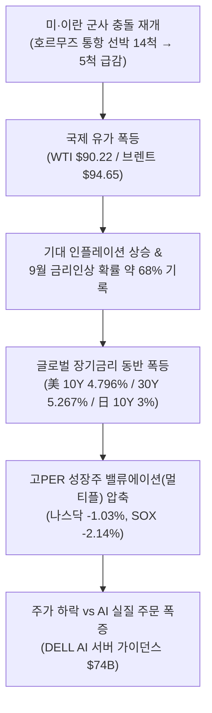
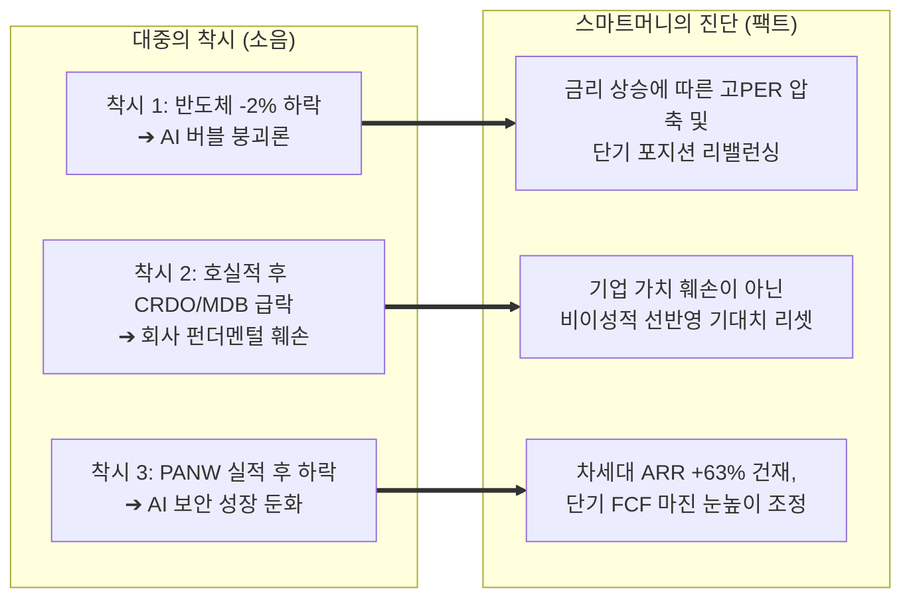
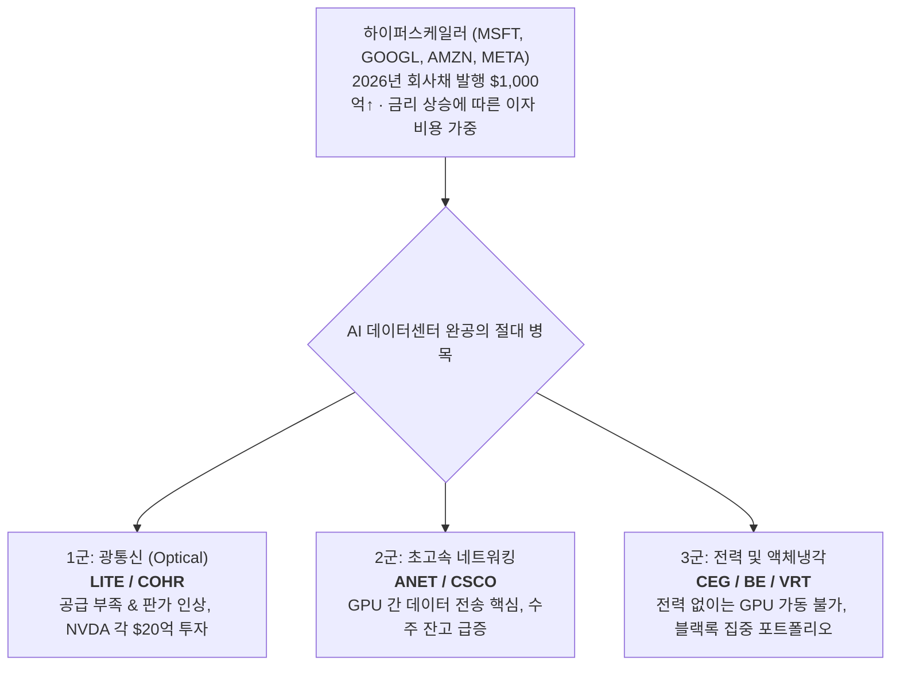
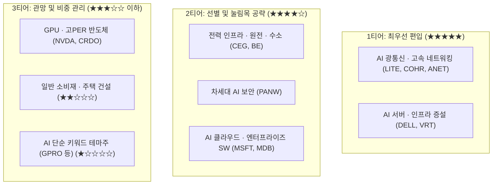
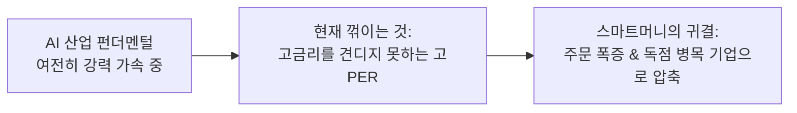

# 2026년 09월 02일(수) 하루치 뉴스정리

- **작성일**: 2026-09-02

AI 펀더멘털과 인프라 실질 주문은 델(DELL)의 가이던스 폭증과 광통신·네트워킹 공급 부족으로 더욱 가속화되고 있으나, WTI $90 돌파와 글로벌 10년물 국채금리 4.8% 급등이 성장주 밸류에이션(멀티플)을 압박하는 국면이므로 하이퍼스케일러보다 핵심 병목 기업 중심으로 선별 대응해야 합니다.

## 요약

| 구분 | 주요 내용 |
| :--- | :--- |
| **핵심 진단** | 시장의 본질은 "AI 수요 둔화"가 아니라 **[유가 급등 + 글로벌 장기금리 상승]에 따른 고PER 밸류에이션 압축 장세** |
| **매크로 동향** | 나스닥 -1.03%, SOX -2.14%, **WTI $90.22(+5.2%)**, 브렌트 $94.65, **美 10년물 4.796%**, 9월 금리인상 확률 약 68% |
| **AI 펀더멘털 팩트** | **DELL**: AI 서버 주문 $60.9B, 백로그 $95B, FY27 매출 전망 $167B → **$192B 상향**. **MSFT**: Azure +43% → 차기 +45% 예상 |
| **스마트머니 돈길** | 하이퍼스케일러 회사채 부담($1,000억↑) 속 **4대 병목 독점주** 집중: 광통신(`LITE`, `COHR`), 네트워킹(`ANET`, `CSCO`), 전력·냉각(`VRT`, `CEG`, `BE`) |
| **대중의 착시 교정** | 실적 상회 후 급락한 `CRDO`(-10%), `MDB`(-14%), `PANW`: 펀더멘털 훼손이 아닌 **극단적 선반영 기대치 리셋 국면** |
| **행동 지침** | 고PER 무차별 추격매수 중단, 병목 수혜주 압축, 유가($90 안착 vs $100 돌파) 및 오늘 밤 ADP 고용·베이지북 모니터링 |

---

## 1. 매크로 팩트 분석: 유가 $90 돌파와 글로벌 장기금리 급등

### 1.1 미국-이란 충돌과 호르무즈 해협 위기
- **지정학적 리스크 심화**:
    - 미군이 이란 혁명수비대(IRGC) 목표물을 공격하면서 이란 측의 보복 및 호르무즈 해협 봉쇄 경고가 구체화되었습니다.
    - 실제 호르무즈 해협 일일 통항 선박 수가 최근 평균 약 14척에서 **5척 수준으로 급감**했습니다.
- **유가 급등과 악순환 연결고리**:
    - WTI는 하루 만에 **+5.2% 급등하며 $90.22**, 브렌트유는 **$94.65**까지 치솟았습니다.
    - 시장에 작용하는 전이 경로는 다음과 같습니다:
      

        유가 상승 &nbsp;➔&nbsp; 기대 인플레 상승 &nbsp;➔&nbsp; 금리인하 기대 소멸 / 인상 확률 상승(68%) &nbsp;➔&nbsp; 장기금리 급등 &nbsp;➔&nbsp; 기술주 PER 멀티플 압축
      

---

### 1.2 채권시장이 보내는 강력한 경고 (글로벌 베어 스티프닝)
- **미국 국채 금리 레벨**:
    - 2년물 금리 **4.394%**, 10년물 금리 **4.796%**, 30년물 금리 **5.267%**를 기록했습니다.
- **글로벌 장기금리 동반 고점 갱신**:
    - 일본 10년물 국채 금리가 3%에 도달했으며, 독일과 영국의 장기금리 또한 수년~수십 년 만의 최고치 부근을 위협하고 있습니다.
    - **[재정 적자 심화 + 국채 발행량 폭증 + 고유가 충격]**이 결합된 글로벌 차원의 장기금리 상승(베어 스티프닝)으로, 실적이 우수하더라도 기술주가 즉각 반등하기 어려운 거시적 장벽을 형성하고 있습니다.

---

### 1.3 AI 실질 CAPEX는 전혀 꺾이지 않았다
- **실물 수요 지표의 증명**:
    - 거시 환경 악화에도 불구하고 AI 인프라 현장의 실제 주문량과 수주 잔고는 사상 최고치를 경신 중입니다.
- **델(DELL)의 확정 데이터**:
    - AI 서버 주문: **609억 달러**
    - AI 서버 백로그(수주 잔고): **950억 달러**
    - 분기 AI 서버 매출: **164억 달러**
    - 전통 서버·네트워킹 부문 +122%, 스토리지 +26% 동반 성장
    - AI 데이터센터 증설이 단일 칩을 넘어 데이터센터 인프라 전반의 확장을 이끌고 있음을 입증합니다.

---

## 2. 대중의 3대 착시(Illusion) 교정

### 착시 ① "반도체가 -2% 빠졌다 → AI 버블이 끝났다"
- **착시의 실체**: 필라델피아 반도체 지수가 -2.14% 밀리자 AI 산업 수요 둔화로 오인합니다.
- **교정 팩트**:
    - 주가 등락과 산업 현장의 수요는 별개의 영역입니다.
    - 필라델피아 반도체 하락 당일 델의 AI 서버 주문은 역대 최대치를 경신했습니다.
    - 이번 하락은 산업 수요 붕괴가 아니라 **[국채 금리 4.8% 돌파에 따른 고PER 멀티플 압축 + 단기 차익 실현 포지션 정리]**에 불과합니다.

---

### 착시 ② "실적 상회했는데 CRDO -10%, MDB -14% → 기업 가치 훼손이다"
- **착시의 실체**: 어닝 서프라이즈를 발표한 기업의 주가 급락을 펀더멘털 결함으로 판단합니다.
- **교정 팩트**:
    - **크리도(CRDO)**: 매출 +115%, EPS +131%, 차기 가이던스 상회, FY27 매출 +85% 이상 전망 ➔ 시간외 -10%
    - **몽고DB(MDB)**: 매출 +30.5%, EPS 상회, FY27 가이던스 상향, RPO +91%, cRPO +73% ➔ -14%
    - 기업의 사업 모델이 망가진 것이 아니라, **주가에 지나치게 극단적인 기대치가 선반영되어 있었기 때문**입니다.
    - 좋은 기업과 좋은 주식의 매수 타이밍은 일치하지 않으며, 눈높이가 리셋된 우량주는 향후 강력한 관찰 대상이 됩니다.

---

### 착시 ③ "PANW 실적 발표 후 하락 → AI 보안 성장 둔화다"
- **착시의 실체**: 팔로알토 네트웍스의 주가 조정을 사이버 보안 수요 둔화로 해석합니다.
- **교정 팩트**:
    - 차세대 보안 ARR **+63%**, 매출 +34%, RPO +34%로 성장세는 압도적입니다.
    - 주가 조정의 원인은 성장이 아니라 **FY27 조정 FCF 마진(38.0% vs 전년 38.4%)과 CyberArk 등 연속 M&A에 따른 현금흐름 기대치 조정**입니다.
    - 펀더멘털 결함이 아닌 단기 기대치 조정이므로, 무차별 공포에 휩쓸릴 필요가 없습니다.

---

## 3. 스마트머니가 보는 진짜 돈길: 하이퍼스케일러보다 '병목(Bottleneck)'

### 3.1 하이퍼스케일러의 딜레마와 병목 기업의 우위
- **빅테크의 자금 조달 부담**:
    - 2026년 하이퍼스케일러들의 투자등급(IG) 회사채 발행 규모는 이미 **1,000억 달러**를 넘어섰습니다.
    - 10년물 국채 금리가 4.8%로 치솟으면서 대규모 CAPEX를 위한 차입 및 이자 비용 부담이 가중되고 있습니다.
- **병목 기업(Bottleneck)의 독점적 지위**:
    - 자본을 아무리 투입해도 **[전력 확보 불가 ➔ 냉각 솔루션 미비 ➔ 광통신 모듈 결핍 ➔ HBM·스토리지 연결 불가]** 문제를 해결하지 못하면 데이터센터 가동 자체가 불가능합니다.
    - 따라서 가격 결정권(Pricing Power)과 공급 부족의 수혜는 병목 기업으로 집중됩니다.

---

### 3.2 핵심 병목 티어별 분석

| 티어 분류 | 대표 종목 | 핵심 병목 원인 및 수혜 구조 |
| :--- | :--- | :--- |
| **1군: 광통신** | **`LITE`, `COHR`** | **공급 절대 부족 및 제품 단가 인상**. 대규모 AI 클러스터 확장 시 GPU 간 데이터 병목 해결 필수. 엔비디아(NVDA)가 양사에 각 20억 달러 규모 투자 진행 중 |
| **2군: 초고속 네트워크** | **`ANET`, `CSCO`** | **GPU 클러스터 인터커넥트 주도**. ANET 경영진 약 40% 고성장 전망, CSCO 하이퍼스케일러 AI 수주 약 93억 달러 확보 |
| **3군: 전력 및 냉각** | **`CEG`, `BE`, `VRT`** | **데이터센터 전력 공급 및 고발열 해소**. 전력 인프라 없이는 데이터센터 신설 불가. 블랙록 및 글로벌 인프라 펀드의 최우선 편입 대상 |

---

## 4. 실적 분석 딥다이브: 괴물 가이던스를 제시한 델(DELL)

이번 실적 발표 시즌에서 AI 인프라의 실질 성장성을 가장 강력하게 증명한 기업은 델(DELL)입니다.

### 4.1 FY27 및 차기 분기 가이던스 상향 폭

| 실적 항목 | 기존 가이던스 | 상향 신규 가이던스 | 상향 폭 / 평가 |
| :--- | :---: | :---: | :---: |
| **FY27 전체 매출** | $167.0B | **$192.0B** | +$25.0B 상향 (역대급 서프라이즈) |
| **FY27 AI 서버 매출** | $60.0B | **$74.0B** | +$14.0B 상향 (산업 수요 가속 증명) |
| **FY27 EPS** | $17.90 | **$25.50** | **+42.5% 상향** |
| **다음 분기 매출 전망** | $41.4B (월가 예상) | **$49.0B** | 월가 컨센서스 대폭 상회 |

### 4.2 분석 및 모니터링 포인트
- **수요 가속의 증거**:
    - 가이던스 상향 폭이 시장 예상치를 완전히 압도하며, AI 서버 수요 둔화 우려를 전면 불식시켰습니다.
- **체크포인트**:
    - 분기 영업현금흐름(OCF)이 전년 대비 -13%를 기록한 점은 확인해야 합니다.
    - 폭증하는 매출과 수주 잔고가 분기를 거치며 얼마나 높은 잉여현금흐름(FCF)으로 실제 전환되는지가 중장기 밸류에이션 리레이팅의 핵심 척도입니다.

---

## 5. 빅테크 실적 신호: MSFT와 Broadcom(AVGO)

### 5.1 마이크로소프트(MSFT): AI 수익화 2단계 진입
- **Azure 실적 지표**:
    - Azure 성장률: **+43%** 달성 ➔ 다음 분기 **+45% 성장** 가이던스 제시
- **패러다임의 질적 전환**:
    - **AI 1단계**: "누가 AI 하드웨어에 돈(CAPEX)을 더 많이 쏟아붓는가?"
    - **AI 2단계**: **"투입한 CAPEX가 실제 클라우드와 소프트웨어 매출로 회수되는가?"**
    - BofA 분석에 따르면 MSFT는 인프라·파운데이션 모델·애플리케이션 전 계층에서 실질 수익화(Monetization) 궤도에 올랐으며, AI 시장의 체질이 건강해지고 있음을 시사합니다.

---

### 5.2 브로드컴(AVGO): 실적 발표를 앞둔 핵심 시험대
- **신규 플랫폼 공개**:
    - VMware Private AI Cloud 및 VMware AI Factory 공식 공개
    - 150개 이상의 AI 모델 지원, NVIDIA·AMD GPU 및 Cisco·Dell·SMCI 서버와의 풀스택 연동 지원
- **브로드컴의 본질적 기업 가치**:
    - 단순 ASIC 칩 설계사에 머무르지 않고 **[Custom ASIC + AI 초고속 네트워크(Tomahawk/Jericho) + VMware 엔터프라이즈 SW + Private AI Cloud]**의 독점 플랫폼을 지향합니다.
- **실적 발표 핵심 체크리스트**:
    - ① AI 매출 성장률 및 연간 가이던스 상향 여부
    - ② 신규 커스텀 ASIC 고객 확보 현황 및 구글 TPU 의존도 다변화
    - ③ 차세대 AI 네트워킹(Tomahawk 5/6) 수주 추이
    - ④ VMware 인수 시너지 및 영업이익률(Operating Margin) 방어 수준

---

## 6. 경계 및 배제 대상: 투기적 테마주와 금융 구조 리스크

### 6.1 고프로(GPRO) — 근거 없는 테마성 급등 경계
- **시장 현상**: AI 광학 기업과의 합병 발표 한마디로 주가 **+40% 급등**.
- **리스크 진단**:
    - 본업인 액션캠 사업의 구조적 정체가 해소된 것이 아닙니다.
    - 피합병 대상 기업의 실질 매출, 기술 특허, 고객사 점유율, 합병 후 주주 지분 희석 비율이 검증되지 않은 **'AI 키워드 투기 프리미엄'**이므로 추격 매수를 엄격히 배제합니다.

---

### 6.2 마이크로스트래티지(MSTR / STRC) — 금융 차익 방어 구조
- **시장 현상**: STRC 주가를 액면가($100)로 방어하기 위해 **6.35억 달러**의 자사주 매입 집행.
- **리스크 진단**:
    - 경쟁 상품인 SATA(13% 배당) 대비 STRC(12% 배당)의 배당 매력도가 열위에 있어 자사주 매입으로 가격을 지탱하는 구조입니다.
    - 이는 기술 성장 기업의 펀더멘털 성장 논리와 무관한 금융 상품 수급 게임이므로 포트폴리오 편입에 주의가 필요합니다.

---

## 7. 현재 시장 테마별 투자 매력도 랭킹

| 순위 | 테마 구분 | 투자 매력도 | 핵심 근거 및 주도 종목 |
| :---: | :--- | :---: | :--- |
| **1** | **AI 광통신 · 네트워킹** | ★★★★★ | 공급 부족 심화, 단가 인상, NVDA 직접 투자 (`LITE`, `COHR`, `ANET`) |
| **2** | **AI 서버 · 인프라** | ★★★★★ | 분기 실적 및 연간 가이던스 대폭 상향, 실제 수주 확인 (`DELL`) |
| **3** | **전력 인프라 · 냉각** | ★★★★☆ | 데이터센터 증설의 절대 물리적 한계 해소 (`CEG`, `BE`, `VRT`) |
| **4** | **차세대 AI 보안** | ★★★★☆ | 플랫폼 전환 및 차세대 ARR 고성장 지속, 밸류에이션 눈높이 정상화 (`PANW`) |
| **5** | **AI 클라우드 / SW** | ★★★★☆ | CAPEX 투자의 실제 클라우드 매출 회수 국면 확인 (`MSFT`, `MDB`) |
| **6** | **GPU / 고PER 반도체** | ★★★☆☆ | 펀더멘털은 견고하나 10년물 금리(4.8%) 상승에 따른 단기 PER 압축 (`NVDA`, `CRDO`) |
| **7** | **일반 소비재 / 주택** | ★★☆☆☆ | 장기 고금리 유지 및 유가 상승에 따른 가처분 소득 감소 우려 |
| **8** | **단순 AI 테마주** | ★☆☆☆☆ | 실적 없는 단순 내러티브 및 합병 뉴스 의존 테마주 (`GPRO`) |

---

## 8. 시장 대응을 위한 5대 냉정한 행동 지침

- **① 고PER 성장주 무차별 추격매수 중단**:
    - 미 10년물 국채 금리가 4.8%를 상회하는 구간에서는 실적이 뛰어나더라도 밸류에이션(PER) 압축이 먼저 발생합니다. 오버슈팅 종목의 추격 매수를 자제합니다.
- **② 실적 발표 후 기대치가 리셋된 우량주 선별 관찰**:
    - `CRDO`, `MDB`, `PANW`처럼 펀더멘털은 매우 견고하나 과도한 기대치로 주가가 급락한 종목들의 가격 지지선과 밸류에이션 매력을 관찰합니다.
- **③ AI 핵심 포지션은 '병목(Bottleneck)' 중심으로 압축**:
    - 하이퍼스케일러의 투자 축소 여부와 상관없이 반드시 구매해야 하는 광통신(`LITE`, `COHR`), 네트워킹(`ANET`), 전력·냉각(`VRT`, `CEG`)으로 포트폴리오를 집중합니다.
- **④ 유가(WTI / 브렌트)의 일일 추이를 최우선 모니터링**:
    - 현재 나스닥 지수의 단기 방향성을 결정하는 핵심 변수는 개별 테마보다 WTI $90 안착 여부 및 $100 돌파 위험성입니다.
- **⑤ 오늘 밤 발표될 ADP 고용보고서와 연준 베이지북 점검**:
    - 고용이 과도하게 강하면 9월 금리 인상 확률(현재 68%)이 고착화되고, 너무 급격히 둔화되면 경기 침체 우려가 부각됩니다. 좁아진 골디락스 구간을 확인해야 합니다.

---

## 9. 종합 결론 및 팩트 정리

### 9.1 팩트와 기대를 분리한 시장 진단

| 구분 | 핵심 내용 및 분석 팩트 |
| :--- | :--- |
| **확정된 사실 (Fact)** | AI 서버, 네트워킹, 클라우드, 보안의 실질 수주와 매출 가이던스는 사상 최고치 경신 중. 동시에 유가($90↑)와 글로벌 장기 국채금리가 급등함 |
| **신뢰도 높은 추정 (Projection)** | AI 인프라 CAPEX가 둔화되기보다는, GPU 단일 칩에서 광통신·네트워킹·전력·냉각 등 병목 밸류체인으로 수혜가 확산될 가능성이 높음 |
| **시장의 해석 (Interpretation)** | CRDO·MDB·PANW의 급락은 비즈니스 모델의 훼손이 아니라 지나치게 높아졌던 시장 눈높이와 멀티플의 되돌림 현상임 |
| **과장된 주장 (Noise)** | "AI 랠리는 버블 붕괴로 끝났다"는 주장과 "실적만 좋으면 금리 급등기에도 기술주는 무조건 오른다"는 주장 모두 오류 |

---

### 9.2 최종 핵심 실행 원칙

1. **산업 사이클에 대한 신뢰 유지**:
    - AI 산업은 꺾이지 않았습니다. 데이터센터 증설과 실질 수주는 델의 가이던스 상향에서 보듯 가속화되고 있습니다.
2. **밸류에이션과 금리 현실 직시**:
    - 지금 조정을 받는 것은 AI 산업 수요가 아니라, 10년물 국채 금리 4.8% 환경에서 정당화하기 어려운 고멀티플 종목의 주가입니다.
3. **독점적 병목 기업으로의 포트폴리오 재편**:
    - 단순한 'AI 내러티브'가 아닌, 고객사가 데이터센터를 짓기 위해 반드시 사야만 하는 **실제 공급 병목(광통신·네트워킹·전력·냉각)**을 쥔 기업으로 포트폴리오를 압축하십시오.

!!! tip "최종 요약 제언 (Executive Takeaway)"
    지금 시장을 이끄는 본체는 **"인플레이션 재점화 우려 ➔ 장기금리 상승 ➔ 성장주 멀티플 압축"**이라는 거시적 역풍입니다. 그러나 거시적 역풍 속에서도 델(DELL)의 가이던스 폭증($192B), LITE·COHR의 공급 부족 판가 인상, MSFT Azure의 고성장 지속(+45%)은 AI 인프라의 실질 펀더멘털이 건재함을 증명합니다. 막연한 공포에 휩쓸려 우량 자산을 던지지 말고, **고PER 추격매수 자제 ➔ 기대치 리셋 종목 관찰 ➔ 핵심 병목 독점주 압축**의 3대 원칙을 일관되게 고수하십시오.
