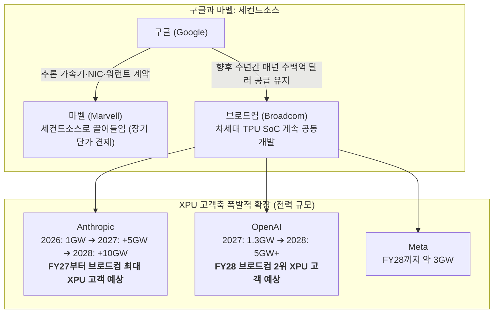

# 2026년 09월 03일(목) 하루치 뉴스정리

- **작성일**: 2026-09-03

오늘 뉴스의 진짜 핵심은 하나다. AI 투자 사이클이 꺾이는 게 아니라 오히려 GPU → 맞춤형 XPU → 네트워킹 → 서버·스토리지 → 데이터 플랫폼 → 사이버보안으로 돈길이 넓어지고 있으며 그 중심에 브로드컴(AVGO)이 있다. 10년물 4.8%와 WTI 91달러가 버티는 매크로 변수가 가장 더럽지만, AI 인프라 강세론은 오늘 오히려 더 강해졌다.

## 요약

| 구분 | 주요 내용 |
| :--- | :--- |
| **핵심 진단** | AI 투자 사이클이 꺾이는 게 아니라 **[GPU ➔ 맞춤형 XPU ➔ 네트워킹 ➔ 서버·스토리지 ➔ 데이터 플랫폼 ➔ 사이버보안]**으로 돈길이 넓어지는 중 |
| **브로드컴(AVGO) 팩트** | **FY26 3Q 실적**: 매출 $29.59B(+86%), AI 반도체 $16.7B(+221%), FCF $13.7B(마진 46%). **가이던스**: FY27 AI 약 $1,150억, **FY28 약 $2,300억** |
| **구글-마벨 착시 교정** | 마벨은 세컨드소스일 뿐. 브로드컴은 구글 TPU 수백억 달러 공급 유지 및 **Anthropic(FY27 최대), OpenAI(FY28 2위), Meta**로 고객축 확장 |
| **돈길 확산 신호** | **DELL**: AI 서버 $16.4B, AI 주문 $60.9B, 가이던스 $1,920억 상향. **SNOW**: 실사용량 매출 전환으로 +22% 폭등. **MSFT**: Azure 매출 별도 공개($101.9B) |
| **가장 더러운 변수** | **美 10년물 4.79%**(장중 4.821%) + **WTI 91.01달러** + **ADP 고용 둔화(+3.8만)**. [고용 둔화 vs 유가 상승] 충돌로 할인율(PER) 계속 흔들림 |
| **계좌 행동 지침** | AI 펀더멘털은 계속 사고, 실적 폭등주(+16%, +22%)는 쫓아가지 말며, 금리 때문에 주가가 흔들릴 때 우량주(AVGO 등)를 분할 매수할 것 |

---

## 1. 브로드컴: 이번 실적은 악재가 아니라 투자 논리의 대폭 강화

기사 제목만 보면 이렇다.  
**“실적 좋았지만 가이던스 실망 → 브로드컴 하락.”**  
이걸 그대로 믿으면 핵심을 놓친다.

브로드컴의 공식 숫자는 매출 296억달러, Non-GAAP EPS 3.32달러, 영업현금흐름 142억달러, FCF 137억달러다. FY4Q 매출 가이던스는 348억달러다. ([Broadcom Inc.](https://investors.broadcom.com/news-releases/news-release-details/broadcom-inc-announces-third-quarter-fiscal-year-2026-financial?utm_source=chatgpt.com))

그런데 컨센서스는 데이터 업체마다 달랐다. 첨부 기사에서는 350억달러를 제시해 약 2억달러 미스라고 했지만, 다른 시장 데이터에서는 컨센서스를 약 346.8억달러로 잡아 오히려 소폭 상회한 것으로 집계된다. ([Investor's Business Daily](https://www.investors.com/news/technology/broadcom-stock-avgo-fiscal-q3-2026-earnings/?utm_source=chatgpt.com))

즉, **“브로드컴이 실적 가이던스를 크게 미스했다”는 표현부터 정확하지 않다.** 시장 기대치가 워낙 높았던 것이다.

### 진짜 중요한 숫자

| 항목 | 결과 | 판정 |
| :--- | :---: | :---: |
| **총매출** | $29.6B, +86% | 강함 |
| **AI 반도체** | $16.7B, +221% | **미친 수준** |
| **AI 반도체 QoQ** | +54% | 가속 |
| **FCF** | $13.7B | 매우 강함 |
| **FCF 마진** | 46% | 질 좋은 성장 |
| **FY4Q AI** | $21.7B, +236% | 추가 가속 |
| **FY27 AI** | 약 $115B | 기존 $100B+보다 상향 |
| **FY28 AI** | **약 $230B** | **핵심** |
| **XPU 고객** | 6개 | 집중도 개선 |

**여기서 FY28 2,300억달러가 가장 무섭다.**  
FY26 예상 AI 반도체 매출 약 580억달러에서 FY28 2,300억달러면 2년 만에 거의 4배다. Barron's 등도 FY27 1,150억달러 → FY28 2,300억달러 전망을 확인했다. ([Barron's](https://www.barrons.com/articles/broadcom-earnings-todya-stock-price-13672771?utm_source=chatgpt.com))

이 정도면 단순한 “AI 기대감”이 아니다. **공급 물량과 고객 프로젝트가 매출 숫자로 떨어지기 시작한 단계다.**

---

## 2. 구글-마벨 때문에 브로드컴 망한다?

이건 절반은 맞고 절반은 틀렸다.

### 맞는 부분
- 구글이 마벨을 세컨드소스로 끌어들이는 건 사실이다.
- 마벨은 구글과 AI 추론 가속기·NIC·스토리지 컨트롤러·near-memory compute 등을 개발하기로 했고, 구글은 구매 실적에 따라 최대 약 122억달러 규모의 마벨 지분을 살 수 있는 워런트도 받았다. ([Investing.com](https://www.investing.com/news/stock-market-news/marvell-vs-broadcom-googles-custom-silicon-deal-reshapes-the-competitive-landscape-93CH-4867669?utm_source=chatgpt.com))
- 따라서 장기적으로는 **브로드컴의 구글 내 점유율과 가격 협상력에 압박이 생길 가능성이 있다.** 이 부분은 인정해야 한다.

### 그런데 “구글이 브로드컴을 대체한다”는 건 지금까지는 틀렸다
- 브로드컴 컨콜을 보면 오히려 반대다.
- 호크 탄은 구글과 **향후 수년간 매년 수백억달러 규모의 TPU를 공급할 계획**이라고 밝혔다. 동시에 Broadcom은 차세대 TPU SoC를 계속 공동개발한다. ([Benzinga](https://www.benzinga.com/news/26/09/61592658/broadcom-q3-2026-earnings-call-transcript?utm_source=chatgpt.com))

### 결정적으로 고객 구성이 바뀐다
- **Anthropic**:
    - 2026년 1GW → 2027년 추가 5GW → 2028년 추가 10GW
    - **FY27부터 브로드컴 최대 XPU 고객 예상.**
- **OpenAI**:
    - 2027년 1.3GW → 2028년 5GW+
    - **FY28 브로드컴 두 번째 XPU 고객 예상.**
- **Meta**:
    - FY28까지 약 3GW. ([Benzinga](https://www.benzinga.com/news/26/09/61592658/broadcom-q3-2026-earnings-call-transcript?utm_source=chatgpt.com))

이게 중요하다. 우리가 전에 계속 따졌던 질문이 있었다.  
**“구글 내 점유율이 떨어져도 브로드컴이 고객을 다변화하면 전체 매출은 오히려 커질 수 있지 않나?”**  
현재 확인된 자료 기준으로는 그 논리가 맞았다. 구글 내 점유율이 조금 깎이는 문제보다 전체 XPU 시장 자체가 폭발적으로 커지고 신규 고객이 붙는 속도가 현재는 훨씬 크다.

---

## 3. 더 무서운 건 XPU가 아니다. 네트워킹이다.

시장은 브로드컴을 자꾸 “구글 TPU 회사”처럼 본다. **이게 가장 큰 착시다.**

AI 클러스터가 커질수록 GPU/XPU만 늘어나는 게 아니다. 컴퓨팅 노드가 늘어날수록 노드끼리 데이터를 주고받는 scale-up / scale-out 네트워크의 복잡도가 더 빠르게 올라간다.

브로드컴은 이미 Tomahawk 6 이후 **200Tbps급 Tomahawk 7까지 개발**하고 있다고 밝혔고, AI 네트워킹 매출 역시 XPU와 비슷한 속도로 성장할 것으로 보고 있다. ([Benzinga](https://www.benzinga.com/news/26/09/61592658/broadcom-q3-2026-earnings-call-transcript?utm_source=chatgpt.com))

여기에 PwC가 던진 숫자를 같이 봐야 한다.
- 글로벌 데이터센터 투자 규모를 2026년 연간 약 8,000억달러, 2030년 1.1조달러, 2050년 1.8조달러, 누적 31.6조달러로 추산한다.
- **더 중요한 내용은 데이터센터 건물이 아니다.** 서버·GPU·네트워크 장비는 4~6년마다 계속 교체해야 한다.
- PwC 분석에서는 **데이터센터 건설 $1이 향후 ICT 장비 교체·업그레이드 약 $12를 수반**할 수 있다고 설명한다. ([PwC](https://www.pwc.com/gx/en/news-room/press-releases/2026/global-investment-in-ai-infrastructure.html?utm_source=chatgpt.com))

2050년 숫자를 그대로 투자모델에 넣는 건 바보짓이다.  
하지만 **“AI 인프라는 한 번 짓고 끝나는 CAPEX가 아니라 반복 CAPEX다”**라는 구조는 중요하다. 이게 AVGO·NVDA·TSM·DELL·네트워크 장비업체들의 장기 사이클을 지지한다.

---

## 4. 오늘 AI 뉴스에서 브로드컴 다음으로 중요한 건 델

DELL 숫자도 상당히 강하다.  
FY27 2분기 매출 470억달러 +58%, AI 서버 매출 164억달러, AI 주문은 무려 609억달러였다. FY27 매출 가이던스는 1,920억달러로 올라갔다. ([Dell Technologies](https://investors.delltechnologies.com/static-files/a24f97e4-63b2-460d-a4be-44738826e8ce?utm_source=chatgpt.com))

여기서 시장이 확인한 것은 단순하다. AI 수요가 GPU 구매에서 끝나지 않는다. 기업들이 AI를 실제로 구축하면서 지출이 전면 확산되고 있다:
- **컴퓨팅 → 네트워크 → 스토리지 → 서버 → PC·Edge**

JPM이 델 목표가를 565 → 635달러로 올린 논리가 바로 이것이다. 따라서 DELL은 이제 단순한 PC 회사로 보면 안 된다.

**다만 여기서는 쫓아가면 안 된다.**  
주가가 실적 직후 약 16% 급등했다. ([AP News](https://apnews.com/article/27b78c349725ac744c96a6b8b8167bae?utm_source=chatgpt.com))  
기업은 좋아졌지만 가격까지 싸졌다는 뜻은 아니다.

---

## 5. 스노우플레이크 +22%가 더 중요한 이유

SNOW도 오늘 상당히 중요한 신호다.  
매출 15.5억달러 +35%, 제품매출 14.9억달러 +37%, RPO 90억달러 +30%, NRR 126%다. 회사는 FY27 제품매출 전망을 기존 58.4억달러 → 60.7억달러로 올렸다. 시간외 주가는 약 +22% 반응했다. ([The Wall Street Journal](https://www.wsj.com/livecoverage/stock-market-today-dow-sp-500-nasdaq-09-02-2026/card/snowflake-loss-narrows-stock-jumps-afterhours-AzUQY0skLYY1nyweCQLJ?utm_source=chatgpt.com))

왜 이게 중요하냐.  
2024~25년 AI 랠리의 문제는 계속 이것이었다.  
**“AI 인프라 업체만 돈 벌고 소프트웨어 기업들은 언제 돈 버냐?”**

이제 답이 조금씩 나오고 있다. AI 서비스와 데이터 계층에서도 실제 사용량 증가가 매출로 전환되고 있다.  
Snowflake 하나만 보고 AI 소프트웨어 전체가 성공했다고 하면 과장이다. 하지만 아래 기업들에서 비슷한 신호가 동시에 나온다는 건 무시하면 안 된다:
- **Microsoft Azure**
- **Snowflake**
- **Palo Alto**
- **CrowdStrike**
- **Okta**

---

## 6. Microsoft가 Azure 매출을 공개하기 시작한 것도 조용히 큰 뉴스

MSFT는 FY27부터 Azure 매출을 달러로 직접 공개한다.  
재분류 기준 FY26 Azure 매출은 **Q4 $29.417B**, **연간 $101.938B**이다. FY26 Q4 성장률도 **42%**다. ([Securities and Exchange Commission](https://www.sec.gov/Archives/edgar/data/789019/000119312526380280/d291965dex991.htm))

이게 좋은 이유는 단순하다. AI 인프라 CAPEX에 천문학적인 돈을 붓는데 그 돈을 Azure가 얼마나 회수하는지 시장이 이전보다 훨씬 정확하게 볼 수 있게 된다.

앞으로 AI 투자 사이클에서 중요한 지표가 아래처럼 넘어간다:
- **“CAPEX 얼마 썼냐” ➔ “그 CAPEX에서 Azure 매출과 마진이 얼마나 나오냐”**

이건 건강한 변화다.

---

## 7. 사이버보안도 진짜 돈길로 들어왔다

PANW는 그냥 AI 테마에 이름만 붙인 게 아니다.  
FY26 Q4 매출은 34.1억달러 +34%, RPO는 212억달러 +34%였고 회사는 AI 보안 수요를 근거로 FY30 NGS ARR 200억달러 목표를 제시하고 있다. ([Palo Alto Networks](https://www.paloaltonetworks.com/company/press/2026/palo-alto-networks-reports-fiscal-fourth-quarter-and-fiscal-year-2026-financial-results?utm_source=chatgpt.com))

그리고 언급된 Anthropic의 Claude Mythos 역시 실제다. Mythos는 사이버보안 능력이 매우 강한 모델이고 Anthropic 자체 평가에서도 기존 소프트웨어 취약점 탐색·공격 능력이 상당히 높아졌다고 발표했다. ([Anthropic](https://www.anthropic.com/claude/mythos?utm_source=chatgpt.com))

따라서:
- **AI가 좋아지면 보안 소프트웨어가 필요 없어진다가 아니라,**
- **오히려 AI 공격력이 올라갈수록 보안 CAPEX도 같이 올라간다.**

PANW·CRWD 쪽의 구조적 논리는 맞다. 다만 PANW 주가가 이미 크게 올라와 있다는 점과 인수 효과를 제외한 유기적 성장률은 계속 확인해야 한다. 최근 실적 후 주가가 약 -9% 반응한 것도 바로 이 기대치 문제다. ([Investor's Business Daily](https://www.investors.com/news/technology/palo-alto-stock-panw-palo-alto-earnings-aug26/?utm_source=chatgpt.com))

---

## 8. 대중의 눈먼 착시 vs 실제로 봐야 할 것

| 시장이 보고 있는 것 | 실제로 봐야 할 것 |
| :--- | :--- |
| **AVGO 가이던스 미스** | 거의 노이즈. FY27~28 AI 전망이 훨씬 중요 |
| **Google→Marvell** | AVGO 퇴출 아님. 세컨드소싱 + 가격협상력 문제 |
| **NVIDIA만 AI** | XPU·네트워크·서버·스토리지·데이터·보안으로 확대 |
| **DELL +16%니까 AI 버블** | 실적과 주문이 실제로 폭증 |
| **SNOW +22%니까 과열** | 주가는 과열 가능, 실적 개선 자체는 진짜 |
| **약한 ADP = 금리 걱정 끝** | 전혀 아님 |
| **10년물 하루 하락 = 채권 문제 해결** | 가장 위험한 착각 |

**마지막 두 개가 제일 중요하다.**

---

## 9. 지금 시장 최대 위험은 여전히 10년물 + 유가

미 10년물은 장중 **4.821%**까지 올라갔다가 4.79% 부근으로 내려왔다. 그래서 주식시장이 반등했다. (S&P500 +0.46%, Nasdaq +0.45%).

하지만 이건 금리 문제가 해결돼서 오른 게 아니다. **5거래일 연속 금리 급등 뒤 하루 쉬어서 주식을 산 것이다.** ([The Wall Street Journal](https://www.wsj.com/finance/stocks/u-s-stocks-rise-as-oil-gains-on-iran-escalation-aaf0672e?utm_source=chatgpt.com))

동시에 WTI는 91.01달러, Brent는 95.63달러다. 미국 원유재고도 예상보다 크게 감소했다. ([The Wall Street Journal](https://www.wsj.com/finance/commodities-futures/oil-rises-amid-growing-u-s-iran-hostilities-e12fa4f2?utm_source=chatgpt.com))

그리고 ADP 고용은 +3.8만명, 예상 +4.7만명을 밑돌았다. 제조업 -1.7만명, 전문·비즈니스 서비스 -1.6만명이다. ([ADP Media Center](https://mediacenter.adp.com/2026-09-02-ADP-National-Employment-Report-Private-Sector-Employment-Increased-by-38%2C000-Jobs-in-August?utm_source=chatgpt.com))

즉 지금 매크로는 아주 이상하다:
- **고용은 둔화 ➔ 금리 하락 요인**
- **그런데 유가 상승 ➔ 인플레 상승 요인**

이 둘이 싸우고 있다. 그래서 지금 증시는 **좋은 실적이 나오는데 PER을 결정하는 할인율이 계속 흔들리는 시장**이다.

---

## 10. 그래서 지금 Smart Money가 보는 진짜 돈길

실제 기관이 오늘 특정 종목을 “조용히 매집 중”이라고 단정할 수 있는 수급 자료는 이번 입력에 없다. **그런 헛소리는 안 하겠다.**

대신 기관 자금이 중장기적으로 관심을 둘 수밖에 없는 이익 성장 축은 꽤 분명해졌다:

- **1순위 — Custom AI + Networking**:
    - **AVGO**가 가장 강하다. Google 하나에 대한 의존도가 낮아지는 것이 확인되면 재평가가 가능하다.
- **2순위 — AI 시스템 통합**:
    - **DELL**. 서버 하나가 아니라 서버·스토리지·네트워크·기업 구축 전체에서 돈을 번다.
- **3순위 — AI Data Layer**:
    - **MSFT Azure**와 **SNOW**. AI 사용량이 실제 클라우드·데이터 소비 증가로 연결되는 단계다.
- **4순위 — AI Cybersecurity**:
    - **PANW**·**CRWD**. AI 모델 성능 향상이 역설적으로 보안 CAPEX를 늘린다.
- **5순위 — 전력·냉각·데이터센터 인프라**:
    - PwC의 31.6조달러 전망에서 정말 중요한 병목은 결국 전력이다. ([PwC](https://www.pwc.com/gx/en/news-room/press-releases/2026/global-investment-in-ai-infrastructure.html?utm_source=chatgpt.com))

---

## 11. 종목별 지금 판정

| 종목 | 펀더멘털 | 지금 주가 관점 | 판정 |
| :---: | :---: | :--- | :--- |
| **AVGO** | ★★★★★ | 최근 고점 대비 조정 | **가장 중요** |
| **DELL** | ★★★★★ | 실적 후 급등 | 좋은데 추격 부담 |
| **SNOW** | ★★★★½ | +22% 갭 | 실적 인정, 추격 금지 |
| **MSFT** | ★★★★½ | 핵심 AI 플랫폼 | 장기 우수 |
| **PANW** | ★★★★½ | 기대 상당 부분 반영 | 눌림목 후보 |
| **HPE** | ★★★★☆ | 수요 강함 | 공급부족 확인 필요 |
| **CRWD** | ★★★★½ | AI 보안 수혜 | 가이던스 확인 |
| **UBER** | ★★★½☆ | 비용절감 호재 | AI 인프라와 별도 |

특히 HPE도 실적 자체는 강하다. Q3 매출 122억달러 +34%, Cloud & AI 90억달러 +25%, Networking 29억달러 +75%이고 FY27 가이던스까지 상향했다. 다만 메모리 등 공급 제약은 실제 위험이다. ([Hewlett Packard Enterprise](https://www.hpe.com/us/en/newsroom/press-release/2026/09/hpe-reports-fiscal-2026-third-quarter-results.html?utm_source=chatgpt.com))

---

## 12. 계좌에서 어떻게 행동해야 하냐

- **AVGO**:
    - 이번 실적으로 투자 논리는 약화가 아니라 강화됐다. 구글-마벨 뉴스 때문에 생겼던 핵심 의문인 고객집중도 문제가 Anthropic·OpenAI·Meta 성장으로 상당 부분 완화되는 방향이다.
    - 다만 FY28 2,300억달러는 아직 가이던스이지 실적이 아니다. 앞으로 2~3개 분기 동안 AI 매출·고객별 배치·네트워킹 매출이 이를 따라가는지 확인해야 한다.
- **SNOW·DELL**:
    - 기업은 좋다. 그런데 실적 직후 +16%, +22%를 보고 뛰어드는 건 투자라기보다 흥분에 가깝다. 눌림을 기다리는 쪽이 낫다.
- **PANW·CRWD**:
    - 장기 스토리는 오히려 더 좋아졌다. 다만 보안주는 이미 Mythos 기대를 상당히 반영했다. PANW는 organic ARR 성장이 다음 확인 항목이다.
- **현금**:
    - 지금은 어느 정도 반드시 남겨두는 게 맞다. 이유는 기업 실적이 아니라 10년물 5% 테스트 때문이다.
- **환율**:
    - 한국 투자자에게 달러-원 1,350원대는 달러 자산을 매수하기에는 몇 주 전보다 유리하다. 하지만 엔화 개입 기대와 수출업체 네고가 상당 부분 영향을 주고 있기 때문에 환전을 한 번에 몰아서 할 이유도 없다.

---

## 13. 최종 판정 및 핵심 실행 원칙

이번 뉴스 묶음에서 **나는 AI 강세론을 한 단계 올린다.** 특히 브로드컴은 그렇다.

지난 몇 주간 AVGO를 괴롭힌 논리는 단순했다:  
**“구글이 마벨을 선택했다 → 브로드컴 XPU 독점력 붕괴 → AI 성장률 둔화.”**

그런데 이번에 나온 실제 데이터는 정반대다:
- **Google 성장 지속**
- **Anthropic 최대 고객화**
- **OpenAI 대형 고객화**
- **Meta 확대**
- **Networking 동반 성장**
- **FY27 $115B**
- **FY28 $230B**

따라서 현재 자료로 판정하면 브로드컴에 대한 시장의 경쟁 우려가 틀린 것은 아니지만, 주가가 반영한 정도만큼 펀더멘털이 훼손됐다는 주장은 설득력이 떨어진다.

오히려 진짜 위험은 다른 데 있다. 브로드컴 사업이 나빠지는 게 아니라, **10년물 5%와 고유가가 AVGO 같은 고PER 성장주의 멀티플을 얼마나 눌러버리느냐가 문제다.**

그래서 지금 가장 좋은 그림은 이것이다:

1. **AI 펀더멘털은 계속 산다.**
2. **금리 때문에 주가가 흔들릴 때 산다.**
3. **실적 폭등한 종목은 쫓아가지 않는다.**
4. **그리고 오늘 나온 정보만 놓고 보면 AVGO는 내가 가장 우선적으로 다시 평가할 종목이다.**

!!! tip "최종 핵심 제언 (Executive Takeaway)"
    “실적 미스”, “마벨에 뺏긴 구글 파이”라는 표면적 헤드라인에 속지 마라. 브로드컴의 FY28 AI 2,300억달러와 고객 다변화, 델의 AI 주문 $609B, 스노우플레이크의 실사용 매출 전환은 AI 투자 사이클이 꺾이기는커녕 전방위로 확장되고 있음을 보여준다. 지금 시장의 진짜 적은 기업 실적이 아니라 10년물 4.8%와 91달러 유가라는 할인율 압박이다. 실적 폭등주를 흥분해서 쫓아가지 말고, 금리 발작으로 우량주가 흔들릴 때마다 AVGO를 필두로 한 1등 독점주를 차분히 모아가는 것이 정답이다.
