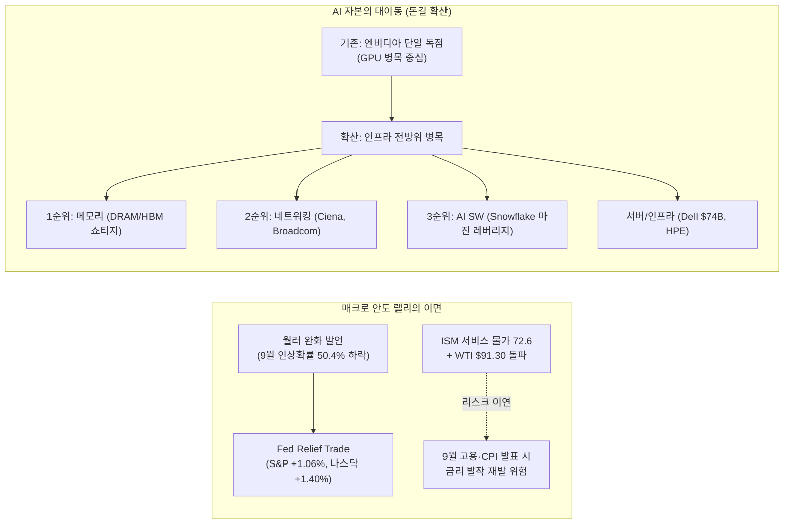
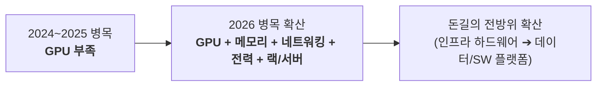

# 2026년 09월 04일(금) 하루치 뉴스정리

- **작성일**: 2026-09-04

오늘 시장은 연준의 금리 인상 판단 유예 안도감으로 올랐으나 서비스 물가(72.6)와 유가($91) 리스크는 9월 고용·CPI 앞으로 이연되었을 뿐이며, AI 투자 사이클의 돈길은 엔비디아 단일 칩에서 메모리·네트워킹·서버·소프트웨어로 본격 확산되고 있다.

## 요약

| 구분 | 주요 내용 |
| :--- | :--- |
| **핵심 진단** | 시장은 "경기 호조"가 아닌 **"연준의 금리 인상 판단 유예"** 안도감으로 반등. 그러나 AI CAPEX 돈길은 엔비디아 단일 종목에서 **메모리·네트워크·서버·소프트웨어**로 본격 확산 중 |
| **매크로 팩트** | 월러/윌리엄스 완화 발언으로 9월 25bp 인상 확률 63.2% ➔ 50.4% 급감(S&P +1.06%, 나스닥 +1.40%). 그러나 **ISM 서비스업 55.4, 물가지수 72.6(2022년 후 최고), WTI $91.30**으로 물가 압력 상존 |
| **대중의 착시 교정** | "금리 인상 종료"도 "성장주 무조건 랠리"도 아님. 채권은 장중 금리 되돌림으로 물가 경계 유지 중이며, 주식시장만 불확실성 비용을 하루 낮춘 것 |
| **돈길 확산 신호** | **Snowflake**(매출 +영업 레버리지 가시화), **Ciena**(네트워킹 +81.1%), **Dell**(AI 서버 가이드 $74B), **HPE**(수주 3.5배 급증), **메모리**(공급 부족 병목) |
| **브로드컴(AVGO)** | 가이던스 0.7% 미달과 마진 압박은 악재이나 펀더멘털(FY27 +100%, FY28 +100%)은 견고. 문제는 성장이 깨진 게 아니라 **시장의 기대치가 먼저 폭등한 것** |
| **계좌 행동 지침** | 전량 매도도 풀매수도 어리석은 선택. **[메모리 ➔ 네트워킹 ➔ AI 소프트웨어]** 압축 유지, AVGO 실적 후 조정 추격 매도 금지 및 분할 대응, 9월 고용·CPI 전까지 현금 비축 |

---

## 결론부터: 시장의 착각과 자본의 대이동

**오늘 시장은 “경기가 좋아져서 오른 것”이 아니다. “연준이 당장 금리를 더 올릴 확률이 낮아졌다”는 안도감으로 오른 거다.**

그런데 웃긴 건, 같은 날 나온 데이터는 오히려 **서비스업 경기 강함 + 서비스 물가 압력 재가속 + 유가 91달러**다. 즉 **금리 인상 리스크가 사라진 게 아니라 9월 고용·CPI 앞으로 미뤄진 것뿐**이다.

그리고 기업 쪽에서는 더 중요한 변화가 보인다.

**AI 투자 사이클이 죽는 게 아니라, 돈이 엔비디아 한 곳에서 메모리·네트워크·서버·소프트웨어로 확산되고 있다.**  
오늘 뉴스에서 제일 중요한 건 지수 +1%가 아니다. **Snowflake, Ciena, Dell, Broadcom, 메모리, Palo Alto가 서로 다른 방식으로 같은 이야기를 하고 있다는 것**이다.

---

## 1. 기사 속 팩트 폭행

### ① 연준: 금리 인상 취소가 아니라 `판단 유예`

월러가 “디스인플레이션이 이어지면 동결을 지지하겠다”고 했다.

그래서 9월 25bp 인상 확률이

**63.2% → 50.4%**

까지 내려왔다.

여기에 윌리엄스까지 금리 인상 필요성을 강하게 밀지 않으면서 시장은 바로 반응했다.

| 지표 / 자산 | 결과 수치 | 시장 반응 성격 |
| :--- | :---: | :--- |
| **S&P 500** | **+1.06%** | 안도 랠리 형성 |
| **Nasdaq** | **+1.40%** | 기술주/성장주 반등 |
| **美 국채 2년물 금리** | **-5.4bp** | 정책금리 기대감 반영 |
| **美 국채 10년물 금리** | **-3.2bp** | 장중 4.73% ➔ 4.76% 되돌림 |
| **달러 인덱스 (DXY)** | **-0.60%** | 달러 약세 전환 |
| **국제 금 (Gold)** | **+2.7%** | 위험회피 및 통화가치 반영 |
| **VIX 변동성 지수** | **14.32** | 공포 심리 진정 |

전형적인 **“Fed relief trade”**다.

그런데 월러 발언 뒷부분은 시장이 별로 듣고 싶어 하지 않았다.

> "물가가 다시 뜨거우면 금리 인상을 고려한다."

조건부 동결이다.

!!! warning "조건부 동결의 함정"
    시장 참여자들은 '동결'이라는 단어에만 환호했지만, 월러의 발언 전문은 엄연한 조건부 유예다. 물가 지표가 튀는 순간 연준의 태도는 언제든 매파로 돌변할 수 있다.

---

### ② 진짜 골치 아픈 건 ISM이다

- **8월 ISM 서비스업**: **55.4** (예상치 54.3 상회)
- **신규 주문**: **60.9** (2023년 이후 최고 수준)

그리고 핵심은 이거다.

**서비스 물가지수 72.6.**

전월 70.3보다 더 올라갔다. 기사 표현대로라면 **2022년 이후 최고 수준**이다.

그러니까 지금 미국 경제는

**[경기 둔화 + 디스인플레이션]**

이 아니라 오히려

**[경기 견조 + 일부 인플레이션 압력 지속]**

에 더 가깝다.

오늘 시장이 이걸 무시한 것이다.

---

### ③ 여기에 유가까지 $91

- **WTI**: **$91.30** (4거래일 연속 상승)
- **브렌트유**: **$95.52**

미국-이란 갈등은 완화되지 않고 있고, 원유 재고도 타이트하다는 분석이 나온다.

이게 계속되면 시장에 제일 불편한 조합이 만들어진다.

  서비스 물가 안 내려감 &nbsp;+&nbsp; 유가 상승 &nbsp;+&nbsp; 경기 아직 강함

이 상태에서 연준이 마음 놓고 비둘기가 될 수 있을까?

아직 아니다.

---

## 2. 대중의 눈먼 착시

### 착시 ① “월러가 동결을 말했다 → 금리 인상 사이클 끝”

아니다.

오늘 월러가 한 말은 사실상:

**“다음 물가 데이터 보고 결정하겠다.”**

다.

9월 인상 확률도 **0%가 아니라 50%**다. 시장 스스로도 아직 모르겠다는 뜻이다.

오늘 증시는 정책 불확실성이 사라진 게 아니라 **불확실성의 가격을 하루 낮춘 것**이다.

---

### 착시 ② “금리 내려갔으니 성장주 다시 무조건 간다”

여기에도 함정이 있다.

10년 금리는 장중 **4.73%**까지 내려갔다가 다시 **4.76%**로 올라왔다.

즉 채권시장은 월러 발언을 듣고 처음에는 흥분했지만, ISM 보고 나서 상당 부분 되돌렸다.

그런데 증시는 끝까지 +1%를 유지했다.

이 괴리가 중요하다.

| 시장 구분 | 보내고 있는 시그널 | 실제 현실 |
| :--- | :--- | :--- |
| **채권 시장** | “물가 아직 안 끝났다” (금리 되돌림) | ISM 72.6, 유가 91달러 경계 |
| **주식 시장** | “연준이 살려준다” (+1%대 고수) | 단기 릴리프 트레이드 베팅 |

**채권은 ‘물가 아직 안 끝났다’고 말하고 있는데, 주식은 ‘연준이 살려준다’ 쪽을 더 강하게 베팅한 것**이다.

내일 고용이나 다음 주 CPI가 강하면 이 괴리는 바로 정리될 수 있다.

---

## 3. 지금 진짜 돈길은 AI 안에서 바뀌고 있다

여기가 오늘 뉴스의 핵심이다.

### Snowflake: AI 소프트웨어가 “매출 성장”에서 “수익성 성장” 단계로 넘어간다

| 지표 | 발표 수치 | 시장 컨센서스 / QoQ | 판정 및 반응 |
| :--- | :---: | :---: | :---: |
| **매출액** | **15.5억 달러** | 14.8억 달러 | 상회 |
| **Non-GAAP EPS** | **$0.62** | $0.45 | 대폭 상회 |
| **주가 등락** | **+16.55%** | - | 폭등 |
| **영업이익률** | **QoQ +3.4%p** | - | 마진 레버리지 가시화 |

이건 중요하다.

시장에서는 지난 2년간 계속

> “AI 서비스는 돈이 안 된다.”

는 얘기가 있었다.

Snowflake에서 이제 반대 신호가 나온다.

  AI 사용 증가 &nbsp;➔&nbsp; 데이터 사용 증가 &nbsp;➔&nbsp; 매출 증가 &nbsp;➔&nbsp; 영업 레버리지

구조가 보이기 시작했다.

그래서 ServiceNow, Datadog, Salesforce까지 동반 상승한 거다. 단순 동조화가 아니다.

**AI CAPEX 수혜가 하드웨어에서 소프트웨어로 넘어가기 시작하는 초기 신호**로 볼 수 있다.

아직 확정은 아니다. 하지만 무시할 뉴스도 아니다.

---

## 4. 메모리: 가장 과소평가하면 안 되는 뉴스

라운드힐 주장은 꽤 공격적이다.

- 계약가격 상승 지속
- 2030년 산업 매출 3배 가능
- 향후 5년 EPS CAGR **35%+**
- 현재 주가는 약 **30% 성장만 반영**

여기서 “2030년 3배”를 그대로 믿을 필요는 없다. 그건 추정이다.

하지만 방향은 맞아가고 있다.

왜? 오늘 뉴스만 봐도

- **Broadcom**: 메모리 부족으로 마진 압박
- **HPE**: 메모리 부족으로 공급 제약
- **AI 서버**: 수요가 공급 능력을 초과

가 동시에 나온다.

즉 메모리 업체들이 주장해서 메모리가 좋은 게 아니다.

**메모리를 사는 고객들이 “물건을 못 구해서 성장에 제약이 생긴다”고 말하고 있다.**

이게 훨씬 강한 증거다.

따라서 현재 자료 기준으로는 이렇다:

| 분석 축 | 세부 진단 내용 |
| :--- | :--- |
| **확정된 사실** | AI 인프라 쪽 메모리 수요가 공급 능력을 압박하고 있다. |
| **신뢰도 높은 추정** | DRAM/HBM 가격과 믹스 개선이 메모리 기업 이익을 계속 끌어올릴 가능성이 높다. |
| **시장의 해석** | 메모리 사이클을 전통적인 2~3년 사이클이 아니라 AI 구조 성장으로 재평가해야 한다. |
| **과장 가능성** | “2030년 산업 매출 3배”를 확정 숫자처럼 받아들이는 것. |

---

## 5. Broadcom: 오늘 하락했다고 실적이 나쁜 게 아니다

여기는 구분을 정확히 해야 한다.

- **Broadcom Q4 매출 가이던스**: **348억 달러**
- **시장 컨센서스**: **350.3억 달러**

고작 **0.7% 정도 미달**이다.

그런데 시장이 실제로 싫어한 건 이것보다 **마진**이다.

| 분기 | Gross Margin | 마진 추세 분석 |
| :---: | :---: | :--- |
| **FY25 Q4** | **약 78%** | 고수익성 구간 |
| **FY26 Q2** | **77%** | 소폭 둔화 |
| **FY26 Q3** | **75%** | 원가 부담 가시화 |
| **FY26 Q4 가이드** | **73%** | AI XPU 비중 증가 및 메모리 원가 압박 |

계속 내려간다. AI XPU 비중이 늘어날수록 메모리 원가 부담도 커진다.

이건 실제 악재다. 억지로 무시하면 안 된다.

---

### 그런데 성장 논리는 깨졌나?

**아니다. 전혀 아니다.**

경영진 전망:
- **FY27 AI 반도체 매출**: **+100%**
- **FY28 AI 반도체 매출**: 다시 **+100%**
- **핵심 고객사**: Alphabet, Anthropic, OpenAI, Meta

그리고 다수 IB가 목표가를 올렸다.

| 투자은행 (IB) | 목표주가 | 투자의견 및 핵심 코멘트 |
| :--- | :---: | :--- |
| **Cantor Fitzgerald** | **$600** | AI 반도체 지배력 재확인 |
| **BMO Capital** | **$575** | 목표주가 상향 |
| **Rosenblatt** | **$600** | 장기 수주 파이프라인 견고 |
| **Bernstein** | **$575** | 커스텀 ASIC 로드맵 긍정 |
| **Macquarie** | **$490** | 투자의견 상향 |

Jefferies도 성장 자체를 부정하지 않았다.

문제는 오히려

**“너무 좋은 미래를 이미 말해버렸다.”**

는 것이다. 이게 오늘 Broadcom을 이해하는 핵심이다.

---

## 6. Broadcom에서 사람들이 가장 많이 헷갈리는 부분

### “실적 좋은데 왜 안 오르냐?”

주식은 시험 성적표가 아니다. **예상보다 얼마나 더 좋았느냐**를 본다.

Broadcom은 이미 시장에

**2027년 +100%  
2028년 +100%**

를 던졌다.

그러면 다음부터 시장이 요구하는 건

> “+100% 나왔습니다.”

가 아니라

> “실제로 +120~130% 갈 것 같습니다.”

가 된다.

이게 Jefferies가 말하는 **“추가 상승 동력 부족”**의 의미다.

성장이 끝난 게 아니다. **기대치가 먼저 너무 올라간 것**이다.

---

## 7. Broadcom 순환투자 논란

TD Cowen의 우려도 완전히 헛소리는 아니다.

Anthropic과 OpenAI의 CAPEX 상당 부분은 거대 기술기업 및 투자자들의 자금 지원과 연결돼 있다.

그래서

  클라우드 투자 &nbsp;➔&nbsp; AI 회사 &nbsp;➔&nbsp; GPU/XPU 구매 &nbsp;➔&nbsp; 다시 클라우드 사용

같은 순환 구조에 대한 의심이 생긴다. 이 부분은 현실적인 리스크다.

다만 여기서

> “그러니까 Broadcom AI 매출은 가짜다.”

까지 가면 논리적 비약이다. 현재 뉴스상 실제 공급 계약과 GW 단위 배치 계획이 존재한다.

따라서 판정은 이렇다:

| 이슈 | 시장 의혹 | 최종 판정 |
| :--- | :--- | :--- |
| **순환투자 의혹** | 빅테크 자금 회전 구조 리스크 | **맞는 문제 제기 (모니터링 대상)** |
| **매출 실체성** | AI 매출 허구설 | **과장된 논리적 비약 (실제 GW 계약 존재)** |

---

## 8. 오히려 Broadcom에 좋은 뉴스 하나

Barclays 계산이 흥미롭다.

- **경영진 FY28 AI 매출 전망**: **$230B**
- **계획된 공급**: 약 **22.5GW**
- **GW당 매출 가정**: **$10~15B**

단순 계산하면

**최대 $280B 수준**

가능성이 나온다.

물론 GW당 매출 가정이 흔들릴 수 있어서 숫자 그대로 믿으면 안 된다.

하지만 의미는 명확하다.

**경영진 가이던스가 반드시 공격적인 숫자라고 단정할 수는 없다.**

실제 수주 진행이 계획대로라면 오히려 추가 상향 가능성도 있다.

---

## 9. AI 인프라의 진짜 변화: 돈길이 넓어지는 5대 현장 데이터

오늘 뉴스는 거의 한 방향이다.

| 기업 / 섹터 | 핵심 팩트 및 실적 지표 | 의미 및 시장 시사점 |
| :--- | :--- | :--- |
| **Dell** | AI 서버 FY27 전망 **+140억 달러 ➔ 740억 달러**, 수주잔고 사상 최대 | 서버 랙 및 컴퓨팅 인프라 주문 폭주 |
| **Ciena** | Networking Platforms **+81.1% YoY**, GM/OM 동반 상승 | AI 클러스터 고속 광네트워킹 필수화 |
| **HPE** | AI 수주 **31억 달러**, 수주잔고 **76억 달러** (수주 속도 > 매출 속도 3.5배) | 데이터센터 백로그 누적 지속 |
| **메모리** | DRAM/HBM 공급 부족 심화 | 고객사가 생산 지연을 토로하는 핵심 병목 |
| **Broadcom** | AI ASIC/XPU 폭발적 증가 | 맞춤형 실리콘으로의 다변화 가속 |

이걸 다 합치면 결론이 하나다.

**AI 인프라 CAPEX 붐이 꺾였다는 증거가 없다.**

오히려 병목이 바뀌고 있다.

즉 돈길이 넓어진다.

---

## 10. 지금 스마트머니가 보는 곳

내가 오늘 뉴스만 보고 우선순위를 정하면 이렇다.

- **1순위: 메모리**:
    - 지금 가장 깨끗하다.
    - 수요가 좋은 것을 공급자뿐 아니라 **구매자가 증명하고 있다.**
    - 가격 상승 → 마진 → EPS 상승 구조가 가장 직접적이다.

- **2순위: 네트워킹**:
    - Ciena 실적이 상당히 중요하다.
    - AI 데이터센터는 GPU만 꽂는다고 끝나는 게 아니다. GPU가 많아질수록 네트워크 중요성은 오히려 더 커진다.
    - Broadcom, Ciena, Credo 같은 회사들의 장기 논리가 여기 있다.
    - 다만 Credo처럼 **기대치가 너무 빨리 선반영된 종목은 실적 좋아도 밀릴 수 있다.**

- **3순위: AI 소프트웨어**:
    - Snowflake가 의미 있는 첫 단추다.
    - Software 업종은 지금까지 AI 투자에서 비용을 지불하는 쪽으로 인식됐는데, 이제 일부 업체에서 **[AI → 사용량 증가 → 성장 가속 → 마진 상승]**이 보인다.
    - 이게 2~3개 분기 더 확인되면 **AI 랠리 2단계**가 된다.

- **4순위: Broadcom**:
    - 회사가 나빠서 4위가 아니다. **기대치가 너무 높다.**
    - Broadcom은 이제 “좋은 회사냐?”를 판단할 종목이 아니다. 좋은 회사인 건 이미 시장도 안다.
    - 앞으로는 **현재 가격에서 FY28 성장률을 얼마나 선반영했느냐**가 싸움이다.

---

## 11. 반대로 손대기 싫은 영역: Palantir

### Palantir

사업이 나쁜 게 아니다.

그런데 **PER 144배**에서 좋은 뉴스가 나와도 주가가 안 오른다.

이건 시장이 보내는 메시지가 아주 단순하다.

> “좋은 회사인 건 알겠는데 그 가격은 못 내겠다.”

이 상태에서는

**실적이 좋아야 유지되고, 미친 듯이 좋아야 상승한다.**

risk/reward가 좋지 않다.

---

## 12. 오늘 시장에서 제일 중요한 모순

지금 시장은 동시에 세 가지를 믿는다.

- **① 경제는 강하다**: ISM 55.4
- **② 물가는 내려갈 것이다**: 월러 디스인플레이션
- **③ 그래서 연준은 금리를 안 올릴 것이다**: 주가 +1%

문제는 ①과 ②가 계속 같이 가기 쉽지 않다는 것이다. 특히 유가가 $90 위에서 버티면 더 그렇다.

그래서 나는 오늘 상승을

**“새 강세장 시작”**

으로 보지 않는다.

**최근 금리 쇼크로 과도하게 줄어든 위험자산 포지션을 복구한 하루**에 더 가깝게 본다.

---

## 13. 계좌에서 해야 할 행동

6개월 이상을 본다면 지금은 **전량 매도도, 풀매수도 둘 다 멍청한 선택**이다.

내가 계좌를 운용한다면:

- **1. AI 인프라 핵심 보유주는 유지**:
    - 메모리
    - 네트워킹
    - 데이터센터 인프라

- **2. Broadcom은 오늘 같은 실적 후 조정을 추격 매도하지 않는다**:
    - 펀더멘털 훼손보다 기대치 조정 성격이 강하다.
    - 다만 추가 매수는 급하게 하지 않는다.
    - 마진 안정과 FY27 AI 매출 추정치 상향을 확인하면서 분할한다.

- **3. 메모리는 눌림에서 계속 본다**:
    - 단순 반도체 순환주가 아니라 AI bottleneck으로 접근한다.

- **4. Snowflake류 소프트웨어는 관심도를 높인다**:
    - 단 한 분기만 보고 “AI 소프트웨어 시대 개막”까지 가면 과장이다.
    - 앞으로 2~3분기 매출 성장과 margin expansion이 동시에 나오는지 확인한다.

- **5. 고PER 종목의 단순 추격은 피한다**:
    - PLTR 같은 종목은 펀더멘털이 아니라 valuation compression이 최대 리스크다.

- **6. 9월 고용·PPI·CPI 전까지 현금을 남긴다**:
    - 시장의 실제 방향은 월러 인터뷰가 아니라 이 데이터들이 결정한다.

---

## 14. 종합 결론 및 최종 판정

### 실전 포트폴리오 대응 로드맵

| 투자 영역 / 종목군 | 스마트머니 우선순위 | 계좌 포지셔닝 및 실행 방침 | 주요 모니터링 변수 |
| :--- | :---: | :--- | :--- |
| **메모리 (DRAM / HBM)** | **1순위** | **눌림목 적극 매수 / 비중 확대** | 고객사 완제품 출하 제약, 공급 계약 단가 |
| **네트워킹 (Ciena, Broadcom 등)** | **2순위** | **인프라 필수재로 코어 보유** | AI 클러스터 확장성, 고속 광트랜시버 수급 |
| **AI 소프트웨어 (Snowflake 등)** | **3순위** | **관심도 상향 및 분할 접근** | 사용량 증가에 따른 2~3개 분기 마진 개선 지속성 |
| **브로드컴 (AVGO)** | **4순위** | **실적 후 조정 추격 매도 금지, 분할 대응** | FY26 Q4 GM 73% 저점 통과 여부, FY28 22.5GW 수주 |
| **고PER 고평가주 (PLTR 등)** | **주의/관망** | **단순 추격 매수 엄금, 리스크 관리** | 밸류에이션 압축(Multi-ple Compression) 리스크 |
| **거시 경제 현금 버퍼** | **필수** | **현금 비중 유지 및 분할 매수 여력 확보** | 9월 고용보고서, 8월 CPI/PPI, WTI $90선 지속 여부 |

---

### 최종 판정

**지금 시장의 핵심은 “AI 붐 종료 vs 지속”이 아니다.**

그 논쟁은 한 단계 뒤처졌다.

현재 확인되는 건 오히려:

**AI 투자는 지속되고 있고, 수혜 범위가 GPU에서 메모리·네트워킹·서버·소프트웨어로 확산되고 있다.**

문제는 거시다.

**서비스 물가 72.6 + WTI $91 + 10년물 4.76%.**

이 상태에서는 연준의 완전한 비둘기 전환을 기대하기 어렵다.

그래서 향후 가장 좋은 포지션은:

**AI 구조 성장주를 버리는 것도 아니고, 금리 하락을 믿고 고PER 성장주를 닥치는 대로 사는 것도 아니다.**

**실적이 실제로 올라가는데 밸류에이션이 아직 미래를 전부 먹어치우지 않은 기업으로 이동하는 것.**

지금 뉴스만 놓고 보면 그 중심은 **메모리 → 네트워킹 → 일부 AI 소프트웨어**, 그리고 그 뒤에 **Broadcom**이다. Broadcom은 망가진 게 아니라 **너무 좋은 미래를 이미 시장에 먼저 말해버린 종목**에 가깝다.

!!! tip "최종 핵심 제언 (Executive Takeaway)"
    - **자본 확산에 올라타라**: GPU 단일 집중에서 벗어나 고객들이 직접 공급 부족을 증명하는 **메모리와 네트워킹**, 그리고 실사용 마진 레버리지가 시작된 **소프트웨어**로 포트폴리오의 중심축을 이동할 것.
    - **기대치 게임을 이해하라**: 브로드컴의 단기 주가 부진은 성장의 붕괴가 아닌 폭등한 기대치의 리셋이다. 공포에 휩쓸려 추격 매도하지 말고, 마진 안정화와 FY27/FY28 수주 현실화를 지켜보며 긴 호흡으로 분할 대응할 것.
    - **매크로 방파제를 유지하라**: 서비스 물가(72.6)와 유가($91)는 연준의 손발을 묶어둘 뇌관이다. 9월 고용·물가 지표 확인 전까지 일정 비율의 현금을 반드시 유지하여 변동성 구간을 기회로 바꿀 준비를 할 것.
