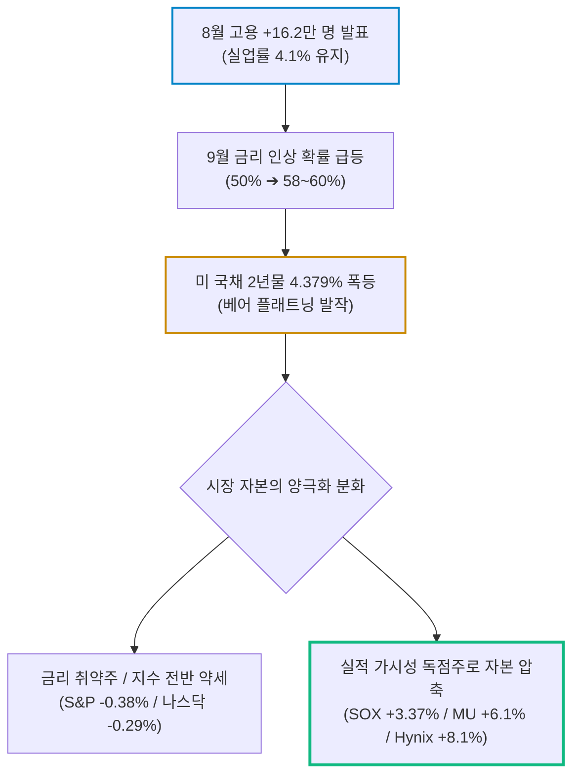
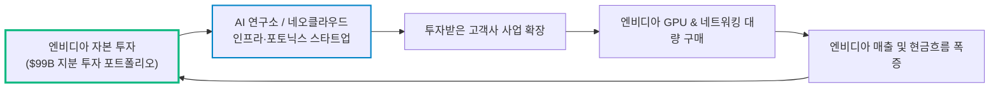

# 2026년 09월 05일(토) 하루치 뉴스정리

- **작성일**: 2026-09-05

금리 재인상 공포가 다시 살아났는데도 필라델피아 반도체지수가 +3% 이상 급등한 것은 위험자산 전체 매도가 아니라 '금리를 이길 수 있는 실적·성장주'로의 자본 압축을 의미하며, 9월 11일 CPI 전까지는 핵심 AI 포지션을 유지하고 현금을 비축하는 것이 가장 합리적인 전략이다.

## 요약

| 구분 | 주요 내용 |
| :--- | :--- |
| **핵심 진단** | "고용 호조로 주식이 망했다"가 아니다. 금리 재인상 공포 속에서도 **반도체(+3.37%)로 돈이 집중**되며, 금리를 견딜 실적주와 그렇지 못한 종목이 갈라지는 차별화 장세다 |
| **매크로 팩트** | 8월 비농업고용 +16.2만(월평균 +3.1만 상회), 실업률 4.1%. **9월 25bp 인상 확률 50% ➔ 58~60% 급등**. 2년물 4.379%, 10년물 4.784%(베어 플래트닝), WTI $91.48, 브렌트 $96.28 |
| **대중의 착시 교정** | "고용 강하니 9월 인상 확정"은 섣부른 오판이다. 임금 상승률(+3.1%) 폭발은 없다. **진짜 승부처는 9월 11일 CPI**다 |
| **반도체 신호** | 다우·S&P·나스닥 하락 속 **SOX +3.37%, 마이크론 +6.1%, SK하이닉스 +8.1% 폭등**. AI 서버 발 메모리 숏티지 및 가격 상승세 확인 |
| **브로드컴(AVGO)** | FY27 AI 매출 $115B, FY28 $230B 제시. 성장이 깨진 게 아니라 **시장의 미친 기대치($130~150B)보다 덜 엄청나서 눌린 것**(사업 리스크 < 기대치 리스크) |
| **소프트웨어 확산** | **Snowflake**(매출 가속 + 마진 +270bp)로 입증된 'GPU ➔ 네트워크 ➔ 데이터 ➔ 소프트웨어'로의 AI 수익화 확산 |
| **계좌 행동 지침** | 전량 매도도 추격 풀매수도 금지다. **핵심 AI 인프라(반도체/메모리/네트워킹/데이터) 포지션 유지 + 9월 11일 CPI 전까지 신규 현금 대기** |

---

## 결론부터: 시장의 착각과 차별화의 본질

오늘 시장의 핵심은 “고용이 너무 좋아서 주식이 망했다”가 아니다. 정확히는 이거다.

**금리 재인상 공포가 다시 살아났는데도 AI·반도체에는 돈이 들어왔다.**

그래서 지금 시장은 위험자산 전체 매도장이 아니라, 금리를 견딜 수 있는 실적·성장주와 그렇지 못한 종목을 갈라버리는 장세다.

S&P500 -0.38%, 나스닥 -0.29%인데 필라델피아 반도체지수는 +3% 이상 올랐다. 단순한 기술적 반등으로만 치부하기엔 상대강도가 상당히 강하다. 실제로 외부 시장 데이터에서도 같은 흐름이 확인된다. ([Barron's](https://www.barrons.com/livecoverage/stock-market-news-today-090426/card/fed-fears-overpower-chip-jump-sending-stock-market-lower-d4i8FYZIt53KI2uXxXlL?utm_source=chatgpt.com))

---

## 1. 기사 속 팩트부터 정리

### ① 고용: 확실히 강하게 나왔다

8월 비농업고용은 **+16.2만 명**이다.

최근 12개월 월평균 고용 증가가 +3.1만 명이었던 것을 생각하면 강하다. 실업률도 4.1%로 유지됐다. 음식점·주점 +5.9만, 지방정부 교육 +4.2만이 특히 컸고 정보산업은 감소했다. 이건 기사만의 숫자가 아니라 BLS 공식 발표와 일치한다. ([Bureau of Labor Statistics](https://www.bls.gov/news.release/archives/empsit_09042026.htm?utm_source=chatgpt.com))

다만 여기서 하나 잘 봐야 한다.

16.2만이라는 헤드라인만 보고 “미국 경기가 다시 과열됐다”고 말하면 너무 나간다. 고용 증가 상당 부분이 음식서비스와 지방정부 교육에 집중돼 있고, 첨부 기사 기준 시간당 임금은 전월 대비 +0.3%, 전년 대비 +3.1%다.

- **고용 지표**: 뜨거움
- **임금 인플레이션 폭발**: 아님

그래서 연준의 최종 판단은 아직 CPI다.

### ② 시장이 무서워하는 것은 경기 호황이 아니라 '금리 재인상'

고용 발표 이후 시장에 반영된 9월 25bp 인상 가능성이 약 **50% → 58~60%**까지 뛰었다. 채권도 정직하게 반응했다.

| 지표 | 수치 / 동향 | 시장의 실질적 의미 |
| :--- | :---: | :--- |
| **미국 2년물 국채 금리** | **4.379%** | 정책금리 경로 재평가로 장중 4.425%까지 터치 |
| **미국 10년물 국채 금리** | **4.784%** | 장기물 상승보다 단기물 상승 폭이 더 큼 |
| **미국 30년물 국채 금리** | **5.246%** | 장기 기대 인플레보다는 단기 금리 상승 연동 |
| **2Y-10Y 스프레드** | **43.1bp → 40.5bp** | 단기물이 더 튀는 전형적인 **베어 플래트닝(Bear Flattening)** |
| **달러인덱스** | **99.145** | 금리 상승에 연동되어 달러 강세 기조 유지 |
| **금 (Gold)** | **약 -1.5%** | 실질금리 상승 압박으로 차익 매물 출회 |

특히 2년물이 장기물보다 더 많이 상승한 베어 플래트닝이 중요하다. 시장은 “장기 성장 기대가 폭발한다”가 아니라 **“연준이 당장 단기금리를 더 올릴 가능성이 생겼다”** 쪽으로 반응한 거다.

---

## 2. 대중의 첫 번째 착시: "고용 강하니 9월 인상 확정?"

아니다. 여기서는 금리인상론자 말보다 CPI 일정을 보는 게 낫다.

미국 8월 CPI는 9월 11일, FOMC는 그다음 주다. BLS 일정에서도 확인된다. ([Bureau of Labor Statistics](https://www.bls.gov/schedule/2026/?utm_source=chatgpt.com)) 고용이 16.2만이라고 해서 바로 끝난 게 아니다. 내 판단은 대략 이렇다.

| 구분 | 팩트 및 시나리오 분석 |
| :--- | :--- |
| **확정된 사실** | • 고용은 예상(+3.1만 월평균)보다 훨씬 강했다. • 실업률은 4.1%로 악화되지 않았다. • 9월 인상 기대가 크게 상승(60%)했다. |
| **신뢰도 높은 추정** | • CPI가 뜨겁다면 25bp 인상 쪽이 상당히 유리하다. • CPI가 확실하게 둔화되면 동결 논리가 다시 살아난다. |
| **시장의 해석** | 현재는 인상 쪽으로 약간 기울어 있다. |
| **과장된 주장 (착시)** | **“16.2만 고용 때문에 9월 금리인상 확정됐다.”** ➔ 이건 아직 아니다. |

따라서 **9월 11일 CPI가 이번 시장의 진짜 승부처**다.

---

## 3. 오늘 가장 중요한 신호는 고용보다 이것이다: "반도체가 금리를 무시했다"

지수는 맥없이 빠졌다.

- Dow: **-0.51%**
- S&P500: **-0.38%**
- Nasdaq: **-0.29%**

그런데 반도체 섹터는 완전히 다른 세상이었다.

- **SOX (필라델피아 반도체지수)**: **+3.37%**
- **마이크론 (MU)**: **+6.1%**
- **AMD**: **+4%대**
- **ASML**: **+4%대**
- **SK하이닉스 ADR**: **+8.14%**

이걸 그냥 “전날 덜 올라서 키 맞추기”라고 설명하는 건 하수들의 분석이다.

실제로 시장에서는 메모리·스토리지·AI 반도체 쪽에 매수가 집중됐고 소프트웨어는 상대적으로 약했다. ([Investopedia](https://www.investopedia.com/market-update-memory-other-ai-related-stocks-lead-the-markets-top-performers-friday-12108315?utm_source=chatgpt.com))

여기에 핵심 펀더멘털 메커니즘이 작동하고 있다.

!!! note "메모리 펀더멘털 선순환 체인"
    **AI 서버 수요 폭증 ➔ 메모리 공급 부족(쇼티지) ➔ 메모리/NAND 가격 상승세 가속**

번스타인도 메모리 가격이 계속 예상치를 웃돌고 특히 NAND 상승세가 강해지고 있다고 평가했다.

이게 중요한 이유는 간단하다. **금리 재인상 확률이 올라간 날에도 시장은 “AI CAPEX 사이클 자체는 깨지지 않았다”고 판단했다는 뜻이다.**

---

## 4. 그런데 여기서 또 착각하면 안 된다: "반도체 +3%니까 AI주는 전부 사도 된다?"

그건 더 위험한 바보짓이다. 오늘 시장이 보여준 건 AI 전체의 무차별 강세가 아니다. **종목별 기대치에 따른 잔혹한 차별화**다. 대표적인 게 브로드컴(AVGO)이다.

---

## 5. 브로드컴(AVGO): 오늘 뉴스 중 나는 이걸 가장 중요하게 본다

브로드컴의 FY27 AI 매출 1,150억 달러, FY28 2,300억 달러 전망이 나왔다. 이건 단순 애널리스트 추정이 아니다. Hock Tan CEO가 실적 컨퍼런스콜에서 직접 뱉은 숫자다.

- **FY27**: 약 **$115B** (공급 이미 확보, 수요가 숫자 초과)
- **FY28**: 약 **$230B**

관련 컨퍼런스콜 자료에서도 확인된다. ([마켓비트](https://www.marketbeat.com/earnings/reports/2026-9-2-broadcom-inc-stock/?utm_source=chatgpt.com)) 현재 분기 숫자도 미친 수준이다.

| 브로드컴 실적 지표 | 공식 발표치 | 시장 의미 |
| :--- | :---: | :--- |
| **Q3 총매출액** | **$29.6B (+86% YoY)** | 거대 체급에서 86% 성장 |
| **AI 반도체 매출** | **$16.7B (+221% YoY)** | 폭발적 가속 페달 |
| **잉여현금흐름 (FCF)** | **$13.7B** | 분기만에 137억 달러 현금 창출 |
| **Q4 매출 가이던스** | **$34.8B** | 전년 대비 견조한 우상향 지속 ([Broadcom Inc.](https://investors.broadcom.com/news-releases/news-release-details/broadcom-inc-announces-third-quarter-fiscal-year-2026-financial?utm_source=chatgpt.com)) |

그런데 왜 주가는 안 가느냐?

**이유는 회사가 나빠서가 아니다. 시장의 기대치가 더 미쳐 있었기 때문이다.**

바이사이드 일부에서는 FY27 AI 매출을 이미 $130B~$150B 가까이 보고 있었는데, 회사가 $115B를 제시해버렸다.

그러니 **“성장 둔화” 때문이 아니라, “성장은 엄청난데 시장이 원하던 숫자보다 덜 엄청남” 때문에 주가가 눌리는 거다.** 실적 후 브로드컴 약세를 다룬 시장 분석들도 같은 부분을 지적한다. ([MarketWatch](https://www.marketwatch.com/story/broadcom-stock-fall-as-investors-weigh-guidance-heres-what-wall-street-analysts-are-saying-9048c0e6?utm_source=chatgpt.com))

---

## 6. 브로드컴에 대한 내 판정: 사업 리스크 < 기대치 리스크

| 구분 | 분석 및 판정 |
| :--- | :--- |
| **확정된 사실** | AI 사업 성장률은 여전히 폭발적이다. |
| **신뢰도 높은 추정** | 향후 2년 동안 AI XPU + Ethernet networking 수요가 브로드컴 실적을 계속 끌고 간다. Hock Tan은 Ethernet 스위칭, PCIe, optical interconnect까지 AI 네트워킹 매출이 XPU만큼 빠르게 성장할 것으로 전망했다. ([마켓비트](https://www.marketbeat.com/earnings/reports/2026-9-2-broadcom-inc-stock/?utm_source=chatgpt.com)) |
| **시장의 해석** | 문제는 실적이 아니라 밸류에이션과 기대치다. |
| **과장된 주장** | “브로드컴 가이던스가 실망스러우니 AI 성장 스토리가 깨졌다.” ➔ 현재 숫자를 놓고 보면 설득력이 바닥이다. |

오히려 지금 브로드컴의 리스크는 내가 줄곧 강조해 온 핵심 명제에 맞닿아 있다.

!!! warning "핵심 리스크 판정: 사업 리스크 < 기대치 리스크"
    회사 사업 자체는 더할 나위 없이 엄청나게 좋다. 문제는 너무 많은 투자자가 이미 그 사실을 기정사실화하고 눈높이를 하늘 끝까지 올려놓았다는 점이다. 즉, **기업의 사업 펀더멘털에 문제가 생긴 게 아니라, 비현실적으로 치솟았던 '시장의 기대치 리스크'가 주가를 짓누르는 본질**이다.

---

## 7. Snowflake 뉴스: 인프라 바깥으로 번지는 AI 돈길

여기서 AI 투자 사이클이 다음 단계로 넘어가고 있다는 결정적 흔적이 나온다.

- **Snowflake 실적 모멘텀**:
    - 제품 매출 컨센서스: **+5% 상회**
    - EBIT 마진 컨센서스: **+270bp 상회**
    - FY27 제품 매출 가이던스: 시장 예상 대비 **+4% 상향**
    - EBIT 마진 전망: **+100bp 상향**
    - **3개 분기 연속 제품매출 성장률 가속** ➔ 여러 IB가 목표주가 대폭 상향

이걸 단순히 “AI 테마니까 올랐다”고 보면 안 된다.

AI 인프라 투자 이후 투자자들이 기다리던 흐름이 바로 **[GPU → 네트워크 → 데이터 → 소프트웨어]**로 돈이 이동하는 과정이었다. Snowflake에서 실제 사용량과 매출 가속이 나타난다면 AI 수익화가 인프라 하드웨어 바깥으로 번지고 있다는 강력한 증거다.

그래서 최근 시장에서 **AI 하드웨어 성장률은 엄청난데 주가는 멈칫하고, 소프트웨어는 작은 실적 상향에도 폭발적으로 반응하는 현상**이 나타난다. Broadcom과 Snowflake의 시장 반응 차이를 지적한 분석도 정확히 같은 맥락이다. ([Barron's](https://www.barrons.com/articles/stock-market-things-to-know-today-d343c1a0?utm_source=chatgpt.com))

---

## 8. 스마트머니가 보는 질문의 변화 (2024 vs 2026)

이제 시장의 질문이 완전히 바뀌었다.

- **2024~2025년**: "너 AI 수혜주 맞아?"
- **2026년 현재**: **"그 AI CAPEX가 실제 매출과 잉여현금흐름(FCF)으로 얼마나 빨리 전환되는데?"**

그래서 같은 AI 간판을 달고 있어도 주가는 완전히 갈린다.

| 영역 | 대표 업종 및 특징 | 스마트머니의 포지션 |
| :--- | :--- | :---: |
| **상대적으로 강한 곳** | • **메모리**: HBM, DRAM, NAND (공급 부족 및 가격 결정력 장악) • **AI 네트워킹**: Ethernet, optical, switch, DSP • **Custom ASIC / XPU**: 빅테크 자체 칩 전용 하드웨어 • **데이터 플랫폼**: Snowflake (실제 사용량 기반 매출 가속) | **강력 비중 유지 및 눌림목 매수** |
| **가장 조심해야 할 곳** | • “AI를 한다”는 말은 많은데 매출 성장률 제로인 기업 • 연간반복매출(ARR) 증가 없는 껍데기 SaaS • FCF가 마이너스이고 신규 고객 유입이 멈춘 기업 | **가차 없는 정리 및 비중 축소** |

AI라는 단어만 붙이면 밸류에이션을 후하게 쳐주던 시대는 끝났다.

---

## 9. Nvidia의 $99B AI 지분투자: 자본 자체가 해자다

표면적으로는 “엔비디아가 AI 기업에 투자해서 평가차익을 얻었다” 수준의 뉴스가 아니다. 핵심은 **엔비디아가 자기 고객들을 직접 자본으로 키우고 있다는 점**이다.

CUDA 소프트웨어만 해자가 아니다. **자본 자체가 생태계의 절대 해자**로 변하고 있다. 이건 AMD가 죽었다 깨어나도 쉽게 따라가지 못하는 체급의 격차다.

다만 한 가지는 반드시 경계해야 한다. 투자자와 공급자가 동일해지면 장기적으로 **벤더 파이낸싱(Vendor Financing)과 순환적 수요 왜곡 문제**가 생길 수 있다. 아직 위험 수위라고 단정할 근거는 부족하지만, 앞으로 반드시 추적해야 할 변수다.

---

## 10. 유가·국부펀드·무역적자의 행간 읽기

### ① 유가는 진짜 공급 부족보다 '위험 프리미엄'이다
- **현황**: WTI $91.48, Brent $96.28 (5거래일 연속 상승). 홍해 바브엘만데브 해협과 이란 리스크가 동시에 붙었다.
- **팩트 폭행**: 현지 전문가 분석대로, **현재까지 실제 중동 원유 수출이 물리적으로 차질을 빚었다는 증거는 없다.**
- **판정**: 지금 유가는 물리적 공급 붕괴(+100)가 아니라 지정학적 위험 프리미엄이다. 따라서 “전쟁 발발로 유가 $120 확정”이라는 논리는 과장이다. 다만 실제 유조선 통행 차질이 가시화되면 유가 ➔ CPI ➔ Fed 인상 ➔ 장기금리 폭등이라는 최악의 꼬리위험(Tail Risk)으로 연결된다.

### ② 노르웨이 국부펀드의 미국채 축소: '미국 불신'이 아니다
- **현황**: 국채 비중 70% ➔ 50%, 미국채 비중 34.1% ➔ 21.9% 축소 제안.
- **팩트 폭행**: 미국채만 버리는 게 아니라 유럽 국채 비중도 똑같이 줄인다. “미국 신뢰 붕괴”라는 주장은 삼류 찌라시 수준의 과장이다.
- **판정**: 선진국 정부 부채가 통제 불능으로 불어나면서 장기채 듀레이션 리스크(Duration Risk)를 줄이려는 정상적인 포트폴리오 리밸런싱이다. 다만 초대형 국부펀드들의 장기채 매도세는 10~30년물 금리에 구조적 상방 압력을 준다.

### ③ 미국 무역적자 확대: 소비 붕괴가 아닌 '투자형 수입'
- **현황**: 7월 무역적자 $88.6B (+24%).
- **팩트 폭행**: 적자가 늘어난 수입 품목의 상당수가 **컴퓨터, 반도체, AI 데이터센터 장비**다.
- **판정**: 소비 과열형 적자가 아니라, 미국 본토의 AI CAPEX 붐 때문에 발생하는 **투자형 수입 증가**다. 질적으로 완전히 다른 적자다.

---

## 11. 개별 종목 뉴스 가치 등급 매트릭스

| 등급 | 티커 / 종목 | 핵심 진단 및 스마트머니 판정 |
| :---: | :---: | :--- |
| **A급** | **`AVGO` (브로드컴)** | AI 성장 스토리는 더 단단해졌다. 문제는 실적이 아니라 시장의 미친 눈높이다. |
| | **`SNOW` (스노우플레이크)** | AI가 하드웨어를 넘어 소프트웨어 실사용량과 매출로 전파되고 있다는 결정적 신호다. |
| | **`MU` / `SK하이닉스`** | AI 서버 수요 폭증이 메모리 가격 폭등과 공급 부족으로 현실화되는 가장 강력한 돈길이다. |
| **B급** | **`CIEN` (시에나)** | 빅테크(메타+구글) 비중 41.7%. 광네트워크 수요는 진짜이나 고객 집중도와 공급 병목을 감안해야 한다. 무조건 저가매수는 금물이다. |
| | **`INTC` (인텔)** | CPU 쇼티지, 첨단 패키징, 구글 TPU 참여는 흥미로우나 2029년 숫자는 너무 멀다. 실적 증명이 더 필요하다. |
| | **`ZS` (지스케일러)** | AI 보안 스토리보다 신규 ARR +17%, 매출총이익률 76.8%라는 기본 사업의 숫자가 좋다. |
| **C급 (경계)** | **`LULU` (룰루레몬)** | 마이클 버리가 산다는 건 매수 근거가 될 수 없다. 마진 악화와 성장 둔화가 겹쳤다. 100달러 밑이라고 싼 게 아니다. |
| | **`FLNC` (플루언스)** | 수주잔고만 많고 실행을 못 한다. 수주잔고는 쌓이는데 현금흐름이 썩은 기업은 가장 먼저 걸러야 한다. |
| | **`HPE` (휴렛팩커드엔터)** | AI 수요는 넘치나 공급이 못 따라간다. 좋은 업황이 반드시 좋은 주식을 보장하지는 않는다. |

---

## 12. 다음 주 시장을 보는 4대 우선순위

다음 주엔 잡다한 뉴스 100개를 볼 필요 없다. 아래 4가지 순서만 머릿속에 넣어두면 된다.

1. **1순위 — 9월 11일 CPI**:
   - 예상치를 밑돌면 금리인상 확률 급락, 2년물 금리 하락, 달러 약세로 전환된다. 성장주 밸류에이션 부담이 풀리며 나스닥과 AI가 다시 주도권을 쥔다.
2. **2순위 — 유가 (WTI $90선 지지 여부)**:
   - WTI가 $90 위에서 실제 원유 수송 차질을 빚으며 $100을 뚫는지 확인해야 한다. 이 선을 넘으면 CPI를 자극해 연준을 코너로 몰아넣는다.
3. **3순위 — 미국 2년물 국채 금리 (4.40~4.45%)**:
   - 현재 4.38% 수준이다. 장중 찍었던 4.425% 위로 안착하는지, 아니면 다시 4.3% 초반으로 꺾이는지가 단기 기술주 할인율의 열쇠다.
4. **4순위 — SOX (필라델피아 반도체지수) 상대강도**:
   - 지수 조정에도 반도체가 계속 시장을 아웃퍼폼한다면, AI CAPEX 사이클이 살아있다는 가장 확실한 증거다.

---

## 13. 종합 결론 및 핵심 실행 원칙

### 내가 지금 계좌를 운용한다면 이렇게 한다

**전부 던지고 도망갈 이유도 없고, 흥분해서 추격 풀매수를 지를 자리도 아니다.**

1. **AI 인프라 핵심 종목은 굳건히 쥐고 간다**:
   - 숫자가 실제로 찍히는 **AI 반도체, 메모리, 네트워킹, 데이터 인프라**는 금리 발작이 와도 던질 이유가 없다.
2. **금리 인상 확률 60%만 보고 성장주를 다 파는 것은 하수의 짓이다**:
   - 금리 인상 확률이 치솟은 바로 오늘, 반도체 지수가 +3.37% 폭등했다. 시장은 이미 답을 보여주었다.
3. **신규 총알(현금)은 9월 11일 CPI 발표 전까지 아껴둔다**:
   - 만약 CPI가 예상보다 뜨겁게 나오면 시장은 한 차례 더 거친 금리 발작을 겪을 수 있다. 그 기회를 잡기 위한 현금 버퍼는 반드시 남겨두어야 한다.

| 구분 | 핵심 판단 | 계좌 행동 방침 |
| :--- | :--- | :--- |
| **핵심 포지션** | AI 실적 폭발 종목 (메모리, 네트워킹, 데이터 인프라) | 흔들리지 않고 보유 유지 |
| **추격 매수** | 단기 급등 종목 및 실적 없는 AI 테마주 | 추격 매수 엄격 금지, 비중 축소 |
| **신규 자금** | 9월 11일 CPI 발표 전까지의 현금 버퍼 | 현금 20~30% 온존, CPI 확인 후 집행 |

!!! tip "최종 핵심 제언 (Executive Takeaway)"
    - **“경기침체 공포”는 죽었고, “고금리 장기화 리스크”가 다시 고개를 들었다. 그러나 AI 실적 사이클은 그 금리 압력을 씹어먹을 만큼 강력하다.**
    - 지금 시장은 방향성을 찍는 홀짝 게임이 아니라, **"금리를 이길 정도로 이익 추정치가 폭증하는 1등 기업"을 골라내는 선별 게임**이다.
    - 가장 위험한 실수는 두 가지다. 첫째, "금리 오른다니 AI는 끝났다"고 지레 겁먹고 우량주를 던지는 것. 둘째, "AI가 대세라니 아무 잡주나 사도 된다"고 덤비는 것.
    - **CPI 전까지 기존 핵심 AI 포지션 유지 + 현금 비축. CPI 이후 금리와 SOX 반응을 보고 추가 매수.** 데이터에 기반한 이 원칙만이 흔들리는 장세에서 살아남는 유일한 길이다.
