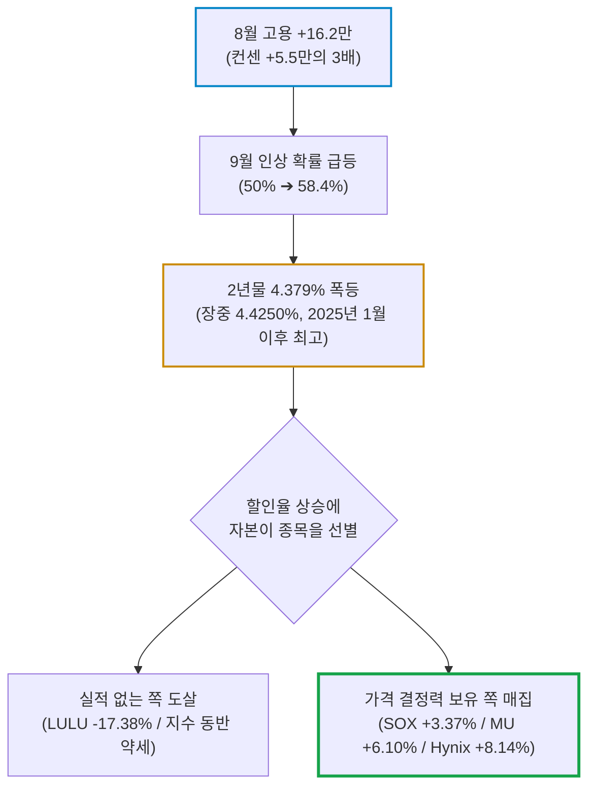
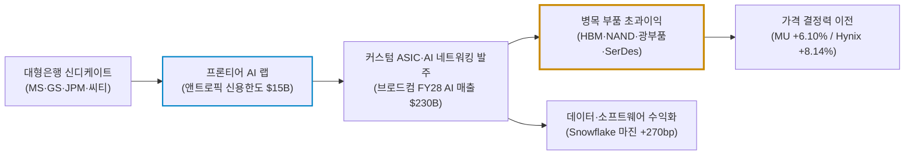

# 2026년 09월 05일(토) 하루치 뉴스정리

- **작성일**: 2026-09-05

8월 고용이 컨센서스의 3배로 터지며 9월 금리 인상 확률을 58%까지 밀어 올렸는데도 필라델피아 반도체지수는 +3.37% 폭등했다. 이건 위험자산 매도장이 아니라 금리 4.4%를 견딜 실적을 가진 놈과 그렇지 못한 놈을 도살하듯 갈라버리는 선별 압축장이다.

## 요약

| 구분 | 주요 내용 |
| :--- | :--- |
| **핵심 진단** | 지수는 빠졌는데 반도체만 +3.37% 튀었다. 전면 매도가 아니라 **금리를 이길 실적주로의 자본 압축**이다. 룰루레몬 -17.38%가 그 반대편 사형 집행이다 |
| **매크로 팩트** | 8월 비농업고용 **+16.2만**(컨센 +5.5만), 실업률 4.1%, 임금 +3.1% YoY. 9월 25bp 인상 확률 **50% ➔ 58.4%**. 2년물 4.379%(장중 4.4250%), 10년물 4.784%, 30년물 5.246%, 2s10s 40.5bp 베어 플래트닝 |
| **착시 교정** | "16.2만이니 인상 확정"은 헛소리다. 전달 수치가 -2.3만에서 **+2.1만으로 뒤집힌** 통계다. 고용 증가분의 절반은 식당·술집(+5.9만)과 지방정부 교육(+4.2만)이고 정보 부문은 **-2.3만**이다 |
| **반도체 신호** | SOX **+3.37%**, 마이크론 +6.10%, SK하이닉스 ADR **+8.14%($177)**, 샌디스크 +7%, AMD·ASML·인텔 +4%대. 특별한 재료 없이 낸드·D램 가격 상승 하나로 붙은 불이다 |
| **돈길 확산 신호** | 앤트로픽 리볼빙 신용한도 **$15B** 확정(MS·GS·JPM·씨티), 엔비디아 AI 지분 **$99B**(1년 만에 10배), 브로드컴 FY28 AI 매출 **$230B** 제시, 스노우플레이크 마진 +270bp |
| **가장 더러운 변수** | **9월 11일 CPI** 단 하나다. 실적 시즌은 끝났고 FOMC는 그다음 주다. 여기에 WTI $91.48(5거래일 연속)과 바브엘만데브 교전이 물가 상단 리스크를 얹는다 |
| **계좌 행동 지침** | 전량 매도도 추격 매수도 바보짓이다. **핵심 4축(메모리·커스텀 ASIC·광부품·데이터 플랫폼) 보유 유지 + CPI 전까지 현금 20~30% 대기 + 오늘 급등분 추격 금지** |

---

## 결론부터: 오늘 시장의 본질은 '하락'이 아니라 '도살'이다

오늘 시장을 "고용이 좋아서 주식이 망했다"로 요약하면 핵심을 통째로 놓친다. 정확히는 이거다.

**금리 재인상 공포가 되살아났는데도 AI 인프라에는 돈이 더 들어왔다.**

다우 -0.51%, S&P -0.38%, 나스닥 -0.29%인데 필라델피아 반도체지수는 +3.37%다. 같은 날 룰루레몬은 -17.38%로 도륙당했다. 이게 무슨 뜻이냐. 시장은 지금 위험자산을 파는 게 아니라, **금리 4.4% 환경에서 살아남을 실적이 있는지 없는지로 종목을 두 무리로 갈라 세우고 한쪽을 처형하고 있다.**

---

## 1. 기사 속 팩트 폭행

### 1.1 고용: 숫자는 강했지만 내용은 저질이다

| 항목 | 실제 | 컨센서스 | 의미 |
| :--- | :---: | :---: | :--- |
| **8월 비농업 신규고용** | **+16.2만** | +5.5~5.6만 | 3배. 전문가 전망 상단(12만 초반)도 뚫었다 |
| **7월 수정치** | **-2.3만 ➔ +2.1만** | — | 6~7월 합산 +5.5만 상향. 통계 신뢰도 자체가 흔들린다 |
| **실업률** | **4.1%** | 4.2% | 전월과 동일, 악화 없음 |
| **평균 시급** | +0.3% MoM / **+3.1% YoY** | — | 임금 인플레 재점화 증거는 없다 |
| **12개월 월평균** | +3.1만 | — | 8월은 3월(+21.4만) 이후 5개월 만의 최고치 |

업종을 뜯어보면 그림이 완전히 달라진다. **식품서비스·주점 +5.9만**(12개월 평균 1.2만), 지방정부 교육 +4.2만, 제조 +1.6만, 헬스케어 +1.3만. 반대로 **정보(IT) 부문은 -2.3만으로 감소**했다. 고용 증가분의 3분의 1이 식당과 술집이다. 고임금 화이트칼라는 잘려 나가고 저임금 서비스직이 그 자리를 메웠다. 이걸 "경기 과열"이라 부르는 건 숫자를 안 읽었다는 자백이다.

### 1.2 금리·채권·통화: 단기물이 튀었고 커브가 눕었다

| 지표 | 수치 | 판정 |
| :--- | :---: | :--- |
| **9월 25bp 인상 확률** | **58.4%** | 월러 발언 직후 48~50%에서 급등. 10월까지는 약 70% |
| **미국 2년물** | **4.379%** | 장중 4.4250% 터치. 2025년 1월 이후 최고 |
| **미국 10년물** | **4.784%** | 장중 4.80% 상회 후 반락 |
| **미국 30년물** | **5.246%** | 단기물 대비 상승 폭이 미미 |
| **2s10s 스프레드** | **43.1bp ➔ 40.5bp** | 전형적 **베어 플래트닝** |
| **달러인덱스** | **99.145** | 장중 99.392까지 상승 후 강세분 반납 |
| **금 12월물** | **$4,472.60 (-1.48%)** | 실질금리 상승에 직격 |

캐나다는 정반대다. 8월 고용 **-4.2만**(컨센 +1.5만), 실업률 6.4%, 임금 +2.0%(7월 +2.8%). 달러-캐나다달러가 1.3831까지 밀린 이유다. 북미에서 미국만 홀로 뜨겁다.

### 1.3 증시: 지수는 죽고 반도체는 날았다

- **지수**: 다우 53,414.25(-0.51%), S&P 7,718.60(-0.38%), 나스닥 26,506.99(-0.29%), VIX 14.53(+1.47%)
- **반도체**: SOX **+3.37%**. 마이크론 **+6.10%**, SK하이닉스 ADR **+8.14%($177, 7/14 이후 최고)**, 샌디스크 +7%, AMD·ASML·인텔 +4%대. 브로드컴만 약보합
- **처형 종목**: 룰루레몬 **-17.38%**(3분기 매출·EPS 가이던스 대폭 하회). UBS 목표가 120 ➔ 106, FY26 EBIT 마진 -6.5%p·EPS -31% 전망
- **어도비 -6.73%**: 샨타누 나라옌 ➔ 아닐 차크라바르티 CEO 교체 발표
- **가상자산**: 비트코인 +4.4%로 **$80,000 돌파**(장중 $81,378, 5월 이후 최고). 로빈훗이 S&P500 상승률 1위, 코인베이스 동반 강세
- **희토류**: 중국 일부 기업 대미 수출 중단 발표 ➔ USAR +5.0%, CRML +6.2%
- **기타**: 스미스앤웨슨 프리마켓 +12%, 지스케일러는 호실적에도 -3.5%, 유아이패스 -9%

### 1.4 AI 자본의 실제 이동 경로

| 주체 | 팩트 | 해석 |
| :--- | :--- | :--- |
| **엔비디아** | AI 산업 지분 가치 **$99B**(1년 전 대비 10배 이상), 2026년 투자약정 $40B 이상. 인텔 투자 $5B ➔ **$30B**. Hugging Face 인수 | 칩이 아니라 **자본으로 생태계를 봉쇄**하는 단계 |
| **브로드컴** | FY27 AI 매출 **$115B**, FY28 **$230B** 신규 제시. 6대 고객 중 앤트로픽·오픈AI의 컴퓨팅 확대 속도 압도적 | 바이사이드 기대는 $130~150B였다. 실적이 아니라 **눈높이**가 문제다 |
| **앤트로픽** | IPO 앞두고 리볼빙 신용한도 **$15B** 확대(당초 목표 $10B). MS 주도, GS·JPM·씨티 참여 | 이 은행들이 곧 IPO 주관사다. **다음 사이클 CAPEX 자금줄 확정** |
| **스노우플레이크** | 제품 매출 컨센 +5%, EBIT 마진 +270bp, 3개 분기 연속 성장 가속. GS 목표가 300 ➔ **436**, JPM 285 ➔ 426 | AI 수익화가 GPU를 넘어 **데이터 계층 실사용 매출**로 전환 |
| **HPE** | 전체 주문 **+42% YoY**, 네트워킹 주문 +36%인데 매출은 +10% | 못 팔아서가 아니라 **못 만들어서** 생긴 격차 |
| **시에나** | 실적·가이던스 상회했는데 -10.4%. 매출의 **41.7%가 메타+알파벳**, 전분기 증가분은 전부 이 둘. FY27 매출 +30%인데 마진 확대는 제한적 | 수요는 진짜, 고객 집중도는 폭탄 |
| **인텔** | 미즈호 목표가 109 ➔ 92(중립). CPU 공급부족 2027년까지 지속 전망, 첨단패키징·파운드리 외부 매출 각각 2029년 $3.5B | 수요는 좋은데 **AI 에이전트 관련주 배수가 깎이는 중** |
| **캐시 우드** | AMD 15만6,286주(약 $72.8M) 매도, 엔비디아 24만3,707주($53M) 매수, 브로드컴 비중 확대 | 같은 기간 AMD 보유 헤지펀드는 134 ➔ **164개로 증가** |

### 1.5 유가·지정학·국가 자본

- **WTI 10월물 $91.48**(+0.20%, 5거래일 연속 상승), **브렌트 11월물 $96.28**(+0.80%)
- 예멘 정부군과 후티 반군이 타이즈 서부·호데이다 남부에서 교전, 하루 사망 **129명**. 후티의 목표는 **바브엘만데브 해협을 내려다보는 고지대 장악**이다. 호르무즈에 이어 두 번째 목줄이 흔들린다
- 트럼프는 이란 핵시설 추정지 추가 타격을 시사하면서 이란과의 전쟁을 "사소한 일"이라 표현했다
- 씨티는 3분기 브렌트 전망을 $80 ➔ **$86**, ANZ는 $92 ➔ **$95**로 상향
- **미국 7월 무역적자 $886억**(+24% MoM, 16개월 최대). 수입 $3,993억(+2.8%), 수출 $3,107억(-2.1%). **AI 컴퓨팅 장비·반도체 수입 폭증**이 주범이다
- **노르웨이 국부펀드(2.3조 달러)**: 채권 내 국채 비중 70% ➔ 50%, 미국채 **34.1% ➔ 21.9%**, 유럽 국채도 축소, 일본 국채는 확대. GDP 비례 ➔ 시가총액 가중 방식 전환
- 트럼프는 "정책금리는 1%나 0.5%에 있어야 한다", "연준은 애국자가 돼라", "금리 안 내리면 무역적자국과 무역을 중단하겠다"고 압박했고, 밴스 부통령까지 주택 구매를 이유로 금리 인하를 촉구했다

---

## 2. 대중의 눈먼 착시

- **① "16.2만 나왔으니 9월 인상 확정이다"**:
    - 확정된 건 아무것도 없다. 확률은 58%지 100%가 아니다. 더 웃긴 건 **바로 전달 수치가 -2.3만에서 +2.1만으로 통째로 뒤집혔다**는 사실이다. 오차가 10만 명씩 왔다 갔다 하는 통계를 붙잡고 "확정"을 외치는 건 도박이지 분석이 아니다.
    - BMO 하트먼은 "9월 16일 인상을 확정적으로 뒷받침하는 근거는 못 된다"고 못 박았고, 스테이트스트리트 딕슨은 "이 수치가 뭔가를 바꿨다고 생각하지 않는다"고 잘라 말했다. **진짜 판결일은 9월 11일 CPI다.**
- **② "고용이 뜨거우니 경제가 강하다"**:
    - 증가분의 절반 가까이가 식당·술집(+5.9만)과 지방정부 교육(+4.2만)이다. 정보 부문은 **-2.3만으로 감소**했다. 임금도 +3.1%로 폭발하지 않았다.
    - 이건 호황의 그림이 아니라 **노동시장 구성이 저질화되는 그림**이다. 기레기가 "괴물 고용"을 외칠 때 봐야 할 건 헤드라인이 아니라 이 구성비다.
- **③ "지수가 빠졌으니 위험자산은 끝났다"**:
    - 같은 날 SOX +3.37%, 마이크론 +6.10%, 하이닉스 +8.14%다. 이건 위험 회피장이 아니라 **선별 압축장**이다.
    - 금리 4.4%를 견딜 실적이 있는 놈에게 돈이 몰리고 없는 놈은 -17%로 처형된다. "시장 하락"이라는 한 줄 헤드라인으로 이 차별화를 못 보면 계좌가 죽는다.
- **④ "트럼프·밴스가 압박하니 곧 금리를 내린다"**:
    - 대통령이 "1%로 내려라"라고 외치면 금리가 내려가냐. 케빈 워시는 잭슨홀에서 매파로 섰고, 해맥 총재는 "인플레는 여전히 3%를 넘는다, 이제 행동할 때"라고 링크트인에 대놓고 썼다.
    - 정치적 고성은 가격에 영향을 못 준다. 오히려 연준 독립성 훼손 우려로 **장기물 금리(30년 5.246%)를 밀어 올리는 부작용**만 남긴다. "무역 중단" 협박은 협상용 소음이다. 매매 근거로 쓰지 마라.
- **⑤ "마이클 버리가 룰루레몬을 산다니 바닥이다"**:
    - 버리의 룰루레몬 비중은 포트폴리오의 **17.4%, 최대 포지션**이다. 이미 20% 물린 사람이 물타기 하는 걸 바닥 신호로 읽는 건 지능 낭비다.
    - UBS는 EBIT 마진 6.5%p 추가 하락과 EPS 31% 감소를 경고했다. 방문객 증가율은 취약하고 고정비 디레버리지가 진행 중이다. **유명인이 사면 안전하다는 건 개미가 만든 종교다.** 100달러 밑이라고 싼 게 아니다.
- **⑥ "유가 $91은 공급 대란이다"**:
    - 율리우스베어 뤼커가 직접 말했다. "이번 주 긴장 고조가 중동 원유 수출에 실질적 영향을 미쳤다는 징후는 없다. 현재 상승은 대부분 **심리와 공포**로 주도된 것이다."
    - 즉 실물 타이트닝이 아니라 **위험 프리미엄**이다. 다만 바브엘만데브가 후티 손에 넘어가면 얘기가 완전히 달라진다. 지금은 공포지만 실물로 넘어가는 순간이 진짜다.
- **⑦ "노르웨이 국부펀드가 미국을 버린다"**:
    - 미국채만 줄이는 게 아니라 **유럽 국채도 같이 줄인다.** GDP 비례에서 시총 가중으로 바꾸는 기계적 리밸런싱이지 "달러 패권 붕괴" 같은 찌라시 서사가 아니다.
    - 다만 결과는 결과다. 2.3조 달러 중 미국채 비중이 34.1% ➔ 21.9%로 빠지면 **장기물 수급에는 확실한 악재**다. 서사는 가짜인데 수급은 진짜인 케이스다.
- **⑧ "비트코인 $80,000 돌파는 금리 인상 기대 후퇴 덕이다"**:
    - 기사가 그렇게 썼는데, 같은 날 인상 확률은 50% ➔ 58%로 **올랐다**. 논리가 정면으로 깨진다.
    - 오른 건 금리 때문이 아니라 유동성과 투기 심리 때문이다. 언론이 사후에 갖다 붙인 인과관계를 믿고 매매하면 죽는다.

!!! warning "통계 신뢰도 자체가 이번 국면의 숨은 리스크다"
    7월 -10.3만, 8월 +10.6만. 실제치와 예상치의 괴리가 두 달 연속 10만 명대로 벌어졌다. 야누스핸더슨 스미스가 "고용 통계가 매우 가변적이라는 점을 일깨워줬다"고 한 이유다. **한 달치 서프라이즈에 포지션 전체를 거는 행위가 지금 가장 비싼 실수다.**

---

## 3. 고수들의 진짜 돈길

- **① 메모리 — 지금 시장에서 가장 정직한 돈**:
    - 번스타인 뉴먼이 말한 그대로다. "메모리 가격은 계속 예상을 웃돌고, **낸드가 가장 큰 폭의 상승과 지속적 가속**을 보이고 있다."
    - 그래서 특별한 재료 하나 없는 날 마이크론 +6.10%, 하이닉스 +8.14%, 샌디스크 +7%가 나왔다. 이건 테마 매수가 아니라 **가격 결정력 이전(pricing power transfer)**이다. AI 서버가 메모리를 빨아들이는데 증설은 2년이 걸린다.
- **② 공급 병목 — 완제품이 아니라 부품으로 돈이 몰린다**:
    - HPE는 주문이 **+42%인데 매출은 +10%**다. 시에나는 실적을 상회하고도 "공급 부족이 성장을 제한한다"고 실토했다.
    - 이 격차의 의미는 하나다. **완제품 업체 마진은 눌리고, 병목을 쥔 부품사(HBM·낸드·광부품·SerDes·스위치)가 초과이익을 가져간다.**
- **③ 브로드컴 — 사업 리스크가 아니라 기대치 리스크다**:
    - FY27 $115B, FY28 $230B는 **1년 만에 2배**다. 이게 실망스러워서 눌렸다? 바이사이드 기대치가 $130~150B였기 때문이다.
    - BofA는 목표주가를 내리면서도 **FY28 EPS를 32% 상향**했다. 추정치는 올라가는데 배수가 깎이는 국면이다. 숫자를 보는 놈은 사고, 헤드라인 보는 놈은 판다.
- **④ 엔비디아의 진짜 무기는 칩이 아니라 자본이다**:
    - AI 산업 지분 **$99B**, 1년 만에 10배. 인텔 $5B ➔ $30B. 이건 투자가 아니라 **생태계 봉쇄**다.
    - CCS 인사이트 포그가 정확히 짚었다. "투자를 받는 기업들이 엔비디아와의 연계를 강화하게 된다." 반독점 규제가 못 건드리는 방식으로 해자를 시멘트로 굳히는 중이다.
- **⑤ 앤트로픽 $15B 신용한도 — 이번 묶음에서 가장 조용한 대형 신호**:
    - 당초 목표 $10B를 뚫고 $15B가 됐고 MS·GS·JPM·씨티가 붙었다. **이 은행들이 곧 IPO 주관사다.**
    - 동시에 BMO는 브로드컴 6대 고객 중 "앤트로픽과 오픈AI가 컴퓨팅 용량을 압도적으로 빠르게 확대 중"이라고 했다. 대중이 고용지표에 정신 팔린 사이 **다음 12개월치 CAPEX 자금줄이 확정된 것**이다.
- **⑥ 소프트웨어로 번지는 수익화 — 스노우플레이크**:
    - 제품 매출 컨센 +5%, 마진 +270bp, 3개 분기 연속 가속. GS는 목표가를 300 ➔ 436으로 45% 올리면서 "향후 18개월간 추가 상향 가능성"까지 언급했다.
    - AI가 GPU 팔이에서 끝나지 않고 **데이터 계층 실사용 매출로 전환**되고 있다는 첫 번째 확실한 증거다.
- **⑦ 캐시 우드의 교체 매매는 신호가 아니라 소음이다**:
    - AMD 팔고 엔비디아·브로드컴 샀다고 언론이 호들갑인데, 같은 기간 **AMD 보유 헤지펀드는 134 ➔ 164개로 늘었다.** 엔비디아도 275 ➔ 285개다.
    - 기관 전체는 둘 다 담고 있다. 아크 하나의 리밸런싱을 시장 컨센서스로 착각하지 마라.
- **⑧ 채권 커브가 실토하는 것**:
    - 베어 플래트닝(43.1bp ➔ 40.5bp)은 **"단기 긴축은 하는데 장기 성장은 못 믿겠다"**는 시장의 자백이다.
    - 여기에 노르웨이 국부펀드의 장기물 축소와 일본 국채 비중 확대가 겹친다. 스마트머니는 지금 듀레이션을 길게 가져가지 않는다. **4.4%짜리 2년물이 리스크 대비 보상에서 압도적으로 낫다.**

---

## 4. 종목별 지금 판정

| 등급 | 종목 | 판정 근거 |
| :---: | :--- | :--- |
| **A급** | **`MU` / 메모리 체인** | 낸드·D램 가격 상승 가속. 증설 리드타임 2년. 재료 없이도 +6% 튀는 수급이 답이다. 단 오늘 급등분 추격은 금지 |
| **A급** | **`AVGO` (브로드컴)** | FY28 AI $230B는 1년 만에 2배다. 실적이 아니라 눈높이가 깨진 것. EPS 추정치는 32% 상향됐다 |
| **A급** | **`NVDA` (엔비디아)** | $99B 지분으로 생태계를 봉쇄 중. 칩 경쟁이 아니라 자본 경쟁 국면에 진입했다 |
| **B급** | **`SNOW` (스노우플레이크)** | AI 수익화의 소프트웨어 확산을 실적으로 증명. 다만 목표가가 이미 45% 상향됐다. 눌림목 대기 |
| **B급** | **`CIEN` (시에나)** | 광네트워크 수요는 진짜지만 메타+알파벳이 매출의 41.7%다. 고객 집중도가 폭탄이다 |
| **B급** | **`HPE`** | 주문 +42%는 강력하나 공급 능력이 발목을 잡는다. 부품사가 더 낫다 |
| **C급 (경계)** | **`INTC` (인텔)** | CPU 공급부족은 사실이나 배수가 깎이는 중이다. 미즈호 목표가 109 ➔ 92 |
| **D급 (회피)** | **`LULU` (룰루레몬)** | 마진 악화와 성장 둔화가 겹쳤다. 버리의 물타기는 매수 근거가 아니다 |
| **D급 (회피)** | **`FLNC` (플루언스)** | 수주잔고는 사상 최대인데 수익화 능력이 없다. 유동성까지 악화 중. 목표가 16 ➔ 10 |
| **D급 (회피)** | **`ADBE` (어도비)** | CEO 교체 직후 -6.73%. 전환기 기업은 최소 두 분기 관망이다 |

---

## 5. 계좌에서 지금 당장 해야 할 것

### 5.1 자금 배분과 진입 원칙

- **① CPI 전까지 신규 자금은 묶어둔다**:
    - 현금 비중 **20~30%** 유지. 지금 시장의 유일한 변수는 9월 11일 CPI다. CFRA 스토발 말대로 실적 시즌은 끝났고 FOMC는 그다음 주다. 다른 재료가 없다.
    - CPI 전에 방향을 걸고 들어가는 건 도박이지 투자가 아니다.
- **② 오늘 급등한 것부터 사지 않는다**:
    - 하이닉스 ADR +8.14%, 마이크론 +6.10%, 샌디스크 +7%. **하루에 이만큼 튄 자리를 추격하는 게 개미 사망 원인 1위다.**
    - 방향은 맞는데 진입 가격이 틀렸다. 메모리·네트워킹은 **눌림목에서만** 담는다. 급등 다음 날 던져지는 물량을 받아라.
- **③ 단일 종목 비중 상한은 15%로 못 박는다**:
    - 버리처럼 17.4%를 한 종목에 박아놓고 물타기를 시작하는 순간 판단력이 죽는다. 비중이 커지면 손절이 불가능해진다.

### 5.2 포지션 우선순위

| 우선순위 | 대상 | 근거 | 대응 방침 |
| :---: | :--- | :--- | :--- |
| **1순위** | 메모리 (HBM·D램·낸드) | 가격 결정력 + 증설 리드타임 2년 | 보유 유지, 조정 시 분할 매수 |
| **2순위** | 커스텀 ASIC / AI 네트워킹 | FY28 AI 매출 2배 가이던스 | 기대치 붕괴로 눌릴 때가 매수 기회 |
| **3순위** | 광부품·인터커넥트 | 주문과 매출의 격차가 증명한 병목 | 고객 집중도 확인 후 소량 |
| **4순위** | 데이터 플랫폼 | 실사용 매출 전환 확인 | 급등 후 눌림 대기 |
| **정리 대상** | 매출 성장 없는 AI 껍데기, FCF 마이너스 SaaS | 금리 4.4% 환경에서 생존 불가 | 반등마다 가차 없이 비중 축소 |

### 5.3 FOMC(9월 16일) 시나리오별 사전 대응

| 시나리오 | 확률 감각 | 예상 시장 반응 | 계좌 행동 |
| :--- | :---: | :--- | :--- |
| **CPI 둔화 ➔ 동결** | 40% | 금리 급락, 성장주 급등 | 대기 현금 절반 즉시 집행, 메모리·네트워킹 추가 |
| **CPI 상방 ➔ 25bp 인상** | 45% | 2년물 4.5% 돌파, 지수 급락 | **급락 이틀째부터** 핵심 4축 분할 매수 |
| **CPI 상방인데 동결** | 15% | 연준 신뢰 훼손, 장기물 발작 | 듀레이션 축소, 금·에너지 헤지 유지 |

### 5.4 손절과 헤지 규율

- **손절선**: 개별 종목 **200일 이동평균선 종가 이탈 시 기계적 청산**. 예외 없다
- **채권**: 장기물(30년 5.246%)이 매력적으로 보여도 국부펀드 수급 악화가 진행 중이다. **듀레이션 베팅 금지**, 단기물 위주로 간다
- **에너지 헤지**: WTI $100 돌파 또는 바브엘만데브 실제 봉쇄 시 즉시 비중 확대. 지금은 공포 프리미엄이지만 실물로 넘어가면 CPI가 통째로 뒤집힌다
- **금**: 실질금리 상승 국면의 조정이다. 추격 매도도 추격 매수도 하지 말고 분할로만 접근한다

---

## 6. 종합 결론 및 핵심 실행 원칙

고용은 시끄러웠지만 게임을 바꾸지 못했다. 오늘 진짜로 바뀐 건 두 가지뿐이다.

**첫째, 금리가 4.4%까지 올라도 AI 인프라에는 돈이 들어온다는 사실이 실증됐다.** 지수가 빠지는 날 SOX가 +3.37% 튀는 건 우연이 아니라 자본의 선별이다.

**둘째, 앤트로픽 $15B 신용한도로 다음 사이클 CAPEX의 자금줄이 확정됐다.** 은행 자금이 프론티어 랩으로 들어가고, 랩의 발주가 커스텀 ASIC과 네트워킹으로 흐르고, 그 수요가 메모리와 광부품의 가격 결정력으로 귀결된다. 대중이 "고용 쇼크" 헤드라인에 정신 팔린 날, 타짜들은 이 체인의 병목 구간을 조용히 담았다.

- **원칙 1**: AI 펀더멘털이 증명된 곳은 계속 산다. 단, 급등한 날이 아니라 눌린 날에 산다
- **원칙 2**: 금리 발작으로 우량주가 흔들릴 때가 매수 구간이다. 발작 첫날이 아니라 이틀째부터 들어간다
- **원칙 3**: 실적 없이 테마로 뜬 종목은 반등마다 버린다. 금리 4.4%는 껍데기를 골라내는 필터다
- **원칙 4**: 유명인의 포지션을 따라가지 않는다. 그들은 물려 있고 당신은 뒤늦게 들어간다

!!! tip "최종 핵심 제언 (Executive Takeaway)"
    **지수 등락에 반응하지 마라. 병목과 자금줄만 추적해라.**
    오늘 시장은 하락장이 아니라 도살장이었다. 금리 4.4%를 견딜 가격 결정력이 있는 놈은 +8% 오르고, 없는 놈은 -17%로 처형됐다. 9월 11일 CPI까지 현금 20~30%를 쥐고 버티되, 급락이 오면 메모리·커스텀 ASIC·광부품·데이터 플랫폼 네 축에만 자금을 넣어라. 나머지는 전부 소음이다.
