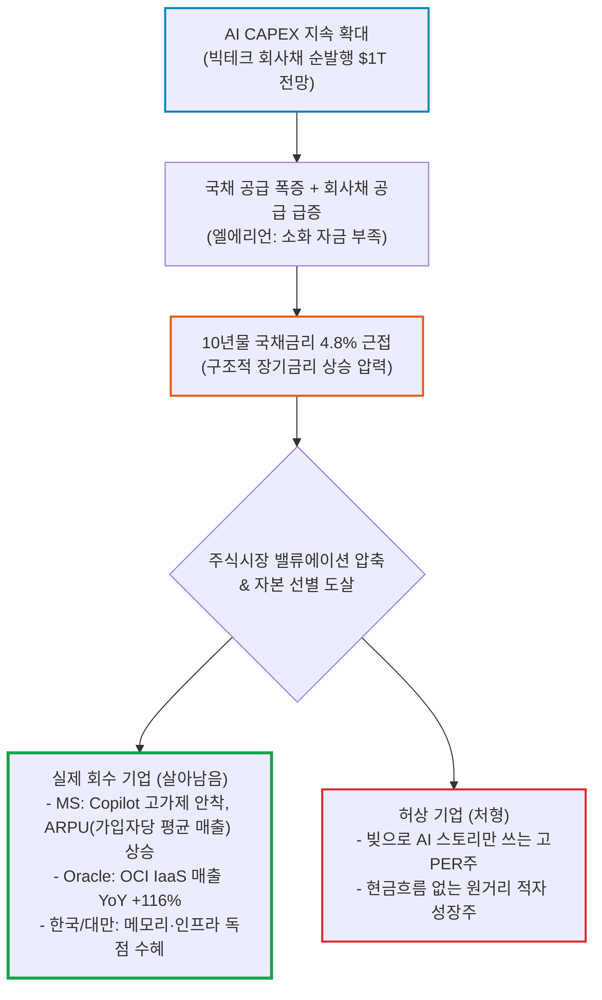

# 2026년 09월 08일(화) 하루치 뉴스정리

- **작성일**: 2026-09-08

지금 시장을 'AI 버블론'으로 보는 것은 한참 뒤처진 프레임이며, 빅테크의 회사채 증발과 장기금리 상승 압력 속에서 시장은 미국 국채를 버리고 미국 기업의 AI 이익 성장을 사며 실제 매출·현금흐름으로 회수하는 기업만 골라내는 선별 장세로 진입했다.

## 요약

| 구분 | 주요 내용 |
| :--- | :--- |
| **핵심 진단** | 시장은 "AI 버블이냐 아니냐"를 넘어 **"AI 투자 확대 ➔ 회사채 조달 급증 ➔ 장기금리 상승 ➔ 현금흐름 회수 기업 선별 압축"** 단계로 진입 |
| **매크로 & 채권 팩트** | 골드만 달러 투자등급 회사채 순발행 전망 **$850B ➔ $1T** 상향(AI 기업 비중 24%). 외국인은 美 국채 비중 축소(50%➔30%) 및 美 주식 1년간 **$6,000억 순유입** (Treasury Short / Corporate America Long) |
| **착시 교정** | "금리 오르니 AI 투자 중단"은 오판. 기업들은 빚을 내서라도 CAPEX를 확대 중이며, 이제 공식은 "CAPEX 증가 = 전 종목 상승"이 아니라 **"CAPEX 회수율과 ROIC"** |
| **돈길 확산 신호** | **MS Copilot** 주간 사용량 급증 및 E5·E7 고가 상품 이동(소프트웨어 수익화 진입), **Oracle OCI** IaaS 매출 YoY +116% 전망(부채 ➔ 성장률 재평가 시험대) |
| **가장 경계할 변수** | **미국 10년물 국채금리 4.8% ➔ 5.0% 돌파 여부**. 5% 상단 안착 시 고PER 성장주 밸류에이션 압축 시작 |
| **계좌 행동 지침** | AI 전량 매도 금지. **실제 매출·ARPU(가입자당 평균 매출) 증가 기업 우선 + AI 하드웨어/인프라 유지 + 빚으로 스토리만 쓰는 기업 퇴출 + 현금 버퍼 확보** |

---

## 결론부터 말한다: 시장 프레임의 대전환

지금 시장을 **“AI 버블이냐 아니냐”로 보는 건 한참 뒤처진 프레임**이다.

9월 7~8일 뉴스들을 하나로 연결하면 시장은 이미 다음 단계로 넘어갔다.

> **AI 투자 확대 → 자금조달 급증 → 장기금리 상승 압력 → 아무 AI주나 사는 장세 종료 → 실제 매출·현금흐름으로 투자비를 회수하는 기업만 살아남는 장세**

그런데 재미있는 건 **AI 투자 자체가 꺾인 흔적은 거의 없다는 것**이다. 오히려 반대다. 골드만은 AI 인프라 투자를 위한 빅테크 회사채 발행이 예상보다 빨라 미국 투자등급 회사채 순발행 전망을 **8,500억 달러 → 1조 달러**로 올렸다. 동시에 외국인은 미국 국채보다 미국 주식을 더 사고 있다. 즉 시장은 **“미국 정부 재정은 싫지만, 미국 기업의 AI 이익 성장은 사고 싶다”**고 말하고 있다.

---

## 1. 기사 속 팩트 폭행

현재 가장 중요한 뉴스들을 투자 중요도 순으로 다시 배열하면 이렇다.

| 중요도 | 진짜 의미 |
| :---: | :--- |
| **★★★★★** | AI CAPEX가 줄기는커녕 **회사채까지 찍어가며 확대되고 있음** |
| **★★★★★** | 국채 공급 + AI 회사채 공급이 동시에 늘어 **장기금리가 구조적으로 높아질 위험** |
| **★★★★★** | 외국인은 미국 국채보다 미국 주식을 선호. **미국 정부와 미국 기업을 분리해서 평가** |
| **★★★★☆** | MS Copilot 사용 증가 → AI가 단순 CAPEX에서 **실제 소프트웨어 수익화 단계**로 이동 |
| **★★★★☆** | Oracle은 막대한 AI 투자비가 매출로 전환되는지 확인하는 대표 시험대 |
| **★★★★☆** | 한국·대만 AI 하드웨어 실적 기대와 외국인 자금 유입은 여전히 강함 |
| **★★★☆☆** | Bitcoin ETF 자금 유입은 강하지만 아직 YTD 순유출 상태 |
| **★★★☆☆** | 국민연금 환헤지 중단은 달러/원 추가 하락을 막는 중요한 수급 변화 |
| **★★★☆☆** | 호르무즈·중동 리스크와 WTI 90달러대는 금리 인하 기대에 불편한 변수 |

특히 두 개를 같이 봐야 한다.

골드만은 2026년 미국 달러 투자등급 회사채 총발행 전망을 **2.1조 → 2.3조 달러**, 순발행을 **8,500억 → 1조 달러**로 상향했다. 8월까지 회사채 공급에서 **AI 관련 기업 비중이 24%**다.

그리고 엘에리언은 국채금리 상승의 원인이 단순한 인플레이션이나 Fed가 아니라 **국채 공급 + 회사채 공급 증가에 비해 이를 받아줄 돈이 부족하기 때문**이라고 지적했다.

이 둘을 합치면 답이 나온다.

**AI 붐이 금리를 끌어올리는 단계까지 왔다.**

예전에는 AI CAPEX가 주식시장만 움직였다.

지금은 AI CAPEX가
기업 재무제표 → 회사채 시장 → 장기금리 → 주식 밸류에이션까지 건드리고 있다.

이게 오늘 뉴스에서 제일 중요한 부분이다.

---

## 2. 대중이 착각하기 쉬운 것

### “금리가 오르니까 AI 투자가 곧 끝난다”

아니다.

현재 확인되는 뉴스는 정확히 반대다.

**기업들이 돈이 없어서 AI 투자를 줄이는 게 아니라, 빚까지 늘려가며 투자하고 있다.**

다만 여기서 착각하면 또 당한다.

> AI CAPEX 증가 = 모든 AI 주식 상승

이 공식은 이제 깨질 가능성이 높다.

앞으로 시장이 보는 건 **CAPEX 규모가 아니라 CAPEX 회수율**이다.

Oracle 뉴스가 그 대표적인 사례다.

시장은 이미 Oracle이 데이터센터 확장 때문에 돈을 너무 많이 쓴다는 걸 알고 있다. 그래서 주가도 크게 눌렸다.

그런데 BofA의 논리는 이것이다.

**데이터센터가 건설 단계에서 가동 단계로 넘어가면서 OCI 매출이 폭발하면 얘기가 달라진다.**

예상대로라면 IaaS 매출은 전년 대비 **116% 증가**할 수 있다.

그러면 시장은 갑자기 Oracle을

> “부채 많은 회사”

에서

> “부채를 이용해 AI 성장률을 확보한 회사”

로 재평가한다.

9월 10일 Oracle 실적이 꽤 중요해진 이유다.

---

## 3. 오히려 더 중요한 뉴스 — Microsoft Copilot

개인적으로 오늘 AI 뉴스 중에서는 이게 상당히 중요하다.

1년 전만 해도 AI에서 제일 큰 의문은 이것이었다.

**“그래서 기업들이 AI에 돈을 실제로 내기는 하냐?”**

그런데 스티펄 자료에서는 Copilot 주간 사용량이 Outlook·Teams에 비교될 정도로 증가했고, Microsoft 365 고객들이 E5·Copilot·E7 같은 고가 상품으로 이동하고 있다고 한다.

이게 사실이라면 의미가 크다.

AI 산업이

**GPU 판매 → 데이터센터 구축 → 소프트웨어 사용 → ARPU(가입자당 평균 매출) 상승**

으로 넘어가기 시작했다는 이야기다.

이건 NVIDIA 한 종목의 이야기가 아니다.

AI 투자 사이클의 질이 바뀌는 것이다.

---

## 4. 스마트머니가 실제로 하는 행동

여기서 기사들이 서로 모순돼 보인다.

도이체방크는

**외국인 → 미국 주식 사상 최대 수준 매수**

라고 한다.

반면 슈퍼리치 기사에서는

**주식 줄이고 현금·금·대체투자로 이동**

한다고 한다.

둘 다 동시에 가능하다.

자산가들은 주식을 전부 던지는 게 아니다.

**현금을 0%로 만들지 않으면서 좋은 주식은 계속 산다.**

더 중요한 것은 외국인 자금이다.

외국인의 미국 국채 보유 비중은 과거 50% 이상에서 약 **30%**까지 떨어진 반면, 미국 주식에는 1년간 약 **6,000억 달러 순유입**됐다는 분석이다.

이건 상당히 상징적이다.

시장 판단은 사실상 이거다.

> **미국 정부의 재정은 점점 못 믿겠다.
> 하지만 미국 기업의 AI·생산성·이익은 믿겠다.**

그러니까

**Treasury Short / Corporate America Long**

에 가까운 자금 흐름이 만들어지고 있다.

---

## 5. 한국 증시에는 꽤 좋은 뉴스다

골드만이 한국·대만에 비중 확대 의견을 유지하고 AI 하드웨어를 선호한다는 것은 그냥 “한국 좋아요” 수준의 이야기가 아니다.

현재 글로벌 자금 흐름 자체가

**AI 소프트웨어 → AI 컴퓨팅 → 네트워킹 → 메모리 → 전력**

쪽으로 확장되고 있다.

그리고 외국인이 전날 한국 주식을 **2.5조 원**, 코스닥·NXT까지 합치면 약 **3.2조 원** 매수했다는 것도 꽤 강하다.

그래서 현재 한국 증시 강세를 단순히 “많이 올랐으니 과열”로만 보면 안 된다.

**실적 개선 + AI 하드웨어 사이클 + 원화 강세 + 외국인 수급**이 동시에 붙어 있다.

다만 골드만의 **코스피 12,000** 같은 숫자는 그대로 믿을 영역은 아니다.

목표지수는 **팩트가 아니라 전망**이다.

상승 논리는 인정하되 숫자를 종교처럼 믿으면 안 된다.

---

## 6. 달러/원 — 이제 1,300원 초반까지 일직선으로 간다는 생각은 버려라

최근 원화 강세는 확실히 강했다.

미국 고용이 예상보다 훨씬 좋았는데도 달러/원이 제대로 반등하지 못했다.

이건 원화 수급이 얼마나 강했는지를 보여준다.

그런데 상황이 달라졌다.

국민연금이 전략적 환헤지를 중단했고, 낮아진 환율에서 다시 달러를 살 가능성이 제기됐다.

국민연금은 규모 자체가 다르다.

그래서 **1,340원 전후는 과거처럼 쉽게 깨지는 구간이 아닐 가능성이 높아졌다.**

그렇다고 달러/원이 다시 1,500원 간다는 이야기도 아니다.

현재는

**수출기업 네고 + 외국인 주식매수 + 엔화 강세**

vs.

**국민연금 달러매수 + 고유가 + 미국 금리**

싸움이다.

결론은 뉴스에 나온 것처럼 **1,340원대 박스권 가능성이 상당히 합리적**이다.

---

## 7. 비트코인 ETF 38억 달러 유입 — 호재 맞다. 그런데 흥분할 정도는 아니다

이 부분은 호재가 맞다.

3주간 **38억 달러**, ETF 전체 AUM **1,013억 달러**, 누적 순유입 **556억 달러**.

기관 자금이 다시 들어오고 있다는 건 부정할 이유가 없다.

하지만 한 줄을 빼먹으면 완전히 다른 기사 된다.

**YTD로는 아직 약 10억 달러 순유출이다.**

그러니까 지금 상황은

> “기관들이 미친 듯이 비트코인 사는 중”

보다는

> **“연초 대규모 이탈 이후 기관 자금이 다시 돌아오기 시작했다.”**

가 정확하다.

게다가 CLARITY Act도 단기간 통과가 불확실하다.

그래서 지금 비트코인은 **수급 개선은 명확하지만 규제 리레이팅까지 붙은 상태는 아니다.**

---

## 8. 블랙스완 펀드 대표의 “역대급 폭락” 발언

이런 제목이 클릭은 잘 나온다.

하지만 투자에는 거의 도움이 안 된다.

스피츠나겔이 실제로 한 말에서 중요한 부분은

**“지금 당장은 아니다.”**

오히려 먼저

**광적인 위험자산 랠리가 한 번 더 나올 수 있다**

고 말했다.

그러니까 저 기사를 보고 주식을 전부 파는 건 기사 자체도 제대로 안 읽은 행동이다.

그리고 그의 펀드는 구조적으로 **대폭락에 대비한 꼬리위험 헤지 전략**을 운용한다.

그 사람이 폭락 리스크를 이야기하는 것은 이상한 일이 아니다.

그가 맞을 수도 있다.

하지만

**“언젠가 큰 폭락이 온다”**

와

**“지금 주식을 팔아야 한다”**

는 완전히 다른 주장이다.

현재 자료만으로 후자는 입증되지 않는다.

---

## 9. 내가 지금 가장 경계하는 건 AI가 아니다

**채권시장이다.**

10년물 금리가 이미 **4.8% 근처**까지 올라왔다.

여기에

- 미국 재정적자 & 국채 발행
- AI 회사채 발행 급증
- 유가 상승 압력 (WTI 90달러대)
- 강한 고용 지표

이 한꺼번에 붙어 있다.

AI 기업 실적이 아무리 좋아도 **10년물이 5%를 확실히 넘어가고 계속 올라가면 주식시장 전체의 PER 압축이 시작된다.**

특히 피해가 큰 건

**현금흐름이 먼 미래에 있는 고PER 성장주**다.

반대로 실제 이익이 발생하는 AI 기업은 상대적으로 버틴다.

그래서 지금 시장에서 제일 중요한 숫자는 단순히 NVIDIA 매출이 아니라

> **미국 10년물 국채금리**

가 되어가고 있다.

---

## 10. 냉정한 행동 지침

나는 현재 이 뉴스 흐름에서 **AI 주식을 전량 매도할 이유는 없다고 본다.**

오히려 AI 투자 사이클은 생각보다 강하다.

다만 포트폴리오는 바꿔야 한다.

- **① 실제 매출이 붙는 AI를 우선한다**:
    - Microsoft처럼 AI 사용량과 ARPU(가입자당 평균 매출)가 증가하거나, 데이터센터 가동으로 매출 전환이 확인되는 기업이 유리하다.
- **② AI CAPEX 수혜주는 유지한다**:
    - 반도체·메모리·네트워킹·전력·데이터센터 인프라의 구조적 수요는 아직 꺾인 증거가 없다.
- **③ 빚으로 AI 스토리만 만드는 기업은 버린다**:
    - 앞으로 시장은 “얼마나 투자했냐”보다 **ROIC와 현금흐름**을 본다.
- **④ 현금을 0으로 만들지 않는다**:
    - 금리가 이 정도면 현금 자체가 옵션이다. 장기금리 쇼크가 오면 좋은 기업도 싸게 살 기회가 생긴다.
- **⑤ 10년물 5%를 경계선으로 본다**:
    - 그 위에서 안착하면 성장주 밸류에이션 문제를 다시 계산해야 한다.
- **⑥ 한국·대만 AI 하드웨어는 아직 추세를 함부로 역추세로 보지 않는다**:
    - 외국인 수급과 실적 추정치가 동시에 개선되고 있기 때문이다.

### 실전 포트폴리오 우선순위 및 행동 매트릭스

| 우선순위 | 자산 / 섹터군 | 대표 예시 및 특성 | 계좌 실행 방침 |
| :---: | :--- | :--- | :--- |
| **1순위** | **소프트웨어 실사용 전환 & ARPU(가입자당 평균 매출) 상승 기업** | Microsoft, Oracle(실적 확인) | AI 사용량 및 실제 매출 가시화 확인 시 비중 유지·확대 |
| **2순위** | **AI CAPEX 필수 병목 하드웨어** | 메모리(HBM), 패키징, 네트워킹, 전력 EPC | 공급 부족과 가격 결정력 보유. 조정 시 분할 매수 |
| **3순위** | **외국인 순유입 동조 아시아 하드웨어** | 한국·대만 반도체 밸류체인 | 실적 추정치 상향 + 수급 강도 유지. 추세 추종 |
| **보존** | **안전 현금 버퍼 (Cash Reserve)** | MMF, 초단기 국채 | **현금 0% 절대 금지**. 10년물 발작 시 염가 매수 탄약 |
| **퇴출** | **빚으로 스토리만 파는 적자 AI·고PER주** | FCF 마이너스, 먼 미래 수익 약속 기업 | 반등 시마다 가차 없이 청산 및 비중 축소 |

---

## 11. 최종 판정 및 핵심 실행 원칙

현재 뉴스만 보면 나는 시장을 **약세 전환으로 판정하지 않는다.**

오히려 이렇다.

> **AI 사이클은 여전히 강하다.
> 문제는 AI가 너무 커져서 이제 채권시장까지 흔들기 시작했다.**

그래서 다음 상승장은 예전처럼

**“AI 붙으면 다 오른다”**

가 아니다.

앞으로는

> **AI 투자비를 실제 매출과 현금흐름으로 회수하는 기업**

과

> **AI 인프라 병목을 해결하면서 가격 결정력을 갖는 기업**

으로 돈이 더 집중될 가능성이 높다.

그리고 현재 시장의 가장 위험한 착시는 **“고금리인데 주식이 왜 오르지? 곧 폭락하겠네”**다.

외국인 자금 흐름이 이미 답을 주고 있다.

==**국채는 싫어도 미국 기업은 산다.**==

다만 이 균형을 깨뜨릴 수 있는 건 하나다.

**AI가 아니라 장기금리다.**

이번 주부터는 S&P500보다 먼저 **미국 10년물 4.8% → 5.0% 돌파 여부**를 보는 게 맞다.

!!! tip "최종 핵심 제언 (Executive Takeaway)"
    **AI 버블 논쟁에 시간 낭비하지 마라. 채권금리와 현금흐름 회수율만 봐라.**
    기업들은 빚을 내서라도 AI를 깔고 있고, 외국인은 국채를 버리고 미국 주식을 쓸어 담고 있다. AI 사이클은 꺾이지 않았다. 다만 자본 조달 급증이 10년물 금리를 4.8%로 밀어 올리며 '아무 AI나 다 오르는 시대'를 끝장냈을 뿐이다. 지금부터는 **실제 ARPU(가입자당 평균 매출)가 찍히는 소프트웨어**와 **병목을 쥔 하드웨어**만 쥐고 가라. 10년물 5.0% 돌파에 대비해 현금 버퍼를 반드시 남겨두고, 부채로 스토리만 쓰는 껍데기 기업은 계좌에서 즉시 털어내라.
