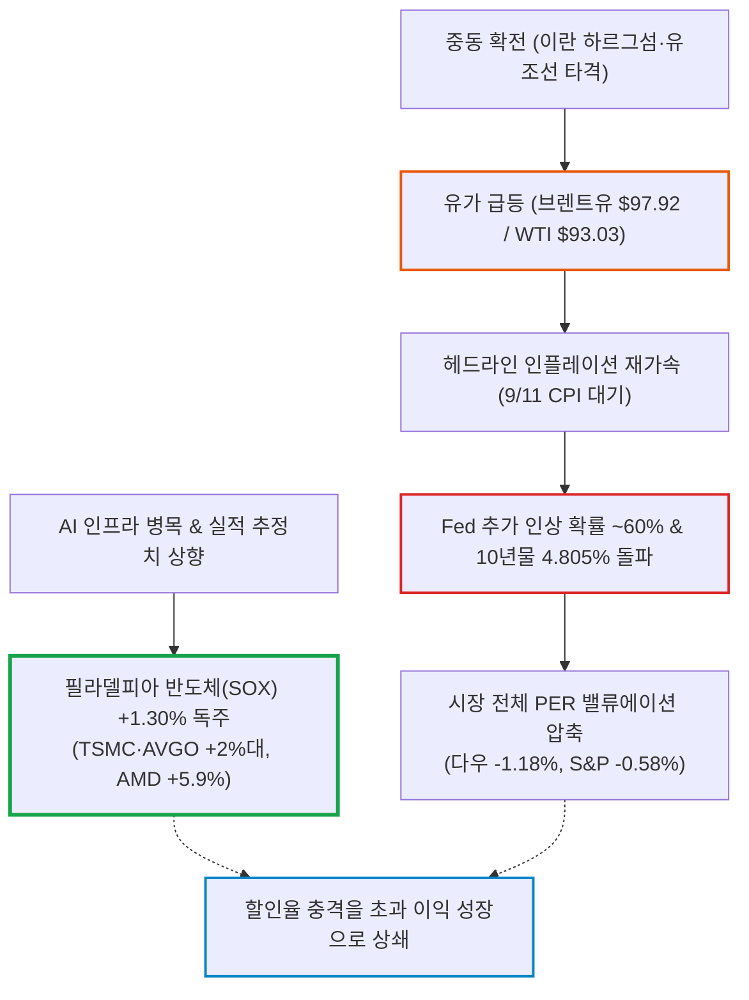
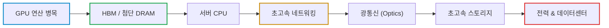

# 2026년 09월 09일(수) 하루치 뉴스정리

- **작성일**: 2026-09-09

유가 급등과 10년물 4.8% 돌파, Fed 금리 인상 공포가 시장 밸류에이션을 짓누르는 국면에서도 AI·반도체의 이익 추정치 상향 모멘텀이 금리 충격을 압도하고 있으며, 지금은 AI 투매가 아니라 병목을 장악한 진짜 실적주와 허상뿐인 테마주를 가르는 냉혹한 선별 장세다.

## 요약

| 구분 | 주요 내용 |
| :--- | :--- |
| **핵심 진단** | 중동 전쟁 자체가 아니라 **유가($97+) ➔ CPI ➔ Fed 추가 인상(확률 ~60%) ➔ 10년물 4.8%**의 할인율 충격을 반도체 이익 추정치가 이겨내는 장세 |
| **시장 팩트** | 다우 -1.18%, S&P -0.58% 급락 속 **필라델피아 반도체(SOX) +1.30%** 독주. TSMC·브로드컴·ASML +2%대, AMD +5.9%, 인텔 +9.05% 반등 |
| **착시 교정** | "전쟁이니 기술주 투매"는 오판. 퀄컴-AWS 600억 달러는 확정 매출 아닌 단계적 베스팅 조건부 계약. 인텔 High-NA 100만 장은 누적 처리량일 뿐 턴어라운드 확정 아님 |
| **돈길 확산 신호** | **메모리(DRAM 공급부족·재고 10일 미만)**의 강력한 영업이익 레버리지. 코닝-버라이즌 장기 광섬유 계약 등 AI 물리적 인프라 주변부 확산 |
| **가장 경계할 변수** | **9월 11일 CPI 발표** 및 **브렌트유 $100+ 안착 여부**, **미국 10년물 국채금리 4.9~5.0% 돌파 시** 전면적 밸류에이션 압축 |
| **계좌 행동 지침** | 신규 자금 몰빵 금지(분할: 30 ➔ CPI 확인 30 ➔ 조정 시 40). 실적 병목(AVGO, TSMC, ASML, 메모리) 유지, 투기성 양자·인텔 추격 금지 |

---

## 결론부터 말한다: 유가·금리 발작을 씹어삼킨 반도체의 이익 추정치

지금 시장을 “중동전쟁 때문에 증시가 무너지고 있다”고 보면 반만 본 거다.

진짜 그림은 이거다.

> **유가 급등 → 인플레이션 재가속 → Fed 추가 인상 위험이 시장 전체 밸류에이션을 짓누르고 있는데, 그 와중에도 AI·반도체의 이익 추정치 상향 힘이 금리 압력을 이기고 있다.**

9월 8일 다우 -1.18%, S&P500 -0.58%, 나스닥 -0.32%였는데 **필라델피아 반도체지수는 +1.30%**였다. WTI는 $93.03, 브렌트유는 $97.92까지 올라왔고 미국 10년물 국채금리는 4.805%다. Fed 금리 인상 확률도 대략 60%까지 치솟았다. 그런데 반도체가 안 무너졌다. 이게 오늘 뉴스 44개 가운데 가장 중요한 팩트다. ([AP News](https://apnews.com/article/d3d6157a534584985987f828a940cffa?utm_source=chatgpt.com))

따라서 지금은 AI를 버릴 때가 아니라, AI 안에서도 진짜 실적이 따라오는 놈과 스토리만 있는 놈을 냉혹하게 갈라야 할 때다.

---

## 1. 기사 속 팩트 폭행: 5대 핵심 이슈 해부

### ① 지금 가장 큰 위험은 전쟁 자체가 아니라 유가 → CPI → Fed다

미국-이란 충돌이 이란 원유 수출의 핵심인 하르그섬과 유조선으로 확산됐고, 후티-사우디 충돌까지 겹쳤다. 브렌트유가 $100 바로 아래까지 올라왔다. AP도 9월 8일 시장 하락의 핵심 원인을 유가와 그에 따른 인플레이션·금리 우려로 보고 있다. ([AP News](https://apnews.com/article/d3d6157a534584985987f828a940cffa?utm_source=chatgpt.com))

중요한 연결고리는 단순하다.

> **중동 확전 → 원유 $100+ → 헤드라인 물가 재상승 → Fed 인상 → 10년물 5% 접근 → PER 압축**

그래서 **9월 11일 CPI가 이번 주 최중요 이벤트**다. 전쟁 뉴스 하나하나에 일희일비하며 추적하는 것보다 브렌트유와 10년물 국채금리를 보는 게 주식 투자자에게 훨씬 중요하다.

---

### ② 그런데 AI 반도체는 이 악조건을 씹고 올라갔다

유가 상승, 10년물 4.8%, Fed 인상 가능성 상승이라는 성장주에 최악의 조합에서도 SOX는 +1.30%로 솟구쳤다.

TSMC·브로드컴·ASML은 2%대 상승, AMD +5.9%, 인텔 +9.05%였다. 반대로 다우는 -1.18%였다. 이건 꽤 강한 신호다. 시장이 지금 AI를 단순한 유동성 테마로 보지 않고 실제 이익 추정치가 올라가는 산업으로 취급하고 있다는 명백한 증거다.

GPT-6 Astra 출시 자체도 가짜 뉴스가 아니다. OpenAI가 공식적으로 공개했고 ARC-AGI-3 99.9%, FrontierMath Tier 4 98% 등을 제시했다. 업무 자동화·컴퓨터 사용 능력도 크게 확장됐다. ([OpenAI](https://openai.com/index/gpt-6-astra/?utm_source=chatgpt.com))

다만 여기서 바로 “GPU 전 종목 무조건 상승”으로 넘어가면 또 계좌가 터진다. 핵심은 GPU만이 아니다.

병목이 연산에서 네트워크, 광통신, 스토리지, 전력으로 넓어지고 있으며, 최근 뉴스가 정확히 그쪽으로 퍼지고 있다.

---

### ③ 퀄컴-아마존은 진짜 큰 뉴스다. 그런데 600억 달러 계약이라고 부르면 과장이다

이건 오늘 뉴스에서 가장 주의해서 읽어야 한다.

퀄컴과 Amazon AWS가 여러 세대에 걸친 AI 추론용 커스텀 실리콘과 광인터커넥트를 공동 개발하는 건 사실이다. 퀄컴이 모바일에서 데이터센터 AI로 진입하고 있다는 것도 사실이다. ([퀄컴](https://www.qualcomm.com/news/releases/2026/09/qualcomm-announces-multi-generational-product-collaboration-with?utm_source=chatgpt.com))

그런데 SEC 원문을 보면 아마존에 부여된 워런트는 최대 2,500만 주이고, 향후 실제 구매·발주가 누적 최대 600억 달러에 도달하는 과정에 따라 단계적으로 베스팅되는 구조다. 처음부터 600억 달러가 확정 매출로 계약된 게 아니다. 초기 구매약정과 연계돼 375만 주가 우선 베스팅됐다.

| 호들갑 뉴스 (과장) | 공시 팩트 (진실) |
| :--- | :--- |
| **"퀄컴, 아마존과 600억 달러 AI 계약 체결"** | **"아마존이 퀄컴 데이터센터 실리콘을 실제 구매하기 시작했고, 향후 성공 시 최대 600억 달러 규모까지 확대될 수 있는 조건부 워런트 구조"** |

그래도 의미는 크다. 메타에 이어 AWS가 붙었다면 퀄컴의 데이터센터 진입 가능성을 더 이상 장난으로 볼 단계는 아니다.

---

### ④ 메모리 공급부족은 이번 뉴스 묶음에서 가장 실적에 직접 연결되는 재료다

기사상 삼성전자·SK하이닉스 재고가 10일 미만이고, 하이퍼스케일러 DRAM 재고도 낮아지고 있다. GF Securities는 3분기 DRAM 가격이 전분기 대비 10% 후반, 4분기도 약 10% 상승할 것으로 예상했다.

TrendForce에서도 현재 DRAM 가격 강세 자체는 확인된다. ([TrendForce](https://www.trendforce.com/price/dram/dram_spot?utm_source=chatgpt.com))

여기서 중요한 건 HBM만이 아니다. HBM4가 DRAM 웨이퍼를 더 많이 잡아먹으면 일반 DRAM 공급까지 빡빡해진다. 그러면 AI 투자의 과실이 GPU 회사 하나에서 끝나는 게 아니라 메모리 공급자에게까지 번진다.

현재 뉴스만 놓고 보면 AI 공급망에서 가장 깨끗하고 강력한 이익 레버리지 중 하나가 메모리 가격이다.

---

### ⑤ 인텔 뉴스는 좋다. 하지만 “인텔 부활 완료”는 헛소리다

High-NA EUV 100만 웨이퍼 처리 자체는 실제다. Intel과 ASML 공식 발표로 확인된다. Intel 18A 일부 레이어와 Core Ultra Series 3 일부 생산에 High-NA가 활용되고 있고 성능도 기존 NXE 방식과 동등하거나 그 이상이라고 밝혔다. ([인텔](https://www.intel.com/content/www/us/en/newsroom/news/intel-foundry/intel-foundry-asml-accelerate-industry-readiness-for-high-na-euv.html?utm_source=chatgpt.com))

다만 100만 장 전부가 상업용 Intel 18A 제품 웨이퍼라는 뜻은 아니다. Intel 공식 표현은 인증·테스트·R&D·양산을 모두 포함한 누적 처리량이다. ([인텔](https://www.intel.com/content/www/us/en/newsroom/news/intel-foundry/intel-foundry-asml-accelerate-industry-readiness-for-high-na-euv.html?utm_source=chatgpt.com))

그래서 +9% 오른 인텔을 보고 “TSMC 따라잡았다”라고 결론 내리면 너무 빠르다. 아직 확인해야 하는 건 외부 파운드리 고객, 수율, 원가, 가동률, 마진이다. 기술 진전은 인정하되 턴어라운드 확정은 아니다.

---

## 2. 대중의 눈먼 착시: 5대 가짜 프레임 격파

| 대중의 착시 (선동) | 데이터가 말하는 냉혹한 팩트 |
| :--- | :--- |
| **착시 1. 중동 확전이면 기술주부터 팔아야 한다** | 전쟁 악재보다 AI 실적 상향 힘이 더 큼. 유가 폭등 속에서도 반도체(SOX)는 +1.30% 상승 |
| **착시 2. GPT-6 Astra 나왔으니 AI주 아무거나 사면 된다** | 모델 성능과 개별 기업 수익성은 별개. 연산·HBM·패키징·네트워크·광통신 '병목' 기업만 돈을 벎 |
| **착시 3. 미 정부가 지분 샀으니 양자컴퓨터 검증 끝났다** | 정책 지원 확정일 뿐 상업적 성공 미확정. D-Wave 등 마일스톤 방식 지급이며 실적·FCF 부재 |
| **착시 4. 전쟁 나면 금은 무조건 오른다** | 전쟁 ➔ 유가 상승 ➔ 인플레 ➔ 금리 인상 조합에서는 무이자 자산인 금에 치명적 부담 작용 |
| **착시 5. 캐나다 무역전쟁이 시장 중심 악재다** | 소비재·농업 등 국지적 영향일 뿐, 증시를 흔드는 절대 변수는 중동 ➔ 유가 ➔ CPI ➔ Fed 할인율 |

- **착시 1. “중동 확전이면 기술주부터 팔아야 한다”**:
    - 현재까지는 틀렸다. 전쟁으로 시장 전체는 하락했지만 반도체는 오히려 올랐다.
    - 시장이 지금까지 말하는 건 `전쟁 악재 < AI 실적 상향`이라는 것이다. 물론 브렌트유가 $110, 10년물이 5.2%가 되면 이야기는 달라진다. 하지만 현재는 아니다.
- **착시 2. “GPT-6 Astra가 나왔으니 AI주 아무거나 사면 된다”**:
    - 이건 더 위험하다. Astra 성능 향상이 의미 있는 것은 맞지만 모든 AI 관련 기업이 동일하게 돈을 버는 게 아니다.
    - 병목을 소유한 기업만 돈을 번다. 지금 병목은 `연산 ➔ HBM ➔ 첨단공정 ➔ 네트워킹/광통신 ➔ 전력` 순으로 잡히고 있다. 브로드컴·TSMC·ASML과 적자 AI 소프트웨어를 똑같이 보면 안 된다.
- **착시 3. “미국 정부가 양자회사 지분 샀으니 양자컴퓨터는 이제 검증 끝났다”**:
    - 이것도 아니다. 미 상무부가 D-Wave, Rigetti, Quantinuum에 각각 1억 달러씩 지원하고 소수지분을 받는 건 사실이다. ([WSJ](https://www.wsj.com/tech/u-s-gets-minority-stakes-in-d-wave-rigetti-quantinuum-in-300-million-chips-act-funding-deal-a7bad600?utm_source=chatgpt.com))
    - 하지만 이건 기술 상용성 인증서가 아니다. D-Wave의 경우 실제 지급도 마일스톤 방식이다. ([SEC](https://www.sec.gov/Archives/edgar/data/1907982/000190798226000141/qbts-20260904.htm?utm_source=chatgpt.com)) 정부가 돈을 넣었다고 매출·이익·FCF가 자동으로 생기지 않는다. 정책 지원은 확정, 상업적 성공은 미확정이다.
- **착시 4. “금은 전쟁 나면 무조건 오른다”**:
    - 9월 8일 금은 오히려 약했다. 이유는 간단하다. `전쟁 → 유가↑ → 인플레↑ → 금리↑`이면 무이자 자산인 금에는 오히려 부담이 될 수 있다. "전쟁 = 금 상승"이라는 초등학교식 공식은 시장에서 자주 깨진다.
- **착시 5. “캐나다 무역전쟁이 지금 시장의 중심 악재다”**:
    - 미국의 캐나다산 유제품·주류·오토바이 수입 금지 조치는 실제다. ([AP News](https://apnews.com/article/a5fbb50d1c30327ae813482556a37ac3?utm_source=chatgpt.com))
    - 하지만 현재 S&P500을 설명하는 핵심 변수는 아니다. 이란·사우디 → 유가 → CPI → Fed가 훨씬 크다. 캐나다 이슈는 일부 업종에 국한되며, 글로벌 증시 1순위 변수처럼 과장해 받아들이면 안 된다.

---

## 3. 고수들의 진짜 돈길: 스마트머니가 선호하는 4대 우선순위

기사 몇 줄 가지고 “기관이 몰래 매집 중”이라고 단정할 근거는 없다. 그건 억지다. 대신 가격 움직임과 실적 방향을 보면 돈이 어디를 선호하는지는 명확히 추론할 수 있다.

| 우선순위 | 영역 | 대표 종목 및 핵심 동력 | 실적 연결 고리 |
| :---: | :--- | :--- | :--- |
| **1순위** | **AI 인프라 실적형 병목** | 브로드컴, TSMC, ASML, 광통신·네트워크 | 커스텀 ASIC 확대, High-NA 투자, 데이터센터 초고속 연결 수요 폭증 |
| **2순위** | **메모리 반도체** | 삼성전자, SK하이닉스, 마이크론 | 재고 10일 미만 + HBM4 웨이퍼 잠식 ➔ DRAM 가격 분기별 두 자릿수 상승 |
| **3순위** | **실체 있는 AI 주변부** | 코닝 (Corning), 퀄컴 (AWS 협력 추적) | 버라이즌 2027~2032년 광섬유 장기 계약처럼 실제 납품 물량이 찍히는 기업 |
| **4순위** | **방산 (지정학 수혜)** | 록히드마틴 (LMT) | 미사일 생산능력 확대, F-35 MRO, Trident 등 2028년 실적 상향 가능성 |

- **1순위: AI 인프라의 실적형 병목**:
    - 현재 가장 강력한 돈길이다. 브로드컴, TSMC, ASML, 메모리, 광통신·네트워크.
    - 이쪽은 "AI가 좋다"는 막연한 기대가 아니라, 커스텀 ASIC 확대, HBM/DRAM 가격 상승, 첨단공정 수요, High-NA 투자, 데이터센터 네트워크 확대, 초고속 광 연결로 매출 구조가 가파르게 움직이고 있다.
    - 특히 유가와 10년물이 치솟는 날에도 AVGO·TSMC·ASML이 오른 것은 단순한 하루 반등 이상의 무거운 의미를 지닌다.
- **2순위: 메모리 반도체**:
    - 이번 뉴스 묶음 중 향후 EPS 상향으로 가장 깔끔하게 직결되는 것은 DRAM 가격이다.
    - 가격 +10%는 소프트웨어 사용자 +10%보다 훨씬 강력하다. 고정비가 큰 메모리 산업에서는 ASP(평균판매단가) 상승이 영업이익 폭증으로 직결된다.
    - 핵심은 `DRAM 계약가격 ➔ HBM4 가격 ➔ 삼성/SK하이닉스/Micron 이익 추정치`다.
- **3순위: 실체 있는 AI 주변부**:
    - 코닝-버라이즌의 2027~2032년 광섬유 계약처럼 실제 장기 물량이 찍히는 종목이 AI 테마만 달고 뛰는 잡주보다 질이 훨씬 좋다.
    - 퀄컴 역시 이제 관심군에 넣어야 한다. 다만 하루 급등 헤드라인에 취하지 말고 AWS 실제 구매량이 얼마나 늘어나는지 공시로 확인한 뒤 냉정하게 평가해야 한다.
- **4순위: 방산**:
    - 록히드마틴은 단순 지정학 테마 때문만이 아니라 미사일 생산능력 확대와 F-35 유지보수, CH-53K, Trident 등에서 2028년 실적 상향 가능성이 제기되고 있다.
    - 중동 불안이 장기화되면 구조적으로 유리하다. 단, 전쟁 뉴스 뜬 날 뇌동매매로 추격하지 말고 생산량과 마진이 실제 올라오는지를 확인해야 한다.

---

## 4. 반대로 지금 손대기 싫은 곳: 4대 함정

1. **양자컴퓨팅 추격매수는 절대 사절이다**:
    - 정부의 정책 지원은 강하지만, 실적과 현금흐름보다 밸류에이션이 한참 먼저 폭주하고 있다.
2. **인텔 +9% 추격도 사절이다**:
    - 기술 진전 뉴스는 긍정적이나 아직 외부 파운드리 턴어라운드를 숫자로 입증한 단계가 아니다.
3. **중동 이슈 때문에 에너지주를 한꺼번에 추격하는 것도 사절이다**:
    - 에너지는 포트폴리오의 좋은 헤지 수단일 뿐이지, 전쟁이 영원할 것이라 베팅하는 장기 복리 성장주가 아니다.
4. **실적 없는 장기 성장주·적자 소프트웨어는 사형 선고 구간이다**:
    - 미국 10년물 국채금리가 4.8%를 뚫고 5.0%를 위협하는 국면에서, 먼 미래의 꿈만 파는 적자 기업은 할인율 폭탄에 가장 먼저 도살당한다.

---

## 5. 지금 당장 계좌에서 할 행동: 새 자금 100 운용 로드맵

내가 지금 새로운 투자 자금 100을 운용한다면 한 방에 집어넣지 않는다.

### 실전 자금 분할 집행 매트릭스

| 집행 단계 | 배정 비중 | 집행 조건 및 시점 | 실행 방침 |
| :---: | :---: | :--- | :--- |
| **1단계 (선발대)** | **30%** | 현재 국면 분할 진입 | AI 실적 병목 우량주 (AVGO, TSMC, ASML, 메모리) 선별 진입 |
| **2단계 (확인 매수)** | **30%** | 9월 11일 CPI 발표 확인 후 | 인플레이션 서프라이즈 여부 및 10년물 4.8% 안착 확인 후 진입 |
| **3단계 (기회 포착)** | **40%** | 의미 있는 조정 및 지지선 확인 시 | 매크로 할인율 발작으로 우량주가 급락할 때 저격 매수용 예비 탄약 |

- **첫째, CPI 전까지 베타를 크게 늘리지 마라**:
    - 9월 11일 CPI가 이번 단기 방향을 바꿀 수 있다. Fed 금리 인상 확률이 이미 약 60% 수준까지 올라왔기 때문이다. ([AP News](https://apnews.com/article/d3d6157a534584985987f828a940cffa?utm_source=chatgpt.com))
- **둘째, AI 반도체는 매도 대상이 아니라 조정 시 매수 후보다**:
    - 단, 아무 AI나 사지 말고 AVGO·TSMC·ASML·메모리처럼 실제 CAPEX와 수요가 직결된 쪽을 우선하라.
- **셋째, 한 번에 몰빵하지 마라**:
    - 추가 투자자금 기준으로 `30 ➔ CPI 확인 후 30 ➔ 의미 있는 조정 시 40` 정도로 나누는 게 지금 환경에서 계좌를 지키는 유일한 방법이다.
- **넷째, 양자·인텔 같은 급등주는 쫓아가지 마라**:
    - 실적과 수율에 대한 명확한 숫자가 더 필요하다.
- **다섯째, 에너지 노출은 보험(헤지) 정도로만 유지하라**:
    - 유가 $100 돌파 자체보다 $100 위에서 며칠이나 버티는지를 봐라.
- **여섯째, 환율도 일방적 베팅을 멈춰라**:
    - 달러-원이 1,340원 부근이고 엔화 강세·수출기업 네고가 원화 강세를 밀고 있는 반면, 중동과 고유가가 반대 방향으로 당기고 있다. 지금 달러를 한 번에 바꿀 이유도 없다.

---

## 6. 앞으로 딱 4개만 보면 된다: 핵심 지표 모니터링 매트릭스

잡다한 뉴스에 휘둘리지 말고 오직 아래 4개 지표의 임계값만 감시하라.

| 변수 | 정상 범위 | 위험 신호 | 시장 관점의 진짜 의미 |
| :--- | :---: | :---: | :--- |
| **브렌트유** | `< $100` | **$100 ~ $105 이상 지속** | 헤드라인 물가 재상승 및 원가 압박 |
| **미 10년물 국채금리** | `4.7 ~ 4.8%대` | **4.9 ~ 5.0% 돌파** | 고PER 성장주 전면적 밸류에이션 압축 |
| **9/11 CPI** | 예상치 부근 / 하회 | **상방 서프라이즈** | 9월 Fed 기준금리 추가 인상 가능성 급증 |
| **SOX / S&P 상대강도** | **SOX 우위 지속** | **반도체까지 급락 전환** | AI 최종 방어선 붕괴 및 전면 리스크오프 |

특히 마지막 **SOX / S&P 상대강도**가 제일 중요하다.

> **유가가 $100인데도 반도체가 버틴다? ➔ AI 강세장은 여전히 살아 있다.**
> **유가↑ + 10년물 5%↑ + SOX까지 시장보다 더 빠진다? ➔ 그때는 변명하지 말고 즉시 위험자산을 줄여라.**

---

## 7. 종합 결론 및 핵심 실행 원칙

이번 뉴스 묶음을 한 문장으로 압축하면 이렇다.

> **“중동발 인플레이션 쇼크가 시장 전체를 누르고 있지만, AI 인프라의 실적 모멘텀은 아직 그 충격보다 강하다.”**

그래서 나는 지금 AI 반도체 강세론을 철회하지 않는다. 오히려 더 선별적으로 강해진다.

다만 브렌트유 $100+, 10년물 5%, 뜨거운 CPI가 동시에 터져 나오면 판은 완전히 달라진다. 그때는 좋은 기업이고 뭐고 밸류에이션부터 두들겨 맞는다.

현재 기준으로는 **전면 매도보다 AI 인프라 보유/조정 시 분할 매수 + 투기성 AI·양자 추격 금지 + 에너지 일부 헤지 + CPI 전 현금 확보**가 가장 합리적인 포지션이다.

오늘 뉴스에서 의외로 가장 중요한 종목을 꼽으라면 퀄컴보다도 **브로드컴·TSMC·ASML 쪽의 상대강도**, 산업 하나를 꼽으라면 **메모리(DRAM)**다. 시장이 지금 어디에 진짜 돈을 붙이고 있는지 그쪽에서 가장 명확하게 드러나고 있다.

!!! tip "최종 핵심 제언 (Executive Takeaway)"
    **공포에 질려 AI 핵심을 내던지지 마라. 채권금리와 메모리·ASIC 병목만 봐라.**
    전쟁과 유가 폭등으로 다우가 1% 넘게 빠지는 날에도 반도체지수가 +1.30% 올랐다는 것은, 시장이 AI를 단순 테마가 아닌 실질적 이익 성장 산업으로 평가하고 있다는 명백한 증거다.
    다만 10년물 금리가 4.8%를 위협하는 환경에서는 껍데기뿐인 적자 소프트웨어와 테마주는 처형당한다. 현금 40% 버퍼를 유지한 채, 9월 11일 CPI 전까지 무리한 추격매수를 멈추고 **브로드컴, TSMC, ASML, 메모리**의 눌림목만 노려라. 브렌트유 $100과 10년물 5.0%가 동시에 깨지지 않는 한, AI 인프라의 상승 추세선은 여전히 살아 있다.
