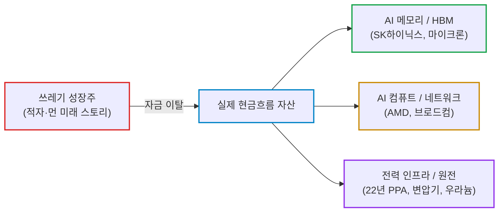
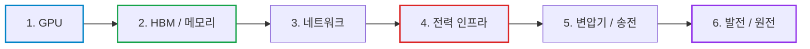

# 2026년 09월 10일(목) 하루치 뉴스정리

- **작성일**: 2026-09-10

유가 100달러 돌파와 미국 10년물 국채금리 4.8% 돌파로 시장 전반이 흔들리고 있지만, 돈은 주식시장을 떠나는 것이 아니라 쓰레기 성장주를 버리고 AI 인프라·메모리·전력 등 실제 현금흐름과 실적이 찍히는 병목 자산으로 좁아지고 있다.

## 요약

| 구분 | 주요 내용 |
| :--- | :--- |
| **핵심 진단** | 증시 전체의 붕괴가 아니라 **"금리와 유가를 버틸 수 있는 실적 성장주만 살아남는 냉혹한 계급 분리"** 장세 |
| **시장 팩트** | 유가(브렌트유 $101.21, WTI $96.05) 급등 및 10년물 4.835% 돌파. 3대 지수 3일 연속 하락 속 **필라델피아 반도체지수 +0.37%(5일 연속 상승)** 독주 |
| **착시 교정** | "금리 오르면 기술주 끝"은 대중의 착시. 메모리 공급 부족(UBS 2027년까지 전망)과 실제 ASP 상승으로 SK하이닉스(+7.05%), 마이크론(+3%) 등 강세 |
| **돈길 확산 신호** | AI 병목이 GPU에서 **전력·발전소·변압기·송전 인프라**로 이동. 알파벳 22년 PPA, 브로드컴 인프라 경고, 원전·우라늄 수혜 가속 |
| **가장 경계할 변수** | 에너지발 인플레이션의 서비스 물가 전염 여부(Fed 9월 25bp 인상 확률 60.2%), 10년물 국채 입찰 및 실질금리 향방 |
| **계좌 행동 지침** | 고PER·적자 성장주 축소, AI 내부 갈아타기(메모리 ➔ 컴퓨트 ➔ 네트워크 ➔ 전력), 하루 급등주 추격 금지, 현금·단기채 버퍼 유지 |

---

## 결론부터: 금리와 유가를 버틸 수 있는 성장주만 살아남는 장

지금 시장은 **“증시 전체가 무너지는 장”이 아니라 “금리와 유가를 버틸 수 있는 성장주만 살아남는 장”**이다.

브렌트유는 101.21달러, WTI는 96.05달러까지 뛰었고, 미국 10년물은 4.835%, 30년물은 5.285%까지 올라왔다. 재무부가 장기채 바이백 한도를 20억달러에서 60억달러로 세 배 늘렸는데도 시장이 기대했던 100억달러에는 못 미치자 채권과 주식이 동시에 얻어맞았다. S&P500 -0.48%, 나스닥 -0.64%, 다우 -0.77%로 3일 연속 하락했다.

그런데 그 와중에 필라델피아 반도체지수는 **+0.37%로 5일 연속 상승**, 마이크론과 AMD는 약 3%, SK하이닉스 ADR은 7% 이상, 메타는 6.55% 뛰었다. 이게 오늘 시장의 진짜 메시지다.

**돈이 위험자산에서 빠지는 게 아니다. 돈이 쓰레기 성장주에서 빠져 AI 인프라·메모리·전력·실제 현금흐름이 보이는 곳으로 좁아지고 있다.**

---

## 1. 기사 속 팩트 폭행: 유가 100달러가 지금 가장 큰 적이다

미국-이란 충돌에 사우디-후티 충돌까지 겹쳤고 파키스탄 개입 가능성도 거론되고 있다. 브렌트유는 3.36% 올라 101.21달러, WTI는 3.25% 오른 96.05달러다. WTI는 **7거래일 연속 상승**이다. EIA조차 올해 브렌트 전망을 87달러에서 91달러로, WTI를 81달러에서 85달러로 올렸다.

문제는 단순히 기름값이 아니다.

> **유가 상승 → 인플레이션 기대 상승 → 연준 금리인하 기대 후퇴 혹은 추가 인상 위험 → 장기금리 상승 → 고밸류 성장주 할인율 상승.**

시장은 이미 9월 연준의 **25bp 인상 확률을 60.2%**까지 가격에 넣고 있다.

반대로 판테온은 8월 근원 CPI가 전월 대비 0.17%에 그쳐 연준이 동결할 것으로 보고 있다. 다만 헤드라인 CPI는 고유가 때문에 +0.3%가 가능하다고 본다.

즉 시장의 다음 방향은 간단하다.

**서비스 물가가 죽느냐, 에너지발 인플레이션이 다시 전체 물가로 전염되느냐.**

여기가 지금 진짜 전쟁터다.

| 지표 | 현재 수치 | 변동 / 추이 | 시장 영향 및 시사점 |
| :--- | :---: | :---: | :--- |
| **브렌트유** | **$101.21** | +3.36% | $100 돌파, 인플레이션 기대 심리 자극 |
| **WTI** | **$96.05** | +3.25% | **7거래일 연속 상승**, EIA 전망치 상향($85) |
| **미 10년물 국채금리** | **4.835%** | 장중 4.856% | 고밸류에이션 성장주 할인율 직격탄 |
| **미 30년물 국채금리** | **5.285%** | 장중 5.300% 돌파 | 장기 국채 공급 부담 및 채권 시장 경계 |
| **Fed 9월 25bp 인상 확률** | **60.2%** | 시장 선반영 심화 | 긴축 장기화 및 금리 인하 기대 완전 후퇴 |

---

## 2. 베선트 바이백: 시장이 기대했던 구원자는 없었다

재무부 바이백 60억달러 자체는 작지 않다. 기존 20억달러의 세 배다.

그런데 시장은 이미 80억~100억달러를 상상하고 있었다. 그러니 60억달러가 나오는 순간 호재가 아니라 실망으로 변했다. 10년물은 장중 4.856%, 30년물은 5.3%를 돌파했다.

여기서 중요한 건 바이백 숫자가 아니다.

**재무부가 국채 수급의 근본 문제를 해결해줄 거라는 기대 자체가 과했다.**

유가가 100달러고, 회사채 발행이 쏟아지고 있고, 장기 국채 공급 부담이 존재하는데 재무부가 몇십억달러 더 사준다고 장기금리가 영구적으로 내려갈 리 없다.

더 흥미로운 건 그 뒤다.

390억달러 규모 10년물 입찰에서 응찰률은 **2.71배로 2016년 이후 최고**, 발행금리는 WI보다 0.5bp 낮게 결정됐다.

이 말은 뭔가.

**4.8%대에서는 진짜 돈이 국채를 사기 시작한다.**

장기금리가 무한정 폭주하는 것도 아니라는 얘기다.

---

## 3. 대중의 가장 큰 착시: “금리가 오르니 기술주가 끝났다”

틀렸다.

**기술주 내부에서 계급 분리가 진행되고 있다.**

SK하이닉스 ADR은 하루 7.05% 뛰어 198.63달러로 상장 이후 최고가를 찍었다. UBS는 D램과 낸드 모두 **2027년까지 공급 부족**, 3분기 메모리 ASP가 전분기 대비 **20% 이상 상승**할 가능성을 제시했다.

이건 AI 스토리텔링이 아니다.

메모리 가격이 실제로 오르고 있고 공급 부족이 실제 실적으로 찍히고 있다.

그래서 지금 같은 금리 환경에서도 메모리가 버틴다.

반대로 미래 꿈만 팔고 현재 현금흐름이 없는 성장주는 10년물 4.8%가 되면 밸류에이션이 찢어진다.

| 구분 | 진짜 실적주 (계급 상위) | 스토리 성장주 (계급 하위) |
| :--- | :--- | :--- |
| **대표 섹터** | HBM·DRAM 메모리, AI 인프라 수혜주 | 현금흐름 적자 기업, 원거리 미래 TAM 의존주 |
| **현실 데이터** | ASP 전분기 대비 20%+ 상승, 2027년까지 공급 부족 | 실적 가시성 부재, 단순 컨셉 및 마케팅 |
| **10년물 4.8% 내성** | 초과 이익 성장으로 할인율 압도 및 주가 신고가 경신 | 할인율 폭탄에 밸류에이션 급격한 압축 및 주가 급락 |

---

## 4. AI의 진짜 병목은 GPU가 아니라 전력으로 이동 중

브로드컴 혹 탄 CEO의 발언이 이번 뉴스 묶음에서 가장 중요하다.

브로드컴은 웨이퍼, 메모리, 기판 확보에는 자신이 있지만 정작 데이터센터를 설치할 **전력·발전소·변압기·송전 인프라가 부족하다**고 했다. 고객들은 2028년 데이터센터 계획보다 먼저 전력 공급을 확보해야 한다고 지적했다.

알파벳이 핀란드 AI 인프라에 130억유로 이상을 투입하고 Fortum과 **22년짜리 PPA**를 체결한 것도 같은 얘기다.

시장은 아직도 “다음 엔비디아가 누구냐”만 쳐다본다.

정작 하이퍼스케일러들은 지금 **전기를 선점하고 있다.**

AI 투자 사이클의 돈길은 이미 아래 순서로 확장되고 있다.

> **GPU → HBM/메모리 → 네트워크 → 전력 → 변압기/송전 → 발전**

여기서 돈 냄새가 난다.

---

## 5. 퀄컴-아마존: 헤드라인만 보고 추격하면 당한다

표면적으로는 엄청난 거래다.

아마존이 워런트를 확정하려면 반도체 구매 등을 포함해 최대 600억달러를 지출하게 되고, RBC는 향후 10년 동안 연간 약 60억달러의 매출 기회를 추정했다.

그런데 바로 다음 문장을 봐야 한다.

퀄컴 경영진은 전망을 올리지 않았다. RBC는 FY27 데이터센터 매출 목표 약 50억달러에 **아마존 거래가 이미 반영됐을 가능성**을 지적했다.

바클레이즈는 더 노골적이다.

이번 아마존 협력은 성장 전망을 바꾸는 새로운 이벤트가 아니며 기존 투자자 설명회에서 제시했던 성장 계획에 이미 포함됐다고 봤다. 투자의견도 비중축소다.

따라서 QCOM은 **사업적으로는 좋은 뉴스, 주가에는 상당 부분 선반영된 뉴스**다.

둘을 헷갈리면 비싸게 산다.

---

## 6. AMD: 펀더멘털은 강하다. 숫자에 취하면 안 된다

CLSA는 MI455X 랙의 ASP를 약 500만달러, 총마진을 40% 후반~50% 초반으로 보고 AMD의 2027년 EPS를 25%, 2028년을 29% 상향했다. 목표주가는 575달러에서 710달러로 올렸다.

AMD CFO는 한술 더 떠 2030년 TAM을 **2조~3조달러**까지 언급했다.

여기서 구분해야 한다.

MI455X 주문과 마진은 실적 분석이다.

**3조달러 TAM은 마케팅에 가깝다.**

TAM은 회사가 벌 돈이 아니다. 경쟁사 몫까지 전부 더한 시장 규모다.

AMD 강세 논리는 충분히 살아 있지만, “3조달러 시장”이라는 숫자만 보고 밸류에이션을 무시하기 시작하면 그 순간부터 투자자가 아니라 홍보자료 독자가 된다.

---

## 7. 메타: 이번엔 AI가 비용이 아니라 매출로 연결될 가능성을 보여줬다

메타의 Muse는 다른 AI 발표보다 중요하다.

메타는 이미 사용자 데이터, 광고주, 페이스북·인스타그램·WhatsApp이라는 유통망을 갖고 있다. 월가가 주목하는 것도 Muse 자체의 기술력이 아니라 **기존 데이터와 광고 시스템에 붙여 돈을 벌 수 있느냐**다.

그래서 시장 전체가 하락한 날 META가 6.55% 오른 것이다.

AI 투자액 때문에 FCF가 훼손된다는 기존 약점을

**AI 자체의 수익화로 뒤집을 수 있다는 가능성**이 생겼다.

이게 엔터프라이즈 AI 시장에서 결국 중요하다.

“모델이 얼마나 똑똑한가”보다

**누가 고객과 결제 수단과 데이터와 유통망을 이미 갖고 있느냐.**

---

## 8. 애플: 폴더블이라는 단어만 보고 흥분할 이유 없다

폴더블 iPhone Duo 예상 가격은 약 2,000달러다.

하지만 모펫내던슨이 제대로 짚었다.

애플의 문제는 제품을 만들 수 있느냐가 아니다.

**폴더블이 진짜 신규 수요를 만들 것인가, 아니면 기존 고가 아이폰을 자기 손으로 잠식할 것인가**다. 투자의견도 중립이고, 높은 밸류에이션 부담을 지적했다.

거기에 메모리 가격 상승 때문에 아이폰 자체 가격 인상 가능성까지 존재한다.

하드웨어 이벤트는 박수받기 쉽다.

**EPS를 얼마나 올리는지가 진짜 문제다.**

---

## 9. 테슬라 로보택시: 스토리와 현실 사이 숫자를 봐라

골드만삭스 자료 기준으로 웨이모는 14개 도시에서 4,000대 이상을 운행한다.

테슬라는 420대.

그중 Cybercab은 **45대**다.

| 기업 / 서비스 | 상용 서비스 도시 | 운행 차량 대수 | Cybercab 비중 | 현실 평가 |
| :--- | :---: | :---: | :---: | :--- |
| **웨이모 (Waymo)** | 14개 도시 | **4,000대 이상** | 해당 없음 | 실제 상용 유료 서비스 선점 |
| **테슬라 (Tesla)** | 제한적 테스트 | 420대 | **45대** | 파일럿 단계, 규모 차이 압도적 |

테슬라가 Cybercab 생산단가를 2만~3만달러까지 떨어뜨린다면 경제성은 매우 강해질 수 있다.

그런데 현재 시장 지배력을 논할 단계는 아니다.

**45대를 4만5천대처럼 가격에 넣기 시작하면 위험해진다.**

테슬라 투자 논리에서 이제 봐야 할 것은 발표 행사가 아니라 Cybercab 월간 생산량, 실제 유료 주행거리, 사고율, 운영비다.

---

## 10. 스마트 머니가 실제로 움직이는 4대 격전지

가장 눈에 띄는 건 네 군데다.

| 순위 | 핵심 테마 | 스마트 머니의 실제 움직임 | 시장 관점의 핵심 의미 |
| :---: | :--- | :--- | :--- |
| **1순위** | **전력 인프라** | 알파벳-Fortum **22년 장기 PPA** 체결 | 단순 PPT가 아닌 22년치 전기를 실제 돈으로 선점 |
| **2순위** | **우버 내부자 매수** | 대규모 감원 직후 COO 공개시장 7만 주($530만) 매수 | 취임 후 첫 자기 돈 투입, 실질적 바닥 신호 |
| **3순위** | **GE 공급망 수직계열화** | GE Aerospace, 특수 주조업체 CPP $117.5억 인수 | 공급난 핵심 부품 내재화, 첫해부터 EPS·FCF 기여 |
| **4순위** | **원전·우라늄** | UEC 우라늄 가격 레버리지, BWXT $73억 수주잔고 | AI 전력 수요 폭증에 따른 원전 가치 재평가 |

- **첫째, 전력**:
    - 알파벳이 22년짜리 전력계약을 체결했다. 기업이 22년 앞의 전기를 잠그는 건 PPT가 아니다. 돈이 들어간 계약이다.
- **둘째, 우버 내부자 매수**:
    - 대규모 감원 발표 직후 COO가 공개시장에서 자기 돈 약 530만달러를 넣어 7만주를 샀다. 취임 이후 첫 공개시장 매수다.
    - 내부자 매수가 무조건 상승을 의미하지는 않지만, CEO 인터뷰보다 훨씬 의미 있는 신호다. 자기 돈이 들어갔기 때문이다.
- **셋째, GE의 공급망 수직계열화**:
    - GE Aerospace는 특수 주조업체 CPP를 117억5천만달러에 인수한다. 공급 부족이 심한 핵심 부품을 아예 내부로 집어넣는다. 회사는 첫해부터 조정 EPS와 FCF에 긍정적일 것으로 예상한다.
- **넷째, 원전·우라늄**:
    - AI 전력 수요가 커질수록 원전의 전략적 가치가 올라간다. 자료에서는 UEC의 우라늄 가격 레버리지와 BWXT의 73억달러 수주잔고가 강조됐다.

---

## 11. 지금 시장에서 특히 조심해야 할 착시: 숫자 검산의 함정

JP모건 자료에서 AI 관련 업종이 S&P500의 50.8%라고 했는데, 기사에 적힌 세부 비중을 그냥 더하면 **56.8%**다.

기사 자체가 이 불일치를 인정한다.

이건 사소해 보이지만 중요한 경고다.

AI 관련 보고서에 숫자가 커질수록 사람들이 검산을 안 한다.

**“AI가 시장의 절반이다”라는 충격적인 헤드라인보다 데이터 정의와 중복 집계 여부를 먼저 봐라.**

---

## 12. 냉정한 액션 플랜: 뉴스 묶음 기준 전술적 행동 지침

아래는 이 뉴스 묶음만 기준으로 한 전술적 판단이다.

### 전술적 대응 매트릭스

| 영역 | 핵심 진단 | 전술적 행동 방침 |
| :--- | :--- | :--- |
| **고PER·적자 성장주** | 10년물 4.8% + 유가 100달러 직격탄 | **비중 축소 우선**. 먼 미래가치만 파는 종목이 가장 취약 |
| **AI 포트폴리오** | AI를 통째로 팔 게 아니라 내부 교체 | **메모리/HBM ➔ GPU·ASIC ➔ 네트워크 ➔ 전력·원전** 순 갈아타기 |
| **급등주 추격** | 하루 급등에 흥분 금지 | SK하이닉스(+7%), AMD(+3%) 등 **당일 급등 추격 매수 금지**, 눌림목 대기 |
| **퀄컴 (QCOM)** | 아마존 600억 달러 프레임 | **헤드라인 프리미엄 중복 지불 금지**. 상당 부분 FY27 기존 목표 선반영 |
| **메타 (META)** | Muse 출시 및 AI 수익화 전환 | AI CapEx가 실제 광고·에이전트 매출로 찍히는지 분기 지표 확인 후 비중 확대 |
| **에너지·전력 인프라** | AI 인프라의 제2 축 | 단순 방어주 탈피. 단, 구조적 전력 수요와 지정학적 유가 베팅 구분 |
| **현금 / 유동성** | 이벤트 장세 버퍼 | **현금 또는 단기채 여유 확보**. CPI·FOMC·중동 뉴스 발작 대비 |
| **이벤트 발표주** | 애플 폴더블, 테슬라 로보택시 | 행사 이벤트 대신 **신규 수요·ASP(애플), 양산량·운영비(테슬라)** 숫자 대기 |

- **고PER·현금흐름 없는 성장주는 비중을 줄이는 쪽이 맞다.** 10년물 4.8%대와 유가 100달러가 동시에 존재하면 장기 미래가치만 파는 종목이 가장 취약하다.
- **AI를 팔 게 아니라 AI 내부를 갈아타라.** 우선순위는 메모리/HBM → GPU·ASIC → 네트워크 → 전력·송전·원전처럼 실제 공급 부족과 매출이 확인되는 구간이다.
- **SK하이닉스·AMD 같은 하루 급등 종목은 추격하지 마라.** 장기 논리는 강하지만 +7%, +6%를 본 뒤 흥분해서 시장가로 들어가는 건 리스크 관리가 아니다. 조정 때 보는 게 낫다.
- **QCOM은 아마존 헤드라인만 보고 프리미엄을 두 번 지급하지 마라.** 상당 부분이 기존 FY27 가이던스에 포함됐다는 분석이 핵심이다.
- **META는 다른 빅테크보다 한 단계 높여 볼 근거가 생겼다.** AI CapEx가 실제 광고·에이전트 매출로 연결되는지 다음 몇 분기 사용량과 수익화 지표를 확인해야 한다.
- **에너지·원전·전력 인프라는 단순 방어주가 아니라 AI 인프라의 두 번째 축으로 취급할 가치가 있다.** 반대로 유가가 급격히 꺾이면 에너지 트레이드는 빠르게 되돌려질 수 있으므로 구조적 전력 수요와 지정학적 유가 베팅을 구분해야 한다.
- **현금 또는 단기채 여유는 남겨라.** 이번 장은 방향성 몰빵보다 CPI·FOMC·중동 뉴스 한 줄에 10년물이 흔들리는 이벤트 장이다.
- **애플 폴더블·테슬라 로보택시 같은 이벤트주는 발표보다 숫자를 기다려라.** 애플은 신규 수요와 ASP, 테슬라는 Cybercab 양산량과 실제 운영 경제성이 확인돼야 한다.

---

## 13. 종합 결론: 한 줄로 포트폴리오를 정리하면

**반도체 전체 매수도 아니고 기술주 전체 매도도 아니다.**

지금 돈길은

> **메모리 → AI 컴퓨트 → 네트워크 → 전력/원전**

으로 이동하고 있다.

반대로 가장 위험한 건

> **높은 밸류에이션 + 먼 미래의 TAM + 당장 현금흐름 없음**

조합이다.

그리고 이번 장에서 가장 중요한 숫자는 나스닥 지수가 아니다.

**브렌트 100달러, 미국 10년물 4.8%, 그리고 메모리 가격이다.**

이 세 개가 동시에 위로 가는 동안에는 **지수 베타보다 실적이 증명되는 병목 자산을 들고 있는 쪽이 훨씬 유리하다.**

!!! tip "최종 핵심 제언 (Executive Takeaway)"
    **지수 착시에 속지 말고, 금리·유가를 씹어삼키는 병목 자산의 실적 숫자에만 집중하라.**
    유가 100달러와 10년물 4.8%는 허상뿐인 적자 성장주에게는 도살장이지만, ASP가 20% 이상 폭등하는 메모리와 22년치 전력을 쓸어 담는 인프라 기업에게는 독점력을 확인하는 무대다.
    아마존 600억 달러 헤드라인이나 AMD의 3조 달러 TAM 같은 마케팅 숫자에 취해 비싸게 사지 마라.
    지금은 **메모리 ➔ 컴퓨트 ➔ 네트워크 ➔ 전력/원전**으로 이어지는 실제 병목 구간에 올라타고, 현금 버퍼를 남긴 채 철저히 실적으로 증명되는 놈만 골라 담아야 할 때다.
