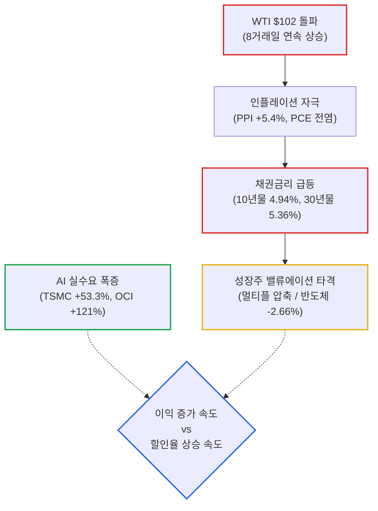
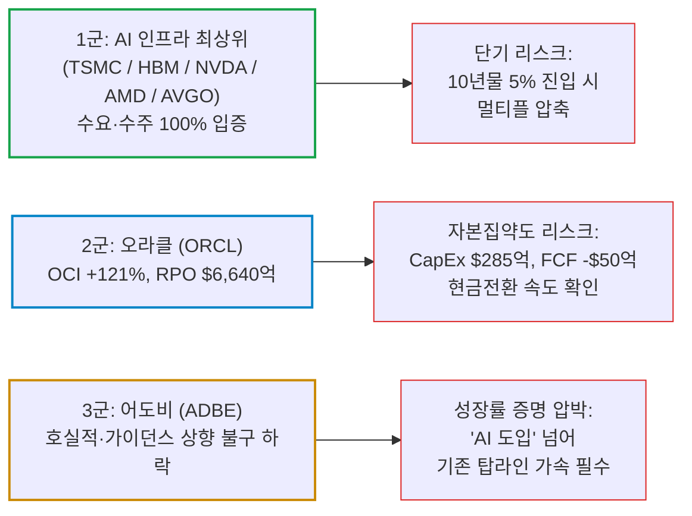
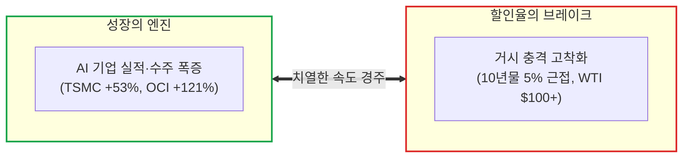

# 2026년 09월 11일(금) 하루치 뉴스정리

- **작성일**: 2026-09-11

지금 증시를 때리는 건 AI 붕괴가 아니라 유가 → 인플레이션 → 금리 → 밸류에이션이라는 거시 충격이며, 폭발하는 AI 실수요와 채권시장의 할인율 급등 사이에서 이익 성장과 금리의 잔혹한 달리기 경주가 시작됐다.

## 요약

| 구분 | 주요 내용 |
| :--- | :--- |
| **핵심 진단** | AI 버블 붕괴가 아닌 **"유가 100달러 돌파 및 10년물 4.9%대 급등에 따른 거시 할인율 발작"** |
| **시장 팩트** | WTI 102.48달러(8거래일 연속 상승), 미 10년물 4.944%, 30년물 5.361%. S&P500 4일 연속 하락 및 필라델피아 반도체 -2.66% 급락 |
| **실적 팩트** | TSMC 8월 매출 YoY +53.3%, 오라클 OCI YoY +121%(RPO 6,640억 달러), 어도비 AI ARR +150% 등 실수요는 역대급 폭증 |
| **착시 교정** | "반도체 하락 = AI 버블 붕괴" 착시. 주문 취소나 CapEx 축소가 아닌 채권 금리 상승에 따른 멀티플 압축(할인율 충격) |
| **고수들의 돈길** | 1군 AI 인프라(TSMC·HBM·NVDA·AMD·AVGO) ➔ 2군 오라클(수요 강력하나 CapEx 285억 달러) ➔ 3군 어도비(기존 성장률 입증 압박) |
| **계좌 행동 지침** | 오늘 밤(21:30) 미국 8월 CPI 발표 전 섣부른 추격·저점 매수 금지. 10년물 5% 돌파 및 유가 100달러 안착 여부 확인 후 대응 |

---

## 결론부터: AI 붕괴가 아니다, 거시 충격(유가 → 금리 → 밸류에이션)이다

지금 증시를 때리는 건 AI 붕괴가 아니다. **유가 → 인플레이션 → 금리 → 밸류에이션**이라는 거시 충격이다.

WTI는 102.48달러, 미 10년물은 4.944%, 30년물은 5.361%까지 올라갔고 S&P500은 나흘째 하락했다. 특히 전날까지 금리를 씹고 버티던 필라델피아 반도체지수까지 **-2.66%** 맞았다. ([The Wall Street Journal](https://www.wsj.com/finance/stocks/u-s-stocks-fall-as-oil-tops-100-yields-hit-multiyear-highs-0cd4f1ec?utm_source=chatgpt.com))

그런데 기업 실적을 뜯어보면 완전히 다른 그림이다.

- **TSMC 8월 매출**: YoY **+53.3%**
- **오라클 OCI**: YoY **+121%**
- **오라클 RPO**: **6,640억 달러**
- **Adobe AI-first ARR**: **+150%**

즉 현재 시장에는 이상한 괴리가 생겼다.

**AI의 실제 수요는 더 강해지고 있는데, 그 수요를 만드는 막대한 투자와 에너지 소비가 인플레이션과 금리를 자극해서 AI 주식의 밸류에이션을 때리고 있다.**

이번 뉴스 묶음 전체를 관통하는 핵심은 이것이다.

---

## 1. 기사 속 팩트: 지금 시장에서 진짜 중요한 것

### ① 어제 하락의 본체는 PPI보다 유가 + 채권시장

PPI는 전월 대비 +0.4%, 전년 대비 +5.4%였다. 헤드라인만 보면 뜨겁다.

하지만 세부적으로는 상품가격이 +1.1%, 서비스는 +0.1%, 식품·에너지·무역서비스 제외는 +0.3%다. ([미국 노동부](https://www.dol.gov/newsroom/economicdata/ppi_09102026.pdf?utm_source=chatgpt.com))

그러니까 이것을 단순히 **“인플레이션 전면 재폭발”**이라고 해석하면 틀린다. 반대로 **“유가 때문이니까 아무 문제 없다”**도 틀렸다.

항공료·운송비 등 PCE에 들어가는 일부 항목도 강해지고 있고, 무엇보다 **유가가 며칠짜리 급등이 아니라 WTI 8거래일 연속 상승**이라는 게 문제다. 시장이 겁먹은 이유는 PPI 숫자 하나가 아니라 인플레이션이 다시 지속될 가능성이다. ([AP News](https://apnews.com/article/66d1591b979271ee7b79b113d715f6ef?utm_source=chatgpt.com))

FedWatch의 9월 25bp 인상 가능성도 **약 70% 수준**까지 올라왔다. ([MarketWatch](https://www.marketwatch.com/livecoverage/stock-market-today-dow-sp500-nasdaq-up-oil-calmer-treasury-steady-producer-inflation-oracle-earnings/card/fed-funds-futures-point-to-increased-chance-of-fed-rate-hike-next-week-xs9IeNdIJO2XkdkFTryP?utm_source=chatgpt.com))

| 지표 / 항목 | 발표 수치 및 동향 | 시장 영향 및 시사점 |
| :--- | :---: | :--- |
| **WTI 원유** | **$102.48** | **8거래일 연속 상승**, 단순 단기 급등이 아닌 인플레이션 재점화 도화선 |
| **미 10년물 국채금리** | **4.944%** | 5.0% 턱밑까지 육박하며 고밸류 성장주 할인율 직격 |
| **미 30년물 국채금리** | **5.361%** | 장기채 기간프리미엄 상승 및 국채 공급 부담 반영 |
| **미국 8월 PPI** | MoM +0.4% / YoY +5.4% | 상품 +1.1%, 서비스 +0.1%, 근원(식품·에너지·무역 제외) +0.3% |
| **FedWatch 9월 25bp 확률** | **약 70%** | 9월 추가 금리 인상 가능성 가격 반영 심화 |
| **필라델피아 반도체지수** | **-2.66%** | 금리 상승 압박에 굴복하며 기술주 전반 동반 하락 |

---

### ② 그런데 AI 수요는 전혀 무너지고 있지 않다

이 부분은 꽤 강력하다.

오라클은 매출 193억 달러(+30%), 클라우드 +62%, **OCI는 무려 +121%**다.

더 중요한 건 RPO(잔여이행의무, 계약잔고)다. **6,640억 달러.** 작년보다 2,090억 달러 증가했다. OCI에서 단순히 “AI가 기대됩니다”라고 떠드는 수준이 아니라 계약잔고가 실제로 쌓이고 있다. ([Oracle Investor Relations](https://investor.oracle.com/files/content_files/1q27-pressrelease-September_FINAL.pdf?utm_source=chatgpt.com))

그리고 TSMC. 8월 매출은 5,148억 대만달러로 YoY **+53.3%**다. 1~8월 누적으로도 **+39.3%**다. ([TSMC](https://investor.tsmc.com/japanese/monthly-revenue/2026?utm_source=chatgpt.com))

| 기업 | 지표 | 수치 | 팩트 판정 |
| :--- | :--- | :---: | :--- |
| **오라클 (ORCL)** | 총매출 / 클라우드 성장률 | $193억 (+30%) / +62% | AI 엔터프라이즈 수요 가속 |
| **오라클 (ORCL)** | OCI (클라우드 인프라) | **+121%** | AI 워크로드 처리량 폭증 |
| **오라클 (ORCL)** | RPO (계약잔고) | **$6,640억** | 전년 대비 2,090억 달러 증가, 실제 수주 확인 |
| **TSMC (TSM)** | 8월 월간 매출 | **5,148억 NT$** (YoY **+53.3%**) | 1~8월 누적 YoY +39.3%, 파운드리 공급 부족 지속 |
| **어도비 (ADBE)** | AI-first ARR | **+150% 이상** | 애플리케이션 단에서도 AI 수익화 진입 |

AI 반도체 수요가 무너지는 사이클이면 이 숫자가 나올 수 없다.

따라서 어제 NVDA·AMD·MU·LRCX 등이 3~5% 빠졌다고 해서 **“AI 사이클이 끝났다”고 해석하는 건 현재 데이터와 정면으로 충돌한다.**

---

## 2. 대중의 눈먼 착시: 데이터가 말하는 냉혹한 진실

| 대중의 착시 (선동과 공포) | 데이터가 말해주는 진실 (팩트) |
| :--- | :--- |
| **착시 ① “반도체 -2.66% → AI 버블 붕괴 시작”** | **아직 아니다.** 주문 취소, CapEx 축소, GPU 수요 둔화, 파운드리 가동률 하락 신호는 전무하다. 확인되는 것은 수요 붕괴가 아니라 채권 금리 상승에 따른 할인율 상승이다. |
| **착시 ② “PPI 예상치 부합했는데 시장이 호들갑”** | **틀렸다.** 컨센서스 부합과 절대 물가 안정은 별개다. 10년물 4.94%, WTI 102달러 환경에서 연준이 방관할 수 없다. 유가 100달러 체류 기간이 관건이다. |
| **착시 ③ “트럼프 5,000달러 지급 = 소비부양 = 호재”** | **채권시장은 악재로 본다.** 2억 4천만 명 기준 1.2조 달러 지출. "그 돈 누가 빌려주냐"며 국채 발행·인플레이션·기간프리미엄 상승을 먼저 계산한다. |
| **착시 ④ “‘27년 버블 붕괴 전망 → 지금 당장 도망가라”** | **팩트가 아닌 전망이다.** 캐피털 이코노믹스의 기본 시나리오조차 2026년 말 8,250 ➔ 2027년 말 6,500이다. 즉 당장 붕괴가 아니라 실적이 기대를 못 따라갈 때의 경고다. |

### 착시 ① “반도체 -2.66% → AI 버블 붕괴 시작”
아직 아니다.

주가가 빠진 건 사실이다. 하지만 기업 실적 데이터에서 AI 주문 취소, CapEx 축소, GPU 수요 둔화, 파운드리 가동률 하락 같은 신호가 나온 게 없다.

오히려 반대다.

- Oracle +121% OCI
- TSMC +53% 매출
- HBM 공급 부족
- AI 컴퓨팅 가격 상승

현재 확인되는 것은 **수요 붕괴가 아니라 할인율 상승**이다. 둘을 구분 못 하면 멀쩡한 기업을 경기침체주처럼 팔게 된다.

### 착시 ② “PPI 예상치 부합했는데 시장이 괜히 호들갑”
이것도 틀렸다.

시장 컨센서스에 부합했다는 것과 절대적인 물가 수준이 괜찮다는 것은 전혀 다른 얘기다.

10년물이 4.94%, 30년물이 5.36%이고 WTI가 102달러인데 연준이 “예상대로 나왔으니까 그냥 넘어갑시다” 할 환경은 아니다. 특히 유가가 얼마나 오래 100달러 위에 머무느냐가 앞으로 CPI보다 더 중요한 변수 중 하나가 됐다.

### 착시 ③ “트럼프 5,000달러 지급 = 소비부양 = 주식 호재”
단기 소비만 보면 맞다.

그런데 채권시장은 그런 식으로 계산하지 않는다. 성인 2억 4천만 명 기준이면 약 1.2조 달러짜리 정책이다. 이미 재정적자가 큰 상황에서 추가 재정확대를 이야기하면 채권 투자자는 **“그 돈 누가 빌려줄 건데?”**부터 계산한다.

그래서 경기부양 기대보다 국채 발행·인플레이션·기간프리미엄 상승이 먼저 튀어나온 것이다. 현재 증시에서는 오히려 악재에 가깝다.

### 착시 ④ “‘27년 버블 붕괴 전망 → 지금 당장 도망가라”
여기서는 캐피털 이코노믹스 말의 절반은 맞고 절반은 아직 주장이다.

맞는 부분은 있다. AI 관련 이익 기대가 매우 높고, 지수 집중도와 밸류에이션도 높다. 기대치가 높아질수록 작은 실적 미스가 주가에 큰 충격을 준다. 이 위험을 무시하면 안 된다.

그런데 2027년 말 S&P500 6,500은 팩트가 아니라 전망이다. 더 웃긴 건 이 기관의 기본 시나리오 자체가 **2026년 말 8,250 → 2027년 말 6,500**이다. 즉 자기들도 당장 붕괴한다고 말하는 게 아니다. ([Capital Economics](https://www.capitaleconomics.com/equities?utm_source=chatgpt.com))

그래서 이 보고서의 제대로 된 해석은: **“AI를 당장 팔아라”가 아니라 “실적이 기대치를 따라가지 못하기 시작하는 순간 매우 위험해진다”**는 것이다. 이게 맞다.

---

## 3. 고수들의 진짜 돈길: 3대 계급도

여기서는 한 가지 선을 긋겠다. 이번 자료만으로 기관이 실제로 ‘매집 중’이라고 단정할 증거는 없다. 그건 자금흐름·13F·옵션·블록딜 데이터를 봐야 한다.

대신 돈이 어디로 갈 가능성이 높은지는 꽤 명확하다. 가장 중요한 축은 여전히 **AI 인프라**다.

| 티어 (계급) | 핵심 종목군 | 비즈니스 실체 및 펀더멘털 판정 | 핵심 모니터링 포인트 및 리스크 |
| :---: | :--- | :--- | :--- |
| **1군** | **TSMC / HBM / NVDA / AMD / AVGO** | AI 수요가 실제 매출·생산능력·계약으로 증명되는 곳. AVGO 또한 AI 컴퓨팅·네트워크·ASIC 투자 확대로 장기 우호적 환경 | **기업은 맞는데 주가는 틀릴 수 있는 구간.** 10년물이 5%에 접근하며 피할 수 없는 멀티플 압축 |
| **2군** | **오라클 (Oracle)** | OCI +121%, RPO 6,640억 달러(YoY +2,090억 달러)로 실제 계약잔고 폭증 입증 | **CapEx 285억 달러, FCF 약 -50억 달러.** `RPO ➔ 실제 매출 ➔ 현금흐름` 변환 속도 검증 전 추격 금지 |
| **3군** | **어도비 (Adobe)** | 매출 67.6억 달러, EPS 6.13달러(컨센서스 상회), 연간 가이던스 상향, AI ARR +150% 성장 ([어도비 IR](https://www.adobe.com/cc-shared/assets/investor-relations/pdfs/01906202/au56y4ter.pdf?utm_source=chatgpt.com)) | **기존 성장률 증명 실패 시 가차 없는 주가 징벌.** 시장은 "AI 도입"이 아니라 "탑라인 가속 폭"을 요구 |

- **1군: TSMC / HBM / NVDA·AMD / AVGO 계열**
    - AI 수요가 실제 매출·생산능력·계약으로 증명되는 곳이다.
    - 이 가운데 AVGO도 이번 뉴스 묶음에서 사업 펀더멘털이 깨졌다는 신호는 전혀 없다. 오히려 AI 컴퓨팅·네트워크·ASIC 투자가 확대되는 환경은 장기적으로 우호적이다.
    - 다만 지금 문제는 10년물이 5%에 접근하는 상황에서 좋은 기업도 멀티플 압축을 피하기 어렵다는 것이다. 즉: **기업은 맞는데 주가는 틀릴 수 있는 구간이다.**
- **2군: Oracle**
    - 실적 자체는 강력하다. 하지만 무작정 추격매수하기에는 한 가지 큰 문제가 있다.
    - AI 인프라 확장 때문에 CapEx가 285억 달러까지 올라왔고 FCF는 약 -50억 달러다.
    - 그래서 Oracle에서 앞으로 봐야 할 것은 매출 성장보다 **`RPO → 실제 매출 → 현금흐름`**으로 얼마나 빠르게 변환되는가다. AI 수요를 증명했다는 점에서는 큰 점수를 주지만 자본집약도가 상당하다.
- **3군: Adobe**
    - Adobe는 망한 실적이 아니다. 매출 67.6억 달러, EPS 6.13달러로 모두 컨센서스를 넘었고 연간 가이던스까지 올렸다. AI-first ARR도 150% 이상 성장했다.
    - 그런데 주가는 하락했다. 이게 중요하다.
    - 시장은 이제 **“AI 하고 있습니다”**에 돈을 주는 단계가 아니다. **“그래서 기존 성장률이 얼마나 올라갔는데?”**를 묻는다.
    - Adobe의 Q4 매출 가이던스가 컨센서스 상단 정도에 불과하니 주가가 반응하지 않는 것이다. 앞으로 소프트웨어주는 이런 식으로 더 잔인하게 갈릴 가능성이 크다.

---

## 4. 지금 계좌에서 해야 할 행동: 오늘 밤 CPI 대응 매트릭스

오늘 가장 중요한 이벤트는 **9월 11일 한국시간 21:30 발표되는 미국 8월 CPI**다. BLS 일정상 FOMC 전 마지막 CPI다. ([Bureau of Labor Statistics](https://www.bls.gov/schedule/2026/?utm_source=chatgpt.com))

시장 컨센서스는 대략 **헤드라인 +0.4% MoM / +3.4% YoY, 근원 +0.2% MoM / +2.4% YoY**다. ([Investopedia](https://www.investopedia.com/cpi-august-preview-12114511?utm_source=chatgpt.com))

### 실전 시나리오별 대응 매트릭스

| 시나리오 | 시장 해석 | 계좌 실전 행동 방침 |
| :--- | :--- | :--- |
| **근원 CPI ≤0.2% + 10년물 하락** | 유가발 헤드라인 인플레에 그칠 가능성 | **AI 인프라 우량주 분할매수 재개** |
| **근원 0.2% 부근 + 10년물 4.9%대 유지** | 애매함, Fed 불확실성 지속 | **기존 보유 유지, 추격매수 절대 금지** |
| **근원 ≥0.3% + 10년물 5% 돌파** | 전방위 인플레 확산 신호 | **고멀티플 성장주 신규매수 즉시 중단** |
| **유가 $105 이상 지속 + 10년물 5% 이상 고착** | 단순 조정이 아니라 할인율 체계 구조 변경 | **현금 비중 확대, 실적 없는 성장주부터 축소** |

특히 지금 반도체가 하루 3~5% 빠졌다고 덥석 사는 건 서두르는 행동이다.

기업 문제가 아니라 거시 문제이기 때문에 저점도 기업 실적 발표가 아니라 채권시장이 결정할 가능성이 높다.

내가 보는 확인 신호는 딱 두 개다:

1. **10년물이 5%를 뚫고 올라가느냐, 아니면 4.8%대로 다시 밀리느냐.**
2. **WTI가 100달러 아래로 내려오느냐, 105~110달러로 올라가느냐.**

이 둘이 안정되지 않으면 AI 실적이 아무리 좋아도 시장 전체 멀티플은 계속 얻어맞는다.

---

## 5. 종합 결론 및 핵심 실행 원칙

이번 뉴스에서 제일 중요한 건 “AI 버블” 뉴스가 아니다.

**AI 수요는 오히려 예상보다 강하다.** Oracle과 TSMC가 그걸 실제 숫자로 증명했다.

문제는 AI 인프라 투자 붐과 지정학적 충격이 동시에 에너지·물가·금리를 끌어올려 **AI 기업들의 이익 증가 속도와 할인율 상승 속도가 경주를 시작했다**는 것이다.

지금까지는 이익 증가가 이겼다. 그래서 S&P500이 7,500대까지 올라왔다.

하지만 10년물 5%, WTI 100달러 이상이 몇 주씩 굳어지기 시작하면 이야기가 달라진다. 그때부터는 좋은 실적이 나와도 Adobe처럼 주가가 못 오르고, 결국 기대가 가장 높은 종목부터 밸류에이션이 깎인다.

따라서 지금 전략은 AI에서 도망가는 게 아니다:

1. **AI 안에서도 실적·수주·생산능력으로 수요가 증명된 기업만 들고 간다.**
2. **CPI와 채권시장이 안정될 때까지 신규매수 속도를 늦춘다.**
3. **지수 착시에 속지 말고, 10년물 금리와 유가의 방향성을 확인한 뒤 움직인다.**

현재 데이터만 놓고 보면 **“AI 사이클 종료”보다 “AI 강세장 중 첫 번째 본격적인 금리 스트레스 테스트”**라는 해석이 훨씬 설득력 있다.

그리고 오늘 밤 CPI가 그 스트레스 테스트의 다음 문제다.

!!! tip "최종 핵심 제언 (Executive Takeaway)"
    **AI 버블 붕괴 공포에 질려 도망가지 마라. 다만 10년물 5%와 유가 102달러가 만드는 할인율 칼바람을 얕보지도 마라.**
    TSMC +53%와 오라클 OCI +121%는 AI 실수요가 건재함을 못 박았다. 지금 시장을 뒤흔드는 것은 수요 소멸이 아니라 금리 발작이다.
    섣부른 저점 매수나 하루 반등 추격에 계좌를 걸지 마라. 오늘 밤 21:30 미국 8월 CPI와 10년물 국채금리 5% 안착 여부를 확인하고, 실적으로 증명된 1군 인프라 코어만 선별하여 눌림목 분할 매수로 대응하라.
