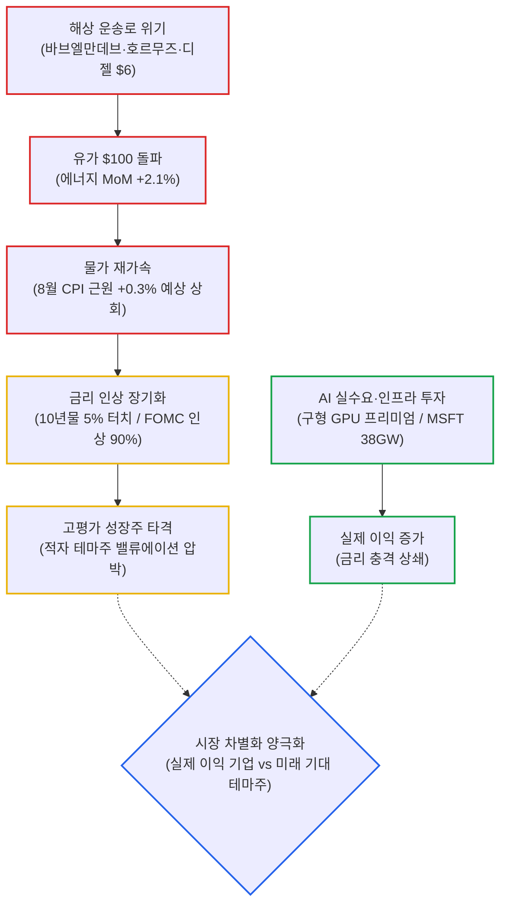
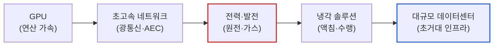

# 2026년 09월 14일(월) 하루치 뉴스정리

- **작성일**: 2026-09-14

지금 시장의 진짜 위험은 금리 인상 자체가 아니라 '고유가 → 물가 재가속 → 긴축 장기화'이며, 10년물 5%의 거시 할인율을 감당할 실질 이익 기업과 미래 기대만 부푼 적자 테마주가 잔혹하게 갈라지는 차별화 장세가 시작됐다.

## 요약

| 구분 | 주요 내용 |
| :--- | :--- |
| **핵심 진단** | 시장 본체는 '금리 25bp 인상 1회성 종료' 착시 vs **'고유가발 물가 재가속 및 고금리 장기화'**의 격돌 |
| **거시 팩트** | 8월 CPI 근원 +0.3%(예상 상회), 에너지 MoM +2.1%/YoY +16.3%, WTI $100 돌파, 10년물 장중 5.0% 터치 |
| **실적 팩트** | 구형 GPU 20% 프리미엄 재계약(오라클), MSFT 데이터센터 38GW(CapEx $1,450억), 메모리 초과이익 성과급 |
| **착시 교정** | CPI 후 주가 반등은 '악재 해소'가 아닌 AI 이익 사이클의 버팀목 덕분. 유가 하락(-2%)은 호재 아닌 수요 파괴 경고 |
| **스마트머니 돈길** | 1위 AI 인프라(전력 병목) ➔ 2위 메모리 반도체(초과이익 단계) ➔ 3위 AI 커머스(SHOP 백엔드) ➔ 4위 전력·원전 |
| **계좌 행동 지침** | FOMC 직전 풀베팅 금지, 현금 10~20% 확보, 실적 없는 적자 테마주(SMR 등) 비중 축소, 미 10년물 5% 안착 여부 주시 |

---

## 결론부터: 금리 인상 자체가 아니라 '고유가발 장기화'가 진짜 리스크다

지금 시장의 핵심은 **“금리 인상 자체”가 아니다. `고유가 → 물가 재가속 → 금리 인상 장기화`가 진짜 리스크다.**

그런데 시장은 이걸 아직 **“9월에 25bp 한 번 올리고 끝나는 이벤트”** 정도로 소화하고 있다. 그래서 CPI가 예상보다 뜨거웠는데도 S&P500 +0.86%, 나스닥 +0.96%가 나왔다. 이 반등을 “악재 해소”라고 받아들이면 착각이다.

오히려 지금 시장이 버티는 이유는 단순하다.

**AI·데이터센터·반도체 쪽 이익과 투자 사이클이 금리 충격보다 아직 더 강하기 때문이다.**

따라서 지금은 “증시 전체가 위험하다”가 아니라,

> **고금리를 감당할 만큼 실제 이익이 늘어나는 기업과, 미래 기대만 비싼 기업이 갈라지는 장이다.**

제공된 9월 11~14일 뉴스 흐름을 한 줄로 압축하면 이거다.

---

## 1. 기사 속 팩트 폭행

### ① CPI는 생각보다 안 좋다

8월 CPI 발표 수치를 뜯어보면 시장의 낙관론을 사정없이 깨부순다.

| 세부 지표 | 발표 수치 | 예상치 및 시장 영향 |
| :--- | :---: | :--- |
| **헤드라인 CPI** | **+0.4% MoM / +3.4% YoY** | 유가 상승분 반영 시작 |
| **근원(Core) CPI** | **+0.3% MoM / +2.4% YoY** | **예상치(+0.2%) 상회** |
| **에너지 부문** | **+2.1% MoM / +16.3% YoY** | 인플레이션 재점화의 뇌관 |
| **9월 금리 인상 확률** | **약 86 ~ 90%** | 25bp 인상 기정사실화 |

겉으로는 CPI가 거의 예상치 수준에 머문 것처럼 보이지만, 핵심은 **물가가 다시 내려가는 그림이 아니라는 점**이다.

다만 근원 CPI를 끌어올린 것 중 **무선통신료 +5.9%**라는 특이한 항목이 상당 부분 기여했다. 이걸 빼면 근원 물가는 약 +0.2%였다는 분석도 있다.

그러니까 결론은 양쪽 극단 모두 틀렸다.

**“인플레 완전 재폭발”도 아니고, “CPI 별거 아니네”도 아니다.**

진짜 문제는 **앞으로 유가가 CPI에 계속 들어올 가능성**이다.

---

## 2. 지금 가장 위험한 건 CPI가 아니라 유가다

WTI **100.05달러**, 브렌트유 **104.61달러**.

그런데 더 심각한 건 가격 자체가 아니다.

- **후티 반군이 바브엘만데브 해협 주요 거점 장악**
- **사우디 동서 송유관 예방적 가동 중단**
- **호르무즈 해협도 불안 고조**
- **미국·이란 직접 충돌 지속**
- **예멘 정부군 반격 및 교전 격화**
- **디젤 가격 갤런당 6달러 돌파**

즉 지금 원유 문제는 단순 OPEC 감산이 아니다.

**운송로 자체가 위험해졌다.**

호르무즈와 바브엘만데브가 동시에 흔들리면 글로벌 원유시장 입장에서는 공급량보다도 **보험료·운송비·우회비용·정제 마진**까지 전부 올라간다.

이게 진짜 인플레이션이다.

그리고 이건 연준이 금리 25bp 올린다고 해결되는 문제가 아니다.

---

## 3. 그런데 유가는 하루 -2~3% 떨어졌다? 그걸 좋아하면 안 된다

WTI **-2.37%**, 브렌트 **-2.81%**.

IEA가 올해 세계 원유 수요가 전년 대비 **하루 250만 배럴 감소**할 수 있다고 전망하면서 유가가 빠졌다.

이게 좋은 뉴스 같나?

절반만 맞다.

유가가 떨어진 이유가 공급 증가가 아니라 **수요 파괴 우려**다.

> 기름값이 너무 비싸서 경제 주체들이 소비를 줄일 것이라는 얘기다.

이건 완벽한 호재가 아니다.

**고유가 → 물가 상승 → 소비 위축**

이라는 전형적인 스태그플레이션 메커니즘의 초기 단계다.

유가 -2%만 보고 “인플레 끝”이라고 해석하면 숫자를 읽는 게 아니라 캔들만 보는 꼴이다.

---

## 4. 9월 FOMC의 진짜 질문은 “인상하냐?”가 아니다

금리 인상 확률은 이미 85~90%다.

그러면 25bp 인상 자체는 상당 부분 가격에 들어갔다.

시장에 중요한 건 인상 여부가 아니라 그다음이다.

| 시나리오 | 연준 스탠스 및 발언 | 시장 영향 및 판정 |
| :--- | :--- | :--- |
| **시나리오 A (가장 좋은 그림)** | **25bp 인상 + 사실상 1회성** "물가 위험 때문에 한 번 보험성으로 올리지만 추가 인상 여부는 데이터에 달렸다" | 증시는 버틸 가능성이 높음 |
| **시나리오 B (진짜 악재)** | **25bp 인상 + 추가 인상 암시** 점도표 연말 금리 상향, "아직 해야 할 일이 있다" 강력 반복 | 2년물·실질금리 급등 ➔ **성장주 밸류에이션 재압박** |
| **시나리오 C (양날의 검)** | **동결** 초반에는 주식 급반등 연출 가능 | "연준의 인플레 통제 의지 상실" 의구심 ➔ **장기금리 재급등 리스크** |

그래서 이번 FOMC에서 **금리 결정 숫자보다 기자회견 + 점도표가 훨씬 중요하다.**

---

## 5. 대중의 눈먼 착시 ①: “금리 오르는데 주식 올랐으니 시장이 강하다”

절반만 맞다.

9월 11일 시장 상황을 보라:

- **Dow**: +0.98%
- **S&P500**: +0.86%
- **Nasdaq**: +0.96%
- **SOX**: +1.81%
- **VIX**: 15.84

분명 지수만 보면 시장은 강했다.

그런데 채권시장을 뜯어보면 공포가 도사리고 있다:

- **2년물**: **4.644%**
- **10년물**: **4.974%** (장중 5% 터치)
- **30년물**: **5.354%**

10년물은 장중 5%도 찍었다.

이 수준의 금리에서 주식이 버틴다는 건 분명 엄청난 강도다.

하지만 이걸

> “금리 아무리 올라도 주식은 오른다”

로 확대해석하면 안 된다.

지금 주가를 버티는 건 **기업 이익 기대가 아직 무너지지 않았기 때문**이다.

이익 추정치가 한번 꺾이면 5% 금리가 바로 목을 조른다.

---

## 6. 대중의 눈먼 착시 ②: “AI 버블은 끝물”

캐피털이코노믹스가 S&P500을 다음과 같이 비관적으로 전망했다:

- **2026년 말**: **8,250**
- **2027년 말**: **6,500**

즉 올해 +8% 추가 상승 후, 이후 **-21% 폭락**한다는 시나리오다.

그들의 논리 자체는 이해된다:

- EPS 기대가 과도하게 높음
- 지수 집중도 극단적
- 외국인 미국주식 비중 역사적 최고 수준
- 순주식 발행 증가
- IPO 증가 가능성

여기까지는 맞다.

하지만 **“버블 지표가 높다 = 지금 바로 팔아야 한다”는 논리적 비약**이다.

실제로 그 기관조차 **올해 S&P500 추가 상승을 예상하고 있다.**

버블은 싸서 터지는 게 아니다.

**기대가 현실을 앞질렀다는 증거가 확인될 때 터진다.**

지금 확인해야 할 건 PER 자체가 아니라 아래 7가지 핵심 지표다:

1. **AI 매출 증가율**
2. **GPU 가동률**
3. **클라우드 예약 매출(RPO)**
4. **CapEx 대비 ROI**
5. **전력 확보 능력**
6. **고객 집중도 완화 여부**
7. **AI 서비스의 실질 매출화**

---

## 7. 그리고 이번 뉴스에서 AI 버블론과 정반대의 데이터도 나온다

이게 상당히 중요하다.

오라클은 **4년 된 GPU조차 계약 갱신 때 20% 프리미엄을 받고 있다.**

AI 버블론의 대표 논리가 뭐였나?

> “GPU는 몇 년 지나면 쓸모없는 감가상각 자산이 된다.”

그런데 현실에서는 구형 GPU까지 프리미엄으로 재계약되고 있다.

이건 상당히 강한 데이터다.

**AI 컴퓨팅 공급이 여전히 타이트하다는 의미**다.

---

## 8. 마이크로소프트가 보여주는 것도 똑같다

MSFT의 인프라 확장 지표는 거짓말을 하지 않는다:

- **현재 데이터센터 용량**: 약 **12GW**
- **2032년 목표 용량**: **38GW+**
- 네오클라우드 사용량 제외한 자체 구축분
- **FY26 CapEx**: **1,450억 달러**

이게 중요한 이유는 단순하다.

빅테크가 AI 수요를 뻥튀기하고 있다면 CapEx를 줄여야 한다.

그런데 여전히 **전력과 컴퓨팅 용량 부족 때문에 더 짓고 있다.**

지금 AI 인프라 사이클이 끝났다고 단정할 근거는 아직 턱없이 약하다.

---

## 9. 그렇다고 AI는 무조건 롱이냐? 그것도 아니다

오라클이 아주 좋은 사례다.

매출 성장률이 **11% → 30%**로 뛰었다.

클라우드는 폭발적으로 성장한다.

그런데:

**매출총이익률은 전년 대비 거의 10%p 하락했다.**

이게 앞으로 AI 인프라 기업에서 반드시 봐야 하는 숫자다.

매출은 폭증하는데:

- GPU 조달 비용
- 전력 요금
- 데이터센터 구축비
- 감가상각비
- 금융비용

때문에 마진이 박살 날 수 있다.

AI 투자에서 이제

> **“AI 매출 얼마나 증가했나?”**

만 보면 한 단계 늦었다.

앞으로는

> **“AI 매출 1달러 늘릴 때 얼마를 투자해야 하느냐?”**

를 봐야 한다.

---

## 10. 스마트머니가 보는 진짜 돈길

이번 뉴스에서 제일 구조적으로 강한 테마를 뽑으면 4가지다.

| 순위 | 테마 | 핵심 동력 및 시장 판단 |
| :---: | :--- | :--- |
| **1위** | **AI 인프라** | 여전히 강함. GPU 부족을 넘어 전력·네트워크로 병목 이동 |
| **2위** | **전력·원전** | 구조적 병목. 설비 증설에 가장 오랜 시간이 소요되는 핵심 자원 |
| **3위** | **반도체·메모리** | 실적이 증명 중. 초과이익 배분 국면 진입 |
| **4위** | **AI 커머스** | 시장이 아직 과소평가. 에이전트 전환율 2배 입증 |

---

## 11. 1위: AI 인프라

MSFT가 38GW를 목표로 잡고 있다.

한국 정부도 미국 AI 전력 인프라에 **1,000억 달러 이상** 투자하는 방안을 논의하고 있다.

최대:

- 원전 8기
- 텍사스 천연가스 발전
- 데이터센터 전력 공급

이제 AI 투자의 본질은 GPU만 아니다.

**GPU → 네트워크 → 전력 → 발전 → 냉각 → 데이터센터**

로 돈이 이동하고 있다.

여기에서 전력 인프라가 가장 느리게 늘어난다.

그래서 병목의 가치가 올라간다.

---

## 12. 2위: 반도체 / 메모리

마이크론 뉴스가 웃기게 강하다.

직원들에게 **35~68개월치 급여에 해당하는 보너스**를 제시했고 노조는 83개월치를 요구하고 있다.

이건 노동 뉴스로 보면 안 된다.

반대로 읽어야 한다.

> 메모리 기업 이익이 얼마나 폭발적으로 늘었길래 노동자들이 영업이익 공유를 요구하기 시작했는가?

SK하이닉스도 영업이익의 10% 공유.

삼성도 반도체 부문 특별 보너스.

메모리 업황이 “회복” 단계를 이미 지나 **초과이익 배분 단계**에 들어갔다는 신호다.

다만 여기서도 문제는 하나다.

**초과이익 단계는 업황 최고점과 가까워지는 과정일 수도 있다.**

그래서 지금부터는 단순 출하량보다 HBM 가격·ASP와 빅테크 고객들의 CapEx를 봐야 한다.

---

## 13. 3위: 쇼피파이 (SHOP)

이번 묶음에서 SHOP 뉴스가 꽤 중요하다.

- **기존 시장 논리**: "AI 에이전트가 쇼피파이를 죽인다."
- **JPMorgan과 Bernstein 논리**: "오히려 AI 에이전트가 쇼피파이 주문을 늘린다."

후자가 지금은 훨씬 더 설득력 있다.

왜냐하면 AI 쇼핑이 아무리 커져도 필요한 건 그대로이기 때문이다:

- 상품 데이터베이스(DB)
- 실시간 재고 관리
- 결제 게이트웨이
- 주문 처리
- 배송 및 물류 연동
- 판매자 백엔드 시스템

AI가 고객 인터페이스를 먹는다고 해서 커머스 백엔드가 사라지지 않는다.

오히려 AI 주문 전환율이 기존 웹보다 **약 2배** 높다는 데이터까지 나온다.

그래서 SHOP은

> **“AI 때문에 망하는 SaaS”**

가 아니라

> **“AI가 트래픽을 만들어주는 거래 인프라”**

가 될 가능성이 있다.

---

## 14. 테슬라 Semi는 좋은 이야기지만 아직 숫자를 너무 믿으면 안 된다

모간스탠리의 장밋빛 논리를 보라:

- 디젤 $6+ 돌파
- Semi 본격 양산
- 2027년 자율주행 상용화
- 마일당 운송 비용 약 20% 절감
- **연간 순익 400% 이상 증가**

방향은 맞다. 디젤 가격이 오를수록 전기 상용차의 TCO(총소유비용)가 좋아지는 건 당연하다.

하지만 **“순이익 400%”는 상당히 많은 가정을 포함한 모델값**이다.

확정 사실과 허상을 철저히 구분해야 한다:

| 구분 | 검증 내용 및 시장 팩트 |
| :--- | :--- |
| **① 확정된 사실** | 디젤 가격 급등은 전기트럭의 경제성을 확실히 개선한다. |
| **② 신뢰도 높은 추정** | Semi 운행비가 디젤 트럭보다 유의미하게 내려갈 가능성. |
| **③ 아직 확인 필요한 부분** | 자율주행 상용화 실제 일정 및 규제 승인 속도. |
| **④ 과장 가능성이 큰 부분** | **연간 순익 +400% 모델값.** |

그래서 이 뉴스 하나만 보고 TSLA를 맹목적으로 재평가해서는 안 된다.

---

## 15. AI 안전 논쟁도 주가 관점에서는 다르게 봐야 한다

- **앤트로픽 아모데이**: "AI 개발 속도를 늦춰야 한다."
- **오픈AI 올트먼**: "동의한다."
- **일론 머스크**: "다리오의 말이 맞다."
- **오픈AI IPO**: 2026년에는 진행하지 않음.

대중은 이걸

> "AI 발전이 끝났다."

라고 순진하게 읽을 수 있다.

반대로 봐야 한다.

빅테크 CEO들이 동시에

> “모델이 너무 강해져서 속도를 조절해야 한다”

고 말하고 있는 것이다.

물론 이 발언을 액면 그대로 다 믿을 이유도 없다. 규제 선점과 후발 경쟁자에 대한 진입장벽 강화라는 고도의 이해관계도 깔려 있다.

따라서 투자자로서는 이렇게 보는 게 맞다:

**AI 수요 붕괴 뉴스가 아니라, 규제 리스크 및 해자 강화 뉴스다.**

---

## 16. 진짜 위험한 기업군: 적자 성장주의 잔혹한 현실

이 시장에서 제일 위험한 건 적자 성장주다.

특히:

> **매출은 2028년에 나오는데, 현재 주가가 미래 성공을 이미 전부 선반영한 기업.**

SMR(소형 모듈 원자로) 대표주인 뉴스케일 파워가 적나라한 예다:

- **주가 동향**: 지난 12개월간 **-70% 이상 폭락**
- **2028년 착공 예상**: 고작 1개 프로젝트
- **2028년 EBITDA 예상**: **2,900만 달러**
- **시장 컨센서스**: **1.24억 달러** (기대치 대비 처참한 괴리)

이건 그냥

**“원전 테마가 좋으니까 아무 원전주나 사면 된다”**

라며 무지하게 베팅한 투자자에게 시장이 매기는 가차 없는 벌금이다.

원전 산업 전체가 호황이라도, 모든 원전 기업이 돈을 버는 건 아니다.

---

## 17. 마이클 버리 뉴스도 이상하게 해석하지 마라

사이언 에셋의 마이클 버리 포트폴리오 변화를 두고 해석이 분분하다:

- 전체 익스포저 축소
- 현금 비중 대폭 확대
- NVDA / PLTR 풋옵션 롤오버 중단

그런데 동시에:

- ORCL, PLTR, NBIS, NVDA, SOXX 숏 포지션은 일부 유지.

이걸

> “버리가 AI 폭락을 확신했다”

고 단정해도 틀리고,

> “버리가 AI 숏을 포기했다”

고 해도 틀렸다.

정확한 팩트는 이것이다:

> **방향성에 대한 확신보다 변동성 리스크를 철저히 줄이고 있다.**

---

## 18. 이게 지금 스마트머니의 핵심 행동이다

UBS 고액자산가들의 자금 이동도 이와 일치한다. 미국 주식을 전부 내던지는 게 아니다.

AI 투자의 코어를 유지하면서:

- **지역 분산**
- **업종 분산**
- **고금리 자산(채권·단기 현금) 병행**

으로 포트폴리오를 재편하고 있다.

이걸 똑똑히 봐야 한다.

**스마트머니는 AI를 버리고 있지 않다.**

대신

> “AI 하나에 계좌 전부를 몰빵한다”

는 미련한 짓을 버리고 있다.

---

## 19. 이번 주 계좌에서 해야 할 5대 실전 행동 수칙

FOMC 직전에 가장 미련한 행동은 **풀베팅**이다.

### ① AI 핵심주는 굳이 던지지 않는다
실적과 CapEx 사이클이 여전히 살아 있다. NVDA, AVGO, MU, MSFT 같은 핵심 영역은 구조적으로 여전히 쥐고 갈 근거가 확실하다.

### ② 적자 테마주는 비중을 줄이는 게 맞다
5% 국채금리 환경에서 먼 미래의 불확실한 현금흐름은 가치가 급격히 훼손된다. SMR 같은 “스토리 먼저, 현금흐름 나중” 종목이 가장 불리하다.

### ③ 현금 10~20% 확보는 필수다
FOMC에서 추가 연속 인상 시나리오가 튀어나오더라도 패닉에 빠지지 않고 즉각 우량주를 저격 매수할 수 있는 탄약이다.

### ④ FOMC 당일 첫 30분 방향을 따라가지 마라
이번 시장은 다음과 같은 페이크 무빙이 충분히 가능하다:
> 25bp 인상 ➔ 주가 급락 ➔ 기자회견 워딩 해석 ➔ 장기금리 안정 ➔ 주가 급반등

**첫 30분의 지수 등락보다 10년물 국채금리의 종가 방향이 훨씬 중요하다.**

### ⑤ 내가 지금 딱 하나만 본다면: 미국 10년물 5.0%
- **5.0% 위에서 안착**: 성장주 전반에 밸류에이션 부담 확대. 방어적 태세 유지.
- **5.0% 돌파 실패 및 4.8%대로 하락**: 성장주 멀티플 압박 완화로 강력한 랠리 환경 조성.

---

## 20. 최종 판정 및 핵심 실행 원칙

현재 시장을 **“AI 버블 붕괴 직전”**이라고 보는 것은 데이터 근거가 부족하다.

동시에 **“AI 실적만 좋으면 금리는 무시해도 된다”**는 생각 역시 오만이다.

지금 시장은 두 거대한 힘이 정면충돌하고 있다.

| 시장을 떠받치는 상방 엔진 | 시장을 짓누르는 하방 브레이크 |
| :--- | :--- |
| • 빅테크 AI CapEx 폭증 (MSFT $1,450억) • 데이터센터 공급 부족 (MSFT 38GW 목표) • 구세대 GPU까지 20% 프리미엄 가동률 • 메모리 초과이익 성과급 배분 • 클라우드 탑라인 성장 가속 • AI 커머스 에이전트 전환율 2배 확산 | • WTI 100달러 돌파 및 에너지 물가 자극 • 바브엘만데브·호르무즈 해운 공급망 위기 • 미 10년물 국채금리 5.0% 턱밑 육박 • 미 30년물 국채금리 5.35% 상회 • 9월 FOMC 25bp 인상 및 긴축 장기화 • 지나치게 높은 지수 EPS 기대치 |

그래서 지금 가장 합리적인 판정은 이것이다:

> **주식 시장 전체를 비관하고 피해야 하는 장이 아니다. 대신 미래의 뜬구름 이야기만 있는 적자 기업을 들고 버틸 장은 더더욱 아니다.**

**실적이 숫자로 찍혀 나오는 AI·반도체·인프라 코어 기업은 뚝심 있게 보유하고, 장기금리 5%를 감당하지 못하는 적자 성장주와 테마주는 가차 없이 정리하라.**

그리고 이번 FOMC에서 제일 중요한 숫자는 **25bp 결정이 아니라 점도표**이고, 제일 중요한 차트는 **S&P500 캔들이 아니라 미국 10년물 국채금리**다.

!!! tip "최종 핵심 제언 (Executive Takeaway)"
    **금리 발작에 지수를 던지지 말고, 10년물 5% 시대에 살아남지 못할 '가짜 주식'을 던져라.**
    오라클의 구형 GPU 20% 프리미엄과 MSFT의 38GW 데이터센터 확장은 AI 실수요가 여전히 공급을 압도하고 있음을 증명한다.
    지수 하루 반등에 환호하여 FOMC 전에 계좌를 풀베팅하는 것은 도박이다. 10년물 5% 안착 여부를 확인하며, 현금 10~20% 탄약을 쥐고 실적과 해자가 입증된 AI 코어 인프라에만 집중하라.
