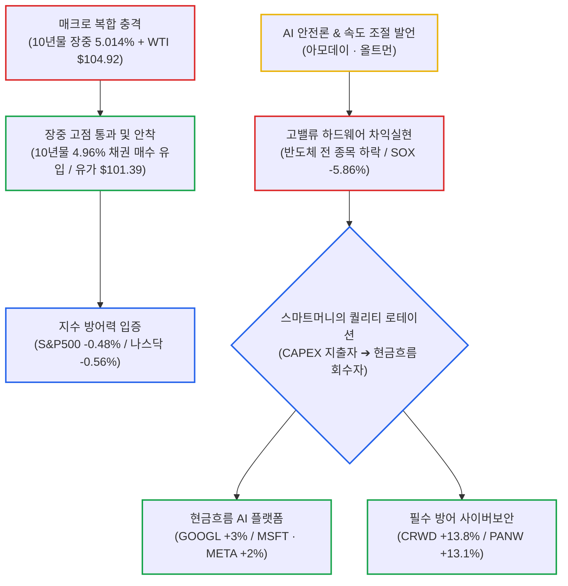

# 2026년 09월 15일(화) 하루치 뉴스정리

- **작성일**: 2026-09-15

어제 시장은 AI 버블 붕괴가 아니라 밸류체인 내부의 서열 재정립과 퀄리티 로테이션이었으며, 장기금리 5%와 유가 100달러 저항선에서 실제 매수세가 확인되며 지수 하방을 지탱했다.

## 요약

| 구분 | 주요 내용 |
| :--- | :--- |
| **핵심 진단** | 필라델피아 반도체 -5.86% 폭락 vs 알파벳 +3%, 보안주 +13%: '시장 탈출'이 아닌 'AI 밸류체인 내부 서열 재정립 및 퀄리티 로테이션' |
| **거시 팩트** | 미 10년물 장중 5.014% 터치 후 4.96%로 하락(실제 채권 매수세 유입), WTI $104.92 고점 찍고 $101.39 마감 |
| **CAPEX 팩트** | 아모데이·올트먼의 발언은 모델 안전검증 강화일 뿐, 빅테크의 데이터센터 계약이나 GPU 주문 취소·CAPEX 삭감 증거 전무 |
| **착시 교정** | 반도체 급락이 AI 버블 붕괴를 뜻하지 않음. AI 안전규제 강화는 자본력 있는 기존 선두 빅테크의 진입장벽 강화 요인 |
| **스마트머니 돈길** | 1위 실질 현금흐름 창출 빅테크(GOOGL, MSFT, META) ➔ 2위 필수 사이버보안(CRWD, PANW) ➔ 3위 가격결정력 보유 인프라 |
| **계좌 행동 지침** | 반도체 하루 하락에 투매 금지 및 무차별 물타기 지양, 10년물 5% 저항선 및 WTI 100달러 지지 여부 확인, FOMC 전 현금 보존 |

---

## 결론부터: AI 붕괴장이 아니라 밸류체인 내부 서열 재정립과 10년물 5% 테스트다

**어제는 AI 붕괴장이 아니라 “AI 밸류체인 내부의 서열 재정립 + 10년물 5% 테스트”였다.**

S&P500 -0.48%, 나스닥 -0.56%밖에 안 빠졌는데 필라델피아 반도체지수는 **-5.86%**였다. 반도체 30개 종목이 전부 하락했다. 반면 알파벳은 3% 이상, 마이크로소프트·메타는 약 2% 상승했고 사이버보안주는 폭등했다. 이건 전형적인 **시장 전체 탈출이 아니라 자금 이동**이다. 

더 중요한 건 미국 10년물이 장중 **5.014%**까지 올라갔다가 실제 채권 매수세가 들어오면서 **4.96%**로 내려왔다는 것이다. WTI도 장중 104.92달러까지 튀었다가 **101.39달러**로 마감했다. 주식을 죽일 수 있었던 두 가지 변수, **장기금리와 유가가 장중 고점에서 동시에 진정**됐다. 그래서 지수가 살아났다.

---

## 1. 기사 속 팩트만 까보면

### ① 진짜 위험은 AI 발언보다 아직도 금리 + 유가

시장은 이번 FOMC에서 25bp 인상 확률을 약 **92~95%**까지 반영했다. 10년물은 5%, 30년물은 5.3%를 넘어섰다.

이 상태에서 WTI가 100달러를 넘는다.

이 조합은 간단하다.

> **유가 상승 → 인플레이션 기대 상승 → Fed 긴축 장기화 → 장기금리 상승 → 성장주 멀티플 압박**

AI CEO들이 입을 열어서 반도체가 빠진 건 맞다. 하지만 **시장을 시스템적으로 부술 수 있는 변수는 AI 안전론이 아니라 금리다.**

특히 10년물이 5%에서 매수자를 찾은 건 상당히 중요하다. 어제 시장에서 가장 좋은 뉴스는 트럼프 발언도 아니고 크레이머 해석도 아니다.

**“5%에서는 미국채를 사겠다는 실제 돈이 나타났다.”**

이게 확인됐다.

---

### ② AI 속도 조절 = AI CAPEX 중단은 아니다

여기서 시장이 가장 과하게 반응했다.

아모데이·올트먼 등이 말한 내용은 대체로

> **AI 개발 중단**이 아니라, **프런티어 모델의 지나친 가속을 조절하고 안전검증을 강화하자** 쪽이다.

올트먼도 명시적으로 개발 중단을 의미하지 않는다고 말했다. 앤트로픽 역시 자료상 막대한 컴퓨팅 계약을 체결하고 있으며 IPO와 수익성 개선을 추진하고 있다. 기사에 인용된 계약 규모 등은 제공된 뉴스 자료 기준이며 여기서는 별도 독립 검증하지 않았다. 

즉,

> “AI가 위험하다 → 모델 개발 속도 조절 → 데이터센터 투자 전면 중단”

은 아직 논리적으로 너무 멀리 갔다.

현재 확인된 건 **발언**이다.

아직 확인되지 않은 건 **CAPEX 삭감**이다.

실제 Microsoft, Meta, Google, Oracle, OpenAI, Anthropic 등이 데이터센터 계약이나 GPU 주문을 취소했다는 증거가 나오기 전까지는 **AI CAPEX 붕괴라고 부르면 안 된다.**

---

### ③ 하지만 AI 인프라주가 전부 안전하다는 뜻도 아니다

여기서는 낙관론도 과장하면 안 된다.

번스타인의 CoreWeave 지적은 꽤 중요하다.

AI 훈련 속도가 정말 둔화될 경우 가장 먼저 문제가 생길 곳은

> **아직 고객이 확정되지 않은 외곽 데이터센터 + 레버리지가 높은 네오클라우드 + 선투자 CAPEX 사업자**다.

그래서 시장이 앞으로 AI 인프라를 이렇게 나눌 가능성이 크다.

| 상대적으로 강함 | 상대적으로 취약 |
| :--- | :--- |
| NVDA 등 생태계 지배력 보유 기업 | 레버리지 높은 네오클라우드 |
| MSFT · GOOGL · META | 미판매 데이터센터 용량이 많은 업체 |
| 계약물량이 확보된 사업자 | 수요 전망만 믿고 CAPEX부터 집행한 업체 |
| 가격결정력이 있는 업체 | 밸류에이션이 미래 성장을 과도하게 선반영한 업체 |
| 실제 FCF 창출 기업 | 2028~30년 실적을 당겨 가격에 반영한 업체 |

그래서 **IREN과 CoreWeave가 같은 데이터센터주라고 동일하게 보면 안 된다.**

JPMorgan이 IREN을 두 단계 상향한 이유 역시 네오클라우드라는 이름 때문이 아니다. 기사 기준 계약단가가 W당 **10~15달러 → 15~20달러 이상**으로 올라가고 있다는 **가격결정력** 때문이다. 

---

## 2. 대중이 지금 잘못 보고 있는 3대 착시

### 착시 ① “반도체 -6% → AI 버블 터졌다”

아니다.

정말 AI 구조가 무너졌다면 알파벳 +3%, MSFT·META +2%, 사이버보안 +13%, ServiceNow +6% 같은 현상이 동시에 나오기 어렵다.

시장이 말한 건 이것이다.

> **AI를 버리겠다 X** 
> **AI 안에서 비싼 놈·취약한 놈을 가려내겠다 O**

반도체가 그동안 가장 많이 올랐고 AI CAPEX 증가율에 가장 민감했기 때문에 충격도 가장 크게 받은 것이다.

---

### 착시 ② “AI 안전규제가 생기면 AI 기업 악재”

반드시 그렇지 않다.

이 부분은 마이클 버리의 지적도 일리가 있다.

안전성 테스트, 규제, 인증, 감사체계가 강화되면 돈 없는 신규 경쟁업체는 버티기 힘들어진다.

규제비용이 커질수록

**OpenAI / Anthropic / Google / Microsoft**

같은 자본력 있는 선두업체가 오히려 유리해질 수도 있다.

즉 AI 규제는

> **AI 산업 전체의 악재이면서 동시에 기존 선두업체의 진입장벽 강화**가 될 수 있다.

이건 아직 어느 방향으로 갈지 확정되지 않았다.

---

### 착시 ③ “Fed가 금리를 올리면 주식시장에 좋다”

이 주장도 절반만 맞는다.

기사에 나온 월가 논리는 이해된다.

Fed가 25bp를 올려서 인플레이션 기대를 잡고,

**10년물 5.0% → 4.7~4.8%**

식으로 장기금리가 떨어진다면 주식에는 오히려 좋을 수 있다.

그런데

**Fed +25bp → 유가 계속 100달러 이상 → 10년물 5.2%**

가 되면?

그건 그냥 악재다.

따라서 중요한 건 이번 주 **기준금리 인상 자체가 아니다.**

#### 시장이 볼 것은 딱 두 개다: 10년물 금리와 유가

Fed가 인상한 뒤에도 이 둘이 떨어지면 시장은 랠리할 수 있다.

반대로 둘이 계속 오르면 Fed의 인상은 호재가 아니다.

---

## 3. 스마트머니가 실제로 움직인 곳 (Quality Rotation)

어제 시장에서 가장 의미 있는 움직임은 **Quality Rotation**이다.

### ① 채권: 10년물 5%에서 실제 매수세 유입

10년물 5%에서 실제 매수세가 유입됐다.

이건 상당히 중요한 첫 신호다.

다만 **5%가 완벽한 천장이라고 단정할 단계는 아니다.**

다시 5%를 돌파하고 그 위에서도 채권 수요가 들어오지 않는다면 이야기가 달라진다.

---

### ② AI에서는 인프라보다 플랫폼

| 구분 | 대표 종목 | 주가 등락 | 시장의 자금 이동 논리 |
| :--- | :--- | :---: | :--- |
| **현금흐름 AI 플랫폼** | GOOGL, MSFT, META | **+2% ~ +3%대** | CAPEX를 통제하고 AI에서 실제 현금흐름을 만드는 기업 |
| **사이버보안** | CRWD, PANW | **+13%대 폭등** | AI 위험성 및 규제 강화에 따른 필수 지출 수혜 |
| **반도체 공급망** | AMD, MU, AVGO, INTC, ASML, ARM, SK하이닉스 | **-5% ~ -9.7%** | 가장 많이 올랐고 CAPEX 증가율에 민감한 영역 차익실현 |

- 알파벳 **+3%대**
- MSFT **+2% 안팎**
- Meta **+2% 안팎**

반대로

- AMD · MU · AVGO · INTC 약 **-5%**
- ASML **-7.25%**
- ARM **-9.74%**
- SK하이닉스 ADR **-7.6%**

이 차이가 중요하다.

시장은 순간적으로

> **CAPEX를 받는 기업 → CAPEX를 통제하고 AI에서 실제 현금흐름을 만드는 기업**

으로 자금을 옮겼다.

---

### ③ 또 하나는 사이버보안

- CRWD **+13.85%**
- PANW **+13.09%**

논리는 명확하다.

AI 발전 속도가 빨라질수록 사이버 공격이 늘어난다.

AI를 안전하게 만들겠다고 규제를 강화해도 사이버보안 투자는 늘어난다.

즉,

> **AI 가속 → 보안 수요 증가** 
> **AI 위험성 부각 → 보안 수요 증가**

양쪽에서 수혜 논리가 만들어진다.

다만 하루 +13% 오른 가격을 그대로 추격하는 것과 장기 구조가 좋은 것은 전혀 다른 문제다.

---

## 4. 내가 이번 뉴스에서 제일 중요하게 보는 변화 (AI Trade 1.0 ➔ 2.0)

**AI Trade 1.0이 끝나고 AI Trade 2.0으로 넘어가는 조짐이다.**

지금까지는 대충 이랬다.

> “AI 들어가면 다 산다.”

GPU, HBM, 광통신, 냉각, 전력, 변압기, 가스터빈, 데이터센터, 네오클라우드 전부 올랐다.

이제 시장이 묻기 시작한다.

> “그래서 그 돈 누가 실제로 회수하는데?”

이 질문이 나오면 GEV 같은 종목에서 문제가 발생한다.

GE Vernova가 AI 전력수요의 수혜를 보는 건 맞다.

**이 부분은 부정할 이유가 없다.**

하지만 GLJ가 지적한 것처럼 2027년 EV/EBITDA가 26배인데 예상 EBITDA 자체가 과대평가돼 있다면,

> **좋은 회사 ≠ 좋은 주식**

이 된다.

앞으로 AI주에서 가장 위험한 것은 사업이 나쁜 회사가 아니다.

### 좋은 사업인데 가격이 미친 회사다.

---

## 5. 지금 계좌에서 어떻게 움직일 것인가 (실전 6대 대응 원칙)

내 기준이라면 이렇게 한다.

1. **AI 반도체를 이번 하루 하락만 보고 투매하지 않는다.** 실제 hyperscaler CAPEX 삭감이나 GPU·HBM 주문 취소가 확인되지 않았다.
2. 그렇다고 **-5~-10% 빠졌다는 이유만으로 무차별 물타기도 하지 않는다.** 이번 사건은 시장이 밸류에이션을 다시 따질 명분을 만들어줬다.
3. AI에서는 **NVDA·MSFT·GOOGL 같은 생태계 지배력/현금흐름 기업**과 레버리지 높은 데이터센터·네오클라우드를 분리해서 본다.
4. 앞으로 가장 중요하게 볼 숫자는 **10년물 5%**다.
    - 5% 부근에서 계속 막힘 → 성장주 숨통
    - 5.1~5.2% 안착 → 성장주 추가 디레이팅 위험
5. WTI 역시 **100달러**가 핵심이다. 사우디 송유관 문제가 5~7일 이상의 재고 완충기간을 넘어가면 유가는 다시 튈 수 있다. 지금은 해결된 게 아니라 **트럼프 발언으로 잠시 눌린 것**에 가깝다.
6. FOMC 직전에는 현금을 전부 쓰지 않는다. 이미 금리인상 자체는 상당 부분 반영됐다. **진짜 매매 신호는 금리 결정 이후 채권시장의 반응**이다.

---

## 6. 최종 판정 및 핵심 실행 원칙

현재 뉴스만 놓고 보면 시장이 **AI 장기 성장 논리를 버렸다고 판단할 근거는 없다.**

오히려 정확한 해석은 이것이다.

> **AI CAPEX 붕괴가 아니라 AI CAPEX의 질을 따지는 시장으로 바뀌고 있다.**

그리고 어제 하루만 보면 시장의 진짜 경고는 AI가 아니다.

**WTI 100달러 + 10년물 5% + Fed 금리인상**이다.

그런데도 S&P500이 -0.48%, 나스닥이 -0.56%에서 버텼고 10년물 5%에서 채권 매수자가 나타났다.

그래서 지금 당장 **“AI 끝났다, 성장주 탈출”**이라고 결론 내리는 건 과하다.

반대로 **“어차피 AI는 간다, 아무거나 사자”**도 이제 위험하다.

### 앞으로 돈 되는 순서는 이렇게 본다

| 자본 배분 서열 | 분류 | 대표 성격 | 실전 계좌 대응 원칙 |
| :---: | :--- | :--- | :--- |
| **1순위** | **현금흐름 있는 AI 플랫폼** | GOOGL, MSFT, META | 자체 FCF로 CAPEX 통제. 조정 시 가장 안전한 코어 바스켓 |
| **2순위** | **독점적 반도체 / 인프라** | NVDA 등 생태계 지배자 | 하루 하락에 투매 금지. 밸류에이션 재조정 및 지지선 확인 후 접근 |
| **3순위** | **계약이 확정된 공급자** | IREN 등 가격결정력 보유 | 단순 테마가 아닌 확정 계약단가(W당 $15~20) 상승 검증 필수 |
| **주의** | **고밸류 인프라** | GEV 등 미래 실적 선반영 | 사업이 좋아도 2027~30년 실적을 당겨 반영한 과도한 멀티플 경계 |
| **회피** | **투기적 네오클라우드** | 미확정 CAPEX · 고레버리지 | 고객 미확정 외곽 데이터센터, 5% 금리 환경에서 유동성 리스크 취약 |

이번 하락이 보여준 건 AI의 종말이 아니라 **AI 투자 안에서도 쓰레기와 진짜를 구분하는 장이 시작됐다는 것**이다.

!!! tip "최종 핵심 제언 (Executive Takeaway)"
    **AI의 종말이 아니라, AI 안에서 쓰레기와 진짜를 발라내는 서열 재정립이 시작됐다.**
    반도체 지수가 -6% 빠졌다고 계좌를 내던지는 건 하수고, -10% 빠졌다고 무차별 물타기하는 것도 미련한 짓이다.
    시장의 진짜 경고는 AI 발언이 아니라 **'WTI 100달러 + 10년물 5% + Fed 긴축'**이다.
    10년물 5%에서 유입된 실제 채권 매수세를 확인하되, FOMC 전까지 현금을 아끼고 현금흐름이 찍히는 1등 기업에 집중하라.
