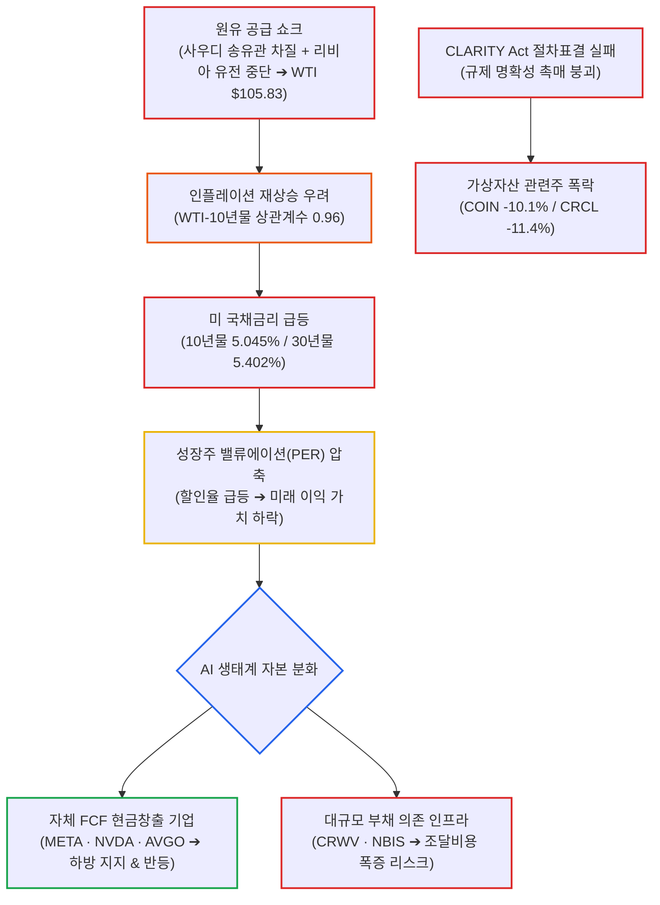

# 2026년 09월 16일(수) 하루치 뉴스정리

- **작성일**: 2026-09-16

지금 시장의 진짜 문제는 AI가 아니라 유가와 금리가 동시에 증시의 목을 조르고 있다는 점이며, 유가발 인플레이션 충격 속에서도 반도체와 현금창출 우량 AI주는 버텨내며 차별화 장세를 준비하고 있다.

## 요약

| 구분 | 주요 내용 |
| :--- | :--- |
| **핵심 진단** | 시장의 진짜 문제는 AI가 아니라 유가(WTI $105.83)와 국채금리(10년물 5.045%). 증시는 무너진 게 아니라 '버티는 중' |
| **거시 팩트** | WTI 4.38% 급등($105.83), 10년물 장중 5.045%, 20년물 입찰 부진(5.420%). WTI-10년물 상관계수 0.96의 질 나쁜 인플레이션 |
| **AI 펀더멘털** | 필라델피아 반도체 +0.4% 반등. 브로드컴 FY27~28 성장 전망 유지, 메타 MTIA 협력, ASML 캐파 증설로 AI Capex 붕괴론 반박 |
| **자금 차별화** | 돈값이 비싸지며 현금창출 기업(META, NVDA, AVGO) vs 대규모 차입형 인프라(CRWV, NBIS) 간 냉혹한 양극화 진행 |
| **위험 영역** | CLARITY Act 절차표결 실패(49 vs 50)로 암호화폐주(COIN -10.1%, CRCL -11.4%) 실질적 정책 동력 상실 및 급락 |
| **계좌 행동 지침** | FOMC(한국시간 17일 새벽, 25bp 인상 92~95% 선반영) 직전 풀매수 금지, AI 감속보다 WTI 100달러 및 10년물 5% 지속 기간 주시 |

---

## 결론부터: AI가 문제가 아니라 유가와 금리가 목을 조르고 있다

지금 시장의 진짜 문제는 **AI가 아니다. 유가와 금리가 동시에 증시의 목을 조르고 있다는 것**이다.

WTI **105.83달러**, 브렌트 **108.75달러**, 미국 10년물은 장중 **5.045%**, 30년물은 **5.402%까지** 갔다. 그런데 이 충격에도 S&P500은 -0.45%, 나스닥은 -0.78%, VIX는 17.20에 불과했다. 시장이 무너진 게 아니라 **아직 버티고 있는 상태**다. 그래서 오히려 위험하다. 추가 충격이 오면 밸류에이션 압축이 본격화될 여지가 남아 있다.

반면 전날 박살 났던 필라델피아 반도체지수는 **+0.4% 반등**, 엔비디아·메타·마이크론은 강보합이었다. 이건 꽤 중요한 신호다.

**“AI 투자 사이클 끝났다”는 증거는 아직 없다.**
**“금리가 너무 높아져서 AI 주식을 아무 가격에나 살 수 없게 됐다”가 정확한 표현이다.**

---

## 1. 기사 속 팩트 폭행

### ① 지금 가장 무서운 건 유가다

이번 금리 상승을 단순히 미국 재정적자나 연준 신뢰성 문제로만 보면 절반만 보는 거다.

사우디 동서 송유관 차질에 이어 리비아까지 일부 유전 가동이 중단됐다. 그 결과 WTI가 하루 **+4.38%**, 105.83달러까지 올라왔다.

그리고 최근 한 달간 WTI와 미국 10년물 금리의 상관계수가 **0.96**이라는 분석까지 나왔다. 거의 같이 움직이고 있다는 뜻이다.

현재 시장의 연결고리는 이거다.

> **유가 상승 → 인플레이션 재상승 우려 → 연준 추가 인상 → 10년물 5% → 주식 PER 하락**

연준이 유가를 금리로 때려잡을 수도 없다. 공급 쇼크이기 때문이다.

그래서 시장 입장에서는 질이 안 좋은 인플레이션이다.

---

### ② 10년물 5%는 그냥 숫자 하나가 아니다

10년물은 장중 **5.045%**, 2007년 이후 최고 수준.

20년물 국채 입찰도 좋지 않았다. 낙찰금리 **5.420%**, 시장 예상보다 2bp 높게 결정됐다. 장기채를 사려면 투자자들이 더 높은 수익률을 요구하고 있다는 얘기다.

성장주 입장에서는 여기서부터 계산이 달라진다.

미래 이익 100원을 4%로 할인하던 시장과 5~6%로 할인하는 시장은 같은 기업에 같은 PER을 줄 수 없다.

**실적이 좋아도 주가는 못 오를 수 있다.**

이게 지금 AVGO, MSFT, AMZN, GOOGL 등에 나타나는 현상이다.

---

## 2. 대중의 눈먼 착시 vs 실제 팩트

### 착시 ① “AI 감속론 = AI Capex 붕괴”

현재로서는 과장이다. 기사 안에 오히려 반대 증거가 많다.

* **브로드컴 CEO 혹 탄**: FY27~FY28 반도체 성장 전망을 낮추지 않겠다고 발언
* **Meta**: 2027년부터 MTIA 자체 AI칩 도입 확대 계획
* **협업 체계**: Meta는 **Broadcom과 칩 설계 협업**, TSMC 생산
* **전력 용량**: 향후 12개월 **1GW 이상 MTIA 도입** 계획
* **ASML**: 2027~2028년 EUV 생산능력 각각 약 30% 확대 계획
* **미즈호 증권**: AI 연구소·클라우드 기업의 실제 인프라 투자 축소 신호는 아직 없다고 평가

| 시장의 공포와 착시 | 데이터가 증명하는 실제 팩트 |
| :--- | :--- |
| **"AI 안전성 우려로 Capex가 취소될 것이다"** | 프런티어 모델 안전검증 논의일 뿐, 하이퍼스케일러 인프라 투자 축소 신호 전무 |
| **"반도체 성장 사이클이 조기 종료됐다"** | 브로드컴 FY27~28 성장 전망 유지, ASML 2027~28년 EUV 생산능력 30% 증설 |
| **"자체 ASIC 개발로 칩 생태계가 붕괴한다"** | Meta는 Broadcom과 설계 협력하고 TSMC에서 생산하는 기존 파트너십 강화 |

그러니까 현재 확인된 것은

> **AI CEO들이 안전 문제를 말했다 → 주가가 먼저 무너졌다**

이지,

> **AI CEO들이 Capex를 취소했다**

가 아니다. 둘은 완전히 다른 얘기다.

---

### 착시 ② 그렇다고 AI 인프라주를 전부 줍는 것도 틀렸다

여기서는 반대로 낙관론도 조심해야 한다.

AI 산업의 진짜 약점이 기사에 하나 보인다.

**돈값이 비싸지고 있다.**

AI 인프라 기업들이 앞으로 채권 발행을 크게 늘릴 가능성이 있고, 신규 AI 관련 채권은 더 높은 금리를 지급해야 할 가능성이 제기됐다.

이게 중요하다. 같은 AI주라도 앞으로 시장은 이렇게 갈라놓을 가능성이 높다.

| 구분 | 대표 기업 | 비즈니스 특성 및 5% 금리 내구도 |
| :--- | :--- | :--- |
| **현금창출 AI 기업** | **META, NVDA, AVGO** | 자체 FCF로 Capex를 충당하며 고금리 환경에서도 재무적 하방 지지력 확보 |
| **대규모 차입 AI 인프라** | **CRWV, NBIS 등** | 외부 채권 발행과 부채 조달 의존. 금리 급등 시 이자 비용 폭증 및 밸류 압박 |

AI 수요가 살아 있더라도 자금조달비용 때문에 후자는 훨씬 더 크게 흔들릴 수 있다.

---

## 3. 브로드컴(AVGO)은 오히려 이번 뉴스에서 논리가 강화됐다

사용자 입장에서 이 부분은 꽤 중요하다.

브로드컴은 이날 약 2% 하락했지만, 뉴스 흐름만 놓고 보면 **사업 펀더멘털 악화 근거가 거의 없다.**

오히려 이번 자료에는 4대 핵심 축이 동시에 들어왔다:

- **① Meta**: MTIA 자체 AI ASIC 확대 및 Broadcom과 설계 협력
- **② Anthropic**: 2027년 Broadcom 커스텀 반도체 최대 고객이 될 가능성 언급
- **③ 추론 시장**: 혹 탄 CEO가 inference 수요 강세를 직접 강조
- **④ 가이던스**: FY27·FY28 반도체 성장전망 하향 없음

그래서 AVGO 하락을

> “AI 수요가 무너져서 브로드컴이 떨어진다”

라고 해석하면 현재 자료 기준으로는 틀렸다.

좀 더 정확하게 보면

> **AI 기대치가 높았던 주식이 5% 국채금리 환경에서 밸류에이션 압박을 받고 있다.**

이다.

다만 이건 단기적으로 훨씬 골치 아픈 문제일 수도 있다. 펀더멘털이 좋아도 금리가 5.3%, 5.5% 올라가면 주가는 계속 눌릴 수 있기 때문이다.

---

## 4. 반도체가 오늘 의외로 버틴 이유

이 부분을 놓치면 안 된다.

전날 AI 감속론 때문에 필라델피아 반도체지수가 거의 **-6%** 맞았다.

그런데 다음 날:

* **SOX +0.4%**
* **NVDA 강보합**
* **MU 강보합**
* **META 강보합**

이다.

10년물 5%, WTI 106달러라는 환경에서도 추가 투매가 안 나왔다.

이건 최소한

**“AI 감속론 때문에 기관들이 AI 반도체를 구조적으로 버리고 있다”는 신호는 아니다.**

다만 하루 반등을 스마트머니 매집의 확정 증거라고 말할 수도 없다. 여기까지는 **가격 행동에 대한 해석**이다.

---

## 5. Smart Money가 실제로 보는 곳

'스마트머니가 몰래 매집 중'이라고 단정할 만한 수급 데이터는 이번 자료에 없다. 그런 식으로 소설 쓰면 안 된다.

다만 **시장이 상대적으로 돈을 남겨놓은 곳**은 보인다.

### ① 에너지

- **S&P500 에너지 섹터 +2.26%**: 지금 가장 명확한 실적 모멘텀이 붙는 곳이다.
- **주의점**: WTI 106달러에서 뒤늦게 추격매수하는 것도 위험하다. 공급 정상화 뉴스 한 줄이면 원유가 크게 밀릴 수 있다.

---

### ② 현금창출력이 강한 AI

이번 장에서 상대적으로 버틴 건 NVDA·META·MU였다.

특히 META는:

* 자체 ASIC
* AI 모델
* 플랫폼 이용자 기반
* AI API/에이전트

를 동시에 갖고 있다는 평가가 나온다.

앞으로 시장이 AI주를 다 같이 사는 장이 아니라

> **“누가 AI로 실제 돈을 벌 수 있느냐”를 골라내는 장**

으로 바뀔 가능성이 높다.

---

### ③ 사이버보안

여기는 구조적 논리가 꽤 재미있다.

- **AI 개발 가속 시**: 새로운 공격 표면 증가로 보안 수요 폭증
- **AI 개발 감속 시**: 이미 배포된 모델 및 인프라 방어를 위해 보안 수요 증가

그래서 CRWD·PANW가 AI 감속론 당일 **13% 이상 급등**했다.

다만 하루 13% 오른 종목을 뒤늦게 따라붙는 것과 산업 논리가 좋은 것은 전혀 다른 문제다.

---

## 6. 암호화폐는 얘기가 다르다: 실제 정책 촉매가 꺾인 영역

여기는 단순 금리 조정이라고 치부하면 안 된다.

CLARITY Act 절차표결이 **49대 50**, 필요한 60표 확보에 실패했다.

**시장 결과:**

* **COIN -10.10%**
* **CRCL -11.41%**
* **GLXY -7.64%**
* **GEMI -9.46%**
* **BTC 7.5만 달러선 위협**

여기는 **실제 정책 촉매가 꺾였다.**

AI주와 다르다. AI는 수요 감소가 아직 확인되지 않았지만, 암호화폐는 규제 명확성이라는 기대가 실제 의회 표결에서 후퇴했다.

그래서 단순히

> **“많이 빠졌으니 반등하겠지”**

라고 접근하기 가장 위험한 영역이 현재 crypto 관련주다.

---

## 7. 댄 나일스의 10% 조정론은 절반만 맞다: 통계와 본질

계절성:

* 9월 약세
* 중간선거 전 조정
* 고금리

이건 전부 참고할 만하다.

하지만

> “중간선거 해에는 과거 평균 10% 떨어졌으니 이번에도 10%”

는 투자 논리가 아니다. 통계다.

오히려 지금 훨씬 중요한 것은

> **WTI 106달러 → 10년물 금리 5% → Fed 긴축 경로 → 기업 EPS와 주식 PER**

이다.

웰스파고가 5~10% 조정 가능성을 보는 이유도 이쪽이 더 설득력이 있다.

반대로 UBS는 과거 첫 금리 인상 후 1년간 S&P500 평균 상승률이 +10.8%였다는 자료를 제시한다. 둘 다 틀린 게 아니다.

**금리 인상의 ‘이유’가 중요하다.**

경제성장이 강해서 올리는 금리와, 유가발 인플레이션을 잡기 위해 올리는 금리는 주식시장에 똑같지 않다. 현재는 후자의 비중이 커지고 있다는 게 문제다.

---

## 8. 지금 계좌에서 해야 할 것 (FOMC 대비 실전 대응 원칙)

내가 지금이라면 **FOMC 직전 풀매수는 안 한다.**

이번 FOMC는 한국시간 기준 **9월 17일 새벽**이고, 시장은 25bp 인상을 약 **92~95%** 반영하고 있다.

### 시나리오별 시장 반응 및 계좌 대응

| 시나리오 | 시장 반응 가능성 | 대응 방침 |
| :--- | :--- | :--- |
| **+25bp + 추가 인상 강하게 시사** | 장기금리 추가 상승 (10년물 5.1~5.2% 돌파 시도) | 성장주 추격매수 전면 금지, 현금 비중 유지 |
| **+25bp + 향후 데이터 의존 강조** | 불확실성 해소로 안도 랠리 가능 | 실적·현금흐름 우량 AI 분할 접근 |
| **예상 밖 동결** | 처음엔 상승 가능하나 연준 신뢰성 논란 대두 | 초기 변동성 반응에 추격매수 금지 |

### 종목군별 실전 선별 기준

* **상대적으로 우선 관찰 (현금흐름 & 실수요)**:
    - **META, NVDA, AVGO, MU, ASML**
    - AI 수요 훼손 증거가 아직 부족하고 실제 주문·생산 확대 신호가 확인되기 때문이다.
* **더 보수적으로 봐야 할 곳 (고부채 & 유동성 취약)**:
    - **CRWV, NBIS 등 자본조달 의존도가 높은 AI 인프라**
    - 고PER이면서 잉여현금흐름(FCF)이 약한 성장주
    - 금리 5%대에서는 장밋빛 스토리보다 당장 찍히는 현금이 중요하다.
* **당장 반등만 보고 덤비기 위험한 곳 (정책 촉매 훼손)**:
    - **COIN, CRCL 등 가상자산 고베타주**
    - 규제 명확성이라는 핵심 정책 리스크가 실제로 현실화됐다.

---

## 9. 최종 판정 및 핵심 실행 원칙

지금 시장을 **“AI 버블 붕괴 시작”이라고** 해석하는 건 너무 빠르다.

현재 시장 데이터를 냉정하게 분류하면 이렇다.

| 영역 | 핵심 팩트 및 판정 |
| :--- | :--- |
| **확정된 사실** | WTI 105.83달러, 10년물 장중 5.045%, Fed 25bp 인상 기대 92~95%, 증시 조정, AI 인프라 변동성 확대, CLARITY Act 절차표결 실패 |
| **신뢰도 높은 추정** | 유가가 높은 상태를 유지하면 장기금리 압력이 지속된다. 금리 5%대에서는 성장주의 멀티플 확장이 어렵다. |
| **시장의 해석** | AI 안전 논쟁 ➔ AI Capex 둔화 가능성, 높은 금리 ➔ AI 투자 자금조달 부담 증가 |
| **현재 기준 과장된 주장** | “AI Capex 사이클이 끝났다”, “Broadcom AI 성장 스토리가 훼손됐다”, “반도체 수요가 구조적으로 꺾였다” |

아직 그런 증거는 없다.

오히려 **Meta-Broadcom ASIC, ASML 생산능력 증설, Nvidia·Meta·MU의 상대적 강세**를 보면 AI 실물 수요는 계속 살아 있다.

그래서 지금 시장의 핵심 질문은 하나다.

> **AI가 끝나느냐가 아니라, WTI 100달러 이상과 10년물 5% 이상이 얼마나 오래 지속되느냐.**

나는 당분간 **AI 뉴스보다 WTI와 미국 10년물을 먼저 볼 것**이다.
유가가 내려오면 금리가 숨을 쉬고, 금리가 숨을 쉬면 지금 얻어맞고 있는 우량 성장주가 가장 먼저 반응할 가능성이 높다.

!!! tip "최종 핵심 제언 (Executive Takeaway)"
    **AI의 붕괴가 아니라, WTI 105달러와 10년물 5%가 주식시장의 멱살을 잡고 있는 장세다.**
    AI 감속론은 안전 검증 논쟁일 뿐 실제 Capex 취소로 이어진 게 아니며, 브로드컴과 ASML의 공급 증설이 이를 증명한다.
    하지만 금리가 5%를 뚫고 올라간 이상 아무 가격에나 주식을 살 수는 없다.
    자체 FCF로 버티는 우량 빅테크(META, NVDA, AVGO)와 빚으로 연명하는 인프라주(CRWV, NBIS)를 철저히 갈라내라.
    FOMC 전까지 풀매수를 멈추고, 유가와 장기금리의 진정 여부를 계좌의 1순위 생명선으로 확인하라.
