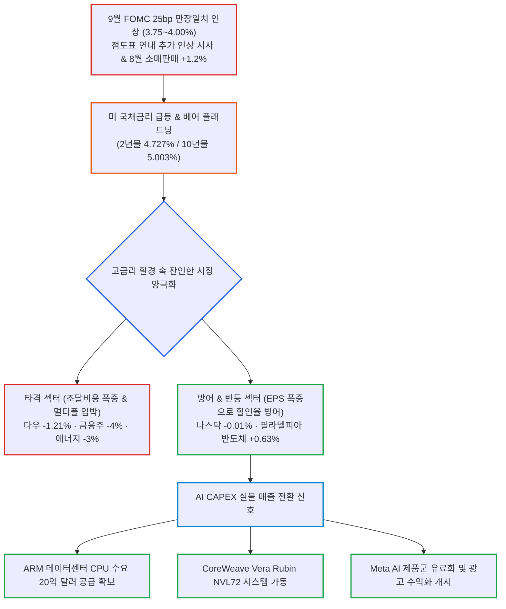

# 2026년 09월 17일(목) 하루치 뉴스정리

- **작성일**: 2026-09-17

연준의 25bp 만장일치 인상과 10년물 5% 재돌파라는 매크로 악재 속에서도 나스닥 보합과 반도체지수 상승이 증명하듯, 지금 시장은 무차별 폭락이 아니라 고금리를 이겨낼 실적 성장주와 그렇지 못한 주식을 잔인하게 갈라놓는 차별화 장세다.

## 요약

| 구분 | 주요 내용 |
| :--- | :--- |
| **핵심 진단** | 연준 25bp 만장일치 인상(3.75~4.00%) 및 점도표 연내 추가 인상 시사, 10년물 5.003% 도달. 증시는 무차별 하락이 아닌 잔인한 실적 양극화 진행 |
| **매크로 팩트** | 8월 소매판매 서프라이즈(+1.2%), WTI -3.21% 급락($102.43)은 공급 우려 완화일 뿐 수요 붕괴 아님, 10-2년 베어 플래트닝(27.6bp) |
| **시장 차별화** | 다우 -1.21%, 금융 -1.63%, 에너지 -3% 타격 vs 나스닥 -0.01% 방어, 필라델피아 반도체 +0.63% 상승으로 실적 성장주에 자금 집중 |
| **AI 펀더멘털** | ARM 데이터센터 CPU 수요 20억 달러 확인, CoreWeave Vera Rubin NVL72 가동, Meta One AI 유료 구독 개시 등 AI Capex 실물 매출화 |
| **개별 종목 경계** | 인텔(INTC) 14A 200달러 기대감 과장 경계, 테슬라(TSLA) 3Q 인도량 전망 하향(43.5만대) 본업 둔화 직시 |
| **계좌 행동 지침** | 지수 공포 투매 금지, 10년물 5% 장기화 대비 부채주 회피, 지표 우선순위(10년물 → 유가 → 2년물 → 달러 → AI 실적) 감시 |

---

## 결론부터: 고금리를 이길 실적주 vs 못 버티는 주식의 잔인한 분화

지금 시장을 **“연준이 금리를 올렸으니 성장주 끝났다”라고** 보면 틀린다.

진짜 핵심은 이거다.

- **① 연준은 확실히 매파로 돌아섰다.**
- **② 그런데도 나스닥은 -0.01%, 반도체는 +0.63%였다.**
- **③ 대신 다우 -1.21%, 금융 -1.63%, 에너지 -3%가 얻어맞았다.**

즉 지금은 **금리 상승 → 모든 주식 하락이** 아니라,

> **고금리를 이길 만큼 이익이 강한 기업과 그렇지 않은 기업을 시장이 잔인하게 갈라놓는 장이다.**

9월 FOMC에서 연준은 기준금리를 25bp 올려 3.75~4.00%로 만들었고, 점도표 제출자 18명 중 16명이 연내 추가 인상을 예상했다. 2년물은 4.727%, 10년물은 다시 **5.003%까지** 올라왔다.

그런데 이 환경에서도 필라델피아 반도체지수는 오히려 상승했다. 이게 오늘 시장에서 가장 중요한 정보다.

---

## 1. 기사 속 팩트 폭행

### ① 연준은 진짜로 방향을 틀었다

이번 인상은 단순히 “예상된 25bp”로 넘길 사안이 아니다.

더 중요한 건 **만장일치였다.**

워시 의장은 금융여건을 “제약적이라고 보기 어렵다”고 했고, 연준은 기존 완화의 일부를 제거했다고 표현했다. 점도표도 연내 한 차례 추가 인상을 가리킨다.

정리하면:

| 구분 | 시장의 당초 기대 | 현재 연준의 실제 메시지 |
| :--- | :--- | :--- |
| **통화 정책 경로** | 금리 인상 한 번 ➔ 유가 안정 ➔ 다시 동결 | 인플레이션 잡힐 때까지 필요하면 더 올린다 |
| **경기 여건 인식** | 고금리로 인한 소비 및 고용 둔화 기대 | 소비 여전히 견조, 완화 여건 일부 제거 필요 |

더구나 8월 미국 소매판매는 전월 대비 **+1.2%**, 자동차 제외는 **+1.4%로** 컨센서스를 크게 웃돌았다. 소비가 죽지 않았다.

연준 입장에서 금리를 급하게 내릴 이유가 더 줄었다.

---

## 2. 그런데 주식시장은 생각보다 안 무너졌다

여기가 핵심이다.

9월 16일 미국 주요 지수 등락 현황:

| 주요 지수 / 섹터 | 등락률 | 시장의 본질적 함의 |
| :--- | :---: | :--- |
| **다우존스 산업평균** | **-1.21%** | 전통 가치주·경기민감주·금융주 동반 타격 |
| **S&P 500** | **-0.45%** | 대형주 전반의 밸류에이션 부담 반영 |
| **나스닥 종합** | **-0.01%** | 10년물 5% 충격에도 사실상 보합 방어 |
| **필라델피아 반도체 (SOX)** | **+0.63%** | 매파 FOMC 환경 속에서도 홀로 상승 반등 |

이걸 그냥 “FOMC 때문에 미국 증시 하락”이라고 요약하면 절반밖에 못 본 거다.

오히려 이상한 건 **나스닥이 버텼다는 점이다.**

10년물이 5%인데 나스닥이 거의 보합이다.

이건 시장이 현재 AI·반도체 실적을 단순한 유동성 장세가 아니라 **실제 이익 성장으로** 보기 시작했다는 신호에 가깝다.

---

## 3. 대중의 눈먼 착시 ①: “금리 인상 = 기술주 폭락”

지금은 이 공식이 잘 안 먹힌다.

예전 장기금리 상승장에서 성장주가 무너진 이유는 간단했다:

> **미래에 벌 돈을 현재가치로 할인했더니 밸류에이션이 너무 비쌌기 때문이다.**

그런데 지금 AI 반도체 일부 기업은 상황이 다르다.

**미래의 막연한 성장 기대가 아니라 현재 실적 추정치가 계속 올라가는 기업들이 있다.**

그래서 할인율이 올라가도 EPS 상승이 그 충격을 받아내는 것이다.

이번에도 반도체지수는 **+0.63%를** 기록했고, 인텔은 SK하이닉스 관련 협력 기대 속에 약 4% 상승했다.

따라서 지금 시장은 **성장주 vs 가치주 싸움보다, 실적 있는 성장주 vs 실적 없는 주식 싸움에** 훨씬 가깝다.

---

## 4. 대중의 눈먼 착시 ②: “유가 3% 떨어졌으니 인플레이션 문제 끝났다”

이건 더 위험한 해석이다.

WTI는 이날 -3.21% 하락한 **102.43달러**, 브렌트는 **105.83달러까지** 내려왔다.

하지만 원인은 수요 붕괴가 아니다.

사우디가 오만을 경유해 우회 수출을 늘리고 동서 송유관 복구를 추진하면서 **공급 차질 우려가 완화된 것이다.**

| 구분 | 대중의 안이한 착시 | 데이터가 말해주는 냉혹한 실체 |
| :--- | :--- | :--- |
| **유가 하락 해석** | 유가 급락 ➔ 인플레이션 압력 종료 | 공급 쇼크 프리미엄 일부 제거에 불과 |
| **절대 가격 수준** | 유가 안정 국면 진입 | WTI 102달러는 여전히 절대적으로 높은 고유가 |

WTI 102달러 자체가 여전히 낮은 가격도 아니다.

---

## 5. 진짜 경고 신호는 10년물 5%다

오늘 뉴스 중에서 장기 투자자가 가장 무겁게 봐야 할 숫자는 사실 FOMC 25bp보다 **미국 10년물 5% 돌파다.**

문제는 금리가 5%를 찍었다는 사실 자체보다 **얼마나 오래 유지되느냐라고** 지적한다.

기존 2~3% 금리로 발행했던 회사채가 앞으로 6~8% 수준에서 재융자될 경우 현금흐름, 자산가격, 신용등급에 압박이 나타날 수 있다는 논리다.

이건 맞는 지적이다.

| 10년물 5% 지속 기간 | 시장과 기업에 미치는 실질 충격 |
| :--- | :--- |
| **5% 하루** | 일시적 심리 충격에 불과, 별일 아닐 수 있다 |
| **5% 몇 주** | 멀티플(PER) 압축 및 밸류에이션 하향 압박 |
| **5% 수개월** | 기업 재융자(Refinancing), 부동산, 사모신용, 고레버리지 기업에 심각한 내상 |

그래서 진짜 위험은 **금리 5% 돌파가** 아니라, **금리 5% 고착화다.**

---

## 6. 금융주는 왜 금리 올랐는데 떨어졌나

초보 투자자가 가장 많이 착각하는 부분이다:

> **“금리 오르면 은행 좋은 거 아니야?”**

반만 맞다.

이번에는 2년물이 크게 오르면서 수익률곡선이 **베어 플래트닝(Bear Flattening)됐다.**

10년-2년 스프레드는 33.3bp에서 27.6bp로 축소됐다.

그래서 금융주에는 5중 악재가 한꺼번에 들어온다:

- **단기 조달비용 상승**
- **장단기 스프레드 축소 (예대마진 훼손)**
- **보유 채권 평가손실 부담**
- **경기 둔화 우려**
- **자본시장(IB·딜메이킹) 활동 부진**

결과:

- **골드만삭스(GS)**: 약 **-4%**
- **아메리칸익스프레스(AXP)**: 약 **-4%**
- **JP모건(JPM)·모건스탠리(MS)**: **-1%대**

**“금리 상승 = 은행 호재”라는** 단순 공식으로 보면 안 된다.

---

## 7. 고수들의 진짜 돈길: AI 내부에서도 돈이 어디로 움직이는지 봐라

이번 뉴스들을 묶어보면 AI 투자 논리가 상당히 분명하다.

### ARM: 데이터센터 CPU 수요 폭증과 공급 확보

ARM은 데이터센터용 자체 CPU 사업에서 공급망 확보 자신감을 크게 높였다.

당초 10억 달러 매출을 예상했다가 수요가 20억 달러 규모로 확인됐고, CEO가 현재 공급 확보 가능성에 대해 이전보다 훨씬 강한 자신감을 표시했다.

이건 단순 AI 기대주 뉴스가 아니다.

> **수요 확인 ➔ 공급능력 확보 ➔ 실제 매출 전환**

으로 넘어가는 뉴스다. 이런 뉴스의 질이 훨씬 높다.

---

### CoreWeave: 차세대 NVL72 클러스터 상용 가동

CoreWeave는 Vera Rubin NVL72 멀티랙 시스템 가동을 시작했고, 자료상 첫 AI 클라우드 제공업체로 언급된다.

이것도 마찬가지다.

AI 이야기가 **‘모델 성능’**에서 **‘실제 GPU 설치 ➔ 클러스터 가동 ➔ 클라우드 서비스 판매’**로 이동하고 있다.

---

### Meta: 비용 먹는 하마에서 직접 유료화 수익 모델로

메타도 중요한 변화가 있다. AI가 이제 비용만 먹는 사업이 아니라 **직접 수익화 단계로** 내려오고 있다.

Meta One은 개인용 번들 월 7.99달러, 크리에이터·비즈니스 상품은 14.99달러부터 시작하고, 최대 499달러 상품까지 제시됐다.

여기에 씨티는 Meta의 AI 제품·광고·Reels 수익화 개선이 기존 AI 투자지출을 실제 수익으로 연결하는 단계라고 평가했다.

이건 매우 중요하다.

AI 사이클이 **‘GPU 구매 ➔ 데이터센터 구축 ➔ 모델 개발’**에서 끝나는 게 아니라, **‘AI 서비스 ➔ 구독·광고 ➔ 실제 매출’**로 내려가기 시작하고 있다는 이야기다.

AI 투자 사이클이 끝나는 신호와 정반대다.

---

## 8. 그래서 반도체가 강한 이유

이번 장에서 반도체가 버티는 건 우연이 아니다.

시장이 보는 건 단순히 “AI는 미래 산업” 같은 막연한 이야기가 아니다.

지금 숫자로 확인되는 실물 데이터들:

- **AI 데이터센터 건설 지속**
- **Rubin 시스템 실제 가동**
- **ARM 서버 CPU 수요 2배 폭증 (20억 달러)**
- **Meta AI 직접 유료화 및 수익화 개시**
- **OpenAI 대규모 자금조달 논의**
- **Intel 파운드리·AI CPU 기대**
- **SK하이닉스 미국 생산 검토**

**AI CAPEX가 아직 꺾였다고 볼 증거가 없다.** 오히려 공급망과 생산능력 경쟁으로 넘어가고 있다.

---

## 9. 다만 Intel은 흥분하면 안 된다

인텔은 지금 시장에서 가장 좋은 스토리 중 하나지만 동시에 **가장 과장되기 쉬운 스토리이기도** 하다.

멜리우스는 인텔 14A가 2028년부터 애플·테슬라·대형 클라우드 물량을 대량 생산하고 CPU EPS까지 성장한다는 전제로 200달러 가능성을 언급했다.

이건 확정 실적이 아니다. 조건이 엄청 붙어 있다:

> **14A 공정 성공 + 대형 고객 수주 + 양산 체제 + 수율 확보 + AI CPU 성장**

이 전부가 맞아야 성립하는 시나리오다.

따라서 냉정하게 분류하면:

| 영역 | 내용 및 현실적 판정 |
| :--- | :--- |
| **확정 사실** | 인텔 주가 상승, 여러 협력 논의와 시장 기대감 실존 |
| **신뢰도 높은 추정** | 미국 반도체 제조 정책(CHIPS Act 등)의 실질적 수혜 가능성 |
| **시장 해석** | 인텔 파운드리 사업부의 턴어라운드 기대감 |
| **과장될 수 있는 주장** | 2년 내 200달러 도달 시나리오 (5대 전제조건 동시 충족 필요) |

---

## 10. 테슬라는 반대로 냉정하게 봐야 한다

테슬라는 이번 자료에서 자동차 본업이 좋지 않다.

골드만삭스는 3분기 인도량 전망을 **49만대에서 43.5만대로** 낮췄다.

월가 컨센서스 45.6만대보다도 낮다. 4분기도 51.5만대에서 47.5만대로 하향했다.

따라서 테슬라 주가를 볼 때 AI, 로봇, 자율주행, Terafab만 보고 자동차 둔화를 무시하면 안 된다. 이건 명백히 본업 쪽의 부정적 데이터다.

다만 반대로 차량 인도만 보고 AI·자율주행 옵션 가치를 0으로 취급하는 것도 똑같이 틀린 접근이다.

---

## 11. AI 데이터센터 규제 뉴스도 착각하면 안 된다

미 하원이 AI 데이터센터가 필요한 발전·송전 인프라 비용을 소비자가 아니라 데이터센터 사업자가 부담하도록 하는 방향의 법안을 통과시켰다.

이걸 “미국이 AI 데이터센터를 규제한다 → AI 끝”이라고 해석하면 지나친 비약이다.

본질은 데이터센터 건설 자체를 막는 게 아니라, **AI 전력수요 때문에 일반 소비자 전기요금이 올라가는 문제를 누가 부담할 것인가이다.**

다만 이것도 완전한 호재는 아니다. 빅테크 입장에서는 데이터센터당 총투자비(TCO)가 증가할 수 있다.

앞으로 AI CAPEX에서 **GPU 가격보다 전력 인프라 비용이 중요해질 가능성이** 점점 커진다는 뜻이다.

---

## 12. 지금 시장의 진짜 약점: 가장 위험한 매크로 조합

지금 당장 “AI 버블 붕괴”가 제일 무서운 게 아니다.

다음 조합이 현실화될 때를 가장 위험하게 본다:

> **유가 재상승 + 10년물 5% 고착화 + 소비 강세 지속 + 연준 추가 인상**

이게 동시에 나오면 시장의 판도가 완전히 달라진다.

그 경우에는 **높은 명목성장률 → 높은 인플레이션 → 높은 금리 → 높은 할인율이라는** 악순환이 생긴다.

AI 실적이 아무리 좋아도 밸류에이션 멀티플이 계속 압축될 수밖에 없다.

---

## 13. 반대로 시장을 살릴 수 있는 조합

가장 좋은 시나리오는 이것이다:

> **유가 하락 + 소비 완만한 둔화 + 고용 과열 완화 + 10년물 5% 아래 안정 + AI 이익 추정치 상승 유지**

이렇게 되면 연준은 추가 인상을 강하게 밀어붙일 명분이 줄어든다.

그러면서 AI 실적은 살아 있기 때문에 나스닥과 반도체가 다시 가장 유리한 고지를 점하게 된다.

---

## 14. 지금 계좌에서 해야 할 냉정한 행동

- **① 지수 공포 때문에 좋은 AI 종목까지 던질 필요는 없다**:
    - 이번 FOMC에서 이미 중요한 스트레스 테스트를 거쳤다.
    - **10년물 5% + 금리 인상 + 추가 긴축 시사가** 한 번에 나왔는데도 반도체는 올랐다. 이건 상당히 강한 상대강도다.
- **② 그렇다고 AI 타이틀만 붙었다고 아무거나 사면 안 된다**:
    - 앞으로 시장이 가장 잔인하게 따져 물을 질문은 “그래서 돈을 언제 버는데?”다.
    - ARM처럼 공급량과 매출이 보이거나, Meta처럼 AI 수익화가 확인되거나, 반도체처럼 실제 주문과 실적이 올라오는 곳이 훨씬 안전하다.
- **③ 장기금리에 취약한 고밸류 적자주는 계속 조심해야 한다**:
    - 10년물 5% 환경에서는 **‘2030년에 잘될 겁니다’라는** 말의 현재가치가 급격히 낮아진다. 특히 외부 자금조달이 필수적인 기업은 더 위험하다.
- **④ 금융주는 섣불리 “금리 인상 수혜주”라고 달려들지 마라**:
    - 이번처럼 베어 플래트닝이면 은행도 불편하다.
    - 금융주를 보려면 기준금리보다 **장단기 스프레드 + 신용비용 + 자본시장 활동을** 봐야 한다.
- **⑤ 지금 제일 중요한 숫자는 매일의 주가 등락이 아니다**:
    - 앞으로 매일 아침 점검해야 할 지표 우선순위는 명확하다:
      > **10년물 국채금리 ➔ 국제 유가 ➔ 2년물 금리 ➔ 달러 인덱스 ➔ AI 이익추정치**
    - 특히 달러인덱스는 FOMC 이후 **100.255까지** 상승했고, 원·달러 환율도 **1,370원 후반대로** 올라왔다. 한국 투자자에게는 미국 주가뿐 아니라 환율 변동성까지 커지는 구간이다.

---

## 15. 최종 판정 및 핵심 실행 원칙

이번 FOMC는 분명 악재다. 이 부분은 억지로 좋게 해석하면 안 된다.

**금리 인상 + 연내 추가 인상 시사 + 10년물 5%는** 주식시장 전체의 밸류에이션에 부담이다.

그런데 더 중요한 사실은 시장이 그 악재를 맞고도 **완전히 무너지지 않았다는 점이다.**

특히:

> **나스닥 -0.01% · 필라델피아 반도체 +0.63%**

이건 단순한 숫자가 아니다.

현재 시장은 이미:

> **“금리가 내려야만 주식이 오른다”에서**
> **“금리가 높아도 이익이 더 빨리 늘면 오른다”로**

바뀌고 있다.

그래서 지금 돈의 중심은 여전히 **AI 인프라·반도체·실제 AI 수익화 기업에** 있다.

다만 한 단계 더 어려워졌다.

- **과거**: AI라는 이유만으로 샀다면,
- **현재**: **AI + 실제 매출 + 실제 이익 + 공급능력까지** 모두 확인해야 한다.

### 한 문장으로 압축하면

> **지금은 미국 증시 전체를 사는 장보다, 5% 금리에서도 이익 추정치가 올라가는 기업만 골라야 하는 장이다.**

그리고 현재 시장 데이터만 놓고 보면 **반도체와 AI 인프라가 그 가혹한 시험을 가장 잘 버텨내고 있다.**

!!! tip "최종 핵심 제언 (Executive Takeaway)"
    **연준의 매파 행보와 10년물 5%는 거시경제의 찬바람이지만, 반도체와 핵심 AI는 EPS 폭증으로 할인율 충격을 흡수하고 있다.**
    지수 전체를 무차별 추종하거나 금리 인상 수혜라는 착시로 금융주에 덤벼들지 마라.
    실물 매출(ARM), 상용 시스템(Rubin), 유료화(Meta)로 실적을 찍어내는 1등 기업에만 집중하고, 10년물 금리 5%의 고착화 여부를 계좌의 1차 방파제로 점검하라.
