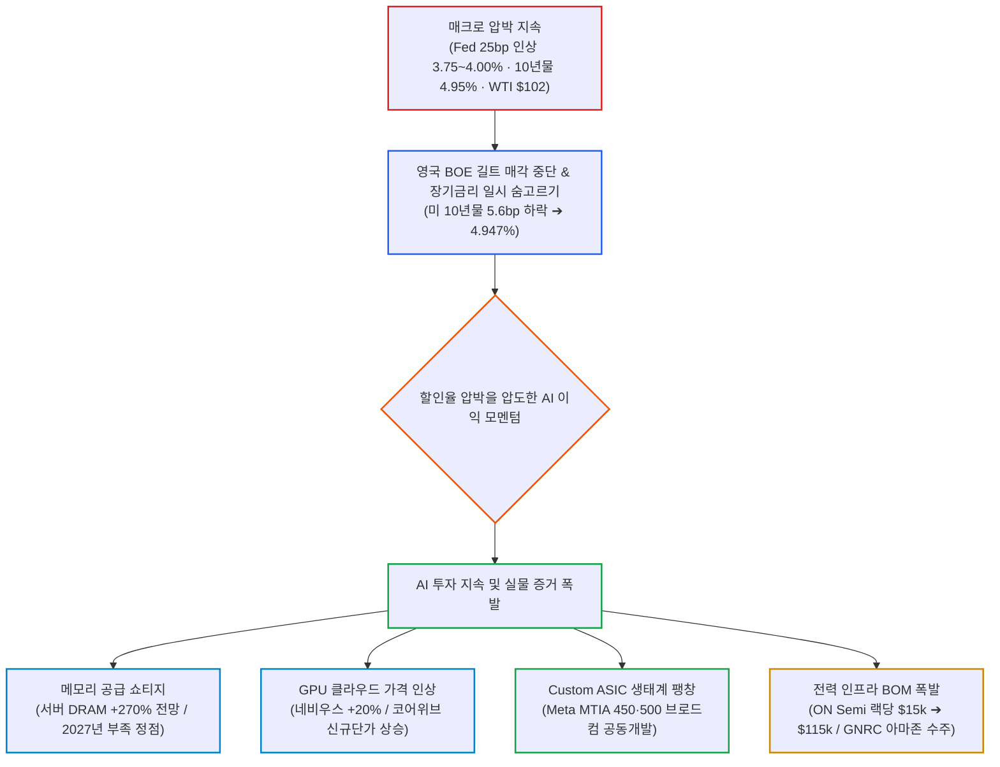
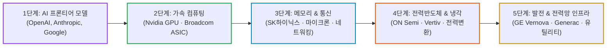

# 2026년 09월 18일(금) 하루치 뉴스정리

- **작성일**: 2026-09-18

연준의 25bp 추가 인상과 10년물 4.95%·WTI 102달러라는 매크로 압박 속에서도 장기금리가 하루 숨을 고른 틈을 타 AI·반도체의 강력한 실적 모멘텀이 전면에 나섰으며, 지금 시장은 무차별 반등이 아니라 실제 병목과 인프라 독점력을 쥔 1등 실적주로 돈이 압축되는 장세다.

## 요약

| 구분 | 주요 내용 |
| :--- | :--- |
| **핵심 진단** | 기준금리 25bp 인상(3.75~4.00%)에도 장기금리 일시 하락과 WTI 진정이 AI 실적 모멘텀을 재점화 |
| **AI 수요 팩트** | 서버 DRAM 가격 2026년 270% 상승 전망, 메모리 공급 부족 2027년 정점, 네비우스 GPU 클라우드 가격 20% 인상 |
| **브로드컴 신호** | 메타(Meta) 차세대 MTIA(450·500) 브로드컴 공동 개발 확인, 커스텀 ASIC 생태계 구조적 팽창 |
| **인프라 확산** | 온세미(ON) AI 랙당 전력반도체 $15k ➔ $115k 폭증, 제너락(GNRC) 아마존 백업발전기 공급 계약 수주 |
| **경계할 지표** | WTI 배럴당 $102 및 미 10년물 4.95%대 고착화, 시타델의 월말 수급 불안 및 향후 2주간 기술적 하락 경고 |
| **계좌 행동 지침** | 단기 급등주 흥분 추격 금지, 병목(메모리·GPU·ASIC) ➔ 인프라(전력반도체·전력망) ➔ 실적 소프트웨어 순 압축 대응 |

---

## 결론부터: 거시는 아직 위험하나 AI 펀더멘털은 그보다 더 강하다

지금 시장은 **“연준이 금리를 올렸는데도 아무 문제 없다”는** 장이 아니다.  
정확히는 **유가와 장기금리가 하루 숨을 고른 틈을 타 AI·반도체의 이익 모멘텀이 다시 전면에 나온 장**이다.

9월 17일 증시 결과:
- **S&P 500**: **+1.14%**
- **나스닥**: **+1.69%**
- **필라델피아 반도체지수(SOX)**: **+3.14%**

하지만 연준은 기준금리를 25bp 올렸고, 12월까지 추가 인상 가능성도 시장에서 80% 후반으로 반영되고 있다. 10년물 국채금리는 여전히 4.95% 부근, WTI도 배럴당 101.91달러다. 즉 **거시환경이 좋아진 게 아니라, 나쁜 거시환경보다 AI 기업들의 실적이 더 강하다고 시장이 판단한 하루**다.  

내가 이번 뉴스 묶음에서 가장 중요하게 보는 건 금리도 아니고 하루짜리 지수 반등도 아니다.

> **AI 투자 사이클이 꺾이고 있다는 증거보다, 오히려 공급부족·가격인상·CAPEX 지속을 보여주는 증거가 훨씬 많이 쌓이고 있다.**

---

## 1. 기사 속 팩트 폭행: Fed가 금리를 올렸는데 나스닥이 +1.69% 올랐다

연준은 기준금리를 **3.75~4.00%로 25bp 인상**했고, 올해 추가 인상 가능성까지 시사했다. 그런데 다음 날 S&P500 +1.14%, 나스닥 +1.69%, 필라델피아 반도체 +3.14%가 나왔다.  

이걸 단순하게

**“금리 인상은 이제 악재가 아니다.”라고**

해석하면 틀린다.

주가가 오른 결정적인 이유는 동시에 다음 4가지 요인이 겹쳤기 때문이다:

- **10년물 금리 5.00% 아래 안정**
- **WTI 이틀 연속 하락**
- **BOE(영국 중앙은행)의 장기채 매각 중단**
- **FOMC 불확실성 제거**

BOE가 장기 길트 매각을 사실상 중단하면서 영국 30년물 금리가 약 12bp 급락했고, 그 영향이 미 국채까지 전달됐다. 미국 10년물 국채금리 역시 5.6bp 내려 **4.947%까지** 떨어졌다. 

그러니까 이번 반등은

**금리 인상을 무시한 상승이**

아니라

**금리 인상 + 장기금리 하락이라는 특이한 조합에서 나온 상승**

이다.

---

## 2. 이번 뉴스에서 가장 중요한 건 AI 수요다

여기서 진짜 중요한 뉴스들이 줄줄이 나온다.

### 메모리 공급 부족의 현실

인텔 CEO는 메모리 공급부족이 **2027년에 더 심해질 것이라고** 경고했다.

- **SK하이닉스**: 공급 부족의 정점이 **2027년**일 것으로 전망.
- **마이크론(MU)**: 공급 개선 시기를 **2028년**으로 언급.
- **TrendForce**: 서버 DRAM 계약가격이 2026년 한 해 동안 **270% 상승**할 것으로 전망.

이게 굉장히 중요하다.

AI 사이클이 정상적인 반도체 사이클 후반이라면 보통 다음과 같은 순서로 진행되어야 한다:

> 가격 상승 ➔ 공급 증설 ➔ 재고 증가 ➔ 가격 하락

그런데 지금 확인되는 뉴스 흐름은 완전히 딴판이다:

> 가격 급등 ➔ 그래도 공급 부족 ➔ 2027년 더 부족 ➔ 2028년부터 완화

적어도 **현재 확인된 자료만 보면 메모리 사이클 피크를 선언하기에는 너무 이르다.**

---

## 3. 더 중요한 신호: GPU 가격이 아직 오른다

네비우스(Nebius)가 GPU 클라우드 가격을 **약 20% 인상한다.**

| GPU 모델 | 가격 인상률 | 시장의 함의 |
| :--- | :---: | :--- |
| **H100** | **+16.9%** | 구형 호퍼 수요도 여전히 강력 |
| **H200** | **+20.0%** | 메모리 확장 모델 프리미엄 유지 |
| **B200** | **+18.9%** | 블랙웰 초기 공급 부족 반영 |
| **B300** | **+21.0%** | 차세대 최고 성능 칩 가격 결정력 극대화 |

네비우스는 이미 지난 5월에도 가격을 인상한 바 있다. 

이건 상당히 강한 신호다.

AI 버블론이 맞으려면 가장 먼저 나타나야 할 현상은

**GPU 임대가격 하락**

이다.

공급이 넘치면 GPU 클라우드 업체끼리 고객 유치를 위해 가격 출혈 경쟁을 벌여야 하기 때문이다.

그런데 지금 벌어지는 일은 정반대다:

> **수요 > 공급 (공급자 우위 가격 결정력 유지)**

---

## 4. CoreWeave에서도 똑같은 현상이 보인다

코어위브(CoreWeave)는 6월 30일 이후 체결된 신규 컴퓨팅 계약 가격이 이전보다 더 높아졌다고 밝혔다.

- **3분기 초 순신규 고객계약**: **250억달러 이상** 체결.

따라서

> “AI 데이터센터 투자가 이미 과잉이다.”

라는 주장은 아직 사실로 확인된 게 아니다.

다만 코어위브라는 개별 기업 자체는 다른 문제다.

번스타인은 AI 훈련 증가세가 둔화할 경우 코어위브가 보유한 **미판매 비도심 전력 용량**이 위험해질 수 있다고 지적했다. 공매도 비중 역시 **17.84%로** 높은 편이다. 

즉 다음 명제를 확실히 구별해야 한다:

> **AI 인프라 산업이 위험하다 ≠ 코어위브가 안전하다.**

이 둘은 반드시 분리해서 봐야 한다.

---

## 5. 그리고 Broadcom 투자자라면 오늘 가장 중요한 뉴스

메타(Meta)가 자체 AI 칩 비중을 계속해서 확대한다:

- **MTIA 450 (Arke)**: 2027년 상반기 출시 예정
- **MTIA 500 (Astrid)**: 2027년 하반기 출시 예정
- **파트너십**: **Broadcom과 공동 개발**
- **비용 절감 효과**: 자체 칩 사용 시 서드파티 상용 칩 대비 **비용 약 40% 절감** 추정

여기서 대중과 시장이 놓치기 쉬운 핵심 포인트가 있다.

보통 시장 참여자들은

> “메타 자체칩 확대 ➔ Nvidia 악재”

정도로만 좁게 해석한다.

하지만 Broadcom 투자자 입장에서 본질은 정반대다:

> **하이퍼스케일러 자체칩 확대 자체가 Broadcom의 Custom ASIC 사업 확대를 의미한다.**

예전부터 우리가 지속적으로 강조해 온 AVGO 투자 논리와 정확히 일치한다.

AI 반도체 시장이

**Nvidia GPU 하나로 통일되는 구조**

가 아니라

**GPU + 고객맞춤형 ASIC(XPU)**

으로 분화될수록 Broadcom에게는 오히려 열리는 시장 규모가 압도적으로 커진다.

이번 뉴스는 그 방향성을 다시 한번 숫자로 확인해 준 결정적 데이터다.

---

## 6. Nvidia는 아직 'AI 투자 축소' 신호가 안 보인다

UBS가 흥미로운 분석을 내놨다.

시장 컨센서스가 현재 NVDA 밸류에이션에

- **향후 마진 약 8%p 하락**
- **2029~2030년 매출 성장률 약 3% 수준으로 둔화**

까지 이미 상당 부분 선반영하고 있다고 평가했다.

그러면서 실제 하이퍼스케일러의 AI CAPEX 축소 신호는 아직 어디서도 발견되지 않는다고 못 박았다. 

여기서 UBS의 **“저평가”라는 결론까지 무지성으로 받아들일 필요는 없다.**

하지만 한 가지 팩트는 명확하다:

현재 NVDA의 주가 강세 논리가 단순히 “AI가 멋지니까”라는 환상이 아니라, **하이퍼스케일러 CAPEX와 공급망 숫자가 여전히 꺾이지 않았다는 냉혹한 데이터에** 기반하고 있다는 점이다.

---

## 7. 대중의 눈먼 착시 ①: "금리 인상에도 올랐으니 금리는 상관없다?"

이번 시장에서 가장 위험한 착시는 두 가지다.

### 착시 ①: “Fed 금리 인상에도 주식이 올랐으니 금리는 이제 상관없다.”

**완전히 틀렸다.**

10년물 국채금리는 여전히 4.9% 후반이고, 30년물은 5.3% 근처에 머물고 있다.

아시아장에서도 다시 10년물이 **4.939%**, 30년물이 **5.288%** 수준까지 치솟으며 재차 움직이고 있다. 

이 정도의 초고금리가 장기간 지속되면:

- **성장주 밸류에이션(할인율) 압박 지속**
- **기업 금융비용 및 차환 부담 급증**
- **주택 및 모기지 시장 동결 부담**
- **미국 정부 재정 적자 및 이자 상환 부담 누적**

이 악재들은 고스란히 누적된다. 하루짜리 기술적 반등으로 사라진 문제가 결코 아니다.

---

## 8. 대중의 눈먼 착시 ②: "AI주가 올랐으니 아무거나 사면 된다?"

### 착시 ②: “AI주가 다시 올랐으니 그냥 AI 아무거나 사면 된다.”

**이것도 치명적인 착각이다.**

지금 AI 섹터 내부에서도 자금의 차별화가 극단적으로 벌어지고 있다.

살아남아 강하게 치고 나가는 기업들은 공통점이 있다:

> **실제 물리적 '병목(Bottleneck)'을 독점하고 있다.**

| 영역 | 현재 확인되는 병목 현상 | 대표 수혜 기업 |
| :--- | :--- | :--- |
| **GPU** | 클라우드 사용 가격 지속 인상 | NVIDIA |
| **HBM / DRAM** | 2027년까지 구조적 공급 부족 | SK하이닉스, 마이크론, 삼성전자 |
| **전력반도체** | AI 서버 랙당 반도체 탑재액 폭증 ($15k ➔ $115k) | ON Semiconductor |
| **전력망 / 송전** | 전력망 연결 대기기간(Interconnection Queue) 5년 이상 | GE Vernova, Quanta Services |
| **비상 발전기** | 하이퍼스케일러 데이터센터 장기 공급계약 | Generac |
| **Custom ASIC** | Meta 등 빅테크 자체 가속기 비중 확대 | Broadcom, Marvell |
| **데이터센터 CPU** | 전력 효율 극대화 및 고효율 호스트 CPU 수요 | ARM Holdings |

반면 단순히 **“AI 데이터센터를 짓겠다”라는** 스토리와 장밋빛 계획만 늘어놓고 실제 현금흐름과 병목 장악력이 없는 기업은 대단히 위험하다. CoreWeave에 쏠리는 시장의 우려가 바로 그 증거다.

---

## 9. 사실 ON Semiconductor 뉴스가 꽤 중요하다

온세미(ON Semi)는 2030년 매출 목표를 **110억달러로** 대폭 상향 조정했다.

AI 데이터센터 매출 전망:
- **2026년**: 전년 대비 **2배 이상** 성장
- **2027년**: 다시 **2배** 추가 성장

특히 시장의 눈을 번쩍 뜨이게 만든 핵심 데이터는 이것이다:

> **AI 서버 랙 1개당 ON Semi의 반도체 탑재금액: $15,000 ➔ $115,000까지 폭증**

GPU 칩 하나만 쳐다볼 때가 아니다.

AI 서버 랙의 전력 밀도가 기하급수적으로 올라갈수록:

> **전력변환 · 전력반도체(SiC/GaN) · 액체냉각 · 전력 인프라**

이쪽의 부품원가(BOM) 비중이 폭발한다.

지금 AI 투자 사이클의 2차 수혜가 어디로 이동하고 있는지 가장 명확하게 보여주는 뉴스다.

---

## 10. Generac + Amazon도 같은 이야기다

제너락(Generac, `GNRC`)은 Amazon 데이터센터에 백업 디젤/가스 발전기를 대량 공급하는 계약을 체결했다.

발표 직후 주가가 **20% 넘게** 폭등했다. 

GE 베르노바(GE Vernova, `GEV`) 역시 전력화(Electrification) 사업 수주잔고가 **400억달러를** 돌파했으며, 이는 무려 **약 3년 치 매출에** 해당하는 거대한 규모다.

여기서 가장 중요한 포인트는 **데이터센터가 GEV 전체 수주의 38%에 불과하고, 나머지 62%는 전통 유틸리티 전력망에서 발생한다는 점**이다. 

따라서 AI 전력 테마를 한때 지나가는 유행으로 치부하기 어려운 결정적 이유가 여기에 있다.

설령 AI 투자가 일시적으로 둔화하더라도:

- **노후화된 미국 전력망 교체 주기**
- **산업 전반의 전철화(Electrification)**
- **천연가스 터빈 발전 전환**
- **신재생에너지 그리드 통합**
- **송배전망 현대화 투자**

라는 거대한 구조적 인프라 슈퍼사이클이 전력 섹터의 하방을 단단히 받치고 있다.

---

## 11. 스마트머니가 보고 있는 진짜 돈길 (5단계 가치사슬)

이번에 쏟아진 뉴스들을 종합하면 스마트머니가 향하는 자본의 흐름이 대단히 명확해진다.

과거 2023~2024년에는 시장의 거의 모든 돈이 Nvidia 하나로만 쏠렸다.

하지만 2026년 현재는 AI 투자가 지속되면서 자본이 공급망 하부 구조로 광범위하게 확산되고 있다:

> **NVDA ➔ SKHY / MU ➔ AVGO ➔ ON ➔ GEV / GNRC**

수혜의 범위가 연쇄적으로 확장되고 있다. 이것이 이번 뉴스 묶음에서 확인해야 할 가장 결정적인 자본 배분의 변화다.

---

## 12. 반대로 피해야 할 착각: 산업의 성장과 개별 기업의 리스크는 별개다

AI 인프라 산업 전체가 유망하다고 해서, **“AI 인프라 간판을 달고 있는 기업은 전부 안전하다”라는** 뜻은 절대 아니다.

대표적인 예가 코어위브(CoreWeave)다:

| 긍정적 기회 요인 (Bull) | 치명적 위험 요인 (Bear) |
| :--- | :--- |
| • 폭발적인 AI 클라우드 수요 성장 | • 천문학적 차입금과 높은 자본집약도 |
| • 신규 고객 계약 가격 프리미엄 유지 | • 설비투자금 마련을 위한 추가 주식 발행(지분 희석) 위험 |
| • 250억 달러 규모 신규 고객 수주 확보 | • 높은 공매도 비율 (**17.84%**) 및 차입 비용 압박 |
| • 최신 가속기 인프라 선점 효과 | • AI 모델 트레이닝 증가세 둔화 시 미판매 비도심 전력 좌초 위험 |

**산업을 사는 것과 개별 기업의 재무 리스크를 떠안는 것은 완전히 다른 문제다.**

---

## 13. 향후 2주간의 냉혹한 현실: 단기 변동성과 매크로 부담

여기서 무지성 강세론에 도취되면 안 된다.

헤지펀드 시타델(Citadel)은 9월 말까지 수급 환경이 매우 불리하며, **향후 2주간 기술적 하락 변동성이 확대될 위험이 있다고** 경고했다.

JP모건(JPM) 트레이더들 역시 **국제유가와 국채금리가 확실히 안정되어 내려와야만 증시의 지속 가능한 상승 추세가 열릴 수 있다고** 지적했다. 

이 지적은 논리적으로 매우 타당하다:

> **WTI $102 + 미 10년물 국채금리 4.9%대**

이 거시적 조합은 고밸류 성장주에게 결코 편안한 꽃길이 아니다.

따라서 명확한 공식을 머릿속에 박아두어야 한다:

> **AI 펀더멘털이 강하다 ≠ 주가지수가 당장 직선으로 폭등한다**

---

## 14. 데이터 기반 팩트 대조 매트릭스

현재 시장에 널려 있는 정보를 4개 영역으로 엄격히 분리해 냉정하게 판단해야 한다.

| 구분 | 핵심 내용 | 계좌 판단 기준 |
| :--- | :--- | :--- |
| **확정된 사실** | • Fed 기준금리 25bp 인상 (3.75~4.00%) • 연내 추가 인상 확률 80% 후반 반영 • 10년물 국채금리 약 4.95%, WTI $102 내외 • 나스닥 +1.69%, SOX +3.14% 반등 • 네비우스 GPU 클라우드 가격 20% 인상 단행 • Meta 차세대 MTIA 450·500 브로드컴 공동 개발 • 서버 DRAM 계약가 2026년 270% 폭등 전망 • 온세미 랙당 반도체 탑재액 $115k 상향 및 발전기 수주 | 타협할 수 없는 실제 시장 데이터. 이 숫자를 부정하는 모든 전망은 헛소리다. |
| **신뢰도 높은 추정** | • 하이퍼스케일러 AI CAPEX 사이클의 피크는 아직 멀었다는 점 • 메모리 공급 부족 현상이 2027년까지 이어질 가능성 • 빅테크의 커스텀 ASIC 채택 비중 구조적 확대 • 전력·송배전 인프라 쇼티지의 3~5년 장기화 | 중기 포트폴리오 비중을 확대할 가장 강력한 투자 논거의 중심축. |
| **시장의 일시적 해석** | • Fed의 금리 인상이 오히려 불확실성 해소로 작용했다는 분석 • AI 실적 모멘텀이 거시 금리 부담을 충분히 상쇄한다는 논리 • 최근의 기술주 조정을 최적의 저가 매수 기회로 평가 | 단기 수급을 흔드는 재료. 장기금리가 재상승하면 언제든 뒤집힐 수 있음. |
| **경계해야 할 과장된 주장** | • “금리 인상은 이제 주식시장에 아무 영향이 없다.” • “AI 밸류에이션 버블 우려는 완전히 종식되었다.” • “AI 타이틀만 달고 있으면 무조건 다 오른다.” • “연준이 인플레이션을 완벽히 통제했다.” | 대중을 파멸로 이끄는 전형적인 착시. 이런 헛소리에 속아 추격 매수하면 물린다. |

---

## 15. 지금 계좌에서 즉각 실행해야 할 행동 수칙

내 기준이라면 **어제 하루 +3~8% 급등한 AI 주식을 흥분해서 추격 매수하지 않는다.**

이번 랠리가 진짜 펀더멘털 기반의 추세라면 하루짜리 폭죽으로 끝나지 않는다. 

오히려 금리와 유가 불안으로 단기 눌림목과 조정이 찾아올 때, 스마트머니의 자본이 몰리는 우선순위에 맞춰 냉정하게 분할 매수해야 한다:

- **1순위 — 실제 물리적 공급 병목 기업**:
    - **대상**: HBM / 서버 DRAM / 최선단 GPU / 네트워킹 / 커스텀 ASIC
    - **핵심 기업**: SK하이닉스, 마이크론, 엔비디아, 브로드컴
- **2순위 — AI 데이터센터 증설의 필수 인프라 독점 기업**:
    - **대상**: 초고전압 전력반도체 / 전력망 송배전 / 액체냉각 / 백업 발전 설비
    - **핵심 기업**: 온세미컨덕터, GE 베르노바, 버티브, 제너락
- **3순위 — 실질적 실적으로 숫자를 찍는 AI 소프트웨어 기업**:
    - **대상**: 단순 스토리나 데모 시연이 아니라 실적 가이던스 상향으로 연결되는 기업
    - **사례**: 세일스포스(CRM)처럼 FY30 매출 목표를 시장 컨센서스(592억달러)를 크게 뛰어넘는 **630억달러 이상으로** 제시하며 실물 매출 전환을 증명하는 곳
- **❌ 철저한 배제 대상**:
    - **스토리와 AI 테마만 번지르르하고 자체 현금흐름(FCF)과 수주의 질이 취약한 적자 기업**

---

## 16. 내가 보는 현재 시장의 핵심 구조 및 최종 실행 원칙

딱 한 문장으로 줄이면 이것이다:

> **거시는 아직 위험한데 AI 펀더멘털은 그보다 더 강하다.**

그래서 지금 장은

**“위험자산 전체를 맹목적으로 사는 장”이 아니라,  
“높은 금리와 유가 부담을 뚫고 이익 추정치가 독보적으로 올라가는 1등 기업을 골라 담는 장”**

에 가깝다.

오늘 뉴스 데이터에서 가장 명확하게 확인된 3대 팩트는 다음과 같다:

1. **메모리 공급 부족 사이클은 대중의 생각보다 훨씬 길다 (2027년 피크 전망).**
2. **GPU 클라우드 컴퓨팅 시장의 독점적 가격 결정력은 여전히 굳건하다.**
3. **AI 병목 현상이 반도체 칩에서 전력·발전·송전 인프라로 강력하게 확산되고 있다.**

특히 당신이 지속적으로 추적하고 있는 **Broadcom(`AVGO`) 관점에서는 Meta의 MTIA 확대가 대단히 중요한 확인 사살 신호**다. 자체 칩이 엔비디아를 일부 대체한다는 좁은 시야로 볼 것이 아니라, **하이퍼스케일러의 Custom ASIC 시대가 본격적으로 팽창하고 있다는 신호**로 보는 것이 투자의 본질이다.

### 실전 계좌 대응 로드맵

| 구분 | 실행 조건 | 배정 비중 | 가격 및 지표 기준 | 실전 대응 방침 |
| :--- | :--- | :---: | :--- | :--- |
| **1차 공급 병목 코어** | 실적 기반 눌림목 발생 시 | 40% | HBM·ASIC 핵심 주력주 | 단기 급등 추격 금지, 지지선 확인 후 분할 매집 |
| **2차 인프라 수혜주** | 전력·송배전 조정 시 | 30% | 전력반도체·발전기 선도주 | 랙당 탑재액 증가 및 유틸리티 수주 기업 선별 |
| **전술적 현금 버퍼** | 10년물 및 유가 급등 대비 | 30% | 10년물 5.0% / WTI $100 | 매크로 발작 시 추가 분할 매수용 실탄 보존 |
| **절대 경계선** | 10년물 5.05% 돌파 & WTI 급등 | — | 매크로 2차 발작 지속 | 부채 의존 성장주 즉시 비중 축소 및 철수 |

**지금 당장 매일 아침 가장 엄격하게 경계해야 하는 숫자는 S&P500 지수가 아니라 `미 10년물 5% / WTI $100`이다.**  
이 둘이 점진적으로 내려오면서 AI 이익 추정치가 지속 상향된다면 이번 반등은 매우 강력한 추세로 발전할 수 있다. 반대로 두 지표가 다시 동시에 상방으로 폭발하면 AI 펀더멘털이 아무리 우수해도 주가는 단기적으로 거친 풍파를 겪을 수밖에 없다.

!!! tip "최종 핵심 제언 (Executive Takeaway)"
    **연준의 25bp 인상과 5%대 장기금리 공포 속에서도 주가를 밀어 올린 진짜 동력은 AI 공급망의 지독한 쇼티지와 가격 결정력이다.**  
    하루짜리 지수 반등에 취해 아무 AI 주식이나 덤벼들지 마라.  
    메모리 쇼티지(2027년), 메타 MTIA 공동 개발로 확인된 Custom ASIC 팽창(Broadcom), 랙당 $115k로 폭증하는 전력반도체(ON Semi)처럼 **'대체 불가능한 실물 병목'**을 쥔 1등 기업에만 계좌를 집중하라.
