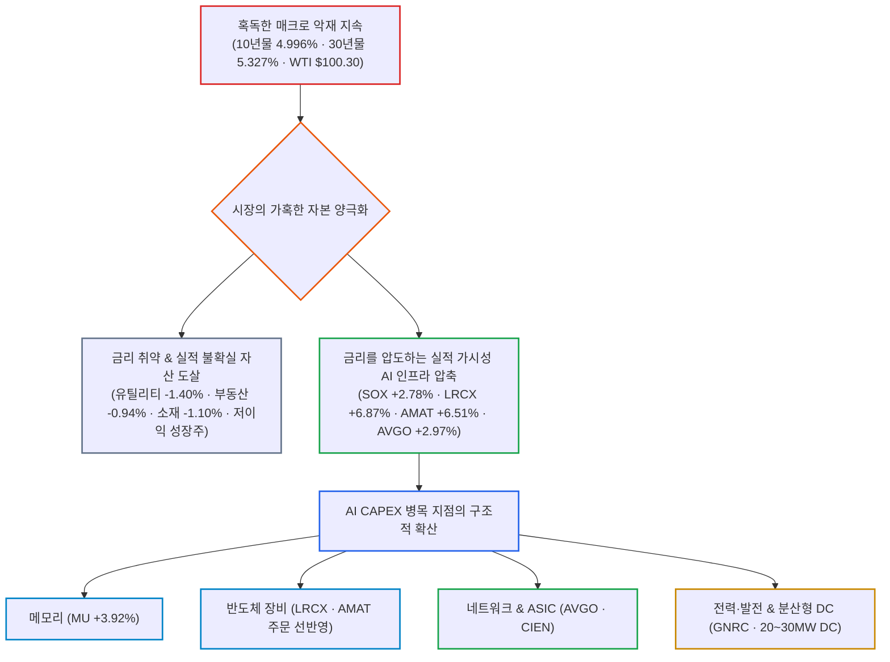
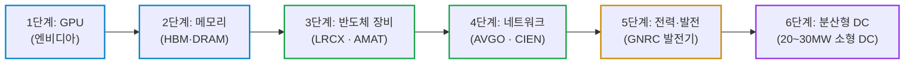

# 2026년 09월 19일(토) 하루치 뉴스정리

- **작성일**: 2026-09-19

미국 10년물 국채금리가 5%에 육박하고 WTI 유가가 100달러를 웃도는 혹독한 고금리 매크로 속에서도, 실적 가시성이 폭발하는 AI 인프라·반도체로 자금이 극단적으로 압축되며 '금리 악재를 실적 상향으로 찍어누르는' 진검승부 장세가 전개되고 있다.

## 요약

| 구분 | 주요 내용 |
| :--- | :--- |
| **핵심 진단** | 금리가 높아도 이익이 실제로 커지는 AI 인프라는 사고, 금리에 취약한 자산은 가차 없이 버리는 극단적 자본 압축 장세 |
| **핵심 종목 팩트** | 필라델피아 반도체지수 +2.78%, 램리서치 +6.87%, AMAT +6.51%, 마이크론 +3.92%, 브로드컴 +2.97% 급등 (젠슨 황 "내년 칩 판매 2배" 및 엔비디아 FY28 매출 $673B 전망) |
| **착시 교정** | "10년물 5%면 기술주 끝" & "AI면 아무거나 다 오른다"는 양대 착시 타파. 고금리 속 EPS가 더 빠르게 상향되는 독점주만 생존 |
| **돈길 확산 신호** | AI CAPEX 병목이 GPU ➔ 메모리 ➔ 장비 ➔ 네트워크(시에나) ➔ 전력·발전(제네락) ➔ 소형 데이터센터(20~30MW)로 단계적 전이 |
| **가장 더러운 변수** | 미 10년물 4.996% 및 30년물 5.327%, 프랑스 10년물 4.5735%(2008년래 최고), WTI $100.30 고유가 지속, 미 제조업 생산 -0.3% |
| **계좌 행동 지침** | 4거래일 연속 급등 종목 흥분 추격 매수 엄금, 매크로 발작 시 강력한 지지선 기반 분할 매수 및 실적 가시성(Visibility) 1등주 압축 |

---

## 1. 결론부터: 금리 악재를 실적 상향이 눌러버리는 자본 압축

지금 시장은 **“금리가 높아도 이익이 실제로 커지는 AI 인프라는 사고, 금리에 취약한 자산은 버리는 장”이다.**

미국 10년물 금리가 다시 **5% 부근**, 30년물은 **5.327%**, 유가는 WTI **100.30달러**, 브렌트 **103.87달러다.** 정상적인 성장주 환경이라고 보기 어렵다. 그런데도 필라델피아 반도체지수는 **+2.78%**, 브로드컴 +2.97%, 마이크론 +3.92%, 램리서치 +6.87%, 어플라이드머티리얼즈 +6.51%가 뛰었다.

이건 단순한 “AI 테마 광풍”으로만 보면 시장을 잘못 읽는 거다. **금리 악재를 실적 상향이 눌러버리는 일부 기업으로 자금이 극단적으로 압축되고 있다.**

---

## 2. 기사 속 핵심 팩트

### 2.1 금리 악재는 전혀 끝나지 않았다

9월 FOMC에서 연준이 25bp를 올린 뒤 시장은 오히려 **연준이 점도표보다 더 많이 올릴 가능성을** 반영하기 시작했다.

| 매크로 금리 지표 | 수치 / 확률 | 시장의 함의 |
| :--- | :---: | :--- |
| **미 국채 2년물 금리** | **4.743%** | 단기 통화정책 긴축 유지 반영 |
| **미 국채 10년물 금리** | **4.996%** | 5% 턱밑 재위협, 성장주 할인율 압박 |
| **미 국채 30년물 금리** | **5.327%** | 초장기물 기간 프리미엄 급등 지속 |
| **10년 - 2년 스프레드** | **약 25bp까지 축소** | 수익률 곡선 평탄화(Flattening) |
| **10월 FOMC 추가 인상 가능성** | **55.4%** | 과반 이상이 추가 긴축 베팅 |
| **12월까지 추가 인상 가능성** | **약 90%** | 연내 긴축 종결 기대 소멸 |

즉 시장은 지금 **“9월 한 번 올리고 끝”이라고 생각하지 않는다.**

더 불편한 건 미국만의 문제가 아니라는 점이다. 프랑스 10년물은 **4.5735%로 2008년 이후 최고**, 독일 대비 스프레드는 유럽 재정위기 이후 처음으로 100bp를 넘어섰다. 글로벌 장기금리가 미국 금리를 같이 끌어올리고 있다.

---

### 2.2 그런데 반도체는 금리를 무시했다

여기가 오늘 시장에서 제일 중요하다.

S&P500은 +0.17%, 나스닥 +0.39%에 불과했는데 **필리 반도체는 +2.78%에 달한다.**

그리고 30개 구성 종목 중 하락 종목은 고작 5개였다.

왜?

젠슨 황이 **내년 칩 판매량이 올해의 두 배가 될 것이라고** 말했고, 엔비디아 FY28 매출 전망도 약 **6,730억달러, +70% 성장이라는** 숫자가 제시됐다.

JP모건은 AI 공장 증설과 장비 부족 때문에 오히려 기업들이 장비 주문을 **앞당기고 있다고** 분석했다.

따라서 이번 반도체 상승은 최소한 지금 제공된 뉴스만 놓고 보면

> “금리가 내려갈 것 같아서 오른 반도체”

가 아니다.

오히려

> **“금리가 5%인데도 실적 전망이 계속 올라가니까 사는 반도체”에 가깝다.**

이 차이가 엄청 크다.

---

## 3. 대중의 착시

### 착시 ① “10년물 5%니까 기술주는 이제 끝이다”

지금 시장이 이 논리를 정면으로 깨고 있다.

10년물이 5%인데

* 반도체 **+2.78%**
* 기술주 **+0.81%**
* 램리서치 **+6.87%**
* AMAT **+6.51%**

다.

반대로 금리에 민감한

* 유틸리티 **-1.40%**
* 부동산 **-0.94%**
* 소재 **-1.10%**

는 밀렸다.

즉 **고금리 = 기술주 전부 하락**이라는 공식은 너무 단순하다.

지금 시장이 구분하는 건 이거다.

| 기업 유형 | 매크로 조건 | 시장의 냉혹한 반응 |
| :--- | :--- | :--- |
| **이익 없는 스토리 성장주** | 고금리 (10년물 5%) | **가차 없는 밸류에이션 압박 및 폭락** |
| **EPS가 폭증하는 독점 인프라주** | 고금리 (10년물 5%) | **금리 압박을 뚫고 실적으로 강력 버팀 & 상승** |

---

### 착시 ② “AI면 아무거나 오른다”

이것도 틀렸다.

AI 안에서도 돈이 이동하고 있다.

현재 뉴스 흐름을 보면 AI 투자축이 점점

**GPU → 메모리 → 반도체 장비 → 네트워크 → 전력 → 데이터센터**

로 퍼지고 있다.

- **시에나(CIEN)**: 2029년까지 **연평균 매출 성장률 약 30%**, 조정 영업이익률 32~35% 목표 제시.
- **제네락(GNRC)**: 아마존과 데이터센터 발전기 공급 계약 체결, 잠재 주문 규모 **최대 80억달러**, 초기 2027~28년 공급만 약 **24억달러로 추정된다.**
- **OpenAI & Anthropic**: 기존 초대형 데이터센터뿐 아니라 **20~30MW급 소형 데이터센터까지 확보하고** 있다. 특히 향후 AI 워크로드에서 학습보다 추론 비중이 더 커질 것이라는 전망이 나온다.

이게 훨씬 중요한 변화다.

**AI CAPEX가 꺾이고 있는 게 아니라 병목지점이 계속 옮겨가고 있다.**

---

## 4. 오늘 뉴스에서 내가 가장 중요하게 보는 부분

### 엔비디아보다 오히려 Broadcom·장비·네트워크가 중요하다

젠슨 황의 발언 자체도 강하다.

그런데 투자 관점에서는

> “엔비디아가 더 많이 팔린다”

보다

> **“그걸 가능하게 만들기 위해 주변 인프라까지 같이 커진다”는 점이**

더 중요하다.

GPU 두 배를 설치하려면 GPU만 사면 끝나는 게 아니다.

* HBM
* 스위치
* 네트워크
* 광통신
* 패키징
* 전력
* 냉각
* 발전기
* 데이터센터

전부 같이 필요하다.

그래서 오늘 **브로드컴 +2.97% 상승이** 꽤 의미 있다.

브로드컴 입장에서 현재 시장은 나쁘지 않다.

AI 투자자가 다시 단순한 GPU 이야기에서 **네트워크와 ASIC, 전체 클러스터 구축비**를 보기 시작하는 시장이기 때문이다.

---

## 5. 그런데 지금부터가 위험하다

AI가 강하다고 시장 전체가 안전한 건 아니다.

산업생산은 전월 대비 **0%**, 제조업 생산은 **-0.3%**, 설비가동률도 76.3%로 내려갔다.

경제 데이터는 강하지 않은데

* 유가 100달러+
* 10년물 5%
* 연준 추가 인상
* 유럽 국채 불안

이 동시에 존재한다.

이건 좋은 조합이 아니다.

경제가 둔화되는데 인플레이션 때문에 금리를 못 내리는 그림으로 가면 시장 전체 PER은 계속 압박받는다.

그래서 **지수 전체가 편하게 올라가는 강세장보다 실적이 강한 극소수 기업으로 돈이 몰리는 장세**가 될 가능성이 높다.

---

## 6. 유가는 사흘 내렸다고 안심하면 안 된다

WTI가 사흘 연속 떨어져 **100.30달러까지** 내려왔다.

하지만 “100달러까지 떨어졌다”는 표현부터 이상하다.

100달러는 여전히 높은 가격이다.

현재 하락의 핵심은 공급이 완전히 정상화된 게 아니라 **외교적 해결 기대감이다.**

JP모건조차 현재 전쟁 상황에 대해 기존 기본 시나리오를 잡기 어려워졌다고 평가했고, 공급 차질 지속 여부의 불확실성을 지적하고 있다.

그래서 유가는 지금 주식시장 최대 변수 중 하나다.

내가 보는 핵심 기준은 단순하다.

**WTI가 90달러 아래로 내려가기 시작하면 금리 부담이 상당히 줄어든다.**

반대로 다시 105~110달러를 향하면 연준 추가 긴축 기대가 다시 강해질 가능성이 크다.

---

## 7. 스마트머니 관점: 극단적인 차별화

여기서는 한 가지를 정확히 구분해야 한다.

현재 자료만으로 **기관들이 실제로 반도체를 대규모 순매수했다고** 단정할 수는 없다. 그런 자금흐름 데이터는 없다.

다만 가격 움직임에서 확인되는 시장의 선택은 명확하다.

### 시장이 팔고 있는 것

금리 민감주 / 실적 불확실 기업 / 가이던스 하향 기업.

플루언스는 매출 전망을 약 30억달러에서 **24억달러**, 조정 EBITDA 전망도 -1천만달러에서 **-2억달러로** 낮추자 주가가 18% 폭락했다.

### 시장이 사고 있는 것

**실적 가시성이 올라가는 AI 인프라.**

그래서 현재 가장 중요한 단어는 AI가 아니라

> **Visibility — 실적 가시성**

이다.

말만 AI인 기업과 실제 수주·매출·EPS가 올라가는 기업의 가격 차별화가 시작되고 있다.

---

## 8. Broadcom을 보고 있다면 특히 중요한 변화

AVGO를 계속 보고 있다면 이번 뉴스는 꽤 의미가 있다.

최근 Broadcom 투자 논리에서 가장 중요한 리스크는

**“AI 투자 피크 → 하이퍼스케일러 CAPEX 둔화 → ASIC·네트워크 투자 둔화”였다.**

그런데 이번 데이터에서는 반대 증거가 계속 나온다.

엔비디아는 내년 칩 판매량 두 배를 이야기하고 있고, 장비 수요는 공급 부족으로 주문이 앞당겨지고 있으며, 광네트워크 업체 시에나는 2029년까지 30% 매출 CAGR을 이야기한다. AI 기업들은 대형 DC뿐 아니라 소형 데이터센터까지 확보하고 있다.

| 구분 | 팩트 및 시장 해석 |
| :--- | :--- |
| **확정된 사실** | AI 인프라 투자 관련 수요 지표와 기업 가이던스가 여전히 강하다. |
| **신뢰도 높은 추정** | AI 클러스터가 확대될수록 네트워크·ASIC·광통신 투자도 함께 증가할 가능성이 높다. |
| **시장의 해석** | 그래서 10년물 5%에도 AVGO를 포함한 반도체가 강하게 반등했다. |
| **과장된 주장** | “AI CAPEX는 이제 절대 꺾이지 않는다.” 이건 아직 증명되지 않았다. |

---

## 9. 그래서 계좌에서 어떻게 봐야 하나

내 기준은 상당히 명확하다.

| 구분 | 판단 | 계좌 비중 및 실행 방침 |
| :--- | :--- | :--- |
| **AI 반도체** | **여전히 핵심 주도군** | 핵심 코어 보유 유지, 단기 급등 추격 금지 |
| **AVGO·네트워크** | **구조적 수혜 지속 여부 주목** | 클러스터 확대에 따른 ASIC·스위치 수혜 집중 |
| **반도체 장비** | **AI 증설 사이클 수혜 강함** | 증설 앞당김 수혜 유효, 눌림목 분할 매수 |
| **광통신** | **AI 클러스터 확장 수혜** | 시에나 실적 가이던스 확인, 위성 포트폴리오 편입 |
| **전력·발전 인프라** | **숨은 AI CAPEX 수혜** | 제네락 아마존 수주 등 유틸리티·발전 병목 포착 |
| **고PER·저이익 성장주** | **고금리에서 가장 위험** | 밸류에이션 리레이팅 불가, 반등 시 전량 정리 |
| **부동산·금리민감주** | **장기금리 안정 전까지 부담** | 10년물 5% 하회 확인 전까지 비중 축소 |
| **장기채** | **아직 금리 고점 확인이 안 됨** | 30년물 5.3%대, 섣부른 바닥 잡기 금지 |

단, **지금 반도체가 좋다는 이유로 4거래일 연속 오른 종목을 추격해서 한 번에 사는 것도 좋은 접근은 아니다.**

금리가 5%인 시장이다.

좋은 종목도 조정 한 번 나오면 낙폭이 상당히 클 수 있다.

따라서 기존에 생각하던 **분할매수 전략이 현재 환경에는 더 잘 맞는다.**

### 실전 계좌 대응 로드맵

| 단계 | 조건 및 지표 | 배정 비중 | 대응 방침 |
| :---: | :--- | :---: | :--- |
| **1단계: 코어 비중 유지** | 10년물 5% & WTI $100 고착 | 50% | 실적 가시성 1등주(AVGO, NVDA, HBM 등) 보유 유지 |
| **2단계: 장비·인프라 눌림목** | 4거래일 연속 상승 후 숨고르기 | 25% | 반도체 장비(LRCX, AMAT) 및 광통신·전력 눌림목 분할 매수 |
| **3단계: 전술적 현금 보존** | 추가 긴축 발작 및 유가 급등 대비 | 25% | WTI $105 돌파 또는 10년물 5.05% 위협 시 버퍼 현금 대기 |
| **비상 기준선** | WTI $110 돌파 & 긴축 가속 | — | 무이익 성장주 전량 컷오프 및 계좌 압축 극대화 |

---

## 10. 최종 판단 및 핵심 실행 원칙

지금 시장을 **“금리 인상이라 주식이 위험하다”** 한 문장으로 설명하면 절반만 보는 거다.

정확하게는

> **금리가 올라가면서 시장 전체 밸류에이션은 압박받고 있지만, AI 인프라 기업들의 이익 전망은 그 압박보다 더 빠르게 상승하고 있다.**

그래서 지수는 겨우 움직이는데 반도체는 폭발하는 것이다.

당분간 시장의 승부처는 **Fed가 아니다.**

**유가 → 금리 → AI 실적 상향**

이 세 가지 싸움이다.

현재는
**유가·금리 = 악재**,
**AI 실적 = 훨씬 강한 호재가** 맞붙고 있고,

9월 18일 시장에서는 **AI 실적 쪽이 이겼다.**

하지만 10년물이 5%인데도 반도체가 오른다는 건 “시장 위험이 사라졌다”는 뜻이 아니다.

오히려 더 냉정하게 보면,

> **아무 주식이나 사도 되는 장은 끝났고, 돈을 실제로 버는 AI 인프라 기업만 살아남는 장이 더 선명해지고 있다.**

!!! tip "최종 핵심 제언 (Executive Takeaway)"
    **10년물 5%와 유가 100달러라는 거시 공포를 찍어누른 것은 연준의 완화가 아니라 AI 인프라의 압도적인 실적 가시성(Visibility)이다.**
    대중은 4거래일 연속 오른 주가를 보며 뒤늦게 추격 매수하다가 첫 번째 금리 발작에 피를 흘린다.
    흥분을 가라앉히고, GPU에서 장비·네트워크·전력으로 퍼져나가는 병목 지점의 1등 기업(AVGO, 장비주, 시에나, 제네락)을 눌림목마다 철저한 분할매수로 모아가는 자만이 이 잔혹한 고금리 압축장에서 살아남는다.
