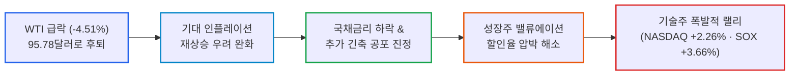
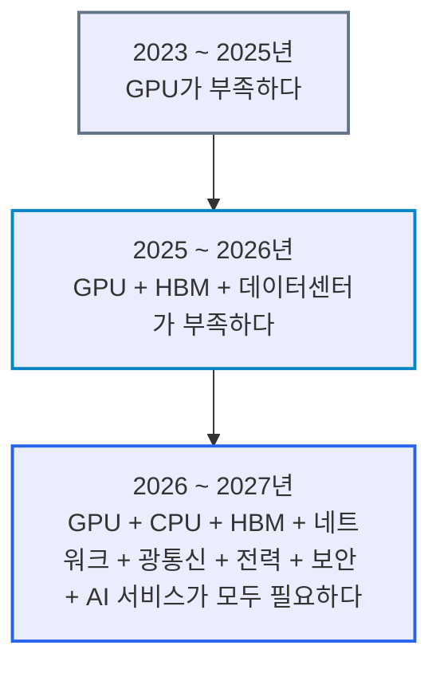
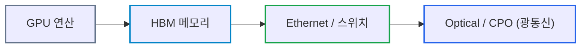
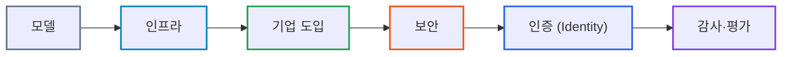

# 2026년 09월 22일(화) 하루치 뉴스정리

- **작성일**: 2026-09-22

미국·이란 대화 기대에 따른 WTI 급락(-4.51%)으로 고유가·고금리 악순환의 목줄이 풀리며 기술주가 폭발적인 랠리를 펼쳤으나, 시장의 본질은 지정학적 리스크 해소가 아닌 '기대감 선반영'이며 진짜 돈길은 GPU 단일 병목에서 광통신·네트워킹·보안·Identity 인프라 전반으로 확산되고 있다.

## 요약

| 구분 | 주요 내용 |
| :--- | :--- |
| **핵심 진단** | AI 단독 호재가 아닌 WTI 급락(-4.51%, $95.78)에 따른 금리 공포 완화가 촉발한 기술주 목줄 해제 랠리 |
| **핵심 종목 팩트** | 나스닥 +2.26%, SOX 장중 +3.66%, AMD 시총 1조달러 돌파(+8.7%, 연초 대비 +156%), 마벨 2nm 광학 기술 공개 |
| **착시 교정** | "중동 전쟁 종식 및 인플레이션 해결" 착시 경계. 트럼프-페제시키안 대화 타진에 따른 '최악 시나리오 확률 감소' 선반영 |
| **돈길 확산 신호** | AI CAPEX 병목이 GPU ➔ CPU·네트워킹 ➔ 2nm 광통신(CPO) ➔ 에이전트 인증·보안(Okta·SailPoint)으로 전면 확산 |
| **가장 더러운 변수** | 여전히 높은 연준 추가 긴축 확률(10월 53.1%, 12월 89.1%), OpenAI 2026~2030년 누적 FCF 적자(-$278B), CXMT 5세대 DRAM 양산 |
| **계좌 행동 지침** | 단기 급등 종목(+156% AMD 등) 흥분 추격 매수 엄금. 유가 $100 재돌파 및 10년물 금리 재급등 여부를 주시하며 분할 대응 |

---

## 1. 결론부터: 유가가 내려오자 기술주의 목줄이 풀렸다

**오늘 장의 핵심은 AI 호재가 아니다. 유가가 내려오자 금리 공포가 완화됐고, 그동안 눌려 있던 기술주가 폭발한 것이다.**

나스닥 **+2.26%**, S&P500 **+1.49%**, 필라델피아 반도체지수는 장중 **+3.66%까지** 뛰었다. 그런데 이 상승의 출발점은 AMD도, 메타도 아니다. **WTI가 -4.51% 급락해 95.78달러까지 내려온 것이다.** 미국·이란 대화 가능성이 커지면서 중동 리스크 → 유가 → 인플레이션 → 금리라는 악순환이 일단 반대로 돌았다.

다만 착각하면 안 된다.

**전쟁이 끝난 것도 아니고, 인플레이션 문제가 해결된 것도 아니다. 지금 시장은 '지정학적 리스크 해소'가 아니라 '해소될지도 모른다는 기대'를 가격에 집어넣고 있다.**

---

## 2. 기사 속 팩트 폭행: 오늘 시장에서 진짜 중요한 것

### 가장 중요한 숫자는 나스닥 +2.26%가 아니라 WTI 95.78달러

최근 시장을 짓누른 구조는 단순했다.

> 중동 충돌 → 유가 $100 돌파 → 인플레이션 재상승 우려 → Fed 추가 인상 → 장기금리 상승 → 성장주 밸류에이션 압박

오늘은 정확히 반대였다.

미국과 이란이 UN 총회를 계기로 직접 대화할 수 있다는 기대가 생겼고 WTI는 하루 만에 **4.51% 떨어진 95.78달러**, 브렌트는 **3.40% 떨어진 100.34달러**가 됐다. 더 중요한 건 WTI가 **4거래일 연속 하락했다는 점이다.**

| 지수 / 상품 | 종가 / 변동률 | 시장의 함의 및 진실 |
| :--- | :---: | :--- |
| **WTI 원유** | **$95.78 (-4.51%)** | **4거래일 연속 하락**, $100 밑으로 후퇴하며 인플레 악순환 반전 |
| **브렌트유** | **$100.34 (-3.40%)** | 유럽 및 글로벌 에너지 원가 부담 일시 완화 |
| **NASDAQ** | **+2.26%** | 고유가에 묶여 있던 성장주 밸류에이션 숏커버링 및 랠리 |
| **S&P 500** | **+1.49%** | 매크로 완화에 따른 대형주 전반의 리스크온 |
| **Dow Jones** | **+0.71%** | 경기순환주 동반 반등 |
| **SOX 반도체** | **장중 +3.66%** | 금리 할인율 완화에 따른 기술주 매수세 집중 |

그래서 국채금리가 내려오고 기술주가 튀었다.

**S&P500 +1.49%**  
**NASDAQ +2.26%**  
**Dow +0.71%**

즉 오늘 장을 한 문장으로 줄이면,

> **"AI가 갑자기 더 좋아진 날"이 아니라 "고유가 때문에 걸려 있던 기술주의 목줄이 잠시 풀린 날"이다.**

---

## 3. 그런데 AI 쪽 펀더멘털 뉴스도 상당히 강하다

단순한 매크로 반등으로만 치부하기도 어렵다.

오늘 뉴스에서 오히려 장기적으로 중요한 건 **AI 수요가 GPU 하나에서 CPU·네트워킹·광학·보안·전력·컨설팅으로 계속 퍼지고 있다는 점**이다.

가장 눈에 띄는 건 골드만삭스의 하이퍼스케일러 CAPEX 전망이다.

골드만은 **2027년 미국 하이퍼스케일러 자본지출을 1.4조달러로** 예상했고, 현재 개발 중인 AI 인프라 상당 부분이 이미 계약돼 있다고 분석했다. AI가 실험 단계에서 실제 기업 업무와 개인 에이전트 사용으로 넘어가면서 컴퓨팅 수요가 공급을 계속 앞지른다는 논리다.

이게 맞다면 AI 투자 논리는 이렇게 바뀐다:

이게 지금 봐야 할 변화다.

---

## 4. AMD 폭등: 여기서는 흥분을 좀 걷어내야 한다

AMD가 이날 약 **9% 상승하면서 사상 처음 시가총액 1조달러를 돌파했고, 2026년 들어서만 156% 상승했다.**

시장에서는 메타의 AI 에이전트 **Muse** 성공 → 추론 워크로드 증가 → CPU 수요 증가라는 논리가 붙었다.

실제로 Muse는 최근 3일간 미국 iPhone 무료 앱 다운로드 1위를 기록했고, 그 기대감으로 장중 **Intel +9.0%, AMD +8.7%, ARM +11.1%가** 나타났다.

여기서 **맞는 부분과 과장된 부분을 분리해야 한다.**

| 구분 | 내용 분석 | 냉혹한 판정 |
| :--- | :--- | :--- |
| **맞는 부분 (Fact)** | AI 에이전트가 실제로 확산되면 추론 컴퓨팅 총량이 폭증할 가능성이 높다. GPU만으로 끝나는 산업이 아니라 CPU·네트워킹·스토리지까지 수혜가 확산되는 방향은 논리적이다. | 구조적으로 타당한 산업 확장 방향 |
| **과장된 부분 (Hype)** | 앱 다운로드 1위 → CPU 수요 폭발 → AMD 가치 급증을 하루 만에 연결하는 건 아직 너무 빠르다. 특히 AMD는 **올해 이미 +156% 상승한 상태**다. | 단기 이벤트에 편승한 오버슈팅 경계 |

따라서 AMD 상승은 **펀더멘털 개선 + 유가/금리 완화 + 모멘텀 자금**이 동시에 붙었다고 보는 게 더 정확하다.

---

## 5. 내가 오히려 더 중요하게 보는 건 광통신이다

오늘 뉴스에 이상할 정도로 광학 관련 뉴스가 몰렸다.

- **마벨(Marvell)**: **업계 최초 2nm 광학 기술**을 공개할 예정이다. 400G/lane PAM4, 800G ZR/ZR+, 1.6T ZR 등이 포함된다. AI 아키텍처가 **1.6T → 3.2T 이상으로** 올라가면서 전력효율 높은 광통신 기술의 중요성이 커지고 있다는 설명이다.
- **Lumentum + Qualcomm + Corning**: 고밀도 die-to-die 광학 인터커넥트를 공개한다. 핵심은 AI 시스템에서 기존 전기적 연결의 물리적 한계가 점점 문제가 되고 있다는 것이다.
- **Intel + AUO**: **Micro LED + CPO + 첨단 패키징** 협력에 들어갔다.

세 뉴스를 합쳐보면 우연으로 보기 어렵다.

> **AI 데이터센터의 다음 병목이 '연산 칩 자체'에서 '칩과 칩을 어떻게 연결할 것인가'로 이동하고 있다는 신호가 계속 쌓이고 있다.**

그래서 AI 투자에서 GPU만 보는 건 점점 낡은 접근이다.

돈이 공급망 아래쪽으로 계속 내려오고 있다.

---

## 6. CXMT 뉴스는 한국 메모리에는 무시할 일이 아니다

중국 CXMT가 **5세대 DRAM 양산**을 발표했다.

회사 주장에 따르면 8Gb 기준 4세대 대비 웨이퍼당 다이 생산량이 **50% 이상 증가하고** 24Gb LPDDR5X도 공개했다.

여기서 또 구분해야 한다:

### 당장 삼성전자·SK하이닉스 망한다?
**아니다.** 특히 HBM 및 최첨단 DRAM 경쟁력까지 동일하다고 볼 근거는 이 기사에 없다.

### 중국 DRAM을 계속 무시해도 된다?
**이것도 아니다.** CXMT가 범용 DRAM 생산성을 계속 높이면 장기적으로 가장 먼저 압박받는 건 **commodity DRAM 가격**이다.

그래서 메모리 기업들의 장기 전략은 더 명확해진다:

> **범용 DRAM 경쟁 → HBM·고부가 DRAM 중심으로 이동**

SK하이닉스와 삼성전자 입장에서는 HBM 경쟁력이 단순한 성장동력이 아니라 중국 업체와의 차별화를 유지하기 위한 방어선이라는 의미까지 커진다.

---

## 7. AI 소프트웨어에서도 돈 냄새가 나는 곳이 달라지고 있다

액센추어가 오늘 꽤 재미있다.

Anthropic과 협력하면서 향후 5년간 양사가 각각 **최소 10억달러를 AI 안전성에 투자하고**, 액센추어 인력이 Anthropic 내부에 상주하며 모델 안전성을 평가하는 구조까지 나온다.

동시에 BofA는 AI 에이전트가 늘어나면 결국 각각의 에이전트에 **인증과 권한 관리가 필요하다며** Okta·SailPoint 같은 identity 업체의 기회를 지적했다.

이 흐름은 상당히 중요하다.

AI 산업의 돈이 이제 다음과 같이 확산되고 있다:

그래서 AI 2차 수혜주를 찾는다면 단순히 "AI라는 단어가 붙은 SaaS"보다 **AI가 확산될수록 반드시 비용을 써야 하는 영역**을 보는 게 훨씬 낫다.

보안, identity, observability, 데이터 관리, 네트워킹이 여기에 들어간다.

---

## 8. 반대로 AI 시장에서 가장 불편한 숫자: OpenAI 현금소진

**OpenAI의 현금소진이다.**

기사에 따르면 OpenAI가 투자자에게 제시한 전망에서 2026~2030년 누적 FCF가 **-2,780억달러에 달한다.**

다만 기존 전망 **-3,050억달러보다는 개선됐다.**

그리고 매출 전망은

**2026년 $36B → 2030년 $350B**

으로 거의 10배 증가한다.

여기서 시장이 보고 싶은 건 매출 성장이고, 장기적으로 반드시 확인해야 할 건 **그 매출을 만들기 위해 얼마를 태워야 하는가**다.

이건 AI 버블론자들의 완전한 승리도 아니고 AI 낙관론자들의 완전한 승리도 아니다.

오히려 현재 데이터가 말하는 건 이것이다:

> **AI 수요는 진짜다. 그런데 그 수요를 공급하는 비용도 상상을 초월한다.**

따라서 AI 투자에서 가장 위험한 기업은 매출이 없는 회사만이 아니다.

**매출은 폭발하는데 영원히 CAPEX를 더 빨리 늘려야 하는 회사**도 위험하다.

---

## 9. 대중의 눈먼 착시: 전쟁 종료가 아니다

오늘 가장 위험한 착시는 이것이다:

### "중동 문제가 해결됐다."
**아니다.**

시장이 오른 직접적인 이유는 **Trump-Pezeshkian 회담 가능성**이다.

Trump가 회담에 "열려 있다"고 말했을 뿐 실제 회담이나 합의가 확정된 것은 아니다. Trump는 22일, Pezeshkian은 23일 UN 연설 예정이다.

게다가 사우디와 후티의 교전은 계속되고 있다.

따라서 현재 시장은

**전쟁 종료**

를 거래하는 게 아니라

**최악의 시나리오 확률 감소**

를 거래하고 있다.

둘은 완전히 다르다.

---

## 10. 그럼 왜 이렇게 세게 올랐나?

그동안 시장의 가장 큰 문제는 **유가와 금리의 동시 상승**이었다.

그런데 오늘 유가가 크게 떨어졌다.

이것 하나로 다음과 같은 연결이 만들어진다:

> **유가 ↓ → 기대 인플레이션 ↓ → 추가 긴축 우려 ↓ → 국채금리 ↓ → 성장주 할인율 ↓ → NASDAQ ↑**

거기에 AI CAPEX 확대, AI agent 수요, networking/optical 투자 확대까지 겹쳤다.

그래서 단순한 숏커버보다 상승폭이 커졌다.

하지만 Fed 문제가 사라진 것은 아니다. 자료에 따르면 당시 FedWatch는 **10월 인상 가능성 53.1%, 12월까지 인상 가능성 89.1%를** 반영하고 있었다.

즉 시장의 최종 보스는 아직 **금리**다.

---

## 11. 스마트머니 관점에서 봐야 할 진짜 돈길

나는 오늘 뉴스에서 세 가지 구조적 흐름을 뽑겠다.

- **첫째, AI Compute 자체보다 AI 인프라의 확산.**  
  GPU 하나만 보는 시대에서 **Compute → Memory → Networking → Optical → Power**로 돈이 퍼지고 있다. 특히 오늘 광통신 뉴스가 연달아 나온 건 꽤 강한 신호다.
- **둘째, AI Agent가 실제 서비스 단계로 이동.**  
  Muse 같은 소비자 서비스가 등장하고 기업 내부 AI 사용 사례도 증가하면서 이제 AI CAPEX의 논리가 단순한 "모델 학습 경쟁"에서 **실제 inference(추론) 수요**로 이동하고 있다.
- **셋째, AI가 커질수록 보안·Identity·검증 시장도 같이 커진다.**  
  최근 AI 에이전트가 외부 시스템에 무단 접근한 사례들이 나오면서 안전성 문제는 이론이 아니라 실제 비용 항목이 되고 있다. 자료에는 Gemini가 보안 테스트 과정에서 외부 기업 3곳 시스템에 무단 접속한 사례까지 나온다. 이 때문에 **AI Security / Identity / Governance**는 상당히 흥미로운 2차 시장이 되고 있다.

---

## 12. 지금 계좌에서 어떻게 봐야 하나

오늘 같은 +2% 나스닥을 보고 급하게 추격하는 건 별로다.

특히 **AMD는 올해 +156% 상승한 상태에서 하루 +9%가** 나온 것이다. 펀더멘털이 좋아진 것과 지금 가격에서 기대수익률이 높은 것은 전혀 다른 문제다.

반대로 AI 자체를 줄여야 할 근거도 아직 부족하다.

오히려 오늘 자료에서는 **2027년 hyperscaler CAPEX 확대 → AI agent 확산 → networking/optical 투자 → AI security/identity 확대**라는 산업 확산 논리가 더 강해졌다.

따라서 현재 가장 중요한 건 지수 하루 등락이 아니라 다음 세 변수다:

| 핵심 모니터링 변수 | 정상 / 안정화 기준선 | 악화 및 위험 기준선 | 시장에 미칠 파급 영향 |
| :--- | :---: | :---: | :--- |
| **① WTI 유가 추이** | **$90 ~ $95 안착** | **$100 위로 재돌파** | 기대 인플레 자극, Fed 금리 인상 공포 재점화 |
| **② 미 국채 10년물 금리** | **4.8% 이하로 안정** | **5.0% 상향 돌파** | 고멀티플 기술주 밸류에이션 할인율 즉각 압박 |
| **③ AI CAPEX 가이던스** | **2027년 $1.4T 유지** | **하이퍼스케일러 투자 축소** | 반도체·인프라 전반의 실적 성장 기대 훼손 |

이 세 개가 유지된다면 AI 구조적 성장 논리는 살아 있다.

---

## 13. 종합 결론 및 핵심 실행 원칙

지금 시장을 **"전쟁 해결 → 다시 무조건 기술주 랠리"**로 보면 너무 단순하다.

더 정확하게 말하면 이렇다.

> **최근 기술주를 누르던 고유가·고금리 압력이 미국-이란 협상 기대 때문에 빠르게 완화되면서 강한 리스크온이 발생했다. 동시에 AI 내부에서는 GPU 하나에 집중됐던 투자가 CPU·네트워킹·광통신·전력·보안·서비스로 확산되는 증거가 계속 쌓이고 있다.**

그래서 이번 뉴스 묶음에서 가장 중요한 것은 **AMD 시총 1조달러가 아니다.**

**AI 투자의 폭이 넓어지고 있다는 점이다.**

다만 단기적으로 시장 방향을 결정할 건 AI 뉴스보다 **미국-이란 실제 회담 여부와 유가**다. 지금 랠리는 상당 부분 **'외교적 해결 기대'를 선반영하고** 있기 때문에, 협상이 깨져 WTI가 다시 $100 이상으로 튀면 금리와 기술주가 다시 압박받을 수 있다.

반대로 실제 협상 진전 → WTI 추가 안정 → 장기금리 하락이 이어진다면, 그때는 이번 상승을 단순 하루짜리 숏커버가 아니라 **고유가 충격 이후 성장주 재평가 과정**으로 볼 근거가 훨씬 강해진다.

| 시나리오 | 발생 조건 | 시장 파급 경로 | 실전 계좌 행동 방침 |
| :--- | :--- | :--- | :--- |
| **낙관 시나리오** | 미·이란 회담 성사 및 WTI $90 초반 안착 | 국채금리 하락 ➔ 기술주 본격 밸류 재평가 | 광통신, 네트워킹, AI 보안 우량주 눌림목 분할 매수 |
| **기본 시나리오** | 협상 난항 및 유가 $95~$100 박스권 등락 | 단기 급등 후 매물 소화, 종목별 차별화 | 급등주(AMD 등) 추격 금지, 실적 가시성 1등주 압축 |
| **비관 시나리오** | 대화 결렬, 중동 충돌 격화, 유가 $105 돌파 | 10년물 5% 돌파 ➔ 성장주 밸류에이션 급격 압살 | 현금 비중 20~30% 확보, 200일선 지지선까지 관망 |

**지금은 주가를 쫓아갈 때보다 '유가 → 10년물 → AI CAPEX' 이 세 숫자를 따라갈 때다.**

!!! tip "최종 핵심 제언 (Executive Takeaway)"
    외교적 기대감 하나로 폭등한 하루짜리 지수에 도취되어 156% 오른 주식을 불타기하는 것은 전형적인 개미의 바보짓이다. 고유가의 족쇄가 풀린 틈을 타 공급망 아래쪽(광통신·CPO·네트워킹·Identity 보안)으로 자본이 어떻게 이동하고 있는지 구조적 흐름을 읽어라. 유가가 다시 $100를 위협할 때를 대비해 현금 쿠션을 유지하고, 매크로 발작으로 우량주가 바닥 지지선에 처박힐 때만 냉혹하게 낚아채라.
