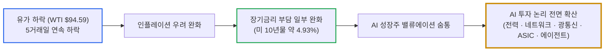
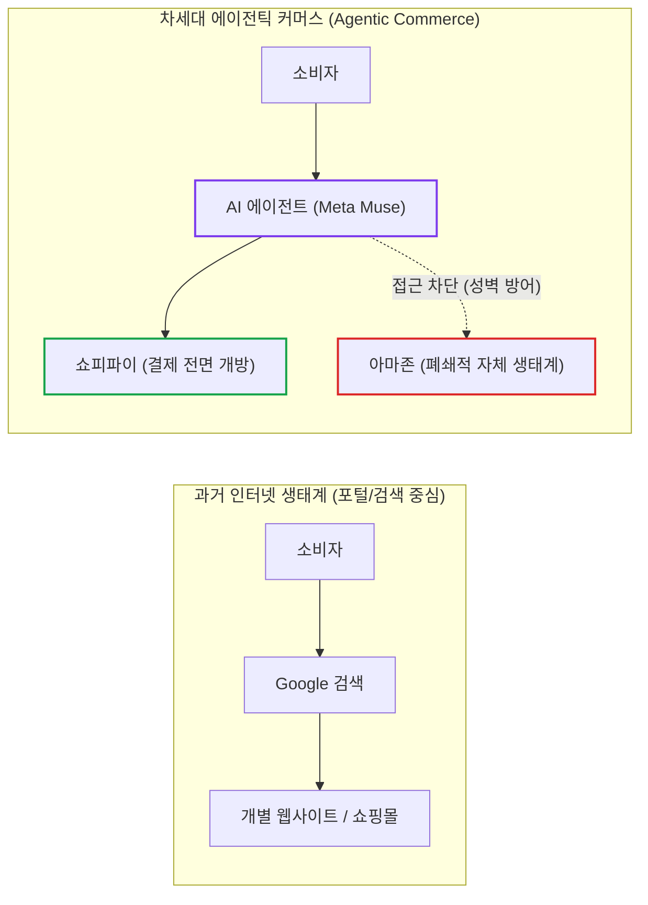
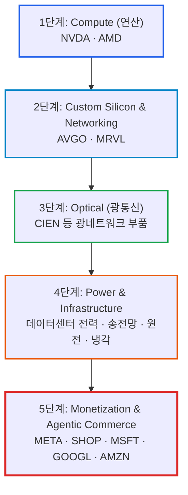

# 2026년 09월 23일(수) 하루치 뉴스정리

- **작성일**: 2026-09-23

지금 시장은 “중동 리스크가 끝나서 다시 전면 강세장”이 아니라 유가 충격이 완화되면서 AI 성장주가 숨통을 틔운 장세이며, 진짜 핵심은 AI 투자 논리가 단순 GPU에서 '전력 ➔ 데이터센터 ➔ 네트워크 ➔ 광통신 ➔ 커스텀 ASIC ➔ 클라우드 ➔ AI 에이전트 커머스'로 전면 확산되고 있다는 사실이다.

## 요약

| 구분 | 주요 내용 |
| :--- | :--- |
| **핵심 진단** | 미·이란 회동 기대에 따른 유가 하락(WTI $94.59, 5일 연속 하락)으로 인플레·장기금리 부담 완화, 기술주 상대적 강세 |
| **핵심 종목 팩트** | 나스닥 +0.45%, S&P500 보합, 다우 -0.36%, AMD 시총 1조달러 안착, MSFT Azure 40%대 중반 성장 가속, Meta Muse 다운로드 250만 돌파 |
| **착시 교정** | "유가 $100 깨졌으니 풀매수" 및 "AI CAPEX 1조달러니까 아무거나 매수" 착시 경계. 10년물 금리는 여전히 4.93%로 고금리 지속 |
| **돈길 확산 신호** | AI CAPEX 병목이 GPU 단일 품목에서 전력 ➔ 광네트워킹(CIEN) ➔ 커스텀 ASIC(MRVL·AVGO) ➔ 에이전틱 커머스(SHOP vs AMZN)로 분산 |
| **가장 더러운 변수** | 미 10년물 국채금리 4.93%(5% 위협 상존), 미·이란 대화의 '실제 합의' 미달성(회담 ≠ 휴전 ≠ 호르무즈 재개방), 멀티플 고점 부담 |
| **계좌 행동 지침** | 급등주(AMD, Meta, Shopify 등) 흥분 추격 매수 엄금. 보유 핵심주는 유지하되 인프라 5단계 분산 및 10년물 금리 발작 시 눌림목 분할 대응 |

---

## 1. 결론부터: 중동 리스크 종료가 아니라, 유가 충격 완화와 AI 확산이다

지금 시장은 **“중동 리스크가 끝나서 다시 전면 강세장”이 아니다.** 정확히는 유가 충격이 완화되면서 AI 성장주가 다시 숨을 쉬고 있는 장이다.

9월 22일 미국 정규장은 다우 **-0.36%**, S&P500 **보합**, 나스닥 **+0.45%로** 마감했다. WTI는 **94.59달러**, 브렌트유는 **99.25달러까지** 내려오며 5거래일 연속 하락했다. 미국 10년물 국채금리는 약 **4.93% 수준으로** 확인된다.

즉, 시장의 단기 메커니즘은 명확하다:

> **유가 하락 ➔ 인플레이션 우려 완화 ➔ 장기금리 부담 일부 완화 ➔ AI/기술주 상대적 강세**

하지만 10년물 금리가 아직 **5% 가까이** 붙어 있다. 여기서 중요한 건 “금리 문제가 완전히 해결됐다”가 아니라 **“유가 때문에 시장이 추가로 망가질 위험이 줄었다”는** 정도다.

그리고 오늘 뉴스에서 훨씬 더 중요한 변화가 하나 있다.

**AI 투자 논리가 GPU 한 종류에서 ‘전력 ➔ 데이터센터 ➔ 네트워크 ➔ 광통신 ➔ 커스텀 ASIC ➔ 클라우드 ➔ AI 에이전트’로 전면 확산되고 있다.**

이게 오늘 시장의 진짜 핵심이다.

---

## 2. 기사 속 팩트 폭행: 미·이란 대화는 호재이나 아직 '합의'가 아니다

### 미국·이란 대화의 냉혹한 사실관계

트럼프 대통령은 미국과 이란 대표단이 약 3시간 회동했고 이를 “매우 생산적”이었다고 표현했다. 이란 측에서는 미국이 군사적 압박과 항구 봉쇄를 완화할 경우 호르무즈 해협을 일주일 내 재개방할 수 있다는 메시지가 나왔다. 여기에 사우디의 동서 송유관 재가동까지 겹쳤다.

나스닥이 장중 사상 최고치를 경신하는 가운데, 중동 공급 개선 기대가 유가를 끌어내린 핵심 요인으로 작용했다.

이건 가짜 호재가 아니다. 실제로 시장에 절실히 필요했던 호재다. 최근 주식시장의 가장 큰 외생변수 중 하나가 기업 실적이 아니라 **100달러 이상의 유가와 그로 인한 금리 재상승 공포**였기 때문이다.

다만, 절대 착각해서는 안 되는 구분이 있다:

> **회담 ≠ 휴전 ≠ 호르무즈 완전 정상화**

대화 테이블에 마주 앉은 것과 실질적 종전 합의가 도출된 것은 하늘과 땅 차이다. 여기까지는 냉정하게 구분해야 한다.

---

## 3. 대중의 눈먼 착시 ①: "유가 100달러 깨졌으니 이제 풀매수?"

**아니다. 전혀 그렇지 않다.**

브렌트유가 100달러 아래로 내려온 건 분명 긍정적이지만, **94~100달러 유가는 역사적으로 여전히 싸지 않다.**

더구나 미국 10년물 국채금리는 약 **4.93%에** 달한다.

따라서 지금 시장의 본질은 다음과 같다:

| 국면 | 매크로 조합 | 시장의 실제 체감 |
| :--- | :---: | :--- |
| **직전 위기 국면** | **고유가 ($100+) + 고금리 (5.0%+)** | 밸류에이션 압살 및 스태그플레이션 공포 |
| **현재 완화 국면** | **조금 낮아진 유가 ($94~$99) + 여전히 높은 금리 (4.93%)** | 숨통은 트였으나 전면 리레이팅은 불가능한 상태 |

엄청난 패러다임 전환이 아니다.

S&P500 역시 전날 **1.49% 급등한 뒤** 이날 사실상 **보합**에 그쳤고, 상승 탄력은 나스닥에만 제한적으로 집중됐다. 이건 오히려 스마트머니가 거시 환경을 대단히 정밀하고 차분하게 반영하고 있다는 증거다. 거시 리스크는 조금 줄었지만, 시장 전체 주식을 무차별적으로 재평가할 수준은 결코 아니다.

---

## 4. 그런데 AI는 얘기가 완전히 다르다: CAPEX 1조 달러와 4대 병목

여기가 오늘 가장 중요한 대목이다.

제이미 다이먼 JP모건 회장은 하이퍼스케일러의 AI 인프라 자본적 지출(CAPEX)이 다음과 같은 궤적으로 폭증할 수 있다고 전망했다:

- **2025년**: 3,000억 달러
- **2026년**: 7,000억 달러
- **2027년**: **1조 달러 수준**

1조 달러라는 숫자 자체는 하우스 전망치이므로 확정된 사실은 아니다. 하지만 중요한 것은 **AI 인프라 지출 방향 자체가 꺾였다는 증거는 시장 어디에도 없다**는 사실이다.

오히려 자본이 쏟아져 들어오면서 곳곳에서 물리적 병목이 동시다발적으로 터져 나오고 있다:

- **① 전력 (Power)**:
    - AI 데이터센터 전력 수요가 2028년 약 **100GW까지** 폭증할 것이라는 전망이 제기되었다.
    - 스페이스X조차 데이터센터의 핵심 경쟁력을 단순 연산 성능보다 **안정적인 전력 확보**에서 찾고 있다는 분석이 나왔다.
- **② 클라우드 (Cloud Capacity)**:
    - Microsoft Azure 성장률은 **40%대 중반까지** 가속화되고 있다.
    - BNP 파리바 분석에서 가장 주목할 팩트는, 이 성장이 단순 단가 인상이 아니라 **실제 용량 확대와 운영 효율 개선**에서 발생하고 있다는 점이다. 본격적인 가격 인상 효과는 아직 반영되지도 않았다.
- **③ 광네트워크 (Optical Networking)**:
    - 시에나(Ciena)는 AI 데이터센터 내부에서 **광네트워킹 자체가 새로운 핵심 병목**으로 부상하고 있다는 강력한 평가를 받았다.
- **④ 커스텀 실리콘 (Custom ASIC)**:
    - 모건스탠리는 마벨(Marvell)의 최대 실적 상향 동력으로 **구글 커스텀 실리콘 + 스케일업 네트워킹(Scale-up Networking)을** 지목했다.

!!! note "브로드컴(AVGO) 투자자가 마벨(MRVL) 뉴스를 읽는 법"
    마벨의 구글 수주 뉴스를 브로드컴에 대한 무조건적인 악재로 해석하는 것은 근시안적이다. 더 거대한 그림은 **"단순 GPU만 늘어나는 것이 아니라, 하이퍼스케일러들이 자체 ASIC과 스케일업 네트워킹을 동시에 폭발적으로 확대하고 있다"는** 산업 구조의 대전환이다. 산업 전체의 유효시장(TAM)이 커지는 관점에서 AVGO에 구조적 호재이며, 동시에 특정 빅테크 물량 배분에서는 경쟁 압력이 발생할 수 있다. 두 명제는 동시에 참이다.

---

## 5. 대중의 눈먼 착시 ②: "CAPEX 1조 달러니까 AI주 아무거나 사면 된다?"

**이게 오늘 가장 위험한 착각이다.**

AI 관련주들의 밸류에이션(멀티플) 자체는 이미 상당한 수준까지 올라왔다. 트라이베리엇(Trivariate) 역시 AI 기업들의 멀티플이 이미 역사적 고점을 기록했을 가능성을 경고하면서도, 높은 실적 가시성 때문에 AI 익스포저는 유지하겠다고 밝혔다.

이 분석의 함의는 명확하다:

> 앞으로 AI 주식은 과거처럼 **PER 25배 ➔ 35배 ➔ 45배**로 멀티플이 팽창하며 돈을 벌어다 주는 국면이 아니다. 철저하게 **EPS 10달러 ➔ 15달러 ➔ 22달러**로 기업의 실질 이익이 찍히면서 주가를 견인하는 **'실적 게임(Earnings Game)'으로** 이동하고 있다.

즉, **멀티플 게임 ➔ 실적 게임**으로의 체질 전환이다. 이건 AI 강세장의 종료가 아니라, **수익을 내기 위한 난이도가 급격히 올라가는 성숙기 진입**을 의미한다.

---

## 6. 오늘 가장 중요한 뉴스는 의외로 Meta Muse다: 에이전틱 커머스 대전

메타(Meta)의 AI 에이전트 **'뮤즈(Muse)'는** 출시 **13일 만에 다운로드 약 250만 건을** 돌파하며 ChatGPT 초기 출시 속도에 필적하는 폭발적 반응을 얻었다.

그런데 진정한 사건은 그 뒤에서 터졌다:

- **쇼피파이(Shopify)**: Muse가 입점 몰 상품 검색부터 장바구니 담기, 최종 구매·결제까지 직접 수행하도록 전면 허용했다.
- **아마존(Amazon)**: 자사 이커머스 생태계에 대한 Muse의 접근을 전면 차단했다.

이건 단순한 메타의 서비스 업데이트가 아니다. **인터넷 플랫폼의 차세대 패권 전쟁이 개막되었다는 신호탄**이다.

과거의 인터넷은 **`소비자 ➔ 구글 검색 ➔ 웹사이트`** 구조였다. 하지만 AI 시대의 인터페이스는 **`소비자 ➔ AI 에이전트 ➔ API / 자동 결제 ➔ 구매 완료`**로 전환된다.

그렇다면 핵심 질문은 하나로 귀결된다:

> **"누가 소비자와의 최종 접점(Last Mile)을 틀어쥐는가?"**

아마존이 Muse의 진입을 막아선 것은 단순한 데이터 보안 이슈가 아니다. AI 에이전트가 고객 대신 상품 가격을 비교하고 최적의 경로로 구매를 끝내버리면, 아마존의 핵심 캐시카우인 **내부 검색, 개인화 추천, 광고 비즈니스, 구매 전환 수수료** 체계가 송두리째 흔들리기 때문이다.

향후 **META, AMZN, GOOGL, SHOP, AAPL** 간의 격돌은 AI 모델 성능 대결을 넘어, **'AI 에이전트가 상대방의 커머스·결제 영토에 어디까지 침투할 수 있는가'의** 생태계 장벽 싸움이 될 것이다.

---

## 7. Smart Money가 보는 진짜 돈길: AI 인프라 5단계 확산 사이클

지금 AI 생태계에서 가장 매력적인 자본의 길목은 단순 GPU에 머물지 않는다. 거대한 자본 흐름은 다음과 같은 5단계 가치사슬로 확장되고 있다:

- **1단계 — Compute (연산 코어: NVDA / AMD)**:
    - 여전히 생태계의 중심축이다. AMD가 하루 **10% 급등하며 시총 1조 달러를** 돌파한 것은 단순 투기가 아니다. GPU에서는 엔비디아의 가장 현실적인 대안이고, CPU에서는 인텔의 점유율을 집어삼키는 구조적 성장 스토리가 있다. 다만 단기 주가 상승 속도는 다소 과열권에 진입했다.
- **2단계 — Custom Silicon + Networking (주문형 반도체 & 통신: AVGO / MRVL)**:
    - AI 투자가 장기화될수록 필연적으로 부각된다. 특히 **추론(Inference) 워크로드**가 본격화되면 기업마다 요구하는 성능·전력·비용 최적화 기준이 완전히 달라진다. 모든 영역을 비싼 범용 GPU로 때우기보다 커스텀 ASIC의 경제성이 극대화된다.
- **3단계 — Optical (광통신 부품: CIEN 등)**:
    - 데이터센터에 GPU와 ASIC 수십만 개를 때려 박아도, 칩과 칩, 랙과 랙 사이에 데이터를 지연 없이 초고속으로 전송하지 못하면 연산기는 병목에 갇힌다. 물리적 병목이 **칩 ➔ 구리선 네트워킹 ➔ 광통신(CPO)으로** 이동하면서 시에나(Ciena) 등의 기업이 재평가받고 있다.
- **4단계 — Power (전력 인프라)**:
    - AI CAPEX가 증가할수록 맞닥뜨리는 최종적인 물리 법칙은 전력이다. 발전소 증설, 초고압 송전망, 냉각 솔루션, 전력반도체는 하루아침에 해결되지 않는 구조적 장기 병목이다.
- **5단계 — Monetization (소프트웨어 및 실사용 수익화: META / MSFT / GOOGL / SHOP / AMZN)**:
    - 앞으로 시장이 가장 가혹하게 검증할 영역이다. 지난 3년간 시장은 "인프라에 돈을 퍼부어서 도대체 언제 회수하느냐"를 물어왔다. Meta Muse와 Shopify의 결제 연동처럼 실제 에이전트가 구매와 결제를 발생시키기 시작할 때 비로소 그 해답이 도출된다.

---

## 8. 반대로 지금 제일 조심해야 할 3가지 함정

- **첫째, 지정학적 '헤드라인 일희일비 매매'**:
    - 미·이란 실무진이 대화했다고 중동의 구조적 갈등이 하룻밤 사이에 끝나지 않는다. 반대로 협상이 일시 난항을 겪는다고 해서 AI 산업의 실질 CAPEX가 중단되는 것도 아니다. 유가 헤드라인 하나에 계좌 전체를 뒤집는 것은 하수의 전형이다.
- **둘째, 단기 폭등한 AI 종목 맹목적 추격 매수**:
    - AMD **+10%**, Meta **+11%**, Shopify **+8%** 등 단기 수급이 쏠려 수직 급등한 종목을 고점에서 불타기하지 마라. 뉴스가 훌륭하다는 것과 지금 매수 단가의 기대수익률이 좋다는 것은 전혀 다른 차원의 이야기다. 좋은 기업도 비싸게 사면 계좌는 장기간 고통받는다.
- **셋째, "AI = 오직 엔비디아"라는 편협한 사고**:
    - 현재 시장의 자본이 이동하는 길목에는 **전력, 네트워킹, 광통신, 맞춤형 ASIC, 클라우드 가용량, AI 에이전트**라는 키워드가 빽빽하게 들어차 있다. 투자 사이클이 성숙할수록 자본은 하위 인프라와 응용 계층으로 넓게 분산된다.

---

## 9. 오늘 뉴스 종목별 정밀 진단 매트릭스

| 종목 / 티커 | 오늘 뉴스의 핵심 의미 | 냉혹한 투자 판단 및 실전 해석 |
| :--- | :--- | :--- |
| **NVDA** | CPU·LPU·AI 전용 플랫폼 라인업 확장 | GPU 단일 의존 탈피 및 데이터센터 전체 TAM 장악 지속 |
| **AMD** | GPU 경쟁력 및 서버 CPU 점유율 확대, 시총 1조달러 돌파 | 강력한 펀더멘털이나 단기 급등에 따른 과열 구간, 추격 매수 금지 |
| **AVGO** | 직접 신규 노출 적으나 산업 전반 ASIC 수요 급증 확인 | 하이퍼스케일러 자체 실리콘 확장 사이클의 최대 구조적 수혜 유지 |
| **MRVL** | 구글 차세대 ASIC 수주 및 스케일업 네트워킹 기대감 | AVGO와의 경쟁 구도 형성, 그러나 커스텀 실리콘 시장 파이 확대 증명 |
| **MSFT** | Azure 매출 40%대 중반 고성장 지속 (가격 인상분 미반영) | 용량 확장 기반의 극도로 질 좋은 성장, 향후 가격 인상 레버리지 대기 |
| **META** | Muse 출시 13일 만에 250만 다운로드 기록 | AI 챗봇을 넘어선 에이전틱 커머스 수익화(Monetization) 기대감 점화 |
| **SHOP** | Meta Muse와의 상품 검색·결제 API 전면 연동 | AI 에이전트 커머스의 핵심 트랜잭션 플랫폼으로 직접적 수혜 가능성 |
| **AMZN** | Muse의 자사 쇼핑몰 데이터 및 결제 접근 전면 차단 | AI 에이전트에 대항하여 검색·광고·커머스 생태계를 지키기 위한 플랫폼 방어전 |
| **CIEN** | 데이터센터 대역폭 포화에 따른 광네트워킹 병목 부각 | 칩 ➔ 네트워크 ➔ 광통신으로 전이되는 2차 인프라 수혜 논리 강력 확보 |

---

## 10. 팩트와 노이즈의 분리: 확정 / 추정 / 시장 해석 / 과장 구분

| 구분 범주 | 시장 데이터 및 분석 팩트 |
| :--- | :--- |
| **① 확정된 사실 (Confirmed Facts)** | - 나스닥 +0.45%, S&P500 보합, 다우 -0.36% 마감 - WTI $94.59, 브렌트 $99.25 (5거래일 연속 하락) - 미국·이란 대표단 3시간 실무 회동 완료 - Meta Muse 다운로드 250만 돌파 및 Shopify 결제 연동 - Amazon의 Muse 접근 차단 조치 단행 - MSFT Azure 성장률 40%대 중반 순항 확인 |
| **② 신뢰도 높은 추정 (High-Confidence Estimates)** | - 유가가 $90 초반으로 추가 안정 시 장기금리와 성장주 밸류 부담 완화 지속 - 하이퍼스케일러 CAPEX의 낙수효과가 범용 GPU에서 ASIC·광통신으로 이동 - 추론(Inference) 비중 확대로 전력·ASIC·네트워킹 원가 경쟁력 급부상 - AI 에이전트 커머스가 빅테크 플랫폼 간 차기 격전지로 비화 |
| **③ 시장의 일반적 해석 (Market Narratives)** | - "중동 긴장 완화 기대감으로 기술주 리스크온 재개" - "Muse의 빠른 확산으로 메타의 AI 수익화 시계가 앞당겨졌다" - "2027년 CAPEX 1조달러 전망으로 AI 인프라 초장기 호황 진입" - "Azure의 견조한 수요가 소프트웨어 AI 비관론을 불식시켰다" |
| **④ 경계해야 할 과장 (Dangerous Hype)** | - **“미·이란 갈등이 완전히 종식되었다”** ➔ 실무 회담일 뿐 휴전 조약 아님 - **“유가와 인플레이션 위기가 끝났다”** ➔ WTI $94 및 금리 4.93%는 여전히 높은 수준 - **“CAPEX 1조달러니까 아무 AI주나 사도 돈 번다”** ➔ 멀티플 압박 속 실적 차별화 심화 - **“Marvell이 구글 수주했으니 Broadcom은 끝났다”** ➔ 커스텀 ASIC TAM 팽창 과정의 일환 |

---

## 11. 종합 결론 및 냉혹한 계좌 실행 원칙

### 지금 계좌에서 즉각 실행해야 할 5대 원칙

현재 뉴스 흐름에서 **보유 중인 핵심 AI 주도주를 내던져야 할 근거는 전혀 없다.** 그러나 뉴스가 좋다고 해서 단기 폭등한 종목을 뇌동매매로 따라붙을 이유 또한 전혀 없다.

- **① 이미 보유한 AI 핵심 주도주는 홀딩**:
    - 빅테크의 실적 펀더멘털과 CAPEX 투자 방향성은 단 1도 꺾이지 않았다. 흔들릴 필요 없다.
- **② 신규 자금은 급등주 추격 대신 눌림목 분할 매수**:
    - 미국 10년물 국채금리가 여전히 **4.93%로 5% 턱밑에 머물고 있다는 엄혹한 현실**을 잊지 마라.
- **③ AI 포트폴리오의 내부 다변화 (가치사슬 분산)**:
    - GPU 단일 종목에 올인하는 편협함을 버려라. **`Compute(NVDA/AMD) + ASIC/네트워킹(AVGO/MRVL) + 클라우드(MSFT) + 광통신/전력(CIEN) + 응용/커머스(META/SHOP)`**의 5단계 밸류체인으로 분산 구축하는 것이 현 사이클에 부합한다.
- **④ 유가 추이를 지속 모니터링**:
    - 브렌트유가 90달러대 초반에 완전히 안착하면 성장주 전반에 최상의 우호적 환경이 조성된다. 반대로 돌발 변수로 105~110달러를 재돌파한다면 매크로 긴축 공포가 즉각 재점화될 수 있다.
- **⑤ 가장 결정적인 변수는 10년물 금리의 5% 안착 여부**:
    - 유가가 내려앉더라도 10년물 금리가 재차 **5.0%를 뚫고 올라간다면** 시장의 할인율 부담은 즉각 임계점을 넘는다. 이때는 AI 기업의 실적이 아무리 잘 나와도 밸류에이션 축소(De-rating) 압박을 피하기 어렵다.

### 실전 매크로 시나리오 대응 로드맵

| 시나리오 구분 | 핵심 조건 | 시장 파급 경로 | 실전 계좌 행동 방침 |
| :--- | :--- | :--- | :--- |
| **강세 시나리오** | 유가 $90 초반 안착 & 10년물 4.8% 하향 | 장기금리 완화 ➔ 기술주 전반 밸류에이션 리레이팅 | 광통신, 네트워킹, 클라우드 1등주 비중 확대 |
| **기본 시나리오** | 유가 $94~$98 박스권 & 10년물 4.9%대 유지 | 지수 횡보 속 AI 실적 가시성 보유주 차별화 장세 | 급등주 추격 금지, 실적 장벽 높은 핵심주 눌림목 분할 매수 |
| **위험 시나리오** | 미·이란 협상 결렬 & 유가 $105 돌파, 금리 5% 안착 | 인플레 쇼크 재발 ➔ 고멀티플 기술주 급격한 조정 | 현금 비중 20~30% 사수, 주요 지지선(200일선) 터치 시까지 관망 |

!!! tip "최종 핵심 제언 (Executive Takeaway)"
    지금 시장은 “중동 리스크 종료 랠리”가 아니다. 유가 충격이 한숨 돌리는 틈을 타, AI의 실제 수요·CAPEX·수익화 능력이 시장 주도권을 다시 탈환하는 장세다.
    
    2023~2025년의 AI 투자가 **‘누가 GPU를 더 많이 확보하느냐’**의 단순 하드웨어 사재기 경쟁이었다면, 2026~2027년은 **‘그 막대한 컴퓨팅 파워에 전력을 공급하고, 초고속 광네트워크로 연결하며, 맞춤형 ASIC으로 비용을 최적화하고, 최종적으로 AI 에이전트를 통해 실질적인 커머스 현금흐름으로 회수하느냐’**의 진검승부로 이동하고 있다.
    
    엔비디아 하나만 쳐다보는 좁은 시야를 버려라. AVGO·MRVL(커스텀 실리콘/네트워킹), CIEN(광통신), MSFT(클라우드), META·SHOP(에이전틱 수익화)으로 이어지는 거대한 자본의 물줄기를 읽고, 매크로 발작으로 인한 눌림목에서만 냉정하게 담아라.
