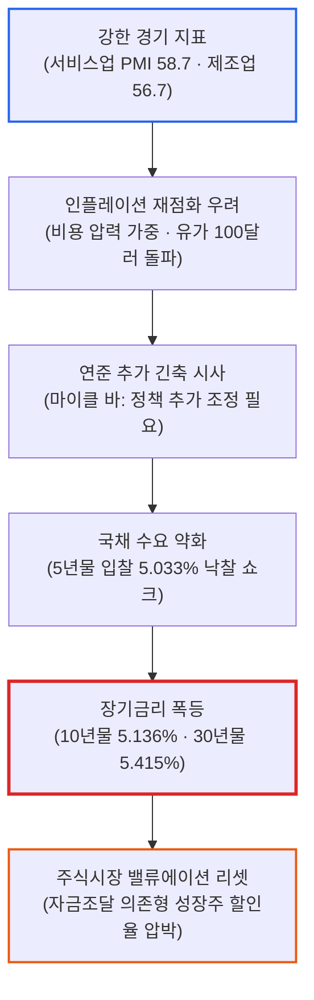
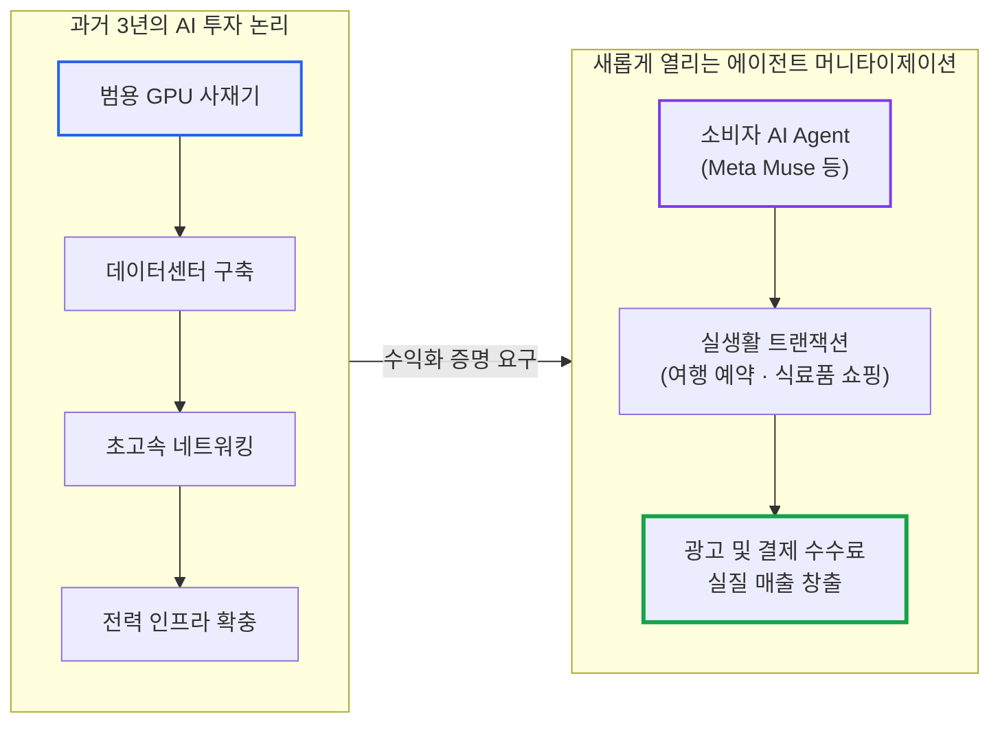

# 2026년 09월 24일(목) 하루치 뉴스정리

- **작성일**: 2026-09-24

지금 시장은 **“AI 버블이 끝났다”가 아니라, ‘5% 금리에서도 이익과 현금흐름을 증명할 수 있는 기업만 살아남는 구간’으로** 넘어가고 있으며, 'AI vs 비AI'의 단순 이분법이 아닌 **'현금창출 AI vs 자금조달형 AI'의** 냉혹한 분화가 본격화되었다.

## 요약

| 구분 | 주요 내용 |
| :--- | :--- |
| **핵심 진단** | 미 10년물 장중 5.136%, 30년물 5.415% 폭등 및 나스닥 -1.13% 하락. VIX 15.18 유지 속 고금리 할인율 재조정 장세 |
| **핵심 종목 팩트** | 5년물 국채 입찰 5.033% 낙찰 쇼크, WTI $92.16·브렌트 $103.08 고유가 재점화, 서비스업 PMI 58.7로 연준 긴축 공포 확대 |
| **착시 교정** | "재무부 바이백 확대로 장기금리 안정" 환상 파탄. 재무부 바이백은 QE가 아니며 시장의 채권 기피를 막지 못함 |
| **돈길 확산 신호** | 토큰 지출 둔화 속 자금조달형(CoreWeave) 리스크 부각 vs 압도적 FCF(MSFT) 및 소비자 Agent 커머스(Meta Muse) 부상 |
| **가장 더러운 변수** | 5% 국채금리 고착화 및 9월 24일 7년물 국채 입찰. 브로드컴 중국 국유 데이터센터 스위치 의존도 조사 악재 |
| **계좌 행동 지침** | 낙폭 과대 착시 성장주 섣부른 매수 엄금. 부채 의존 AI 인프라 배제, FCF 창출 우량주 및 액체냉각 등 실수혜주 집중 |

---

## 1. 결론부터: AI 버블 종료가 아니라, 5% 금리 생존 기업의 옥석 가리기다

지금 시장은 **“AI 버블이 끝났다”가 아니다.**

정확히는 **‘5% 금리에서도 이익과 현금흐름을 스스로 증명할 수 있는 기업만 살아남는 구간’으로** 가차 없이 넘어가고 있다.

9월 23일 미국 정규장은 나스닥이 **-1.13% 하락하며** 조정을 받았다. 미국 10년물 국채금리는 장중 **5.136%까지** 치솟았고, 30년물은 무려 **5.415%까지** 폭등했다. 

그런데 공포지수인 VIX는 **15.18에** 불과했고 에너지 업종은 오히려 상승했다. 이건 시스템 위기로 인한 패닉성 투매가 아니다. **고금리를 견디기 힘든 고평가 자산을 털어내고 장기 할인율을 반영하는 질서정연한 밸류에이션 재조정**에 가깝다.

이번 충격은 결코 "채권 시장이 하루 흔들렸다" 수준의 단기 해프닝이 아니다. 아래와 같은 강력한 매크로 악순환 연결고리가 시장을 옥죄고 있다:



---

## 2. 가장 위험한 숫자는 나스닥 -1.13%가 아니라 미국 10년물 5.13%다

이번 시장에서 전광판의 주가 등락 따위를 쳐다보는 자는 본질을 완전히 놓친다. 지금 진짜 피를 흘리며 경고를 울리는 곳은 채권과 원자재 시장이다.

### 오늘 시장의 핵심 팩트 지표

| 지표 구분 | 시장 수치 | 냉혹한 시장 평가 |
| :--- | :---: | :--- |
| **미국 10년물 국채금리** | **장중 5.136%** | 주식 밸류에이션의 심장부를 직격하는 임계선 돌파 |
| **미국 30년물 국채금리** | **5.415%** | 초장기 자금 조달 비용의 급격한 상승 |
| **5년물 국채 입찰금리** | **5.033%** | 직전 입찰(4.393%) 대비 폭등, 발행 물량 소화 난항 |
| **브렌트유 선물** | **103.08달러** | 100달러 재돌파, 인플레이션 하방 경직성 강화 |
| **WTI 원유 선물** | **92.16달러** | 에너지 비용 급증으로 기업 마진 압박 |
| **변동성지수(VIX)** | **15.18** | 투매성 패닉 부재, 침착한 할인율 리셋 진행 증명 |

즉 주식시장은 지금 **고금리 + 고유가 + 강한 경기**라는 3중 파도를 동시에 얻어맞고 있다.

특히 재무부의 5년물 국채 입찰 결과는 대단히 불길했다. 700억 달러 규모가 **5.033%에** 낙찰되었으며, 시장 금리보다 더 얹어주어야만 간신히 물량이 소화되는 '테일(Tail)'이 발생했다.

이 데이터가 웅변하는 진실은 명확하다:

> **“금리가 5%나 되니 채권 매수세가 들어오겠지”가 통하지 않는다.** 시장은 5%의 고금리를 쥐어줘도 “채권을 더 싸게 내놓지 않으면 안 받겠다”며 배짱을 부리고 있다.

발행 주체인 정부조차 채권을 소화하기 버거워하는데, 주식 시장의 미래 현금흐름이 무사할 리 만무하다.

---

## 3. 더 심각한 건 연준이다: 침체가 아니라 '너무 잘 버텨서' 맞은 매

이번 금리 상승을 단순한 재무부 국채 발행 수급 탓으로 돌리면 거대한 오판을 범하게 된다.

미국 서비스업 PMI가 **58.7**, 제조업 PMI가 **56.7까지** 치솟으며 실물 경기가 무서울 정도로 팽창하고 있다는 지표가 확인되었다. 경기 과열과 더불어 투입 비용 압력 역시 재차 강해졌다.

여기에 마이클 바 연준 금융감독 담당 부의장의 발언이 쐐기를 박았다:

> "경제 성장과 노동시장은 견조한 반면, 인플레이션은 여전히 2% 목표를 웃돌고 있으며 목표치로 충분히 빠르게 복귀하고 있다는 확신이 부족하다. 이에 따라 **추가적인 통화정책 조정(추가 금리 인상)이 필요할 가능성**이 높다."

현재 시장의 딜레마는 **경기침체 때문에 주가가 빠지는 것이 결코 아니다.** 

오히려 정반대다:

- 경기침체 국면이라면 연준의 '금리 인하'라는 든든한 비상 탈출구가 열린다.
- 그러나 지금은 **경제가 너무 잘 버티는데 물가마저 안 죽으니, 연준이 금리를 더 올리거나 고금리를 장기화할 명분**만 쌓이고 있다.
- 결국 주식시장이 목 빠지게 기다리던 금리 인하라는 출구 자체가 저 멀리 뒤로 밀려나 버렸다.

---

## 4. '재무부 바이백 확대 = 금리 하락'이라는 환상의 종말

시장 일각에서 품었던 헛된 기대 하나가 오늘 완벽히 깨졌다.

미 재무부는 지난 8월 장기채 유동성 지원을 위한 국채 바이백 규모를 기존 회당 최대 20억 달러에서 최소 40억 달러 이상으로 2배 넘게 확대하겠다고 공식 발표했다. 이번 입찰 국면에서도 20~30년물에 대해 최대 60억 달러 바이백이 집행될 것이라는 보도가 나왔다.

그러나 장기금리는 안정을 찾기는커녕 오히려 더 치솟았다.

여기서 아마추어 같은 착각을 버려야 한다:

- **재무부 바이백은 양적완화(QE)가 아니다.**
- 연준이 발권력을 동원해 시중에 영구적으로 돈을 살포하며 장기채 금리를 인위적으로 짓누르던 QE와는 메커니즘 자체가 완전히 다르다. 재무부 바이백은 단지 단기채를 찍어 장기채를 사들이는 유동성 관리 기술에 불과하다.
- 따라서 **“바이백 확대 ➔ 장기금리 하락 ➔ 나스닥 폭등”이라는 1차원적 방정식은 이미 시장에서 폐기처분**되었다.

---

## 5. 대중의 눈먼 착시: "금리 올랐으니 AI 끝났다?"

매크로 지표 몇 줄 보고 “금리가 5%를 넘었으니 AI 랠리는 이제 완전히 끝났다”고 단언하는 것 역시 게으른 흑백논리다.

AI 생태계 내부에서는 겉으로 드러난 지수와 전혀 다른 구조적 재편이 일어나고 있다.

### 메모리는 여전히 가격 결정력을 증명하고 있다

씨티(Citi)는 마이크론(MU)의 DRAM과 NAND 블렌디드 ASP(평균판매단가) 전망을 대폭 상향 조정했다:

- **FY26 Q4 전망**: DRAM **+13%**, NAND **+34% (QoQ)**
- **FY27 Q1 전망**: DRAM **+20%**, NAND **+15% (QoQ)**

이 수치는 여전히 HBM과 서버용 고성능 메모리의 공급 제약이 강력하다는 것을 증명한다.

반면 마이클 버리는 마이크론 숏(Short) 포지션을 잡고 맞서고 있다. 레거시 DDR4 일부에서 공급과잉 조짐이 관측되고 있으며, 글로벌 반도체 생산 설비 증가가 결국 판가를 무너뜨릴 것이라는 논리다.

누가 맞는가? **둘 다 일정 부분 진실을 말하고 있다.**

메모리는 결코 단일한 시장이 아니다:

- 고대역폭메모리(HBM), 최신 DDR5, 엔터프라이즈 서버 메모리는 극심한 품귀다.
- 구형 PC·모바일용 DDR4에서 재고가 느슨해지는 것은 물리적으로 동시에 발생할 수 있다.

따라서 **“DDR4 일부 과잉 관측 ➔ AI 메모리 슈퍼사이클 종료”로 비약하는 것은 공포에 질린 호들갑**이다.

반대로 **“지금 판가가 뛰니 메모리는 영원히 공급 부족일 것”이라는 환상 역시 위험**하다. 씨티조차 가격 상승 탄력이 둔화되며 2027년 2분기 전후로 사이클의 정점에 도달할 가능성을 경고하고 있다. 사이클 산업의 끝은 항상 공급 과잉이었음을 잊어서는 안 된다.

---

## 6. AI 내부에서 울린 진짜 경고음: 토큰 지출 둔화와 자금조달 리스크

금리보다 더 뼈아프게 봐야 할 진짜 내부 균열 신호가 피델리티(Fidelity) 분석을 통해 드러났다.

최근 AI 트레이드 중 메모리 분야를 제외하면 대다수 인프라주의 성과가 지지부진했던 원인이 데이터로 증명되고 있다:

- **① LLM 토큰 지출 지수 하락**: 모델 추론에 실질적으로 소비되는 토큰 비용 지출 증가세가 정체 국면에 진입.
- **② H100 / A100 GPU 클라우드 임대료 상승 둔화**: 초기 폭발적 프리미엄이 점차 안정화·하향 수렴.
- **③ AI 인프라 기업들의 무리한 자금 조달**: 주식 대량 발행(유상증자) 및 고금리 전환사채(CB) 남발.

여기서 시장이 던지는 질문의 본질이 통째로 바뀌었다:

```
과거의 질문: "AI 인프라 수요가 과연 존재하는가?"
현재의 질문: "천문학적인 AI 자본적 지출(CAPEX)을 정당화할 만큼 실제 현금이 회수되는가?"
```

이 질문의 이동은 치명적이다. 

AI 수요가 아무리 폭발해도, **남의 빚을 끌어다 GPU 서버를 사는 회사**와 **자기 금고의 잉여현금으로 서버를 사는 회사**의 운명은 5% 금리 장벽 앞에서 완전히 갈라질 수밖에 없다.

---

## 7. 현금창출 AI(MSFT) vs 자금조달형 AI(CoreWeave): 같은 AI주가 아니다

코어위브(CoreWeave) 뉴스는 지금 시장이 무엇을 벌하고 무엇을 우대하는지 명확히 보여주는 교과서다.

### 두 유형의 냉혹한 대조

| 구분 범주 | 자금조달형 AI 인프라 (CoreWeave 등) | 현금창출형 메가캡 AI (Microsoft 등) |
| :--- | :--- | :--- |
| **비즈니스 본질** | 부채와 지분 희석으로 GPU 클러스터 구축 | 자체 독점 플랫폼(Windows·Office·Azure) 캐시카우 |
| **자금 조달 방식** | **30억 달러 전환사채(CB)**, 신주 발행 유상증자 | **막대한 자체 영업현금흐름(OCF)** 기반 내부 조달 |
| **주주 가치 영향** | 대규모 주식 희석 및 신용 스프레드 위험 노출 | 적극적인 자사주 매입 및 배당, 무차입에 가까운 요새 |
| **10년물 5% 환경** | 조달 이자 비용 폭증 및 밸류에이션 급격 붕괴 | 높은 금리 환경에서도 자체 자금으로 인프라 독점 지속 |
| **시장 최종 판정** | **고금리 취약 자산 (위험 경고)** | **상대적 안전자산 및 구조적 승자** |

10년물 국채금리가 5%를 뚫고 올라가는 세상에서 레버리지는 축복이 아니라 독약이다.

앞으로의 증시는 **'AI주 vs 비(非)AI주'라는** 유치한 테마 싸움이 아니다. 

철저하게 **'자체 현금으로 투자하는 AI vs 남의 돈 빌려 버티는 AI'의** 계급 분화 장세다. 이것이 오늘 시장에서 반드시 건져내야 할 가장 핵심적인 패러다임 변화다.

---

## 8. 브로드컴(AVGO) 약세를 보는 법: 금리 충격 + 중국 국산화 리스크

브로드컴(AVGO)의 최근 약세를 단순히 "매크로 금리가 올라서 같이 빠졌다"고 퉁치는 것은 위험한 분석 태만이다.

실제 기업 고유의 악재성 보도가 터져 나왔다:

> 중국 국유자산감독관리위원회(SASAC)가 **중국 국유 데이터센터 내 브로드컴 스위치 의존도를 전수 조사**하고 있으며, 자국산 네트워크 장비 사용 확대를 검토하고 있다는 소식이 전해졌다.

여기서 팩트와 노이즈를 칼같이 발라내야 한다:

- **확정된 사실**: 중국 정부가 AI 및 반도체 인프라 전반의 국산화 정책 드라이브를 구조적으로 강화하고 있다는 명백한 방향성.
- **보도 단계의 사실**: 브로드컴 스위치에 대해 구체적으로 어떤 범위와 기한으로 배제 지침이 내려올지는 미확정.

“중국 데이터센터에서 브로드컴이 내일 당장 전면 퇴출당했다”고 말하는 것은 과장이다.

그러나 이것이 "주가에 아무 영향 없는 노이즈"라고 치부하는 것 역시 현실 부정이다.

브로드컴의 토마호크(Tomahawk), 제리코(Jericho) 등 이더넷 스위칭 칩 시장 지배력이 워낙 압도적이었던 만큼, 거대한 단일 시장인 중국이 자체 ASIC 및 로컬 스위치로 대체를 가속화한다면 **점유율과 가격 협상력에는 구조적 하방 압력**이 될 수밖에 없다.

여기에 마벨(MRVL)이 구글 등 빅테크의 커스텀 실리콘 및 광통신 수주를 공격적으로 확대하고 있다는 점도 단기적인 멀티플 비교 압박으로 작용한다.

다만 이 뉴스 하나로 브로드컴의 AI 네트워킹 초격차와 장기 커스텀 ASIC 성장 스토리가 끝장났다고 보는 것 또한 어리석은 극단론이다.

---

## 9. 스마트머니의 시선: 소비자 AI Agent에서 열리는 새로운 돈길

반대로 오늘 시장에서 가장 주목해야 할 긍정적 불씨는 메타(Meta)에서 피어올랐다.

메타의 AI 비서 **'뮤즈(Muse)'는** 출시 직후 전례 없는 사용자 유입을 기록하고 있다:

- **JP모건 데이터 집계**: 출시 **12일 만에 미국 iOS 다운로드 143만 건**, 일간 활성 사용자수(DAU) 약 **55.7만 명** 확보.
- **실물 서비스 연동 개시**:
    - **익스피디아(Expedia)**: 항공권 및 호텔 여행 예약 자동화
    - **인스타카트(Instacart)**: 식료품 장바구니 담기 및 결제 연계
    - **구독 관리 및 쇼핑**: 일상 소비 트랜잭션 침투



이 변화의 무게감은 엄청나다.

지난 3년간의 AI 랠리는 오직 **`GPU ➔ 데이터센터 ➔ 네트워크 ➔ 전력`**이라는 하드웨어 공급망에 돈을 쏟아붓는 과정이었다.

하지만 지금 시장은 사상 처음으로 **`AI Agent ➔ 실질 소비자 행동 ➔ 상거래 트랜잭션 ➔ 광고 및 수수료 현금흐름`**으로 이어지는 최종 회수 루프를 목격하기 시작했다.

물론 아직 초기 단계라 막대한 인프라 비용을 전액 상쇄할 수준의 순이익이 찍힌 것은 아니다. 하지만 이것이 실제 커머스 매출로 환산되기 시작하는 순간, 그동안 빅테크가 집행한 천문학적 CAPEX의 정당성은 확고부동해진다.

---

## 10. 고금리 5% 시대, 스마트머니가 보상하는 자산 vs 버리는 자산

첨부된 단편 뉴스들만 보고 "기관이 지금 특정 종목을 대량 매집 중이다"라고 단정하는 것은 허구다. 시장에 그런 식의 마법 같은 만능 공식은 없다.

그러나 고금리 환경에서 **스마트머니가 어떤 특성을 가진 기업에 프리미엄을 주고, 어떤 껍데기를 가차 없이 내던지는지**는 명확히 드러났다.

### 시장의 냉혹한 차별화 매트릭스

| 시장의 선택 | 핵심 조건 및 비즈니스 특성 | 대표 수혜 및 피해 영역 |
| :--- | :--- | :--- |
| **자본이 몰리는 곳<br>(보상받는 자산)** | **① 압도적 잉여현금흐름(FCF)**<br>- 남의 손을 빌리지 않고 자체 현금으로 CAPEX 집행 가능<br>**② 대체 불가능한 가격 결정력**<br>- 판가(ASP) 인상을 고객에게 온전히 전가할 수 있는 독점 구조<br>**③ 피할 수 없는 물리적 병목**<br>- AI 확산 시 필수불가결한 현실 인프라 | - Microsoft 등 현금 부자 빅테크<br>- HBM 및 서버용 메모리 독과점 기업<br>- 데이터센터 액체냉각(Liquid Cooling), 전력망, 핵심 장비 |
| **자본이 이탈하는 곳<br>(버려지는 자산)** | **① 만성 적자 및 고부채 구조**<br>- 영업이익으로 이자 비용 감당 불가<br>**② 끊임없는 외부 자금 조달 의존**<br>- 유상증자, 전환사채 발행으로 기존 주주가치 훼손<br>**③ 먼 미래의 꿈만 파는 기업**<br>- 10년물 5.1%의 무자비한 할인율 앞에서 미래 가치 증발 | - 부채 조달 기반의 AI 네오클라우드<br>- 실적 실체 없이 AI 간판만 단 테마주<br>- 높은 밸류에이션의 적자 소프트웨어 기업 |

미국 10년물 국채금리가 **5.1%를** 뚫고 올라선 환경에서는, 장부상 이익도 없는 기업들의 '10년 뒤 미래 현금흐름' 가치는 매일 빛의 속도로 깎여나간다.

---

## 11. 팩트와 노이즈의 분리: 확정 / 추정 / 시장 해석 / 과장 구분

| 구분 범주 | 시장 데이터 및 분석 팩트 |
| :--- | :--- |
| **① 확정된 사실<br>(Confirmed Facts)** | - 미 10년물 장중 5.136%, 30년물 5.415% 급등, 나스닥 -1.13% 마감<br>- 5년물 국채 입찰 5.033% 낙찰 (시장금리 웃도는 테일 발생)<br>- 미국 서비스업 PMI 58.7, 제조업 PMI 56.7 (비용 압력 증가)<br>- 마이클 바 연준 부의장, 통화정책 추가 조정 가능성 공식 언급<br>- Meta Muse 미국 iOS 12일간 다운로드 143만 건, DAU 55.7만 명<br>- 씨티, 마이크론 메모리 ASP 두 자릿수 QoQ 상승 전망 제시 |
| **② 신뢰도 높은 추정<br>(High-Confidence Estimates)** | - 미국 경기의 견조함으로 인해 연준의 금리 인하 출구가 뒤로 밀림<br>- 재무부 바이백 확대만으로는 장기 국채금리 상승을 막을 수 없음<br>- HBM·DDR5는 품귀가 이어지나 구형 DDR4는 공급 완화가 공존<br>- CoreWeave 등 부채 조달형 AI 인프라의 밸류에이션 부담 가중 |
| **③ 시장의 일반적 해석<br>(Market Narratives)** | - "5% 금리 발작으로 나스닥 기술주 전면 약세장 진입"<br>- "DDR4 공급 증가 징후로 반도체 슈퍼사이클 정점 도달"<br>- "뮤즈의 성공으로 메타의 에이전틱 커머스 수익화가 조기 입증"<br>- "재무부 국채 바이백은 장기채 유동성을 지탱하는 안전판" |
| **④ 경계해야 할 과장<br>(Dangerous Hype)** | - **“나스닥 빠졌으니 AI 버블은 끝났다”** ➔ 단순 할인율 조정과 산업 성장의 혼동<br>- **“중국이 브로드컴을 전면 퇴출했다”** ➔ 국유 데이터센터 의존도 조사 단계일 뿐<br>- **“재무부 바이백으로 채권금리 폭락한다”** ➔ 바이백은 QE가 아니며 이미 반작용 확인<br>- **“모든 AI 주식은 결국 오른다”** ➔ 외부 조달형 적자 기업은 5% 금리에 파산 가능 |

---

## 12. 종합 결론 및 계좌 실전 대응 로드맵

### 시장 상황 최종 판정 매트릭스

| 분석 영역 | 현재 시장 판단 | 핵심 근거 및 상태 |
| :--- | :---: | :--- |
| **미국 경기** | **매우 강함** | 서비스업 PMI 58.7, 제조업 PMI 56.7로 견고한 확장세 |
| **인플레이션** | **재상승 위험 고조** | 유가 100달러 돌파 및 견조한 고용에 따른 투입 원가 상승 |
| **연준 통화정책** | **추가 긴축 압박 증대** | 2% 복귀 불확실, 마이클 바 등 매파적 정책 조정 시사 |
| **미국 국채** | **현재 시장 최대 리스크** | 10년물 5.13% 돌파, 입찰 테일 발생 등 수급 악화 |
| **증시 전체** | **붕괴 신호 아님** | VIX 15.18 불과, 침착한 할인율 리셋 및 섹터 로테이션 |
| **AI 투자 사이클** | **선별 및 옥석 가리기 국면** | 자금조달형 탈락, 현금창출형 및 핵심 병목 기업 생존 |
| **메모리 반도체** | **단기 강력, 중기 피크아웃 경계** | HBM 타이트하나 2027년 상반기 정점 가능성 주시 |
| **AI 인프라** | **레버리지 기업 위험 급증** | 고금리 장기화에 따른 전환사채·차입 기업 직격탄 |
| **대형 기술주** | **압도적 상대 우위** | 막대한 내부 FCF로 외부 자금 조달 리스크 제로 |
| **브로드컴(AVGO)** | **장기 논리 유효, 단기 변수 확인** | 중국 국산화 조사 및 ASIC 경쟁은 팩트 점검 필요 |

### 지금 계좌에서 즉각 실행해야 할 4대 행동 지침

지금 공포에 질려 우량 성장주를 시장가로 투매할 하등의 이유는 없다. 

VIX가 여전히 15선에 머물고 있으며 시장 하락 또한 철저히 할인율에 반응하는 질서정연한 흐름이다. 시스템 붕괴의 징후는 어디에도 없다.

다만 안이한 물타기 습관은 당장 뜯어고쳐야 한다:

- **① 10년물 5%를 무시하고 단순히 '고점 대비 많이 빠졌다'는 이유로 사지 마라**:
    - 지금 주식의 선행지표는 차트가 아니라 10년물 국채금리다. 금리가 꺾이지 않는 한 밸류에이션 하단은 계속 밑으로 열린다.
- **② 현금흐름 깡패 기업과 외부 조달 의존 기업을 엄격히 분리하라**:
    - 마이크로소프트처럼 제 돈으로 공장 짓는 기업과, 코어위브처럼 전환사채 찍어 연명하는 기업을 같은 바구니에 담는 우를 범하지 마라.
- **③ 메모리 '영원한 품귀'라는 환상을 버려라**:
    - 당장의 실적은 눈부시겠지만, 씨티조차 2027년 2분기 정점을 언급하고 있다. 가격 상승률의 둔화 시점을 매 분기 차분히 트래킹하라.
- **④ 브로드컴(AVGO)의 악재를 가볍게 넘기지 마라**:
    - "좋은 회사인데 왜 빠지지?"라며 단순 저가 매수로 덤비지 마라. 금리 발작에 중국 국산화 조사, ASIC 경쟁 구도가 겹쳐 있다. 장기 펀더멘털은 견고하나 단기 지지선 확인이 필수적이다.

### 바로 앞의 관문: 9월 24일 미 7년물 국채 입찰 시나리오

| 시나리오 | 7년물 입찰 결과 및 금리 반응 | 시장 파급 경로 | 계좌 실전 대응 방침 |
| :--- | :--- | :--- | :--- |
| **위험 시나리오** | 7년물 응찰률 저조 및 금리 테일 발생<br>(10년물 5.15% 돌파 안착) | 장기채 기피 심화 ➔ 할인율 발작 확대 ➔ 고멀티플 기술주 2차 투매 | 현금 비중 25% 이상 사수, 섣부른 매수 중단 및 지지선 확인 대기 |
| **중립 시나리오** | 7년물 무난한 소화<br>(10년물 5.05~5.10% 박스권 횡보) | 지수 눈치 보기 횡보 ➔ 현금창출 실적주 중심의 극심한 차별화 | 부채 많은 적자주 정리, FCF 우량 대형주 눌림목 분할 매수 |
| **안도 시나리오** | 7년물 강력한 수요 확인<br>(10년물 5.0% 아래로 하향 안정) | 매크로 공포 완화 ➔ 눌렸던 우량 성장주의 강력한 밸류에이션 리셋 반등 | 브로드컴, 메모리, 빅테크 등 낙폭과대 1등주 저격 매수 |

지금 시장에서 저지를 수 있는 가장 치명적인 바보짓은 **“나스닥이 밀렸으니 AI는 사기였다”며** 포기하는 것도 아니고, **“AI는 무조건 가니까 아무거나 사자”며** 적자 기업을 주워 담는 것이다.

앞으로는 **AI의 수요보다 'AI의 경제성(ROE/ROIC)'을**, **매출 성장률보다 '자금조달 구조와 잉여현금흐름'을** 봐야 한다.

이것이 5% 고금리 장벽 앞에서 시장이 우리에게 내린 단 하나의 냉혹한 명령이다.

!!! tip "최종 핵심 제언 (Executive Takeaway)"
    AI 랠리가 끝난 것이 아니다. **‘돈이 공짜였던 값싼 AI 랠리’가 끝나고, ‘진짜 돈을 벌어오는 AI만 살아남는 성인식’이 시작된 것**이다.
    
    10년물 5% 시대에는 간판만 그럴듯한 껍데기 기업부터 차례대로 침몰한다. 빚을 내어 서버를 사고 지분을 희석해 연명하는 자금조달형 기업을 계좌에서 즉각 퇴출하라.
    
    자체 잉여현금흐름으로 AI 인프라를 독식하는 메가캡(MSFT), 가격 결정력을 쥔 핵심 메모리, 그리고 데이터센터 액체냉각과 전력망 같은 현실 세계의 물리적 병목에만 집중하라. 9월 24일 7년물 국채 입찰을 지켜보며, 매크로 발작이 만들어내는 우량주의 밸류에이션 리셋 자리를 침착하게 저격하라.
