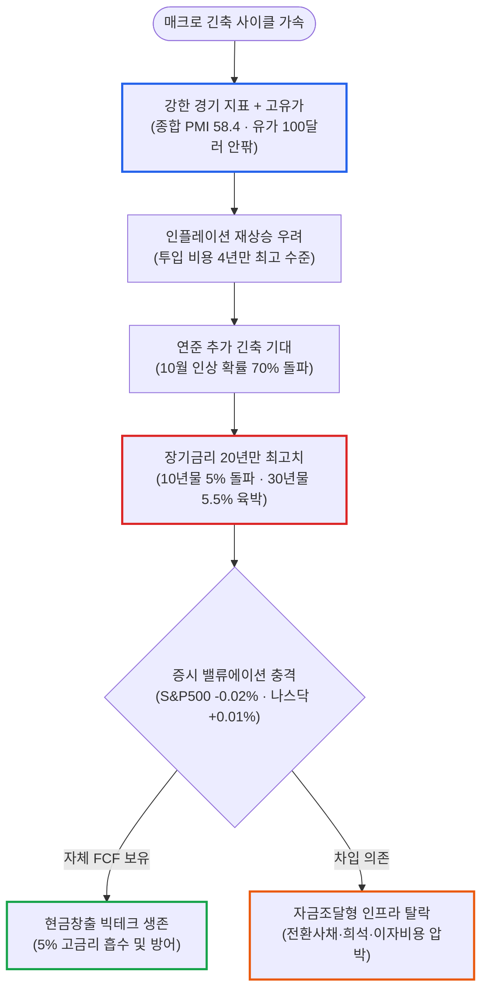
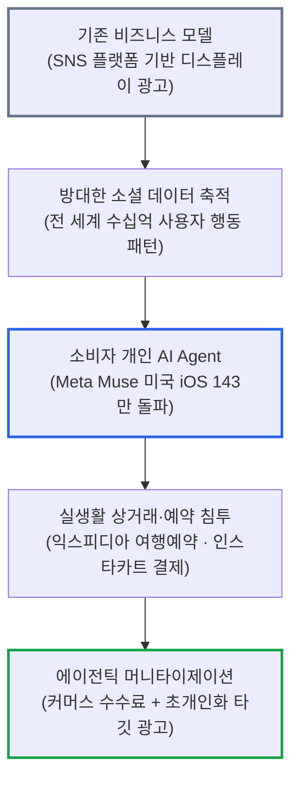
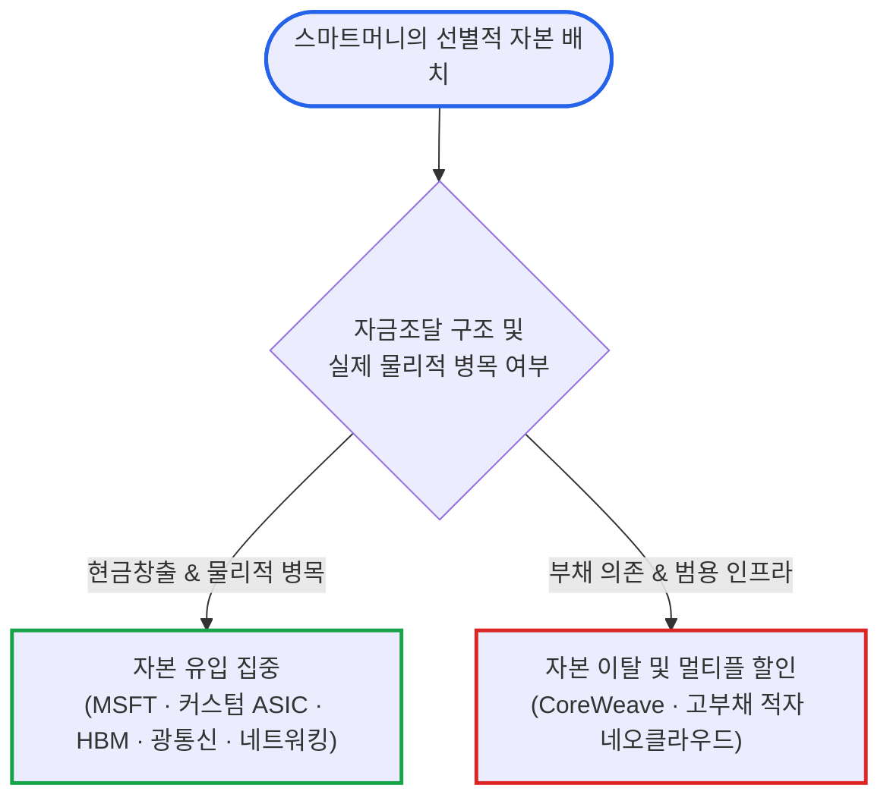

# 2026년 09월 25일(금) 하루치 뉴스정리

- **작성일**: 2026-09-25

지금 시장은 단순히 경기가 좋아서 주식이 오르는 장이 아니라, **강한 경기와 고유가가 촉발한 장기금리 5% 발작 속에서 이 충격을 견딜 수 있는 현금창출 기업과 그렇지 못한 기업이 냉혹하게 갈라지는 차별화 장세다.**

## 요약

| 구분 | 주요 내용 |
| :--- | :--- |
| **핵심 진단** | 미 10년물 5% 돌파·30년물 5.5% 육박(20여 년만 고점). 강한 경기+고유가 발작에도 S&P500(-0.02%), 나스닥(+0.01%) 버티며 옥석 가리기 진행 |
| **핵심 종목 팩트** | 9월 미 종합 PMI 58.4(5년만 최고), 10월 연준 금리 인상 확률 70% 돌파. 유가 장중 급등 후 호르무즈 협상 소식에 상승폭 줄여 브렌트 $106.60·WTI $94.61 마감 |
| **착시 교정** | ① 재무부 바이백 확대(한도 60억 달러/실제 40.8억 달러)는 QE가 아닌 단순 유동성 지원, ② 호르무즈 협상 타결돼도 미 경제 과열과 재정 적자 지속 |
| **돈길 확산 신호** | 빚내서 AI 하는 인프라(CoreWeave·Oracle) 할인 vs 압도적 현금창출 빅테크(MSFT·Meta) 차별화. Meta Muse(12일간 143만 다운로드) 에이전틱 커머스 확장 |
| **가장 더러운 변수** | 10년물 5.2% 이상 안착 시 성장주 밸류에이션 직접 타격. 중국 국유 데이터센터의 브로드컴 스위치 의존도 조사 악재 |
| **계좌 행동 지침** | 지수 폭락 공포에 전량 현금화 금지. 빚으로 버티는 인프라주 배제, 현금흐름 깡패 빅테크 및 현실 병목(ASIC·네트워킹·HBM·광통신) 압축 |

---

## 1. 결론부터: 경기가 좋아서 주식이 오른다는 순진한 착각을 버려라

지금 시장은 **“경기가 좋아서 주식이 오른다”는 단순한 장이 아니다.**

정확히는 아래와 같은 잔혹한 매크로 연결고리가 주식시장의 밸류에이션을 정면으로 압박하고 있다:

**강한 경기 + 고유가 ➔ 인플레이션 재상승 우려 ➔ 연준 긴축 기대 ➔ 장기금리 상승 ➔ 증시 밸류에이션 압박**

그런데 여기서 더 중요하게 봐야 할 팩트가 있다. **그 정도의 극단적인 금리 충격에도 S&P 500과 나스닥이 거의 완벽하게 버텨냈다는 점이다.**

24일 정규장에서 S&P 500은 **-0.02%**, 나스닥은 **+0.01%였다.**

그러니까 지금은 증시 전체가 무너져 내리는 패닉 장세가 아니다. **‘금리 5%대를 자체 현금흐름으로 견딜 수 있는 기업’과 ‘그렇지 못한 채 빚에 허덕이는 기업’이 가차 없이 갈라지는 차별화 장세**에 훨씬 가깝다.

---

## 2. 지금 시장에서 가장 중요한 숫자는 주가가 아니라 금리다

미국 10년물 국채금리는 **5%를** 넘어섰고, 30년물은 **5.5% 부근까지** 치솟으며 20여 년 만의 고점 영역에 진입했다. 로이터(Reuters) 역시 이번 장기금리 폭등을 강한 경제성장, 높은 에너지 가격, 정부부채 부담이 동시에 작용한 결과로 분석하고 있다. ([Investing.com](https://www.investing.com/news/economy-news/us-30year-bond-yield-rises-to-highest-since-2004-as-selloff-deepens-4914677))

이 현상을 단순히 “유가가 뛰어서 금리가 올랐다”고만 해석하면 시장의 절반밖에 보지 못하는 것이다.

### 현재 금리를 밀어 올리는 4대 핵심 축

| 원인 | 현재 상황 | 시장이 마주한 진짜 의미 |
| :--- | :--- | :--- |
| **미국 경기** | **매우 강함** | 연준의 금리 인하 명분 급격 약화 |
| **인플레이션** | **에너지·서비스 압력 가중** | 연준의 추가 긴축(금리 인상) 가능성 부각 |
| **국채 공급 / 재정** | **장기채 수급 부담 심화** | 기간 프리미엄(Term Premium) 구조적 상승 |
| **중동 지정학 리스크** | **유가 변동성 극대화** | 기대 인플레이션 불안 가중 |

특히 9월 S&P Global 미국 종합 PMI가 **56.0에서 58.4로** 수직 상승하여 2021년 7월 이후 가장 강한 확장세를 기록했고, 기업들의 투입 비용 상승 압력 역시 거의 4년 만에 가장 가파르게 나타났다.

S&P Global 스스로도 이를 **'강한 경제성장과 끈질긴 인플레이션이 동반되는, 금리에 매우 매파적인 신호'라고** 평가했다. ([S&P Global](https://www.spglobal.com/market-intelligence/en/news-insights/research/2026/09/us-flash-pmi-signals-fastest-growth-for-over-five-years-in-september))

여기에 CME FedWatch에서도 **10월 연준 추가 금리 인상 가능성이 70%를 넘어선 상태**가 확인된다. ([CME Group](https://www.cmegroup.com/videos/2026/09/23/euro-futures-drop-to-8-week-lows-amid-hawkish-fed-speak-9-23-26.html))

즉 지금 채권시장이 경고하는 바는 단순하고 명확하다:

> **“경기침체가 무서운 게 아니다. 경제가 도무지 식지 않아서 금리를 내리지 못하는 게 진짜 공포다.”**

---

## 3. 첫 번째 착시: “재무부 바이백이 금리를 내려줄 것이다”

여기서 시장 참여자들이 계속해서 헷갈려 하는 치명적인 착시가 있다.

미 재무부는 9월 9일부터 장기채 바이백의 회차당 규모를 기존 최대 20억 달러에서 최소 40억 달러로 늘렸고, 24일 20~30년물 회차에서는 **한도를 60억 달러까지** 제시했다.

그런데 결과는 어떠했는가? 시장금리는 안정을 찾기는커녕 오히려 더 치솟았다. 24일 회차의 60억 달러 한도 가운데 **실제 매입은 약 40.8억 달러에 그쳤고, 같은 날 7년물 국채 입찰마저 약하게** 나왔다. ([U.S. Treasury Fiscal Data](https://fiscaldata.treasury.gov/datasets/treasury-securities-buybacks/))

하지만 “재무부가 국채를 사주는데 왜 금리가 안내려가는가?”라는 질문 자체가 잘못되었다:

- **바이백은 연준의 양적완화(QE)가 아니다**: 재무부가 공식적으로 밝힌 바이백 확대 목적은 장기금리를 인위적으로 찍어 누르는 통화정책(QE)이 아니라, 장기채 시장의 기능 유지를 위한 '유동성 지원'에 불과하다. ([U.S. Department of the Treasury](https://home.treasury.gov/news/press-releases/sb0607))
- **매크로 펀더멘털을 거스를 수 없다**: 현재 장기금리를 진짜로 끌어내리려면 바이백 몇십억 달러라는 기술적 조작이 아니라, **유가 안정 + 인플레이션 둔화 + 경기 둔화 + 국채 수급 개선** 중 최소 몇 가지가 동시에 확인되어야 한다.

이 차이를 구분하지 못하면 장기채 바닥 잡기에 나섰다가 계좌가 녹아내린다.

---

## 4. 두 번째 착시: “호르무즈만 해결되면 모든 문제가 끝난다”

이 시각 역시 반만 맞고 반은 틀렸다.

미국과 이란은 호르무즈 해협 재개방과 경제 봉쇄 완화를 단계적으로 맞바꾸는 방안을 논의하고 있다. 그러나 로이터(Reuters)가 취재한 내부 관계자들 역시 **양측 모두 먼저 협상 지렛대를 내려놓으려 하지 않는 점이 핵심 장애물**이라고 전한다. ([Internazionale](https://www.internazionale.it/ultime-notizie-reuters/2026/09/24/us-and-iran-discuss-phased-deal-to-reopen-hormuz-and-end-us-blockade-sources-say))

24일 후티 반군의 사우디 미사일 공격으로 유가는 장중 약 5%까지 치솟았지만, 양국 간 단계적 협상 소식이 전해지자 상승 폭을 줄였다. 그래도 브렌트유는 **+3.4% 오른 106.60달러, WTI는 +2.7% 오른 94.61달러에** 마감했다. ([AOL.com](https://www.aol.com/articles/oil-prices-edge-lower-iran-011044000.html))

호르무즈가 열리면 유가에 끼어 있던 막대한 지정학적 프리미엄은 급격히 빠질 수 있다. 그건 분명 증시 전반에 강력한 단기 호재다.

하지만 여기서 절대로 간과해서는 안 될 진실이 있다:

- **유가가 안정된다고 해서 미국의 과열된 경기와 천문학적인 정부 재정 적자·국채 발행 수급 문제까지 사라지는 것은 아니다.**
- 따라서 호르무즈 해협 타결은 금리 급등세를 일시적으로 진정시킬 강력한 촉매는 될 수 있어도, **곧바로 미 10년물이 4%대로 단숨에 복귀할 것이라는 식의 장밋빛 기대는 명백한 과장**이다.

---

## 5. 그런데 주식시장은 의외로 강하다: 5.0%와 5.2%의 경계선

이 대목이 이번 뉴스 묶음에서 가장 예리하게 뜯어보아야 할 핵심이다.

23일에는 10년물 국채금리가 급등하면서 나스닥이 **-1.13% 밀렸지만**, 바로 다음 날 금리가 더 가파르게 올라가는 상황에서도 **나스닥은 +0.01%, S&P 500은 -0.02%로 사실상 완벽한 보합**을 지켜냈다.

이 데이터를 결코 가볍게 넘겨서는 안 된다.

### 시장이 보내는 진짜 신호

투자자들은 여전히 **“금리가 5%대로 높아도, 우량 기업들의 이익 창출력과 AI 투자가 금리 비용을 충분히 상쇄할 수 있다”고** 믿고 있다는 뜻이다.

로이터 역시 높은 금리 환경에도 불구하고 강한 실물 경제, 탄탄한 기업 실적, 빅테크의 지속적인 AI 투자 확대 덕분에 지금까지 주식시장이 금리 충격을 효과적으로 흡수해 내고 있다고 전한다. ([MarketScreener](https://www.marketscreener.com/news/u-s-30-year-bond-yield-rises-to-highest-since-2004-as-selloff-deepens-ce785adedd80f12c))

다만 여기에는 대단히 냉혹한 조건이 붙는다:

- **10년물 5.0%와 5.2%, 그리고 5.5%는 차원이 전혀 다른 문제다.**
- 금리가 다소 높은 것은 강한 경제의 자연스러운 부산물일 수 있다.
- 그러나 금리가 5.2%를 뚫고 계속해서 가속 페달을 밟는다면, 그 시점부터는 기업의 미래 가치평가(멀티플)와 실질 자금조달 비용을 무자비하게 공격하기 시작한다.
- **지금 시장은 정확히 그 심리적·물리적 임계 경계선에 바짝 접근해 있다.**

---

## 6. AI 전체가 끝났다는 해석의 오류: '현금창출 빅테크' vs '차입형 인프라'

AI 생태계 전체가 위기에 빠졌다는 비관론 역시 시장의 단면만 본 1차원적 오독이다.

오히려 이번 국면을 거치며 **AI 내부에서 살아남는 승자와 도태되는 패자의 윤곽이 훨씬 더 선명해지고 있다.**

외부 차입에 목을 매는 AI 인프라 사업과, 자체 영업현금흐름으로 수십조 원의 CAPEX를 감당하는 메가캡 빅테크를 같은 주머니에 넣고 보면 안 된다:

- **마이크로소프트(MSFT)**: 스티펄(Stifel) 분석에서 애저(Azure)의 견고한 성장과 압도적인 현금흐름이 재차 강조되었다. AI 인프라에 막대한 돈을 쏟아붓는 와중에도 다른 하이퍼스케일러보다 외부 자금조달 의존도가 낮다는 점이 5% 고금리 시대 최고의 방어벽으로 평가받는다.
- **코어위브(CoreWeave)**: AI 연산 수요 자체는 폭발적이지만, 지나치게 높은 레버리지(부채비율), 막대한 전환사채(CB) 발행, 주식 가치 희석 리스크로 인해 시장에서 가혹한 밸류에이션 할인을 받고 있다.
- **오라클(ORCL)**: 데이터센터 프로젝트 지연 이슈 역시 같은 맥락이다. AI 수요가 사라져서가 아니라, 인프라를 전례 없는 속도로 밀어붙이는 과정에서 **자금조달 비용 폭증 · 전력망 확보 난항 · 건설 공사비 급등**이라는 냉혹한 물리적 현실의 벽에 부딪힌 것이다.

### 빅테크 캐시카우 vs 차입형 인프라의 냉혹한 대조

| 구분 | 현금창출형 메가캡 빅테크 (MSFT 등) | 차입의존형 AI 인프라 (CoreWeave 등) |
| :--- | :--- | :--- |
| **자금 조달 구조** | 자체 사업(클라우드·SaaS)의 막대한 영업현금흐름 | 은행 대출, 고금리 전환사채(CB), 유상증자 |
| **고금리 5% 환경 영향** | 이자 비용 부담 미미, 경쟁사 대비 투자 격차 확대 | 자금조달 이자 비용 폭증 및 주당순이익(EPS) 희석 |
| **프로젝트 실행력** | 자체 밸런스시트로 중단 없는 데이터센터 완공 | 전력·공사비 인플레이션에 따른 프로젝트 지연 리스크 |
| **시장 평가 및 포지션** | **고금리 속 요새(Safe Haven)** | **밸류에이션 디스카운트 및 할인율 취약 자산** |

---

## 7. 이번 뉴스에서 진짜 큰 변화: Meta Muse의 에이전틱 커머스 확장

메타(Meta)의 AI 비서 '뮤즈(Muse)'는 단순한 신제품 출시 해프닝으로 넘길 사안이 아니다.

출시 **12일 동안 미국 iOS에서 143만 다운로드를 돌파하고 일간 활성 사용자(DAU) 약 55.7만 명을 확보**하며 돌풍을 일으키고 있다. 같은 기간 ChatGPT의 초기 다운로드(137만 건)를 앞선 수치다. JP모건은 아직 이르다는 전제를 달면서도 Muse가 ChatGPT 이후 가장 널리 쓰이는 소비자 AI 앱이 될 잠재력이 있다고 평가했다. ([TechCrunch](https://techcrunch.com/2026/09/21/metas-muse-is-outpacing-chatgpts-early-mobile-launch/), [MarketWatch](https://www.marketwatch.com/story/could-metas-viral-muse-app-be-the-companys-chatgpt-moment-8e7075aa))

여기서 진짜 중요한 것은 다운로드 수치 자체가 아니라 **'비즈니스 모델의 질적 전환 방향'이다**:

Meta는 원래 `SNS ➔ 광고 노출`로 먹고살던 기업이었다.

그러나 Muse가 성공적으로 안착하면 비즈니스 생태계가 완전히 달라진다:

**SNS ➔ 실시간 사용자 데이터 ➔ 개인화된 AI Agent ➔ 실물 커머스·여행 예약·배달·광고 융합**

24시간 만에 익스피디아(Expedia) 호텔 예약(항공권은 추후 지원), 인스타카트(Instacart) 식료품 장바구니, 쇼피파이(Shopify)·페이팔(PayPal) 쇼핑·결제 연동이 연이어 발표된 이유가 바로 여기에 있다. ([TechCrunch](https://techcrunch.com/2026/09/23/everything-new-coming-to-metas-ai-agent-muse/))

아직 “Muse가 제2의 ChatGPT가 되었다”고 축포를 쏘는 것은 섣부른 과장이다.

하지만 **“메타가 생성형 AI 트렌드에서 뒤처졌다”는 세간의 게으른 비관론은 이제 완전히 설 자리를 잃었다.** 이 질적 변화는 반드시 계좌 전략에 반영해야 한다.

---

## 8. 메모리 반도체 공방: 마이클 버리의 숏 vs 씨티의 목표가 상향

이 부분은 반도체 투자자들에게 매우 중요한 분기점이다.

‘빅쇼트’ 마이클 버리는 향후 반도체 설비 증설로 생산량이 수요를 따라잡으면서 메모리 사이클이 다시 꺾일 것이라며 마이크론(MU) 등에 대한 숏(Short) 포지션을 공격적으로 확대했다.

그의 논리 자체는 산업적으로 틀리지 않는다. 메모리는 태생이 극단적인 사이클 산업이다:

**공급 부족 ➔ 판가(ASP) 급등 ➔ 천문학적 CAPEX 투자 ➔ 공급 과잉 ➔ 판가 폭락**

이 사이클은 언젠가는 반드시 끝을 맺는다.

**하지만 “언젠가 끝난다”는 당위와 “지금 당장이 고점이다”는 주장은 완전히 다른 차원의 이야기다.**

현재 씨티(Citi)는 오히려 23일 DRAM과 NAND 가격 가정을 추가 상향하고, FY26 4분기와 FY27 1분기 실적 추정치를 올리면서 마이크론 목표주가를 1,150달러에서 1,300달러로 높였다. 다만 씨티는 앞서 8월 보고서에서 가격 상승 탄력이 향후 4개 분기 동안 점진적으로 둔화되어 **2027년 2분기(2Q27) 전후로 가격이 정점에 도달할 것**으로 내다본 바 있다. ([GuruFocus](https://www.gurufocus.com/news/9093767/citi-revamps-micron-stock-price-target-for-2027), [24/7 Wall St.](https://247wallst.com/investing/2026/09/23/micron-price-target-raised-to-1300-by-citi-on-stronger-dram-pricing-undersupply/))

따라서 현재 확인된 팩트 데이터를 기준으로 냉정히 판정하면 다음과 같다:

1. **단기 수급과 가격 협상력**: 마이클 버리의 성급한 숏보다 강세론자(씨티) 측의 증거가 압도적으로 우세하다.
2. **중장기 공급 리스크**: 2027~2028년 글로벌 설비 증설에 따른 사이클 둔화 위험을 아예 무시하는 맹목적 강세론 역시 치명적으로 위험하다.
3. **결론**: 양측의 주장은 시점의 차이일 뿐, 둘 다 절반씩의 진실을 담고 있다.

---

## 9. 브로드컴(AVGO) 중국 악재: 무시해서도 안 되지만, 과장할 이유도 없다

중국 국유자산감독관리위원회(SASAC)가 국유 데이터센터의 브로드컴 스위치 의존도를 조사하고 자국산 네트워크 장비 사용 확대를 검토하고 있다는 파이낸셜타임스(FT)의 보도는 분명한 실질 악재다. FT에 따르면 일부 국유 데이터센터에서는 브로드컴 스위치가 장비의 최대 90%를 차지하며, SASAC가 사용 축소를 권고하는 비공식 지침을 낼 수 있다. ([Investing.com](https://ca.investing.com/news/stock-market-news/china-reviews-broadcom-switch-use-in-statebacked-data-centres-ft-reports-4848954))

이것을 억지로 장밋빛으로 왜곡할 이유는 전혀 없다. 중국의 네트워크 장비 국산화가 가속화되면 브로드컴의 중국 매출과 스위치 시장점유율에는 구조적인 하방 압력이 발생한다.

**다만 이것을 곧바로 “브로드컴의 AI 네트워킹 성장 스토리가 붕괴되었다”고 연결 짓는 것 역시 공포에 질린 비약이다.**

브로드컴의 핵심 투자 펀더멘털은 단순한 중국 레거시 데이터센터용 스위치 판매 하나에 있는 것이 아니다:

- **AI 백본망을 장악한 Tomahawk / Jericho 이더넷 스위칭 초격차**
- **하이퍼스케일러 빅테크의 차세대 커스텀 AI 가속기(Custom ASIC) 독점 수주**
- **초고속 PCIe 및 광 인터커넥트(Optical Interconnect) 인프라 지배력**

따라서 이 이슈는 **‘포트폴리오 관측선에 확실한 개별 리스크 요인 하나가 추가된 것’이지**, 브로드컴의 중장기 투자 논리 전체를 송두리째 뒤엎을 만한 파괴적 근거는 아니다.

---

## 10. 스마트머니의 자금 흐름: 돈이 좁아지는 길을 따라가라

지금 글로벌 스마트머니가 어디로 이동하고 있는지를 한 문장으로 정의하면 다음과 같다:

> **“AI를 사지 말라”가 아니다. “빚내서 AI를 하는 회사와, AI로 진짜 현금을 벌어들이는 회사를 냉혹하게 구분하라.”**

그리고 반도체 섹터 내에서도 자금의 이동 경로는 더욱 좁아지고 있다:

시장은 이제 “AI 반도체 전반”을 무차별적으로 사지 않는다.

**커스텀 실리콘(ASIC) · 초고속 네트워킹 · 고대역폭메모리(HBM) · 광통신**처럼 인공지능 인프라 구축에서 실제로 병목(Bottleneck)이 존재하는 극소수의 영역으로만 자금이 바늘구멍처럼 좁아지고 있다. 이것이 이번 뉴스 묶음이 던지는 가장 강력한 수급의 본질이다.

---

## 11. 팩트와 노이즈의 분리: 시장을 지배하는 4가지 층위

| 구분 범주 | 데이터 기반 팩트 및 시장 진단 |
| :--- | :--- |
| **① 확정된 사실 (Confirmed Facts)** | - 미 경제는 예상보다 강력하며, 9월 종합 PMI 58.4로 5년만 최고치 기록 ([S&P Global](https://www.spglobal.com/market-intelligence/en/news-insights/research/2026/09/us-flash-pmi-signals-fastest-growth-for-over-five-years-in-september)) - 유가 장중 약 5% 급등 후 호르무즈 협상 소식에 상승폭 축소, 브렌트유 $106.60·WTI $94.61 마감 - 미 10년물 국채금리 5% 돌파, 30년물 5.5% 육박하며 20여 년만 최고 수준 진입 - 24일 미 증시는 금리 충격 속에서도 S&P500 -0.02%, 나스닥 +0.01%로 사실상 보합 수성 - Meta Muse 미국 iOS 출시 12일간 다운로드 143만 건, DAU 55.7만 명 확보 ([MarketWatch](https://www.marketwatch.com/story/could-metas-viral-muse-app-be-the-companys-chatgpt-moment-8e7075aa)) |
| **② 신뢰도 높은 추정 (High-Confidence Estimates)** | - 당분간 증시 방향성은 기업 개별 실적보다 `유가 ➔ 인플레이션 ➔ 국채금리` 연결고리가 강하게 좌우 - 재무부 바이백 확대(60억 달러 한도)는 유동성 지원일 뿐 장기금리 하락을 견인하지 못함 - 호르무즈 협상이 타결되더라도 미국의 강한 경기와 재정 적자 부담으로 금리 급락은 제한적 |
| **③ 시장의 일반적 해석 (Market Narratives)** | - "5% 국채금리 고착화로 기술주 밸류에이션 전면 붕괴 시작" - "호르무즈 해협 재개방 협상만 타결되면 모든 매크로 인플레 리스크 종결" - "메모리 반도체 공급 과잉 조짐으로 슈퍼사이클 조기 종료" - "중국의 장비 조사로 브로드컴 AI 스위치 독점력 와해" |
| **④ 경계해야 할 과장 (Dangerous Hype)** | - **“금리 5%니까 기술주는 끝났다”** ➔ 기업 실적과 AI CAPEX 믿음이 버티고 있어 붕괴 근거 부족 - **“호르무즈만 열리면 10년물 4%대 복귀”** ➔ 강한 실물 경기와 채권 발행 부담 무시한 착각 - **“AI 버블이 완전히 터졌다”** ➔ 현금창출 기업과 차입형 인프라의 차별화일 뿐 버블 붕괴 아님 - **“메모리 슈퍼사이클은 영원하다”** ➔ 2027년 설비 증설 사이클 리스크를 외면한 위험한 낙관 |

---

## 12. 종합 결론 및 계좌 실전 대응 로드맵

### 지금 계좌에서 반드시 지켜야 할 6대 행동 기준

1. **지수 급락을 예단하고 전량 현금화하는 공포 매매를 멈춰라**: 지금까지 미국 증시는 20여 년 만의 극단적인 장기금리 폭등을 의외로 놀라울 만큼 침착하게 흡수하고 있다.
2. **10년물 5% 돌파를 무의미한 노이즈로 치부하지 마라**: 금리가 **5.2% 위에서 안착하고 추가 가속하기 시작하면**, 아무리 실적이 우수한 고PER 성장주라도 밸류에이션 압박을 피하기 어렵다.
3. **AI 포트폴리오를 칼같이 분리하라**: 마이크로소프트(MSFT)·메타(Meta)처럼 거대한 자체 현금창출력을 가진 기업과, 코어위브(CRWV)처럼 외부 차입에 의존하는 인프라 업체를 엄격히 구분하여 후자를 배제하라.
4. **메모리 사이클의 조기 종료 선언에 흔들리지 마라**: 지금 당장 사이클이 끝났다고 볼 수급 증거는 전무하다. 다만 **9월 30일 마이크론 실적 발표에서 발표될 가격 가이던스, 장기 공급 계약, 2027년 CAPEX 규모**를 확인하며 피크아웃 시점을 차분히 가늠하라.
5. **브로드컴의 중국 이슈를 가볍게 보지도, 패닉셀하지도 마라**: 중국 매출 노출도 축소 리스크와 하이퍼스케일러 커스텀 ASIC 및 고속 이더넷 성장 속도 중 어느 쪽이 더 강력하게 숫자로 찍히는지를 추적하라.
6. **최대 촉매와 최대 리스크의 시나리오를 주시하라**:
    - **최대 상승 촉매**: 호르무즈 협상 진전 ➔ 유가 하락 ➔ 인플레 기대 완화 ➔ 장기금리 하향 안정
    - **최대 하방 위험**: 중동 협상 결렬 ➔ 유가 재급등 ➔ 10년물 5.2% 돌파 ➔ 성장주 멀티플 2차 압박

### 매크로 국면별 실전 대응 로드맵

| 시나리오 분기 | 매크로 핵심 조건 | 증시 예상 파급 경로 | 계좌 실전 행동 방침 |
| :--- | :--- | :--- | :--- |
| **강세 반등 시나리오** | - 호르무즈 협상 진전으로 유가 급락 - 10년물 국채금리 4.9% 아래로 안정 | 억눌렸던 빅테크 및 우량 반도체 밸류에이션 리레이팅 급반등 | 눌려 있던 1등 성장주(MSFT, AVGO, 메모리) 적극적 비중 확대 |
| **차별화 횡보 시나리오 (현재 기본 국면)** | - 유가 90~100달러 박스권 등락 - 10년물 국채금리 5.0~5.15% 횡보 | 지수 전체는 보합 유지, 현금창출 우량주 vs 부채 인프라 극단적 차별화 | 빚 많은 적자 성장주 전량 정리, FCF 풍부한 빅테크 및 독점 병목주 압축 |
| **하방 발작 시나리오** | - 호르무즈 협상 결렬 및 유가 110달러 돌파 - 10년물 국채금리 5.2% 위로 추가 급등 | 고PER 성장주 밸류에이션 강제 디레이팅 및 지수 2차 조정 | 신규 매수 전면 중단, 현금 비중 25~30% 확보 및 200일선 지지 확인 대기 |

지금 내가 가장 집중해서 보아야 할 단 하나의 숫자는 나스닥 지수가 아니라 **미국 10년물 국채금리**다.

10년물이 5% 아래로 안정되면서 유가까지 꺾여 내려간다면, 현재 고금리 할인율에 억눌려 있는 우량 성장주들에는 대단히 강력한 반등 발판이 완성된다.

반대로 10년물이 5.2% 선 위에 확고히 자리를 잡고 추가 급등세를 이어간다면, 그때부터는 실적이 아무리 뛰어난 기업조차 멀티플 하락 압력에서 자유롭기 어렵다.

이번 뉴스 흐름이 우리에게 주는 진정한 교훈은 **“주식을 전부 팔고 도망쳐야 하는 장”이 아니라, “이제는 아무 성장주나 덮어놓고 사면 계좌가 거덜 나는 장”이라는 사실이다.** 빚내서 버티는 가짜 AI를 걸러내고, 스스로 돈을 찍어내는 진짜 독점 기업에만 계좌의 집중도를 높여라.

!!! tip "최종 핵심 제언 (Executive Takeaway)"
    시장은 지금 **‘5% 고금리 충격을 온몸으로 받아내며 진짜 현금을 버는 기업을 골라내는 혹독한 여과기’를** 돌리고 있다.

    금리 급등에도 S&P 500과 나스닥이 버텨낸 것은 기업들의 이익 체력과 AI 투자의 실체에 대한 신뢰가 아직 깨지지 않았다는 결정적 반증이다.

    단기 매크로 공포에 질려 시장가로 우량주를 던지는 바보짓을 하지 마라. 대신 계좌를 냉정히 들여다보라. 부채와 전환사채로 연명하는 AI 인프라 껍데기는 지금 당장 털어내고, 압도적 FCF를 자랑하는 빅테크(MSFT, Meta)와 현실 세계의 물리적 병목(커스텀 ASIC, 이더넷 네트워킹, HBM, 광통신)을 쥔 진짜 승자들에게만 판돈을 얹어라.

    10년물 국채금리와 호르무즈 협상 뉴스를 나침반 삼아, 매크로 발작이 만들어내는 우량주의 눌림목 기회를 차분히 공략하라.
