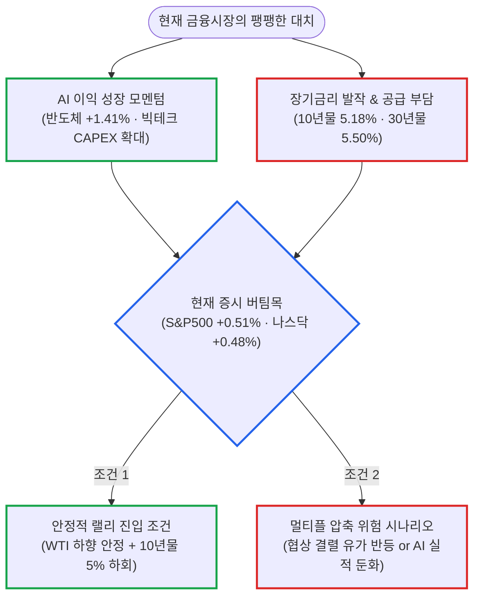

# 2026년 09월 26일(토) 하루치 뉴스정리

- **작성일**: 2026-09-26

이번 장을 **“중동 리스크가 풀리면서 다시 위험자산 랠리가 시작됐다”고 해석하면 너무 빠르다.** 유가 급등이라는 최악의 꼬리가 잠깐 내려오자 증시가 숨을 돌렸을 뿐, **호재가 쏟아졌음에도 10년물 5.18%·30년물 5.50%라는 살인적인 장기금리가 버티고 있는 한 지금은 '위험이 끝난 상승'이 아니라 '위험이 조금 줄어든 반등'이다.**

## 요약

| 구분 | 주요 내용 |
| :--- | :--- |
| **핵심 진단** | 유가 급락(-2.3%)에 다우(+0.93%), S&P500(+0.51%), 필라델피아 반도체(+1.41%) 반등. 호재 속에서도 10년물 5.180%, 30년물 5.502%(2004년 이후 최고)로 커브 스티프닝 지속 |
| **핵심 지표 / 팩트** | WTI $92.41(-2.33%), 브렌트 $104.32(-2.14%). 미 2년물(-3.1bp, 4.864%), 10년물(+1.6bp, 5.180%), 30년물(+4.1bp, 5.502%). 12월까지 25bp 추가 인상 확률 90% 이상 반영 |
| **착시 교정** | ① "호르무즈 협상 = 중동 문제 종결" 착시(미국 수락 미확정, 7일안 로드맵 제안 단계), ② "금리 하락으로 나스닥 상승" 착시(장기금리는 상승, AI·반도체 실적 체력이 고금리를 방어한 것) |
| **돈길 확산 신호** | 아카마이-앤트로픽 116억 달러 계약(GPU를 넘어 CPU·네트워크·인프라 전체 확산), SK하이닉스 솔리다임 최대 1,500억 달러 미국 IPO 추진(AI eSSD·스토리지 자산 가치 재평가) |
| **가장 더러운 변수** | 30년물 5.50% 돌파 및 10년물 5.18% 고착화. 연준 10월·12월 추가 금리 인상 가능성 고조로 인한 성장주 밸류에이션(할인율) 상방 제약 |
| **계좌 행동 지침** | 단기 지수 반등 추격 매수 엄금. 실적 없는 적자 고PER주·금리 민감 테마주 배제, 5%대 고금리를 압도적 실적으로 뚫어내는 AI·반도체·인프라 선별 압축 |

---

## 1. 결론부터: "위험자산 랠리 재개"라는 순진한 착각을 버려라

이번 장을 **“중동 리스크가 풀리면서 다시 위험자산 랠리가 시작됐다”고 해석하면 너무 빠르다.**

정확히는 유가 급등이라는 최악의 꼬리가 잠깐 내려오자 증시가 숨을 돌린 날이다. 그런데 더 중요한 건, 그렇게 호재가 나왔는데도 미국 장기금리는 제대로 내려오지 않았다는 것이다.

그래서 현재 시장은 이렇게 봐야 한다:

- **AI·반도체의 펀더멘털은 아직 강하다.**
- **하지만 시장 전체를 끌어올릴 만큼 금융환경이 편해진 것은 아니다.**
- **지금 최대 변수는 이란 자체가 아니라 `유가 ➔ 인플레이션 ➔ 연준 ➔ 장기금리`의 연결고리다.**

### 주요 시장 지표 마감 현황

| 시장 지수 / 원자재 | 마감 수치 | 변동률 | 시장 의미 |
| :--- | :---: | :---: | :--- |
| **다우존스 30** | — | **+0.93%** | 경기 방어 및 전통 대형주 반등 |
| **S&P 500** | — | **+0.51%** | 대형주 지수 기술적 숨고르기 |
| **나스닥 종합** | — | **+0.48%** | 기술주 반등 (장기금리 부담으로 상승폭 제한) |
| **필라델피아 반도체** | — | **+1.41%** | AI·반도체 실적 자신감이 고금리 돌파 |
| **WTI 원유** | **$92.41** | **-2.33%** | 호르무즈 협상 제안 소식에 전쟁 프리미엄 축소 |
| **브렌트유** | **$104.32** | **-2.14%** | $106대에서 $104대로 일시적 후퇴 |

---

## 2. 기사 속 팩트: 이란 뉴스는 분명 호재지만 아직 "해결"이 아니다

이란은 미국에 7일 안에 적대행위를 중단하고 호르무즈 해협을 재개방하는 로드맵을 제안했다. 이 뉴스 자체는 가짜가 아니다. 시장이 유가를 2% 넘게 내린 것도 합리적인 반응이다.

다만 현재 공개된 보도를 보면 **미국이 이란의 제안을 받아들였다고 확인된 단계는 아니다.**

조건 이행 순서를 놓고 양측의 이해관계도 여전히 다르다. 즉 **협상 가능성이 커진 것과 합의가 체결된 것은 전혀 다른 이야기다.** ([SBS 뉴스](https://news.sbs.co.kr/english/article.do?news_id=N1008769848&utm_source=chatgpt.com))

그러니 오늘 유가 -2.3% 하락은 전쟁 종료를 가격에 반영한 것이 아니라, **‘전쟁 프리미엄의 일부를 덜어낸 것’으로 보는 게 맞다.**

---

## 3. 오늘 기사에서 가장 중요한 함정: "국채금리 하락"이 아니라 "커브 스티프닝"이다

기사만 대충 읽으면 이렇게 받아들이기 쉽다:

> **호르무즈 협상 기대 ➔ 유가 하락 ➔ 금리 하락 ➔ 주식 상승**

그런데 실제 숫자를 들여다보면 이야기가 완전히 다르다.

### 미국 국채금리 기간별 변동 현황

| 만기 구분 | 당일 변화 | 최종 금리 | 시장이 가리키는 본질 |
| :---: | :---: | :---: | :--- |
| **2년물** | **-3.1bp** | **4.864%** | 유가 하락으로 연준의 당장 초긴축 우려 완화 |
| **10년물** | **+1.6bp** | **5.180%** | 경기 지속 및 구조적 인플레이션 경계 잔존 |
| **30년물** | **+4.1bp** | **5.502%** | **장중 5.532% 터치 (2004년 이후 22년만 최고 수준)** |

이건 금리 하락장이 아니라 **전형적인 베어 스티프닝(Bear Steepening, 장기금리가 단기금리보다 더 크게 오르는 현상)**이다.

특히 30년물 국채금리는 장중 5.532%까지 치솟으며 2004년 이후 최고 수준을 찍었다.

이게 오늘 뉴스에서 제일 중요한 부분이다.

- **단기금리 하락**: 이란 뉴스와 유가 하락으로 당장 연준이 더 세게 움직여야 할 필요성이 조금 낮아졌기 때문.
- **장기금리 고공행진**: 10년물(5.18%)과 30년물(5.50%)은 여전히 극도로 높음.

즉 채권시장은 주식시장을 향해 다음과 같이 엄중하게 경고하고 있는 셈이다:

> **“인플레이션·재정 적자·장기채 공급 과잉 문제는 끝난 게 아니다.”**

이것 때문에 오늘 상승장을 과대평가하면 안 된다. S&P 500이 +0.51% 올랐는데 10년물이 여전히 **5.18%다.**

오히려 지금 미국 주식시장의 특이한 점은, **금리가 5%를 훌쩍 넘는데도 AI 이익 성장 기대 때문에 증시가 안 무너지고 버텨내고 있다는 사실**이다.

이건 시장의 체력이 강하다는 방증이기도 하지만, 동시에 **AI 성장 기대가 조금만 훼손되어도 밸류에이션 압축(멀티플 강제 축소)이 걷잡을 수 없이 터져 나올 수 있다는 위험**을 뜻한다.

---

## 4. 대중의 눈먼 착시

### 착시 ① “호르무즈 협상 = 중동 문제 끝”

**아니다.**

지금은 `제안 ➔ 협상` 단계다.

실제 호르무즈 해협 개방까지 도달하려면 조건과 실행 순서가 완벽히 합의되어야 한다. 최근 외신 보도에서도 미국이 아직 이란의 7일안을 공식적으로 받아들였다고 확인되지 않았다. ([머니컨트롤](https://www.moneycontrol.com/world/araghchi-offers-us-7-day-plan-to-reopen-hormuz-what-s-in-iran-s-roadmap-article-14038374.html?utm_source=chatgpt.com))

따라서 WTI가 92달러 선까지 내려왔다고 해서, 바로 70~80달러 정상화 시나리오를 기본값으로 두는 것은 너무 성급하다.

협상이 다시 틀어지면 유가는 단기간에 폭등세로 되돌아갈 수 있다.

### 착시 ② “금리가 내려가서 나스닥이 올랐다”

**이것 역시 전혀 정확하지 않다.**

2년물은 내려갔지만 10년물과 30년물은 오히려 상승했다. 그래서 나스닥 상승을 단순히 ‘금리 완화’로 설명하면 시장의 절반만 보는 것이다.

오늘 주식의 실제 힘은 오히려 **AI·반도체 실적 기대가 높은 금리 부담을 온몸으로 버텨냈다**는 데 있다. 필라델피아 반도체지수가 **+1.41%로** 나스닥(+0.48%)보다 훨씬 강했던 이유가 바로 그 증거다.

---

## 5. 진짜 중요한 뉴스는 오히려 AI 쪽에 있다: Akamai–Anthropic 계약의 실체

오늘 기사에서 시장의 구조적 변화를 극명하게 보여주는 것은 이란 이슈보다 **아카마이(Akamai)–앤트로픽(Anthropic) 대형 계약**이다.

앤트로픽은 아카마이에 7년간 **116억 달러 규모의 클라우드 인프라 사용**을 약정했다. 추가 계약 옵션까지 합치면 잠재적으로 약 200억 달러까지 확대될 수 있는 초대형 딜이다. ([Akamai](https://www.akamai.com/newsroom/press-release/akamai-announces-11-6-billion-multi-year-agreement-with-anthropic-to-support-growing-demand?utm_source=chatgpt.com))

이건 대단히 상징적인 사건이다. 다만 여기서도 맹목적으로 과장하면 안 된다.

### 아카마이-앤트로픽 계약의 냉혹한 팩트 체크

- **GPU 주문이 아니다**: 아카마이가 공식적으로 밝힌 계약의 핵심은 앤트로픽의 **CPU 워크로드(CPU workload)** 지원이다. GPU 116억 달러어치를 쓸어 담았다는 뜻이 아니다.
- **막대한 선행 CAPEX 발생**: 이 계약을 수행하기 위해 아카마이는 **약 55억 달러의 막대한 자본 지출(CAPEX)**이 필요하다고 밝혔다.
- **단기 실적 기여 제한**: 아카마이의 2026년 연간 매출 가이던스에도 당장 즉각적인 영향을 주지 않는다.

즉 이 뉴스의 진짜 의미는 다음과 같다:

> **“AI 수요가 단순한 엔비디아 GPU 독식에서 끝나는 게 아니라 CPU·네트워크·스토리지·클라우드·전력까지 인프라 전체로 확산되고 있다.”**

이지, “AI 반도체 딱지만 붙으면 모든 종목을 사도 된다”는 뜻이 절대 아니다. 이 미세한 차이를 구분해내지 못하면 계좌가 엉뚱한 곳에서 망가진다.

---

## 6. 그리고 Solidigm 1,500억 달러 IPO 뉴스: AI 스토리지 자산의 재평가

이 소식 역시 시장의 자금 판도를 뒤흔들 수 있는 굵직한 뉴스다.

로이터(Reuters) 보도에 따르면 SK하이닉스의 솔리다임(Solidigm)이 **이르면 2027년 미국 증시 IPO를 검토하고 있으며, 최대 1,500억 달러의 기업가치와 약 150억 달러의 자금 조달 가능성**까지 거론되고 있다. 이미 유수의 글로벌 투자은행들과 IPO 주관 역할을 논의하는 단계까지 진행되었다는 보도다. ([UOL](https://www.uol.com.br/tilt/noticias/reuters/2026/09/25/solidigm-da-sk-hynix-avalia-ipo-que-poderia-precificar-a-unidade-em-ate-us-150-bi-dizem-fontes.htm?utm_source=chatgpt.com))

하지만 여기서는 소문과 팩트를 철저히 분리해서 봐야 한다:

| 구분 범주 | 데이터 기반 팩트 및 단계 |
| :--- | :--- |
| **① 확정된 사실 (Confirmed Facts)** | 솔리다임의 경쟁력 강화를 위한 여러 방안을 검토 중이라는 사실은 SK하이닉스가 공식적으로 인정한 내용이다. |
| **② 신뢰도 높은 추정 (High-Confidence Estimates)** | 로이터가 복수의 핵심 관계자를 인용하여 IPO 준비 절차 착수 및 최대 1,500억 달러 밸류에이션 가능성을 보도했다. |
| **③ 아직 확정되지 않은 부분 (Unconfirmed)** | 구체적인 IPO 시점, 최종 확정 기업가치(1,500억 달러), 150억 달러 조달 규모는 미정이다. SK하이닉스는 9월 초 SEC 공시에서도 본 사안에 대해 아직 결정된 바가 없다고 공식 명시했다. ([SEC](https://www.sec.gov/Archives/edgar/data/2120882/000119312526382688/d111778d6k.htm?utm_source=chatgpt.com)) |

따라서 기사에서 “솔리다임 기업가치가 1,500억 달러로 확정 평가된다”고 단정하면 과장이다.

정확히는 **“IPO 검토 과정에서 최대 1,500억 달러의 기업가치가 거론되고 있다”** 정도가 팩트에 부합한다.

그럼에도 이 뉴스의 함의는 거대하다. **메모리·고용량 eSSD·AI 스토리지 자산에 대해 시장이 과거 전통적인 사이클 디스카운트와 비교할 수 없을 만큼 높은 프리미엄 가치를 인정하기 시작했다는 강력한 신호**이기 때문이다.

---

## 7. 스마트머니가 실제로 보는 4대 숫자: 자본이 흐르는 좁은 골목

지금 월가의 거대 스마트머니가 가장 예민하게 추적하고 있는 숫자는 사실 네 개다:

**WTI / 미 10년물 / 미 30년물 / AI CAPEX**

그리고 현재 이 네 가지 변수의 조합은 대단히 묘하고 이질적인 줄다리기를 연출하고 있다:

### 핵심 거시경제 변수 매트릭스

| 변수 | 현재 상황 | 주식시장 관점의 진짜 의미 |
| :---: | :---: | :--- |
| **WTI 원유** | **92달러 선으로 하락** | 유가 폭등 꼬리가 꺾이며 단기 인플레 숨통 (단기 호재) |
| **2년물 금리** | **4.86%로 하락** | 연준의 단기 공격적 금리 인상 공포 일시 완화 (단기 호재) |
| **10년물 금리** | **5.18% 유지** | 기업 멀티플을 짓누르는 고금리 할인율 지속 (여전히 부담) |
| **30년물 금리** | **5.50% 도달** | 미 재정 적자 및 장기 국채 발행 수급 쇼크 (상당한 부담) |
| **AI CAPEX** | **지속적 확장** | 빅테크 및 반도체·인프라 실적의 가장 강력한 버팀목 |

그래서 지금 돈의 흐름은 시장 지수 전체를 무차별적으로 바스켓 매수하는 장이 아니다.

> **“5%를 웃도는 살인적인 고금리를 너끈히 짓밟고 올라설 만큼, 폭발적인 실적 성장을 증명하는 기업만을 골라 담는 장”**

에 훨씬 가깝다. AI 인프라와 핵심 반도체가 상대적으로 압도적인 강세를 유지하는 근본적인 이유가 바로 여기에 있다.

---

## 8. 지금 계좌에서 가장 경계해야 하는 것

오늘 지수가 +0.5% 반등했다고 해서, 다시 공격적으로 위험자산 비중을 확 늘리는 것은 논리적으로 대단히 취약하다.

시장은 현재 **12월까지 25bp 이상 추가 금리 인상 가능성을 90% 이상 반영하고 있고, 10월 추가 인상 가능성도 매우 높은 수준**을 유지하고 있다.

이 국면에서 10년물 5.18%, 30년물 5.50%라는 수치는 성장주 전체의 미래 현금흐름을 할인하는 데 있어 대단히 가혹한 할인율이다.

따라서 지금 계좌 운용의 논리적 귀결은 명확하다:

- **접근해야 할 영역**: 지수 급등 추격 매수를 자제하고, 이익 추정치(EPS)가 계속해서 상향 조정되는 **AI·반도체·초고속 네트워크·데이터센터 전력 인프라** 중심의 선별적 압축.
- **반드시 피해야 할 영역**: 실적 뒷받침 없이 AI 테마 이름표만 달고 있는 고PER 거품주, 영업적자 성장주, 장기금리 상승에 극도로 취약한 부채 의존형 기업.

---

## 9. 내가 보는 현재 시장의 핵심: AI 이익 성장 vs 장기금리의 혈투

이번 반등 국면에서 포착된 **가장 긍정적인 신호는 결코 호르무즈 협상 따위가 아니다.**

**미 10년물 5.18%라는 말도 안 되게 높은 금리 압박 속에서도 필라델피아 반도체지수가 +1.41%나 치솟았다는 사실**이다. AI 투자 사이클이 뿜어내는 실적 모멘텀이 거시경제의 금리 충격을 아직까지 확실하게 이겨내고 있다는 뜻이기 때문이다.

반면 **가장 위험한 신호 역시 너무나 명백하다.**

호르무즈 협상 기대가 터져 나오고 유가가 -2.3%나 주저앉았음에도, **미 30년물 국채금리가 5.50%에 고착화되어 있다는 점**이다.

즉 시장의 진짜 폭탄은 중동 리스크 하나가 아니다.

현재 글로벌 금융시장의 본질적인 대결 구도는 다음과 같다:

> **AI 이익 성장 ↑** &nbsp; vs. &nbsp; **유가 · 인플레이션 · 장기금리 ↑**

(지금까지의 승부는 AI의 펀더멘털이 가까스로 판정승을 거두며 버텨내고 있다.)

하지만 다음 단계의 진정한 강세장으로 진입하기 위해서는 반드시 세 가지 퍼즐이 동시에 맞아떨어져야 한다:

1. **WTI 유가가 80달러대로 추가 하향 안정되어야 한다.**
2. **미 10년물 국채금리가 5.0% 아래로 확실하게 내려앉아야 한다.**
3. **동시에 AI 핵심 기업들의 실적 추정치가 꺾이지 않고 버텨주어야 한다.**

그전까지 이번 증시 반등은 **“위험이 끝난 상승”이라기보다는 “위험이 잠깐 줄어서 숨을 돌린 반등”**으로 해석하는 것이 가장 정직하고 정확하다.

- **오늘 기사에서 가장 과소평가된 한 줄**: “주식이 오른 것보다, 5.18% 금리에서 AI·반도체가 계속 버틴다는 사실이 훨씬 더 중요하다.”
- **오늘 기사에서 가장 과대평가하면 안 되는 한 줄**: **“호르무즈 재개방 기대”는 아직 협상 제안 단계일 뿐, 체결된 합의가 결코 아니다.**

!!! tip "최종 핵심 제언 (Executive Takeaway)"
    호르무즈 해협 협상 소식에 유가가 2%대 빠졌다고 해서 샴페인을 터뜨리지 마라. 30년물 국채금리가 5.50%를 찍고 있는 시장은 여전히 살얼음판이다.

    지금 주식시장을 지탱하는 유일한 기둥은 연준의 자비나 평화 협정이 아니라, **‘5% 고금리 할인율 따위는 씹어 삼킬 수 있다’는 AI 반도체와 핵심 인프라의 잔혹한 이익 성장력**이다.

    지수 반등에 취해 적자 성장주나 빚더미 테마주로 눈을 돌리는 순간 계좌는 녹아내린다. 10년물 금리가 5% 아래로 꺾이기 전까지는, 숫자로 진짜 현금을 증명하는 1등 AI 반도체·인프라 기업에만 방아쇠를 얹어두고 냉정하게 분할 대응하라.
