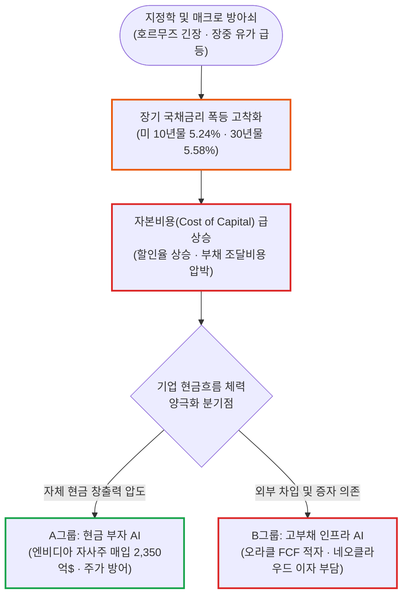

# 2026년 09월 28일(월) 하루치 뉴스정리

- **작성일**: 2026-09-28

지금 시장은 **AI 버블이 터지는 장도, 아무 AI주나 사도 되는 장도 아니다.** 호르무즈 불확실성으로 촉발된 유가 반등이 미 국채 10년물 금리를 **5.24%까지** 밀어 올렸지만, 핵심은 AI 수요의 둔화가 아니라 **'수조 달러를 집어삼키는 AI 인프라의 자본 조달 비용'**에 있다. 시장의 분기점은 이제 'AI vs 비AI'가 아니라, **'현금으로 주식을 사는 AI' vs '빚내서 데이터센터 짓는 AI'**의 잔혹한 체력 검증으로 넘어가고 있다.

## 요약

| 구분 | 주요 내용 |
| :--- | :--- |
| **핵심 진단** | 미 10년물 5.24%(장중 5.274%), 30년물 5.583% 폭등. S&P500 -0.77%, 나스닥 -0.92%, 필라델피아 반도체 -1.61%. 수요 붕괴가 아닌 할인율 상승 및 자본비용 충격 |
| **핵심 지표 / 팩트** | WTI 장중 +4% 급등 후 $92.60(+0.21%)로 상승폭 대부분 반납. 그러나 10년물 금리는 5.24%에 고착. 엔비디아(NVDA) 1,500억 달러 자사주 매입 한도 추가(총 2,350억 달러)로 +2% 방어 |
| **착시 교정** | ① "이란 때문에 주식 하락" 착시(이란은 방아쇠일 뿐, 장기채 공급·Fed 인상·재정적자 총알이 장전된 상태), ② "반도체 -3~8% 급락으로 AI 끝" 착시(xAI 144만 개 칩 가동 계획, 마이크론 메모리 쇼티지 지속) |
| **돈길 분화 신호** | AI 투자의 3단계 진화: 2023~2025년 'AI 테마' ➔ 2026년 '매출 유무' ➔ 다음 단계 **'순현금 창출력(FCF) vs 부채 조달비용'**. 공매도 역시 개별 자금조달 및 실행력 취약주로 정밀 타격 |
| **가장 더러운 변수** | 유가가 빠져도 내려오지 않는 10년물 5.24% 금리. 2030년까지 AI 부채 4.1조 달러 추산 속 금리 1%p 상승 시 이자비용 폭증(코어위브 연 3천만 달러, 오라클 FCF -54억 달러 및 부채 1,295억 달러) |
| **계좌 행동 지침** | VIX 16.07로 패닉 아닌 밸류에이션 재조정. 지수 급락 투매 자제하되 무차별 저가 매수 엄금. 고부채 네오클라우드·데이터센터 경계, 현금흐름 압도적인 1등 반도체 및 ROI 입증 기업 압축 |

---

## 1. 결론부터: 지금 시장의 핵심 연결고리

지금 시장은 AI 버블이 터지는 장이 아니다. 그렇다고 아무 AI주나 사도 되는 장은 더더욱 아니다.

오늘 시장의 핵심은 딱 이거다:

> **호르무즈 불확실성 ➔ 유가 상승 ➔ 인플레이션 재점화 우려 ➔ Fed 추가 인상 기대 ➔ 10년물 5.24% ➔ 고밸류 성장주 할인율 상승**

미국 10년물 국채금리는 9월 28일 **5.24%까지** 올라왔고, 장중에는 5.274%, 30년물은 5.583%까지 치솟았다. 이에 따라 S&P500은 -0.77%, 나스닥은 -0.92%, 필라델피아 반도체지수는 -1.61%를 기록했다. 실제 미 10년물 5.24% 수준은 외부 시장 데이터에서도 명확히 확인된다. ([Trading Economics](https://tradingeconomics.com/united-states/government-bond-yield))

그런데 중요한 건 AI의 수요가 꺾여서 금리가 오른 게 아니라는 것이다. 오히려 AI 투자는 너무 강해서 막대한 자본을 빨아들이고 있고, **그 돈을 조달하는 비용이 문제**가 되고 있다.

### 주요 시장 지표 마감 현황

| 시장 지수 / 원자재 / 국채 | 마감 수치 | 변동폭 | 시장 의미 |
| :--- | :---: | :---: | :--- |
| **다우존스 30** | — | **-0.38%** | 상대적 선방 (가치주·방어주 방어력) |
| **S&P 500** | — | **-0.77%** | 고금리 할인율 재조정으로 지수 약세 |
| **나스닥 종합** | — | **-0.92%** | 장기금리 폭등에 따른 성장주 멀티플 압박 |
| **필라델피아 반도체** | — | **-1.61%** | 고베타 반도체 포지션 조정 및 차익 실현 |
| **WTI 원유** | **$92.60** | **+0.21%** | 장중 +4% 급등 후 협상 기대감에 상승폭 반납 |
| **브렌트유** | **$105.28** | — | $105대 유지하며 인플레 압력 잔존 |
| **미 10년물 국채금리** | **5.240%** | **장중 5.274%** | 유가 반락에도 5.2%대 고착화 (핵심 악재) |
| **미 30년물 국채금리** | **5.583%** | **장중 5.583%** | 장기채 수급 불균형 및 재정적자 부담 반영 |
| **VIX (변동성 지수)** | **16.07** | — | 공포 패닉(20 이상)이 아닌 질서 있는 재평가 |

---

## 2. 기사 속 팩트: 오늘은 이란보다 결국 ‘금리’가 문제다

트럼프 대통령이 이란의 호르무즈 해협 재개방 관련 7일안을 거절한 것은 실제 보도와 일치한다. 동시에 추가 협상 가능성은 열어둔 상태다. ([SBS 뉴스](https://news.sbs.co.kr/english/article.do?news_id=N1008770586))

그 결과 유가는 장중 급등했다. 하지만 여기서 아주 흥미로운 대목이 있다.

WTI 종가는 겨우 +0.21% 상승한 92.60달러에 그쳤다. 브렌트유 역시 105.28달러 수준이었다. 장중 WTI가 4% 이상 치솟았다가, 미국·이란 대화 기대와 사우디 송유관 재가동 소식으로 상승폭 대부분을 반납한 것이다. 로이터(Reuters) 보도에서도 WTI가 약 92.61달러, 브렌트유가 105.23달러 수준까지 상승폭을 축소한 점이 확인된다. ([StreetInsider](https://www.streetinsider.com/Reuters/Oil%2Bprice%2Bgains%2Bpared%2Bas%2BQatar-US-Iran%2Btalks%2Bloom/27113173.html))

**그런데 채권시장은 제대로 회복하지 못했다.**

이게 오늘 장에서 가장 중요한 정보다.

유가가 장중 +4%에서 사실상 보합권까지 내려왔는데도, 미 10년물 금리는 **5.24%에** 그대로 남았다.

즉, **“전쟁만 끝나면 금리가 다시 4%대로 내려간다”는 논리가 점점 약해지고 있다.**

모하메드 엘-에리언(Mohamed El-Erian) 역시 에너지 문제가 해결되더라도 장기 국채의 수급 불균형 때문에 10년물 금리가 5% 부근에 머물 수 있다고 지적했다.

이게 진짜 악재다.

- **유가**: 외교 협상 한마디면 하루 만에 4~5% 빠질 수 있다.
- **구조적 금리**: 미국 정부의 재정적자, 장기 국채 공급 폭탄, AI 인프라 투자에 따른 막대한 민간 자본 수요는 협상 한 번으로 결코 사라지지 않는다.

---

## 3. 대중이 보기 쉬운 2대 착시 교정

### 착시 ① “오늘 이란 때문에 주식이 빠졌다”

**반은 맞고 반은 틀렸다.**

이란은 방아쇠일 뿐이다. 총알은 이미 탄창에 꽉 장전돼 있었다:

- 미 재정적자와 장기국채 발행 공급 부담
- 연준(Fed)의 추가 인상 사이클 경계
- 고유가 기조의 잔존
- 여전히 견고한 미국 실물 경기
- AI 데이터센터 건설에 따른 막대한 자본 수요

이 팽팽한 상황에서 호르무즈 해협 문제가 유가를 순간적으로 밀어 올리며 채권시장에 불을 붙인 것이다.

따라서 지금 시장의 전개 과정은 다음과 같은 순서로 읽어야 정확하다:

> **유가 ➔ 기대 인플레이션 ➔ Fed 긴축 경계 ➔ 채권금리 폭등 ➔ 주식 밸류에이션(할인율) 압박**

### 착시 ② “AI 반도체도 -3~-8% 급락했으니 AI 사이클 끝났다”

**이건 너무나 단순한 1차원적 발상이다.**

당일 주요 반도체 종목들의 낙폭은 컸다:

- **Arm**: **-8.72%**
- **인텔(Intel)**: **-5.58%**
- **마이크론(MU) & AMD**: 약 **-3%**
- **필라델피아 반도체지수(SOX)**: **-1.61%**

하지만 같은 날 쏟아진 산업 현장의 실제 뉴스는 정반대를 가리킨다.

- **xAI의 공격적 GPU 증설**: xAI는 테네시주 멤피스 데이터센터에 이미 약 78만 개의 엔비디아 AI 칩을 설치 완료했고, 여기에 차세대 GB300을 최대 66만 개 추가 가동하려는 계획이 확인됐다. 계획대로 진행되면 연말 기준 가동되는 엔비디아 칩 규모가 최대 144만 개에 달할 수 있다.
- **마이크론 메모리 쇼티지 장기화**: BMO 캐피털 분석에 따르면 DRAM, HBM, NAND의 전방위 공급 부족은 2027년 중반 이후, 일부 품목은 2028년까지 이어질 가능성이 제시됐다.

즉 오늘 반도체 섹터의 하락은 수요 붕괴가 아니다. **금리 상승과 위험자산 비중 조절에 따른 포지션 정리 성격이 훨씬 강하다.**

---

## 4. 그런데 여기서 AI 전체를 사면 안 된다

여기서부터가 진짜 핵심이다.

AI 시장 내부에서 체력이 완전히 다른 두 종류의 기업군이 갈라지고 있다.

### A그룹: 자체 현금이 철철 넘쳐나는 AI 기업

**대표적인 기업이 바로 엔비디아(NVIDIA)다.**

엔비디아는 이사회를 통해 자사주 매입 한도를 무려 **1,500억 달러 추가 승인**하여, 잔여 매입 한도를 총 **2,350억 달러까지** 늘렸다. 이 자사주 매입 프로그램은 FY2028까지 체계적으로 집행될 계획이다. ([PublicNow](https://www.publicnow.com/view/994BF75CAD568E2BAA09613969645F008CB2FADA))

시장 전체가 장기금리 폭등으로 두들겨 맞는 하락장에서 엔비디아 홀로 약 **+2%대** 상승으로 버텨낸 이유가 바로 여기에 있다.

쉽게 요약하면 다음과 같다:

> **남들은 AI 인프라 투자하려고 비싼 이자 주고 돈을 빌리러 다니는데, 엔비디아는 AI 칩을 팔아 벌어들인 막대한 잉여현금으로 자기 회사 주식을 쓸어 담고 있다.**

이건 차원이 완전히 다른 기초 체력이다.

### B그룹: AI 성장률은 미쳤는데 외부 자금이 절실한 기업

**여기가 앞으로 시장에서 계속 집중 포화를 맞을 수 있는 위험 지대다.**

대표적인 사례가 코어위브(CoreWeave) 같은 네오클라우드(Neo-Cloud)와 대규모 데이터센터 전문 사업자들이다.

10년물 국채금리가 5.2%를 뚫고 올라가면서 AI 인프라 기업들의 조달비용 부담이 눈덩이처럼 불어나고 있다. JP모건(JPMorgan) 추산에 따르면 **2030년까지 AI 관련 총 부채 규모가 4.1조 달러에 달할 수 있다**는 경고가 나온다. 코어위브의 경우 금리가 1%p(100bp) 오를 때마다 연간 이자비용만 약 3,000만 달러 증가할 수 있다는 분석도 제기된다.

**오라클(Oracle) 역시 동일한 딜레마를 겪고 있다.**

오라클의 사업 자체는 가공할 속도로 폭발하고 있다:

- **매출 증가율**: **+30%**
- **클라우드 부문 성장률**: **+62%**
- **남은 계약 잔액(RPO)**: **6,640억 달러**

하지만 대차대조표와 현금흐름표의 이면은 완전히 다르다:

- **잉여현금흐름(FCF)**: **-54억 달러 (적자)**
- **총 부채 규모**: 약 **1,295억 달러**
- **연간 자본적 지출(CapEx)**: 약 **950억 달러**
- **FY27 외부 자금 조달 계획**: 약 **400억 달러**

사업 모델이 나빠서가 아니다. **5%대 고금리 환경에서 감당해야 할 '자본비용(Cost of Capital)'이 기업 가치를 짓누르기 시작한 것이다.**

---

## 5. 스마트머니가 보는 진짜 기준: "AI냐 아니냐"의 시대는 끝났다

지금 시장에서 가장 눈여겨봐야 할 거대한 수급 변화가 있다.

**헤지펀드와 스마트머니의 공매도 포지션이 반도체 섹터 전체를 통째로 숏 치던 방식에서 탈피했다는 점이다.**

현재 공매도는 세부 테마별로 극도로 쪼개져 정밀 타격 형태로 집행되고 있다:

- 로봇
- 자율주행
- 양자컴퓨팅
- 클라우드
- 데이터센터
- 엔터프라이즈 소프트웨어

그리고 공매도 화력은 **① 과도한 밸류에이션, ② 취약한 자금조달 구조, ③ 기술 경쟁력 부재, ④ 프로젝트 실행 능력 결여**라는 약점을 안고 있는 기업들에 집중적으로 쏟아지고 있다.

이것이 바로 2026년 AI 시장이 맞이한 질적 진화의 실체다:

| 시대 구분 | 시장의 핵심 매수 질문 | 시장 평가 잣대 |
| :---: | :--- | :--- |
| **2023 ~ 2025년** | "AI 타이틀이 붙어 있는가?" | 테마 및 기대감 (무차별 랠리) |
| **2026년 상반기** | "AI로 실제 매출이 찍히는가?" | 탑라인 성장률 (매출 증명) |
| **다음 단계 (현재)** | **"매출은 나오는데, 이자 내고 순현금(FCF)이 남는가?"** | **자본비용 견디는 실질 현금창출력** |

---

## 6. 엔터프라이즈 AI 소프트웨어: ROI 검증 국면 돌입

오펜하이머(Oppenheimer)의 최신 소프트웨어 리서치 분석 역시 일맥상통한다.

글로벌 기업들의 최고재무책임자(CFO)들이 더 이상 IT 벤더를 향해 **“당신들 제품에 AI 기능이 탑재되어 있습니까?”**라는 순진한 질문을 던지지 않는다.

지금 CFO들이 묻는 것은 단 하나다:

> **“그 AI 솔루션을 도입해서 우리 회사 비용이 실제로 몇 달러나 절감되었습니까? 투자 대비 수익률(ROI) 숫자를 가져오십시오.”**

기업용 AI 도입이 단발성 PoC(개념 검증)를 지나 정기적으로 결제해야 하는 반복 구독 비용(Recurring Cost)으로 잡히기 시작하면서, 가차 없는 ROI 검증 단계에 들어섰다.

이에 따라 고객사의 핵심 원천 데이터와 업무 기록을 독점 장악하고 있는 **기록 시스템(System of Record) 보유 기업들**이 압도적으로 유리한 고지를 점하고 있다.

대표적으로 다음 기업들이 시장의 핵심 관찰 대상이다:

- **마이크로소프트 (MSFT)**
- **오라클 (ORCL)**
- **세일즈포스 (CRM)**
- **서비스나우 (NOW)**
- **워크데이 (WDAY)**

AI 소프트웨어 생태계 역시 '장밋빛 스토리' 단계에서 '냉혹한 수익화 및 원가 절감 입증' 단계로 완벽히 전환되었다.

---

## 7. 마이크론(MU)과 금(-3%)이 던지는 냉정한 경고

### 마이크론은 우량하지만, 지금 쫓아가면 전혀 다른 문제가 된다

뉴스 플로우만 보면 마이크론의 펀더멘털은 빈틈이 없어 보인다.

- **베어드(Baird)**: 온디바이스 AI 에이전트 확산, DRAM 비트 성장률 둔화에 따른 단가 상승, 고마진 HBM 비중 확대를 강력한 호재로 제시.
- **BMO 캐피털**: DRAM·HBM·NAND 전반의 공급 타이트, 신규 팹 완공까지 2~3년 소요에 따른 공급 부족 장기화 전망.

이러한 메모리 업황 논리 자체는 대단히 탄탄하다.

다만 결정적인 팩트를 놓치면 안 된다. **마이크론 주가는 2026년 들어 이미 +279%나 폭등한 상태다.**

따라서 9월 30일 예정된 실적 발표에서 중요한 질문은 이것이다:

- ❌ "실적이 잘 나왔는가?"
- ⭕ **"시장이 이미 천장까지 올려놓은 눈높이보다 대체 얼마나 더 압도적으로 잘 나왔는가?"**

이 기대치의 간극을 이해하지 못하면, 사상 최대 실적을 찍고도 어닝 발표 직후 주가가 -10%씩 처박히는 사태를 온몸으로 맞게 된다.

### 금 가격 -3% 폭락의 진짜 의미

통상 지정학적 전쟁 위기가 터지면 시장은 공식처럼 생각한다:

> **전쟁 발발 ➔ 안전자산 선호 ➔ 금 가격 상승**

그런데 이번 장에서 국제 금 시세는 **3% 넘게 폭락**했다.

왜 이런 현상이 벌어졌을까?

**이번 장에서 글로벌 자본이 진정으로 공포를 느낀 대상은 '전쟁 자체'가 아니라 '금리 폭등'이었기 때문이다.**

- 유가 상승
- ➔ 기대 인플레이션 자극
- ➔ 연준의 추가 금리 인상 공포 부활
- ➔ 실질금리 및 명목 국채금리 폭등
- ➔ 달러화 강세
- ➔ 무이자 자산인 금 가치 급락

즉 오늘 글로벌 금융시장의 가격 움직임은 단순한 **“지정학 분쟁 장세”가 아니라 “인플레이션 재점화 및 고금리 할인율 재가격(Re-pricing) 장세”**로 정의하는 것이 본질에 부합한다.

---

## 8. 계좌에서 점검해야 할 섹터별 판정 및 포지션 우선순위

지금 시장을 무작정 공포에 질려 주식 비중을 무차별 축소할 장으로 보지는 않는다.

하지만 **종목을 고르는 필터링 기준은 완전히 뜯어고쳐야 한다.**

### 섹터 및 자산군별 현재 판정 매트릭스

| 자산군 / 섹터 | 현재 시장 판단 | 핵심 대응 가이드 |
| :--- | :---: | :--- |
| **현금흐름 강한 AI 반도체** | **상대적 최우량** | 자체 현금으로 자사주 매입 및 R&D가 가능한 1등 기업 (엔비디아 등) |
| **HBM · 고대역 메모리** | **펀더멘털 강력** | 업황 논리는 최상이나 단기 급등에 따른 밸류에이션 눈높이 확인 필수 |
| **엔터프라이즈 AI SW** | **선별적 옥석 가리기** | 실제 AI 솔루션 매출 기여도 및 고객사 ROI 증명 기업으로 압축 |
| **네오클라우드** | **극도로 민감 (주의)** | 데이터센터 조달금리 1%p 상승 시 이자비용 폭증 직격탄 |
| **고부채 데이터센터** | **경계 대상** | 조 단위 차입금과 연간 대규모 CapEx로 FCF 적자인 기업 리스크 |
| **스토리형 무실적 AI주** | **경계 강화** | 공매도 타깃 집중. 단순 AI 테마주 비중 전량 정리 |
| **전통 에너지** | **지정학 헤지** | 호르무즈 리스크 및 인플레이션 재점화 시 포트폴리오 쿠션 역할 |
| **미국 장기 국채** | **저가 매수 성급** | 재정적자 및 공급 수급 불균형 지속. 10년물 5.2%대 하향 안정 전 관망 |

앞으로는 과거처럼 단순 PER(주가수익비율) 하나만 보고 주식을 사면 안 된다.

모든 AI 기업을 평가할 때는 반드시 다음 다섯 가지 지표를 하나의 세트로 묶어서 검증해야 한다:

> **성장률 + 잉여현금흐름(FCF) + 총 부채 규모 + 자본적 지출(CapEx) + 연간 이자비용**

---

## 9. 냉정한 실전 행동 지침

### ① 나스닥 -1% 하락을 보고 패닉에 물량을 던질 이유는 없다

변동성 지수인 VIX는 고작 **16.07** 수준에 머물러 있다.

이 수치는 시장 참여자들이 공포에 질려 투매를 던지는 '패닉장'이 결코 아니다. 금리 상승에 발맞추어 자산 가치를 정밀하게 다시 깎아내는 **'질서 있는 밸류에이션 재조정'**이다.

### ② 그렇다고 “-5% 빠졌으니 싸다”며 AI주를 무차별 줍지 마라

미 10년물 국채금리가 **5.24%에** 도달한 세상에서는, 똑같이 매출이 30% 성장하는 기업이라도 **자본 구조(부채 vs 자체 현금)에 따라 주가 향방이 극과 극으로 찢어진다.**

자체 현금이 차고 넘쳐 2,350억 달러 자사주를 사들이는 엔비디아와, 비싼 이자로 돈을 빌려 데이터센터를 올려야 하는 기업을 같은 'AI 수혜주'라는 바스켓으로 묶어서 매수하는 우를 범하지 마라.

### ③ 지금 계좌에서 가장 예민하게 추적해야 할 숫자는 지수가 아니다

S&P 500이나 나스닥 종합지수의 잔파도보다 훨씬 중요한 핵심 지표는 **미국 10년물 국채금리와 브렌트유 가격**이다.

특히 **10년물 금리가 5.2~5.3% 레벨 위에서 굳어져 장기 고착화되는지 여부**가 모든 자산의 명줄을 쥐고 있다.

유가가 협상 기대로 안정되는데도 10년물 금리가 내려오지 않는다면, 시장은 생각을 완전히 바꾸게 된다:

- ❌ "이란 분쟁 때문에 금리가 일시적으로 올랐다."
- ⭕ **"미국 장기금리는 구조적 인플레이션과 재정 적자 때문에 영구적으로 레벨업되었다."**

이 인식이 시장에 굳어지는 순간, 모든 고밸류 성장주의 적정 주가 할인율은 구조적으로 한 계단 더 낮아질 수밖에 없다.

---

## 10. 종합 결론 및 핵심 실행 원칙

이번 하락을 단순히 **“중동 전쟁 이슈 때문에 하루 빠진 것”**으로 치부하면 시장을 너무 안일하게 보는 것이다.

반대로 **“드디어 AI 버블이 터지고 대세 하락이 시작됐다”**고 공포에 떠는 것도 본질에서 한참 벗어나 있다.

현재 데이터가 입증하는 사실은 명확하다:

- **AI 수요는 여전히 견고하다**: 엔비디아는 2,350억 달러 규모의 자사주 매입 여력을 확보했고, xAI는 GPU를 144만 개까지 확장 중이며, 메모리 반도체 공급은 여전히 빡빡하다. 엔비디아의 1,500억 달러 추가 자사주 매입도 공식 발표로 확인되었다. ([PublicNow](https://www.publicnow.com/view/994BF75CAD568E2BAA09613969645F008CB2FADA))
- **문제의 본질은 수요가 아닌 '돈의 가격'이다**: 10년물 금리가 5.2%를 뚫어낸 상태에서 AI 인프라 확장에 천문학적인 자본이 투입되고 있다.

따라서 향후 시장의 핵심 축은 다음과 같이 갈라질 수밖에 없다:

> **'AI vs 비AI'의 싸움이 아니라,**  
> **'돈 버는 AI' vs '돈 빌리는 AI'의 잔혹한 생존 경쟁이다.**

지금 쏟아지는 수십 개의 시장 뉴스 중에서 장기 계좌의 성패를 가를 가장 중요한 구조적 변화는 바로 이것이다.

!!! tip "최종 핵심 제언 (Executive Takeaway)"
    유가가 반락했음에도 미 10년물 국채금리가 5.24%에 박혀 있다는 사실을 가볍게 넘기지 마라. 이 숫자는 향후 모든 고밸류 테마주에 무자비한 이자비용과 할인율의 철퇴를 내릴 것이다.

    지금 계좌를 지키는 유일한 기준은 'AI 간판'이 아니라 **'자체 잉여현금흐름(FCF)으로 주주환원과 설비투자를 동시에 끝낼 수 있는 체력이 있는가'**이다.

    돈을 빌려야만 성장할 수 있는 부채 의존형 인프라·네오클라우드 기업에 대한 환상을 버리고, 압도적인 현금 창출력으로 5%대 고금리 장벽을 돌파하는 1등 기업으로 포트폴리오를 냉정하게 압축하라.
