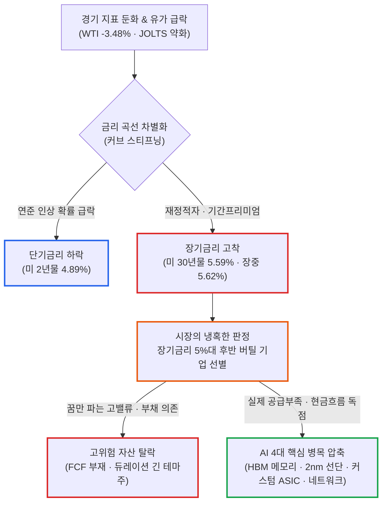

# 2026년 09월 29일(화) 하루치 뉴스정리

- **작성일**: 2026-09-30

**유가가 하루 만에 3.5% 폭락하고 고용·소비심리가 동시에 꺾였는데도, 미 30년물 국채금리는 5.6% 위에서 단 1bp도 내려오지 않았다.** 연준 윌리엄스 총재의 완화적 발언에 10월 금리 인상 확률이 70%에서 49%로 급락하고 단기금리가 떨어졌지만, 채권시장은 미국 장기채에 사상 유례없는 '기간프리미엄'을 청구하며 요지부동이다. 이 거대한 장기금리 돌덩이 아래서 지수 전체가 질식하는 동안, 돈은 필라델피아 반도체(+1.32%)와 TSMC 2nm 선단공정·마이크론 HBM 메모리라는 **'대체 불가능한 실물 병목 구간'**으로 무섭게 집결하고 있다.

## 요약

| 구분 | 주요 내용 |
| :--- | :--- |
| **핵심 진단** | 단기금리는 하락(2년물 4.89%)하나 장기금리는 상승(30년물 5.59%, 장중 5.62%)하는 커브 스티프닝 발생. 인플레 문제가 아닌 미 국채의 구조적 기간프리미엄 및 자본 조달비용 압박 |
| **핵심 지표 / 팩트** | S&P500 -0.17%, 나스닥 -0.09%, 다우 -0.26%, 필라델피아 반도체 +1.32%. WTI -3.48%($89.38) 급락에도 30년물 5.6% 고착. 연준 10월 추가 금리 인상 확률은 70%에서 49%로 급락 |
| **착시 교정** | ① "경기지표 둔화 ➔ 연준 완화 ➔ 성장주 풀매수" 착시(나쁜 뉴스는 좋은 뉴스 공식의 붕괴), ② "마이크론 PER 7배니까 싸다" 착시(80%대 총마진 지속 전제의 조건부 결과), ③ "버리 숏 베팅 = AI 폭락 임박" 착시(2027년 만기 비대칭 풋옵션) |
| **돈길 이동 신호** | AI 전반의 맹목적 추종에서 **4대 실물 병목 구간**으로 자금 압축: ① HBM/DRAM/SSD(마이크론·SK하이닉스), ② 선단공정(TSMC 2nm 증설), ③ 커스텀 ASIC(브로드컴·마벨), ④ 네트워킹·광통신 |
| **가장 더러운 변수** | 30년물 5.6% 장기금리 고착화. 유가가 빠져도 내려오지 않는 장기금리가 5.7%를 돌파할 경우, AI 실적이 아무리 강해도 성장주 전반의 멀티플 압축(밸류에이션 하향) 불가피 |
| **계좌 행동 지침** | AI 반도체 전량 매도 자제. 실적 직전 마이크론 등 추격매수 금지(FY27 가이던스 확인 필수). FCF 없는 고부채·장기 듀레이션 '스토리형 AI' 정리. 30년물 5.6% 돌파 여부 최우선 추적 |

---

## 1. 결론부터: 5.6% 장기금리 돌덩이와 반도체 병목의 대탈출

유가가 $89대로 주저앉고 경기 둔화 지표가 쏟아졌는데 왜 미국 30년물 국채금리는 5.6%에 박혀 꿈쩍도 하지 않는가?

오늘 장세의 모든 기현상과 자금 쏠림은 바로 이 **'비정상적인 커브 스티프닝'** 하나에서 출발한다.

연준이 덜 매파적으로 돌아섰음에도 장기채 금리가 내려오지 않는다는 것은, 이제 시장의 진짜 공포가 "연준이 얼마나 더 올릴까"가 아니라 **"미국 장기채를 도대체 몇 % 줘야 사람들이 사줄까"**로 완전히 이동했음을 뜻한다.

그리고 바로 그 가혹한 할인율 공포 속에서, 지수 하락을 비웃듯 반도체 선단공정과 커스텀 ASIC 생태계만 홀로 치솟았다.

시장의 메시지는 명료하다:

> **장기금리 5%대 후반이라는 혹독한 겨울을 자체 실적과 가격결정력만으로 뚫어낼 수 있는 기업이 아니라면 단 1달러도 주지 않겠다.**

돈은 테마를 버리고 숫자가 찍히는 진짜 병목으로 숨어들고 있다.

---

## 2. 기사 속 팩트: 오늘 시장의 진짜 핵심은 연준보다 장기채다

9월 29일 주요 시장 지표 마감 현황을 보면 자본 시장의 본질적인 균열이 그대로 드러난다.

### 9월 29일 주요 시장 지표 마감 현황

| 시장 지수 / 원자재 / 국채 | 마감 수치 | 변동폭 | 시장 의미 |
| :--- | :---: | :---: | :--- |
| **다우존스 30** | — | **-0.26%** | 경기 둔화 우려 반영 약보합 |
| **S&P 500** | — | **-0.17%** | 장기금리 부담 속 제한적 조정 |
| **나스닥 종합** | — | **-0.09%** | 반도체 선방으로 지수 하방 방어 |
| **필라델피아 반도체** | — | **+1.32%** | 실물 공급 병목 기업으로 매수세 집중 |
| **WTI 원유** | **$89.38** | **-3.48%** | 사우디 송유관 복구 및 협상 기대로 급락 |
| **미 2년물 국채금리** | **4.89%** | 하락 | 윌리엄스 발언에 10월 인상 확률 급락 |
| **미 10년물 국채금리** | **5.26%** | 소폭 상승 | 성장주 할인율 압박 유지 |
| **미 30년물 국채금리** | **5.59%** | **장중 5.62%** | 기간프리미엄 폭등으로 5.6%대 고착 |

단기 금리는 내려가는데 장기 금리는 올라가는 **베어 스티프닝/커브 스티프닝** 성격이 나타났다.

[미 재무부 자료](https://home.treasury.gov/resource-center/data-chart-center/interest-rates/TextView?field_tdr_date_value=2026&type=daily_treasury_long_term_rate)에서도 9월 28일 30년물은 이미 약 5.60%, 장기 평균금리도 5.5%대까지 올라왔다.

여기서 중요한 변화가 있다.

[연방준비제도](https://www.federalreserve.gov/newsevents/pressreleases/monetary20260916a.htm)는 9월 16일 정책금리를 25bp 올려 **3.75~4.00%로** 만들었다.

그런데 존 윌리엄스(John Williams) 뉴욕 연은 총재가 "10월에 서둘러 또 올릴 필요는 없고, 올해 후반 한 번 정도면 될 수 있다"는 취지로 말하자 2년물 금리는 떨어졌다. 시장의 10월 인상 확률도 약 70%에서 49% 수준으로 급락했다.

**그런데 30년물은 안 내려갔다.**

이게 오늘 뉴스의 1순위다.

> **“연준이 얼마나 더 올릴까?”보다  
> “미국 장기채를 도대체 몇 % 줘야 사람들이 사줄까?”가 더 큰 문제가 되고 있다.**

---

## 3. 유가 급락은 분명 좋은 뉴스다, 그런데 만능 치료제가 아니다

WTI가 하루 만에 **$89.38, -3.48%로** 내려왔다.

원인은 명확하다:

- 사우디 얀부항 원유 수출 정상화
- 동서 송유관 복구
- 미국·이란 간접협상 기대
- 중동 주요 산유국 9월 수출량 증가

이건 실제 호재다. 억지로 깎아내릴 필요 없다.

유가가 계속 내려가면 기대인플레이션이 꺾이고, 연준의 인상 압력이 줄어들며, 기업 원가가 절감되어 소비자의 실질소득이 올라간다. 증시에 분명 좋은 연결고리다:

> **유가 ↓ ➔ 기대인플레 ↓ ➔ 연준 인상 압력 ↓ ➔ 기업 원가 ↓ ➔ 소비자 실질소득 ↑**

문제는 오늘 시장이 적나라하게 보여줬다.

**유가가 3.5% 빠져도 30년물이 안 내려간다.**

현재 장기금리 상승을 전부 유가와 인플레이션 탓으로만 설명하면 시장을 완전히 잘못 보고 있는 것이다.

---

## 4. 대중의 가장 큰 착시: "나쁜 뉴스는 좋은 뉴스" 공식의 파괴

### 착시 ① “경기지표 나빠졌다 ➔ 연준 완화 ➔ 성장주 풀매수”

지금은 그렇게 단순하지 않다.

[미국 노동통계국(BLS)](https://www.bls.gov/news.release/jolts.nr0.htm) 발표에 따르면 8월 JOLTS 구인건수는 약 710만 건으로 둔화했다. BLS도 고용과 이직 대부분이 큰 변화 없이 완만해졌다고 발표했다.

소비자신뢰지수 역시 **81.9를** 기록하며 예상치(89.2)를 크게 밑돌았다.

과거의 공식이라면 이랬다:

> **경기 약화 ➔ 금리 하락 ➔ 나스닥 상승**

하지만 지금 시장의 작동 메커니즘은 완전히 찢어졌다:

- **경기 약화 ➔ 단기금리 하락 (Fed 완화 기대)**
- **재정적자 · 국채 공급 폭탄 · 기간프리미엄 문제 ➔ 장기금리 상승**

이 두 현상이 동시에 발생하고 있다.

그래서 "나쁜 뉴스는 좋은 뉴스(Bad news is good news)"라는 과거의 공식이 산산조각 깨지고 있다.

---

## 5. 그런데 AI 반도체가 살아있다: TSMC 2nm의 진실

이게 오늘 장에서 꽤 강한 신호다.

S&P 500과 나스닥이 모두 내려갔는데도 반도체 핵심 축은 뚜렷하게 치고 올라갔다:

- **필라델피아 반도체지수**: **+1.32%**
- **ASML · Arm**: **+3% 이상 급등**
- **브로드컴 · SK하이닉스 ADR**: **+2%대 강세**

그냥 “AI 광기”라고 치부하기에는 밑바닥에서 실제 숫자가 계속 따라온다.

### 파운드리 선단공정의 증거: TSMC 2nm

TSMC는 2nm 생산능력을 당초 월 10만 장에서 12만 장으로 **20% 확대할 것**으로 보도됐다.

게다가 N2(2nm) 테이프아웃(Tape-out, 양산 전 최종 설계 완료)은 동일 시점의 N3(3nm)보다 **4배나 많다.**

이건 상당히 중요한 데이터다.

AI 수요가 허상이라면 파운드리 선단공정 생산능력을 이렇게 막대한 자본을 들여 앞당겨 늘리기 어렵다.

---

## 6. 오늘 밤 가장 중요한 분수령: 마이크론 실적과 미친 기대치

오늘 시장의 진짜 이벤트는 사실 마이크론(Micron) 실적이다.

[Investing.com 어닝 캘린더](https://www.investing.com/earningscalendar/) 기준 월가 컨센서스는 대략 다음과 같다:

- **매출**: **$50.45B**
- **EPS**: **$31.16**

여기에 더해 [JP모건 리포트](https://za.investing.com/news/stock-market-news/jpmorgan-reiterates-micron-stock-rating-ahead-of-earnings-93CH-4479826)는 다음 수치들을 제시하고 있다:

- **DRAM 평균판매단가(ASP)**: 전분기 대비(QoQ) **+20% 이상**
- **NAND ASP**: 전분기 대비 약 **+20%**
- **총마진(Gross Margin) 컨센서스**: 약 **86%**

문제는 실적이 아니다. **기대치가 미쳐 있다.**

[지난 분기 마이크론](https://www.investing.com/equities/micron-tech-earnings)은 EPS $25.11, 매출 $41.46B로 이미 엄청난 어닝 서프라이즈를 기록했다.

그래서 이번에도 매출이 조금 잘 나오는 정도로는 시장을 만족시키지 못한다.

시장은 사실상 이것 하나를 보고 있다:

> **“80% 중반의 총마진이 FY27(2027 회계연도)에도 과연 유지될 수 있는가?”**

뱅크오브아메리카(BofA)가 바로 그 점을 짚었다. 만약 그 마진이 유지되면 FY27 EPS가 $150~$200까지 갈 수 있고, 현재 주가 기준 PER이 **7배 수준까지** 내려간다는 논리다.

---

## 7. 여기서 또 하나의 착시: "마이크론 PER 7배니까 싸다"의 진실

**이 논리는 절반만 맞는다.**

7배라는 숫자는 확정된 사실이 아니라 **'조건부 결과'**다.

그 전제 조건은 다음과 같다:

> **메모리 가격 강세 + HBM 공급 부족 + 80%대 총마진이 상당 기간 지속**

이 조건이 유지된다면 마이크론은 정말 싼 주식이다.

하지만 메모리는 역사적으로 가장 악명 높은 사이클 산업이다. 총마진이 86%에서 70%, 60%로 정상화되기 시작하면 EPS 추정치가 눈 깜짝할 사이에 곤두박질친다.

즉, 현재 주가가 싸냐 비싸냐보다 **“이번 메모리 사이클이 과거보다 구조적으로 길어졌느냐”**가 핵심이다.

이 부분에서는 강세론 쪽 근거가 지금 상당히 강하다고 본다. 과거 PC·스마트폰 중심의 메모리 사이클과 달리:

- **HBM**
- **AI 서버용 DRAM**
- **기업용 eSSD**
- **글로벌 데이터센터 증설**

이 네 가지 수요 축이 동시에 전 세계 공급을 흡수하고 있기 때문이다.

다만 “이번엔 영원히 다르다”는 생각까지 가면 그때부터 위험해진다.

---

## 8. 마이클 버리의 AI 버블 숏과 실물 데이터의 객관적 검증

마이클 버리(Michael Burry)의 숏 포지션은 결코 무시할 대상이 아니다:

- **MU 숏** ➔ 2027년 6월 풋옵션
- **SOXX 숏** ➔ 2027년 9월 풋옵션
- **NBIS** ➔ 풋옵션
- **PLTR** ➔ 더 큰 규모의 풋옵션

버리의 포지션 전환은 꽤 의미가 있다.

그의 핵심 논리는 명료하다:

> **AI 매출이 현재의 엄청난 CapEx(설비투자)를 정당화하지 못하는 분기가 단 한 번만 나타나도, 전체 투자 사이클이 급격히 꺾일 수 있다.**

이건 틀린 논리가 아니다. 오히려 AI 강세론자가 반드시 머릿속에 넣어두고 체크해야 하는 가장 중요한 반론이다.

### 하지만 “버리가 숏쳤다 = AI 폭락 임박”도 헛소리다

풋옵션은 단순한 하방 베팅이 아니라 **'비대칭적인 손익 구조'**를 매수한 것이다.

게다가 옵션의 만기가 **2027년 6~9월**이다.

즉 버리조차 정확히 "다음 달 폭락한다"에 돈을 건 것이 아니다.

더 중요한 것은 현재 눈앞에 찍히는 실물 데이터다:

- TSMC는 2nm 생산능력을 20% 늘리고 있다.
- 마이크론 메모리 가격은 분기마다 20%씩 뛰고 있다.
- 알파벳(Google)은 TPU 외부 판매를 본격 시작했다. 파이퍼샌들러는 알파벳 TPU 매출이 2028년 **$100B 이상이** 될 가능성을 제시하고 있다.
- 앤트로픽(Anthropic)도 향후 수년에 걸쳐 클라우드·컴퓨팅 인프라에 **$518B 규모의** 약정을 맺은 것으로 보도됐다. (물론 이 숫자는 매출 대비 지나치게 커서 AI 금융 구조의 잠재적 리스크를 보여주기도 한다.)

따라서 현재 시점의 객관적인 판정은 다음과 같다:

> **AI 버블 리스크는 분명 커지고 있다.**  
> **하지만 AI 수요가 이미 꺾였다는 증거는 어디에도 없다.**

둘은 완전히 다른 말이다.

---

## 9. 스마트머니의 자금이 향하는 4대 AI 병목 구간

'스마트머니가 실제로 매집한다'는 수급 데이터를 지금 가진 건 아니므로 그렇게 단정하진 않겠다.

하지만 가격 움직임과 실적 추정치가 어디를 선호하는지는 극도로 분명하다.

현재 시장이 프리미엄을 기꺼이 지불하는 순서는 명확히 **'AI 병목 구간'**이다.

### AI 4대 핵심 병목 구간

| 병목 축 | 대표 기업 | 시장 메커니즘 및 팩트 |
| :--- | :--- | :--- |
| **① HBM / DRAM / SSD** | 마이크론 · SK하이닉스 | 현재 AI 인프라에서 가장 명확하게 **가격결정력(Pricing Power)**이 나타나는 구간 |
| **② 선단공정 파운드리** | TSMC | 2nm 수요 폭발로 계획보다 증설 일정을 앞당기는 중 |
| **③ 커스텀 ASIC** | 브로드컴 · 마벨 | 알파벳 TPU 외부 판매 및 빅테크 자체 칩 확대로 TAM 폭증. 마벨은 FY29 AI 매출 목표($10B+) 상향 가능성 거론 |
| **④ 네트워킹 · 광통신** | 브로드컴 | 수십만 개의 GPU/ASIC를 묶는 클러스터 단계로 진입하며 스위치/네트워크 중요도 극대화 |

---

## 10. 브로드컴(AVGO) 투자자라면 오늘 시장을 좋게 봐도 되는 이유

브로드컴이 강했던 것은 단순히 반도체 지수 반등에 묻어간 것이 아니다.

현재 시장의 판도가 근본적으로 바뀌고 있다:

> **GPU 독점 ➔ GPU + 커스텀 ASIC + 네트워크 + HBM + 파운드리**

이 판도 확장은 브로드컴에게 매우 유리하다.

Google의 TPU 외부 판매 확대는 장기적으로 Broadcom의 커스텀 ASIC 생태계 전체 시장(TAM)이 커진다는 뜻이다.

물론 이전부터 지적되어 온 리스크는 여전히 남아 있다:

- Google 내부 점유율이 Marvell 등으로 일부 분산될 가능성은 분명 존재한다.

하지만 그걸 인정하더라도:

> **Google 내 점유율이 일부 낮아지더라도 Google 자체 TPU 시장 파이가 커지고 Meta, OpenAI 등 신규 대형 고객이 붙으면 Broadcom의 총매출은 오히려 증가할 수 있다.**

이 부분에서 브로드컴의 기존 강세 논리는 전혀 훼손되지 않았다.

---

## 11. 지금 시장에서 가장 위험한 종목

반대로 지금 같은 금리 환경에서 가장 먼저 무너질 주식은 정해져 있다.

- 미 30년물 금리가 **5.5~5.6%에** 박혀 있는데
- PER은 비정상적으로 높고
- 잉여현금흐름(FCF)은 마이너스이며
- 'AI'라는 그럴싸한 간판만 붙어 있고
- 매출은 5~10년 뒤 먼 미래에나 발생하고
- CapEx 투자는 당장 조 단위로 필요하며
- 빚(부채)까지 산더미처럼 많은 기업

이런 회사는 국채금리가 **0.2~0.3%만** 더 튀어도 밸류에이션이 박살 난다.

AI 전체를 팔 이유는 전혀 없지만, **AI라는 이름표만 붙은 장기 듀레이션(Duration) 부채 자산을 들고 있을 이유는 더더욱 없다.**

---

## 12. 지금 즉시 체크해야 할 5대 핵심 숫자

| 핵심 지표 | 현재 수치 | 시장 의미 | 판정 및 대응 |
| :--- | :---: | :--- | :--- |
| **미 30년물 국채금리** | **5.6% 부근** | 현재 금융시장 전체의 최대 압박 요인 | **가장 중요 (5.7% 돌파 여부 감시)** |
| **미 10년물 국채금리** | **5.26%** | 성장주 할인율의 기준점 | **5.3% 돌파 시 멀티플 추가 압박** |
| **WTI 원유** | **$89.38** | 실물 인플레이션 및 원가 압력 | **하락은 분명 호재 (에너지 안정)** |
| **Micron 총마진** | **86% 전후** | AI 메모리 슈퍼사이클의 지속성 | **80%대 중반 마진 유지 여부** |
| **Micron FY27 가이던스** | 실적 발표치 | 반도체 랠리의 구조적 지속성 | **오늘 밤 반도체 밸류에이션의 분수령** |

---

## 13. 내 계좌라면 이렇게 한다 (4대 실전 대응 원칙)

### ① 지금 AI 반도체를 통째로 팔지 않는다
현재 데이터상으로 AI 수요가 붕괴했다는 증거는 없다. 특히 HBM, 메모리, 커스텀 ASIC, 네트워킹, 선단공정 파운드리는 여전히 실적 추정치가 우상향하는 핵심 영역이다.

### ② 마이크론 실적 직전에 반도체를 추격매수하지 않는다
이번 실적은 숫자가 잘 나오는 것이 시장의 '기본값'이다. 진짜 중요한 것은 FY27 가격 전망, 총마진 80%대 유지 여부, HBM 공급 가시성, CapEx 계획, 빅테크와의 장기 공급 계약이다. 단순히 좋은 실적이 아니라 **'천장 뚫린 시장의 기대치를 또 이겨내느냐'**가 핵심이다.

### ③ 현금흐름 없는 고밸류 AI주는 줄일 명분이 충분하다
30년물 국채금리가 5.6%인 세상이다. 5~10년 뒤의 이익을 끌어와 평가받는 고부채·무현금 기업을 억지로 포트폴리오에 담아둘 이유가 없다.

### ④ 30년물 국채금리를 반드시 본다
지금 가장 예민하게 주시해야 할 레벨은 **30년물 금리가 5.6%에서 5.7% 이상으로 추가 상승하느냐**다. 여기서 위로 더 뚫고 올라가면 AI 실적이 제아무리 좋아도 시장 전체의 멀티플 압축이 다시 시작될 수 있다. 반대로 **유가 하락 + 30년물 5.4%대 이하 안정 + 마이크론의 강력한 가이던스**가 맞아떨어지면 시장에는 대단히 강력한 랠리가 펼쳐질 수 있다.

---

## 14. 최종 판정: 확정된 사실과 과장된 주장의 분리

- **확정된 사실**:
    - AI 반도체의 실적과 실물 수요 데이터는 여전히 강력하다.
    - 메모리 가격은 오르고 있고 TSMC 선단공정 수요는 증설을 앞당길 정도로 강하다. 마이크론에 대한 월가 추정치 역시 계속 상향 중이다.
- **신뢰도 높은 추정**:
    - AI 투자 사이클이 당장 끝날 가능성보다는 2027년까지 대규모 투자가 이어질 가능성이 현재 데이터에 훨씬 부합한다.
- **시장의 해석**:
    - 이제 투자자들은 단순한 'AI 성장성' 자체보다 실제 **투자수익률(ROI)과 현금 회수 가능성**을 냉정하게 따지기 시작했다.
- **과장된 주장**:
    - ❌ “AI 버블이 곧 붕괴한다” ➔ 아직 증거 부족.
    - ❌ “AI니까 무조건 계속 오른다” ➔ 고금리 환경에서 이것 역시 틀린 말이다.

!!! tip "한 문장으로 정리하면"
    지금은 AI를 팔 장이 아니다. AI 안에서 **‘꿈을 파는 회사’를 버리고, 실제 공급 부족·가격결정력·현금흐름이 확인되는 병목 기업으로 돈이 이동하는 장**이다. 다만 그 모든 논리 위에 **30년물 5.6%라는 거대한 돌덩이**가 얹혀 있다.

    오늘 마이크론 실적은 단순히 MU 한 종목의 분기 어닝이 아니다. 앞으로 몇 달간 SK하이닉스·브로드컴·AMD·TSMC를 포함한 **AI 반도체 생태계 전체의 밸류에이션을 시험하는 중대한 분수령**으로 보는 것이 맞다.
