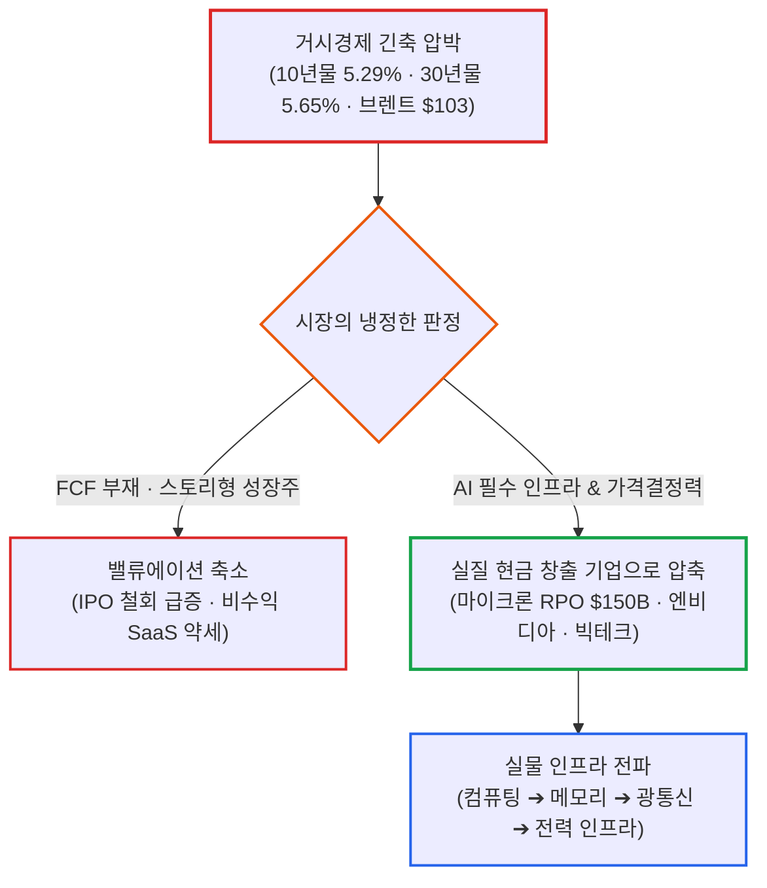

# 2026년 09월 30일(수) 하루치 뉴스정리

- **작성일**: 2026-10-01

8월 근원 PCE 물가가 예상치를 밑돌며 둔화세를 보였음에도 미 10년물 국채금리는 5.29%를 뚫고 30년물은 5.65%까지 치솟았으며 브렌트유는 배럴당 103달러를 돌파했다. 채권시장이 2분기 GDP 상향(2.2%)과 실질소비 호조(+0.6%)를 근거로 장기 할인율을 끌어올리는 동안, 마이크론은 분기 매출 379% 폭증($54.23B)과 2028년 물량까지 묶인 1,500억 달러의 확정 계약(RPO)이라는 압도적인 숫자를 증명했다. 지금 시장은 지수 전체가 아니라, 5%대 장기금리의 무자비한 할인율을 견고한 현금흐름과 독점적 실적으로 이겨내는 진짜 AI 인프라 기업으로 유동성이 압축되는 장세다.

## 요약

| 구분 | 주요 내용 |
| :--- | :--- |
| **핵심 진단** | 물가 둔화(PCE +0.2%)에도 2분기 GDP(2.2%)와 소비 호조로 10년물(5.29%), 30년물(5.64%), 유가($103) 급등. 지수 확장이 아닌 강력한 FCF와 가격결정력을 갖춘 기업으로 자금 압축 |
| **핵심 종목 팩트** | 마이크론 FY26 4Q 매출 $54.23B(YoY +379%), 비GAAP EPS $33.42, 총마진 87.0%, 조정 FCF $33.2B. RPO $150B 돌파 및 FY27 생산량 75% 이상 선계약 체결, 2028년 물량 협상 진행 |
| **착시 교정** | ① "PCE 둔화 = 금리 리스크 종료" 착시(장기 기간프리미엄과 재정적자 부담 무시), ② "마이크론 시간외 하락(-0.67%) = 실적 실망" 착시(극단적 기대치 선반영에 따른 매물 소화) |
| **돈길 확산 신호** | AI 가치사슬 4대 축 전파: 연산(AMD 헬리오스 랙·HPE $1.2B) ➔ 메모리(마이크론) ➔ 네트워크(코닝-AT&T $3B 광섬유) ➔ 전력(블룸에너지·GE버노바 $189B 수주잔고) |
| **가장 더러운 변수** | 10년물 5.3% 및 30년물 5.65% 장기금리 고착화. IPO 연기·철회(3Q 7건)와 소비자신뢰지수(81.9, 2014년 이후 최저)가 가리키는 지수 밖 금융여건 긴축 심화 |
| **계좌 행동 지침** | 호실적 장대양봉 메모리주 뇌동추격 금지(2027~28 EPS 컨센서스 상향 추적). '스토리형 AI'·미수익 SaaS 축소 및 백로그·FCF·설비 증설이 검증된 실물 인프라주로 포트폴리오 압축 |

---

## 1. 결론부터: 5.3% 장기금리 압박과 마이크론의 룰 체인지

지금 시장은 인플레이션이 잡혀서 모든 성장주를 편하게 사는 장이 아니다.

AI가 만들어내는 실적 증가 속도가 5%대 장기금리의 할인율 압박을 이길 수 있는 기업만 살아남는 장이다.

오늘 나온 수많은 뉴스 중 가장 결정적인 것은 PCE 지표도, 지수 등락도 아니다. 마이크론의 실적 발표다.

마이크론 실적은 단순한 반도체 호실적에 그치지 않는다. AI 수요로 인해 메모리 반도체 산업의 돈 버는 구조 자체가 완전히 바뀌고 있음을 증명했다.

---

## 2. 오늘 시장에서 진짜 중요한 숫자: 매크로의 기현상

미국 시장은 표면적으로 기묘한 하루를 보냈다.

### 주요 지표 마감 현황

| 구분 | 마감 수치 | 변동률 | 시장 의미 |
| :--- | :---: | :---: | :--- |
| **다우존스** | 42,156.97 | -0.86% | 전통 경기민감주 매도 우세 |
| **S&P 500** | 5,738.17 | -0.25% | 장중 상승분 반납 후 하락 마감 |
| **나스닥** | 18,188.30 | +0.24% | 메가캡 AI 기술주 중심 방어 성공 |
| **미 국채 2년물** | 4.887% | 하락 | 10월 연준 금리인상 확률 30%대로 하락 |
| **미 국채 10년물** | 5.293% | 장중 5.307% 돌파 | 강한 경제 성장에 따른 장기채 매도 |
| **미 국채 30년물** | 5.638% | 장중 5.652% 기록 | 구조적 기간프리미엄 및 재정 부담 반영 |
| **WTI 유가** | $90.42 | 배럴당 상승 | 에너지 가격발 인플레이션 하방 경직성 |
| **브렌트유** | $103.53 | $100 돌파 고착화 | 글로벌 공급망 물류 및 비용 압박 지속 |

금리도 높고 유가도 치솟았는데 나스닥 기술주는 버텼다. 이것이 오늘 장세의 핵심이다.

아침에 나온 8월 개인소비지출(PCE) 물가만 보면 시장에는 분명한 호재였다.

근원 PCE는 전월 대비 +0.2%로 예상치(+0.3%)를 밑돌았고, 헤드라인 PCE 역시 +0.3%로 예상보다 낮았다. 그 결과 10월 연준 금리인상 확률은 전날 50%대에서 30%대로 떨어졌다.

그런데 채권시장은 축포를 터뜨리지 않았다. 오히려 미 10년물 금리는 장중 5.307%까지 치솟았고, 30년물은 **5.652%까지** 올랐다.

원인은 하나다. 미국 경제가 식지 않고 있다.

미국 2분기 GDP 성장률은 기존 1.5%에서 2.2%로 대폭 상향 수정됐다. 민간 소비와 투자를 직접 보여주는 실질 민간 국내 구매자 최종판매는 **+4.6%까지** 폭등했다. 8월 실질 개인소비도 전월 대비 +0.6% 늘었다.

현재 매크로 환경은 한 문장으로 정리된다:

> **물가는 서서히 식어가는데, 실물 경제는 전혀 식지 않는다.**

이 환경에서는 연준이 서둘러 기준금리를 추가 인상할 명분도 줄어들지만, 반대로 장기금리가 가파르게 내려갈 이유도 없다.

---

## 3. 마이크론 실적의 본질: EPS가 아니라 1,500억 달러의 확정 계약

오늘 발표된 마이크론의 실적 숫자는 기존 반도체 업계의 상식을 뛰어넘는다.

### 마이크론 FY26 4분기 확정 실적 및 가이던스

| 항목 | 이번 분기 실적 | 시장 컨센서스 | 전년 동기 대비(YoY) |
| :--- | :---: | :---: | :---: |
| **매출액** | **$54.23B** | $53.10B | **+379%** |
| **비GAAP EPS** | **$33.42** | $31.50 | 흑자 전환 폭증 |
| **매출총이익률(Gross Margin)** | **87.0%** | 84.5% | 압도적 마진 확대 |
| **영업이익률(Operating Margin)** | **82.3%** | 79.0% | 제조업 역사상 최고 수준 |
| **영업현금흐름** | **$43.97B** | — | 막대한 현금 창출 |
| **조정 잉여현금흐름(FCF)** | **$33.20B** | — | 분기 사상 최대치 달성 |
| **다음 분기(FY27 1Q) 매출 가이던스** | **$60.0B ~ $63.0B** | $57.90B | 시장 예상치 대폭 상회 |

여기까지만 보면 단순한 실적 대박처럼 보인다. 하지만 진짜 핵심은 손익계산서 아래에 숨어 있는 1,500억 달러라는 수치다.

마이크론은 현재 주요 하이퍼스케일러와 **26건의 전략적 고객 계약(SCA)**을 체결했다.

이 계약에서 발생할 예상 매출 중 약 75%는 이미 가격결정 구조까지 확정됐다. 가격 구조가 확정된 계약 잔여 이행 의무(RPO)만 약 1,500억 달러($150B)에 달한다.

마이크론 CFO에 따르면, 이 RPO 숫자는 '약정 최소 물량 × 최저 보장 가격'으로 보수적으로 계산된 수치다. 실제 발생 매출은 1,500억 달러를 훌쩍 넘어설 수 있다.

생산량 측면에서도 놀라운 사실이 확인됐다:

- FY27 생산 예정 물량의 75% 이상이 이미 고객사 주문과 계약으로 묶여 있다.
- 현재 고객들과 협상 중인 물량의 상당 부분은 벌써 2028년 납품 물량이다.
- 2027년 HBM 물량 대부분도 이미 계약이 끝났으며, 공급 단가는 2026년보다 크게 상승했다.

---

## 4. 메모리 산업의 치명적 약점이 깨지고 있다

과거 메모리 반도체 산업은 극단적인 롤러코스터 사이클에 갇혀 있었다.

1. 수요가 증가하면 삼성전자, SK하이닉스, 마이크론이 공장(CAPEX)을 공격적으로 짓는다.
2. 2~3년 뒤 신규 공장이 가동되면서 공급 과잉이 발생한다.
3. 메모리 가격이 폭락하고 재고가 쌓이며 대규모 적자가 난다.
4. 감산에 들어가고 가격이 바닥을 치면 다시 사이클이 돌아온다.

이 때문에 시장은 메모리 기업에 언제나 PER 5~8배 수준의 극단적인 밸류에이션 할인을 적용했다.

그런데 이번 AI 사이클에서 전혀 다른 흐름이 나타나고 있다.

빅테크 고객들이 "가격을 깎아달라"고 요구하는 것이 아니라, **"몇 년 치 물량이라도 좋으니 장기 공급을 확약해 달라"**고 매달리고 있다. 마이크론은 이미 일부 핵심 고객사와 2031년까지 이어지는 장기 공급 계약을 체결했다.

과거에는 메모리 기업이 수요 예측 없이 공장부터 짓고 나중에 팔 곳을 걱정했다. 지금은 고객사로부터 가격과 물량이 확정된 계약을 먼저 받아두고, 그 계약을 담보로 공장을 증설한다.

설비투자 위험이 획기적으로 낮아진 것이다. 이 구조적 변화가 입증된다면 메모리 반도체 기업들의 밸류에이션 평가 방식(PER 멀티플)도 구조적으로 재평가받을 수 있다.

---

## 5. 시장의 오해와 교정: 시간외 하락과 범용 메모리 파급 효과

### 오해 ① "마이크론이 시간외에서 하락했으니 실적이 별로인가?"

실적 발표 직후 마이크론 주가는 시간외 거래에서 -0.67% 수준의 미미한 조정을 보였다.

이 숫자를 보고 실적을 폄하하는 것은 본질을 놓치는 일이다. 실적과 가이던스 자체는 흠잡을 곳이 없다.

좋은 실적과 좋은 주식은 다른 개념이다. 최근 마이크론 주가가 실적 기대로 단기 급등했기 때문에, 시장은 단순히 "실적이 좋은가"가 아니라 "극단적으로 치솟은 눈높이보다 얼마나 더 좋은가"를 저울질했을 뿐이다.

시간외 약세는 메모리 업황의 훼손이 아니라, 기대치가 선반영된 데 따른 단기 차익 실현 매물 소화 과정이다.

### 오해 ② "HBM만 호황이고 일반 DRAM·낸드는 여전히 남아돌지 않나?"

마이크론 CEO는 컨퍼런스 콜에서 의미심장한 선언을 남겼다:

> **"FY27과 FY28의 메모리 및 스토리지 수급은 FY26보다 훨씬 더 타이트해질 것이며, 공급이 수요를 언제 따라잡을 수 있을지 시점조차 보이지 않는다."**

이 말이 사실이라면, "HBM만 좋고 일반 DRAM은 정상화된다"는 시장의 가설은 깨진다.

AI 모델이 고도화될수록 GPU만 늘어나는 것이 아니다:

- 거대언어모델의 파라미터가 증가한다.
- 프롬프트 컨텍스트 길이가 기하급수적으로 길어진다.
- 실시간 동시 접속자와 추론(Inference) 워크로드가 급증한다.
- 24시간 작동하는 AI 에이전트가 도입된다.

이 모든 단계에서 서버 1대당 요구되는 시스템 메모리 용량 자체가 폭발한다. 결국 HBM 수요 폭증은 일반 서버용 DDR5, 기업용 SSD(eSSD)로 고스란히 번진다.

이번 실적 발표는 HBM 단일 품목의 슈퍼사이클을 넘어, **메모리 전체 생태계의 AI 리레이팅 가능성**을 강력하게 시사한다. 이는 마이크론뿐 아니라 삼성전자와 SK하이닉스에도 막대한 수혜가 연결됨을 뜻한다.

---

## 6. 낙관론 뒤에 숨은 냉혹한 현실: 설비 증설의 시차

호재에만 취해 있으면 반드시 사고가 난다.

마이크론은 FY27 1분기 CAPEX로 115억 달러($11.5B), 상반기 누적으로 약 250억 달러를 집행할 계획이라고 밝혔다. 하반기 투자액은 상반기보다 더 커질 예정이다.

결국 반도체 기업들은 역사상 최대 규모로 공장을 짓기 시작했다.

앞으로 투자자가 추적해야 할 단 하나의 잣대는 다음과 같다:

> **AI 메모리 수요의 증가 속도가 증설된 공급 물량의 출회 속도를 언제까지 앞설 수 있는가?**

이 수급 우위가 2027~2028년까지 유지된다면 현재의 메모리 강세론이 완벽히 들어맞는다.

하지만 2028~2029년 전 세계 파운드리와 메모리 팹이 일제히 가동되며 공급이 쏟아지기 시작하면, 전통적인 다운사이클의 망령이 다시 고개를 들 수 있다.

"메모리 사이클이 영원히 소멸했다"는 주장은 위험한 환상이다. 현재 확실한 팩트는 **사이클의 가시성과 이익 체력이 과거 그 어느 때보다 압도적으로 길어지고 강해졌다는 점까지**다.

---

## 7. PCE의 함정과 채권시장의 경고: 30년물 5.65%의 파괴력

미국 장 초반 시장은 기계적인 안도 랠리를 펼쳤다.

PCE 물가가 낮게 나오자 연준의 금리인상 확률이 떨어졌고, 이에 환호하며 S&P 500은 장중 +0.60%, 나스닥은 +0.99%까지 치솟았다.

그러나 종가는 정반대였다. S&P 500은 -0.25%로 반락했고, 나스닥은 +0.24% 강보합에 턱걸이했다.

장중 상승분을 전부 토해낸 이유는 채권시장의 완강한 거부 때문이었다.

물가는 식었지만 미국 경제의 엔진은 뜨겁다:

- 2분기 GDP 확정치 +2.2% (전기 대비 성장률 상향)
- 실질 민간 국내 구매자 최종판매 **+4.6%까지** 폭증
- 8월 실질 개인소비 +0.6% MoM
- 민간 고용(ADP) +9만 명 기록 (예상치 +7만 명 상회)
- WTI $90 상회, 브렌트유 $103 돌파

연준이 기준금리를 추가로 올리지 않더라도, 채권시장이 스스로 장기금리를 밀어 올리며 금융 여건을 무겁게 조이고 있다. 이것이 현재 주식시장의 밸류에이션 확장을 가로막는 가장 거대한 장벽이다.

특히 미 국채 10년물(5.293%)보다 **30년물(5.638%, 장중 5.652%)**의 움직임을 주시해야 한다.

단기물인 2년물 금리는 오히려 하락했는데 초장기물 금리가 급등했다. 시장이 우려하는 것은 당장의 연준 기준금리가 아니라, **강한 명목 성장률, 재정적자 폭증에 따른 장기채 수급 불균형, 기간프리미엄(Term Premium)**이다.

연준의 FedWatch 확률표만 들여다보며 매매하는 전략은 반쪽짜리에 불과하다. 연준이 금리를 동결하더라도 장기금리가 5.3~5.6%에 박혀 있는 한, 주식시장 전반의 할인율 부담은 해소되지 않는다.

---

## 8. 나스닥이 버틴 이유와 AI 인프라의 4대 자금 경로

그럼에도 불구하고 나스닥이 플러스권을 지켜낸 것은 대단히 중요한 시그널이다.

10년물 금리가 5.3%에 육박하는 환경 속에서도 엔비디아, 애플, 알파벳, 마이크로소프트, 아마존, 테슬라 등 빅테크 메가캡 주식들은 하방을 단단히 방어했다.

이는 시장이 기술주를 묻지마 매수한 것이 아니다. **5%가 넘는 무자비한 할인율을 압도할 만큼 확실한 이익 체력을 가진 기업으로만 자금이 쏠리고 있다는 증거**다.

성장주의 합격 기준이 근본적으로 변했다:

- **과거 성장주 기준**: 단순 매출액 성장률(Top-line Growth)
- **현재 성장주 기준**: 매출 성장률 + 막대한 잉여현금흐름(FCF) + AI 인프라 지출 수혜 + 독점적 가격결정력

현재 시장의 돈이 움직이는 경로는 4대 핵심 축으로 뚜렷하게 나뉜다:

### AI 인프라 자금 이동의 4대 경로

| 분야 | 핵심 기업 및 최근 수주 동향 | 구조적 수혜 배경 |
| :--- | :--- | :--- |
| **① 연산 (Compute)** | AMD 헬리오스 AI 랙, HPE의 Vultr향 $1.2B 서버랙 수주 | MI455X GPU 72개뿐 아니라 EPYC CPU, Pensando NIC, 네트워크 전반이 일괄 통합 판매 |
| **② 메모리 (Memory)** | 마이크론, SK하이닉스 | AI 모델의 크기와 추론량 증가로 GPU 1개당 메모리 탑재 용량 폭증. 펀더멘털이 가장 확실한 축 |
| **③ 네트워크 (Networking)** | 코닝, 브로드컴, 아리스타 네트웍스 | 데이터센터 내부 트래픽 폭증으로 GPU ➔ NIC ➔ 스위치 ➔ 광트랜시버 ➔ 광섬유로 투자 전파. AT&T-코닝 $3B 광섬유 계약 체결 |
| **④ 전력 인프라 (Power)** | 블룸에너지, GE 버노바 | 블룸에너지 생산설비 2배 증설 및 오라클 2.4GW 프로젝트 진행. GE 버노바 데이터센터 수주잔고 약 $189B 도달 |

AI 인프라 투자는 더 이상 GPU 반도체 기업들만의 잔치가 아니다. 실물 컴퓨팅 전체와 전력망으로 전주기적 확산이 일어나고 있다.

---

## 9. 적신호가 켜진 영역들: 비수익 SaaS, IPO 시장, 소비의 균열

### ① 소프트웨어(SaaS)의 그늘: "사용과 결제는 다르다"

하드웨어와 인프라는 돈을 쓸어 담고 있지만, 소프트웨어 업계는 여전히 실질적인 수익화의 벽에 부딪혀 있다.

세일즈포스(Salesforce) 고객 설문에서 자사 AI 플랫폼인 '에이전트포스(Agentforce)'를 도입하거나 테스트 중이라는 응답이 **85%였다.**

겉보기에는 폭발적인 확산처럼 보인다. 하지만 실상을 뜯어보면 기업의 절반 가까이가 아직 단순 파일럿이나 무료 테스트 단계에 머물러 있다.

오펜하이머(Oppenheimer) 증권 역시 세일즈포스의 실질적 생산성 개선과 유료 과금 모델이 불명확하다고 경고했다.

앞으로 AI 소프트웨어 기업을 평가하는 유일한 질문은 **"이용자가 늘었는가"가 아니라 "고객이 실제로 돈을 얼마 지불하고 있는가"**여야 한다.

### ② 에이전트 AI의 상용화와 이커머스 방파제

오픈AI의 '도츠(Dots)', 메타의 '뮤즈(Muse)' 등이 공개되면서, AI는 단순히 질문에 텍스트로 답하던 수준을 넘어 **웹과 앱에서 실제 행동과 결제를 대행하는 단계**로 진입하고 있다.

이 변화는 광고 플랫폼의 문법을 뒤흔들 수 있다. 소비자가 '포털 검색 ➔ 광고 링크 클릭 ➔ 가격 비교 ➔ 결제'를 거치는 대신, AI에게 "내 조건에 맞는 최저가 상품을 주문해 줘"라고 명령하면 검색 광고의 효용은 줄어든다.

그렇다고 해서 "AI 에이전트가 아마존을 무너뜨린다"는 식의 단순한 비관론은 틀렸다.

AI가 사용자 인터페이스를 장악하더라도 물류센터, 풀필먼트 배송망, 실물 결제 시스템, 판매자 인프라를 쥔 아마존(Amazon)과 쇼피파이(Shopify) 같은 실물 파이프라인의 가치는 오히려 더 희소해진다. 껍데기 인터페이스보다 실물 경제의 파이프를 쥔 자가 승자다.

### ③ IPO 시장의 급랭과 소비자 심리의 역설

지수 밖에서는 금융 여건의 실질적 긴축이 이미 거세게 진행되고 있다.

- **IPO 시장 동결**: 최근 일주일 사이 4개 기업이 상장을 연기하거나 철회했다. 3분기 누적 연기·철회 건수는 7건으로 치솟았다. 5%대 국채금리와 인프라 투자 회수 우려로 고위험 자산에 대한 투자자들의 지갑이 닫히고 있다.
- **소비자 신뢰도와 실제 지출의 괴리**: 9월 미시간대/콘퍼런스보드 소비자신뢰지수는 81.9로 2014년 이후 최저치로 추락했다. 사람들은 물가, 고용 둔화, 유가 상승, 개인 부채를 심각하게 불안해하고 있다.

기분은 우울한데 지갑은 여전히 열고 있는 기현상이 이어지고 있다. 하지만 소득 증가율이 소비를 받쳐주지 못하고 저축률이 바닥나면 소비 둔화는 한순간에 닥칠 수 있다.

---

## 10. 현재 시장을 4등분하는 객관적 프레임

| 구분 | 판단 항목 및 핵심 팩트 |
| :--- | :--- |
| **확정된 사실** | 8월 근원 PCE(+0.2%) 예상 하회, 2분기 GDP(+2.2%) 상향, 10년물 5.29% 및 30년물 5.64% 안착, 마이크론 역사적 호실적과 1,500억 달러 확정 RPO 달성 |
| **신뢰도 높은 추정** | HBM 및 서버용 메모리 수급은 적어도 FY27~FY28까지 공급 부족이 이어질 가능성이 매우 높음. 단기 차익 매물 소화 후 실적 장세 지속 |
| **시장의 정당한 해석** | AI 실적 성장이 입증된 메가캡 및 핵심 인프라 기업은 5%대 장기금리를 이겨내지만, 현금흐름이 없는 일반 성장주는 가혹한 할인율 압박을 피할 수 없음 |
| **과장된 주장과 허구** | ① "PCE 둔화로 고금리 문제는 끝났다", ② "AI 간판만 달면 모든 주식이 오른다", ③ "메모리 반도체 사이클은 영원히 사라졌다" |

---

## 11. 종합 결론 및 핵심 실행 원칙

지금 미국 증시는 붕괴하는 장세가 아니다. 하지만 누구나 돈을 벌던 쉬운 상승장은 끝났다.

물가는 낮아졌으나 장기금리는 5.3%를 넘나들고 브렌트유는 103달러를 돌파했다. 이 환경에서 지수 전체의 멀티플 확장을 기대하는 것은 무리다.

동시에 마이크론처럼 '매출 폭증 ➔ 마진 폭증 ➔ 장기 계약 완판 ➔ 2028년 물량 선계약'이라는 전대미문의 실적을 찍어내는 기업들이 존재한다.

현재 시장을 관통하는 본질적 대결은 이것이다:

> **거시경제(Macro)는 무거운 할인율로 주가를 누르고 있고, AI 기업들의 실적(Earnings)은 그 압력을 위로 밀어 올리고 있다.**

이 팽팽한 힘겨루기 속에서 지수 전체가 아니라, AI에서 실질적인 현금(FCF)을 만들어내는 핵심 인프라 기업들만 승리하고 있다.

지금 계좌에서 집중해서 추적해야 할 핵심 지표는 다섯 가지다:

1. **미국 국채 10년물 금리 (5.3% 레벨 유지 여부)**
2. **마이크론의 2028년 장기 공급 계약 추이**
3. **빅테크 하이퍼스케일러의 설비투자(CAPEX) 집행 속도**
4. **HBM 및 고용량 서버 DRAM 현물/고정 거래 가격**
5. **AI 밸류체인 기업들의 실질 잉여현금흐름(FCF) 증가율**

10년물 금리는 시장 전체를 짓누르는 악재이지만, 나머지 네 가지 AI 실적 지표는 그 어느 때보다 강력하다.

따라서 지금은 AI 장세의 종료를 외치며 주식을 던질 때가 아니다. 고금리라는 거름망을 통해 실적 없는 허위 AI 기업을 솎아내고, 1,500억 달러의 확정 계약과 생산능력을 갖춘 진짜 인프라 핵심 기업으로 계좌를 압축해야 할 때다.

!!! tip "최종 핵심 제언 (Executive Takeaway)"
    - **호실적 장대양봉 메모리주 추격 매수 금지**: 펀더멘털은 최상이지만 단기 기대치가 주가에 선반영되었을 수 있다. 당장의 주가 변동보다 **2027~2028년 EPS 컨센서스 상향 속도**를 추적하며 눌림목을 활용해야 한다.
    - **AI 포트폴리오의 실물 압축**: 단순 기대감에 기대는 소프트웨어나 미수익 성장주를 정리하고, 장기계약·수주잔고·가격결정력·FCF가 증명된 **연산(Compute)·메모리(Memory)·광통신(Networking)·전력(Power)** 4대 인프라로 비중을 모아야 한다.
    - **장기금리 5.3%의 무게 직시**: 5%대 국채금리는 자산 시장 전체의 허들을 높인다. 돈을 벌지 못하고 미래 꿈만 파는 적자 성장 기업은 단 한 번의 분기 미스로도 가혹한 처벌을 받는다.
