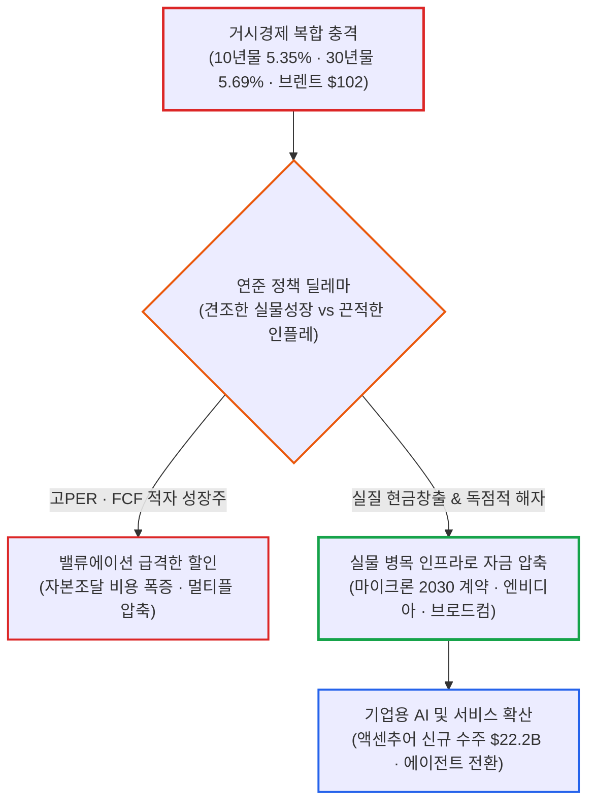

# 2026년 10월 01일(목) 하루치 뉴스정리

- **작성일**: 2026-10-02

미 10년물 국채금리가 장중 5.347%를 뚫고 30년물이 24년 만의 최고치인 5.693%까지 치솟았으며 브렌트유가 102달러를 돌파하는 매크로 폭격 속에서도, 필라델피아 반도체지수는 오히려 +1.59% 급등했다. 중국의 석유제품 수출 중단과 미국의 중동 증파로 유가 리스크가 고조되고 ISM 가격지수가 77.9로 치솟았지만 시장은 무너지지 않고 살아남았다. 지수 전체가 좋아진 것이 아니다. 5%대 장기금리와 100달러 유가라는 무자비한 할인율을 견고한 자체 현금흐름과 독점적 가격결정력으로 버텨내는 소수의 병목 기업으로 글로벌 유동성이 극단적으로 압축되고 있다.

## 요약

| 구분 | 주요 내용 |
| :--- | :--- |
| **핵심 진단** | 미 10년물(5.347%)·30년물(5.693%) 24년 만의 최고치 경신 후 급반락. 5%대 장기금리와 100달러 유가를 버티는 압도적 FCF와 가격결정력을 갖춘 실물 병목주로 유동성 압축 |
| **핵심 종목 팩트** | 마이크론 2030년 장기공급계약 10곳 추가(컨센서스 상회폭 축소), 액센추어 신규 수주 $22.2B(주가 +16~17% 급등), 구글 제미나이 4 호조 속 에이전트 전환, 브로드컴 앤트로픽 $42B 지원설 |
| **착시 교정** | ① "국채금리 하루 급락 = 금리 리스크 종료" 착시(바이백·안전자산 반등일 뿐 글로벌 기간프리미엄 잔존), ② "S&P500 상승(+0.19%) = 시장 호조" 착시(장중 -1% 급락 등 극심한 변동성), ③ "AI Capex 증가 = 버블" 착시(실물 계약 및 서비스 수주 본격화) |
| **돈길 확산 신호** | AI 수익화 층위 전환: 연산·인프라(GPU·네트워크·메모리·전력) ➔ 기업 소프트웨어 및 시스템 통합(액센추어 $22.2B 수주) ➔ 실행형 AI 에이전트(업무 대체 및 실질 매출 창출) |
| **가장 더러운 변수** | WTI $92.87, 브렌트 $102.31의 고유가와 ISM 제조업 가격지수 77.9(+6.8p). 견조한 경제성장 속 고유가와 장기금리가 결합된 연준 딜레마. 오늘 밤 미국 9월 고용보고서(예상 +9만 명, 실업률 4.1%) 발표 |
| **계좌 행동 지침** | 지수 방향성 추종 자제. AI 핵심 병목주(메모리·네트워크·전력) 유지하되 추격매수 금지. FCF 없는 고PER 성장주 축소, 브렌트 $100 돌파 및 10년물 5.3% 핵심 경계선 설정 추적 |

---

## 1. 결론부터: 5.3% 장기금리와 100달러 유가를 견디는 자만의 축제

지금 시장은 **“고금리 공포가 끝난 장”이 아니다.**

정확히는 **5%대 장기금리와 100달러 유가를 버틸 수 있는 실적·현금흐름·가격결정력을 가진 기업으로만 계속 돈이 들어오는 장**이다.

10년물 국채금리는 장중 **5.347%까지**, 30년물은 **5.693%까지** 치솟았다가 급반락했다. 그런데 S&P500은 +0.19%, 나스닥은 +0.04%로 살아남았고, 필라델피아 반도체지수는 오히려 **+1.59%** 올랐다.

시장 전체가 좋아진 게 아니다. **돈이 강한 곳으로 더 좁게 몰린 것이다.**

내가 지금 가장 중요하게 보는 순서는 이거다:

- **① 오늘 미국 고용 ➔ ② 유가 ➔ ③ 미국 장기금리 ➔ ④ AI·반도체 실적 ➔ ⑤ 기업 현금흐름**

---

## 2. 매크로 팩트 체크: 국채금리 바이백과 진짜 시한폭탄 '유가'

### 2.1 미국 국채: 하루 떨어졌다고 채권 문제가 끝난 게 아니다

10년물은 장중 5.347%, 30년물은 5.693%까지 올라 **약 24년 만의 최고 수준**을 기록했다. 이후 2년물은 약 -10bp, 10년물은 약 -6bp 급락했다.

이유는 세 가지다:

- 최근 금리 상승이 워낙 가팔라 기술적 반발 매수가 들어왔다.
- 프랑스 재정 불안으로 미 국채가 상대적 안전자산 역할을 했다.
- 미 재무부가 10~20년물 **60억 달러 바이백 한도를 모두 채웠다.**

여기서 착각하면 안 된다.

**“국채금리가 떨어졌다 ➔ 금리 문제 해결”이 아니다.**

오히려 미국만의 문제가 아니다. 영국·프랑스·독일·일본까지 **재정적자와 장기채 공급 부담으로 글로벌 장기금리가 올라가는 구조**라는 게 핵심이다.

이건 단순 FOMC 기준금리 문제가 아니라 **기간 프리미엄 + 재정적자 문제**다.

---

### 2.2 지금 시장 최대 리스크는 금리가 아니라 유가다

이번 뉴스 묶음에서 나는 금리보다도 **유가를 더 위험하게 본다.**

- **WTI 원유**: **92.87달러**
- **브렌트유**: **102.31달러**

원인은 단순 원유 부족이 아니다.

중국이 10월 석유제품 수출을 중단했고, 미국의 중동 병력 증파 보도까지 겹쳤다. 특히 휘발유·디젤·항공유 같은 **정제제품 공급이 빡빡해지는 상황이다.**

여기가 진짜 골치 아픈 부분이다. 지금 미국 경제는 아직 탄탄하게 버티고 있다:

- **신규 실업수당 청구**: 19.7만 건 (여전히 견조한 고용)
- **ISM 제조업 지수**: 54.5 (9개월 연속 확장 국면)

그런데 ISM 가격지수는 **77.9로**, 전달보다 6.8포인트나 상승했다.

즉,

> **경제는 안 무너지는데 유가가 오르고 물가 압력도 여전히 남아 있다.**

연준 입장에서 가장 다루기 싫은 조합이다.

경기침체면 금리를 내리면 된다. 인플레이션만 있다면 금리를 올리면 된다.

그런데 지금은 **성장 + 고유가 + 재정적자 + 장기금리 상승**이 동시에 존재한다.

그래서 오늘 밤 고용보고서가 중요하다.

시장 예상은 **비농업 신규고용 +9만 명, 실업률 4.1%다.**

고용이 또 강하게 나오면 문제는 다시 국채시장으로 번진다.

---

## 3. 마이크론: 단순 호실적이 아닌 '2030년 장기계약'의 본질

이번 뉴스 중 개별 기업 단에서는 **마이크론이 제일 중요하다.**

대부분 사람들은 이렇게만 본다:

> “마이크론 실적 좋았다 ➔ 반도체 상승”

핵심은 그게 아니다.

마이크론이 **장기공급계약 고객 10곳을 추가했고 일부 계약은 2030년 이후까지 이어진다.**

모간스탠리는 고객들이 5년 뒤까지도 DRAM 확보에 불안을 느끼고 있다는 명백한 증거로 해석했다.

이게 진짜 중요하다. 과거 메모리 반도체는 전형적인 시클리컬 산업이었다:

> 가격 상승 ➔ 대규모 증설 ➔ 공급과잉 ➔ 가격폭락

그런데 고객들이 장기계약으로 물량을 묶어두기 시작하면, 공급업체 입장에서는 매출 가시성이 비약적으로 올라간다.

다만 한 가지는 분명히 인정해야 한다.

**기대치는 이미 미친 듯이 올라와 있다.**

지난 3개 분기 동안 실적과 가이던스가 컨센서스를 20~40%씩 이겼는데, 이번에는 실적 +5%, 가이던스 +6% 수준 상회에 그쳤다.

그래서 앞으로는 단순한 호실적이 아니라,

**“실적이 좋은가”가 아니라 “예상치보다 얼마나 더 좋으냐”**

의 싸움이 된다. 마이크론이 실적 발표 직후 시간외에서 오히려 하락했던 이유가 이것이다.

### 마이크론 실전 판정

| 점검 항목 | 현황 및 분석 | 실전 대응 기준 |
| :--- | :--- | :--- |
| **펀더멘털** | 압도적인 수주잔고와 2030년 장기계약 확보 | **강함** |
| **산업 사이클** | 고객사 선확보로 경기 변동성 완충 | **여전히 우호적** |
| **주가 밸류에이션** | 3개 분기 연속 어닝 서프라이즈로 눈높이 극대화 | **기대치가 너무 높아짐** |

따라서 반도체 장기 논리가 깨졌다고 볼 이유는 아직 없다.

하지만 마이크론 같은 종목을 실적 직후 급등한다고 추격 매수하는 것은 완전히 별개의 위험한 문제다.

---

## 4. AI 버블 논쟁에서 놓치면 안 되는 변화: 액센추어의 상징성

최근 시장에서 계속 나오는 얘기가 있다:

> “빅테크가 AI에 돈을 너무 많이 쓴다.”

이 지적은 **절반은 맞다.**

하이퍼스케일러들의 자본지출(CapEx)이 영업현금흐름을 넘어서면서 일부 기업의 FCF가 압박받고 있다는 분석이 실제로 나온다. 그래서 시장은 이제 단순 성장률만 보는 게 아니라 **FCF·ROE·부채·이익 안정성을** 정밀하게 따지기 시작했다.

그런데 여기서,

> “AI 투자가 많다 = AI 버블 붕괴”

까지 나아가는 것은 심각한 논리 비약이다.

왜냐하면 AI 투자로 **실제로 돈을 버는 층이 구체적으로 나오기 시작했기 때문이다.**

---

### 액센추어의 수주가 던지는 의미

액센추어(Accenture)는 분기 매출 187억 달러, 신규 수주 **222억 달러를** 발표했다. 1억 달러 이상 대형 수주만 141건에 달했고 주가는 약 +16~17% 급등했다.

이건 시장에 엄청난 의미가 있다.

AI 투자 초기에는 돈을 버는 기업이 주로 하드웨어 인프라에 국한됐다:

> **GPU ➔ 네트워크 ➔ 메모리 ➔ 전력 인프라**

그런데 이제 돈의 흐름이 다음 단계로 내려왔다:

> **컨설팅 ➔ 시스템 통합 ➔ 기업용 AI 소프트웨어**

즉 AI 자본의 흐름이 **'인프라'에서 '기업 소프트웨어·서비스'로** 실질 확산되기 시작했다는 명백한 증거다.

이것은 AI 강세장의 질과 지속 가능성을 평가할 때 대단히 중요한 분기점이다.

---

## 5. 알파벳(구글): 모델 성능만 좋으면 된다는 시대는 끝났다

구글의 제미나이 4가 코딩과 사이버보안 벤치마크에서 뛰어난 성능을 냈다는 것 자체는 긍정적이다.

그런데 월가는 별로 흥분하지 않는다.

왜 그럴까?

이제 AI 시장의 질문이 근본적으로 바뀌었기 때문이다:

> “누가 제일 똑똑한 모델을 만들었나?”  
> ➔ **“누가 사용자 대신 실제 일을 하고 돈을 벌 수 있나?”**

시장에서도 구글의 핵심 변수를 제미나이 모델 자체가 아니라, 개인 AI 에이전트 **스파크(Spark)의** 확산 여부로 보고 있다. 지메일과 크롬이라는 전 세계 최강의 배포망을 쥐고도 유료 장벽과 기능 부족 때문에 실제 활용도가 낮다는 지적이다.

이것은 앞으로 모든 AI 기업을 평가할 때 반드시 적용해야 할 기준이다.

### AI 평가 기준의 진화

- **2023 ~ 2025년**: 모델 자체의 성능 평가 및 벤치마크 경쟁
- **2025 ~ 2026년**: GPU 수급 및 대규모 컴퓨팅 파워 확보 경쟁
- **2026년 이후**: **에이전트 실사용량 ➔ 실제 업무 대체 ➔ 기업 매출 전환 ➔ 잉여현금흐름(FCF)**

이제 단순 벤치마크 1등 뉴스에 흥분할 시기는 완전히 지나갔다.

---

## 6. 브로드컴 420억 달러 지원설: 초대형 호재인가 자본배분 리스크인가

이번 뉴스 묶음에서 개인적으로 **가장 검증이 필요한 뉴스가** 이것이다.

기사에서는 브로드컴이 앤트로픽(Anthropic)에 **최대 420억 달러를 전환사채 형태로 지원하고**, 앤트로픽이 2027년 브로드컴 반도체 사업의 최대 고객이 될 가능성이 있다고 보도했다.

이게 사실이라면 브로드컴에는 완전히 상반된 두 얼굴이 존재한다.

### 잠재적 호재

앤트로픽이 대규모 컴퓨팅을 구매하고, 구글 TPU를 활용하며, 그 안에서 브로드컴의 ASIC 및 네트워크 칩 수요가 폭발한다.

즉 브로드컴이 단순 반도체 부품 공급자를 넘어 **AI 컴퓨팅 생태계의 거대 자본 제공자** 역할을 하게 되는 것이다. 고객사 다변화 측면에서도 엄청난 진전이다.

### 치명적 위험

420억 달러는 결코 장난칠 규모가 아니다.

브로드컴이 돈을 빌려주고, 앤트로픽이 컴퓨팅을 사고, 그 컴퓨팅에 브로드컴 칩이 들어간다면 시장에서는 즉각 이런 의구심이 쏟아져 나온다:

> **“이것이 시장의 독립적인 수요인가, 공급자가 금융(Vendor Financing)까지 대줘서 인위적으로 만든 수요인가?”**

자동차 산업에서 완성차 제조사가 자체 금융사를 통해 무리하게 할부 대출을 깔아주며 차를 밀어낼 때 발생하는 신용 리스크와 판박이다.

따라서 이 건은 현재 단계에서는 **잠재적 초대형 호재인 동시에 막대한 신용 및 자본배분 리스크**다.

특히 420억 달러라는 천문학적 규모를 고려할 때, **브로드컴의 공식 IR 자료나 SEC 공시 확인 전까지는 확정 사실처럼 받아들이면 안 된다.**

---

## 7. 대중이 빠지기 쉬운 4대 착시 교정

### 착시 ① “국채금리가 하루 크게 내렸다. 이제 금리 정상화다.”

전혀 아니다.

이번 금리 반락은 과매도에 따른 기술적 반등, 프랑스 재정불안 반사익, 재무부의 60억 달러 바이백, 연준 동결 기대가 일시적으로 겹친 결과다.

장기채를 짓누르는 근본적인 문제는 단 하나도 해결되지 않았다:

> **재정적자 + 국채발행 폭탄 + 고유가 + 기간 프리미엄**

이 네 가지 구조적 악재가 꺾여야 금리가 정상화된다.

---

### 착시 ② “S&P500이 올랐으니 시장은 괜찮다.”

종가는 +0.19% 상승 마감했다.

하지만 장중에는 국채금리 발작 한 번에 S&P500 지수가 고점 대비 약 -1%까지 거칠게 밀렸다.

지수의 겉보기 종가만 보면 시장 내부의 거대한 수급 균열을 완전히 놓친다.

---

### 착시 ③ “마이크론 실적이 좋으니 메모리는 아무거나 사면 된다.”

아니다.

실적 자체는 훌륭하다. 하지만 **컨센서스를 상회하는 폭이 지난 분기들에 비해 현저히 줄어들고 있다.**

이제 시장이 원하는 것은 단순 호실적이 아니라 **끝없이 상향되는 추정치다.**

---

### 착시 ④ “AI CapEx 증가 = AI 버블”

너무 게으른 해석이다.

빅테크의 AI 투자 부담이 커진 것은 사실이다. 하지만 동시에 다음 계약들이 현실에서 체결되고 있다:

- **Micron**: 2030년 장기공급계약 10곳 추가
- **Accenture**: 222억 달러 규모 신규 수주 폭발
- **Constellation - Amazon**: 20년 원자력 전력 직공급 장기계약
- **Synopsys - Amazon**: 장기 EDA 공급계약

버블 논쟁보다 훨씬 본질적인 질문은 딱 하나다:

> **“누가 CAPEX를 쓰고, 누가 그 CAPEX를 현금 매출로 회수하느냐.”**

---

## 8. 스마트머니가 집결하는 4대 돈길

지금 글로벌 자금이 선호하는 방향은 극도로 명확해지고 있다:

- **① 강력한 FCF 창출 기업**: 5%대 국채금리 환경에서는 10년 뒤 돈 벌겠다는 회사보다 **지금 당장 현금을 꽂아 넣는 회사가 압도적으로 비싸진다.** FCF, ROE, 순부채 비율이 기업 가치를 가른다.
- **② AI 인프라 중 공급 병목 구간**: 메모리(DRAM·HBM), 네트워킹, 전력 설비, 커스텀 ASIC. 범용 연산 자체보다 **물리적으로 공급이 부족한 병목 지점**이 초과 마진을 독식한다.
- **③ 에너지**: 브렌트유가 100달러 이상을 유지하면 에너지는 단순 원자재가 아니라 **가장 확실한 현금흐름 트레이드가 된다.** 반면 항공·소비·운송 섹터에는 치명적인 비용 압박이다.
- **④ 초단기채**: 장기채는 여전히 기간프리미엄 리스크가 크다. 5%에 육박하는 무위험 단기금리가 존재하는 한, 굳이 변동성이 큰 장기물 방향성에 베팅할 이유가 없다.

---

## 9. 계좌 실전 대응 및 오늘 밤 고용 시나리오

내가 지금 투자자라면 **시장 전체의 지수 방향을 맞히려고 무리하지 않는다.**

대신 다음 네 가지 원칙으로 계좌를 운용한다:

1. **AI·반도체 핵심주는 지키되 급등 추격매수는 절대 금지한다**: 실적 추정치가 살아있는 동안 AI 사이클을 버릴 이유는 없다. 메모리·네트워크·전력 등 공급 제약이 확실한 영역은 계속 보유한다. 다만 단기 급등 종목을 뒤쫓아 사는 뇌동매매는 하지 않는다.
2. **현금흐름이 안 나오는 고PER 성장주는 과감히 줄인다**: 10년물 국채금리가 5%를 넘어가면 미래 가치에 적용하는 할인율 자체가 달라진다. "성장성 하나"만으로 PER 40~50배를 주던 저금리 시대는 끝났다.
3. **유가를 매일 아침 최우선으로 점검한다**: 나스닥 지수보다 훨씬 무서운 숫자는 **브렌트유 100달러**다. 브렌트가 105달러, 110달러 위로 안착하기 시작하면 시장의 주도 내러티브는 'AI 성장'에서 **'인플레이션 재가속과 긴축 장기화'로** 급변할 수 있다.
4. **미국 10년물 국채금리 5.3%를 핵심 경계선으로 본다**: 장중 고점이 약 5.35%였다. 다시 5.35%를 뚫고 올라서면 주식 밸류에이션 압박이 다시 거세진다. 반대로 5.0% 아래로 내려와야 성장주 전반에 숨통이 트인다.

---

### 9.1 오늘 밤 미국 9월 고용보고서 시나리오 매트릭스

미국 9월 비농업 신규고용 시장 예상치는 **+9만 명, 실업률 4.1%다.**

| 9월 고용 지표 결과 | 국채금리 향방 | 주식시장 영향 | 실전 대응 방침 |
| :--- | :---: | :---: | :--- |
| **예상치 대폭 상회** (+15만 명 이상) | **급등 (5.35% 돌파 시도)** | 고밸류 성장주 강한 압박 | 현금 비중 유지, 추격 매수 엄금 |
| **예상치 부합** (+8만 ~ +10만 명) | 제한적 등락 (5.1~5.3% 박스) | 실적 및 펀더멘털 중심 장세 | FCF 우량주 중심 선별 대응 |
| **적당히 약한 하회** (+5만 ~ +7만 명) | **하향 안정 (5.0% 하향 시험)** | 기술주·성장주 전반에 우호적 | AI 핵심 병목주 분할 매수 기회 |
| **쇼크성 급락** (마이너스 전환 등) | 단기 급락 후 불안 | 경기침체 공포 확산으로 변동성 | 방어적 현금 흐름 및 에너지 주목 |

가장 이상적인 숫자는 **적당히 약한 하회**다.

경제가 무너진 것은 아닌데, 연준의 추가 긴축 압력을 덜어주는 수준의 지표가 나올 때 성장주에 가장 유리한 환경이 조성된다.

---

## 10. 데이터 교차검증 주의사항 및 최종 결론

### 10.1 뉴스 데이터 내 충돌 및 오류 필터링

이번 뉴스 자료를 무비판적으로 받아들이면 안 되는 이유가 있다:

- **PMI 지표 불일치**: 동일한 뉴스 묶음 내에서 S&P 글로벌 제조업 PMI가 한 기사에서는 **55.9**, 다른 기사에서는 **44.8로** 완전히 상반되게 기재되어 있다. 둘 중 하나는 명백한 오기다.
- **마이크론 관련 수치 과대표기 가능성**: 마이크론의 매출, FCF, 목표주가 수치 역시 통상적인 산업 규모와 비교했을 때 이례적으로 크게 기재된 항목들이 있으므로 원문 공시 확인이 필수적이다.

따라서 이번 자료에서는 **시장 자금의 이동 방향성은 신뢰하되, 세부 숫자는 공식 공시 자료로 반드시 교차검증해야 한다.**

---

### 10.2 최종 한 줄 결론

**지금 시장은 “금리가 내려서 다 같이 오르는 장”이 아니다.  
5%대 국채금리와 100달러 유가를 버티면서도 EPS와 FCF가 우상향하는 기업만 살아남는 장이다.**

그리고 현재 그 조건을 가장 잘 충족하는 곳은 여전히 **AI 인프라의 물리적 공급 병목 구간(메모리·네트워크·전력)과 실제 현금흐름이 확인되는 기업용 AI 서비스 기업**이다.

!!! tip "최종 핵심 제언 (Executive Takeaway)"
    1. **할인율 공포 속 차별화**: 10년물 5.3%와 브렌트 $100는 지수를 짓누르지만, 진짜 현금을 버는 실물 AI 인프라의 해자를 더욱 돋보이게 만든다.
    2. **기대치와 추정치 추적**: 마이크론이 보여주듯, 이제는 단순 호실적이 아니라 추정치의 지속적 상향 여부가 주가를 결정한다.
    3. **스마트머니의 길**: FCF 없는 스토리형 AI는 정리하고, 수주잔고와 공급 병목을 쥐고 있는 독점적 1등 기업으로 계좌를 압축하라.
