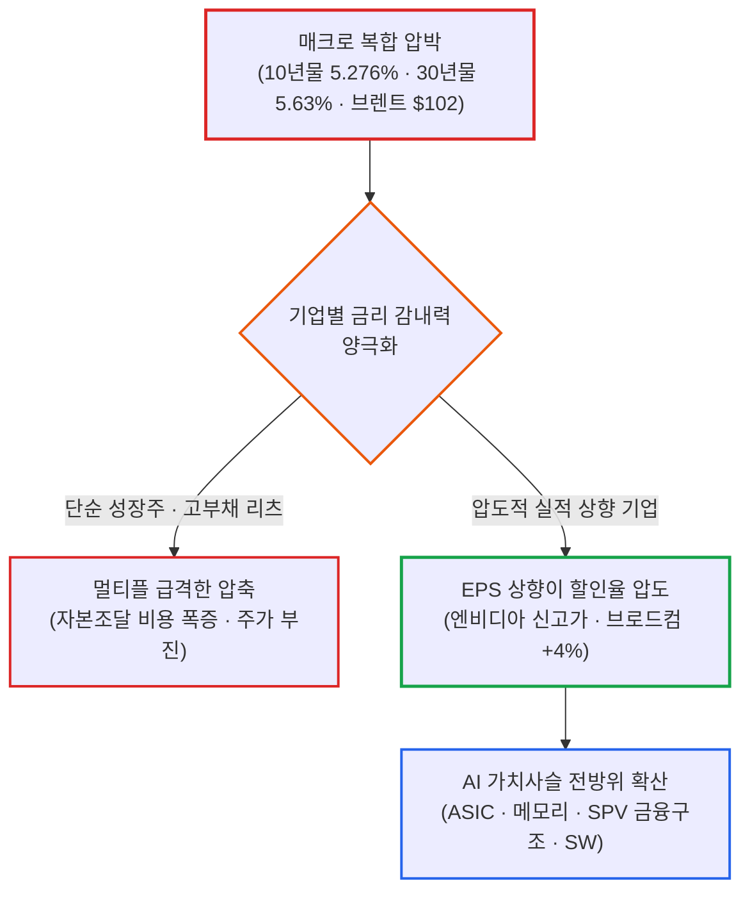

# 2026년 10월 02일(금) 하루치 뉴스정리

- **작성일**: 2026-10-03

9월 신규 고용이 2.9만 명으로 예상치(9만 명)를 처참하게 밑돌았음에도 미 10년물 국채금리는 5.276%로 오히려 치솟았고, 30년물은 5.63%를 찍었다. 고용이 식으면 금리가 내려간다는 교과서 공식이 완전히 깨졌지만, 나스닥은 +1.19% 급등했고 엔비디아는 또다시 역사적 신고가를 갈아치웠다. 매크로 공포가 끝난 것이 아니다. 5.3%에 육박하는 장기금리와 100달러대 유가라는 살인적인 할인율을 압도적인 EPS 상향으로 뚫어내는 소수 AI·반도체 병목주로 글로벌 유동성이 극단적으로 압축되고 있다.

## 요약

| 구분 | 주요 내용 |
| :--- | :--- |
| **핵심 진단** | 고용 쇼크(+2.9만)에도 10년물 5.276% 상승 마감. 매크로 할인율을 압도적인 EPS 상향(엔비디아 신고가·브로드컴 +4%)으로 돌파하는 소수 실적주로 압축 |
| **핵심 종목 팩트** | 엔비디아 신고가 경신, 브로드컴 +4%, 테슬라 3Q 인도량 48.6만 대(예상 상회) 및 메가팩 13.7GWh, 마이크론 2028년 메모리 공급부족 연장 전망 |
| **착시 교정** | ① "고용 둔화 = 금리 하락" 공식 파산(AI 투자·유가·재정적자가 장기금리 견인), ② "테슬라 판매 급증" 착시(전년비 역성장이나 우려 대비 호선방), ③ "비축유 1억 배럴 = 유가 안정" 착시(중동 불안 속 브렌트 $102 재진입) |
| **돈길 확산 신호** | AI 가치사슬의 수평·수직 확산: GPU 독점 ➔ ASIC·네트워크(브로드컴) ➔ 메모리 공급부족 장기화(마이크론) ➔ SPV 자본조달(아마존 80억 달러 GPU 유동화) ➔ 소프트웨어 수익화(IGV 3Q +17%) |
| **가장 더러운 변수** | 미 10년물 5.276%, 30년물 5.63%의 장기금리 고공행진과 브렌트유 $102.25. 고용 응답률 53.1%(1992년 이후 최저)에 따른 지표 수정 리스크 |
| **계좌 행동 지침** | "금리 인하" 기대 기반 무차별 성장주 매수 금지. 실적 추정치가 지속 상향되는 AI 병목 인프라 및 실질 현금화 소프트웨어로 압축 대응 |

---

## 1. 결론부터: 고용 쇼크에도 치솟는 5.28% 장기금리와 AI의 독주

지금 시장은 **“고용이 망가져서 금리가 내려가는 장”이 아니다.**

오히려 **고용은 식는데 장기금리는 다시 오르고, 그 와중에 AI·반도체 실적 기대가 지수를 끌어올리는 기묘한 장**이다.

9월 신규고용은 **2.9만 명으로** 시장 예상치인 9만 명을 크게 밑돌았고, 실업률은 4.2%로 올라갔다. 정상적인 매크로 환경이라면 국채금리가 급락해야 마땅하다. 실제로 10년물 금리는 지표 발표 직후 장중 5.155%까지 떨어졌다.

그러나 채권시장의 안도는 몇 시간 가지 못했다. 10년물 금리는 장 후반 가파르게 반등하여 **5.276%로 상승 마감**했고, 30년물은 **5.63%까지** 올라섰다. 

채권시장은 고용 둔화라는 단기 변수보다 **인플레이션·재정적자·AI 인프라 투자·유가라는 구조적 장기금리 상승 요인**을 훨씬 무겁게 보고 있다.

그런데도 나스닥은 +1.19% 상승했고, 브로드컴과 테슬라는 약 +4% 뛰었으며, 엔비디아는 역사적 신고가를 새로 썼다. 

이건 매크로 위험이 사라졌다는 뜻이 아니다. **높은 금리 비용을 기업의 압도적인 실적 성장으로 찍어누를 수 있는 종목에 돈이 집중적으로 몰리고 있다는 뜻**이다.

---

## 2. 오늘 시장에서 진짜 중요한 팩트: 고용 둔화와 통계의 함정

### 2.1 고용은 확실히 약해졌다

9월 비농업 고용 보고서의 숫자는 분명한 둔화를 가리킨다:

- **9월 비농업 신규 고용**: 예상 +9.0만 명 ➔ **실제 +2.9만 명**
- **8월 고용 수정치**: 기존 +16.2만 명에서 **+13.3만 명으로 하향 조정** (7~8월 합산 수치도 추가 하향)
- **시간당 평균 임금 상승률**: 전월 대비 +0.1%, 전년 대비 +3.0%로 둔화

이 수치를 단순 통계적 잡음으로 치부하기는 어렵다. 지난 12개월 평균 신규 고용이 **월 +4.5만 명** 수준까지 내려왔다는 것은 미국 노동시장의 과열이 완전히 식었음을 입증한다.

### 2.2 통계의 함정: 1992년 이후 최저 응답률

다만 숫자를 그대로 믿고 공포에 빠지기 전에 반드시 확인해야 할 사실이 있다.

이번 고용보고서의 기업조사 1차 응답률은 **53.1%로 1992년 이후 9월 기준 최저치**를 기록했다. 응답률이 절반 수준에 불과하다는 것은 향후 발표될 2차, 3차 수정치에서 숫자가 대폭 수정될 가능성이 매우 높다는 뜻이다.

따라서 지금 수치만 보고 "미국 고용 붕괴 확정"이라거나 "당장 경기침체 진입"이라고 단정 짓는 것은 명백한 과장이다.

현재 시점의 정확한 진단은 **"노동시장 둔화 흐름은 뚜렷하지만, 시스템적 경기침체를 확정할 수준은 아니다"**로 정리해야 한다.

---

## 3. 대중의 착시: "고용이 약하니 이제 금리는 내려간다?"

오늘 장에서 가장 위험한 착각은 "고용이 쇼크를 냈으니 연준이 금리를 내리고 채권금리도 안정될 것"이라는 순진한 논리였다. 이 논리는 발표 몇 시간 만에 처참하게 깨졌다.

고용 발표 직후 10년물 금리는 5.15%까지 급락했다. 그러나 장 마감 시점의 숫자는 다음과 같다:

- **미 국채 10년물**: **5.276%** (장중 저점 대비 +12bp 이상 급반등)
- **미 국채 30년물**: **5.630%**

채권시장의 반응은 단호하다. 고용 지표 하나 둔화되었다고 해서 5%를 웃도는 장기금리 프리미엄을 내놓을 생각이 없다는 선언이다.

현재 미국 장기금리를 밀어 올리는 동력은 노동시장 하나가 아니다:

- **빅테크의 천문학적 AI 데이터센터 투자**
- **전력망·변압기·건설 인프라 및 숙련 인력 부족**
- **글로벌 공급망 재편 비용**
- **중동 지정학적 충돌과 100달러를 넘나드는 고유가**
- **미국 정부의 막대한 재정적자와 천문학적인 국채 발행량**

이 복합 요인들이 동시에 작동하고 있다. 

연준의 리사 쿡(Lisa Cook) 이사 역시 AI 인프라 투자가 **2027년 인플레이션을 다시 자극할 핵심 위험**이 될 수 있다고 공식 경고했다. 실제로 현장에서는 전기 기술자와 특수 전력 기자재 부족 현상이 심화되고 있다.

앞으로 시장을 볼 때 **"고용 둔화 ➔ 금리 하락"**이라는 단순 1차원 공식에 의존하면 낭패를 볼 가능성이 높다.

---

## 4. 금리가 올랐는데 왜 기술주는 이렇게 강한가

여기서 핵심적인 질문이 나온다. 10년물 금리가 5.28%까지 올랐는데, 왜 기술주는 폭락하지 않고 강하게 치고 나갔는가?

- **나스닥 종합지수**: **+1.19%**
- **브로드컴(AVGO)**: **약 +4.0%**
- **엔비디아(NVDA)**: 장중 역사적 신고가 돌파
- **필라델피아 반도체지수(SOX)**: 장중 **+3.43%까지** 급등

단순히 금리가 내려가서 주가가 오른 것이 아니다. **장기금리가 전일보다 치솟았는데도 주식이 이를 버텨내고 밀어 올렸다.** 이 차이를 직시해야 한다.

이 현상이 가능한 이유는 단 하나다. AI 핵심 기업들의 **이익 추정치(EPS) 상향 속도가 금리 할인율 상승 속도를 압도하고 있기 때문**이다.

모건스탠리는 엔비디아의 FY28 기준 주가수익비율(PER)을 약 **15배 수준으로** 추정하고 있다. 지금 주가가 절대적으로 싸냐 비싸냐의 문제가 아니다. **분모인 주당순이익(EPS) 전망치가 계속해서 상향 조정되고 있다는 점**이 핵심이다.

현재 AI 랠리의 중심축은 단순한 멀티플 확장(PER 러시)에서 **실질적인 이익 증가(EPS 상향)**로 이동하고 있다. 주식 시장에서 이 변화는 매우 강력한 하방 지지력을 형성한다.

---

## 5. AI 투자의 결정적 병목 이동: 칩에서 인프라와 자금으로

AI 투자 생태계 내부에서 아주 중요한 지각변동이 일어나고 있다.

과거의 병목은 단순했다: **"엔비디아 GPU가 부족하다."**

그러나 현재의 병목은 완전히 다른 곳으로 이동했다:

- **데이터센터 부지를 확보하지 못한다.**
- **데이터센터를 돌릴 전력이 부족하다.**
- **천문학적인 설비투자(CAPEX)를 감당할 자금이 부족하다.**
- **데이터센터를 시공할 전문 인력이 부족하다.**

모건스탠리 역시 AI 인프라의 핵심 병목이 반도체 칩 공급에서 **데이터센터 건설 속도 및 자본조달 능력**으로 전환되고 있다고 분석했다.

이 병목의 이동은 글로벌 투자 지도를 재편한다. AI 투자의 수혜가 더 이상 엔비디아 단일 종목에 머무르지 않는다.

수혜의 사슬은 다음과 같이 확장되고 있다:

**GPU ➔ HBM(고대역폭메모리) ➔ 네트워크 ➔ 고성능 스토리지 ➔ 전력망·발전원 ➔ 액체 냉각 ➔ 데이터센터 EPC(건설) ➔ 금융 조달(PF)**

빅테크의 AI 인프라 CAPEX가 지속되는 한, 브로드컴(Broadcom)과 같은 고성능 네트워크 및 맞춤형 ASIC 칩 설계 기업이 구조적 핵심주로 부각되는 이유가 여기에 있다.

---

## 6. 브로드컴 +4% 상승의 본질과 한계

오늘 브로드컴의 약 +4% 상승을 두고 단순히 "나스닥 지수가 올라서 덩달아 올랐다"고 해석하면 본질의 절반을 놓치는 것이다.

최근 AI 하드웨어 아키텍처의 핵심 변화는 **단일 GPU 독점 구조에서 'GPU + 전용 ASIC + 초고속 네트워크 스위치'의 결합 구조**로 진화하고 있다는 사실이다.

뱅크오브아메리카(BofA)의 전망에 따르면 미국과 중국 주요 클라우드 서비스 제공업체(CSP)들의 연간 CAPEX는:

- **2026년**: **1조 달러**
- **2027년**: **1.4조 달러**

수준으로 추정된다. 이 막대한 자본 지출이 유지된다면 커스텀 ASIC과 네트워킹 분야를 장악한 브로드컴의 투자 논리는 견고하게 유지된다.

다만 이 상승을 맹목적으로 과장해서는 안 된다. 

오늘 주가가 +4% 올랐다고 해서 **브로드컴의 높은 구글(Google) 매출 의존도, 경쟁사들의 자체 ASIC 진입, 마진율 압박, 고객사와의 가격 협상력 한계** 같은 구조적 위험 요인이 일거에 해소된 것은 아니다.

정확한 사실 판단은 **"AI 인프라 CAPEX 확장이라는 거대한 산업적 조류가 브로드컴의 비즈니스 모델에 지속적으로 유리하게 작용하고 있다"**는 수준으로 정의하는 것이 합리적이다.

---

## 7. 오늘 가장 강력한 신호: 메모리 슈퍼사이클의 2028년 연장설

오늘 시장에서 가장 묵직한 신호는 마이크론(Micron)과 메모리 반도체 진영에서 나왔다.

단순히 "AI용 HBM 수요가 좋다"는 수준의 이야기가 아니다. 마이크론 경영진과 주요 글로벌 투자은행들이 제시한 핵심 포인트는 **메모리 공급 부족이 2027~2028년까지 장기화될 수 있다는 구체적인 가능성**이다.

특히 DA 데이비슨(DA Davidson)은 마이크론 경영진의 발언을 인용하며, **2028년 메모리 수급 환경이 현재보다 훨씬 더 타이트해질 수 있다**는 점을 가장 중요한 투자 포인트로 꼽았다.

이 시나리오가 현실화된다면, 시장이 오랫동안 두려워했던 **"2026년 메모리 반도체 사이클 정점론"**은 힘을 잃게 된다.

삼성전자의 차세대 HBM4 가격 책정 관련 보도 역시 같은 맥락이다. 시장 보도에 따르면 삼성전자는 HBM4에 대해 기존 HBM3E 대비 **3배 수준의 가격**을 제시하고 있는 것으로 알려졌다. 

다만 이는 공급사의 **제안 가격(Quotation)**일 뿐 최종 확정 계약가가 아니다. 향후 엔비디아 등 주요 고객사의 품질 인증 통과 여부와 실제 양산 수율에 따라 최종 단가는 달라질 수 있다.

여기서는 팩트와 기대를 냉정하게 분리해야 한다:

- **확정된 사실**: AI 가속기용 메모리 수요는 여전히 견고하다.
- **신뢰도 높은 추정**: 2027~2028년 메모리 수급 밸런스가 과거 전망보다 훨씬 타이트해질 확률이 높아졌다.
- **시장 해석**: 메모리 슈퍼사이클의 지속 기간이 종전 예상보다 길어질 수 있다.
- **과도한 기대**: "HBM 공급가격이 무조건 3배 폭등한다"는 해석은 아직 검증되지 않은 섣부른 판단이다.

---

## 8. 시장의 진짜 뇌관: 유가의 불길한 반등

오늘 WTI 원유 선물 가격은 -1.9% 하락 마감했다. 겉으로 드러난 종가만 보면 에너지 리스크가 진정된 것처럼 보인다.

그러나 장중 궤적을 보면 전혀 다른 공포가 숨어 있다. 장중 WTI는 **-5.0%까지** 폭락했었다.

주요 7개국(G7)이 총 **1억 배럴 규모의 전략비축유(SPR) 방출**을 공식 발표하면서 원유 가격이 일시 급락했다. 그러나 사우디아라비아의 예멘 후티 반군 공격 가능성 등 중동의 지정학적 무력 충돌 뉴스가 전해지자마자 낙폭을 대부분 만회하며 급반등했다:

- **WTI 원유**: **배럴당 $91.11**
- **브렌트유**: **배럴당 $102.25** (장중 하락분을 전부 되돌리며 보합권 마감)

비축유 방출 뉴스를 보고 "유가 위기가 완전히 해결되었다"고 판단하는 것은 치명적인 오판이다. 1억 배럴을 4개월 동안 방출한다고 가정하면, 일일 공급량은 대략 **80만 배럴 안팎**이다.

결코 적은 물량은 아니지만, 중동 호르무즈 해협이나 주요 산유국 시설에서 실제 물리적 공급 차질이 발생할 경우 단숨에 상쇄될 수 있는 규모다.

이것이 오늘 시장에서 나타난 기묘한 삼각 모순의 배경이다:

**고용 지표 둔화(↓) + 유가 장중 급락(↓) ➔ 그럼에도 장기금리 상승(↑)**

채권시장은 1억 배럴 방출이라는 단기 처방에도 불구하고, 브렌트유가 102달러 선을 지켜내고 있는 현실을 보며 인플레이션이 결코 쉽게 죽지 않을 것임을 간파하고 있다.

---

## 9. 테슬라 3분기 인도량: 어닝 서프라이즈 뒤에 숨은 착시

테슬라(Tesla)의 3분기 차량 인도 실적은 숫상으로 서프라이즈를 기록했다:

- **3분기 차량 인도량**: **486,532대**
- **월가 컨센서스**: **약 461,000대**

시장 기대치를 약 2.5만 대 이상 상회한 확실한 실적 선방이다. 

그러나 전년 동기 실적과 비교하면 냉정한 현실이 드러난다:

- **2025년 3분기 인도량**: **497,099대**

즉, 전년 동기 대비로는 **여전히 역성장(-2.1%)** 상태다.

따라서 이번 실적을 두고 "테슬라 전기차 사업이 다시 과거와 같은 폭발적인 성장 궤도에 재진입했다"고 해석하는 것은 틀렸다. 

정확한 평가는 **"최악을 우려했던 전기차 완성차 사업이 시장의 비관론보다는 훨씬 단단하게 버텨냈다"**로 보는 것이 맞다.

오히려 전기차보다 구조적으로 주목할 숫자는 에너지 저장장치(Megapack) 부문이다. 3분기 에너지 저장장치 설치량은 **13.7GWh로**, 전년 동기(12.5GWh) 대비 꾸준한 성장세를 이어갔다. 전력망 부족 시대에 메가팩의 현금 창출력은 장기적으로 전기차 마진 둔화를 방어할 중요한 축이다.

현재 테슬라의 주가에는 단순 전기차 판매 대수뿐만 아니라 로보택시(Cybercab), 옵티머스(Optimus), 완전자율주행(FSD) 및 인공지능 인프라에 대한 복합적 옵션 프리미엄이 반영되어 있다.

---

## 10. 아마존의 80억 달러 GPU SPV 이전 검토: AI 투자의 금융화

언론에서 크게 부각되지 않았지만, 장기 구조적으로 가장 주목해야 할 뉴스는 아마존(Amazon)의 자본 조달 방식이다.

외신 보도에 따르면 아마존은 약 **80억 달러 규모의 엔비디아 GPU 자산을 특수목적법인(SPV)으로 분리 이전**하는 금융 구조를 유력하게 검토하고 있다.

이 뉴스가 던지는 메시지는 명확하다. AI 데이터센터 확장의 진짜 병목이 이제 GPU 부품 가격을 넘어 **빅테크의 자본 지출(CAPEX) 한도와 대차대조표 건전성 관리 문제로 비화**되고 있다는 점이다.

마이크로소프트, 아마존, 알파벳 같은 하이퍼스케일러들이 연간 수백억~수천억 달러를 데이터센터에 쏟아붓기 시작하면, 아무리 현금이 넘치는 기업이라도 자본 효율성(ROIC)과 부채비율 부담에 직면한다.

그래서 등장한 대안이 구조화 금융이다:

- **기존 방식**: 빅테크가 자체 현금으로 GPU를 전량 직접 구매하여 보유
- **새로운 금융 모델**: 
    1. 외부 자본과 합작하여 특수목적법인(SPV) 설립
    2. SPV가 GPU 자산을 매입·보유
    3. 사모펀드·인프라 펀드 등 외부 민간 자본 유치
    4. 빅테크(아마존)는 SPV로부터 GPU 연산력을 클라우드로 임대하여 사용

AI 인프라 투자가 단순한 첨단 기술 산업의 영역을 넘어 **대규모 프로젝트 파이낸싱(PF)과 대체자산 유동화가 결합된 금융 산업의 영역으로 진화**하고 있다는 결정적 증거다.

향후 AI 사이클의 지속성을 평가할 때는 단순 GPU 출하량뿐만 아니라 **빅테크의 자본 조달(CAPEX financing) 구조와 조달 금리**를 필수적으로 추적해야 한다.

---

## 11. 엔터프라이즈 소프트웨어의 부활: 랠리의 층위 확산

지난 3분기 동안 시장에서 매우 의미 있는 자금 이동이 발생했다:

- **IGV(iShares 테크-소프트웨어 ETF)**: **+17.0%**
- **SOXX(iShares 반도체 ETF)**: **-11.0%**

개별 소프트웨어 대표 기업들의 주가 흐름 역시 폭발적이었다:

- **세일즈포스(Salesforce)**: **+46%**
- **마이크로소프트(Microsoft)**: **+37%**
- **워크데이(Workday)**: **+55%**
- **비바 시스템즈(Veeva Systems)**: **+60%**

이 자금 흐름은 AI 랠리가 반도체 칩에서 **기업용 소프트웨어 실사용 단계로 확산**되고 있음을 보여준다.

시장의 핵심 질문이 완전히 바뀌었다:

- **과거의 공포**: "AI가 코딩과 소프트웨어를 대체해서 기존 SaaS 기업들이 전부 망하는 것 아닌가?"
- **현재의 현실**: "기존 엔터프라이즈 고객 기반을 장악한 소프트웨어 기업들이 AI 에이전트를 결합해 얼마나 큰 신규 매출을 창출(Monetization)할 수 있는가?"

이제 투자자는 단순 설비투자 규모(AI CAPEX)만 볼 것이 아니라, 기업들이 실제로 AI 기능을 과금 모델로 전환하는 **AI 수익화 지표(ARPU 증가율, 유료 계약 규모, 클라우드 매출 성장률)**를 확인해야 한다.

세일즈포스, 마이크로소프트, 서비스나우 등에서 실질적인 AI 마진과 매출 증가가 숫자로 증명된다면, AI 강세장의 수명은 한 단계 더 연장될 수 있다.

---

## 12. 애플의 구조적 딜레마: AI 에이전트의 서비스 플랫폼 우회 리스크

애플(Apple)이 처한 위기를 단순히 "자체 거대언어모델(LLM) 개발이 늦었다"는 식으로 접근하면 핵심을 놓친다.

진짜 본질적인 위험은 **차세대 AI 에이전트가 애플의 핵심 캐시카우인 '서비스 부문 수익 모델'을 무력화할 수 있다는 점**이다. 모건스탠리 역시 이 위협을 심각하게 경고했다.

소비자가 앱스토어에서 앱을 일일이 검색하고 다운로드받아 개별 결제하는 대신, 자율형 AI 에이전트가:

**사용자 명령 수신 ➔ 웹 검색 ➔ 최적 상품 탐색 ➔ 자체 거래 체결**

의 전 과정을 디바이스 뒷단에서 직접 실행해 버린다면 어떻게 되겠는가?

소비자는 앱스토어를 방문할 필요도 없고, 구글 검색창을 띄울 필요도 없어진다. 이는 애플이 매년 수백억 달러를 벌어들이는 **앱스토어 인앱결제 30% 수수료와 구글로부터 받는 기본 검색엔진 제휴 수익(TAC) 모델의 근간을 뒤흔드는 문제**다.

물론 대중 소비자의 행동 패턴이 단기간에 완전히 바뀔지는 미지수이므로 당장 내일 터질 악재는 아니다. 그러나 장기 투자자라면 아이폰 분기 출하량보다 애플 서비스 플랫폼의 통행세 모델이 침식될 수 있다는 구조적 리스크를 반드시 계산에 넣어야 한다.

---

## 13. 스마트머니의 3대 자금 배분 축

글로벌 대형 기관과 스마트머니는 시장 전체 지수를 통째로 사지 않는다. 영리한 자금은 현재 철저하게 세 가지 축으로 압축되고 있다:

### 첫째. 주당순이익(EPS) 추정치가 계속 상향되는 AI 인프라
- **해당 섹터**: 엔비디아, 브로드컴, 마이크론, 초고속 네트워킹, 특수 전력망, 첨단 데이터센터 인프라
- **선정 이유**: 5%대 국채금리와 고유가라는 거시경제적 역풍에도 불구하고, 분기마다 실적 가이던스와 이익 추정치가 가파르게 올라가며 높은 멀티플을 정당화하고 있다.

### 둘째. AI 기술을 실질적인 유료 매출로 전환하는 엔터프라이즈 소프트웨어
- **해당 섹터**: 마이크로소프트, 세일즈포스, 서비스나우, 워크데이 등
- **선정 이유**: 막연한 기술 기대감이 아니라, 고객사당 평균 매출(ARPU) 증대, 대형 신규 라이선스 계약 체결, 클라우드 실사용량 증가를 실적으로 입증하기 시작했다.

### 셋째. 천문학적 AI 설비투자(CAPEX)를 지탱하는 대체 금융 구조
- **해당 섹터**: 아마존 SPV 구조화 모델, GPU 담보 대출(GPU-backed financing), 사모 인프라 펀드, 전력구매계약(PPA) 파이낸싱
- **선정 이유**: 기술의 확산 속도보다 자본의 조달 효율성이 기업의 승패를 가르는 국면에 진입했다.

---

## 14. 시장 전체의 가장 불편한 뇌관: 10년물 5.28%와 밸류에이션 줄타기

시장의 강세 흐름 이면에 도사리고 있는 가장 불편한 진실은 **미국 국채 10년물 금리가 5.276%에 도달했다는 사실**이다.

S&P 500 지수가 7,700선을 넘어서며 역사적 고점 부근에 머물고 있는데, 무위험 채권수익률인 10년물 금리가 5.28%라는 것은 역사적으로도 매우 기형적인 조합이다.

JP모건의 분석에 따르면, 주식 시장이 5%를 훌쩍 넘는 고금리 환경에서 현재의 높은 밸류에이션(PER 22배 이상)을 유지하려면 **S&P 500 기업 전체의 연간 EPS 성장률이 최소 +20% 이상을 유지**해야 한다.

만약 기업들의 이익 성장률이 +10% 수준으로 둔화되는 순간, 무위험 5.3% 국채 대비 주식의 투자 매력(주식 위험 프리미엄)은 급격히 소멸하며 가파른 밸류에이션 멀티플 압축(주가 급락)이 발생할 수 있다.

현재 주식 시장이 펼치고 있는 베팅은 지극히 단순하다:

> **"국채금리가 5%를 넘든 6%를 가든, 핵심 AI 기업들은 그보다 훨씬 빠른 속도로 막대한 돈을 벌어들일 것이다."**

지금까지는 이 베팅이 완벽하게 적중하고 있다. 

그러나 시장의 모든 기대가 실적의 '초과 달성'에 쏠려 있는 만큼, 향후 하이퍼스케일러의 CAPEX 증가율이나 반도체 출하량이 단 한 번이라도 시장 눈높이를 밑돌 경우 그 충격은 상상 이상으로 거칠 수 있다.

---

## 15. 당일 시장 핵심 변수 종합 진단

| 변수 | 현재 상태 | 시장 영향 및 해석 |
| :--- | :---: | :--- |
| **미국 고용** | 신규 +2.9만 (급속 둔화) | 연준의 추가 금리 인상 압력 약화, 단 1차 응답률(53.1%) 최저치로 추후 수정 가능성 |
| **시간당 임금** | 전년비 +3.0% (둔화) | 서비스 인플레이션 둔화 신호로 거시경제에 긍정적 |
| **국제 유가** | WTI $91.11 / 브렌트 $102.25 | 비축유 1억 배럴 방출에도 중동 위기로 급반등, 인플레이션 잠재 뇌관 지속 |
| **미 10년물 국채** | 5.276% (고공행진) | 주식 시장 전반의 할인율 부담 가중, 밸류에이션 멀티플 상단 제약 |
| **AI 설비투자(CAPEX)** | 2027년 1.4조 달러 전망 | 빅테크의 공격적 인프라 확장이 반도체·네트워크 실적을 강력히 지지 |
| **HBM 및 메모리** | 2028년까지 공급부족 연장 | 메모리 반도체 슈퍼사이클 지속 기간 연장 가능성 부각 |
| **AI 소프트웨어** | 유료화 및 실적 전환 가시화 | 반도체 단일 랠리에서 엔터프라이즈 SaaS로 강세장 온기 확산 |
| **주요 주가지수** | 나스닥 +1.19% (신고가 랠리) | 고금리 역풍을 압도적 기업 EPS 성장 기대감으로 무력화하는 국면 |

---

## 16. 계좌 실전 대응 원칙: "금리 인하 환상"을 버려라

지금 장세에서 계좌를 지키고 수익을 내기 위해서는 **"고용이 부진하니 금리가 곧 내려가겠지"라는 순진한 기대에 기대어 아무 성장주나 줍는 행위를 절대 삼가야 한다.**

실전 계좌 대응은 철저히 반대로 가야 한다:

- **첫째. EPS 추정치가 구조적으로 올라가는 우량주에만 집중한다**:
    엔비디아, 브로드컴, 마이크론처럼 분기마다 이익 전망치가 상향되는 기업은 5%대 국채금리 환경에서도 자체적인 현금 창출력으로 밸류에이션을 방어한다.
- **둘째. 실체 없는 단순 AI 테마주를 과감히 정리한다**:
    현재 시장은 유동성이 넘쳐서 오르는 장이 아니다. 실적이 뒷받침되지 않는 스토리형 잡주들은 국채금리가 5.3% 위에 머무는 한 멀티플 압축의 희생양이 될 수밖에 없다.
- **셋째. 단순히 가격이 많이 빠졌다는 이유로 금리 민감주를 사지 않는다**:
    10년물 금리는 5.28%이고, 미국 30년 만기 모기지 금리는 7%대 중반에 걸쳐 있다. 고용 지표가 하루 부진했다고 해서 상업용 부동산, 리츠(REITs), 고부채 한계 기업들의 금융 비용 환경이 개선되는 것은 결코 아니다.
- **넷째. 반도체 칩 단일 품목에만 시야를 가두지 않는다**:
    글로벌 AI 자본 흐름은 이미 반도체에서 네트워크, 메모리, 전력망, 소프트웨어, 나아가 SPV 프로젝트 파이낸싱 같은 대체 금융 영역으로 질서정연하게 이동하고 있다.

---

## 17. 최종 판단 및 핵심 제언

지금의 미국 증시는 **고용이 망가져서 연준이 살려줄 것이라는 기대감으로 오르는 장이 아니다.**

정확한 본질은:

> **"실물경제가 완만하게 식어가면서 연준의 추가 긴축 공포는 누그러진 반면, AI 선도 기업들의 이익 창출 속도는 꺾이지 않는 '유사 골디락스(Goldilocks)' 상태를 주식 시장이 가격에 반영하고 있다."**

그러나 이것은 결코 완전무결한 골디락스가 아니다. 

발밑에는 **미 10년물 5.276%, 30년물 5.630%, 브렌트유 102.25달러**라는 날카로운 매크로 복병이 도사리고 있다.

따라서 현재의 강세장이 지속되기 위한 절대 조건은 단 하나뿐이다:

### **기업의 이익 증가 속도가 무자비한 금리 비용을 계속해서 이겨내야 한다.**

엔비디아, 브로드컴, 마이크론, 마이크로소프트 같은 선도 기업들의 실적 추정치가 시장의 기대치를 웃돌며 계속 우상향하는 한, 주식 시장은 5%대 장기금리를 무시하고 상승 추세를 이어갈 것이다.

반대로 빅테크의 AI CAPEX 증가율이 둔화되거나, 클라우드 매출 성장이 꺾이거나, 메모리 수급에 균열이 생기는 순간, **시장 구석에 숨어 있던 5.3%의 살인적인 장기금리가 즉각 무대 중앙으로 복귀하여 잔혹한 청구서를 내밀 것이다.**

지금 시장에서 가장 위험한 생각은:

> "고용 쇼크가 났으니 이제 고금리 걱정은 끝났다."

라는 안도감이다.

반대로 계좌를 지키는 가장 냉철한 현실 인식은:

> **"금리와 유가는 여전히 미친 듯이 높다. 그러나 지금은 AI 핵심 기업들의 이익 성장 속도가 그 높은 금리보다 더 미쳤기 때문에 주가가 버티고 있는 것이다."**

이 긴장감을 잊지 말아야 한다.

!!! tip "최종 핵심 제언 (Executive Takeaway)"
    - **핵심 모순 직시**: 신규고용 +2.9만 쇼크에도 10년물 국채금리는 5.276%로 상승 마감. 시장은 고용 둔화보다 인플레이션·재정적자·유가를 반영하고 있다.
    - **주가 차별화의 본질**: 지수를 밀어 올리는 동력은 멀티플 확장이 아닌 **분모(EPS)의 지속적 상향**이다. 실적이 금리를 이기는 종목으로만 유동성이 극단적으로 압축된다.
    - **돈길의 진화**: AI 투자는 GPU ➔ ASIC·네트워크 ➔ 메모리 부족 장기화 ➔ SPV 금융 구조화 ➔ 엔터프라이즈 소프트웨어 수익화로 이동하고 있다.
    - **계좌 행동 지침**: 금리 인하 수혜를 노린 무차별 저가 매수를 멈추고, 5%대 할인율을 찢어발기는 자체 실적과 현금흐름을 갖춘 병목 독점주로 포트폴리오를 압축하라.
