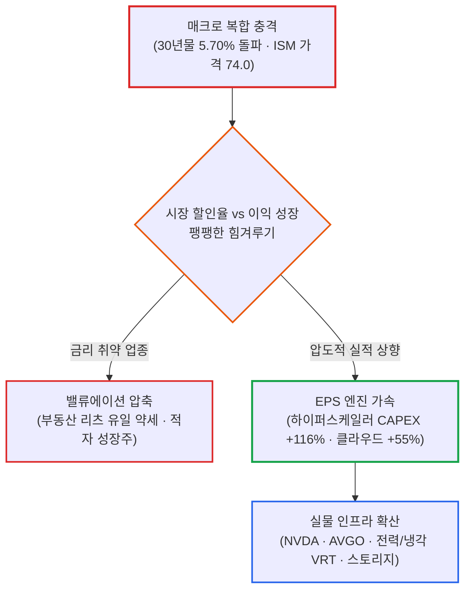

# 2026년 10월 05일(월) 하루치 뉴스정리

- **작성일**: 2026-10-06

미 30년물 국채금리가 장중 5.703%까지 치솟아 2002년 이후 24년 만의 최고치를 갈아치우고 ISM 서비스업 가격지수는 74.0으로 재폭발했지만, 나스닥은 +1.05%, S&P500은 +0.66% 상승 마감했다. 채권시장의 경고등은 새빨갛게 켜졌는데 주식시장은 하이퍼스케일러 3분기 CAPEX +116%와 S&P500 EPS +27%라는 폭발적인 실적 성장 엔진으로 금리 충격을 그대로 찍어누르고 있다. 지금 시장은 결코 고금리를 이겨낸 것이 아니다. 살인적인 할인율을 감당할 수 있을 만큼 기업이익 성장 기대가 더 빨리 좋아지고 있어서 간신히 버텨내는 극단적 차별화 장세다.

## 요약

| 구분 | 주요 내용 |
| :--- | :--- |
| **핵심 진단** | 미 30년물 5.703% 돌파와 ISM 가격지수 74.0 급등에도 나스닥 +1.05% 상승. 고금리 극복이 아닌 하이퍼스케일러 CAPEX(+116%)와 EPS 성장 기대가 할인율 충격을 상쇄 |
| **핵심 종목 팩트** | 엔비디아·알파벳·메타·브로드컴·테슬라 약 +2% 상승 vs 인텔·Arm -2% 하락. 버티브(TAM $75B, 최근 12개월 매출 +26%) 등 데이터센터 물리 인프라 전반으로 수혜 확산 |
| **착시 교정** | ① "10년물 5.3%인데 증시 상승 = 금리 영향 소멸" 착시(실적 모멘텀의 일시 상쇄일 뿐), ② "고용 둔화 = 금리 하락" 공식 파산(서비스 물가 재점화), ③ "유가 $90 하회 = 중동 리스크 종료" 착시(공급 정상화 vs 지정학 충돌 팽팽) |
| **돈길 확산 신호** | AI 연산 반도체 단독 랠리에서 실제 데이터센터 물리 인프라(네트워킹, 커스텀 ASIC, 냉각, 전력, HDD 스토리지) 및 클라우드 매출 실사용 전환으로 자금 이동 |
| **가장 더러운 변수** | 미 재무부 1,190억 달러 국채 입찰을 앞둔 30년물 5.703% 돌파와 입찰 테일링(Tailing) 현상. 연준 정책 리스크에서 국채 공급 리스크(Treasury supply risk)로 전이 |
| **계좌 행동 지침** | 급등일 추격 매수 절대 금지. 실적 확인 후 눌림목 분할 매수. AI 핵심 인프라(NVDA, AVGO) 비중 유지, 고금리 직격탄 맞는 리츠 및 적자 중소형주 보수적 대응, 현금 버퍼 확보 |

---

## 1. 결론부터: 금리는 더 악화됐는데 실적 기대가 더 빨리 달린다

지금 시장을 **“고금리를 증시가 이겨냈다”고 해석하면 한 발 늦는다.**

정확한 표현은 이거다:

> **금리는 더 악화됐는데, AI와 기업이익 성장 기대가 더 빨리 좋아지고 있어서 증시가 버티고 있다.**

미 10년물 국채금리는 **5.311%**, 30년물은 **5.664%**, 장중에는 30년물이 **5.703%까지** 올라 2002년 이후 최고 영역에 들어갔다. 그런데도 나스닥은 **+1.05%**, S&P500은 **+0.66%** 올랐다.

이건 금리가 중요하지 않다는 뜻이 결코 아니다.

**지금 주식시장이 요구하는 이익 성장률이 미친 수준으로 높기 때문에 금리 충격을 상쇄하고 있는 것**이다.

---

## 2. 지금 당장 봐야 할 팩트: 채권 발작과 이익 베팅의 정면충돌

### 2.1 채권시장은 전혀 진정되지 않았다

ISM 서비스업 PMI는 **54.9로** 경기 자체는 견조하다. 문제는 가격지수다.

**72.6에서 74.0으로** 치솟으며 2022년 7월 이후 최고치를 기록했다. 고용지수도 47.8에서 **50.1로** 올라왔다. 즉,

> **경기는 안 죽고 + 고용도 버티고 + 물가는 다시 뜨거워지고 있다.**

연준 입장에선 최악의 조합이다.

그래서 시장은 10월 금리 인상 가능성을 약 **23.8%**, 12월까지 추가 인상 가능성은 **80%대 중반으로** 반영하고 있다.

그런데 주식은 올랐다. 이 부분이 이번 장의 핵심이다.

---

### 2.2 나스닥 상승은 '금리 무시'가 아니라 '이익 성장 베팅'

엔비디아는 +2% 이상 올랐고 알파벳·메타·브로드컴·테슬라도 약 +2% 상승했다.

반대로 AMD·마이크론은 약보합, 인텔과 Arm은 약 -2% 하락했다.

즉, **AI라고 아무거나 오르는 장도 아니다.**

돈이 몰리는 곳은 점점 명확해지고 있다:

- AI 컴퓨팅 수요를 실제 매출로 연결하는 기업
- 클라우드 성장률이 가속되는 기업
- 전력·냉각·네트워크 같은 AI 인프라
- 압도적인 현금흐름으로 높은 금리를 버틸 수 있는 기업

반대로 단순히 **“AI 관련주입니다”만** 외치는 종목은 냉혹하게 걸러지기 시작했다.

---

## 3. 진짜 중요한 숫자는 여기 있다: 3분기 EPS +27%와 CAPEX +116%

골드만삭스 추정으로 S&P500 3분기 EPS는 전년 대비 **+27%다.**

그런데 IT와 에너지가 전체 이익 증가분의 약 **80%**, AI 인프라 기업만으로도 증가분의 **절반 이상을** 차지할 수 있다.

엔비디아와 마이크론 두 회사만으로 S&P500 EPS 증가분의 **3분의 1 이상을** 담당할 수 있다는 추정까지 나온다.

더 중요한 건 하이퍼스케일러다:

- 2분기 CAPEX가 **+87%**, 3분기는 **+116%로** 추정된다.
- 아마존·알파벳·MS·오라클의 합산 클라우드 매출 성장률은 **2분기 +48% ➔ 3분기 +55%까지** 가속될 것으로 예상된다.

이게 지금 시장의 논리다:

> **금리 5.3%? 그래서 뭐. EPS가 20~30%씩 늘면 버틸 수 있다.**

다만 여기에는 엄격한 조건이 하나 붙는다.

### 실적이 진짜로 나와야 한다

CAPEX +116%를 쏟아붓고 있는데 클라우드·AI 매출이 기대보다 안 나오면, 그때부터 이야기가 완전히 달라진다.

지금 시장은 **AI 투자가 돈을 벌어다 줄 것이라는 가정을 이미 상당 부분 가격에 선반영하고 있다.**

---

## 4. 시장이 빠지기 쉬운 세 가지 착시

### 착시 ① “10년물 5.3%인데 나스닥이 오르네? 이제 금리는 끝났네”

아니다. 이 해석은 매우 위험하다.

30년물이 5.70%까지 올라갔는데 증시가 상승했다는 건 **금리 영향이 사라진 게 아니다.**

지금은 실적 모멘텀이 금리 부담을 **일시적으로 상쇄하는 중이다.**

실제로 금리 민감도가 높은 부동산은 이날 유일하게 약세 업종이었다.

10년물이 **5.3% ➔ 5.5% ➔ 5.7%** 식으로 계속 치솟으면 할인율 상승을 영원히 무시할 수 없다.

---

### 착시 ② “고용이 약해졌으니까 연준은 이제 못 올린다”

이것도 절반만 맞다.

고용지표 둔화 때문에 10월 즉시 인상 기대는 상당히 줄었다. 하지만 서비스 물가가 다시 뜨거워졌다.

ISM 가격지수 **74.0은** 연준이 편하게 볼 수 있는 숫자가 아니다.

따라서 **“고용 둔화 = 무조건 금리 하락”** 공식은 현재 완전히 깨져 있다.

앞으로는 고용보다 **서비스 물가와 임금, 장기채 수급**이 시장을 결정하는 핵심 변수가 된다.

---

### 착시 ③ “유가가 90달러 밑으로 내려갔으니 중동 리스크는 끝났다”

이건 더 위험하다.

WTI는 **89.43달러**, 브렌트는 **100.32달러까지** 떨어졌다.

이유는 명확하다:

- 중동 원유 수출이 하루 **1,830만 배럴로** 전쟁 이전 평균(1,800만 배럴)을 이미 웃돌았다.
- 호르무즈 해협 수송량도 전쟁 전의 약 **80%까지** 회복했다.
- G7도 원유·디젤 **1억 배럴** 방출을 결정했다.

이건 확실한 호재다.

하지만 동시에 후티·사우디·예멘 정부군의 충돌은 오히려 격화되고 있다.

그러니까 현재 유가는 **공급 정상화(하락 압력)**와 **지정학 충돌(상승 압력)**이 정면으로 맞붙는 상태다.

90달러 밑으로 내려왔다고 전쟁 프리미엄이 사라졌다고 보면 오산이다.

---

## 5. 스마트 머니가 실제로 보는 곳: 실사용 전환과 물리 인프라

### 5.1 첫째, AI 자체가 아니라 'AI의 이익 전환'

이번 어닝시즌의 핵심 질문은 더 이상 “AI 투자를 얼마나 할 건데?”가 아니다.

이제는 이거다:

> **“그 돈 쏟아부어서 매출이 얼마나 늘었는데?”**

하이퍼스케일러 CAPEX가 +116%까지 증가하는 상황에서 클라우드 매출이 +55% 수준으로 따라오면 AI 투자 사이클은 계속된다.

반대로 CAPEX만 뛰고 수익화가 지연되면 밸류에이션 압축이 시작된다. 이번 실적 시즌이 결정적으로 중요한 이유다.

---

### 5.2 둘째, 반도체보다 넓게 보고 있다

돈의 흐름이 GPU 하나에서 명백히 벗어나고 있다.

버티브(Vertiv)의 데이터센터 시장 TAM은 약 **750억 달러**, 시장 성장률은 **16~18%로** 제시됐고, 버티브의 최근 12개월 매출은 **+26%** 증가했다.

네트워킹, 냉각, 전력, 저장장치, HDD까지 수요가 전방위로 퍼지고 있다.

도시바가 HDD 생산능력을 두 배로 확대하겠다고 발표했음에도, 업계에서는 핵심 부품 공급 제약 때문에 공급 부족이 쉽게 해소되지 않을 것이라는 분석이 나온다.

이게 시사하는 바는 명확하다:

**AI 사이클이 단순한 반도체 주가 랠리를 넘어, 실제 데이터센터 물리 인프라 투자 사이클로 본격 확산되고 있다는 뜻이다.**

---

## 6. 엔비디아: 버블 논쟁의 맹점과 진짜 리스크

DBS는 엔비디아의 선행 PER이 **17배**, 2027년 순이익 증가율이 약 **70%로** 예상돼 현재 밸류에이션을 닷컴버블과 비교하기 어렵다고 주장한다.

이 논리 자체는 일리가 있다.

PER 숫자만 놓고 시스코 100배 시절과 단순 비교하면서 **“엔비디아 = 닷컴버블”**이라고 규정하는 건 지나치게 얕은 분석이다.

하지만 여기서 또 반대로 **“17배니까 싸다”**라고 결론 내리는 것도 성급하다.

왜냐하면 그 17배라는 숫자는 앞으로의 막대한 이익 증가를 전제로 하기 때문이다.

따라서 엔비디아의 진짜 리스크는 PER 수준이 아니다:

### 엔비디아의 성장률 추정치가 깨지는 순간이다

70% 성장 예상이 **70% ➔ 50% ➔ 35%로** 하향 조정되는 순간, PER은 그대로 유지되더라도 주가는 얼마든지 무너질 수 있다.

그래서 엔비디아 투자에서 면밀히 봐야 할 것은 현재 PER 배수가 아니라 다음 지표들이다:

- 데이터센터 수요 유지 여부
- GPU 공급 병목 현황
- 하이퍼스케일러 CAPEX 지속성
- 추론(Inference) 워크로드 수요
- 커스텀 ASIC과의 경쟁 강도

---

## 7. 브로드컴: AI 인프라 확장기의 최대 수혜 조건

브로드컴(AVGO)은 이날 장에서 약 +2% 상승했다.

지금 시장이 가장 선호하는 조건과 브로드컴의 사업 모델은 완벽히 부합한다:

- AI 백본 네트워킹(Tomahawk·Jericho) 독점
- 빅테크 맞춤형 커스텀 ASIC 시장 장악
- 하이퍼스케일러 CAPEX 폭증의 직접 수혜
- 막강한 잉여현금흐름(FCF) 창출력

특히 중요한 건 이번 시장이 **“GPU만 AI다”**라고 좁게 보지 않는다는 점이다.

AI 인프라 CAPEX가 100% 넘게 증가하는 국면에서는 네트워크·ASIC·스토리지·전력 인프라까지 수혜가 확산된다.

따라서 브로드컴 투자 논리에서 지금 가장 중요한 것은 단기적으로 엔비디아보다 더 오르느냐가 아니다.

**하이퍼스케일러의 AI 투자가 계속 확대되느냐다.** 그 기조가 살아 있는 한 브로드컴의 중기 투자 논리는 확고하다.

---

## 8. 지금 시장에서 가장 위험한 숫자: 30년물 5.7%와 국채 공급 발작

현재 장세에서 **10년물 5.3%보다 30년물 5.7%를** 훨씬 더 경계해야 한다.

지금 장기금리 상승은 단순히 연준의 통화정책 이슈가 아니기 때문이다:

> **만성 재정적자 ➔ 국채 발행 폭증 ➔ 시장 공급 부담 ➔ 기간 프리미엄(Term Premium) 상승**

미 재무부는 당장 3년·10년·30년물 합계 **1,190억 달러의** 대규모 국채 입찰을 앞두고 있으며, 최근 입찰에서는 예상보다 높은 금리에 낙찰되는 ‘테일링(Tailing)’ 현상이 반복되고 있다.

이건 연준이 기준금리를 한 번 동결한다고 해결될 문제가 아니다.

시장의 진짜 위험 축이 **연준 정책 리스크(Fed risk)**에서 **국채 공급 리스크(Treasury supply risk)**로 이동하고 있다.

---

## 9. 계좌에서 어떻게 행동해야 하는가

지금은 상승장을 억지로 거스르는 것도 미련하고, 아무 주식이나 맹목적으로 매수하는 것도 위험하다.

| 영역 | 판단 | 이유 |
| :--- | :---: | :--- |
| **AI 핵심 인프라** | **비중 유지** | 실적 및 CAPEX 모멘텀 견고 |
| **NVDA·AVGO 등 핵심주** | **눌림 분할매수 우위** | 성장 추정치가 아직 금리 충격을 상쇄 중 |
| **AI 주변 테마주** | **추격 금지** | 단순 스토리보다 실적 기반 옥석 가리기 본격화 |
| **REIT·장기 듀레이션** | **보수적** | 장기금리 고공행진에 따른 직격탄 불가피 |
| **중소형 적자 성장주** | **매우 보수적** | 5%대 고금리 환경에서 자금조달 한계 봉착 |
| **에너지** | **추격 금지** | 공급 정상화와 지정학 충돌 간 변동성 확대 |
| **현금** | **일정 수준 유지** | 5.3~5.7% 고금리 환경에서 현금 옵션 가치 극대화 |

지금은 **급등하는 날 흥분해서 따라 사는 것보다, 실적 확인 후 찾아오는 눌림목에서 분할 매수하는 것이 절대적으로 유리하다.**

---

## 10. 최종 판정 및 핵심 실행 원칙

이번 뉴스들을 한 줄로 압축하면 명료하다:

> **채권시장은 경고등이 더 빨개졌는데, 주식시장은 AI와 기업이익이라는 엔진 출력을 더 높여서 아직 달리고 있다.**

따라서 지금은 전면적인 위험 회피 장도 아니고, 무차별적으로 위험자산을 쓸어 담는 장도 아니다.

- **확정된 사실**:
    - 미 10년물 5.31%, 30년물 5.66~5.70% 진입
    - ISM 서비스업 가격지수(74.0) 등 물가 압력 재상승
    - AI·빅테크 주도 증시 차별화 상승
    - 중동 원유 공급의 상당 부분 정상화
    - AI 관련 하이퍼스케일러 CAPEX 초고속 성장 지속
- **신뢰도 높은 추정**:
    - S&P500 3분기 이익 성장률(+27%) 호조 유지
    - AI 인프라가 전체 지수 이익 성장을 견인
    - 빅테크 클라우드 성장 가속화(+55%) 가시화
- **시장의 해석**: “고금리라도 압도적으로 성장하는 기업이라면 매수할 수 있다.”
- **과장된 주장**: “금리가 이제 주식시장에 중요하지 않다.” ➔ **완전한 오판이다. 지금 시장은 고금리를 이긴 것이 아니라 아직 버티고 있는 것이다.**

결국 다음 판세의 승부는 **3분기 빅테크 어닝시즌의 실제 숫자**와 **10·30년물 국채 입찰의 수요 소화력**에서 갈린다.

!!! tip "최종 핵심 제언 (Executive Takeaway)"
    채권시장이 5.7% 금리로 경고음을 내는 동안 나스닥을 지탱하는 유일한 기둥은 '하이퍼스케일러 CAPEX +116%'라는 실물 투자다. 실적 엔진이 돌아가는 한 지수는 버티겠지만, 그 온기는 AI 핵심 병목주(NVDA, AVGO, Vertiv)에만 집중된다. 지수 전체를 추종하지 말고, 숫자로 입증되는 인프라 독점 기업의 눌림목만 노려라.
