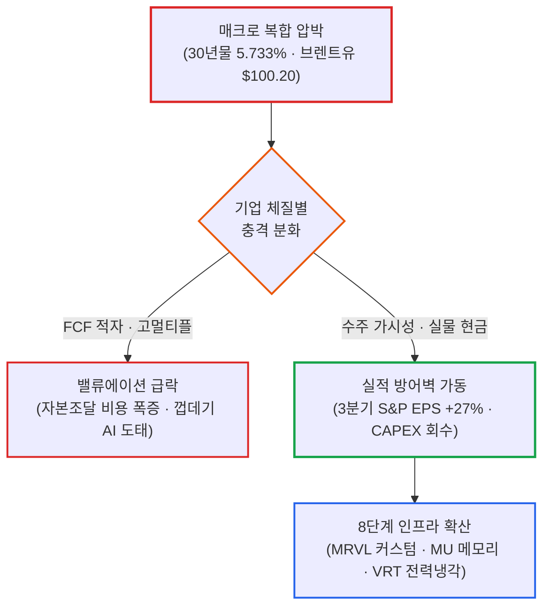

# 2026년 10월 07일(수) 하루치 뉴스정리

- **작성일**: 2026-10-08

미 30년물 국채금리가 장중 5.733%까지 치솟고 10년물이 5.365%를 찍으며 2002년 이후 24년 만의 최고치를 갈아치웠고 브렌트유는 100달러 선(100.20달러)에 머물렀지만, 나스닥과 S&P500의 낙폭은 겨우 -0.22%에 불과했다. 장 후반 390억 달러 규모의 미 10년물 국채 입찰에서 응찰률 2.77배(2016년 이후 최고)와 간접 낙찰률 80.3%, 딜러 인수 비중 2.5%(역대 최저)라는 폭발적 채권 수요가 몰리며 금리가 5.277%로 내려앉았기 때문이다. 5%대 장기금리와 100달러 유가라는 살인적 할인율 속에서도 주식시장이 붕괴하지 않는 이유는 S&P500 EPS 3분기 연속 +25% 상회(골드만삭스 추정 3분기 +27%)라는 실제 현금흐름이 뒷받침되고 있기 때문이다. 시장은 끝난 것이 아니라, 간판만 AI인 기업과 실물 현금을 찍어내는 진짜 승자를 가려내는 극단적 차별화 국면으로 진입했다.

## 요약

| 구분 | 주요 내용 |
| :--- | :--- |
| **핵심 진단** | 미 30년물 5.733% 및 10년물 5.365% 급등 후 10년물 국채 입찰 흥행(응찰률 2.77배)으로 5.277% 반락. 고금리 압박 속에서도 S&P500 3분기 EPS +27% 추정 등 실물 AI 현금흐름이 지수를 방어 |
| **핵심 종목 팩트** | 마벨(MRVL) FY31 매출 700억~900억 달러·EPS $30 가이던스 제시(4대 하이퍼스케일러 커스텀 수주), 마이크론(MU) 전략계약(SCA) 26개 확보 및 2027~28 공급 부족 지속 전망 |
| **착시 교정** | ① "10년물 5.3% 돌파 = 기술주 폭락" 착시(5.3%대 채권 매수 수요 유입 및 속도 둔화 시 안도), ② "IEA 비축유 방출 = 유가 해결" 착시(WTI $88 vs 브렌트 $100.20 유지, 재고 -320만 배럴 감소), ③ "AI 간판 = 무조건 상승" 착시(실물 FCF와 수주 없는 기업 도태 시작) |
| **돈길 확산 신호** | 단순 GPU 연산(NVIDIA) ➔ 메모리(MU) ➔ 네트워킹/ASIC(MRVL) ➔ 스토리지(STX, WDC) ➔ 전력·냉각(VRT) ➔ 기저 전력(CEG, VST) ➔ 사이버보안(PANW, CRWD) ➔ 실용 소프트웨어(NOW)로 8단계 가치사슬 확산 |
| **가장 더러운 변수** | 연준 기준금리보다 더 위협적인 장기 기간프리미엄(재정적자·국채공급·유럽 재정불안·스페이스X 등 AI 채권발행 경쟁). 10월 9일 미 30년물 220억 달러 입찰이 최대 시험대 |
| **계좌 행동 지침** | AI 실적 사이클 유효하므로 패닉셀 자제. 단기 급등 종목(가이던스 발표 직후) 추격매수 엄금, 멀티플만 높고 FCF 없는 허상 AI 축소, 금리 5%대 현금 버퍼 확보 |

---

## 1. 결론부터: 5.7% 장기금리와 100달러 유가를 버텨내는 진짜 실적

장기금리 5%대와 유가 100달러가 밸류에이션을 짓누르고 있지만, AI가 실제 매출과 이익으로 연결되는 기업들은 그 압력을 정면으로 버텨내고 있다.

10월 7일 장중 미국 10년물 국채금리는 **5.365%까지**, 30년물은 **5.733%까지** 치솟았다. 2002년 이후 24년 만에 가장 높은 수준이다. 그런데도 S&P500과 나스닥은 겨우 **-0.22% 하락으로** 장을 마쳤다. 장 후반 10년물 국채 입찰에 강력한 글로벌 수요가 들어오면서 금리가 5.277%까지 내려왔기 때문이다.

이게 오늘 뉴스 44개의 핵심이다.

금리가 미친 수준으로 올랐는데 주식이 안 무너진 이유는 AI 실적이 진짜로 따라오고 있기 때문이다. 하지만 이제부터는 AI라는 이름표만 붙은 껍데기 기업과, 통장에 현금을 꽂아 넣는 진짜 기업의 격차가 폭발적으로 벌어질 수밖에 없다.

---

## 2. 기사 속 알맹이 팩트: 채권 발작과 장기 프리미엄의 실체

### 2.1 가장 중요한 뉴스는 주식이 아니라 채권이다

오늘 장에서 가장 중요한 숫자는 나스닥 -0.22%가 아니다.

10년물 **5.365%**, 30년물 **5.733%다.** 2002년 이후 최고 수준이다. 그런데 정작 장을 좌우한 것은 마감 무렵 10년물이 **5.277%까지** 내려왔다는 사실이다.

왜 내려왔는가.

미 재무부의 10년물 국채 390억 달러 입찰에서 강력한 수요가 확인됐다:

| 입찰 지표 | 결과 수치 | 시장 의미 |
| :--- | :---: | :--- |
| **응찰률 (Bid-to-Cover)** | **2.77배** | 2016년 이후 최고 수준의 매수 경쟁 |
| **간접 낙찰률 (외국인·중앙은행)** | **80.3%** | 글로벌 큰손들의 압도적 실질 수요 |
| **딜러 인수 비중 (미소화 잔여분)** | **2.5%** | 역대 최저치 (딜러가 떠안은 물량이 거의 없음) |

이 결과는 대단히 중요하다. 금리가 5.3% 수준에 도달하자 진짜 큰돈을 굴리는 글로벌 스마트머니가 미국 국채를 강력하게 사기 시작했다는 뜻이다.

따라서 지금 시점에서 단순히 “금리가 계속 올라가니 주식은 끝났다”고 외치는 것은 한 박자 늦은 진단이다. 5.3%대 금리는 위험한 수준인 동시에, 채권 매수 수요가 본격적으로 유입되어 금리 상단을 누르는 완충선이기도 하다.

---

### 2.2 연준보다 더 무서운 것은 장기금리다

9월 FOMC 의사록은 매파적이었다. 대부분의 위원들이 연말까지 한 번 더 금리를 올리는 것이 적절할 가능성이 높다고 봤다. 다만 동시에 “열린 마음”으로 판단하겠다고 덧붙였으며, 시장의 10월 동결 확률은 **82.8%였다.**

의사록 공개 후 채권시장 반응은 매우 흥미롭다:

- **2년물 금리**: **-2.7bp 하락**
- **10년물 금리**: **+0.7bp 상승**
- **30년물 금리**: **+1.9bp 상승**

단기물은 내리고 장기물만 올랐다. 즉 지금 시장을 괴롭히는 본질은 “연준이 기준금리를 몇 번 더 올릴까?”가 아니다.

진짜 문제는 **재정적자 + 국채 공급 폭탄 + 유럽 재정불안 + AI 투자자금 조달 경쟁 + 인플레이션 잔존** 때문에 투자자들이 장기채에 요구하는 ‘기간 프리미엄(Term Premium)’ 자체가 올라가고 있다는 사실이다.

스페이스X가 엔비디아 칩을 사기 위해 **100억 달러 대출과 300억 달러 회사채 발행**을 추진하는 것도 매우 상징적이다. AI 투자 열풍이 주식시장에 머물지 않고 채권시장의 자본까지 무섭게 빨아들이기 시작했다. 이는 앞으로 장기금리를 지탱하는 주요 변수가 된다.

---

## 3. 그런데도 AI 주식이 안 죽는 이유: 3개 분기 연속 EPS +25%의 저력

AI 버블론자들이 지속적으로 놓치는 결정적 팩트가 있다.

골드만삭스는 3분기 S&P500 EPS 증가율을 **전년 대비 +27%로** 추정하고 있다. 이것이 실현되면 **3개 분기 연속 25% 이상의 이익 증가**가 달성된다.

이번 AI 랠리는 2023~2024년 초기처럼 단순한 “AI가 세상을 바꿀 것이다”라는 막연한 기대감만으로 오르는 장이 아니다. 이미 돈이 도는 파이프라인이 명확하게 작동하고 있다:

> **CAPEX(설비투자) ➔ 반도체 ➔ 네트워크 ➔ 메모리 ➔ 전력 ➔ 냉각 ➔ 보안 ➔ 소프트웨어**

이 경로를 따라 기업 장부에 실제 매출과 영업이익이 찍히고 있다.

그렇기 때문에 10년물 국채금리가 5.36%까지 치솟았는데도 나스닥이 겨우 -0.22%밖에 빠지지 않은 것이다. 이는 주식시장이 약한 것이 아니라, 기업 실적의 펀더멘털 엔진이 고금리 충격을 상쇄할 만큼 비정상적으로 강력하다는 뜻이다.

---

## 4. 이번 뉴스 묶음의 핵심 기업: 마벨(MRVL)의 폭발적 가이던스 판정

이번 자료에서 기업 하나만 꼽으라면 단연 **마벨 테크놀로지(MRVL)**다.

마벨은 인베스터 데이(Investor Day)에서 시장의 예상을 뛰어넘는 장기 로드맵을 발표했다:

- **FY31 장기 목표**: 매출 **700억~900억 달러**, EPS **$30 이상**
- **FY28 중간 목표**: 매출 약 **200억 달러로** 상향 조정

단순히 숫자가 커진 것보다 중요한 것은 사업 포트폴리오의 구조적 진화다. 과거에는 단순 커스텀 XPU 하나에 기대던 구조에서 다음과 같이 전방위로 영역을 넓히고 있다:

> **Custom XPU ➔ XPU + Scale-out + Scale-up + Optical + NPO/CPO + Switching**

특히 **알파벳, 아마존, 마이크로소프트, 메타** 등 4대 하이퍼스케일러 모두와 커스텀 반도체 사업을 전면 진행하고 있다는 점이 핵심이다.

### 팩트와 착시의 엄격한 판정

| 구분 | 판정 내용 | 분석 및 평가 |
| :--- | :--- | :--- |
| **확정된 사실** | 성장 모멘텀의 구조적 강화 | 4대 빅테크와의 커스텀 반도체 및 광학 스케일업 수주 확정 |
| **신뢰도 높은 추정** | 네트워킹·ASIC의 초과 성장 | AI 네트워킹과 커스텀 ASIC 시장이 범용 GPU보다 빠르게 성장하는 구간에서 수혜 극대화 |
| **시장의 해석** | 핵심 인프라 공급자로의 재평가 | 단순 팹리스에서 AI 데이터센터 필수 인프라 기업으로 밸류에이션 리레이팅 |
| **과장된 주장** | “FY31 700억~900억 달러 목표는 기정사실이다” | **틀렸다.** FY26 매출 약 82억 달러에서 5년 만에 700억~900억 달러로 가려면 연평균 성장률(CAGR) 55~60%를 유지해야 한다. 가이던스가 압도적인 것은 맞으나 아직 실현된 실적이 아니다 |

---

## 5. 마이크론(MU): 단순 메모리 사이클을 넘어선 구조적 변화와 착시

마이크론 역시 대단히 강력한 신호를 보냈다.

경영진은 **2027~2028년 메모리 공급 상황이 2026년보다 더욱 타이트해질 것**으로 전망했다. 그리고 고객과의 전략적 고객계약(SCA)이 **26개까지** 확대됐다.

이것이 중요한 이유는 명확하다. 과거 메모리 반도체 산업의 고질적 취약점이었던 치명적인 악순환 구조가 달라지고 있기 때문이다:

> **가격 상승 ➔ 무리한 증설 ➔ 공급 과잉 ➔ 가격 폭락**

장기 공급계약(SCA) 비중이 확대되면서 이 전통적 사이클의 진폭을 상당 부분 완화해줄 가능성이 열렸다.

### 마이크론 분석에서의 착시 교정

- **DA Davidson의 목표주가 $3,000**: 투자자가 액면 그대로 받아들일 숫자가 아니다. 애널리스트의 가장 극단적인 낙관 시나리오일 뿐이다.
- **계약의 질(Quality of Contracts)**: 장기 계약 및 RPO(수주잔고) 가운데 고객사의 취소 불가능한 현금 예치금으로 강하게 담보되는 비중은 여전히 제한적이라는 지적이 존재한다.
- **균형 잡힌 시각**: 메모리 업황의 구조적 강세는 신뢰도가 매우 높고, 2027~2028년 공급 부족 지속 가능성도 충분하다. 하지만 $3,000 같은 과격한 목표가는 걸러내고 실제 수주 단가와 현금흐름에 집중해야 한다.

---

## 6. 스마트머니가 움직이는 AI 진짜 돈길: 8단계 가치사슬 확산

이번 뉴스들을 하나로 연결하면 스마트머니의 자본이 흘러가는 돈길이 명확하게 드러난다. AI 투자는 엔비디아 GPU 하나 사고 끝나는 단발성 이벤트가 아니다.

| 단계 | 핵심 영역 | 대표 종목 및 기업 | 돈길의 전개 및 병목 현상 |
| :---: | :--- | :--- | :--- |
| **1차** | **Compute (연산)** | 엔비디아 (NVDA) | AI 훈련·추론의 원초적 연산 두뇌 독점 |
| **2차** | **Memory (초고속 메모리)** | 마이크론 (MU), SK하이닉스 | HBM 및 차세대 DRAM 공급 부족 심화 |
| **3차** | **Connectivity (연결·커스텀)** | 마벨 (MRVL), 브로드컴 (AVGO) | 커스텀 ASIC, 광 트랜시버, 스위칭 병목 해결 |
| **4차** | **Storage (대용량 저장)** | 씨게이트 (STX), 웨스턴 디지털 (WDC) | HDD를 넘어 헤드 웨이퍼·HAMR 포토닉스·유리기판 병목 |
| **5차** | **Power & Cooling (전력·냉각)** | 버티브 (VRT) | 전력밀도 폭증, 열관리 TAM 약 750억 달러(성장률 16~18%) |
| **6차** | **Electricity (기저 전력)** | 컨스텔레이션(CEG), 비스트라(VST), NRG | 알파벳의 20년 원전 전력 공급계약 등 에너지원 확보전 |
| **7차** | **Cybersecurity (보안)** | 팔로알토(PANW), 크라우드스트라이크(CRWD), 클라우드플레어(NET), 지스케일러(ZS) | 기업의 AI 보안 예산이 실제 개념검증(PoC)과 구매로 전환 |
| **8차** | **Software (실제 생산성)** | 서비스나우 (NOW) | 단순 기능 데모를 넘어 RPO 및 구독 매출 추정치 상향 |

---

## 7. “AI 버블” 주장: 절반은 맞고 절반은 틀렸다

레이 달리오와 아서 헤이즈가 동시에 AI 과잉투자에 대한 경고를 내놓았다. 이들의 지적에서 맞는 부분은 인정해야 한다.

현재 AI CAPEX의 조달 방식은 점차 **기업의 잉여 현금에서 채권 발행과 대출 등 외부 차입으로** 넘어가고 있다. 향후 AI 서비스가 창출하는 실질 현금흐름이 지금 쏟아붓는 막대한 투자액을 정당화하지 못한다면, 결국 감가상각비 부담과 과잉 설비 리스크로 귀결될 것이다. 이는 펀더멘털 관점에서 정확한 지적이다.

하지만 그 논리에서 곧바로 **“그러니까 지금 당장 AI 주식을 전량 팔아치워라”**로 연결하는 것은 심각한 비약이다.

경고를 던진 아서 헤이즈조차 AI 투자의 진짜 시험대는 **2027년 말~2028년경**으로 보고 있으며, 현재 AI 주식 공매도(숏)를 선호하지 않는다고 밝혔다.

실제 현재 데이터는 버블 붕괴가 아니라 전형적인 선순환 확장 구간을 가리킨다:

> **CAPEX 확대 ➔ 공급 부족 ➔ 장기 계약 증가 ➔ 매출 가속 ➔ 영업이익 폭증**

따라서 지금은 버블의 파국이 아니라, 옥석을 가려내기 전 실적의 실체를 하나하나 검증해 나가는 ‘실적 검증 국면’이다.

---

## 8. 시장이 빠지기 쉬운 세 가지 치명적 착시

### 착시 ① “10년물이 5.3%를 뚫었으니 기술주는 폭락한다”

절반만 맞다. 5.3% 금리는 높은 밸류에이션에 분명한 악재다.

하지만 10년물 국채 입찰에서 증명되었듯, 5.3% 부근에서는 강력한 글로벌 대기 자금이 채권을 사들이기 시작했다. 금리 상승의 폭주 속도가 제어된다면 주식시장 관점에서는 오히려 밸류에이션 숨통이 트일 수 있다.

---

### 착시 ② “IEA의 비축유 방출로 유가 문제는 해결됐다”

사실과 다르다. WTI는 88.28달러로 조정을 받았지만, 글로벌 벤치마크인 **브렌트유는 여전히 100.20달러** 위에 머물러 있다.

게다가 발표된 미국 원유재고는 시장 예상(+170만 배럴)과 정반대로 **-320만 배럴 급감했다.** 비축유 방출은 단지 공급 시간을 벌어주는 임시변통일 뿐, 원유 자체를 생산해내는 영구적 대책이 아니다. 유가는 여전히 시장을 뒤흔들 수 있는 핵심 인플레이션 뇌관이다.

---

### 착시 ③ “AI 이름만 붙으면 다 올라간다”

앞으로 가장 큰 손실을 부를 위험한 착각이다.

앞으로는 **수주 잔고, 장기 계약, 독점적 가격결정력, 영업이익률, 잉여현금흐름(FCF)**이라는 숫자를 증명하지 못하는 AI 기업은 5%대 고금리 환경을 버티지 못하고 도태된다.

반면 마벨, 마이크론, 버티브처럼 빅테크의 CAPEX가 즉각적인 매출로 꽂히는 실물 기업들은 고금리의 파도를 넘어설 체력을 갖추고 있다.

---

## 9. 계좌에서 취해야 할 네 가지 실전 행동 수칙

### ① 공포에 질려 전부 던질 필요는 없다

현재 데이터 어디를 보아도 AI 실적 사이클이 꺾였다는 징후는 없다. 오히려 마벨, 마이크론, 전력 인프라, 액체 냉각, 사이버보안까지 이익 확산의 온기가 번지고 있다.

### ② 멀티플만 높고 현금이 없는 종목은 과감히 줄여라

장기금리가 5%를 넘어서는 시대에는 “2030년쯤 돈을 벌 것입니다”라고 말하는 미래 스토리형 적자 기업이 가장 먼저 두들겨 맞는다. 매출 성장률보다도 **실제 FCF(잉여현금흐름)와 확정된 수주 가시성**을 냉정하게 따져야 한다.

### ③ 폭등한 종목을 흥분해서 추격매수하지 마라

마벨의 인베스터 데이는 훌륭했다. 하지만 장기 가이던스 발표 직후 급등하는 당일 날 추격 매수로 따라붙는 것은 완전히 다른 이야기다. 좋은 기업과 지금 당장 매력적인 매수 가격은 엄연히 구분해야 한다.

### ④ 5%대 금리 환경에서 현금은 훌륭한 자산이다

단기 국채와 현금성 자산이 연 5%대 이상의 무위험 수익을 보장하는 장세다. 현금을 쥐고 있는 기회비용이 매우 낮으므로, 주식 100% 비중을 고집하며 불필요한 시장 변동성을 온몸으로 견딜 이유가 전혀 없다.

---

## 10. 오늘 밤과 내일 새벽, 진짜 확인해야 할 매크로 시험대

어설픈 풍문보다 시장의 방향을 가를 실질 데이터 발표 일정을 주시해야 한다:

- **10월 8일 21:30 (한국시간)**: 미국 신규 실업수당 청구 건수
- **10월 9일 02:00 (한국시간)**: **미국 30년물 국채 220억 달러 입찰**

핵심은 30년물 국채 입찰이다.

어제 10년물 입찰처럼 30년물에서도 강력한 소화력이 확인된다면, 치솟던 초장기물 금리가 안정을 찾으며 기술주 전반의 밸류에이션 할인 압력이 완화될 것이다.

반대로 30년물 입찰이 부진하여 금리가 다시 5.7% 위로 치솟는다면, 현재 주식시장이 보여주고 있는 놀라운 버티기 역시 한 차례 거친 테스트를 받게 될 것이다.

---

## 11. 최종 판정 및 핵심 요약

### 시장 및 펀더멘털 판정

- **단기 시장 방향성**: **중립 ~ 약강세** (지수는 장기금리와 유가 때문에 출렁이겠지만 시스템 붕괴 조짐은 없음)
- **AI 펀더멘털**: **강세 지속** (단순 내러티브에서 실적·가이던스·수주·장기계약의 실물 숫자로 전환)
- **가장 강한 주도 영역**:
  > **메모리 ➔ 커스텀 실리콘/네트워킹 ➔ 전력·냉각 ➔ 기저 발전원 ➔ 사이버보안**
- **가장 치명적인 리스크**: AI가 아니라 **미국 장기 국채금리와 고유가**

### 핵심 결론

AI 강세장은 끝나는 것이 아니라, **진짜와 가짜를 가려내는 선별장**으로 진화하고 있다.

과거에는 “AI” 세 글자만 붙이면 주가가 올랐다. 그러나 지금부터는 누가 고객의 지갑에서 현금을 실제로 뽑아내느냐가 주가를 가른다.

현재의 뉴스 흐름과 실적 데이터를 보면 AI 핵심 승자들을 내던질 시점은 결코 아니다. 다만 아무 AI 종목이나 바구니에 담는 무차별 매수의 시대는 완전히 끝났다.

!!! tip "최종 핵심 제언 (Executive Takeaway)"
    미 30년물 5.73%와 브렌트유 100달러라는 살인적 환경 속에서도 나스닥이 버티는 이유는 S&P500 3분기 EPS +27%라는 강력한 실물 현금흐름 덕분이다. AI 사이클은 죽지 않았지만 주도주는 메모리(MU), 커스텀/네트워킹(MRVL), 전력·냉각(VRT) 등 실물 인프라로 확산되고 있다. 장기 가이던스 발표 직후의 단기 급등주 추격매수는 엄금하되, 실적 없는 허상 성장주를 정리하고 5%대 고금리 방패막이 될 확실한 현금창출 기업에 집중하라.
