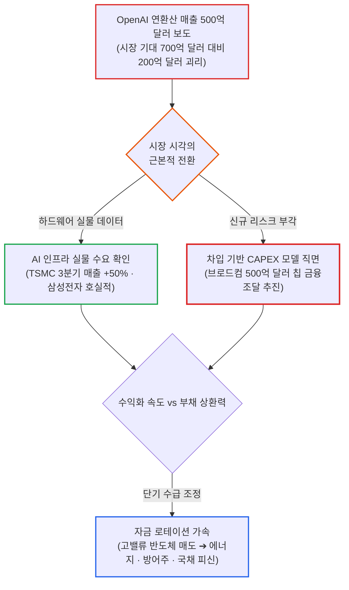

# 2026년 10월 08일(목) 하루치 뉴스정리

- **작성일**: 2026-10-09

TSMC가 3분기 매출 50% 폭증(NT$1.49조)으로 사상 최대 분기 실적을 갈아치운 바로 그날, 오픈AI(OpenAI)의 연환산 매출(ARR)이 시장 기대치(약 700억 달러)에 200억 달러 못 미치는 500억 달러 수준에 그쳤다는 보도 하나에 필라델피아 반도체지수가 **-3.39% 급락하고** 엔비디아·브로드컴·AMD·마이크론이 일제히 **-4%대 매물 폭탄을** 맞았다. 장중 브렌트유가 104달러를 뚫고 브로드컴이 칩 구매를 지원하려 500억 달러(약 68조 원) 규모의 채권 금융조달까지 추진하는 전례 없는 차입 경쟁 속에서, 시장은 마침내 본질적인 질문을 던지기 시작했다. "앞으로 돈을 벌 것이라는 믿음 하나로 수백억 달러를 빌려 세운 이 거대한 데이터센터를, 최종 고객은 과연 무슨 현금흐름으로 갚아낼 것인가?"

## 요약

| 구분 | 주요 내용 |
| :--- | :--- |
| **핵심 진단** | 수요 붕괴가 아니라 밸류에이션과 자금조달(차입) 모델에 대한 첫 번째 재평가. 'AI가 성장하는가'에서 '이 거대한 CAPEX를 최종 고객의 현금흐름으로 회수·상환할 수 있는가'로 시장의 질문이 근본 전환 |
| **핵심 종목 팩트** | OpenAI 9월 말 기준 ARR 약 500억 달러(시장 기대 700억 달러 하회) 보도로 반도체 급락. 반면 TSMC 3분기 매출 NT$1.49조(+50% YoY) 컨센서스 상회 및 삼성전자 기록적 메모리 이익 예고로 실물 수요는 견고 |
| **착시 교정** | ① "OpenAI 매출 실망 = 반도체 피크아웃" 착시(하드웨어 수요 감소가 아닌 서비스 수익화와 인프라 투자 속도 간의 시차), ② "국채금리 하락 = 기술주 호재" 착시(연준 완화 기대가 아닌 기술주 투매에 따른 위험회피성 채권 피신) |
| **돈길 확산 신호** | 단순 칩 구매를 넘어 브로드컴의 OpenAI 칩 조달용 500억 달러 금융지원 추진(10GW 규모 ASIC 배치 가시화). 자본은 고밸류 성장주에서 현금흐름 방어주(WMT +2.19%, COST +0.62%) 및 에너지주로 로테이션 |
| **가장 더러운 변수** | 브렌트유 104달러 돌파(104.28달러 마감)와 5%대 장기금리 장기화. 유가 급등으로 에너지 기업 EPS는 상향되나, 현금흐름이 먼 미래에 있는 고밸류 적자 성장주의 할인율 충격 극대화 |
| **계좌 행동 지침** | AI 반도체 패닉셀 엄금(실물 데이터 견고)하되 -4% 급락에 무리한 몰빵 매수 자제(1차 분할매수만 유효). 10월 15일 TSMC 실적 확인 전까지 브로드컴 중립 유지, 고밸류 적자주 비중 축소 |

---

## 1. OpenAI ARR 500억 달러 쇼크: 오늘 시장을 강타한 진짜 도화선

장 초반 뉴욕 증시를 짓누른 표면적 악재는 중동 지정학 위기였다. 이란 분쟁 격화 우려로 국제 유가가 장중 5% 이상 치솟았고, 브렌트유는 **104.28달러**, 서부텍사스산원유(WTI)는 **91.49달러에** 마감했다.

그러나 트럼프 전 대통령이 "11월 3일 중간선거 전에는 이란을 공격하지 않겠다"고 밝히자 주식시장은 장중 낙폭을 빠르게 메웠다. 지정학 충격은 시장을 완전히 무너뜨리지 못했다.

주식시장의 숨통을 끊은 진짜 폭탄은 장 후반 파이낸셜타임스(FT)의 오픈AI 관련 단독 보도였다.

### 200억 달러의 기대 괴리가 만든 연쇄 매도

FT에 따르면 오픈AI가 9월 말 투자자들에게 제시한 연환산 매출(ARR)은 **약 500억 달러 수준이었다.** 시장 컨센서스로 굳어져 있던 약 700억 달러보다 무려 **200억 달러나 낮았다.**

FT의 후속 보도를 보면 이 차이 중 상당 부분은 오픈AI와 앤스로픽(Anthropic) 간의 회계적 매출 집계 방식 차이에서 기인한다. 즉, 500억 달러라는 숫자가 곧바로 "실제 AI 사용량이 예상보다 박살 났다"는 의미는 아니다.

하지만 고평가 논란에 짓눌려 있던 시장은 그 복잡한 회계적 설명을 차분히 기다려주지 않았다. 투자자들은 기계적인 공포 연쇄식을 작동시켰다:

> **OpenAI 매출 눈높이 하향 ➔ AI 서비스 수익성 의문 증폭 ➔ 하이퍼스케일러 데이터센터 CAPEX 정당성 훼손 ➔ GPU·ASIC·HBM 주문 축소 위험**

이 단순한 공포 연쇄로 인해 나스닥은 **-1.25%,** 필라델피아 반도체지수는 **-3.39%** 밀렸고, 엔비디아·브로드컴·AMD·마이크론 등 핵심 AI 하드웨어 밸류체인이 일제히 **-4% 안팎의 급락을** 기록했다.

---

## 2. 대중의 착시 vs 데이터가 가리키는 현실

### 착시 ① “OpenAI 매출 실망 = AI 반도체 수요 피크아웃이다”

단정하기엔 증거가 턱없이 부족하다. 오히려 공시된 현실 데이터는 정반대를 가리킨다.

- **TSMC 3분기 실적 서프라이즈**: 3분기 매출이 **NT$1.49조로** 전년 동기 대비 무려 **50% 폭증하며** 시장 예상치(NT$1.46조)를 가볍게 넘어섰다.
- **삼성전자 실적 예고**: AI 및 차세대 메모리 수요 급증에 힘입어 기록적인 분기 영업이익 달성을 예고했다.
- **AMD 경영진 발언**: 리사 수 CEO는 데이터센터 AI 가속기 수요가 여전히 견고하며, 메모리 제조사들에 증산 확대를 적극 요구하고 있다고 밝혔다.

따라서 지금 확인되는 본질은 다음 명제다:

> **"AI 서비스 기업의 수익화 속도가 인프라 투자 속도를 따라가지 못하고 있다"**  
> (O — 검증된 사실)

이것을 두고 **"AI 인프라 수요 자체가 줄어들었다"**(X — 틀린 해석)고 해석하는 것은 심각한 비약이다. 두 명제는 완전히 다른 차원의 이야기다.

---

### 착시 ② “국채금리가 하락했으니 기술주에 좋은 날이었다”

채권시장의 표면 수치만 보고 내린 위험한 착각이다.

미국 10년물 국채금리는 **5.23%까지,** 30년물은 **5.61%까지** 내려왔다. 하지만 이것은 연준의 통화 완화 기대가 살아나서 생긴 하락이 아니다.

기술주가 폭락하자 갈 곳을 잃은 거대 자금이 안전자산인 국채로 긴급 피신한 전형적인 **'위험회피성(Risk-off) 금리 하락'**이다.

오히려 연준 크리스토퍼 월러 이사는 추가 금리 인상 필요성을 거듭 강조하고 있으며, 금리선물 시장 역시 12월까지의 추가 인상 가능성을 **80%대 수준으로** 반영하고 있다. 할인율 완화에 따른 구조적 호재가 결코 아니다.

---

## 3. 500억 달러 매출보다 더 위험한 본질: '빚내서 서버 사는' 자금조달 모델

오늘 장에서 진정으로 무게를 두고 보아야 할 뉴스는 오픈AI의 매출 수치 자체가 아니다.

월스트리트저널(WSJ)과 블룸버그는 **브로드컴(Broadcom)이 오픈AI의 차세대 커스텀 AI 칩 구매를 지원하기 위해 500억 달러 이상의 초대형 금융조달(Debt Deals)을 추진 중**이라고 보도했다. WSJ 기준 500억 달러 이상, 블룸버그 기준 1단계 약 300억 달러 규모가 거론된다.

이 뉴스를 단순 악재나 단순 호재의 이분법으로 재단해서는 안 된다.

### 긍정적인 면: 실물 수요의 거대한 스케일

오픈AI가 브로드컴과 공동 개발 중인 맞춤형 주문형 반도체(ASIC)를 실제 데이터센터에 초대형 규모로 배치하려 한다는 강력한 실물 신호다.

양사는 이미 **10GW(기가와트) 규모의 AI 가속기 및 네트워킹 시스템 구축 계획**을 공식 발표한 바 있으며, 2026년 하반기부터 첫 배치를 시작해 2029년 말까지 단계적으로 확대할 예정이다. 칩 수요가 없어서 금융을 일으키는 것이 아니다. 수요의 단위가 너무 거대해서 기업 자체의 내부 영업현금흐름만으로는 감당할 수 없는 단계에 도달했음을 의미한다.

### 구조적 리스크: '차입 레버리지'의 함정

문제는 바로 그 지점에 있다. AI 산업 생태계가 근본적인 전환점에 들어섰다:

> **과거**: "자체적으로 돈을 벌어서 번 돈으로 서버와 GPU를 산다."  
> ➔ **현재**: "미래에 엄청난 돈을 벌 것이라고 믿고, 수백억 달러를 외부에서 빌려 서버부터 깔아놓는다."

빅테크와 스타트업들이 수백억 달러의 빚을 내어 인프라를 증설하는 국면에서, 오픈AI나 앤스로픽 같은 최종 고객의 매출 성장 속도가 조금이라도 둔화되면 시장은 즉각 치명적인 질문을 던진다.

**"이 수십조 원의 설비 빚은 나중에 누가 벌어서 갚을 것인가?"**

오늘 반도체주 투매는 이 금융적 의구심이 시장 전면에 처음으로 터져 나온 사건이다.

---

## 4. 브로드컴(AVGO) -4% 급락: 사업 훼손인가, 금융 리스크인가

브로드컴의 **-4% 하락을** 사업 모델의 훼손으로 볼 필요는 없다.

오히려 이번 보도는 브로드컴의 커스텀 AI ASIC 경쟁력이 엔비디아의 범용 GPU 아성을 위협할 만큼 강력하다는 방증이다. 시장이 우려하는 리스크의 성격이 완전히 달라졌을 뿐이다:

| 비교 항목 | 과거의 시장 의구심 | 현재의 시장 의구심 |
| :--- | :--- | :--- |
| **핵심 질문** | "오픈AI가 과연 브로드컴 ASIC 칩을 대량으로 살까?" | "그 천문학적인 칩 구매액을 어떤 금융구조로 감당할 것인가?" |
| **위험의 성격** | 기술력 및 수주 불확실성 (수요 리스크) | 자금조달 구조 및 신용 보증 위험 (금융 리스크) |
| **시장 평가** | 사업 진입 여부에 대한 의심 | 과도한 레버리지와 고객사 상환 능력에 대한 검증 |

따라서 앞으로 브로드컴(AVGO)을 분석할 때는 단순한 AI 매출 성장률만 볼 것이 아니라, 다음 가치사슬의 병목 여부를 면밀히 추적해야 한다:

> **고객사 주문 규모 ➔ 외부 금융조달 구조 ➔ 브로드컴의 신용 보증·익스포저 노출 ➔ 실제 칩 양산 출하 ➔ 고객사 AI 최종 매출 회수**

500억 달러 금융조달 뉴스 자체만으로 브로드컴 주식을 투매할 이유는 전혀 없다. 그러나 반대로 "500억 달러짜리 초대형 주문이니 무조건 주가 폭등 호재다"라며 무지성으로 환호하는 것 또한 대단히 위험하다. 금융 조건과 리스크 분담 구조를 먼저 확인해야 한다.

---

## 5. 스마트머니의 자금 이동: 고밸류 기술주에서 에너지·방어주·채권으로

하루 동안의 수급만으로 스마트머니가 AI를 영구히 버렸다고 단정할 수는 없다. 하지만 뚜렷한 자금 이동의 방향성은 명확하게 확인된다.

- **기술 섹터**: **-1.78% 급락**
- **필수소비재 및 에너지 섹터**: **+2% 이상 급등**
- **개별 방어주 흐름**: 월마트(WMT) **+2.19%,** 코스트코(COST) **+0.62%,** 애플(AAPL) **+1.12%**

전형적인 **'고밸류 성장주 ➔ 현금흐름 방어주 및 실물 자산'**으로의 포트폴리오 재편이다.

특히 브렌트유가 100달러를 돌파(104.28달러)한 환경에서는 정유·에너지 기업이 단순한 지정학 방어주를 넘어 실질적인 **'실적 상향(Earnings Upgrade) 주도주'**로 변모한다. 실제로 글로벌 투자은행 UBS는 셰브론(CVX)의 3분기 주당순이익(EPS) 전망치를 기존 4.15달러에서 **4.93달러로 대폭 상향 조정했다.**

---

## 6. 질문이 바뀌었다: 'AI가 성장하는가'에서 '투자금을 갚을 수 있는가'로

오늘의 급락을 보며 피해야 할 양극단의 극단적 오류가 있다:

1. **"반도체가 무너졌으니 AI 버블은 끝났다"** ➔ 섣부른 공포다. TSMC와 삼성전자의 숫자가 버티고 있다.
2. **"TSMC 실적이 좋으니 오늘 하락은 아무 의미 없는 노이즈다"** ➔ 시장의 체질 변화를 무시하는 오만이다.

시장이 던지는 핵심 화두가 근본적으로 바뀌었다:

- **2024~2026년의 질문**: "AI 시장이 과연 빠르게 성장할 수 있는가?" (매출 성장률과 기술 혁신에 집중)
- **앞으로의 질문**: "AI 서비스가 이 천문학적인 CAPEX와 차입금을 정당화할 만큼 실제 현금을 벌어들이는가?" (현금흐름 회수와 투자수익률 ROI에 집중)

이제는 단순히 엔비디아의 GPU 출하량이나 데이터센터 가동률 하나만 바라보아서는 안 된다. **오픈AI·앤스로픽·메타·구글의 실제 유료 구독 매출, 추론 사용량당 단가, 엔터프라이즈 클라우드 AI 매출, 데이터센터 실질 가동 마진**이 주가를 결정하는 진짜 핵심 지표가 된다.

---

## 7. 내 계좌라면 이렇게 한다: 자산군별 실전 행동 수칙

### ① AI 반도체 (NVDA, AVGO, TSM, AMD)
- **원칙**: 공포에 질려 패닉셀하지 않는다. TSMC(+50%), 삼성전자, AMD가 증명하는 실물 수요는 무너지지 않았다.
- **실행**: 오늘 하루 -4% 빠졌다고 흥분해서 풀매수하지 않는다. 1차 소액 분할매수 정도만 열어둔다.
- **핵심 분기점**: 10월 15일 예정된 **TSMC의 공식 3분기 실적 컨퍼런스콜**에서 2027년 설비투자(CAPEX) 전망과 글로벌 하이퍼스케일러들의 장기 수요 가이던스를 최종 확인하는 것이 급선무다.

### ② 브로드컴 (AVGO)
- **원칙**: 투자의견 '중립 이상'을 유지한다. AI 커스텀 칩 사업의 펀더멘털은 견고하다.
- **실행**: OpenAI 금융조달 계약에서 브로드컴이 떠안아야 할 보증 책임이나 신용 리스크가 구체적으로 밝혀지기 전까지는 공격적인 추가 비중 확대를 자제한다.

### ③ 에너지 (XOM, CVX 등)
- **원칙**: 비중을 유지하거나 눌림목을 활용한다.
- **이유**: 브렌트유가 100달러 위에서 버티는 기간이 길어질수록 실적 추정치가 지속 상향된다. 단순한 중동 테마가 아니라 실물 실적주의 영역이다.

### ④ 고밸류 적자 성장주
- **원칙**: 가장 위험한 자산군이므로 비중을 엄격히 축소한다.
- **이유**: 10년물 국채금리가 5%대에 머무는 고금리 시대다. 매출과 현금흐름이 먼 미래에 있는 기업들은 금리가 튈 때마다 치명적인 밸류에이션 할인을 피할 수 없다.

---

## 8. 최종 판정 및 핵심 실행 원칙

오늘 AI 반도체 섹터의 급락은 **절반의 합리적 경계감과 절반의 과민반응**이 섞여 있다.

- **합리적인 경계감**: 수천억 달러에 달하는 AI 인프라 투자 규모 속에서, 오픈AI 같은 핵심 고객사의 수익성과 외부 차입 조달 능력을 검증해야 한다는 시장의 요구는 지극히 정당하다. 국제통화기금(IMF) 역시 빅테크의 차입 레버리지와 미국 빅테크 집중 자금이 결합할 경우 금융 충격으로 이어질 수 있다고 경고했다.
- **과민반응의 영역**: "오픈AI ARR 500억 달러 = AI 수요 붕괴"라는 공식은 명백한 논리적 비약이다. TSMC 매출 50% 급증과 삼성전자의 역대급 메모리 실적은 여전히 하드웨어 수요가 강력함을 입증한다.

### 핵심 결론

AI 강세장은 죽지 않았다. 다만 시장의 평가 기준이 "얼마나 빠르게 성장하는가"에서 **"이 천문학적인 설비 투자를 누가, 어떤 현금흐름으로 갚아낼 것인가"**로 완전히 진화했다. 앞으로 AI 주식의 진정한 승패는 칩 공급량이 아니라 **'AI의 실질 수익화 속도'**에서 결정된다.

!!! tip "최종 핵심 제언 (Executive Takeaway)"
    OpenAI의 ARR 500억 달러 보도와 브로드컴의 500억 달러 금융조달 뉴스는 AI 산업이 '내부 현금 지출'에서 '외부 차입 레버리지' 단계로 진입했음을 알리는 중대한 신호다. TSMC 매출 +50%가 증명하듯 인프라 수요 자체가 꺾인 것은 아니므로 우량 반도체주를 패닉셀할 이유는 없다. 다만 5%대 고금리 환경에서 미래 현금흐름이 불확실한 적자 성장주는 철저히 배제하고, 실제 잉여현금흐름(FCF)을 창출하는 기업과 10월 15일 TSMC 컨퍼런스콜의 가이던스를 확인한 뒤 분할 대응하라.
