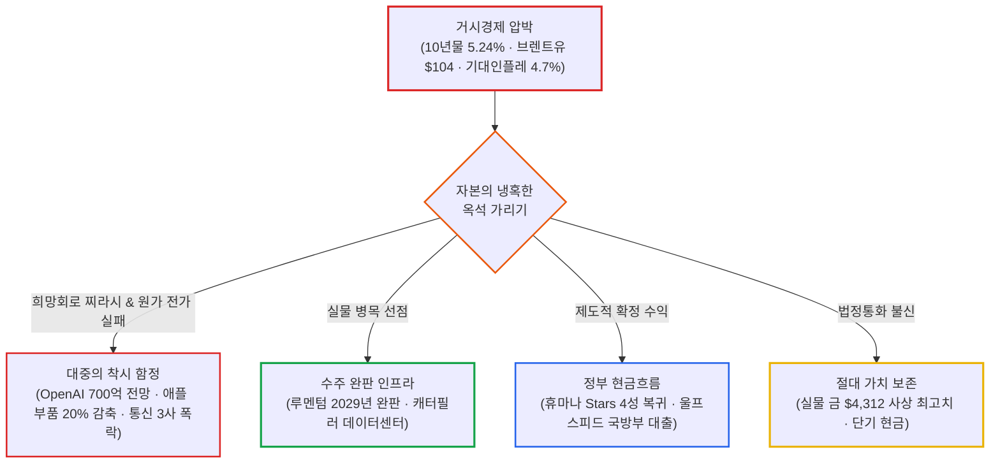

# 2026년 10월 09일(금) 하루치 뉴스정리

- **작성일**: 2026-10-10

트럼프가 11월 중간선거 참패 공포에 질려 '적장' 푸틴에게 굽신거리며 480만 톤(약 3,580만 배럴)의 경유를 구걸하고 국방물자생산법(DPA)까지 꺼내 들며 유가 틀어막기에 나섰고, 오픈AI는 전날 터진 'ARR 500억 달러 쇼크'를 수습하려 "연말엔 700억 달러를 찍을 것"이라는 출처 불명의 '전망의 전망' 찌라시를 띄워 나스닥을 +0.64% 끌어올렸다. 그러나 환호하는 대중의 등 뒤에서 필라델피아 반도체지수는 홀로 -0.41% 하락 마감했고, 핌코는 "미 국채 10년물 금리가 26년 만에 6%까지 치솟을 것"이라고 경고했으며, 애플은 치솟는 메모리 가격을 감당하지 못해 아이폰 18 프로 부품 주문을 15~20% 전격 칼질했다. 겉으로는 반등장 같지만, 속을 까보면 '치솟는 인플레이션과 부채의 쓰나미'에 질린 시장이 전통 인프라와 진짜 현금창출 기업으로 피신하는 극단적 생존 게임이 벌어지고 있다.

## 요약

| 구분 | 주요 내용 |
| :--- | :--- |
| **핵심 진단** | 트럼프의 대러 경유 수입 합의와 오픈AI 연말 700억 달러 전망 보도로 억지 반등했으나, 필라델피아 반도체(-0.41%)는 불응. 10년물 5.24%와 기대인플레 반등 속 스태그플레이션 경계감 고조 |
| **핵심 종목 팩트** | 애플 아이폰 18 프로 부품 주문 15~20% 감축(-2.1%), 스페이스X 800MHz 주파수 인수로 통신 3사(T·VZ·TMUS) -7~10% 폭락, 델타항공 연료비 60억 달러 폭증에 연간 가이던스 급락 |
| **착시 교정** | ① "오픈AI 연말 700억 달러 전망 = AI 위기 해소" 착시(팩트는 9월 500억 달러뿐, 700억은 전망치에 불과), ② "트럼프의 유가 안정 = 인플레 종식" 착시(적장 푸틴에 손 벌릴 만큼 에너지 위기가 절박하다는 방증) |
| **스마트머니 돈길** | 레거시 독점 깨진 통신주 투매 ➔ 2029년까지 부품 완판된 실물 인프라(LITE +6.5%), 정부 보너스 확정된 헬스케어(HUM +14.4%), 부채 쓰나미 헤지용 실물 금($4,312 돌파)으로 자금 이동 |
| **가장 더러운 변수** | 브렌트유 104달러대와 미시간대 1년 기대인플레 4.7% 반등. 유가 급등이 항공·물류 마진을 압살하는 가운데, 12월 연준 추가 금리 인상 확률 80%대 고착화 |
| **계좌 행동 지침** | 지수 하루 반등에 기술주 추격매수 엄금. 미 10년물 5.30~5.35% 임계선 주시, 원가 전가 실패 완제품주 비중 축소, 실물 병목주 선별 보유, 현금·금 20% 안전 버퍼 확보 |

---

## 1. 결론부터: 푸틴에게 손 빌린 트럼프와 오픈AI 억지 반등의 실체

10월 9일 뉴욕 증시의 표면적 수치는 화려했다. 다우지수는 **+0.83% 오른 51,654.95에**, S&P500은 **+0.59% 오른 7,811.54에**, 나스닥은 **+0.64% 오른 27,366.17에** 장을 마쳤다. 언론들은 일제히 "오픈AI 실적 낙관론과 트럼프의 유가 안정 조치로 기술주가 부활했다"며 환호성을 질렀다.

그러나 지수의 화려한 가면 뒤에서 시장의 진짜 심장인 필라델피아 반도체지수는 **-0.41% 홀로 하락 마감했다.** 전날 -3.39% 폭락을 맞고도 단 1%의 자율 반등조차 이뤄내지 못한 것이다. 

주식시장이 마주한 진짜 공포는 챗GPT의 매출 몇십억 달러 차이가 아니다. 

미국 10년물 국채금리가 **5.24%에** 묶여 있고 브렌트유가 **104달러를** 웃도는 살인적인 고물가·고금리 환경 속에서, 시장은 마침내 본질적인 질문을 던지기 시작했다.

> **"미래에 엄청난 돈을 벌 것이라는 믿음 하나로 수백억 달러의 빚을 내어 세우는 이 거대한 데이터센터 인프라를, 최종 고객은 과연 무슨 현금흐름으로 갚아낼 것인가?"**

---

## 2. 오픈AI 찌라시와 나스닥의 억지 반등: 반도체는 왜 속지 않았는가

### 2.1 500억 달러 팩트와 700억 달러 희망회로

10월 8일 장을 강타한 오픈AI 쇼크의 본질은 파이낸셜타임스(FT)가 폭로한 숫자였다. 9월 말 기준 오픈AI의 연환산 매출(ARR)이 시장 기대치(700억 달러)에 무려 200억 달러나 못 미치는 **약 500억 달러에** 그쳤다는 보도였다.

그러자 하루 만인 9일, 외신 소식통을 인용한 반박성 보도가 기습적으로 흘러나왔다. 9월 말 기준 500억 달러는 맞지만, 올해 12월 말이 되면 연환산 매출이 **700억 달러에 도달하거나 초과할 것이라는** 전망이었다. 

증시 참가자들은 이 숫자를 핑계 삼아 나스닥을 사들였다. 그러나 이 보도를 뜯어보면 철저한 '전망의 전망'에 불과하다:

- **9월 말 확정 팩트**: 연환산 매출(ARR) 약 **500억 달러**
- **외신 인용 전망치**: 2026년 12월 말 예상 ARR 약 **700억 달러 이상**
- **냉정한 현실**: 3개월 만에 200억 달러의 매출이 추가된다는 것은 오픈AI의 일방적 주장일 뿐, 검증된 현금흐름 데이터는 단 1달러도 없다.

바이탈놀리지의 수석 분석가 아담 크리사풀리는 시장의 억지 낙관론을 즉각 일축했다:

> "이번 매도세는 극심한 포지션 불균형을 반영한 것이며, V자형 급반등 가능성은 희박하다. 핵심 문제는 ARR의 회계상 수치 차이가 아니라, 시장이 AI 관련 부채와 자본 투자의 거대한 물결에 본격적으로 저항하기 시작했다는 점이다."

### 2.2 '나스닥 상승 속 반도체 하락'이라는 치명적 다이버전스

시장의 진짜 불안은 브로드컴(Broadcom)의 행보에서 노출됐다. 월스트리트저널(WSJ)과 블룸버그는 브로드컴이 오픈AI와 공동 개발 중인 커스텀 AI 반도체 배치를 지원하기 위해 **500억 달러(약 68조 원) 이상의 초대형 부채 조달(Debt Deals)을 추진 중이라고** 보도했다.

이 뉴스는 거대한 양날의 칼이다:

- **긍정적 측면**: 오픈AI가 10GW 규모의 독자 ASIC 칩 배치를 현실화하고 있다는 막대한 실물 수주의 증거다.
- **치명적 리스크**: 과거처럼 자체 영업이익으로 칩을 사는 것이 아니라, **수십조 원의 빚을 끌어다 서버를 깔아야 하는 레버리지 국면**으로 진입했음을 뜻한다.

만약 시장이 "연말 700억 달러 보도로 AI 우려가 완전히 끝났다"고 판단했다면, 가장 먼저 폭등했어야 할 종목은 전날 -3.39% 두들겨 맞은 반도체주였다. 그러나 필라델피아 반도체지수는 **-0.41% 하락으로** 장을 마쳤다. 

나스닥은 반등하는데 반도체는 주저앉는 이 '다이버전스(Divergence)'는, 스마트머니가 지수 반등을 틈타 고평가 기술주 포지션을 조용히 정리하고 있다는 강력한 경고 신호다.

### 2.3 질문이 바뀌었다: 'AI가 성장하는가'에서 '그 CAPEX를 언제 갚아낼 것인가'로

월가 투자자들의 핵심 질문이 세 단계로 진화하고 있다:

> - **과거 (2023~2024년)**: "AI 매출이 얼마나 빨리 폭증하는가?" (무지성 밸류에이션 부여)  
> - **현재 (2025~2026년 상반기)**: "그 매출을 내기 위해 GPU·데이터센터·전력에 얼마를 때려박아야 하는가?" (CAPEX 규모 경쟁)  
> - **미래 (지금부터)**: **"그 천문학적 CAPEX 대비 실제 현금수익률(ROIC)은 얼마이고, 빚으로 세운 인프라는 언제 회수되는가?"**

브로드컴이 500억 달러 빚을 내어 오픈AI 칩 배치를 지원하겠다는 소식에 시장이 얼어붙은 이유가 바로 이것이다. 과거에는 하이퍼스케일러의 막강한 영업이익으로 장비를 샀지만, 이제는 '차입 기반 레버리지' 모델로 넘어가고 있다. 5%대 금리 환경에서 부채로 지은 인프라의 수익성 검증은 이전보다 수십 배 냉혹해질 수밖에 없다.

---

## 3. 트럼프의 '푸틴 경유 구걸'과 104달러 유가: 적장에게 손 빌린 미국의 절박함

### 3.1 대러 제재를 무력화한 480만 톤의 의미

장중 뉴욕 유가는 호르무즈 해협의 군사적 충돌로 폭발 직전까지 치솟았다. 유엔 국제해사기구(IMO)에 따르면 호르무즈 해협을 통과하던 유조선 11척이 피격된 데 이어, 이번 주에도 5척이 추가 공격을 받아 총 16척의 유조선이 불탔다. WTI는 장중 +1.87% 치솟으며 배럴당 93달러를 위협했다.

유가의 불길을 끈 것은 트럼프 대통령의 기습 발표였다. 트럼프는 백악관 행사에서 "중대한 발표"를 예고하더니, 푸틴 러시아 대통령과 담판을 통해 **경유 30만 톤 즉각 공급, 11월 50만 톤, 직후 100만 톤 등 단기 총 480만 톤(약 3,580만 배럴)을 공급받기로 합의했다고** 발표했다.

| 트럼프의 조치 | 표면적 명분 | 적나라한 이면의 진실 |
| :--- | :--- | :--- |
| **푸틴과 경유 480만 톤 합의** | 글로벌 및 미국 내 디젤 가격 급속 안정 | 중간선거 패배 위기에 몰려 대러 제재를 스스로 내던지고 적장에게 기름을 구걸 |
| **국방물자생산법(DPA) 동원** | 민간 정유사에 에너지 생산 강제 명령 | 미국의 국내 정제 마진과 에너지 생산 여력이 한계치에 다다랐음을 자인 |
| **선거 전 이란 공격 보류 공언** | 중동 긴장 완화 및 대화 모멘텀 | 유가가 105달러를 넘는 순간 선거가 끝장나므로 군사작전을 강제로 봉인 |

적장 푸틴에게 손을 빌려 WTI는 배럴당 **91.85달러(+0.39%)로,** 브렌트유는 **104.72달러(+0.42%)로** 상승 폭을 간신히 줄였다. 그러나 바다에서 미사일이 날아다니는 상황에서 러시아산 기름 몇 방울로 유가 상승세를 꺾을 수는 없다.

### 3.2 델타항공이 증명한 고유가의 실물 파괴력

유가 100달러가 기업 장부를 어떻게 파괴하는지는 같은 날 발표된 **델타항공(DAL)**의 3분기 실적이 적나라하게 증명했다:

- **3분기 외형 성장**: 매출 **202억 달러 (+32.9% YoY)**로 시장 컨센서스를 12.8억 달러 상회
- **수익성 붕괴**: 3분기 연료비가 **41억 달러로 전년 동기 대비 +62% 폭증**, 비GAAP EPS는 **$1.72로** 컨센서스 하회
- **가이던스 쇼크**: 연간 총 연료비가 전년 대비 **60억 달러(약 8조 4천억 원) 증가할 것이라** 밝히며, 2026년 연간 EPS 가이던스를 기존 $6.50~$7.50에서 **$5.10~$5.60으로 대폭 삭감**

기름값이 뛰면 기업이 아무리 손님을 많이 태우고 물건을 많이 팔아도 통장 잔고는 바닥난다. 이것이 지금 5%대 금리와 100달러 유가가 실물 경제를 조여오는 잔혹한 방식이다.

---

## 4. 매크로의 숨통 가격: 미 10년물 5.30~5.35% 임계선과 핌코의 6% 경고

### 4.1 핌코 CIO의 6% 경고와 스태그플레이션 지표

세계 최대 채권 운용사 핌코(Pimco)의 다니엘 이바신 최고투자책임자(CIO)는 시장에 서늘한 경고장을 던졌다:

> "채권 시장의 기술적 악재와 레버리지 투자자들의 포지션 청산을 고려할 때, 미국 국채 10년물 금리가 단기적으로 6.0%까지 치솟을 위험이 있다. 이는 26년 만에 처음 보는 수준이 될 것이다. 30년 만기 고정 모기지 금리는 이미 7.4%로 2023년 이후 최고치에 도달했다."

지표 역시 완벽한 스태그플레이션을 가리키고 있다. 미시간대 10월 소비자심리지수 예비치는 **46.3으로** 주저앉으며 역대 최저치였던 지난 5월(44.8) 턱밑까지 밀렸다. 반면 소비자들의 1년 기대 인플레이션은 **4.6%에서 4.7%로,** 5~10년 기대 인플레는 **3.4%에서 3.5%로** 반등했다.

소비자는 지갑을 닫는데 물가 불안은 커지고 있다. 연준이 10월 금리를 동결하더라도, 12월까지 추가 금리 인상에 나설 확률이 **80%대 초반에** 머물러 있는 이유다.

### 4.2 주식시장의 할인율 임계선 매트릭스

트루이스트 웰스의 칩 휴이 매니징 디렉터는 채권 시장과 주식 시장 사이의 명확한 '임계선'을 지목했다:

| 10년물 금리 구간 | 시장 반응 및 자산군 영향 | 전략적 판단 |
| :--- | :--- | :--- |
| **5.20% 미만** | 할인율 압박 완화로 성장주 전반의 숨통이 트이는 구간 | 핵심 AI 하드웨어 비중 확대 가능 |
| **5.20% ~ 5.35%** | 현재 구간. 금리 상단 경계감과 채권 매수세가 맞부딪히는 고변동성 장세 | 철저한 실적주 중심 압축 대응 |
| **5.35% 돌파** | 위험자산 투매 촉발선. 고PER 기술주 밸류에이션 재붕괴 위험 | 고밸류 성장주 비중 축소 및 현금화 |
| **5.50% 이상** | 핌코 경고 영역. 주식과 회사채 전반에 금융 시스템적 충격 발생 | 주식 비중 최소화, 자본 보존 모드 |

---

## 5. 개별 기업의 명암: 애플 부품 칼질과 스페이스X의 통신 3사 학살

### 5.1 애플의 100달러 인상 자충수: 아이폰 18 프로 부품 15~20% 감축

닛케이 아시아와 시킹알파에 따르면, 애플은 부품 공급사들에게 **iPhone 18 Pro 및 Pro Max의 10월 부품 생산을 당초 계획보다 15~20% 축소하라고** 긴급 요청했다. 

치솟는 메모리 원가를 감당하지 못해 프로 라인업의 시작 가격을 전작 대비 100달러 올렸지만, 소비자들이 지갑을 닫아버린 것이다. 시장조사업체 IDC는 원가 폭등으로 스마트폰 평균 판매단가(ASP)가 전년비 27.6% 뛰었고, 2026년 글로벌 스마트폰 출하량은 **-16.7% 급감할 것이라고** 경고했다.

월가 애널리스트(댄 아이브스 등)들은 여전히 "아이폰 교체 대기 수요가 3억 7,500만 대에 달한다"며 400달러 목표가를 외치고 있지만, 공장 바닥의 부품 발주는 이미 칼질당했다. 주가는 **-2.1%** 밀렸다.

#### 애플 공급망 착시 교정: 브로드컴(AVGO)과 TSMC는 왜 다른가
기사 말미에 주요 협력사로 TSMC, 브로드컴(AVGO), 퀄컴, 텍사스 인스트루먼츠가 나열되자, 일부 투자자들은 "브로드컴도 아이폰 때문에 박살 난다"며 섣부른 공포에 빠졌다.  
그러나 팩트를 정밀하게 갈라내야 한다:

1. **감축 품목의 미포함**: 이번 15~20% 부품 감축 대상에 브로드컴의 부품이 실제 포함되었다는 근거는 보도 어디에도 없다.
2. **밸류에이션 본체의 차이**: 현재 브로드컴의 주가 멀티플을 결정하는 핵심 엔진은 레거시 스마트폰 부품이 아니라, **하이퍼스케일러 맞춤형 AI 가속기(ASIC)와 데이터센터 네트워킹(이더넷·스위칭)**이다.
3. **영향도 판정**: 실적에 단기 노이즈는 될 수 있어도 핵심 투자 논리의 훼손은 전혀 아니다. 완제품 소비재의 판매 부진과 데이터센터 인프라 공급망의 본체는 철저히 분리해서 봐야 한다.

### 5.2 스페이스X 80억 달러 주파수 인수: 통신 3사 독점 해자의 붕괴

스페이스X는 사모펀드 Grain Management로부터 미국 전역에서 사용할 수 있는 **800MHz 저대역 주파수 라이선스를 약 80억 달러에 인수하기로** 합의했다.

이 뉴스는 미국 전통 통신 시장에 핵폭탄을 떨어뜨렸다:

- **AT&T (T)**: **-9.81% 폭락**
- **버라이즌 (VZ)**: **-8.75% 폭락**
- **T-모바일 (TMUS)**: **-7.20% 급락**

수십 년간 땅에 유선망과 기지국을 깔아두고 과점 지위를 누리며 "배당 방어주"로 군림하던 통신사들의 해자가 통째로 날아간 날이다. 일론 머스크의 스타링크가 저궤도 위성을 통해 일상 스마트폰 저주파 통신 서비스까지 직접 장악하면, 막대한 부채를 짊어진 전통 통신사들의 미래 현금흐름은 처참하게 쪼그라든다.

### 5.3 스마트머니의 피난처: 루멘텀·휴마나·알파벳·팔란티어·금

소음 속에서 진짜 돈을 쥔 타짜들은 철저하게 '실물 병목'과 '확정 현금'으로 숨어들었다:

1. **루멘텀 (LITE, +6.5%)**: "2029년까지 생산될 모든 광학 부품이 이미 완판됐다. 2027년에는 고객 수요의 70%조차 맞추기 힘들다"고 선언했다. 말로 떠드는 AI가 아니라 통장에 선급금이 꽂히는 물리적 병목 기업이다.
2. **휴마나 (HUM, +14.4%)**: 미 CMS(메디케어 서비스 센터) 평가에서 가입자 240만 명의 주력 상품이 4성 등급으로 상향 복귀하며 수천억 원의 정부 보너스 지급이 확정됐다. 소비가 얼어붙을 때는 정부 재정을 빨아들이는 기업이 가장 강하다.
3. **알파벳 (GOOGL) & 팔란티어 (PLTR)**:
    - TD 코웬은 구글 클라우드의 3분기 매출 성장률이 **전년비 100% 이상 폭증했을 것이라고** 추정했다.
    - 골드만삭스는 팔란티어의 연환산 매출(ARR)이 **약 80억 달러에 달하고 매출 증가율이 100%를 유지하고 있다며** 투자 의견을 중립에서 **'매수'(목표가 230달러)**로 상향했다. 
    - 엔터프라이즈 AI 수요는 사라진 것이 아니라, 실제 현금과 계약을 회수하는 독점 플랫폼으로 쏠리고 있다.
4. **금 선물 ($4,312.30, +1.33%)**: 국채금리가 5.24%인데 금이 사상 최고치를 경신하는 기현상이 이어졌다. 미국의 천문학적 국가 부채와 재정적자에 질린 스마트머니가 법정통화를 버리고 실물 금을 쓸어 담고 있다.

---

## 6. 대중의 착시 vs 데이터가 가리키는 현실

### 착시 ① “오픈AI 연말 700억 달러 전망 = AI 위기 해소다?”
팩트는 9월 말 현재 ARR이 500억 달러라는 것뿐이다. 700억 달러는 3개월 만에 200억 달러가 늘어날 것이라는 오픈AI의 희망회로이자 전망치에 불과하다. 더 중요한 팩트는 반도체 지수(SOX -0.41%)가 이 찌라시에 반응하지 않았다는 점이다.

### 착시 ② “트럼프가 푸틴과 합의했으니 유가 잡히고 인플레 끝났다?”
미국 대통령이 대러 제재를 무력화하면서까지 적장 푸틴에게 기름을 구걸했다는 것은, 미국 내 에너지 공급망이 파탄 직전까지 몰렸다는 절박한 방증이다. 호르무즈 해협에서는 유조선 16척이 피격당했고, 델타항공은 1년 기름값으로 60억 달러를 더 토해내겠다고 울부짖고 있다.

### 착시 ③ “통신주는 배당 든든한 경기 방어주다?”
스페이스X가 800MHz 주파수를 집어삼키는 순간 레거시 통신 과점의 해자는 허물어졌다. 기술의 패러다임이 바뀔 때, 막대한 부채를 안고 과거의 영광에 기댄 배당주는 방어주가 아니라 가장 위험한 함정이 된다.

### 6.1 스마트머니가 시장을 가르는 3대 그룹 분류표

지금 월가의 진짜 스마트머니는 "AI 테마냐 아니냐" 따위의 1차원적 프레임으로 투자하지 않는다. 기업의 자금조달 구조와 실제 현금흐름 창출력을 기준으로 다음 3대 그룹으로 냉정하게 쪼개고 있다:

| 그룹 | 핵심 특징 및 대표 기업군 | 스마트머니 대응 전략 | 시장 생존 판정 |
| :--- | :--- | :--- | :---: |
| **Group A: 실적이 CAPEX를 따라오는 기업** | 알파벳(GOOGL), 메타(META), 마이크로소프트, 팔란티어(PLTR) | 실적 가시성에 따른 비중 유지 및 분할 매수 | **최우량 승자** |
| **Group B: 물리적 공급 병목을 쥔 인프라** | 루멘텀(LITE, 광통신), TSMC, 엔비디아, 데이터센터 전력망 | 2029년 완판 등 수주잔고 바탕 조정 시 매수 | **강력 독점** |
| **Group C: 미래 현금흐름 과도하게 당겨 쓴 부채주** | 부채비율 높고 영업현금흐름 없이 CAPEX만 태우는 AI 껍데기 | 5%대 금리 할인율 직격탄, 반등 시 전량 매도 | **도태 1순위** |

---

## 7. 내 계좌라면 이렇게 한다: 자산군별 실전 행동 수칙

### 7.1 계좌 생존을 위한 5대 실전 행동 수칙

1. **우량 AI 보유 원칙**: 이미 실적 추정치가 상향되는 진짜 AI 핵심주를 보유 중이라면, 오픈AI 찌라시 뉴스 하나에 겁먹고 투매할 이유가 없다.
2. **신규 자금 몰빵 엄금**: 미 10년물 국채금리가 5.30% 위에 있는 한 할인율 충격이 상존하므로, 신규 매수는 철저히 지지선 중심 분할 매수로 대응한다.
3. **가치사슬의 지평 확장**: GPU 하나에만 갇혀 있지 말고 **GPU ➔ ASIC ➔ 네트워킹(Ethernet) ➔ 광통신(Optical) ➔ 전력(Power)**으로 시야를 넓혀 병목을 선점하라.
4. **차입 의존형 인프라주 비중 축소**: 5%대 금리 환경에서는 화려한 성장 스토리보다 자금조달(부채) 구조가 깡패다. 빚으로 서버 까는 기업은 비중을 최소화하라.
5. **유가 상시 모니터링**: 브렌트유가 105달러를 넘어 110~115달러로 치솟는 순간, 어떤 AI 호재도 매크로 인플레와 추가 금리 인상의 파도를 이기지 못한다.

### 7.2 자산군별 실전 포지셔닝 매트릭스

| 자산군 / 섹터 | 핵심 종목 예시 | 실전 행동 방침 | 구체적 실행 기준 |
| :--- | :--- | :---: | :--- |
| **AI 반도체 & 인프라 코어** | NVDA, AVGO, TSM | **패닉셀 엄금 & 분할 매수** | 10년물 5.30~5.35% 저항선 하향 안정 확인 전까지 무리한 풀매수 금지. 브로드컴 500억 달러 차입 딜의 세부 금융 조건 주시 |
| **완제품 제조 & 경기민감주** | AAPL, DAL | **비중 축소 & 반등 시 매도** | 치솟는 메모리 가격 전가 실패로 부품을 줄인 애플(-2.1%), 유가 100달러로 1년 연료비 60억 달러 폭증한 델타항공 정리 |
| **레거시 통신 과점주** | T, VZ, TMUS | **배당 미련 버리고 축소** | 스페이스X 800MHz 주파수 인수로 독점 해자 붕괴. 저궤도 위성의 지상망 잠식으로 배당보다 원금 손실 위험이 압도적 |
| **실물 병목 & 제도적 수혜주** | LITE, HUM, CAT | **눌림목 매수 & 핵심 편입** | 2029년까지 부품 완판된 광통신(LITE), 정부 보너스 확정된 헬스케어(HUM), 데이터센터 전력·장비 독점주에 집중 |
| **현금 & 실물 금 버퍼** | MMF, 단기국채, 실물 금 | **계좌 최소 20% 의무 확보** | 10년물 금리가 6%로 치솟을 위험에 대비한 방패이자, 다음 시장 발작 시 피 흘리는 우량주를 바닥에서 쓸어 담을 탄약 |

### 7.3 향후 2~4주 시장 핵심 모니터링 체크리스트

| 핵심 지표 | 안도 신호 (Bull) | 위험 신호 (Bear) | 시장 대응 의미 |
| :--- | :--- | :--- | :--- |
| **미 10년물 국채금리** | 5.20% 이하 하향 안정 | 5.35% 상향 돌파 | 5.35% 돌파 시 고PER AI주 밸류에이션 재붕괴 |
| **브렌트유** | 배럴당 100달러 하회 | 배럴당 110달러 돌파 | 유가 폭등 시 CPI 재점화 및 12월 금리 인상 확정 |
| **나스닥 vs 반도체(SOX)** | 나스닥·SOX 동반 반등 | **나스닥 상승 속 SOX 하락 지속** | 10월 9일처럼 다이버전스 발생 시 속임수 반등 |
| **AI CAPEX 회수력** | 빅테크 실적 동반 가속 | 부채 폭증 및 FCF 악화 | 빚내서 세운 데이터센터의 경제성 검증 탈락 |

---

## 8. 최종 판정 및 핵심 실행 원칙

10월 8일과 9일 이틀간의 요동치는 장세가 던진 최종 판정은 명확하다.

**AI 수요 자체가 무너진 것이 아니다. 시장이 처음으로 AI 성장의 '가격표(Price Tag)'를 진지하게 따지기 시작했다.**

오픈AI ARR 500억 달러 뉴스는 AI 붕괴 신호로 과장되었고, 연말 700억 달러 전망 찌라시로 모든 문제가 해결되었다는 것 또한 대중의 순진한 착각이다.

지금 진짜 전쟁터는 "AI 수요가 있느냐 없느냐"의 말장난이 아니다. **AI 매출 성장률이 5%대 장기금리와 수십조 원의 부채 이자 비용을 이겨낼 만큼 충분한가**이다. 여기에 명확한 숫자로 답을 내놓지 못하는 껍데기 기업들은 앞으로 잔혹하게 도태된다.

AI 테마 전체를 맹목적으로 추종하지 마라. 물리적 병목을 쥐고 선급금을 챙기는 실물 인프라와, 실제로 현금을 벌어들이는 플랫폼 기업으로 포트폴리오를 극도로 압축하라.

!!! tip "최종 핵심 제언 (Executive Takeaway)"
    **지수 반등의 숫자에 취하지 말고, 5.24% 금리와 104달러 유가라는 '할인율의 족쇄'를 직시하라.**  
    오픈AI 연말 700억 달러 보도에도 필라델피아 반도체지수는 -0.41%로 하락하며 속임수 반등에 동참하지 않았다. 미 10년물 금리가 5.30~5.35% 임계선 아래로 확실히 내려앉기 전까지 기술주 추격 매수는 도박이다.  
    원가 상승을 감당 못 해 부품을 줄이는 완제품주와 독점 해자가 깨진 통신주를 정리하고, 2029년까지 완판된 광학 부품·정부 확정 수익·실물 금으로 피신하며 현금 20%를 탄약으로 보존하라.
