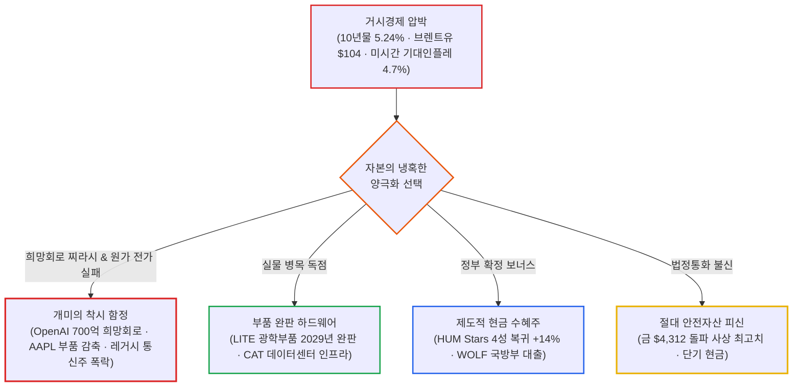

# 2026년 10월 09일(금) 하루치 뉴스정리

- **작성일**: 2026-10-10

트럼프가 11월 중간선거 참패 공포에 질려 '적장' 푸틴에게 굽신거리며 480만 톤(약 3,580만 배럴)의 경유를 구걸하고 국방물자생산법(DPA)까지 꺼내 들며 유가 틀어막기에 나섰고, 오픈AI는 전날 터진 'ARR 500억 달러 쇼크'를 수습하려 "연말엔 700억 달러를 찍을 것"이라는 출처 불명의 '전망의 전망' 찌라시를 띄워 나스닥을 +0.64% 끌어올렸다. 그러나 환호하는 대중의 등 뒤에서 필라델피아 반도체지수는 홀로 -0.41% 하락 마감했고, 핌코는 "미 국채 10년물 금리가 26년 만에 6%까지 치솟을 것"이라고 경고했으며, 애플은 치솟는 메모리 가격을 감당하지 못해 아이폰 18 프로 부품 주문을 15~20% 전격 칼질했다. 겉으로는 반등장 같지만, 속을 까보면 '치솟는 인플레이션과 부채의 쓰나미'에 질린 시장이 전통 인프라와 진짜 현금창출 기업으로 피신하는 극단적 생존 게임이 벌어지고 있다.

## 요약

| 구분 | 주요 내용 |
| :--- | :--- |
| **핵심 진단** | 트럼프의 '푸틴 경유 구걸'과 오픈AI '연말 700억 달러 희망회로'가 만든 억지 반등. 지수는 올랐으나 반도체(-0.41%)는 하락했고, 10년물 5.24%·소비자심리 46.3(역대 최저 근접) 등 스태그플레이션 그림 심화 |
| **핵심 종목 팩트** | 애플 iPhone 18 Pro 부품 15~20% 감축 쇼크(-2.1%), 스페이스X 800MHz 주파수 인수(80억 달러)로 통신 3사(T·VZ·TMUS) -7~9% 폭락, 델타항공 연료비 60억 달러 폭증에 연간 EPS 가이던스 급락 |
| **착시 교정** | ① "오픈AI 연말 700억 달러 전망 = AI 위기 해소" 착시(팩트는 9월 500억 달러뿐, 700억은 전망의 전망일 뿐), ② "트럼프의 유가 안정 = 인플레 종식" 착시(적장 푸틴에게 손 빌릴 만큼 에너지 위기가 절박하다는 방증) |
| **스마트머니 돈길** | 규제 독점 깨진 통신주 투매 ➔ 정부 보조금/Stars 4성 복귀로 현금 꽂히는 헬스케어(HUM +14.4%), 광학 부품 2029년까지 완판된 실물 인프라(LITE +6.5%), 법정통화 부채 불신에 따른 금($4,312 돌파) 매집 |
| **가장 더러운 변수** | 브렌트유 104달러대 유지 속 항공·물류 기업의 영업마진 압살(DAL 연료비 62% 폭증), 미시간대 1년 기대인플레 4.7%로 반등하며 12월 연준 추가 금리 인상 확률 80%대 고착화 |
| **계좌 행동 지침** | 지수 반등에 취해 기술주 뇌동매수 엄금. 가격 인상 저항에 부딪힌 완제품 빅테크(AAPL) 비중 조절, 유가·금리 충격에 가이던스 깎이는 경기민감주 손절, 실물 독점 하드웨어 및 금·현금 버퍼 20% 유지 |

---

## 1. 기사 속 팩트 폭행 (핵심 요약)

### 1.1 지수와 채권: 억지 반등의 가면과 5.24%의 족쇄
- **지수 종가**: 다우 **51,654.95 (+0.83%)**, S&P500 **7,811.54 (+0.59%)**, 나스닥 **27,366.17 (+0.64%)**. 3대 지수는 올랐지만, 전날 -3.39% 두들겨 맞았던 **필라델피아 반도체지수는 홀로 -0.41% 하락 마감**했다. 기술주 반등이라는 말은 반도체를 빼놓고 지수만 올려 세운 허상이다.
- **국채 금리**: 10년물 금리는 **5.2430% (+1.0bp)**로 마감했다. 장중 5.28%까지 치솟았다가 트럼프 발표로 간신히 상승폭을 줄였다. 통화정책에 민감한 2년물은 **4.7910% (+3.8bp)**로 오르고, 만기가 가장 긴 30년물만 **5.5990% (-0.8bp)**로 약보합을 보였다.
- **핌코(Pimco) CIO의 경고**: 세계 최대 채권 운용사 핌코의 다니엘 이바신(Daniel Ivascyn)은 "채권 시장의 레버리지 청산과 고유가로 인해 **미 10년물 국채금리가 6.0%까지 치솟을 위험**이 있다. 이는 26년 만에 처음이며, 30년 모기지 금리는 이미 7.4%로 2023년 이후 최고치다"라고 직격탄을 날렸다.
- **소비자 심리와 기대 인플레 쇼크**: 미시간대 10월 소비자심리지수 예비치는 **46.3**으로 전월 대비 1.8포인트 하락, 시장 예상치(47.6)를 밑돌며 역대 최저치였던 지난 5월(44.8)에 근접했다. 반면 1년 기대 인플레이션은 **4.6% ➔ 4.7%**로 뛰었고, 5~10년 기대 인플레도 **3.4% ➔ 3.5%**로 올랐다. 소비는 얼어붙는데 물가 기대 심리는 치솟는 전형적인 스태그플레이션 시그널이다.
- **미 10년물 금리의 숨통 가격 (5.30~5.35% 레짐)**: 트루이스트 웰스의 칩 휴이는 10년물 금리가 5.30~5.35%에 도달할 때마다 위험자산 매도세가 쏟아졌다고 짚었다. 시장의 할인율 임계선은 명확하다. 5.20% 미만이면 성장주 숨통 구간, 5.20~5.35%는 고변동성 종목 차별화, 5.35% 돌파 시 고PER AI주 급락, 5.50% 이상은 지수 전체 밸류에이션 충격이다.
- **연준 금리 전망**: 10월 FOMC 동결 확률은 82.8%이나, 12월까지 추가 금리 인상 확률은 **80% 초반대**로 여전히 굳건하다.

### 1.2 유가와 외환: 푸틴에게 무릎 꿇은 트럼프와 호르무즈 전쟁
- **국제 유가와 해상 충돌**: WTI는 **$91.85 (+0.39%)**, 브렌트유는 **$104.72 (+0.42%)**에 마감했다. 장중 호르무즈 해협에서 잇단 유조선 공격(지난주 11척 피격, 이번 주 5척 추가 피격으로 총 16척 피격)으로 WTI가 +1.87%까지 치솟았다.
- **트럼프의 '적장 푸틴' 경유 합의**: 디젤 가격 폭등으로 11월 중간선거 패배 위기에 직면한 트럼프는 백악관 행사에서 "중대 발표"를 예고하더니, 푸틴과 합의해 **러시아로부터 경유 30만 톤 즉각 공급, 11월 50만 톤, 직후 100만 톤 등 단기 총 480만 톤(약 3,580만 배럴)을 공급받기로 했다**고 밝혔다. 대러 제재를 스스로 내던지고 적장에게 기름을 빌려오는 촌극이다.
- **국방물자생산법(DPA) 동원**: 로이터는 트럼프가 한국전쟁 시절 제정된 국방물자생산법(DPA)을 가동해 민간 정유사에 에너지 강제 증산을 명령할 방침이라고 보도했다.
- **외환과 금**: 달러인덱스는 캐나다 고용 쇼크(-6.8만 명 급감, 실업률 6.5%)에 힘입어 **102.229**로 소폭 상승했다. 반면 금(Gold) 선물은 **$4,312.30 (+1.33%)**로 폭등하며 사상 최고치 권역을 달렸다. 채권 금리가 5%대인데 금이 폭등한다는 것은, 글로벌 자본이 미국 법정통화의 부채 리스크를 불신하고 있다는 적나라한 증거다.

### 1.3 기업 팩트 폭행: 화려한 입방정과 피 흘리는 공급망
- **오픈AI '연말 700억 달러' 찌라시**: 전날 FT가 "9월 말 ARR이 500억 달러로 시장 기대치(700억 달러)에 200억 달러 못 미쳤다"고 폭로하자, 이날 외신 소식통을 통해 "올해 말까지 연환산 매출이 700억 달러에 도달하거나 초과할 것"이라는 보도가 나왔다. 9월 500억 달러는 팩트이고, 700억 달러는 '전망의 전망'일 뿐이다. 바이탈놀리지의 아담 크리사풀리는 "시장이 AI 관련 부채와 거대한 자본 투자(CAPEX)의 물결에 저항하고 있다는 점이 핵심"이라며 급격한 V자 반등을 일축했다.
- **브로드컴(AVGO), 500억 달러 차입 딜의 양날의 검**: 오픈AI와 공동 개발 중인 커스텀 AI 반도체 배치를 지원하기 위해 브로드컴이 500억 달러 이상의 초대형 부채 조달을 추진 중이다. 커스텀 ASIC 수요가 거대하다는 실물 증거인 동시에, AI 인프라가 감당해야 할 차입금의 무게가 시장의 거부감을 자극하는 뇌관이 되고 있다.
- **알파벳(GOOGL)과 팔란티어(PLTR)의 실수요 증명**: TD 코웬은 알파벳의 3분기 구글 클라우드 매출 성장률이 **전년비 100% 이상 폭증**했을 것으로 추정했다. 골드만삭스는 팔란티어의 연환산 매출이 80억 달러에 달하고 매출 증가율이 100%를 유지하고 있다며 매수 의견(목표가 230달러)으로 상향했다. AI 수요 전체가 죽은 것이 아니라, 실질 현금을 회수하는 플랫폼으로 돈이 집중되고 있다.
- **애플(AAPL) 부품 주문 15~20% 감축 쇼크**: 닛케이 아시아 보도에 따르면, 애플은 부품 공급업체들에게 **iPhone 18 Pro 및 Pro Max 10월 부품 생산을 당초 요청 물량보다 15~20% 감축해 달라고 긴급 요청**했다. 메모리 가격 급등으로 기기 가격을 100달러 인상하자 소비자들이 지갑을 닫은 것이다. IDC에 따르면 원가 상승으로 스마트폰 평균 판매단가(ASP)는 27.6% 올랐고, 글로벌 출하량은 -16.7% 급감할 것으로 추정됐다. 주가는 **-2.1%** 하락했다.
- **스페이스X, 80억 달러 주파수 인수 ➔ 통신 3사 대폭락**: 스페이스X가 사모펀드 Grain Management로부터 **800MHz 저대역 주파수 라이선스를 약 80억 달러에 인수 합의**했다. 스타링크 위성 네트워크가 미국 본토 일상 이동통신 시장까지 직접 장악하겠다는 선전포고다. 이 소식에 **AT&T -9.81%, 버라이즌(VZ) -8.75%, T-모바일(TMUS) -7.2%**로 미국 전통 통신 과점 3사가 하루 만에 폭락했다.
- **델타항공(DAL) 연료비 60억 달러 쇼크**: 3분기 매출 202억 달러(+32.9% YoY)로 외형은 커졌지만, 3분기 연료비가 41억 달러(+62% YoY)로 치솟으며 EPS는 컨센서스를 밑돌았다. 경영진은 **2026년 전체 연료비가 전년 대비 60억 달러(약 8조 원) 증가할 것**이라며 연간 EPS 가이던스를 기존 $6.50~$7.50에서 **$5.10~$5.60으로 대폭 삭감**했다. 유가 100달러가 기업 마진을 어떻게 도륙하는지 보여주는 표본이다.
- **휴마나(HUM) +14.4% 폭등**: CMS(미 메디케어·메디케이드 서비스 센터)가 발표한 2027년 Stars 등급에서 240만 명이 가입한 주력 상품(H5216)이 3.5성에서 4성으로 복귀하며 정부 보너스 지급 대상에 재편입됐다. 반면 등급이 강등된 얼라인먼트 헬스케어(ALHC)는 **-19.4% 폭락**했다.

---

## 2. 대중의 눈먼 착시 (Illusion)

### 착시 ① “오픈AI 연말 매출 700억 달러라니 AI 위기 끝났다?” ➔ 거짓 희망에 기댄 도박
대중과 언론은 전날 500억 달러 쇼크로 얻어맞자마자, "연말엔 700억 달러 간다더라"는 익명 소식통 보도 한 줄에 환호하며 기술주를 주워 담았다.  
이게 얼마나 한심한 짓인가.  
팩트는 **9월 말 현재 연환산 매출이 500억 달러라는 것뿐**이다. 연말 700억 달러는 '3개월 만에 200억 달러가 솟아날 것'이라는 오픈AI 측의 일방적인 희망회로이자 '전망의 전망'이다. 손에 잡히는 현금흐름 데이터는 단 1달러도 없다.  
더 중요한 진실은 반도체 시장이 이 찌라시에 춤추지 않았다는 점이다. 나스닥이 +0.64% 오르는 동안 **필라델피아 반도체지수는 -0.41% 떨어졌다.**  
타짜들은 안다. 브로드컴이 오픈AI 칩 사주려고 500억 달러 빚을 내야 할 만큼 AI 생태계가 막대한 '부채'에 의존하고 있다는 사실을. 대중만 숫자 놀음에 속아 반등의 함정에 뛰어들고 있다.

### 착시 ② “트럼프가 푸틴과 합의했으니 유가 잡히고 인플레 끝났다?” ➔ 절박함이 부른 미봉책
트럼프가 푸틴과 전화 한 통으로 디젤 480만 톤을 들여오기로 했다고 하자 시장은 유가가 잡혔다고 안도했다.  
머리가 있으면 생각을 해라. 미국 대통령이 자국 내 반발과 동맹국의 비난을 무릅쓰고 대러 제재를 사실상 무력화하면서까지 '적장 푸틴'에게 기름을 구걸했다는 건 무슨 뜻인가?  
**미국 내부의 디젤 정제 능력과 에너지 수급이 선거를 앞두고 파탄 직전까지 몰렸다는 뜻이다.**  
게다가 호르무즈 해협에서는 일주일 만에 유조선 16척이 피격당했다. 바다에서 미사일이 날아다니고 있는데 러시아산 경유 몇 방울 들어온다고 배럴당 104달러 브렌트유가 구조적으로 70달러로 내려가는가?  
미시간대 기대 인플레이션이 4.7%로 뛰고, 델타항공이 1년 기름값으로 60억 달러를 더 토해내겠다고 울부짖는 게 진짜 현실이다.

### 착시 ③ “통신주는 배당 든든한 경기 방어주다?” ➔ 독점 해자가 통째로 날아간 날
AT&T, 버라이즌, T-모바일을 안전한 '배당 방어주'로 믿고 계좌에 채워 넣었던 은퇴자들과 대중은 오늘 피눈물을 흘렸다. 하루 만에 주가가 7~10%씩 증발했다.  
스페이스X가 80억 달러를 들여 800MHz 저대역 주파수를 삼키는 순간, 수십 년간 땅에 광케이블과 기지국을 깔아놓고 통행세를 뜯어내던 통신사들의 해자는 허물어졌다.  
저궤도 위성망 스타링크가 일상 스마트폰 저주파 통신까지 쏴버리면 이 거대한 부채 덩어리 통신사들은 어떻게 되는가? 기술 패러다임이 바뀔 때 '과거의 방어주'는 가장 위험한 '시체'가 된다.

---

## 3. 고수들의 진짜 돈길 (Smart Money)

스마트 머니는 언론이 쏟아내는 오픈AI 찌라시나 트럼프의 트루스소셜 정치 쇼에 일희일비하지 않는다. 그들이 돈을 묻어두고 실속을 챙기는 자리는 철저하게 **'실물 병목', '정부 현금흐름', '가치 보존 자산'**이다.

- **① 2029년까지 주문이 꽉 찬 '실물 병목'에 붙어라 (루멘텀 & 캐터필러)**:
    - 오픈AI가 빚을 내든 말든, 데이터센터를 지으려면 광학 부품과 중장비가 필요하다. 루멘텀(LITE)은 2029년까지 생산할 모든 부품이 이미 완판됐고, 2027년엔 수요의 70%도 못 맞춘다고 발표하며 급등했다. 캐터필러(CAT) 역시 농기계 반독점 조사 노이즈로 빠졌지만 JP모건이 지적했듯 데이터센터 건설 호황의 최대 수혜주로 PER 26배 실적 지지를 받는다. 말로 떠드는 AI가 아니라 통장에 선급금이 꽂히는 병목 기업이 진짜다.
- **② 정부가 보증하는 '확정 현금흐름'을 낚아채라 (휴마나 & 울프스피드)**:
    - 스마트 머니는 민간 소비자가 지갑을 닫을 때 정부 예산이 들어오는 곳으로 간다. 휴마나(HUM)는 CMS 평가 4등급 복귀로 정부 보너스가 확정되자마자 하루 만에 +14.4% 폭등했다. 울프스피드(WOLF) 역시 국방부 15억 달러 지원 약정으로 주가가 날았다. 소비 심리가 46.3으로 바닥을 기는 시대에는 정부 재정을 빨아들이는 기업이 가장 안전하다.
- **③ 법정통화의 부채 쓰나미를 헤지하라 (금 온스당 $4,312 돌파)**:
    - 10년물 국채금리가 5.24%이고 6%까지 오를 수 있다는 경고가 나오는데 금 가격이 1.33% 올라 4,312달러를 뚫었다. 고금리 환경에서 금이 오른다는 것은 명백한 '통화 불신'이다. 미국 정부가 천문학적 부채를 감당하지 못해 국채 금리가 뛰고 인플레가 고착화되자, 스마트 머니는 달러와 채권에서 빠져나와 실물 금을 조용히 쓸어 담고 있다.

---

## 4. 징징대지 말고 해야 할 냉정한 행동 지침

### 4.1 지수 하루 반등에 속아 기술주 추격 매수하지 마라
나스닥이 올랐다고 환호하지 마라. 반도체 지수는 여전히 음봉이고, 애플은 아이폰 부품 주문을 20% 잘라냈으며, 오픈AI의 700억 달러는 실체가 없는 희망회로다.  
고평가 기술주가 하루 이틀 튕겨 오르는 것은 포지션 청산에 따른 기술적 되감김일 뿐이다. 지금 기술주에 비중을 풀로 싣는 건 불나방 짓이다.

### 4.2 소비자가 외면하는 '원가 전가 실패주'는 털어내라
애플을 보라. 메모리 가격이 올랐다고 스마트폰 가격을 100달러 올렸다가 바로 판매 부진을 겪고 부품을 줄였다. 델타항공을 보라. 기름값 60억 달러를 감당 못 해 1년 농사 가이던스를 박살 냈다.  
원자재와 부품 가격은 뛰는데, 그걸 소비자에게 온전히 전가하지 못하고 마진이 깎이는 완제품 제조사나 항공·운송주는 계좌에서 비중을 쳐내야 한다.

### 4.3 레거시 통신주(T, VZ)의 환상에서 깨어나라
"배당률 6~7% 주니까 들고 간다"는 안일한 생각으로 AT&T나 버라이즌을 쥐고 있지 마라. 스페이스X의 800MHz 주파수 인수는 통신업의 판도를 뒤흔드는 구조적 위협이다. 배당 몇 푼 받으려다 원금이 -10%씩 녹아내리는 꼴을 보지 않으려면 통신주에 대한 비중을 냉정하게 축소하라.

### 4.4 포트폴리오의 20%는 '현금과 실물 금'으로 틀어쥐어라
10년물 금리가 5.24%를 넘어 6.0%로 갈 위험이 상존하고, 호르무즈 해협에서는 유조선이 불타고 있다. 이럴 때 계좌를 주식 100%로 꽉 채워두는 건 용기가 아니라 백치다.  
현금성 자산(단기 국채/MMF)과 금을 합쳐 포트폴리오의 최소 20%를 탄약으로 확보해 두어라. 진짜 승부는 시장이 거대한 부채와 고유가의 무게를 이기지 못하고 한 번 더 비명을 지를 때, 피 흘리는 우량주를 바닥에서 쓸어 담는 타짜에게 돌아간다.

### 4.5 향후 2~4주 시장 핵심 모니터링 체크리스트

| 핵심 지표 | 안도 신호 (Bull) | 위험 신호 (Bear) | 시장 대응 의미 |
| :--- | :--- | :--- | :--- |
| **미 10년물 국채금리** | 5.20% 이하 하향 안정 | 5.35% 상향 돌파 | 5.35% 돌파 시 고PER AI주 밸류에이션 재붕괴 |
| **브렌트유** | 배럴당 100달러 하회 | 배럴당 110달러 돌파 | 유가 폭등 시 CPI 재점화 및 12월 금리 인상 확정 |
| **나스닥 vs 반도체(SOX)** | 나스닥·SOX 동반 반등 | **나스닥 상승 속 SOX 하락 지속** | 10월 9일처럼 다이버전스 발생 시 속임수 반등 |
| **AI CAPEX 회수력** | 빅테크 실적 동반 가속 | 부채 폭증 및 FCF 악화 | 빚내서 세운 데이터센터의 경제성 검증 탈락 |

이번 이틀간의 변동성이 던진 결론은 명확하다. **AI 수요 자체가 무너진 것이 아니라, 시장이 처음으로 AI 성장의 '가격표(Price Tag)'를 진지하게 따지기 시작했다.** AI 매출 성장률이 5%대 장기금리와 막대한 부채 비용을 이길 만큼 충분한가. 여기에 숫자로 증명하지 못하는 기업은 가차 없이 도태된다. AI 테마 전체를 맹목적으로 추종하지 말고, 병목을 쥐고 실제 현금을 회수하는 진짜 승자에게만 포트폴리오를 압축하라.
