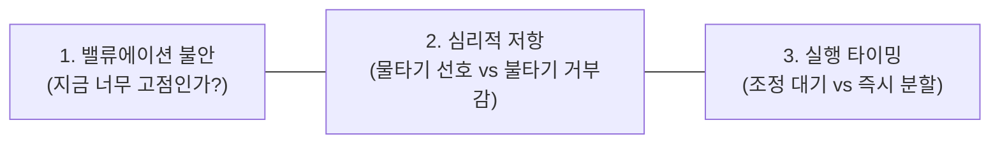
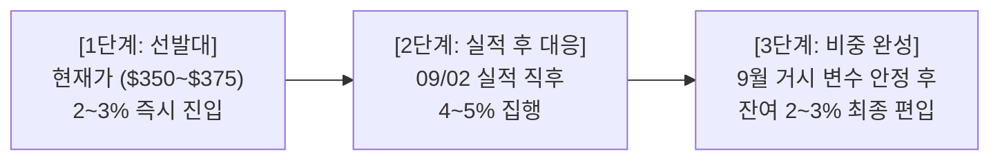

# [종목상담] 브로드컴(AVGO) 비중 확대 및 분할 매수 전략

- **작성일**: 2026-08-31

보유 비중 1% 미만인 브로드컴(AVGO)을 10%까지 확대할 때 직면하는 고점 우려와 불타기 심리를 분석하고, 실전 3단계 분할 매수 해법을 제시합니다.

## 요약

| 구분 | 핵심 내용 |
| :--- | :--- |
| **상담 질문** | 현재 고점 여부, 불타기(추가 매수)에 대한 심리적 부담, 1% 미만 ➔ 10% 분할 매수 타이밍 |
| **핵심 결론** | 고점 대비 -23.4% 조정($368선) 및 FY27 PER 16.9배로 저평가. 실적(09/02) 전 1차 선발대(2~3%) ➔ 실적 후 2차(4~5%) ➔ 거시 안정 후 3차(2~3%) 실행 |

---

## 1. 투자자 질문

> "브로드컴을 사고 싶은데 지금 이미 아주 조금 샀어. 포트폴리오가 1%도 안 돼. 한 10%까지 늘리고 싶은데 지금 너무 고점 아닌가?  
> 한번에 다 살 건 아니고 분할로 살 건데 빠지길 기다렸다가 살까? 아니면 지금부터 조금씩 살까?  
> 이미 들고 있는 건 수익 중이긴 하다. 내가 물타기는 좋아해도 불타기는 별로 선호하지 않아서 고민이네.  
> 장기 성장은 일단 좋아 보이는데 AI 쪽에 버블이 터질 것 같진 않거든 나는. 지금 내가 쓰고 있고 투자 상담받는 것도 AI잖아. 누구보다 AI의 유용성에 대해서 잘 아는 사람이라 그래."

---

## 2. 질문 분석

투자자의 질문 속 핵심 고민과 심리적 요인은 다음과 같이 3가지로 압축됩니다.

- **① 밸류에이션 불안 (고점 착시)**: 주가가 연초 대비 상승했다는 이유로 고점 매수를 우려하고 있으나, 실제 밸류에이션(PER) 평가가 필요함.
- **② 심리적 저항 (불타기 거부감)**: 수익 중인 종목을 더 높은 단가에 사는 것에 대한 앵커링 편향(닻 내림 효과)이 발생함.
- **③ 실행 타이밍 (실적 전후 대응)**: 9월 2일 실적 발표(변동성 ±7~12%)를 앞두고 현금 분할 집행 시점을 결정해야 함.

---

## 3. 핵심 답변 및 실행 가이드

### 3.1 질문별 명쾌한 진단

| 질문 쟁점 | 명쾌한 진단 및 근거 |
| :--- | :--- |
| **Q1. 지금 너무 고점인가?** | **고점이 아닙니다.** 전고점($481.57) 대비 **-23.4% 조정된 $368선**이며, FY27 Forward PER은 **16.9배(PEG 0.46)**로 엔비디아(28.5배), 마벨(24.2배) 대비 가장 저평가된 안전마진 구간입니다. |
| **Q2. 불타기가 망설여지는데?** | **1% 미만은 투자가 아닌 '정찰병'**입니다. 확신이 든 1등 기업을 10% 주력으로 키우는 과정은 무모한 불타기가 아니라 **정상적인 포지션 구축(Position Sizing)**입니다. |
| **Q3. 기다릴까, 지금부터 살까?** | **지금 선발대(2~3%)를 사고, 실적(09/02) 발표 후 잔여분을 집행**하십시오. 올인이나 무작정 대기 대신 리스크를 통제하는 최적의 방안입니다. |

---

### 3.2 실전 3단계 분할 매수 로드맵

| 단계 | 목표 비중 | 시점 및 기준 | 실행 방침 |
| :---: | :---: | :--- | :--- |
| **1단계** | **2 ~ 3%** | **현재가 ($350 ~ $375)** | 실적 전 선발대 진입으로 갭상승 시의 포모(FOMO) 방지 |
| **2단계** | **4 ~ 5%** | **09/02 실적 발표 직후** | • **하락 시**: $350~$355 부근 안전마진 **물타기** • **상승 시**: $390 돌파 안착 확인 후 **확인 매수** |
| **3단계** | **최종 10%** | **9월 중순 안정화 국면** | 잔여 물량을 채워 포트폴리오 10% 완성 및 중장기 홀딩 |

---

## 4. 종합 결론 및 실행 원칙

- **AI 실사용 통찰은 정확함**: 맞춤형 AI 가속기(Custom XPU)와 Tomahawk 이더넷을 독점한 브로드컴은 AI 실사용 확대의 최대 수혜주입니다.
- **실행 원칙**: 과거 매입 단가에 연연하지 말고, 현재 $350~$375 구간에서 1차 선발대(2~3%)를 진입시킨 뒤 9월 2일 실적 결과를 보며 차분하게 10% 비중을 완성하십시오.
- **손절/위험 관리선**: 핵심 지지선인 **$345.00**을 종가로 이탈하지 않는 한 흔들림 없이 유지합니다.

!!! tip "최종 요약 제언"
    확신 있는 1등 종목은 '물타기'가 아니라 '계획된 분할 매수'로 비중을 키워야 계좌 수익률을 견인합니다. 3단계 로드맵에 따라 차분히 실행하십시오.
