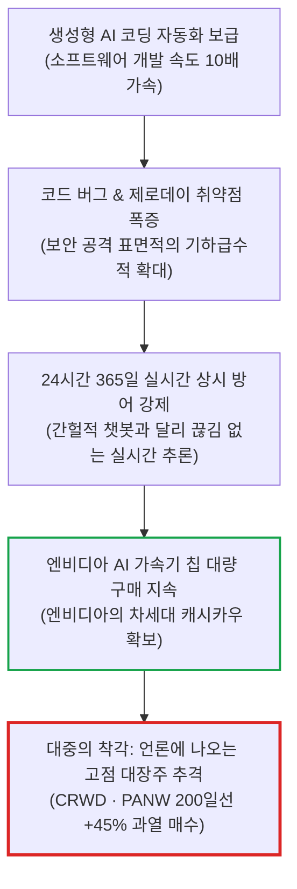
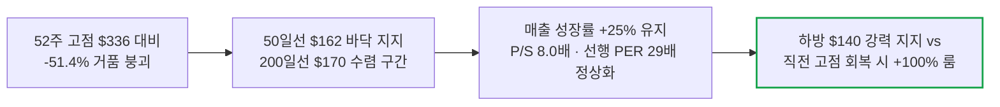
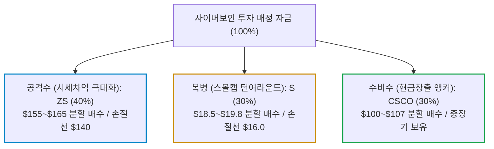

# 젠슨 황 지목 AI 사이버보안 차기 격전지와 실전 수혜주 선별 전략

- **작성일**: 2026-09-11
- **데이터 기준**: 2026-09-10 종가 기준 yfinance 시장 데이터

젠슨 황이 골드만삭스 테크 콘퍼런스에서 "AI의 다음 거대 시장이자 킬러 앱은 사이버보안"이라고 선언하자 언론과 개미들이 또다시 흥분해서 날뛰고 있다. 뉴스의 화려한 수사에 속아 200일선 위로 40% 이상 치솟은 고점주를 덥석 무는 자는 시장의 영원한 호구다. 젠슨 황의 진짜 속내를 꿰뚫어 보고, 하방이 지지되며 손익비가 극대화된 바닥권 알짜 종목만 냉혹하게 발라낸다.

## 요약

| 구분 | 핵심 내용 |
| :--- | :--- |
| **상담 질문** | 젠슨 황이 다음 AI 거대 시장은 사이버보안이라고 했는데, 어떤 주식에 관심을 가져야 하는가? |
| **핵심 결론** | 대중이 열광하는 대장주 크라우드스트라이크(CRWD, P/S 40배, 200일선 괴리 +45%)와 팔로알토(PANW, 선행 PER 69배)는 단기 추격 매수 엄금 자리다. 지금 당장 사도 물리지 않고 하방이 단단한 손익비 극대화 대안주는 **지스케일러(ZS, 52주 고점 대비 -51% 폭락 후 200일선 바닥 다지기, P/S 8.0배)**, **센티넬원(S, 부채 0원·CRWD 대비 1/6 밸류 P/S 6.3배)**, 그리고 스플렁크를 삼켜 엔비디아와 직접 손잡은 **시스코(CSCO, 선행 PER 19.2배·연간 FCF 112억$)** 3종목뿐이다. |

---

## 1. 투자자 질문

> "젠슨 황이 다음 AI 거대 시장은 사이버보안이래. 나는 어떤 주식에 관심 가지면 될까?"

---

## 2. 질문 분석: 젠슨 황의 진짜 속내와 대중의 뇌동매수 함정

젠슨 황의 발언을 액면 그대로 받아들이면 하수다. 엔비디아 CEO가 보안 업계를 칭찬한 배경에는 철저한 비즈니스 셈법이 깔려 있다.

- **① 코딩 가속이 낳은 취약점 폭증의 역설**:
    - AI가 코드를 빠르게 짜낼수록 소프트웨어 결함과 제로데이 보안 구멍도 같은 속도로 쏟아진다. AI가 만들어낸 혼란을 수습하기 위해 더 많은 AI 보안 소프트웨어를 사야만 하는 구조적 자가발전 시장이다.
- **② 간헐적 프롬프트가 아닌 24시간 실시간 상시 추론(Inference)**:
    - 챗봇은 사람이 질문할 때만 연산 자원을 쓴다. 반면 침투 탐지 AI 에이전트는 전 세계 네트워크 트래픽과 계정 접속 로그를 1초도 쉬지 않고 24시간 내내 실시간 추론해야 한다. 즉, 보안 기업들은 엔비디아의 GPU와 네트워킹 칩을 끊임없이 사들여 서버를 돌려야 한다. 젠슨 황이 보안을 띄우는 진짜 이유다.
- **③ 대중의 뇌동매수와 밸류에이션 청구서**:
    - 기사가 뜨자마자 개미들은 CNBC에 오르내리는 크라우드스트라이크(CRWD)와 팔로알토 네트웍스(PANW)를 뇌동매수한다. 하지만 이들 대장주는 이미 52주 신저가 대비 2배 이상 폭등했고 200일 이동평균선 위로 목이 꺾이게 치솟아 있다. 여기서 타면 다음 실적 발표에서 가이던스 1%만 삐끗해도 -25% 폭락을 맞고 계좌가 너덜너덜해진다.

---

## 3. 사이버보안 핵심 종목 밸류에이션 및 기술적 위치 비교

감정에 휘둘리지 말고 야후 파이낸스(yfinance)가 증명하는 냉혹한 숫자를 직접 대조해라.

| 티커 | 기업명 | 현재가 | 52주 최고가 대비 | 200일선 괴리율 | RSI(14) | P/S | 선행 P/E | 잉여현금흐름(FCF) / 재무 | 진입 판정 |
| :--- | :--- | ---: | ---: | ---: | ---: | ---: | ---: | :--- | :--- |
| **ZS** | 지스케일러 | **$163.48** | **-51.4%** | **-4.2%** | 43.6 | **8.0배** | **29.2배** | 현금 및 단기투자 34.7억$ | **적극 매수 (손익비 1위)** |
| **S** | 센티넬원 | **$19.81** | **-16.9%** | **+23.2%** | 43.5 | **6.3배** | **42.8배** | **부채 0원**, 순현금 6.55억$ | **분할 매수 (가성비 1위)** |
| **CSCO** | 시스코 시스템즈 | **$107.44** | **-17.0%** | **+13.4%** | 41.1 | **6.7배** | **19.2배** | 연간 FCF 112억$, PEG 1.01 | **방어 앵커 (안전마진 1위)** |
| **CRWD** | 크라우드스트라이크 | $208.86 | -9.6% | **+45.3%** | 57.7 | 39.6배 | 130.2배 | 4:1 액면분할 후 저점 대비 +138% | **추격 매수 엄금 (과열)** |
| **PANW** | 팔로알토 네트웍스 | $338.49 | -14.5% | **+43.9%** | 46.5 | 24.0배 | 69.4배 | CyberArk 희석 우려, 200일선 괴리 | **관망 (조정 대기)** |
| **NET** | 클라우드플레어 | $311.17 | -5.9% | **+38.9%** | 60.0 | 44.1배 | 185.6배 | 밸류에이션 극단적 부담 | **매수 보류** |

---

## 4. 손익비 극대화 바닥권 3대 종목 심층 분석

### 4.1 지스케일러 (ZS: Zscaler) — 고점 대비 -51% 폭락 후 200일선 바닥 다지기

- **진입 자리와 손익비**:
    - 52주 최고가($336.27)에서 반토막(-51.4%) 난 뒤, 현재가 $163.48은 50일선($162.57)을 딛고 200일선($170.59) 바로 밑에서 에너지를 모으는 완벽한 턴어라운드 차트다.
    - 하방은 $140~$150 전저점 박스권으로 단단히 닫혀 있고, 상방은 밸류에이션 리레이팅 시 2배 가까이 열려 있어 손익비가 압도적이다.
- **비즈니스 실체**:
    - 기업 네트워크의 필수 표준인 '제로 트러스트(Zero Trust Exchange)'의 독보적 선두주자다. 지난 분기 매출이 전년 동기 대비 25% 급증한 8억 9,800만 달러를 기록하며 외형 성장을 증명했다.
    - 그럼에도 주가 폭락 덕분에 밸류에이션 거품이 완전히 빠져 **P/S 8.0배, 선행 PER 29.2배**에 거래된다. CRWD(P/S 40배) 대비 5분의 1 가격이다.
- **재무 건전성**:
    - 분기마다 잉여현금흐름(FCF) 흑자를 지속하고 있으며, 대차대조표에 쌓아둔 현금 및 단기투자자산만 **34억 7,400만 달러(약 4.6조 원)**에 달한다. 자금난으로 흔들릴 위험이 전무하다.

### 4.2 센티넬원 (S: SentinelOne) — 부채 0원 + AI 자율방어의 가성비 복수혈전

- **진입 자리와 손익비**:
    - 현재가 $19.81로 단기 고점($23.84) 대비 -16.9% 건전한 조정을 마쳤다. 200일선($16.08) 위에서 단단한 하방 경직성을 확보한 눌림목 자리다.
- **비즈니스 실체**:
    - 설립 초기부터 머신러닝·AI 기반의 자율 엔드포인트 방어(Purple AI)를 핵심 무기로 삼아온 기술 기업이다. 2024년 7월 전 세계를 마비시켰던 크라우드스트라이크 업데이트 대란 당시 유일하게 단 한 건의 시스템 충돌도 일으키지 않으며 기술적 안정성을 입증했다.
- **밸류에이션 격차**:
    - 매출 성장률 20.6%를 기록 중인데도 **P/S는 고작 6.3배**다. CRWD의 6분의 1도 안 되는 극단적 저평가 상태다.
    - 특히 **총차입금 부채가 0원(Debt Free)**이며, 순현금만 6억 5,500만 달러를 쥐고 있다. 대형주 밸류에이션에 피로를 느낀 스마트 머니가 유입될 때 주가 상승 탄력이 가장 가파르게 터져 나올 종목이다.

### 4.3 시스코 시스템즈 (CSCO: Cisco Systems) — 스플렁크를 집어삼킨 AI 보안의 철옹성

- **진입 자리와 손익비**:
    - 고점($129.52) 대비 -17% 눌림을 받고 200일선($94.73) 상단인 $107.44에서 숨을 고르고 있다. 고평가 기술주들이 매크로 충격으로 흔들릴 때 계좌 전체의 추락을 막아줄 완벽한 방패다.
- **비즈니스 실체**:
    - 구닥다리 라우터 장사꾼으로 보면 오산이다. 빅데이터 로그 및 보안 관측(Observability) 시장의 절대자 **스플렁크(Splunk)를 280억 달러에 인수 완료**했다.
    - AI가 보안 위협을 학습하고 방어하려면 전 세계 기업 인프라에서 발생하는 막대한 데이터 로그가 필수적인데, 이 데이터 파이프라인의 목줄을 쥐고 있는 곳이 시스코다. 젠슨 황이 엔비디아의 엔터프라이즈 AI 보안 파트너로 직접 시스코와 손을 잡은 이유가 여기에 있다.
- **밸류에이션과 현금 흐름**:
    - **선행 PER 19.2배, PEG 1.01배**로 기술주 섹터 내에서 가장 저렴한 수준이다.
    - 연간 잉여현금흐름(FCF)만 **112억 달러(약 15조 원)**를 찍어내며 1.5% 수준의 배당까지 챙겨준다. 물릴 걱정 없이 목돈을 묻어둘 수 있는 든든한 앵커 자산이다.

---

## 5. 고점 대장주(CRWD, PANW)에 대한 냉혹한 진단

"그렇다면 업계 1위인 크라우드스트라이크나 팔로알토 네트웍스는 버려야 하는가?"

아니다. 제품 경쟁력과 시장 지배력은 자타공인 업계 최정상이다. 하지만 **'좋은 회사'를 사는 것과 '좋은 가격'에 사는 것은 완전히 다른 차원의 문제다.**

* **크라우드스트라이크 (CRWD)**:
    - 2024년 7월 IT 대란 쇼크를 극복하고 액면분할까지 거치며 $208.86까지 치솟았다. 문제는 200일선($143.70)과의 이격도가 +45.3%로 극단적 과열권이라는 점이다. 선행 PER 130배를 정당화하려면 단 한 분기의 오차도 없는 완벽한 실적을 내야 한다. 200일선 부근($145~$155)까지 거품이 꺼지는 투매가 나오기 전까지는 쳐다보지도 마라.
* **팔로알토 네트웍스 (PANW)**:
    - 최근 CyberArk 인수 추진으로 1억 1,200만 주에 달하는 신주 발행 희석 우려가 발생했다. 연초 대비 폭등 후 실적 발표를 전후해 -14% 급락한 것은 시장의 정당한 경고다. 50일선($350)을 완전히 회복하거나 $305~$322 지지대를 다시 확인하기 전까지는 신규 진입을 서두를 이유가 없다.

---

## 6. 실전 행동 가이드: 포트폴리오 구축 전략

뉴스가 터진 날 흥분해서 한 번에 시장가로 긁는 자는 시장의 먹잇감이 된다. 아래의 원칙에 따라 철저히 3단계로 분할 진입해라.

1. **공격형 포지션 (지스케일러 - ZS, 비중 40%)**:
    - **매수 밴드**: $155 ~ $165 구간에서 2~3회에 걸쳐 분할 매수.
    - **목표가 / 기대수익**: 1차 목표가 $210 (200일선 안착 후 직전 저항선), 2차 $280.
    - **손절 기준선**: 전저점 박스권 이탈인 **$140 종가 이탈 시 미련 없이 비중 축소**.
2. **턴어라운드 포지션 (센티넬원 - S, 비중 30%)**:
    - **매수 밴드**: $18.5 ~ $19.8 구간.
    - **목표가 / 기대수익**: 1차 목표가 $25, 2차 $32 (CRWD 밸류 갭 메우기).
    - **손절 기준선**: 200일선 지지 붕괴인 **$16.0 종가 이탈 시 손절**.
3. **방어형 앵커 포지션 (시스코 시스템즈 - CSCO, 비중 30%)**:
    - **매수 밴드**: $100 ~ $107 눌림목 구간.
    - **목표가 / 기대수익**: 연 1.5% 배당 수취 및 AI 보안 인프라 재평가 시 $130 돌파.
    - **손절 기준선**: 200일선($94.73)을 하회하는 **$93.0 이탈 시 재검토**.
4. **대장주 알람 설정**:
    - CRWD는 $150, PANW는 $315에 알람을 걸어두고, 주가가 거기까지 굴러떨어질 때까지는 차분히 관망하며 대중이 공포에 질려 던지는 물량을 기다려라.
