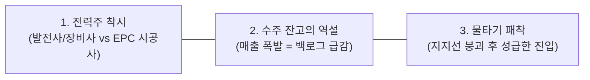
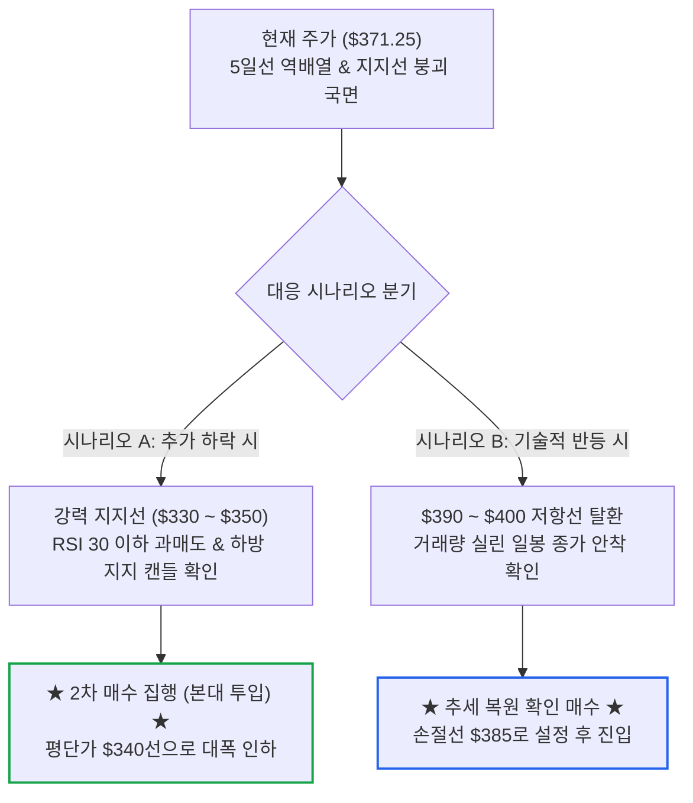

# [종목상담] AI 전력주 호황 속 아간(AGX) 주가 급락 원인과 2차 매수 진입 시점

- **작성일**: 2026-09-23

AI 전력 인프라 메가트렌드 환상에 취해 발전소 시공사(EPC)의 수주 잔고(Backlog) 피크아웃 공포와 선행 PER 역전을 읽지 못하면 떨어지는 칼날에 손가락이 잘린다. 아간(AGX)의 급락 실체와 2차 매수 저격 타점을 냉혹하게 해부한다.

## 요약

| 구분 | 핵심 내용 |
| :--- | :--- |
| **상담 질문** | AI 시대 전력주가 호황이라는데 왜 아간(AGX)만 계속 빠지는가? 선발대 진입 후 주가가 밀리는데 지금 2차 매수(추가 매수)에 들어가도 되는가? |
| **핵심 결론** | **지금 2차 매수는 절대 금지다.** 아간은 전기를 직접 비싸게 파는 발전사가 아니라 일감 소진(수주 잔고 -14.0% 급감)에 직면한 EPC 시공사다. 선행 PER 역전과 하반기 감익 전망 속에서 $400 지지선이 붕괴되었다. 어정쩡한 -5% 낙폭에 칼날을 잡지 말고, 역사적 바닥인 **$330 ~ $350 베드락 구간 지지 확인** 또는 **$390 ~ $400선 종가 안착 확인** 후 진입해야 한다. |

---

## 1. 투자자 질문

> "현재 아간(AGX)에 선발대로 소량 매수한 상태인데 계속 주가가 빠져서 손실 중입니다. AI 시대에 전력주는 좋다고 생각하는데 왜 유독 아간만 계속 빠지나요? 지금 2차 매수 들어가도 될까요?"

---

## 2. 질문 분석

대중은 'AI 전력 쇼티지'라는 거대한 테마 하나만 보고 전력 밸류체인의 모든 주식이 똑같이 오를 것이라 착각한다. 투자자의 질문 속에는 시장의 본질을 오독한 3대 쟁점이 숨어 있다.

- **① '전력주'라는 뭉뚱그린 프레임이 부른 착시**:
    - 비스트라(VST)나 GE 버노바(GEV)가 날아간다고 해서 아간(AGX)이 덩달아 올라야 한다는 논리는 시장의 무지다.
    - 전기를 파는 놈(유틸리티), 터빈을 독점 공급하는 놈(장비사), 발전소를 흙 파서 지어주는 놈(EPC 시공사)의 사업 구조와 주가 메커니즘은 180도 다르다.
- **② 사상 최대 실적 뒤에 숨은 '수주 잔고(Backlog) 피크아웃 공포'**:
    - 지난 분기 매출이 61.5% 폭증한 것은 기존에 따놓은 일감을 미친 듯이 태웠다는 뜻이다.
    - 하지만 미래 먹거리인 수주 잔고는 2개 분기 연속 줄어들었다. 시장은 '2027년 일감 절벽'을 두려워하고 있다.
- **③ 지지선 붕괴 직후 어정쩡한 중간 가격대 물타기의 위험성**:
    - $400 라운드 넘버와 $390 지지선이 무너져 일봉이 역배열로 내리꽂히는 중이다.
    - 선발대 평단가 대비 겨우 -5% 빠진 자리에서 2차 매수 버튼을 누르는 것은 계좌를 갉아먹는 전형적인 '뇌동 물타기'다.

---

## 3. 핵심 답변 및 실행 가이드

### 3.1 질문별 명쾌한 진단

| 질문 쟁점 | 명쾌한 진단 및 핵심 근거 |
| :--- | :--- |
| **Q1. AI 시대 전력주인데 왜 아간(AGX)만 계속 빠지는가?** | **아간은 전력 판매자가 아니라 건설 시공사(EPC)이기 때문이다.** 최근 1개월간 비스트라(VST, +3.7%)나 GE 버노바(GEV, +0.9%)는 올랐으나 아간(AGX)은 **-20.8% 폭락**했다. 아간은 발전소를 시공해 주는 수주 산업이다. 지난 분기 매출 $3.84억(+61.5%)을 찍으며 사상 최대 실적을 냈지만, 이는 기존 백로그를 빠르게 소진한 결과다. 수주 잔고가 1월 $29.3억에서 7월 **$25.2억으로 -14.0% 급감**한 반면 신규 수주 잭팟 공시는 지연되었다. 여기에 월가가 하반기 EPS를 상반기 대비 -31% 급감할 것으로 전망하면서 **선행 PER(34.6배)이 과거 PER(32.4배)을 추월하는 '역전 현상'**이 발생해 기관들이 차익 실현을 던지는 것이다. |
| **Q2. 지금 2차 매수(추가 매수) 들어가도 될까?** | **절대 안 된다. 지금은 관망(Hold)해야지 물을 탈 자리가 아니다.** 평단가 대비 겨우 -5% 빠진 어정쩡한 중간 지대다. $400과 $390 지지선이 무너지며 단기 이평선이 완전히 역배열된 상태에서 하방 브레이크(바닥 양봉이나 도지 캔들)가 나오지 않았다. 아간의 유통 주식 수는 1,403만 주에 불과한 품절주라 밀릴 때 호가가 텅 비어 낙폭이 커진다. 진짜 바닥인 **$330 ~ $350 베드락 구간까지 기다리거나, 아니면 $390~$400선을 종가로 완전히 되찾는 것을 확인한 뒤**에 들어가야 손익비가 나온다. |

---

### 3.2 AI 전력 인프라 밸류체인 피어 그룹 비교 매트릭스

전력주라는 같은 바스켓 안에서도 주가 방향이 왜 갈라지는지 직시해야 한다.

| 점검 항목 | 아간 (`AGX`) | 비스트라 (`VST`) | GE 버노바 (`GEV`) | 콴타 서비시스 (`PWR`) |
| :--- | :--- | :--- | :--- | :--- |
| **사업 본질** | **발전소·전력망 턴키 시공 (EPC)** | 민자발전(IPP) 및 원자력·가스 전력 판매 | 가스터빈·풍력 독점 장비 제조 | 송배전 전력망 엔지니어링·시공 |
| **최근 1개월 등락** | **-20.84% (폭락 조정)** | **+3.67% (고점 횡보)** | **+0.87% (신고가권)** | **+4.19% (견조한 우상향)** |
| **수익 원천** | 공사 진행률에 따른 도급 매출 인식 | 치솟은 전력 도매가(PPA) 직접 마진 수취 | 수년 치 밀린 터빈 납품 및 장기 유지보수 | 유틸리티 기업들의 전력망 CAPEX 집행 |
| **핵심 약점 / 아킬레스건** | **수주 잔고(Backlog) 소진 시 일감 절벽** | 천연가스 가격 급등 시 스프레드 축소 | 밸류에이션 부담 (선행 PER 50배 이상) | 부채 규모(순부채 60억$ 이상) |
| **대차대조표** | **순현금 10억 달러 (차입금 0원)** | 순부채 보유 | 순현금 전환 국면 | 순부채 60억 달러 초과 |
| **시장 포지셔닝** | 펀더멘털은 견고하나 **피크아웃 공포 국면** | AI 전력난의 직접적 최대 현금 수혜주 | 대체 불가능한 하드웨어 공급 병목주 | 정부 정책 및 송전망 확충의 인프라 축 |

---

### 3.3 실전 단계별 2차 매수 실행 로드맵

선발대가 물려 있다고 해서 조급하게 손가락을 놀리지 마라. 2차 매수는 반드시 명확한 조건부 시나리오가 충족될 때만 집행한다.

| 구분 | 진입 조건 및 가격 기준 | 실전 실행 방침 | 비중 전략 |
| :--- | :--- | :--- | :---: |
| **기보유 선발대** | **현재가 ($371선 유지)** | • 전체 자금의 2~3% 수준인 정찰병이므로 손절하지 않고 홀딩 • 회사의 실체(순현금 10억$, 무차입, 배당 33% 증액)는 훼손되지 않음 | 보유 유지 |
| **2차 매수: 시나리오 A (극단적 가격 메리트)** | **$330 ~ $350 베드락 구간** | • 올해 1~2월 강력한 횡보 박스권을 만들었던 역사적 바닥 • RSI 30 이하 과매도 진입 후 아래꼬리 양봉으로 지지 확인 시 진입 • **평단가를 $340~$350 수준으로 단숨에 낮춰 반등 시 +25~40% 룸 확보** | **배정 자금의 50%** |
| **2차 매수: 시나리오 B (추세 복원 확인)** | **$390 ~ $400 종가 안착** | • 현 구간($370선)에서 바닥을 다진 뒤 거래량을 실어 $390~$400 돌파 시 • 하락 추세 탈출을 눈으로 확인하고 진입하는 안전제일 전략 | **배정 자금의 40%** |
| **절대 금지 행위** | **$360 ~ $380 어정쩡한 중간 지대** | • 지지선도 없고 추세 반전도 없는 공중에 뜬 자리에서 물타기 금지 • 떨어지는 칼날을 맨손으로 잡지 마라 | **매수 절대 금지** |

---

## 4. 종합 결론 및 실행 원칙

### 4.1 핵심 인사이트

- **① '수주 잔고(Backlog)'가 꺾이면 어떤 호실적도 주가를 지탱하지 못한다**:
    - 아간은 2분기 사상 최대 실적을 찍었음에도 주가가 맥없이 무너졌다. 매출이 늘어난 만큼 수주 잔고가 $29.3억에서 $25.2억으로 쪼그라들었기 때문이다. EPC 기업의 주가를 밀어 올리는 진짜 연료는 '이미 지나간 분기 매출'이 아니라 '앞으로 지어야 할 신규 수주'다. 차기 분기(FY27 Q3) 실적에서 백로그 반등이 확인되기 전까지 시장의 의구심은 쉽게 사라지지 않는다.
- **② 선발대 손실 -5%에 공포를 느끼거나 성급하게 물타지 마라**:
    - 선발대의 존재 이유는 어디까지나 '호가창과 주가 흐름을 감시하는 정찰병'이다. 정찰병이 총 한 발 맞았다고 해서 본대를 허허벌판으로 밀어 넣는 장수는 전멸을 면치 못한다. 본대는 반드시 천연 요새인 $330~$350 지지선에 도달했을 때만 투입해야 한다.
- **③ 무차입 순현금 10억 달러의 안전판을 믿고 기다려라**:
    - 아간은 부채로 연명하는 한계 건설사가 아니다. 시가총액의 20%에 육박하는 10억 달러의 순현금을 쥐고 있고, 은행 빚이 0원이며, 분기 배당을 33%나 올렸다. 망할 걱정이 없는 기업이 시장의 오해와 수급 왜곡으로 과도하게 짓눌릴 때가 바로 탐욕을 부릴 자리다. 단, 그 자리는 지금($371)이 아니라 $330~$350이다.

### 4.2 손절 및 위험 관리선

- **최종 손절 기준선**:
    - 2차 매수를 $330~$350 구간에서 성공적으로 집행한 이후에도, 만약 1월 절대 저점인 **$304를 종가 기준으로 이탈**한다면 신규 수주 취소나 대형 공기 지연 등 구조적 악재가 터진 것으로 간주하고 전량 비중을 축소한다.
- **목표 수익률 및 차익실현**:
    - $340선 평단가를 완성한 뒤 기술적 반등 시, 1차 저항선인 **$440~$460 구간(+25~30%)에서** 절반을 차익실현하고, 잔여 물량은 신규 수주 공시를 확인하며 전고점 회복을 노린다.

!!! tip "최종 핵심 제언 (Executive Takeaway)"
    AI 전력 부족은 팩트지만, 아간(AGX)은 전기를 파는 게 아니라 발전소를 짓는 회사다. 시장이 백로그 감소에 지레 겁을 먹고 주가를 패대기칠 때 감정적으로 동요하지 마라. 지금은 손가락을 묶어두고 현금을 지켜야 할 때다. 주가가 $330~$350 바닥에 내려앉아 피눈물 흘리는 투매 물량이 쏟아져 나올 때, 그때 차분하게 2차 본대를 실어라.
