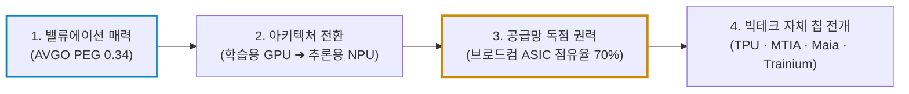
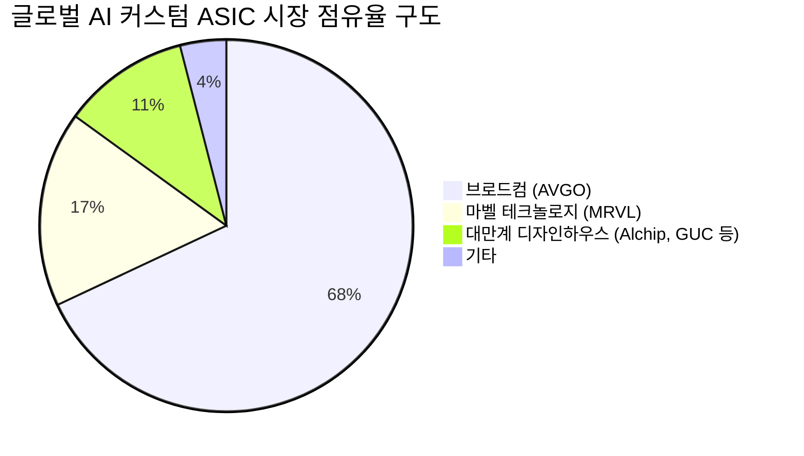

# 브로드컴 밸류에이션 매력 검증과 NPU·추론 특화 가속기 대세론

- **작성일**: 2026-09-16

사상 최고가 대비 31% 조정을 겪은 브로드컴(AVGO)의 실시간 밸류에이션 매력을 피어 22개 종목과 비교 검증하고, 프론티어 모델의 무한 사전학습 경쟁 둔화에 따른 'NPU 및 추론 특화 커스텀 ASIC'의 대세화와 글로벌 빅테크의 자체 칩 설계 지형도를 총정리한다.

## 요약

| 구분 | 핵심 내용 |
| :--- | :--- |
| **상담 질문** | ① 분석 종목 중 브로드컴(AVGO)이 밸류에이션 매력 1위인가? ② 프론티어 모델 경쟁 완화 시 NPU/추론 특화 칩이 대세가 되는가? ③ 맞춤형 ASIC 시장에서 브로드컴이 절대 강자가 맞는가? ④ 현재 글로벌 빅테크들이 자체 설계 중인 맞춤형 ASIC 전모는 무엇인가? |
| **핵심 결론** | 질문의 모든 직관이 정확하다. 브로드컴은 **선행 PER 17.5배, PEG 0.34, 고점 대비 -31.5% 조정**으로 빅테크 메가캡 중 성장 가치(GARP) 1위다. 또한 사전학습에서 추론으로 전선이 이동하며 전력·비용을 50% 이상 절감하는 맞춤형 가속기(ASIC/NPU)가 대세가 되었으며, 브로드컴은 이 시장의 **65~70%를 독점한 절대 군주**다. |
| **빅테크 ASIC 지도** | 구글(TPU/Axion), 메타(MTIA/Iris), MS(Maia/Cobalt), 아마존(Trainium/Inferentia), 애플(ACDC/Neural Engine), 오픈AI(Jalapeño), 테슬라(Dojo/AI5) 등이 일제히 자체 칩을 설계 중이며, 이들의 핵심 파트너이자 통행세 징수자가 브로드컴이다. |
| **실전 대응 전략** | 연초 갭 지지선이자 보고서 당시 매수 밴드 하단인 **$330 ~ $345 구간(현재가 $339.27)**은 밸류에이션과 기술적 지지선이 완벽히 일치하는 최적의 분할 매집 타점이다. |

---

## 1. 투자자 질문

> **질문 1**: "내가 분석한 종목 중에 현시점 기준으로 가장 밸류에이션 매력이 넘치는 건 브로드컴이지 싶어 맞어?"
>
> **질문 2**: "프론티어 모델 경쟁을 줄이자고 하니깐 NPU 같은 GPU가 더 대세가 될 것 같아"
>
> **질문 3**: "맞춤형 ASIC 쪽에서 절대 강자는 브로드컴이 맞나?"
>
> **질문 4**: "현재 빅테크에서 직접 맞춤형 ASIC을 설계하고 있는 것은 무엇인가?"

---

## 2. 질문 분석

투자자의 일련의 질문은 단편적 시세 조회가 아니라, **[밸류에이션 왜곡 ➔ AI 아키텍처 세대교체 ➔ 커스텀 실리콘 독점 공급망 ➔ 빅테크 인프라 전략]**으로 이어지는 완벽한 4단계 논리적 연결고리를 관통하고 있다.

- **① 밸류에이션 왜곡과 안전마진 (질문 1)**:
    - 52주 고점 대비 -31.5% 하락한 현재가($339.27)가 단순한 기술적 낙폭인지, 폭증하는 현금흐름 대비 극단적인 저평가인지 검증.
- **② 학습에서 추론으로의 아키텍처 전이 (질문 2)**:
    - 무한 사전학습(Pre-training)의 자본 한계 봉착과 전력 부족 속에서 왜 범용 GPU가 도태 압력을 받고 NPU/ASIC이 필수재가 되는지 규명.
- **③ 커스텀 실리콘 시장의 절대 권력 (질문 3)**:
    - 빅테크가 자체 칩을 설계한다고 할 때, 브로드컴이 단순 하청업체인지 아니면 목줄을 쥔 절대 군주인지 기술적 해자 확인.
- **④ 글로벌 빅테크 자체 칩 지형도 (질문 4)**:
    - 구글, 메타, 마이크로소프트, 아마존, 애플, 오픈AI, 테슬라 등이 어떤 자체 실리콘을 전력 투구하여 개발·배포하고 있는지 전수 조사.

---

## 3. 핵심 답변 및 데이터 검증

### 3.1 질문별 명쾌한 진단

| 질문 쟁점 | 명쾌한 진단 및 핵심 근거 |
| :--- | :--- |
| **Q1. 브로드컴이 가장 매력적인가?** | **그렇다. '종합 퀄리티 성장가치(GARP)' 기준으로는 브로드컴이 1위다.** 현재가 $339.27 기준 **선행 PER 17.50배, PEG 0.34, 고점 대비 -31.5% 조정**을 기록 중이다. 연간 +85.5%의 외형 성장과 54.3%의 영업이익률을 찍는 독점 테크 메가캡이 PEG 0.34에 방치된 것은 명백한 가격 왜곡이다. |
| **Q2. NPU/특화 칩이 더 대세가 되는가?** | **전적으로 맞다. 서비스 보급 단계에서는 NPU가 시장을 지배한다.** 무식하게 모델 크기만 키우는 사전학습이 한계에 달하고, 모델 경량화(SLM)와 추론 시점 생각하기(o1, Gemini Flash Thinking)가 대세가 되었다. 검색과 서비스 호출마다 고가의 범용 GPU를 돌리면 빅테크는 적자로 파산한다. 전력과 비용을 50~70% 깎아내는 **NPU 및 맞춤형 가속기(ASIC)**로의 전환은 생존의 문제다. |
| **Q3. ASIC 절대 강자는 브로드컴인가?** | **의심의 여지가 없는 팩트다. 시장 점유율 65~70%를 틀어쥔 절대 군주다.** 업계 2위인 마벨(MRVL, 15~20%)과 대만 디자인하우스(알칩, GUC 등)를 압도적 격차로 따돌리고 있다. 초고속 SerDes IP 독점, TSMC CoWoS 최우선 배정권, 12년간 구글 TPU 14종 무결점 양산 트랙레코드가 만든 철벽 해자다. |
| **Q4. 빅테크는 무엇을 직접 설계하는가?** | **클라우드 하이퍼스케일러와 빅테크 7개사 전체가 자체 칩을 가동 중이다.** 구글(TPU/Axion), 메타(MTIA/Iris), MS(Maia/Cobalt), 아마존(Trainium/Inferentia), 애플(ACDC/Neural Engine), 오픈AI(Jalapeño), 테슬라(Dojo/AI5) 등이 엔비디아 의존도를 낮추기 위해 맞춤형 가속기를 전력 투구하고 있다. |

---

### 3.2 23개 분석 종목 실시간 밸류에이션 비교 매트릭스

지식저장소에서 분석한 23개 종목 중 핵심 후보군들의 실시간 시장 데이터(`yfinance`, 2026-09-16 기준) 대조표다.

| 티커 | 기업명 | 현재가 | 52주 고점 대비 | 선행 PER | PEG | 매출 성장률 | 영업이익률 | 14일 RSI | 밸류에이션 판정 |
| :--- | :--- | :---: | :---: | :---: | :---: | :---: | :---: | :---: | :--- |
| **`AVGO`** | **브로드컴** | **$339.27** | **-31.5%** | **17.50배** | **0.34** | **+85.5%** | **54.3%** | **38.7** | **GARP 종합 1위 (성장률 대비 극단적 저평가)** |
| `NVDA` | 엔비디아 | $212.17 | -10.3% | 13.59배 | 0.46 | +105.9% | 66.2% | 49.5 | 선행 PER은 최저권이나 가격 조정 폭 미흡 |
| `WDC` | 웨스턴 디지털 | $411.96 | -48.5% | 12.98배 | 0.81 | +43.8% | 43.6% | 37.6 | 고점 반토막 시클리컬 딥 밸류 |
| `AMAT` | 어플라이드 머티 | $421.17 | -43.1% | 22.82배 | 0.91 | +24.8% | 33.7% | 29.4 | 전공정 1위 장비주, 극단적 과매도 탈출 |
| `CRDO` | 크레도 테크 | $150.39 | -51.3% | 15.50배 | — | +114.7% | 25.2% | 18.9 | 고점 대비 -51% 폭락, 초고속 연결 반등 손익비 |
| `000660.KS` | SK하이닉스 | 1,748,000원 | -41.5% | 3.71배 | 0.18 | +256.8% | 76.3% | 51.4 | 코리아 디스카운트 반영 절대 저PER |
| `GOOGL` | 알파벳 | $344.98 | -15.6% | 23.22배 | 1.25 | +24.2% | 34.0% | 48.7 | 빅테크 피어 평균 수준 밸류에이션 |
| `VRT` | 버티브 | $234.61 | -38.2% | 25.72배 | 0.80 | +24.1% | 20.4% | 42.4 | 액체냉각 독점이나 선행 PER 25배 부담 |

#### 팩트 체크 및 시사점
1. **수치상 최저 PER**: 엔비디아(13.6배)와 웨스턴 디지털(13.0배), SK하이닉스(3.7배)가 브로드컴(17.5배)보다 낮다.
2. **가격 조정과 안전마진**: 엔비디아는 고작 -10% 빠져 상단에 머물러 있는 반면, 브로드컴은 고점 대비 **-31.5% 폭락**해 충분한 가격 조정을 거쳤다.
3. **결론**: 비즈니스 독점도, 연 400억 달러의 FCF, 30% 이상의 낙폭, PEG 0.34를 고루 갖춘 **'물리지 않고 편안하게 사 모을 수 있는 육각형 주식'은 브로드컴이 유일**하다.

---

### 3.3 범용 GPU vs NPU(맞춤형 ASIC)의 냉혹한 경제학

대중은 "AI = 무조건 엔비디아 GPU"라는 1차원적 프레임에 갇혀 있다. 하지만 데이터센터의 물리적 법칙과 자본의 계산기는 완전히 다른 방향을 가리킨다.

| 비교 항목 | 범용 GPU (엔비디아 Blackwell/H100) | NPU / 맞춤형 ASIC (TPU, MTIA, Maia 등) |
| :--- | :--- | :--- |
| **비유** | 온갖 도구가 다 달린 무거운 **스위스 아미 나이프** | 오직 특정 부위만 정밀하게 발라내는 **전문 식칼** |
| **아키텍처 본질** | 3D 그래픽, 물리 계산, 정밀 FP64 회로 내장 (범용성 극대화) | 불필요한 그래픽/부동소수점 회로 완전 제거, 행렬 곱셈기(시스톨릭) 집중 |
| **추론 전력 효율** | 쓰지도 않는 대기 회로로 인해 **전력 소모 및 발열 심각** | 맞춤형 저정밀(FP8/INT8/FP4) 연산으로 **전력 50~70% 대폭 절감** |
| **칩당 도입 원가** | 엔비디아의 독점 영업이익률(65%+)이 얹어져 극도로 고가 | 파운드리(TSMC) 직접 제작으로 **대당 구축 비용 1/3 수준 절감** |
| **적합한 영역** | 거대 모델 초기 연구 및 파운데이션 사전학습(Training) | **글로벌 대규모 서비스 배포, 실시간 질의응답 및 추론(Inference)** |

---

### 3.4 맞춤형 ASIC 시장 판도: 브로드컴의 4대 해자(Moat)와 '1강 1중 다약' 구도

반도체 시장 조사기관(모건스탠리, JP모건, 시티) 분석에 따르면 글로벌 AI 맞춤형 ASIC 시장 점유율은 브로드컴이 압도하고 있다.

빅테크가 똑똑한 엔지니어를 수천 명씩 고용하고도 브로드컴을 배제할 수 없는 이유는 4가지 물리적 해자 때문이다.

- **① 224G / 448G 초고속 SerDes(I/O) IP 세계 1위 독점**:
    - AI 가속기는 연산 코어보다 데이터를 HBM과 외부 네트워크로 초고속 전송하는 물리 회로(SerDes)가 성능을 결정한다. 브로드컴의 SerDes 기술은 엔비디아를 1~2세대 앞서 있다.
- **② TSMC CoWoS 첨단 패키징 VVIP 프리패스권**:
    - 최신 AI 칩은 TSMC CoWoS 캐파 배정이 생명이다. 개별 빅테크가 단독으로 가면 줄을 서다 끝나지만, 애플·엔비디아와 함께 TSMC 3대 고객인 브로드컴의 슬롯을 타면 최고 수율로 즉각 배정받는다.
- **③ 12년간 14개 칩 양산 무결점 신화 (구글 TPU 파트너십)**:
    - 3nm/2nm 칩은 1회 테이프아웃(Tape-out) 실패 시 수천억 원과 1~2년의 사업 기회가 날아간다. 브로드컴은 구글 TPU 1세대부터 6세대까지 단 한 번도 실패하지 않은 입증된 신뢰도를 가졌다.
- **④ 토마호크(Tomahawk) 초고속 이더넷과의 턴키 시너지**:
    - 수십만 대의 칩을 연결하는 데이터센터 스위치 시장의 70%를 브로드컴이 독점하고 있다. NPU 칩과 스위치를 하나의 패키지로 최적화해 공급할 수 있는 기업은 지구상에 브로드컴뿐이다.

---

### 3.5 글로벌 빅테크 맞춤형 AI ASIC 전수 조사 (Big Tech In-House Silicon Map)

현재 주요 빅테크들이 엔비디아 의존도를 낮추고 자사 클라우드 마진을 방어하기 위해 직접 설계·배포 중인 핵심 맞춤형 가속기 및 프로세서 전모다.

| 빅테크 기업 | 자체 가속기 / 칩 명칭 | 현재 공정 및 상태 | 핵심 역할 및 주요 타깃 워크로드 | 핵심 설계 파트너 및 파운드리 |
| :--- | :--- | :--- | :--- | :--- |
| **구글 (Alphabet)** | • **TPU v6e (Trillium)** • **TPU v7 (차세대)** • **Axion (ARM CPU)** | • Trillium 2024년 말 양산 • Axion 데이터센터 가동 중 | • 제미니(Gemini) 학습 및 전 세계 검색/추론 • 애플 인텔리전스 서버 학습 인프라 제공 • 클라우드 워크로드 전력 60% 절감 CPU | **브로드컴 (AVGO)** (12년 연속 배타적 파트너) TSMC 파운드리 |
| **메타 (Meta)** | • **MTIA v1 / v2** • **Iris (차세대 3nm)** | • MTIA v2 5nm 배치 중 • Iris 2026년 3nm 양산 | • 인스타그램 릴스·페이스북 피드 추천 알고리즘 • 라마(Llama) 오픈소스 모델 서비스 추론 • 2027년까지 14GW 컴퓨팅 확충 핵심재 | **브로드컴 (AVGO)** (Iris 설계 및 CoWoS 통합) TSMC 파운드리 |
| **마이크로소프트 (Microsoft)** | • **Azure Maia 100 / 200** • **Azure Cobalt 100** | • Maia 100 5nm 가동 • Maia 200 개발 중 | • Azure OpenAI 서비스(GPT-4o) 추론 가속 • MS 365 코파일럿(Copilot) 대규모 서빙 • Cobalt: 128코어 ARM 기반 고효율 CPU | 마벨 (`MRVL`) 및 자체 실리콘 팀 협업 TSMC 파운드리 |
| **아마존 AWS (Amazon)** | • **Trainium 1 / 2 (학습용)** • **Inferentia 1 / 2 (추론용)** • **Graviton 1 ~ 4 (CPU)** | • Trainium 2 (4nm) 대량 배치 • 앤트로픽 클러스터 투입 | • 앤트로픽(Anthropic) 클로드 모델 전용 학습 • 아마존 검색 및 알렉사 추론 원가 절감 • Graviton4: 클라우드 연산 표준 안착 | Annapurna Labs (AWS 인수) + 알칩(Alchip) 협력 TSMC 파운드리 |
| **애플 (Apple)** | • **Neural Engine (NPU)** • **ACDC (Project Baltra)** • **Custom RF & Wi-Fi** | • M4 / A18 프로 3nm 탑재 • 프라이빗 AI 데이터센터 가동 | • 아이폰·맥 온디바이스 AI(Apple Intelligence) • 프라이빗 클라우드 컴퓨트(PCC) 서버 칩 • 자체 5G 모뎀 및 엣지 AI 가속기 | **브로드컴 (AVGO)** (300억$ 다년간 계약 체결) TSMC 파운드리 |
| **오픈AI (OpenAI)** | • **Jalapeño (할라피뇨)** • **Titan (타이탄)** | • 2026년 공개 • TSMC 3nm 양산 준비 | • 10GW 규모 추론 전용 자체 가속기 • 엔비디아 의존 탈피 및 o1/o3 추론 비용 절감 • 차세대 추론 중심 데이터센터 표준화 | **브로드컴 (AVGO)** (설계 및 턴키 개발 전담) TSMC 파운드리 |
| **테슬라 (Tesla)** | • **Dojo D1 / D2 (학습용)** • **AI4 / AI5 (FSD 추론용)** | • HW 4.0 전 차종 탑재 • AI5 차세대 3nm 개발 중 | • 비디오 기반 FSD(완전자율주행) 신경망 학습 • 차량 및 휴머노이드 로봇(옵티머스) 실시간 추론 • 시스템-온-웨이퍼(SoW) 타일 아키텍처 | TSMC CoW-SoW 및 삼성전자 파운드리 협력 |
| **바이트댄스 (ByteDance)** | • **TikTok AI 가속기** | • 5nm/4nm 설계 진행 중 | • 틱톡 추천 알고리즘 및 비디오 AI 생성 • 미국 대중국 반도체 규제 우회용 맞춤형 설계 | **브로드컴 (AVGO)** 협력 파트너십 |

---

### 3.6 핵심 시사점: 왜 모든 빅테크 실리콘 지도는 브로드컴으로 수렴하는가?

글로벌 7대 빅테크의 자체 칩 전개 지도를 펼쳐놓고 보면, 시장의 통념을 뒤엎는 3가지 냉혹한 자본의 역설이 드러난다.

#### ① 빅테크의 '탈(脫)엔비디아'는 곧 '친(親)브로드컴'이다
* 7대 빅테크 중 구글(TPU), 메타(Iris), 오픈AI(Jalapeño), 애플(ACDC/RF), 바이트댄스 등 **가장 거대한 컴퓨팅 파워를 소비하는 5개사의 맞춤형 칩을 실질적으로 양산해 주는 기업이 브로드컴**이다.
* 빅테크가 엔비디아의 독점 마진을 회피하기 위해 자체 ASIC 비중을 늘릴수록, 엔비디아의 파이는 깎이고 그 자본은 고스란히 브로드컴의 수주 잔고로 흡수된다.

#### ② 자체 칩 내재화 공포를 깨부수는 '독점 통행세 징수 모델'
* 삼류 투자자들은 "빅테크가 칩을 직접 만들면 반도체 기업들이 설 자리가 좁아진다"고 공포에 떤다. 
* 하지만 실상은 정반대다. 빅테크가 자체 칩을 늘릴수록 브로드컴의 **커스텀 가속기(Custom XPU) 매출 비중은 FY25 전체의 38%에서 FY27 72% 이상으로 폭증**하며, 연간 400억 달러 이상의 순도 높은 잉여현금흐름(FCF)을 창출하는 핵심 엔진이 된다.

#### ③ '칩렛(Chiplet)과 SerDes' 없이는 자체 칩도 빈 껍데기다
* 연산 신경망 코어(알고리즘)는 빅테크 소프트웨어 엔지니어들이 짤 수 있어도, 칩과 HBM 메모리를 이어 붙이고 보드 밖으로 데이터를 왜곡 없이 쏴주는 물리적 신호 전송(SerDes)과 2.5D/3D 패키징은 브로드컴의 원천 IP 없이는 생산 자체가 불가능하다.
* 빅테크가 독자 생존을 외치며 칩을 설계할수록, 아이러니하게도 브로드컴의 물리적 하드웨어 플랫폼에 대한 종속도는 더욱 심화된다.

---

## 4. 종합 결론 및 실전 실행 로드맵

### 4.1 실전 결론: "지금 당장 사야 하는가?" ➔ **"그렇다. 분할 매집에 손가락을 얹을 최적의 자리다."**

* **이유**: 브로드컴 주가는 8월 말 보고서 분석 당시($368.79) 제시했던 매수 밴드($350~$375) 하단을 하향 이탈하여 현재 **$339.27**까지 내려왔다. 이는 연초 실적 갭상승 지지대($330~$345)의 핵심 바닥 구간이다. 밸류에이션(Fwd PER 17.5배, PEG 0.34)과 가격 조정(-31.5%) 양쪽 모두에서 안전마진이 완벽히 확보되었다.
* **타겟 투자자 분리**:
    - **❌ 절대 사지 마라**: 내일 당장 20% 폭등을 바라는 단타 투기꾼, 테마주 추종자.
    - **⭕ 적극 주워 담아야 할 투자자**: 빅테크의 '엔비디아 탈출 ➔ 커스텀 ASIC 도입'이라는 거대한 구조적 물줄기를 이해하고, 연 400억 달러의 FCF와 함께 멀티플 리레이팅(PER 22~25배 복원)을 편안하게 누릴 중장기 가치성장 투자자.

---

### 4.2 브로드컴(AVGO) 실전 분할 매수 로드맵

| 단계 | 실행 조건 | 포지션 비중 | 가격 밴드 | 실행 방침 |
| :---: | :--- | :---: | :---: | :--- |
| **1차 진입 (주력 매수)** | 연초 갭 지지선 및 PEG 0.34 바겐세일 | **40%** | **$330 ~ $345** | **현재가($339.27) 구간 적극 분할 매집** |
| **2차 매수 (추가 바닥)** | 거시 매크로 금리 발작 시 일시적 하회 | **35%** | **$310 ~ $325** | 200일선 및 역사적 지지대 최저점 저격 |
| **3차 추세 확인** | $350 돌파 및 바닥 탈출 안착 | **25%** | **$355 돌파 시** | 전고점($495) 탈환을 향한 불타기 완성 |
| **손절/이탈 기준** | 빅테크 커스텀 칩 발주 전면 취소 등 | — | **$300 종가 이탈** | 펀더멘털 훼손 시 리스크 관리 |

!!! tip "최종 핵심 제언"
    빅테크들이 자체 칩을 설계한다고 발표할 때마다 대중은 "반도체 기업들이 망한다"며 헛소리를 늘어놓는다. 껍데기 기사를 보지 말고 돈의 흐름을 봐라. **구글, 메타, 오픈AI, 애플이 자체 칩을 만들면 만들수록 그들이 지불하는 수천억 달러의 설계비와 로열티는 고스란히 브로드컴 계좌로 입금된다.** 전 세계 AI 데이터센터의 진짜 병목과 목줄을 쥔 기업이 누구인지 안다면, 현재 $339 선의 브로드컴은 도망칠 자리가 아니라 쓸어 담아야 할 자리다.
