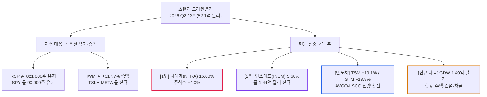

# [대가분석] 스탠리 드러켄밀러 최신 13F로 본 시장 진단과 상승 확신 종목

- **작성일**: 2026-09-14
- **데이터 기준**: SEC EDGAR 13F-HR 원본 정보표(보고 기준일 2026-06-30, 제출일 2026-08-14, Accession No. 0001536411-26-000006) 및 yfinance 시세·재무 데이터(2026-09-14 기준)

스탠리 드러켄밀러(Duquesne Family Office)의 2026년 2분기 13F-HR 원본을 항목 단위로 해부하여, 그가 지수와 개별 종목을 어떻게 갈라 치고 있는지, 그리고 어느 축에 실제로 돈을 더 밀어 넣었는지를 주식수 증감 기준으로 판정한다.

## 요약

| 구분 | 핵심 요약 |
| :--- | :--- |
| **상담 질문** | 최신 13F 공시를 기반으로 드러켄밀러는 지금 시장을 어떻게 보며, 어떤 종목이 크게 오를 것으로 보는가? |
| **공시 팩트** | 2026년 2분기 기준 총 52억 1,086만 달러, 보고 항목 95건(종목 기준 90개). 직전 분기 33억 7,683만 달러 대비 **+54.3% 급증** |
| **시장 진단** | **"지수 상방은 콜옵션으로만, 현물은 개별 종목으로"** — 지수 콜 포지션은 유지·증액, 현물 노출은 종목 단위로 분산 |
| **최대 단일 확신주** | **나테라(NTRA) 16.60%($8억 6,492만)** — 다만 주식수 증가는 +4.0%, 비중은 직전 18.14%에서 오히려 하락 |
| **이번 분기 진짜 변화** | **인스메드(INSM) 콜 $1억 4,394만 신규**(합산 5.68% 2위), **CDW $1억 3,979만 신규**, 항공·주택·건설·채굴 신규 편입 |
| **잘라낸 것** | 브로드컴(AVGO)·래티스(LSCC)·옵션케어헬스(OPCH) 전량 청산 등 23개 종목 정리 |

---

## 1. 투자자 질문

> "현재 13F 정보를 기반으로 스탠리 드러켄밀러는 지금 주식 시장을 어떻게 보고 있는지, 그리고 앞으로 어느 종목이 크게 상승할 것으로 보고 베팅하고 있는지 유추해서 명쾌하게 분석해 줘."

---

## 2. 질문 분석: 13F를 읽을 때 반드시 걸러야 할 3대 함정

드러켄밀러는 듀케인 캐피털 운용 30년간 연평균 30%대 수익률을 내면서 단 한 해도 손실을 기록하지 않은 매크로 트레이더다. 그의 13F를 액면 그대로 읽으면 반드시 헛다리를 짚는다. 다음 세 가지를 먼저 걸러야 한다.

- **① 평가금액 증가는 매수가 아니다**: 13F는 분기 말 시가로 평가액을 싣는다. 주가가 오르면 한 주도 안 샀는데 평가액이 불어난다. 매매 방향은 오직 **주식수 증감**으로만 판정한다. 실제로 브라질(EWZ)과 S&P 500 동일가중(RSP) 콜옵션은 이번 분기 주식수 변동이 **정확히 0**이다.
- **② 총자산이 54% 불어난 상태에서의 비중 비교는 착시다**: 포트폴리오 총액이 33억 7,683만 달러에서 52억 1,086만 달러로 폭증했다. 이 상태에서 비중이 유지되기만 해도 실제 금액은 크게 늘어난 것이고, 반대로 비중이 줄어도 금액은 늘었을 수 있다.
- **③ 항목(entry) 순위와 종목 합산 순위는 다르다**: 13F 원본은 같은 종목의 보통주와 콜옵션을 별도 줄로 싣는다. 항목 기준으로는 TSM이 2위지만, 보통주와 콜을 합산한 **종목 기준 2위는 인스메드(INSM) 5.68%**다. 이 글은 혼선을 없애기 위해 **종목 합산 기준**으로 순위를 매긴다.

---

## 3. 드러켄밀러는 지금 주식 시장을 어떻게 보는가?

### 3.1 지수는 콜옵션으로만 만진다 — 그런데 '갈아탄' 게 아니라 '깔고 앉아 있다'

이번 분기 지수 포지션의 실체는 이렇다.

| 지수 포지션 | 평가금액 | 주식수 변동 | 실제 판정 |
| :--- | ---: | :---: | :--- |
| **RSP(S&P 500 동일가중) 콜** | $1억 7,468만 | 821,000주 → **변동 없음** | 직전 분기 포지션을 그대로 유지 |
| **RSP 보통주** | $1,583만 | **74,400주 신규** | 현물을 처분한 게 아니라 소량 신규 편입 |
| **IWM(러셀 2000) 콜** | $9,915만 | 79,000 → 330,000주 **+317.7%** | 이번 분기 지수 포지션 중 유일한 대규모 증액 |
| **SPY(S&P 500) 콜** | $6,721만 | 90,000주 → **변동 없음** | 2025년 4분기부터 계속 유지 |

여기서 읽어야 할 메시지는 두 가지다. 첫째, 그는 **지수 현물을 대량으로 들고 하락장을 맞는 구조를 애초에 만들지 않는다.** 지수 방향성은 프리미엄만 날리면 끝나는 콜옵션으로 처리하고, 계좌의 실질 자금은 개별 종목 현물에 넣는다. 둘째, 이번 분기에 그가 새로 베팅을 키운 지수는 대형주 지수가 아니라 **중소형주 지수(IWM)**다. 대형주 쏠림이 극에 달한 구간에서 온기가 아래로 퍼질 때 터지는 쪽에 레버리지를 걸었다는 뜻이다.

여기에 테슬라(TSLA) 콜 $5,300만과 메타(META) 콜 $2,817만을 신규로 붙였다. 대형 기술주조차 현물이 아니라 콜로 만진다. 고평가 구간에서 하방을 프리미엄으로 제한하고 상방만 취하겠다는 태도가 종목 단에서도 일관된다.

### 3.2 AI 1차 사이클(칩 설계)은 잘라냈다 — 다만 엔비디아는 이번에 판 게 아니다

이번 분기 반도체 쪽 정리는 명확하다. 빅테크 맞춤형 가속기(ASIC)의 대장주로 불리던 **브로드컴(AVGO)을 직전 분기 $6,065만 규모에서 전량 청산**했고, 래티스 반도체(LSCC) $2,997만도 전량 털었다.

다만 대중이 흔히 붙이는 "엔비디아·브로드컴을 동시에 청산했다"는 서술은 공시와 맞지 않는다. **엔비디아(NVDA)는 2025년 4분기, 2026년 1분기 공시에도 이미 없었다.** 이번 분기에 판 게 아니라 그 이전에 이미 정리가 끝난 종목이다. 애플(AAPL) 역시 직전 분기 보유 목록에 없었으므로 "이번에 배제했다"고 말할 근거가 없다.

대신 그가 실제로 돈을 더 넣은 반도체는 두 종목이다.

- **TSMC(TSM)**: 495,280주 → 589,680주, **주식수 +19.1%**
- **ST마이크로(STM)**: 2,612,880주 → 3,102,880주, **주식수 +18.8%**

빅테크가 자체 칩을 설계하든 엔비디아 칩을 사든, 웨이퍼는 결국 TSMC 라인을 통과해야 한다. 설계사끼리의 단가 경쟁에서 빠져나와 통행세를 걷는 쪽으로 갈아탄 구조다.

### 3.3 아무도 주목하지 않는 축 — 경기민감·리플레이션 바스켓의 대규모 신설

이번 분기 신규 편입은 45개 종목에 달한다. 그 면면을 보면 AI와 무관한 축이 통째로 들어왔다.

| 테마 | 종목 및 변동 | 금액 |
| :--- | :--- | ---: |
| **항공** | 유나이티드항공(UAL) 주식수 **+202.8%**, 델타항공(DAL) 신규 | $1억 808만 / $5,648만 |
| **주택·건설** | DR호튼(DHI) 신규, 플루어(FLR) 신규, CRH **+46.6%**, 챔피언홈스(SKY)·카브코(CVCO) 보유 | $4,870만 / $5,146만 / $5,923만 |
| **소재** | 클리블랜드클리프스(CLF) 주식수 **+82.2%** | $3,959만 |
| **비트코인 채굴·전력** | 비트디어(BTDR) 신규, 허트8(HUT) 신규, 라이엇(RIOT) 보유 | $6,467만 / $3,627만 / $2,067만 |

금리 인하와 경기 재가속에 베팅하지 않으면 절대 담지 않을 조합이다. 항공·주택·철강은 금리와 경기에 가장 먼저 반응하는 고베타 자산이고, 채굴주는 전력 인프라와 위험자산 선호의 이중 레버리지다. **AI 내러티브 하나만 보고 이 포트폴리오를 읽으면 절반을 놓친다.**

---

## 4. 앞으로 크게 상승할 것으로 보고 실제로 돈을 실은 종목군

### 4.1 [단일 최대 비중] 나테라(NTRA) — 16.60%, 하지만 '추가 몰빵'은 아니다

| 항목 | 수치 |
| :--- | :--- |
| **평가금액 / 비중** | $8억 6,492만 / **16.60% (종목 기준 1위)** |
| **주식수 변동** | 3,063,606주 → 3,186,306주 (**+4.0%**) |
| **직전 분기 비중** | 18.14% → **16.60%로 하락** |
| **현재 주가** | $328.93 (52주 $157.43 ~ $343.18, **고점 대비 -4.2%**) |

- **돈이 아니라 주가가 불린 비중이다**: 평가금액은 $6억 1,269만에서 $8억 6,492만으로 41% 뛰었지만 주식수는 4%밖에 늘지 않았다. 즉 이번 분기의 증가분 대부분은 **주가 상승으로 저절로 불어난 금액**이다. "16.6%를 새로 몰빵했다"는 해석은 틀렸고, 정확히는 **이미 완성된 초대형 포지션을 그대로 들고 간 것**이다.
- **비즈니스 실체**: 암 환자의 혈액 속 순환 종양 DNA(ctDNA)를 추적해 재발을 조기에 잡아내는 미세잔존질환(MRD) 검사 '시그나테라(Signatera)'가 핵심이다. 종양학 MRD 영역에서 사실상 표준 지위를 굳혔다.
- **숫자의 진실은 덜 화려하다**: 2026년 2분기 매출은 7억 5,280만 달러로 전년 동기 5억 4,660만 달러 대비 **+37.7%** 성장했다. 고성장은 맞지만 폭증이라 부를 수준은 아니다. 더 냉정하게 봐야 할 지점은 수익성이다. **2분기 영업손실 -7,580만 달러, 순손실 -6,700만 달러**로 여전히 적자이고, 직전 분기 +1,800만 달러였던 잉여현금흐름은 **-860만 달러로 적자 전환**했다. 흑자 전환을 기정사실처럼 깔고 접근하면 다친다.

### 4.2 [실질적 2위] 인스메드(INSM) — 콜옵션 $1억 4,394만 신규, 이번 분기 최대 증액

| 포지션 | 평가금액 | 주식수 변동 |
| :--- | ---: | :--- |
| **보통주** | $1억 5,190만 | 1,154,090주 → 1,424,690주 (**+23.4%**) |
| **콜옵션** | $1억 4,394만 | **1,350,000주 신규** |
| **합산** | **$2억 9,584만 (5.68%, 종목 기준 2위)** | — |

- 나테라를 제외하면 **이번 분기 가장 공격적으로 자금을 밀어 넣은 종목**이 인스메드다. 보통주를 23% 늘린 것으로도 모자라 동급 규모의 콜옵션을 통째로 신설했다. 현물과 콜을 겹쳐 쌓는 방식은 그가 확신을 표현하는 전형적인 문법이다.
- 인스메드는 난치성 폐질환(기관지확장증, 비결핵성 항산균 폐질환) 파이프라인을 보유한 희귀질환 기업이다. 현재 주가 $129.41로 **52주 고점 대비 -39.2%** 구간에 있다. 고점에서 사들인 포지션이 아니라 **급락 구간에서 줍고 콜로 상방을 덧댄 구조**라는 점이 중요하다.

### 4.3 [빅테크 재진입] 아마존(AMZN) & 알파벳(GOOGL)

| 종목 (포지션) | 평가금액 | 주식수 변동 | 전략적 의미 |
| :--- | ---: | :--- | :--- |
| **Amazon (`AMZN`) 보통주** | $1억 2,909만 | 45,800주 → 541,600주 (**+1,082.5%**) | 사실상 신규에 가까운 대규모 현물 재구축 |
| **Amazon (`AMZN`) 콜옵션** | $1억 947만 | 200,000주 → 459,300주 (**+129.7%**) | 기존 콜 포지션을 2.3배로 확대 |
| **Alphabet (`GOOGL`) 보통주** | $1억 2,018만 | **336,300주 신규** | 자체 칩(TPU) 및 검색·클라우드 방어력 재평가 |

- 아마존 합산 비중은 **4.58%($2억 3,856만, 종목 기준 5위)**다. 현물을 11배 이상 늘리면서 콜까지 2.3배로 키웠다. **현물과 콜을 동시에 키우는 것은 헤지가 아니라 방향성 확신의 표현**이다.
- AI 설비투자로 현금을 태운다는 시장의 공포를 역이용한 진입이다. AWS의 캐시카우와 광고·물류 효율화가 붙어 있는 한, AI 인프라 지출은 비용이 아니라 점유율 방어 비용으로 회수된다는 판단이다.
- 알파벳은 $1억 2,018만 규모로 완전 신규 진입했다. 현재 주가 $338.50으로 **52주 고점 대비 -17.2%** 구간이다. 오픈AI 위협론에 눌린 밸류에이션을 겨냥한 진입 타점이 분명하다.

### 4.4 [반도체] TSMC(TSM)와 ST마이크로(STM) — 겉보기엔 같은 반도체, 논리는 정반대다

| 종목 (티커) | 비중 (종목 기준) | 평가금액 | 주식수 변동 | 현재 주가 위치 |
| :--- | :---: | ---: | :---: | :--- |
| **TSMC (`TSM`)** | **5.40% (3위)** | $2억 8,161만 | **+19.1%** | $433.24 / 고점 대비 -9.6% |
| **STMicro (`STM`)** | **4.46% (6위)** | $2억 3,238만 | **+18.8%** | $51.51 / 고점 대비 **-35.5%** |

#### ① TSMC는 '통행세' 베팅이다

브로드컴과 래티스를 잘라낸 자금이 향한 곳이 여기다. AI 칩 경쟁이 격해질수록 CoWoS 패키징과 첨단 노드의 병목을 쥔 쪽이 판가를 결정한다. **설계 경쟁의 승자가 누구든 통행료는 TSMC가 걷는다.** 자산이 무겁다는 약점을 독점적 가격 결정권으로 상쇄하는 구조다.

#### ② STM은 통행세가 아니다 — '고정비 레버리지' 베팅이다

여기서 많은 사람이 헷갈린다. STM을 TSMC와 같은 논리로 읽으면 절대 이해가 안 된다. **STM은 파운드리가 아니라 IDM, 즉 자기 공장에서 자기 칩을 만들어 파는 종합 반도체 회사다.** 통행세를 걷는 위치가 아니다. 차량용·산업용 전력 반도체(특히 EV 인버터용 SiC), 마이크로컨트롤러, MEMS 센서가 주력이다.

그렇다면 무엇에 거는 베팅인가. **매출이 꺾이면 이익이 훨씬 더 크게 꺾이고, 매출이 돌아오면 이익이 훨씬 더 크게 튀는 구조** 그 자체다.

| 회계연도 | 매출 | 영업이익 | 영업이익률 |
| :--- | ---: | ---: | :---: |
| 2023년 | 172억 8,600만 달러 | 45억 5,600만 달러 | **26.4%** |
| 2024년 | 132억 6,900만 달러 (**-23.2%**) | 14억 9,400만 달러 (**-67.2%**) | 11.3% |
| 2025년 | 118억 달러 (**-11.1%**) | **3억 2,300만 달러 (-78.4%)** | **2.7%** |

매출은 고점 대비 31.7% 줄었는데 **영업이익은 92.9%가 증발했다.** 순유형자산 110억 5,800만 달러짜리 공장이 매출과 무관하게 감가상각비를 뱉어내기 때문이다. 이게 IDM의 저주다.

그런데 이 저주는 방향이 바뀌면 그대로 축복이 된다. **실적은 이미 돌아섰다.**

| 분기 | 매출 | 매출총이익률 | 영업이익률 | 전년 동기 대비 |
| :--- | ---: | :---: | :---: | :---: |
| 2025년 2분기 (바닥) | 27억 6,600만 달러 | **23.6%** | **2.1%** | — |
| 2025년 3분기 | 31억 8,700만 달러 | 33.2% | 5.1% | — |
| 2025년 4분기 | 33억 3,000만 달러 | 35.2% | 6.2% | — |
| 2026년 1분기 | 30억 9,500만 달러 | 33.8% | 3.1% | **+23.0%** |
| 2026년 2분기 | **34억 8,700만 달러** | 28.9% | 5.6% | **+26.1%** |

2023년 수준의 매출이 복원되면서 구조조정으로 깎인 고정비가 유지되면, 영업이익은 3억 달러대에서 30억 달러대로 **열 배 단위로 튄다.** 드러켄밀러가 산 것은 반도체 기술이 아니라 이 산수다.

**두 번째 방아쇠는 자본지출 사이클이다.** 2025년 영업현금흐름은 21억 5,200만 달러를 벌었는데 잉여현금흐름은 **-5,200만 달러**였다(2024년은 -2억 1,600만 달러). 300mm 전환과 SiC 캠퍼스 건설에 현금을 쏟아부었기 때문이다. **이 투자가 끝나는 순간, 회복된 매출과 이미 지불이 끝난 설비가 겹쳐 잉여현금흐름이 급격히 튀어 오른다.**

**세 번째는 버틸 체력이다.** 현금성 자산 60억 3,200만 달러에 총부채 42억 3,200만 달러로 **순현금 약 18억 달러**다. 자기자본 178억 2,800만 달러, PBR 2.6배. 사이클 바닥에서 망하지 않을 재무구조라는 확신이 없으면 애초에 들어갈 수 없는 종목이고, STM은 그 조건을 충족한다. 프랑스·이탈리아 정부가 지분을 통해 직접 관여하는 유럽 반도체 주권의 핵심 자산이라 정책 자금이 설비 투자를 받쳐준다는 점도 하방을 좁힌다.

#### ③ 결정적으로, 이 베팅은 그의 다른 포지션과 한 몸이다

STM의 전방 시장은 전기차와 산업 설비다. **같은 분기에 그는 테슬라(TSLA) 콜옵션 5,299만 달러어치를 신규로 담았다.** STM은 테슬라 파워트레인의 핵심 SiC 공급사다. 그리고 이 논리는 그가 같은 분기에 통째로 신설한 항공·주택·건설·철강 바스켓과 **정확히 동일한 매크로 베팅**, 즉 금리 인하가 산업 수요를 되살린다는 한 문장으로 수렴한다. **STM은 AI 종목이 아니라 그가 새로 깐 리플레이션 바스켓의 반도체 버전이다.**

#### ④ 그런데 그는 '바닥'에서 사지 않았다 — 세 번에 걸친 피라미딩

여기서 반드시 짚어야 할 사실이 있다. 13F 원본에서 평가금액을 주식수로 나누면 분기 말 기준 주당 단가가 나온다. 그의 STM 매수 이력은 이렇다.

| 공시 기준일 | 보유 주식수 | 주식수 변동 | 분기 말 주당 단가 |
| :--- | ---: | :---: | ---: |
| 2025-09-30 | — | **미보유** | — |
| 2025-12-31 | 773,555주 | **신규 진입** | **$25.94** |
| 2026-03-31 | 2,612,880주 | **+237.8%** | $34.55 |
| 2026-06-30 | 3,102,880주 | **+18.8%** | **$74.89** |

- **1단계**: 실적이 바닥을 친 직후인 2025년 4분기에 주당 26달러 근처에서 정찰대를 깔았다.
- **2단계**: 회복이 숫자로 확인되자 2026년 1분기에 포지션을 **3.4배로 키웠다.**
- **3단계**: 주가가 한 분기 만에 $34.55에서 $74.89로 **+117% 폭등한 구간에서도 18.8%를 더 실었다.**

분기 말 단가로 역산한 평균 매입 단가는 **주당 약 39달러**다(분기 중 실제 체결가는 알 수 없으므로 근사치다). 현재 주가 $51.51은 52주 고점 대비 -35.5%지만, **그의 평균 단가 대비로는 여전히 30% 이상 위에 있다.**

**즉 그는 눌린 자리를 주운 게 아니라, 바닥에서 정찰대를 깔고 회복이 확인될 때마다 비중을 올려 쌓았다.** 대가의 매수 자리를 베낀다는 말의 진짜 의미가 여기 있다. 지금 진입하는 사람은 그의 1단계가 아니라 3단계 이후의 조정 구간을 상대한다.

#### ⑤ 이 베팅이 깨지는 조건

- **재고가 아직 안 빠졌다**: 2025년 말 재고 31억 3,600만 달러로 전년 27억 9,400만 달러보다 오히려 늘었다. 매출 회복이 진짜 수요가 아니라 채널 재고 이전이면 다음 분기에 되돌림이 온다.
- **베타 1.51의 고변동 종목이다**: 2026년 2분기에 +117% 튀었다가 그 뒤 -31% 되밀린 궤적이 이 종목의 성격을 그대로 보여준다.
- **중국 SiC 경쟁과 EV 수요 둔화**: 전력 반도체 단가 경쟁이 재개되면 매출이 회복돼도 마진이 안 따라온다. 2026년 2분기 매출총이익률이 직전 분기 33.8%에서 **28.9%로 내려앉은 것**이 이미 경고 신호다.

### 4.5 [이번 분기 최대 신규] CDW — 아무도 얘기 안 하는 1억 4천만 달러

| 포지션 | 평가금액 | 주식수 |
| :--- | ---: | :--- |
| **보통주** | $1억 463만 | 743,950주 신규 |
| **콜옵션** | $3,516만 | 250,000주 신규 |
| **합산** | **$1억 3,979만 (2.68%, 종목 기준 9위)** | — |

**이번 분기 단일 신규 편입 금액 1위가 CDW다.** 그런데 시장의 13F 해설 대부분이 이 종목을 건너뛴다. 이름에 AI가 안 붙어 있고, 자체 기술도, 특허도, 화려한 제품 발표회도 없기 때문이다. 바로 그 지점이 드러켄밀러가 이 종목을 산 이유다. 게다가 현물만 담은 게 아니라 **콜옵션까지 겹쳐 쌓았다.** 그가 확신을 표현할 때 쓰는 문법이 그대로 반복된다.

#### ① 비즈니스 실체: AI를 '파는' 회사가 아니라 AI를 '설치해 주는' 회사다

CDW는 기업, 중소기업, 정부, 교육기관, 의료기관에 IT 하드웨어와 소프트웨어 라이선스, 클라우드 구독, 네트워크·보안 솔루션을 설계하고 조달해서 구축까지 해 주는 채널 사업자다. 마이크로소프트, 시스코, 델, HP, 애플, 팔로알토 같은 수천 개 벤더의 제품을 고객 상황에 맞춰 한 묶음으로 납품한다.

여기서 핵심을 짚어야 한다. **직원 200명짜리 회계법인이 AI를 도입하기로 결정했다고 치자. 그 회사에는 GPU 서버 사양을 고르고, 네트워크를 다시 깔고, 데이터 보안 정책을 설계할 인력이 단 한 명도 없다.** 그 일을 통째로 떠맡는 곳이 CDW다.

엔비디아와 TSMC가 AI의 1차 인프라라면, CDW는 그 인프라가 하이퍼스케일 데이터센터를 떠나 **실제 기업 사무실까지 내려오는 마지막 100미터 구간의 통행세 징수원**이다. 드러켄밀러가 브로드컴을 잘라내고 TSMC를 늘린 논리, 즉 "설계 경쟁의 승자가 누구든 길목을 쥔 쪽이 돈을 받는다"는 문법이 기업 IT 시장에서 그대로 반복된 선택이다.

#### ② 숫자가 증명하는 해자

| 지표 | 수치 | 해자의 실체 |
| :--- | ---: | :--- |
| **연 매출(2025)** | **224억 2,410만 달러** | 이 구매 물량 자체가 무기다. 벤더 리베이트와 단가 등급은 구매 규모로 결정되므로, 소형 리셀러는 애초에 같은 가격에 물건을 못 산다 |
| **자본지출 비율** | **매출의 0.52%** ($1억 1,710만) | 공장도, 팹도, 대규모 재고 리스크도 없다. 매출이 두 배가 돼도 설비 투자가 따라 늘지 않는 자산 경량 구조 |
| **FCF 전환율** | **102%** (순이익 $10억 666만 → FCF $10억 881만) | 장부상 이익이 거의 손실 없이 현금으로 떨어진다. 회계 이익과 현금의 괴리가 없다 |
| **자기자본이익률(ROE)** | **44.0%** | 투입 자본 대비 회수 효율이 극단적으로 높다 |
| **매출총이익률** | **21.4%** (2025년 21.7%) | 단순 유통업 마진이 아니다. 아래 넷다운 구조 참조 |
| **영업이익률** | **7.3%** | 물량 사업의 숙명이다. 얇다. 이 지점이 최대 약점이자 이익 레버리지의 원천이다 |

**여기서 반드시 짚고 넘어가야 할 회계 구조가 하나 있다.** CDW의 매출총이익률이 21%대까지 올라온 것은 물건을 비싸게 팔아서가 아니다. 클라우드와 SaaS 구독 중개분은 거래 총액이 아니라 **수수료 부분만 순액(에이전시)으로 인식**되기 때문이다. 즉 고객이 실제로 CDW를 통해 집행한 IT 예산 규모는 보고 매출보다 훨씬 크다. **매출 성장률 숫자만 보고 "저성장 유통주"라고 판정하면 사업의 실체를 통째로 놓친다.** 대중이 이 종목을 건너뛰는 이유가 정확히 여기에 있다.

여기에 고객 구조가 해자를 한 겹 더 덮는다. CDW의 고객은 특정 대기업 몇 곳이 아니라 기업·중소기업·정부·교육·의료로 극단적으로 파편화돼 있다. **거래처 한 곳을 잃어도 타격이 없고, 반대로 고객 입장에서는 CDW의 조달·설계·유지보수를 한 번 맡기면 갈아탈 이유가 없다.** 자체 IT 인력이 없는 중견 기업일수록 이 종속은 깊어진다. 정부와 교육 부문의 다년 조달 계약은 아예 신규 진입 자체를 막는 장벽이다.

#### ③ 왜 하필 지금 샀는가 — 세 가지 타이밍

| 회계연도 | 매출 | 전년 대비 |
| :--- | ---: | :---: |
| 2022년 | 237억 4,870만 달러 | — |
| 2023년 | 213억 7,600만 달러 | **-10.0%** |
| 2024년 | 209억 9,870만 달러 | **-1.8%** |
| 2025년 | 224억 2,410만 달러 | **+6.8%** |
| **2026년 상반기** | **122억 5,200만 달러** | **+9.6%** |

- **① 2년 역성장을 끝낸 재가속이 숫자로 확인됐다**: 2023~2024년 팬데믹 특수의 반작용으로 매출이 연속 감소했고, 그동안 이 종목은 시장에서 잊혔다. 그런데 2026년 1분기 +9.2%, 2분기 **+10.0%**로 두 분기 연속 두 자릿수 근처 성장이 찍혔다. **드러켄밀러는 턴어라운드가 이야기가 아니라 실적으로 증명된 시점에 들어왔다.**
- **② 기업 PC·서버 교체 물량이 강제로 밀려온다**: 구형 윈도우 지원 종료로 기업들은 선택이 아니라 의무로 단말을 교체해야 한다. 여기에 온디바이스 AI 지원 사양으로의 전환까지 겹친다. 이 물량은 전부 CDW 같은 조달 채널을 통과한다.
- **③ 금리 인하가 IT 예산을 푼다**: 기업과 공공기관의 IT 예산은 금리와 경기에 후행해서 반응한다. 이 논리는 그가 같은 분기에 신설한 항공(UAL, DAL), 주택(DHI), 건설(FLR), 철강(CLF) 바스켓과 **완전히 동일한 리플레이션 베팅**이다. CDW는 AI 테마주가 아니라 **그가 새로 깐 경기민감 바스켓의 IT 버전**으로 읽어야 앞뒤가 맞는다.

#### ④ 주주환원: 번 돈의 90%를 주주에게 돌려준다

2025년 한 해에만 자사주 매입 **6억 5,300만 달러**, 배당 **3억 2,860만 달러**를 집행했다. 합계 9억 8,160만 달러로, 그해 잉여현금흐름 10억 8,810만 달러의 **90.2%**다.

발행주식수는 2021년 1억 3,570만 주에서 2026년 1억 2,500만 주로 **-7.9%** 줄었다. 특히 최근 1년 사이에만 4.7%가 소각됐다. 매출이 제자리여도 주당 이익이 자동으로 늘어나는 구조다.

#### ⑤ 반드시 알아야 할 약점

- **레버리지가 가볍지 않다**: 순부채 60억 677만 달러 대비 최근 4개 분기 EBITDA 19억 7,700만 달러로 **3.07배**다. 금리가 다시 튀면 부담이 커진다.
- **마진이 얇다**: 영업이익률 7.3%는 물량이 꺾이는 순간 이익이 훨씬 더 크게 꺾인다는 뜻이다. 2023년 매출 -10%에 이 종목이 어떻게 반응했는지 기억해야 한다. **이익 레버리지는 양방향으로 작동한다.**
- **장부 가치가 얇다**: PBR 7.9배, ROE 44.0%라는 숫자는 사업이 좋아서이기도 하지만 자사주 매입으로 자기자본이 깎여 나온 결과이기도 하다.
- **조달 마진은 외부 변수에 직접 노출된다**: 관세와 부품 가격 변동이 곧바로 매입 원가에 전이된다.

#### ⑥ 지금 가격은 어떤가

| 항목 | 수치 |
| :--- | ---: |
| **현재 주가 / 시가총액** | $153.79 / 약 192억 달러 (52주 고점 대비 **-9.1%**) |
| **후행 PER** | 18.5배 |
| **EV/EBITDA** | 12.6배 |
| **FCF 수익률** | **5.7%** |
| **배당수익률 / 배당성향** | 1.64% / 30.2% |
| **베타** | 0.94 |

후행 PER 18.5배는 폭발적으로 싼 구간은 아니다. 다만 **FCF 수익률 5.7%에 배당성향이 30%에 불과하다는 조합**은, 남은 현금으로 계속 주식을 태울 여력이 충분하다는 뜻이다. 컨센서스 기준 선행 PER은 12.8배까지 내려오지만, 이는 시장이 상당한 이익 급증을 미리 반영한 수치이므로 그대로 믿고 들어가면 안 된다. **베타 0.94짜리 종목을 콜옵션까지 얹어서 샀다는 사실 자체가, 드러켄밀러가 여기서 기대하는 것이 안정적 배당이 아니라 경기 회복 구간의 이익 레버리지라는 증거다.**

### 4.6 [남미 매크로] YPF & 브라질(EWZ) — 신규 베팅이 아니라 유지 중인 포지션

| 종목 (포지션) | 비중 | 평가금액 | 주식수 변동 |
| :--- | :---: | ---: | :--- |
| **YPF Sociedad (`YPF`)** | 2.74% (8위) | $1억 4,273만 | 3,235,962주 → 3,138,897주 (**-3.0%**) |
| **iShares Brazil (`EWZ`) 콜옵션** | 2.80% (항목 기준) | $1억 4,587만 | 4,228,000주 (**변동 없음**) |
| **iShares Brazil (`EWZ`) 보통주** | 2.28% (항목 기준) | $1억 1,855만 | 3,436,170주 (**변동 없음**) |

- 여기서 냉정해야 한다. **이번 분기에 새로 실은 돈은 없다.** EWZ는 콜과 현물 모두 주식수 변동이 정확히 0이고, 평가금액은 오히려 줄었다(콜 $1억 6,231만 → $1억 4,587만). YPF는 주식수를 3% 소폭 줄였다.
- 그럼에도 의미는 있다. 밀레이 정부의 규제 철폐와 바카 무에르타 셰일 개발이라는 장기 논리에 걸어둔 포지션을, **미국 지수 밸류에이션이 부담스러운 구간에서 그대로 들고 간다**는 것은 여전히 이 논리를 유효하다고 본다는 뜻이다. 여기에 아르헨티나 ETF(ARGT)와 비스타에너지(VIST), 갈리시아금융(GGAL)까지 붙어 있어 국가 단위 바스켓 형태가 유지된다.

---

## 5. 포트폴리오 재편 한눈 대조

| 섹터 / 테마 | 잘라낸 것 (CLOSED / DOWN) | 실제로 돈을 더 넣은 것 (NEW / UP) | 자금 이동의 속내 |
| :--- | :--- | :--- | :--- |
| **AI 하드웨어** | **브로드컴(AVGO)** 전량 청산($6,065만) 래티스(LSCC) 전량 청산($2,997만) | **TSMC(TSM)** 주식수 +19.1% **ST마이크로(STM)** +18.8% **비트디어(BTDR)** $6,467만 신규 | 설계사 단가 경쟁에서 이탈, 파운드리 병목과 전력 인프라로 이동 |
| **빅테크** | (애플·엔비디아는 이전 분기에 이미 미보유) | **아마존(AMZN)** 현물 +1,082.5% / 콜 +129.7% **알파벳(GOOGL)** $1억 2,018만 신규 **메타(META)** 콜 $2,817만 신규 | 현금창출력 대비 눌린 클라우드 1·2위 재평가, 대형주는 콜로 접근 |
| **헬스케어** | 옵션케어헬스(OPCH) 전량 청산($5,030만) 휴마나(HUM) 전량 청산($2,384만) | **인스메드(INSM)** 콜 $1억 4,394만 신규 + 현물 +23.4% **나테라(NTRA)** 현물 +4.0% | 일반 의료 서비스를 버리고 대체 불가 유전체·희귀질환으로 집중 |
| **경기민감** | 자빌(JBL)·트윌리오(TWLO)·인텔(INTC) 청산 | **UAL** +202.8%, **DAL·DHI·FLR** 신규 **CLF** +82.2%, **CRH** +46.6% | 금리 인하와 경기 재가속에 거는 리플레이션 바스켓 신설 |
| **지수** | (지수 현물 대량 보유 자체가 없음) | **IWM 콜 +317.7%**($9,915만) RSP 콜·SPY 콜 기존 포지션 유지 | 하방은 프리미엄으로 제한, 상방 레버리지는 중소형주 지수로 이동 |

---

## 6. 종합 평가 및 냉혹한 계좌 실행 원칙

### 6.1 이 13F가 실제로 말하는 것

#### ① 지수는 현물로 들지 마라 ➔ **방향성은 제한된 손실로만 사라**

드러켄밀러는 지수 현물을 거의 들지 않는다. RSP 현물 $1,583만은 총자산의 0.3%에 불과하다. 지수 방향성은 전부 콜옵션으로 처리하고, 진짜 자금은 개별 종목 현물에 넣는다. 개인이 이걸 그대로 복제할 필요는 없지만 **교훈은 명확하다. 고점 구간에서 지수 ETF를 풀매수로 들고 가는 것이 가장 위험한 선택지다.**

#### ② 그는 '싼 것'을 사는 게 아니라 '확인된 것'에 비중을 올린다

13F를 볼 때 가장 흔한 오독이 여기서 나온다. **오늘의 낙폭을 그가 산 자리로 착각하는 것이다.** 공시 기준일인 2026년 6월 30일 시점의 실제 위치를 보면 이야기가 완전히 달라진다.

| 종목 | 분기 중 주가 등락 | 기준일 시점 52주 고점 대비 | 주식수 변동 |
| :--- | :---: | :---: | :---: |
| **ST마이크로(STM)** | **+117.0%** | **-6.2%** (고점 부근) | +18.8% |
| **TSMC(TSM)** | +41.6% | **0.0%** (52주 신고가) | +19.1% |
| **나테라(NTRA)** | +35.7% | -0.3% (고점 부근) | +4.0% |
| **알파벳(GOOGL)** | +24.4% | -11.2% | 신규 |
| **CDW** | +16.9% | -21.6% | 신규 |
| **인스메드(INSM)** | **-34.8%** | **-49.6%** | +23.4% + 콜 신규 |

**그가 이번 분기에 증액한 종목 대부분은 급등 구간에 있었다.** 오직 인스메드 하나만 폭락 구간에서 담았다. 진짜 패턴은 '싼 것 줍기'가 아니라 **바닥에서 정찰대를 깔아두고, 실적과 추세가 확인될 때마다 비중을 올려 쌓는 피라미딩**이다(4.4절 ④의 STM 3단계 매수 이력 참조).

이 차이는 실전에서 결정적이다. **그는 평균 단가가 낮은 상태에서 추가 매수를 얹는 것이고, 지금 진입하는 사람은 그 피라미드의 꼭대기부터 시작한다.** 같은 종목을 사도 손익비가 완전히 다르다.

#### ③ 나테라를 그대로 따라 사면 안 되는 이유

나테라는 현재 52주 고점 대비 -4.2%인 최고가권이다. 게다가 2분기 영업손실 -7,580만 달러, 잉여현금흐름 -860만 달러로 수익성이 아직 증명되지 않았다. **드러켄밀러는 훨씬 낮은 가격대에서 쌓아 올린 포지션을 들고 있는 것이고, 지금 진입하는 사람은 완전히 다른 손익비를 감수한다.** 대가의 비중을 그대로 복제하는 것이 가장 멍청한 짓이다.

#### ④ 이 포트폴리오를 사면 안 되는 사람 / 참고할 사람

- **절대 따라 하지 마라**: 13F 비중을 그대로 복제하려는 자, 나테라 16.6%를 자기 계좌에 그대로 옮기려는 자. 13F는 45일 지연 공시라 **이미 두 달 반 전의 포지션**이며, 옵션은 만기와 행사가가 공개되지 않아 복제 자체가 불가능하다.
- **참고할 가치가 있는 사람**: 섹터 자금 이동 방향과 종목 선별 논리를 잡는 데 쓰려는 자. 특히 **한 번에 다 사지 않고 확인될 때마다 비중을 올리는 분할 매수 규율**을 배우려는 자.

### 6.2 실전 실행 가이드: 전술 바스켓 한도 내에서만 접근

!!! warning "전술 바스켓 한도 필수 준수"
    아래 종목군은 13F 추종으로 추출된 **전술적 후보군**이다. 기존 코어 자산(지수 ETF, 메가캡 우량주, 현금)을 침범하지 말고, **총자산 대비 최대 10~15% 이내의 전술 바스켓**으로만 운용한다. 개별 종목은 어떤 경우에도 **전체 계좌의 3~5%를 넘기지 않는다.**

| 구분 | 종목 | 현재 위치 | 진입 조건 | 계좌 대비 상한 | 행동 방침 |
| :--- | :--- | :--- | :--- | :---: | :--- |
| **1순위 (손익비 우위)** | **ST마이크로 (`STM`)** | $51.51 / 고점 대비 **-35.5%** (드러켄밀러 추정 평균 단가 약 $39) | 재고 소진 및 매출총이익률 반등 확인 | 2 ~ 3% | 고정비 레버리지 베팅. 베타 1.51의 고변동 종목이므로 반드시 분할 진입, 반등 추격 금지 |
| **1순위 (손익비 우위)** | **인스메드 (`INSM`)** | $129.41 / 고점 대비 **-39.2%** | 파이프라인 데이터 이벤트 전후 변동성 소화 확인 | 1 ~ 2% | 적자 바이오 특성상 고변동. 소액 전술 배정만 |
| **2순위 (코어 성격)** | **TSMC (`TSM`)** | $433.24 / 고점 대비 -9.6% | 미·중 지정학 노이즈 급락 시 | 3 ~ 5% | 파운드리 병목 독점. 급락 시에만 담고 장기 보유 |
| **2순위 (코어 성격)** | **아마존 (`AMZN`)** | $256.78 / 고점 대비 -10.6% | 설비투자 우려로 조정 시 | 3 ~ 5% | AWS 현금흐름 확인하며 저점 분할 |
| **2순위 (코어 성격)** | **CDW (`CDW`)** | $153.79 / 고점 대비 -9.1% | 기업 IT 예산 회복 확인 및 조정 시 | 2 ~ 3% | FCF 수익률 5.7%·자사주 소각 지속. 마진이 얇아 경기 둔화 시 이익 훼손 주의 |
| **관망 (추격 금지)** | **나테라 (`NTRA`)** | $328.93 / 고점 대비 **-4.2%** | **현재 최고가권, 신규 진입 부적합** | 0 ~ 1% | 흑자 전환 실제 확인 및 20% 이상 조정 전까지 관망 |
| **위성 (헤지)** | **YPF (`YPF`)** | $55.55 / 고점 대비 -3.4% | 아르헨티나 정책 노이즈 조정기 | 1 ~ 2% | 고베타 자원주. 소액 바스켓 배정에 한정 |

### 6.3 손절 및 관리 원칙

- **전술 바스켓 전체 손절선**: 바스켓 합산 평가손이 배정 자금의 -15%에 도달하면 추가 매수를 즉시 중단하고 비중을 절반으로 축소한다.
- **개별 종목 관리선**: STM·INSM처럼 이미 크게 눌린 종목은 **직전 저점 이탈을 종가 기준으로 확인**하면 미련 없이 자른다. 바닥이라고 믿고 물타는 순간 전술 베팅이 장기 손실로 굳는다.
- **분기 재점검**: 13F는 45일 지연 공시다. 다음 분기 공시(2026년 3분기, 제출 예정 11월 중순)에서 해당 포지션이 유지되는지 반드시 재확인하고, 청산된 종목은 논리를 다시 검증한다.

!!! tip "최종 핵심 제언 (Executive Takeaway)"
    이번 13F에서 진짜 읽어야 할 것은 나테라 16.6%라는 숫자가 아니다. **그는 지수 방향성을 손실이 제한된 콜옵션으로만 만지고, 실제 자금은 바닥에서 미리 깔아둔 포지션에 회복이 확인될 때마다 얹는 방식으로 키웠으며(STM은 주당 26달러에서 시작해 75달러 구간까지 세 번에 걸쳐 쌓았다), AI 서사와 무관한 항공·주택·건설·채굴 바스켓을 통째로 신설했다.** 대가의 종목명을 베끼는 것은 의미가 없다. 베껴야 할 것은 **한 번에 다 사지 않고, 자기 논리가 숫자로 확인될 때만 비중을 올리는 규율**이다. 이 원칙 하나가 52억 달러 포트폴리오 전체를 관통한다.
