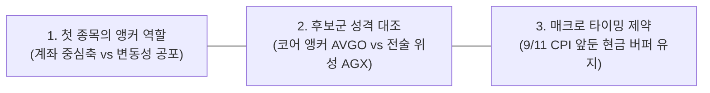
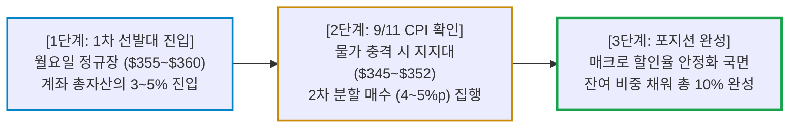

# 현금 100% 빈 계좌 첫 매수 종목 선별 전략

- **작성일**: 2026-09-06
- **데이터 기준**: 2026-09-04(금) 종가 기준 yfinance 시장 데이터

현금 100% 빈 계좌의 첫 종목은 대박을 노리는 자리가 아니라 계좌의 무게중심을 세우는 자리다. 코어 앵커 브로드컴(AVGO)과 전술 위성 아간(AGX)의 성격을 갈라놓고, 9월 11일 CPI라는 뇌관 앞에서 현금을 어떤 순서로 쪼개 넣어야 하는지 단계별로 못 박는다.

## 요약

| 구분 | 핵심 내용 |
| :--- | :--- |
| **상담 질문** | 현재 계좌에 주식이 단 한 주도 없는 현금 100% 상태인데, 월요일 장 시작 시 어떤 종목을 먼저 1차로 매수해야 하는가? |
| **핵심 결론** | 빈 계좌의 첫 종목으로는 계좌를 든든히 지탱할 메가캡 코어 앵커 **브로드컴(AVGO)**이 최우선이다. 전술적 낙폭과대 턴어라운드를 노린다면 순현금 10억 달러를 쌓아둔 **아간(AGX)**이 대안이다. 단, 월요일 시초가 SK하이닉스 갭상승 추격 매수는 엄격히 금지하며, 9월 11일 CPI 전까지 현금 90% 이상을 남겨두는 1차 선발대(계좌의 3~5%) 진입 원칙을 고수해야 한다. |

---

## 1. 투자자 질문

> "월요일되면 주식 하나 사볼까 하는데 현재 계좌에 보유 종목이 하나도 없습니다. 완전한 현금 100% 대기 상태인데 무슨 종목을 먼저 하나 사보는 것이 가장 합리적일까요?"

---

## 2. 질문 분석

주식이 전혀 없는 빈 계좌에서 첫 매수를 집행할 때는 심리적 불안과 시장 변동성이 맞물려 3대 핵심 쟁점이 발생한다.

- **① 첫 종목의 앵커 역할 (포트폴리오 척추 구축)**:
    - 계좌가 텅 빈 상태에서 첫 종목으로 변동성이 극심한 테마주나 부실 잡주를 사면, 시장이 조금만 흔들려도 계좌 전체가 파랗게 질려 투자 심리가 완전히 무너진다.
    - 첫 번째 진입 종목은 계좌 전체의 무게중심을 잡아줄 수 있는 압도적인 현금 창출력과 확고한 안전마진을 갖춘 우량 1등주여야 한다.
- **② 후보군 성격 대조 (코어 빅테크 vs 전술적 낙폭과대)**:
    - AI 인프라의 핵심 축인 커스텀 ASIC·통신 1등 기업(AVGO)으로 안정적 포지션을 열 것인지, 고점 대비 -47.6% 급락한 뒤에도 순현금 10억 달러를 쌓아둔 전력 EPC 강자(AGX)로 알파 수익을 노릴 것인지 목적을 명확히 구분해야 한다.
- **③ 매크로 타이밍 제약 (9월 11일 CPI 및 고유가·금리 리스크)**:
    - WTI 유가 $91 돌파, 미 10년물 국채금리 4.78% 고공행진, 9월 금리 인상 확률 58% 급등 등 매크로 할인율 쇼크가 진행 중이다.
    - 9월 11일 CPI 발표라는 뇌관이 대기하고 있으므로, 월요일에 현금을 한 번에 털어 넣는 올인은 자살행위이며 철저히 1차 선발대(분할 진입)로만 대응해야 한다.

---

## 3. 핵심 답변 및 실행 가이드

### 3.1 질문별 명쾌한 진단

| 질문 쟁점 | 명쾌한 진단 및 핵심 근거 |
| :--- | :--- |
| **Q1. 100% 현금 계좌인데 첫 종목으로 무엇이 최우선인가?** | **브로드컴(AVGO)이 1순위다.** 빈 계좌의 첫 종목은 흔들림 없는 현금흐름 머신이어야 한다. AVGO는 2027F 기준 선행 PER 16.9배로, 같은 기준의 엔비디아(28.5배)·마벨(24.2배) 대비 현저한 저평가 상태다. 여기에 FCF 마진 46%와 FY28 AI 매출 2,300억 달러 로드맵을 확보했다. 전고점(종가 $480.81) 대비 -25.6% 조정으로 단기 과열이 씻겨 나간 $355~$360 구간이 닻(Anchor)을 내릴 자리다. |
| **Q2. 낙폭과대주나 반도체 다른 종목은 어떤가?** | **아간(AGX)은 훌륭한 대안이나 5% 한도 준수가 필수이며, SK하이닉스는 월요일 추격 매수 절대 금지다.** AGX는 고점 대비 -47.6% 반토막인데도 총차입금이 1,091만 달러뿐인 사실상 무차입 구조에 순현금 10억 달러를 쥐고 있어 매력적이다. 다만 전술 바스켓(계좌 대비 최대 5%)으로만 다뤄야 한다. 한편 금요일 뉴욕 ADR이 +8.14% 폭등한 SK하이닉스는 월요일 아침 한국 시장에서 시초가 갭상승 출발이 확실하므로 절대 뇌동 추격하지 마라. |
| **Q3. 월요일에 바로 목돈을 집어넣어야 하나?** | **절대 아니다. 최종 목표 비중(계좌의 10%)의 3분의 1에서 절반, 즉 전체 계좌의 3~5%만 선발대로 넣어라.** 유가 $91과 10년물 국채금리 4.78% 발작 속에서 9월 11일 CPI 발표가 대기 중이다. CPI 결과에 따라 추가 하락이 나오면 저가에 받아낼 실탄, 즉 현금 90% 이상을 반드시 남겨둬야 한다. |

---

### 3.2 1순위 후보군 정밀 비교 매트릭스

2026년 9월 4일(금) 종가와 리서치 데이터를 기준으로 추출한 핵심 후보 비교표다.

| 점검 항목 | 브로드컴 (`AVGO`) | 아간 (`AGX`) | SK하이닉스 (`000660.KS`) |
| :--- | :--- | :--- | :--- |
| **현재가 및 위치** | **$357.90** (전고점 대비 **-25.6%**) | **$417.99** (고점 대비 **-47.6%**) | **1,647,000원** (9/4 한국 종가, 뉴욕 ADR **+8.14%** 급등) |
| **펀더멘털 실체** | 빅테크 커스텀 ASIC 및 Tomahawk 스위치 과점 | AI 데이터센터 기저전력 가스복합화력 EPC 수주 잔고 급증 | HBM 선두 지위 및 D램·낸드 가격 반등 |
| **대차대조표 / FCF** | 잉여현금흐름(FCF) 마진 **46%** | **순현금 10억 달러** (총차입금 1,091만$로 사실상 무차입) | HBM 대규모 CAPEX 회수 및 흑자 폭증 |
| **밸류에이션** | 2027F 선행 PER **16.9배** (저평가) | 선행 PER **26.5배** (반토막 조정으로 과열 해소) | 선행 PER 3.5배 수준 |
| **포트폴리오 역할** | **코어 앵커 (계좌 중심축)** | **전술적 알파 위성 (낙폭과대 Top-Pick)** | 모멘텀 사이클 트레이딩 |
| **계좌 최대 한도** | 전체 계좌의 **10 ~ 15%** | 전체 계좌의 **최대 5.0% 엄수** | **월요일 추격 진입 보류** (갭 소화 후 재판정) |
| **월요일 실행 판정** | **1차 선발대 (3~5%) 매수 최우선** | **전술 바스켓 1차 분할 매수 적합** | **월요일 시초가 추격 매수 절대 금지** |

---

### 3.3 실전 단계별 분할 진입 로드맵

| 단계 | 목표 누적 비중 | 진입 시점 및 가격 조건 | 실전 실행 방침 |
| :---: | :---: | :--- | :--- |
| **1단계** | **3 ~ 5%** | **월요일 현재가 ($355 ~ $360 구간)** | • 빈 계좌를 벗어나기 위한 1차 선발대 진입 • 계좌 몰빵 금지, 갭상승 추격 없이 지정가 분할 체결 |
| **2단계** | **7 ~ 10%** | **9/11 CPI 발표 직후 변동성 구간** | • **하락 시**: 8월 말 이후 반복해서 하방을 지탱한 $350 부근을 중심으로 $345~$352 구간에서 4~5%p 분할 매수 • **상승 시**: 200일선($369) 회복과 $375 안착을 확인한 뒤 눌림목에서 매수 |
| **3단계** | **최종 10%** | **9월 16일 FOMC 통과 후 안정화 국면** | • 매크로 변동성 통과 후 잔여 물량 편입 완료 • 장기 우상향 포지션 구축 및 홀딩 |
| **예비 현금** | **90% 이상** | 9/11 CPI 확인 전까지 | • 금리·유가 발작 때 저가에 받아낼 실탄이자 계좌를 지키는 안전판 • AVGO 10%와 AGX 최대 5%를 모두 채운 뒤에도 현금 85%가 남는 구조 |

---

## 4. 종합 결론 및 실행 원칙

### 4.1 핵심 인사이트

- **① 첫 종목은 포트폴리오의 '닻(Anchor)'이어야 한다**:
    - 계좌에 종목이 전무할 때는 1등 현금흐름 머신으로 중심을 잡아야 한다. 브로드컴(AVGO)은 FY28 AI 매출 2,300억 달러 로드맵을 쥐고 있으면서도 2027F 선행 PER 16.9배에 머물러 있는 가장 단단한 주춧돌이다.
- **② 낙폭과대 1등주(AGX)는 전술 바스켓(최대 5%) 규칙을 엄수해라**:
    - 아간(AGX)은 AI 전력 부족의 실질 수혜주이자 총차입금 1,091만 달러뿐인 순현금 10억 달러 기업이지만, 중소형 EPC 종목에 계좌 전체를 베팅하는 것은 위험 관리 실패다. 전체 계좌 대비 최대 5% 한도를 절대 넘기지 마라.
- **③ 매크로 화약고(9/11 CPI, WTI $91) 앞에서는 분할 매수만이 살길이다**:
    - 금리가 4.78%까지 치솟고 유가가 91달러를 돌파한 환경에서 단 한 번의 주문으로 현금을 털어 넣는 자는 다음 변동성 파도에 쓸려나간다. 월요일에는 반드시 3~5% 내외의 선발대만 띄우고 현금 90% 이상을 틀어쥐고 있어라.

### 4.2 손절 및 위험 관리선

- **브로드컴 (`AVGO`)**:
    - 9월 3일 장중 저점인 **$342**를 종가 기준으로 이탈하지 않는 한 분할 매수 기조를 유지한다.
    - 현재가 $357.90은 200일 이동평균선($369)을 아직 밑돌고 있다. 이 선을 되찾기 전까지는 비중을 늘리는 속도를 의도적으로 늦춘다.
- **아간 (`AGX`)**:
    - 평균 매입 단가 대비 **-20% 종가 이탈**, 또는 3월 저점($398)과 9월 3일 저점($401)이 겹치는 **$398 이중 바닥을 종가로 이탈**할 때 가차 없이 비중을 축소한다.
    - 주가가 200일선($512)을 18% 넘게 밑돌고 있으므로 200일선을 손절 기준으로 삼으면 사자마자 전량 정리해야 하는 자기모순에 빠진다.

!!! tip "최종 핵심 제언 (Executive Takeaway)"
    빈 계좌를 채우는 첫 거래는 대박을 노리는 베팅이 아니라, 계좌를 흔들리지 않게 고정하는 기초 공사다. 갭상승하는 종목을 쫓아가지 말고, $357선에서 바닥을 다지고 있는 브로드컴(AVGO)에 1차 선발대(계좌의 3~5%)를 차분히 올려놓아라. 남은 현금 90% 이상은 9월 11일 CPI 판결 이후의 진짜 승부처를 위해 아껴두어야 한다.
