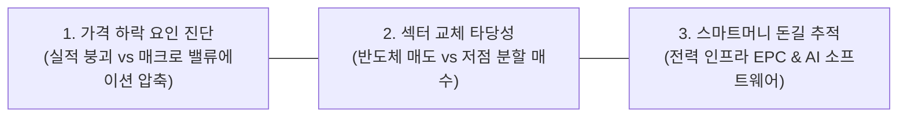
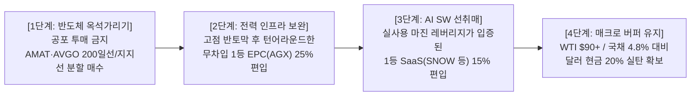

# [투자 타이밍] 반도체 조정 국면 진단과 대안 섹터 포트폴리오 전략

- **작성일**: 2026-09-04

고점 대비 20~40% 조정을 겪고 있는 반도체 섹터의 실질 펀더멘털을 점검하고, 무차별 탈출이 아닌 '반도체 병목 1등주 선별 매집'과 '전력 인프라 EPC·AI 소프트웨어'로의 확산 포트폴리오 전략을 제시합니다.

## 요약

| 구분 | 핵심 내용 |
| :--- | :--- |
| **상담 질문** | 반도체 관련주 고점 대비 대형 조정 발생, 지금 반도체를 피해 다른 섹터로 갈아타는 투자가 더 유망한가? |
| **핵심 결론** | 반도체 섹터 탈출은 하책(下策). 펀더멘털 훼손이 아닌 매크로 할인율 충격에 의한 '밸류에이션 압축'이므로 저평가 반도체(AMAT, AVGO, MU)를 분할 매수하고, 물리적 병목인 전력 인프라 EPC(AGX)와 실적 가시화 소프트웨어(SNOW)로 자본 확산의 길목을 지키는 바벨 전략이 최선 |

---

## 1. 투자자 질문

> "요즘 주식들 보니 전반적으로 반도체 관련주들이 고점을 찍고 많이 내려온 것 같은데 지금 시점에 반도체 보다 다른 섹터 투자가 더 좋아 보이나?"

---

## 2. 질문 분석

투자자의 질문 속에는 주가 급락에 따른 공포와 포트폴리오 리밸런싱에 대한 3대 핵심 쟁점이 담겨 있습니다.

- **① 가격 하락 요인 진단 (버블 붕괴 착시)**:
    - 고점 대비 주가가 -20~40% 하락하자 시장 일각에서 제기되는 'AI 반도체 버블 붕괴론'에 흔들리는 심리입니다.
    - 실제 기업의 실적(이익 성장률)이 깨진 것인지, 거시적 금리·유가 상승에 따른 멀티플 압축인지 명확한 구분이 필요합니다.
- **② 섹터 교체 타당성 (도피성 매매 위험)**:
    - 주가가 내렸다는 이유만으로 전통 방어주나 소비재 등 무관한 섹터로 피신할 경우, 지수 반등 시 심각한 소외 현상(FOMO)을 겪을 수 있습니다.
- **③ 스마트머니 돈길 추적 (자본 확산 경로)**:
    - AI 투자 사이클이 단일 GPU에서 데이터센터 물리적 병목(전력·냉각, 네트워크)과 소프트웨어로 확산되는 경로를 파악해야 합니다.

---

## 3. 핵심 답변 및 실행 가이드

### 3.1 질문별 명쾌한 진단

| 질문 쟁점 | 명쾌한 진단 및 핵심 근거 |
| :--- | :--- |
| **Q1. 반도체 버블이 끝난 것인가?** | **전혀 아닙니다.** 어플라이드 머티어리얼즈(AMAT)는 분기 매출 사상 최대($91.2억, +25%)와 차기 분기 $100억 돌파 가이던스를 제시했고, 브로드컴(AVGO)은 AI 반도체 매출이 +221% 폭증했습니다. 이번 조정은 실적 훼손이 아닌 **[WTI $91 + 미 10년물 금리 4.8% 급등]에 따른 고PER 밸류에이션 압축과 기대치 리셋**입니다. |
| **Q2. 지금 반도체를 팔고 타 섹터로 가야 하나?** | **팔 자리가 아니라 분할 매집할 자리입니다.** 전 공정 1위 AMAT는 선행 PER 23.6배로 장비 빅4 중 최저 밸류에이션이며 200일선($405 부근) 지지력을 테스트 중입니다. 마이크론(MU) 또한 선행 PER 6배 수준으로 안전마진이 확보되었습니다. 공포에 질려 던지는 것은 바닥에서 물량을 넘기는 전형적인 실수입니다. |
| **Q3. 다른 섹터로 넓힌다면 어디가 최선인가?** | 전통 방어주나 소비재가 아니라 **'전력 인프라 EPC'와 'AI 실사용 소프트웨어'**입니다. AI 데이터센터의 절대 병목인 발전소 EPC 1위 아간(AGX)은 고점 대비 -49% 조정 후 어닝 서프라이즈로 시간외 +8% 급등 변곡점을 맞았으며, 스노우플레이크(SNOW)는 사용량 증가가 마진 레버리지로 연결되며 +16.5% 폭등했습니다. |

---

### 3.2 팩트 체크: 지식저장소 데이터로 본 핵심 종목 비교

지식저장소 리서치 보고서가 분석한 주요 섹터별 1등 기업들의 실적과 주가 위치입니다.

| 섹터 구분 | 대표 기업 | 최근 주가 위치 | 핵심 펀더멘털 및 밸류에이션 | 스마트머니 판정 |
| :--- | :--- | :--- | :--- | :---: |
| **반도체 장비** | **어플라이드 머티어리얼즈 (`AMAT`)** | 52주 고점 대비 **-41.1%** 현재가 $435.91 (200일선 +7.7%) | • 분기 매출 +24.9%, Non-GAAP EPS +41.1% • 차기 가이던스 $102.5억(최초 $100억 돌파) • **선행 PER 23.6배 (장비 빅4 최저)** | **적극 분할 매수** (200일선 지지 기반) |
| **맞춤형 칩/네트워크** | **브로드컴 (`AVGO`)** | 전고점 대비 **-23.4%** 조정 구간 ($368 부근) | • AI 반도체 매출 +221% ($16.7B), FCF 마진 46% • FY28 AI 매출 약 $2,300억 로드맵 제시 • **FY27 선행 PER 16.9배 (엔비디아 대비 저평가)** | **실적 후 눌림목 매수** ($345 손절/지지선) |
| **메모리** | **마이크론 (`MU`)** | 단기 고점 대비 숨고르기 | • 빅테크의 완제품 출하를 가로막는 절대 병목 • 장기 LTA 계약으로 최저 마진 보장 • **선행 PER 약 6배 수준** | **상대강도 우수** (구조적 리레이팅) |
| **전력 인프라 EPC** | **아간 (`AGX`)** | 최고가 대비 **-49.1%** 실적 직후 시간외 **+7.9% 급등** | • 매출 +61.5%, EPS $3.76(+41.4% 서프라이즈) • **10억 달러 무차입 순현금 자산 보유** • AI 데이터센터 필수 기저전력(CCGT) 독점 EPC | **전력 인프라 Top-Pick** (고금리 무풍지대) |
| **AI 엔터프라이즈 SW** | **스노우플레이크 (`SNOW`)** | 실적 발표 후 **+16.5% 폭등** | • 매출 15.5억 달러, Non-GAAP EPS $0.62 대폭 상회 • [AI 사용량 증가 ➔ 데이터 증가 ➔ 영업 레버리지] • 소프트웨어 섹터 전반으로 매기 확산 견인 | **AI 2단계 수혜** (눌림목 분할 관심) |

!!! warning "절대 피해야 할 3대 함정 섹터"
    - **단순 내러티브 테마주 (`GPRO` 등)**: 본업 부진 속에 AI 관련 합병 루머 하나로 급등하는 주식은 펀더멘털 실체가 없으므로 엄격히 배제합니다.
    - **도태되는 2등 기업 (`PYPL`, `WDAY`)**: 시장 점유율을 잃고 인수설 루머로 연명하는 기업은 밸류에이션 트랩에 불과합니다.
    - **극단적 고평가주 (`PLTR` 선행 PER 144배)**: 기업은 우수하나 기대치가 극단적으로 선반영된 종목은 어닝 서프라이즈를 내도 주가가 정체되거나 하락 압력을 받습니다.

---

### 3.3 실전 4대 자산 배분 및 실행 로드맵

| 구분 | 목표 비중 | 핵심 편입 종목 | 구체적 실행 지침 |
| :--- | :---: | :--- | :--- |
| **① 핵심 반도체** | **40%** | `AMAT`, `AVGO`, `MU` | • 어플라이드 머티어리얼즈는 200일선($400~$415) 지지 확인하며 30%씩 3단계 분할 진입 • 브로드컴은 $345 지지선을 기준으로 실적 후 기대치 리셋 구간을 활용해 비중 확대 |
| **② 전력 인프라 EPC** | **25%** | `AGX`, `CEG`, `VRT` | • 고점 대비 -49% 과열 해소 후 사상 최대 분기 실적으로 반등 트리거가 작동한 아간(AGX) 편입 • 10억 달러 무차입 현금력을 바탕으로 금리 발작 시 포트폴리오 방파제 역할 수행 |
| **③ 실적 입증 SW** | **15%** | `SNOW`, `CRM`, `CRWD` | • "AI는 돈이 안 된다"는 의구심을 깨고 실사용 매출 및 영업 레버리지를 증명한 1등 플랫폼 선별 매수 • 급등 시 추격하지 말고 눌림목에서 분할 편입 |
| **④ 달러 현금 버퍼** | **20%** | 달러 예수금 / 단기 국채(T-Bills) | • WTI $91 돌파 및 미 10년물 금리 4.8% 상회 등 매크로 인플레이션 변동성에 대비한 안전마진 확보 |

---

## 4. 종합 결론 및 실행 원칙

### 4.1 핵심 인사이트

- **① 지금 시장의 본질은 'AI 붐의 종료'가 아닌 '돈길의 확산'이다**:
    - 엔비디아 단일 GPU에 집중되던 자본이 메모리 병목, 초고속 네트워킹, 전력 인프라, 그리고 실사용 엔터프라이즈 소프트웨어로 넓어지고 있습니다.
- **② 반도체 주가 조정은 실적 둔화가 아닌 거시 할인율(금리·유가) 쇼크다**:
    - 실적이 사상 최대치를 경신하고 있는 핵심 반도체 기업들을 고점 대비 20~40% 싸진 가격에 담을 수 있는 기회입니다.
- **③ 타 섹터로의 확장은 '반도체 대체재'가 아닌 '상호 보완재'여야 한다**:
    - AI 데이터센터를 돌릴 전력이 없어 가스터빈 발전소를 짓는 기업(아간), AI 모델을 실제 기업 워크플로우에 녹여 마진을 뽑아내는 기업(스노우플레이크)을 함께 쥐어야 포트폴리오가 완성됩니다.

---

### 4.2 계좌 실천 원칙 및 위험 관리선

- **3대 계좌 실천 원칙**:
    - **① 2등주 도피 금지**: 가격이 많이 빠졌다고 해서 비즈니스 모델이 훼손된 2등주나 테마주로 갈아타지 않습니다.
    - **② 3단계 분할 매수**: 확신 있는 1등 기업은 일괄 매수가 아니라 반드시 지지선을 확인하는 3단계 분할 매수로 접근합니다.
    - **③ 현금 버퍼 유지**: 거시 지표(고용보고서, CPI, 유가 $100 돌파 여부)가 완전히 안착할 때까지 최소 20%의 현금 쿠션을 유지합니다.
- **종목별 핵심 위험 관리선**:
    - **`AMAT`**: 200일 이동평균선인 **$380.00**을 대량 거래량과 함께 종가 기준 하향 이탈 시 비중 축소.
    - **`AVGO`**: 핵심 기술적 지지선인 **$345.00** 종가 이탈 시 위험 관리.
    - **`AGX`**: 전력 수주 잔고 추이 및 **$380.00** 지지선 사수 여부 모니터링.

!!! tip "최종 요약 제언"
    주가가 고점을 치고 내려올 때 대중은 공포에 질려 엉뚱한 곳으로 도망치지만, 스마트머니는 숫자가 견고한 1등 반도체의 바닥을 줍고 전력과 소프트웨어라는 새로운 병목으로 자본을 분산합니다. 반도체 40%, 전력 인프라 25%, AI 소프트웨어 15%, 현금 20%의 균형 잡힌 바벨 전략으로 시장의 변동성을 수익의 기회로 전환하십시오.
