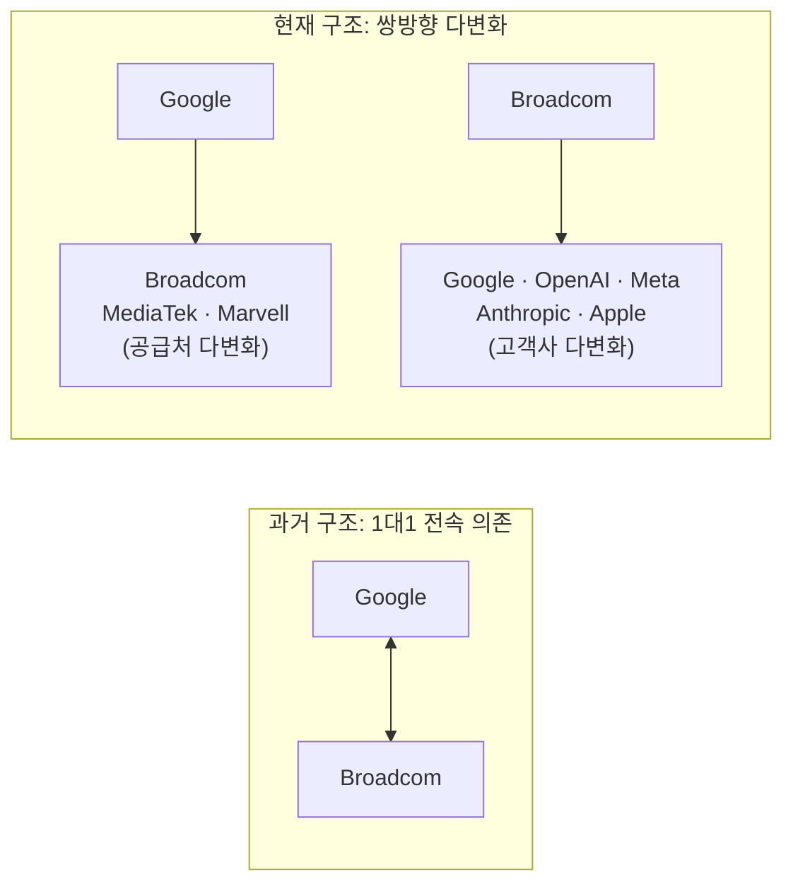
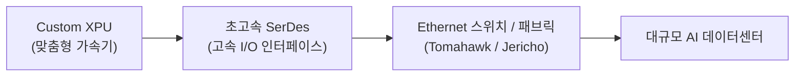

# 브로드컴(Broadcom) 최신 재무 및 가치 분석 보고서

- **작성일**: 2026-08-29

맞춤형 AI 가속기(ASIC)와 초고속 네트워킹 칩의 독점적 경쟁력, 압도적인 잉여현금흐름(FCF)을 보유한 브로드컴(AVGO)의 종합 투자 가치 및 장기 투자 논리 분석 보고서입니다.

## 핵심 요약

| 구분 | 주요 내용 |
| :--- | :--- |
| **종목명 (티커)** | 브로드컴 (Broadcom, `AVGO`) |
| **최종 투자 가치 점수** | **94.7점 / 100점** (`Strong Buy` / 적극 매수 추천) |
| **목표주가 가이드** | **1차 $485.00 (+31.5%)** (FY27 PER 22배 · 전고점 돌파) / **2차 $545.00 (+47.8%)** (FY27 PER 25배 리레이팅) *(최신 종가 $368.79 기준)* |
| **적정 매수 가격대** | **$350 ~ $375** (1차 핵심 지지선 부근 적극 분할 매수) |
| **사이클 위치** | **2단계 상승 국면 후반부** (사상 최고가 달성 후 $350~$390 박스권 건전한 매물 소화 및 바닥 다지기) |
| **핵심 투자 포인트** | • **빅테크 전방위 락인**: 구글(TPU) 외 OpenAI(10GW Jalapeño), Apple(300억$ 온디바이스/RF), Meta(Iris) 수주 • **독보적 수익성 & 밸류**: 조정 영업이익률 67.8%(FY26~27 평균), 연 400억$ FCF, FY27 PER 16.9배 (PEG 0.46) • **공급망 & 금융 완비**: 삼성전자 2,000억$ HBM·파운드리 동맹 및 1,000억$ AI 리스 금융 플랫폼 추진 |
| **핵심 모니터링 리스크** | 2028년 이후 빅테크 AI CAPEX 사이클 둔화 여부, 1,000억$ AI 금융 플랫폼 리스 자산 연체율 |

---

## 1. 쉬운 회사 설명

브로드컴(Broadcom, AVGO)은 현대 디지털 인프라의 핵심 뼈대를 구축하는 글로벌 종합 테크 기업입니다. 사업 영역은 크게 **고성능 반도체 솔루션**과 **인프라 소프트웨어**라는 두 개의 강력한 엔진으로 구성되어 있습니다.

### 1.1 2대 사업 부문 및 매출 비중 변화

단순한 반도체 제조사를 넘어, 하드웨어(맞춤형 칩/네트워킹)와 소프트웨어(VMware 가상화 클라우드)가 결합된 독보적인 비즈니스 모델을 갖추고 있습니다.

| 사업 부문 | 현재 매출 비중 (FY26E) | 주요 제품 및 핵심 역할 | 미래 매출 비중 전망 (FY27~'28) |
| :--- | :---: | :--- | :---: |
| **반도체 솔루션 (Semiconductor)** | **약 75%** | • **AI 가속기(Custom XPU)**: 구글 TPU, 오픈AI Jalapeño, 메타 Iris 등 • **초고속 네트워킹**: Tomahawk/Jericho 스위치, SerDes IP • **무선/스마트폰**: 애플 5G RF 필터, Wi-Fi 7 칩 | **약 82 ~ 85%** (AI 가속기 폭발적 성장으로 비중 확대) |
| **인프라 소프트웨어 (Infrastructure SW)** | **약 25%** | • **VMware Cloud Foundation (VCF)**: 기업용 프라이빗 AI 클라우드 • **엔터프라이즈 보안/메인프레임**: Symantec, CA Technologies | **약 15 ~ 18%** (구독형 ARR 기반 고마진 캐시카우 역할) |

---

### 1.2 앞으로 어디가 가장 유망한가? (3대 핵심 성장 동력)

브로드컴의 사업 포트폴리오 중 향후 가장 폭발적인 성장성과 수익성을 견인할 핵심 유망 분야는 다음과 같습니다.

#### ① 맞춤형 AI 가속기 (Custom XPU) — '가장 폭발적인 성장 엔진'
- **유망 배경**: 엔비디아 GPU의 과도한 가격과 전력 소모를 줄이기 위해 빅테크(구글, 오픈AI, 메타, 애플 등)가 자체 주문형 반도체(ASIC) 도입을 급격히 늘리고 있습니다.
- **성장 전망**: FY25 전체 매출의 약 38%였던 AI 반도체 매출이 FY27에는 전체의 **72% 이상**을 차지하며 브로드컴 외형 성장의 절대적인 주역이 됩니다.

!!! note "💡 왜 맞춤형 AI 가속기(Custom XPU)가 엔비디아 GPU보다 전력을 적게 쓸까?"
    * **불필요한 회로 제거 (Zero Overhead)**: 3D 그래픽, 레이트레이싱 등 범용 연산 회로를 완전히 제거하고 오직 AI 행렬 연산기만 집중 배치하여 대기/누설 전력을 원천 차단합니다.
    * **데이터 이동 최소화 (시스톨릭 어레이)**: 메모리(HBM)를 매번 왕복하지 않고 인접 연산기끼리 데이터를 직접 패스하여 통신 전력을 획기적으로 줄입니다.
    * **워크로드 1:1 맞춤 최적화**: 자사 AI 모델 전용 데이터 포맷과 소프트웨어에 밀착 설계되어 **엔비디아 GPU 대비 전력을 50~70% 절감(데이터센터 TCO 대폭 절감)**합니다.

#### ② 초고속 AI 네트워킹 (Ethernet Switch & SerDes) — 'AI 규모 확장의 필수재'
- **유망 배경**: 수만~수십만 개의 AI 칩을 병목 없이 연결해야 하는 초대형 AI 데이터센터에서는 연산 칩 못지않게 고속 통신(네트워킹) 칩이 성능을 결정합니다.
- **성장 전망**: 800G / 1.6T 차세대 Tomahawk 스위치와 SerDes IP 시장을 사실상 독점하고 있어, AI 가속기 시장 성장의 수혜를 100% 동반 흡수합니다.

!!! note "💡 엔비디아 NVLink가 최고라는데, 왜 브로드컴 이더넷이 필수일까?"
    * **연결 영역의 차이 (Scale-Up vs Scale-Out)**:
        * **NVLink**: 단일 랙 내부(최대 72개 GPU)의 초근거리 연결에 특화되어 있으나, 물리적 한계로 랙 밖으로 확장할 수 없습니다.
        * **브로드컴 Tomahawk 이더넷**: 수천~수십만 대의 서버 랙 전체를 광케이블로 묶어주는 **데이터센터 광역 통신(Scale-Out)의 독점 표준**입니다.
    * **글로벌 빅테크 연합(UEC)의 표준 채택**: 엔비디아의 폐쇄적 인피니밴드 독점에 대항하기 위해 구글·메타·MS·오픈AI 등이 **브로드컴 이더넷을 차세대 AI 표준으로 채택**했습니다.
    * **원천 기술 SerDes(초고속 I/O) 세계 1위**: 반도체 신호 전송의 핵심 엔진인 224G/448G SerDes IP 기술력은 브로드컴이 엔비디아를 1~2세대 앞서 있습니다.

#### ③ VMware VCF 기반 프라이빗 AI 클라우드 — '안정적인 고수익 캐시카우'
- **유망 배경**: 데이터 보안과 규제 이슈로 퍼블릭 클라우드 대신 사내 온프레미스 데이터센터에 자체 AI 환경을 구축하려는 대기업들이 VMware VCF를 필수 도입하고 있습니다.
- **성장 전망**: 기존 일회성 라이선스 판매에서 연간 반복 구독(ARR) 모델로의 전환이 안착하며, 연간 400억 달러 이상의 막대한 잉여현금흐름(FCF)과 67% 이상의 고마진을 뒷받침합니다.

---

## 2. 2026년 연간 주요 뉴스 및 실적 흐름 심층 분석 (1월 ~ 8월)

### 2.1 2026년 분기별 핵심 뉴스 타임라인

| 분기 | 일자 | 주요 헤드라인 및 이벤트 | 영향 | 핵심 요약 및 시사점 |
| :--- | :--- | :--- | :---: | :--- |
| **Q3 (7~8월)** | **08.25** | 알파벳 TPU 벤더 다변화 논쟁 | `🔴 노이즈` | GF 시큐리티스, 미디어텍(Humufish) 및 마블(워런트 계약) 부각 언급하며 브로드컴 점유율 분산 지적 |
| | **08.24** | BMO, No.2 AI 반도체 핵심주 선정 | `🟢 호재` | FY26 3분기 실적(9/2) 앞두고 목표주가 455달러 제시, FY26 AI 매출 연간 +180% 폭증 전망 |
| | **08.21** | 1,000억 달러 AI 금융 플랫폼 구축 추진 | `🟢 호재` | 블랙스톤·아폴로와 대규모 채권 패키지 논의, 앤트로픽에 브로드컴 AI 칩 리스 공급 확대 |
| | **08.21** | JPM, "시장이 브로드컴 기술 격차 과소평가" | `🟢 호재` | 지난 12년간 구글 14종 칩 출시한 18개월 이상 선도 패키징 기술력 및 IP 지배력 강조 |
| | **08.19** | 미 30년물 국채금리 2007년래 최고치 급등 | `🔴 매크로` | 거시적 금리 상승세 및 AI CAPEX 수익화 불확실성으로 대형 IT/반도체 섹터 동반 조정 |
| | **08.15** | VMware vCenter Syslog 취약점 이슈 | `🟡 단기 이슈` | 글로벌 47개국 악용 공격 확인되어 단기 인프라 소프트웨어 부문 노이즈 발생 |
| | **07.27** | 삼성전자와 2,000억 달러 HBM·파운드리 제휴 | `🟢 호재` | 2030년까지 브로드컴 HBM의 90~95%를 삼성전자가 전담 공급하여 메모리 쇼티지 선제 차단 |
| | **07.24** | 구글 TPU 구매 계획 8,110억 달러로 증액 | `🟢 호재` | 바클레이즈, TPU-as-a-Service 모델 확대 및 브로드컴 20GW 이상 양산 계획 확인 |
| | **07.09** | 메타(Meta), 차세대 AI 칩 'Iris' 9월 양산 | `🟢 호재` | 브로드컴 설계 참여 및 TSMC 생산, 연내 7GW → '27년 14GW 컴퓨팅 인프라 확대 |
| | **07.08** | 애플과 300억 달러 규모 ASIC 계약 연장 | `🟢 호재` | 2031년까지 애플 온디바이스/엣지 AI 칩 및 무선 부품 150억 개 이상 공급 확정 (주가 +4.1%) |
| **Q2 (4~6월)** | **06.25** | 오픈AI와 첫 자체 AI 칩 'Jalapeño' 공개 | `🟢 호재` | 추론 특화 10GW 규모 프로젝트의 일환, 엔비디아 블랙웰 대비 우수한 전력 효율 달성 |
| | **06.05** | FY26 2분기 실적 발표 후 단기 급락 (-12.6%) | `🔴 단기 악재` | AI 매출 108억 달러(+143%) 호실적에도 가이던스 미상향 및 구글 다변화 루머로 단기 조정 |
| | **05.28** | 한국 FuriosaAI와 차세대 추론 칩 제휴 확대 | `🟢 호재` | 3세대 가속기 아키텍처(TCP) 및 소프트웨어 스택을 브로드컴 AI 네트워크 솔루션에 통합 |
| | **05.15** | 웰스파고, '플러그형 GW 기반' 가치평가 도입 | `🟢 호재` | AI 반도체 수요를 전력 용량(GW)과 연계하여 FY27/FY28 실적 추정치 22~28% 대폭 상향 |
| | **04.28** | 오픈AI 목표 미달 보도로 AI 인프라주 일시 조정 | `🔴 노이즈` | 빅테크 AI 인프라 지출 지속성에 대한 단기 노이즈로 반도체주 동반 하락 |
| | **04.20** | 마블(MRVL), 구글 MPU 협력 소식에 급등 | `🔴 경쟁 우려` | 구글의 CXL/메모리 프로세서 협력 소식으로 브로드컴 독점 약화 우려 점화 |
| | **04.15** | 메타와 '29년까지 다년간 1GW MTIA 계약 체결 | `🟢 호재` | 메타 자체 AI 칩 설계 파트너십 연장(JPM: 1GW당 120억~150억 달러 매출 기여 추정) |
| | **04.08** | 구글·앤트로픽과 3.5GW TPU 공급 계약 | `🟢 호재` | 앤트로픽에 구글 TPU 기반 3.5GW 컴퓨팅 용량 제공 및 미래 버전 칩 생산 합의 |
| **Q1 (1~3월)** | **03.20** | 오픈AI 자체 칩 Titan 및 삼성 HBM4 조달 | `🟢 호재` | 브로드컴 설계 및 TSMC 파운드리 양산, 삼성전자 HBM4 배타적 공급 합의 |
| | **03.05** | 호크 탄 CEO, "2027년 AI 매출 1,000억$ 돌파" | `🟢 호재` | 6개 고객사 기준 합산 용량 10GW 육박 공식화, FY26 1분기 호실적(AI 매출 YoY +100%) 발표 |
| | **02.27** | 3D 스택 칩 '27년까지 100만 대 판매 전망 | `🟢 호재` | Fujitsu와 3D 스택 칩 엔지니어링 샘플링 및 메타 수십억 달러 TPU 렌탈 거래 확인 |
| | **02.05** | 알파벳, 2026년 CAPEX 1,800억$ 발표 (2배 증액) | `🟢 호재` | 제프리스, 2027년 구글 600만 대 칩 중 85~90%를 브로드컴이 공급할 것으로 전망 |
| | **01.22** | 호크 탄 CEO, "AI 제품 수요 사실상 끝없다" | `🟢 호재` | 18개월치 수주 잔고 730억 달러 공개 후 수주 급증 확인, 네트워킹/XPU 수요 폭증 재확인 |
| | **01.16** | 앤트로픽 210억$ TPU 주문 & ARK 저가 매수 | `🟢 호재` | 웰스파고 매수 추천 및 캐시 우드(ARK)의 테슬라 매도 후 브로드컴 집중 매수 |

---

### 2.2 2026년 뉴스 흐름으로 본 4대 핵심 테마 및 구조적 변화

#### ① 빅테크 커스텀 실리콘의 전면 확대 (Google을 넘어 전방위 확산)
- **OpenAI (Jalapeño & Titan)**: 3월 Titan 메모리(삼성 HBM4) 확보에 이어 6월 추론 특화 10GW 규모의 'Jalapeño'를 공개하며 엔비디아 의존도를 낮추는 탈엔비디아 핵심 파트너로 안착했습니다.
- **Apple (300억 달러 계약)**: 7월 2031년까지 애플 온디바이스/엣지 AI 실리콘 및 무선 부품 150억 개 공급 계약을 체결했습니다.
- **Meta (1GW MTIA & Iris)**: 4월 메타와 '29년까지 1GW 공급 계약 체결에 이어, 7월 차세대 AI 칩 'Iris'의 9월 양산을 공식화하며 '27년 14GW로 인프라를 2배 증설합니다.
- **Anthropic & 스타트업**: 1월 210억 달러 주문에 이어 4월 3.5GW TPU 공급 합의, 5월 한국 FuriosaAI 등 프론티어 AI 기업들과의 포괄적 협력을 확대했습니다.

#### ② 공급망 병목의 선제적 해소: 삼성전자 2,000억 달러 HBM 동맹 및 TSMC 협력
- 3월 오픈AI Titan 물량까지 TSMC 파운드리에 집중되며 첨단 패키징·메모리 병목 우려가 커지자, 7월 **삼성전자와 2030년까지 2,000억 달러 규모의 전략적 제휴(HBM 소요량의 90~95% 공급)**를 체결했습니다.
- 향후 '27~'28년 예상되는 글로벌 메모리/패키징 공급 부족(쇼티지)을 원천 차단하고, 1조 달러 AI 매출 달성을 위한 물리적 인프라를 완비했습니다.

#### ③ 1,000억 달러 규모 AI 금융 플랫폼 조성 (생태계 락인)
- 8월 블랙스톤, 아폴로 등 글로벌 사모펀드와 함께 시니어/주니어 채권(600억~1,000억 달러) 기반의 AI 금융 패키지를 구축 중입니다.
- 앤트로픽 등 자금력이 필요한 AI 기업에 브로드컴 XPU 칩을 구매하여 리스하는 방식으로, 고객사의 초기 CAPEX 부담을 낮추고 자사 칩 수요를 강력하게 묶어둡니다.

#### ④ 구글 TPU 멀티벤더 논쟁과 월가 IB들의 시각 대립
- **신중론 (GF 시큐리티스 등)**: 4월 Marvell 협력 및 8월 MediaTek(Humufish) 채택으로 브로드컴의 TPU 독점 구도 약화 및 단기 출하량 지연 우려 제기.
- **낙관론 (JPMorgan, BMO, 제프리스, 미즈호 등)**: 
    - 지난 12년간 구글과 14개 최첨단 칩을 협력 개발해온 18개월 이상의 패키징·SerDes 기술 격차와 특허 IP는 대체 불가.
    - 구글 전체 파이 자체가 2026년 CAPEX 1,800억 달러, 구매 계획 8,110억 달러로 급증하므로 점유율이 일부 분산되더라도 브로드컴의 절대 매출은 폭발적으로 증가 (FY26 AI 매출 연간 +180% 전망).

!!! note "💡 구글은 브로드컴을 '대체'하려는 걸까, '보조 벤더'를 추가하는 걸까?"
    * **대체가 아닌 '역할 분담 (Tiered Sourcing)'**: 구글의 TPU 발주량이 폭증하여 단일 벤더로 감당하기 어렵고 단가 협상력이 필요하여, **브로드컴(플래그십 TPU v6/v7 및 차세대 3D 스택 칩 전담)** 외에 미디어텍(보급형 추론 칩)과 마블(CXL 메모리 확장)을 보조 벤더로 참여시키는 것입니다.
    * **압도적 점유율 유지 (85~90%)**: 제프리스·JPM 전망에 따르면 2027년 구글 600만 대 TPU 중 **85~90%를 브로드컴이 공급**하며, 전체 파이가 2배 이상 커지므로 브로드컴의 절대 매출은 오히려 연 +80~180% 급증합니다.
    * **대체 불가능한 3대 해자**: ① 12년간 축적된 14종 칩 공동 개발 IP, ② 18개월 이상의 3D 패키징/SerDes 기술 격차, ③ TSMC CoWoS 최우선 캐파 선점.

---

### 2.3 FY26 하반기 실적 관전 포인트 (9월 2일 3분기 실적 발표 심층 분석)

브로드컴은 2026년 9월 2일(현지시간) 장 마감 후 FY26 3분기 실적을 발표합니다. 현재 시장은 **"압도적인 실적 성장세에 대한 기대"**와 **"직전 2분기 급락 사태로 인한 경계감"**이 팽팽히 맞서고 있습니다.

#### ① 직전 2분기(6월) 호실적에도 주가가 -12.6% 급락했던 이유
* **어닝 서프라이즈에도 가이던스 동결**: 2분기 AI 매출이 108억 달러(YoY +143%)로 폭증했으나, 호크 탄 CEO 특유의 보수적인 경영 성향으로 인해 **연간 전체 가이던스를 시장의 높아진 눈높이만큼 대폭 상향하지 않고 기존 수준으로 유지(In-line)**했습니다.
* **구글 TPU 다변화 루머 점화**: 실적 발표 직후 미디어텍·마블의 구글 협력설이 동시에 불거지면서, "가이던스를 안 올린 이유가 구글 점유율 하락 때문이 아니냐"는 시장의 과도한 공포가 겹쳐 하루 만에 주가가 **-12.6% 급락**하는 패닉셀이 발생했습니다.

#### ② 3분기 시장 컨센서스 (Wall Street Consensus)
* **3분기 총매출**: **약 294.3억 달러** (YoY **+84%** 폭증 전망)
* **3분기 조정 EPS**: **$3.24** (전년 대비 +50% 이상 성장)
* **3분기 AI 반도체 매출**: **160억 달러** (분기 사상 최대치 목표)
* **옵션 시장 예상 변동성**: 실적 발표 직후 **±7% ~ 12%** 수준의 주가 급등락 선반영

#### ③ 컨퍼런스 콜 4대 핵심 관전 포인트

| 핵심 체크포인트 | 시장의 기대치 및 질문 | 주가 영향 및 시사점 |
| :--- | :--- | :--- |
| **1. 연간 AI 가이던스 상향** | 기존 2027년 1,000억$ 목표 외에 **올해(FY26) 연간 가이던스를 추가 상향할 것인가?** | **[최대 승부처]** 가이던스 상향 시 전고점 돌파 랠리 촉발, 동결 시 실망 매물 출회 가능성 |
| **2. OpenAI·Meta 양산 타임라인** | **오픈AI(Jalapeño 10GW) 및 메타(Iris)**의 하반기 웨이퍼 투입 및 출하 일정이 확정되었는가? | 구글 점유율 분산 우려를 완전히 불식시키는 가장 강력한 반등 트리거 |
| **3. 매출총이익률(Gross Margin) 방어** | 커스텀 ASIC 비중 확대 속에서도 **총마진(76~77%)이 훼손 없이 유지되는가?** | 고수익성(영업이익률 67%+) 펀더멘털 지속 가능성 확인 |
| **4. 1,000억$ AI 금융 플랫폼** | 블랙스톤·아폴로 연계 채권 리스 패키지의 **공식 계약 체결 및 앤트로픽 수주 규모는?** | 신규 AI 유니콘 고객사 생태계 락인 가시성 확보 |

!!! tip "월가의 실적 시나리오별 주가 전망"
    * **강세 시나리오 (Bull: JPMorgan, BMO, 웰스파고)**: 3분기 호실적 달성 + 연간 AI 가이던스 상향 + OpenAI/Meta 양산 일정 공식 확인 시 ➔ **현재 $368 선에서 1차 저항선($390~$400)을 단숨에 갭상승 돌파하며 $450~$482 전고점 회복 랠리 전개.**
    * **신중/박스권 시나리오 (Neutral)**: 3분기 실적은 부합했으나 보수적으로 4분기 가이던스를 동결할 경우 ➔ **단기적으로 $350~$370 1차 핵심 지지선 구간에서 바닥 다지기 횡보 지속.**

---

## 3. 최근 주가 하락 원인과 구조적 진실

### 구글 TPU 공급망 다변화 우려
최근 브로드컴 주가 조정의 핵심은 AI 성장 둔화가 아니라, **"구글 TPU에서 브로드컴의 독점적 지위가 약화될 수 있다"**는 시장의 우려 때문입니다.

구글은 TPU 생태계에서 공급업체를 점진적으로 다변화하고 있습니다.

- **MediaTek**: 차세대 TPU 개발 참여 확대 가능성
- **Marvell**: 구글과의 대형 파트너십 및 워런트 계약 체결
- **AMD**: TPU v10 일부 영역 참여 가능성 (공식 확인되지 않은 시장 관측 수준)
- **Broadcom**: 기존 핵심 파트너이나 향후 점유율 분산 가능성 대두

시장은 과거의 `Google TPU 성장 = Broadcom 성장` 구조에서 `Google TPU 성장 = Broadcom + MediaTek + Marvell + AMD 분산` 구조로의 전환을 주가에 반영했습니다.

### 구글과 브로드컴의 상호 의존도 분산 (멀티벤더 전략)
구글 입장에서는 인프라 규모가 커질수록 공급망 안정성, 가격 협상력, 공정 선택권 확보를 위해 복수 벤더를 두는 것이 합리적입니다. 이는 브로드컴을 배제하는 것이 아니라 자연스러운 **멀티벤더 전략**입니다.

동시에 **브로드컴 역시 구글 의존도를 빠르게 낮추고 있습니다**:

### 점유율 하락 vs 전체 Custom XPU 파이의 성장
투자 판단에서 가장 중요한 것은 구글 내부 점유율 숫자가 아니라 **브로드컴이 가져가는 전체 AI 매출의 절대 규모**입니다.

> **단순 계산 예시**:
> - 구글 TPU 시장 규모가 100이고 브로드컴 점유율이 100%일 때 ➔ **매출 100**
> - 구글 TPU 시장이 300으로 성장하고 점유율이 70%로 하락할 때 ➔ **매출 210** (2.1배 성장)

여기에 OpenAI, Meta, Anthropic 등의 신규 고객 물량이 더해지면 전체 XPU 매출은 더욱 폭발적으로 증가합니다. 핵심 질문은 *"구글 점유율이 얼마나 줄어드는가?"*가 아니라 **"전체 Custom XPU 시장 성장 속도가 점유율 하락 속도보다 빠른가?"**이며, 현재 지표는 후자가 압도적임을 보여줍니다.

---

## 4. TPU와 커스텀 실리콘(ASIC)의 본질

### TPU와 브로드컴의 실제 역할 분담
TPU(Tensor Processing Unit)는 브로드컴의 자체 브랜드 제품이 아니라 **구글이 직접 아키텍처를 설계하는 AI ASIC**입니다.

| 주체 | 핵심 역할 |
| :--- | :--- |
| **Google** | AI 워크로드 정의, 연산 아키텍처 설계, 컴파일러 및 SW 환경 최적화 |
| **Broadcom** | 구글 아키텍처의 실제 실리콘 구현, Physical Design, SerDes, 고속 I/O, HBM/첨단 패키징 통합, TSMC 양산 브릿지 |
| **TSMC** | 파운드리 첨단 미세공정 위탁 생산 |

따라서 브로드컴은 단순 제조사가 아니라 **"구글 TPU의 핵심 Custom Silicon 설계 및 구현 총괄 파트너"**로 정의하는 것이 정확합니다.

### 모델 전용 칩이 아닌 '워크로드 맞춤형' 칩
TPU는 특정 모델(예: Gemini 4 전용)마다 1:1로 만드는 것이 아닙니다. 구글의 AI 서비스에서 반복적으로 일어나는 **행렬 곱셈(Matrix Multiplication), 텐서 연산, 학습/추론, 메모리 대역폭, 통신 패턴**을 추출하여 해당 연산 효율을 극대화한 **워크로드 맞춤형(Workload-optimized) ASIC**입니다.

### NVIDIA GPU(범용) vs Custom XPU(전용) 비교

| 비교 항목 | NVIDIA GPU (범용 AI 컴퓨팅) | Custom XPU (자체 워크로드 특화 ASIC) |
| :--- | :--- | :--- |
| **핵심 철학** | 모든 AI 모델을 처리할 수 있는 범용성과 CUDA 생태계 | 자사 데이터센터의 특정 반복 워크로드에만 극한으로 최적화 |
| **조달 단가 및 비용 구조** | • **매우 높은 칩 가격** (개당 약 $30,000 ~ $45,000+) • 엔비디아 독점 마진(70~80%) 및 SW 프리미엄 지불 | • **원가 기반 대폭 절감** (동급 연산 기준 30~50% 수준, 1/2~1/3 이하) • 엔비디아 마진 내재화 및 전력·인프라 TCO 절감 |
| **핵심 장점** | • 신속한 모델 개발 및 빠른 배포 • 강력한 SW 호환성 및 개발자 생태계 • 변화하는 최신 알고리즘에 유연한 대응 | • 압도적인 전력 효율 및 대규모 운영비(TCO) 절감 • 대규모 추론 및 고정 연산 성능 극대화 • 단일 벤더(NVIDIA) 종속 탈피 및 마진 내재화 |
| **대표 주자** | NVIDIA (H100, B200 등) | Broadcom 협력 칩 (Google TPU, OpenAI Jalapeño 등) |

!!! note "💡 왜 빅테크는 비싼 엔비디아 GPU 대신 자체 ASIC(Custom XPU)을 채택할까? (가격 및 원가 구조)"
    * **엔비디아 마진 내재화 (Eliminating Nvidia Tax)**: 엔비디아 GPU 가격에는 70~80%에 달하는 초고수익 영업 마진이 포함되어 있습니다. 반면 빅테크의 맞춤형 XPU는 TSMC 파운드리 및 HBM 제조 원가에 브로드컴 설계 수수료(Cost-plus)만 지불하므로 **동급 연산 성능 기준 유효 칩 조달 단가가 1/2 ~ 1/3 수준(30~50%)으로 대폭 낮아집니다.**
    * **실리콘 다이(Die) 면적 최적화 (Zero Overhead)**: 3D 그래픽 및 불필요한 범용 연산 회로를 제거하고 자사 AI 워크로드에 필요한 행렬 연산기만 집중 집적하여 동일 웨이퍼당 생산 수율을 극대화하고 칩 원가를 절감합니다.
    * **데이터센터 총소유비용(TCO) 절감**: 초기 칩 구매가(CAPEX)뿐만 아니라 전력 소모 50~70% 절감을 통해 전기세 및 냉각 설비 등 데이터센터 대규모 운영비용(OPEX)을 획기적으로 낮춥니다.

빅테크의 AI CAPEX가 수백억 달러 단위로 급증할수록 자체 ASIC 도입의 경제성이 기하급수적으로 커지며, 이는 브로드컴의 장기 성장 동력이 됩니다.

---

## 5. 브로드컴의 기술력과 핵심 해자

### 기술력 영역별 객관적 평가

| 분야 | 기술력 수준 | 평가 및 코멘트 |
| :--- | :---: | :--- |
| **AI 모델 / 알고리즘** | 해당 없음 | 소프트웨어 서비스 영역 아님 |
| **AI 가속기 아키텍처** | 매우 높음 | 고객사 아키텍처 실현 최적화 능력 보유 |
| **Custom ASIC 설계 / 구현** | **세계 최상위** | 독보적인 IP 자산 및 설계 레퍼런스 |
| **Physical Design / Packaging** | **세계 최상위** | 2.5D/3D 첨단 패키징 및 HBM 인티그레이션 |
| **SerDes (초고속 인터페이스)** | **세계 최상위** | 업계 최고 속도 SerDes IP 독점 수준 보유 |
| **이더넷 네트워킹 (Ethernet)** | **세계 최상위** | Tomahawk / Jericho 스위치 칩 시장 지배 |
| **AI 소프트웨어 생태계** | 보통 | 범용 생태계는 NVIDIA(CUDA) 대비 열위 |

### 진정한 해자: XPU + 초고속 네트워킹 동시 장악력
대규모 AI 클러스터에서는 가속기 칩(XPU) 단독 성능보다 수만 개의 칩을 병목 없이 묶어주는 **네트워킹 패브릭(Connectivity)**이 성능을 좌우합니다.

브로드컴은 **Custom XPU, SerDes, PCIe, 이더넷 스위치 칩(Tomahawk 등), 광 트랜시버 IP**를 턴키로 통합 공급할 수 있는 전 세계 유일의 기업입니다. 가속기 시장 성장과 네트워크 대역폭 확장의 수혜를 동시에 누립니다.

### OpenAI와의 협력(Jalapeño)이 갖는 의미
OpenAI는 자체 추론용 AI 가속기인 **Jalapeño** 프로젝트의 공동 개발 파트너로 브로드컴을 낙점했습니다.

- OpenAI가 LLM 워크로드 기반 구조를 설계하고 브로드컴이 실제 실리콘 및 시스템으로 구현
- 브로드컴이 "구글 전용 파트너"를 넘어 **"글로벌 탑티어 AI 기업이 자체 칩을 만들 때 반드시 찾아가는 커스텀 실리콘 플랫폼"**으로 진화했음을 입증

---

## 6. 기술적 흐름 (4단계 사이클 및 차트 심층 분석)

### 6.1 스탠 와인스타인 4단계 사이클 위치 진단

브로드컴(AVGO)의 장기 차트는 전형적인 **2단계(상승 국면) 후반부 ~ 3단계(분산/숨고르기) 초입의 건전한 박스권 조정 구간**에 위치해 있습니다.

| 사이클 단계 | 국면 정의 | 브로드컴 현황 및 기술적 특징 |
| :--- | :--- | :--- |
| **1단계: 바닥 다지기 (Accumulation)** | 장기 횡보 및 매집 | 2024~2025년 초 완료 (기저 박스권 돌파) |
| **2단계: 상승 확장 (Advancing/Markup)** | 50·200일선 정배열 및 신고가 랠리 | **현재 위치 (후반부)**: 사상 최고가($481.57) 달성 후 고점 매물 소화 및 1차 핵심 지지선($350~$370) 테스트 진행 중 |
| **3단계: 상투/분산 (Distribution)** | 변동성 확대 및 차익실현 | **미진입**: 6월 실적 직후 -12.6% 급락은 분산이 아닌 2단계 내 중간 베이스 형성 과정 (200일선 우상향 유지) |
| **4단계: 하락 국면 (Declining/Markdown)** | 주요 지지선 붕괴 및 역배열 | **미진입**: 1차 핵심 지지선($350) 및 연초 갭상승 지지대 견고 |

!!! note "💡 주가가 사상 최고가($481.57)까지 크게 올랐는데도 왜 3·4단계가 아닌 '2단계 후반부'일까?"
    * **1단계 탈출 랠리 경과로 '초입'이 아닌 '후반부'**: 2024~2025년 $100~$200대 기저 박스권을 돌파한 1차 시세 분출이 완료되어 변동성과 차익 실현 욕구가 커진 상태이므로 '2단계 초입'은 지났습니다.
    * **3단계(상투)가 아닌 이유 (이동평균선 우상향 정배열)**: 스탠 와인스타인의 핵심 잣대는 '주가 상승폭'이 아니라 **30주선(200일선)의 기울기**입니다. 3단계 상투는 200일선이 수평(Flat)으로 눕고, 4단계는 하향 꺾이지만, 브로드컴은 50·120·200일선이 여전히 **완벽한 우상향 정배열(Golden Cross)**을 유지하고 있습니다.
    * **고점 대비 -23% 조정 후 지지선 방어 (Base Building)**: 최고가 $481.57에서 $368.79까지의 조정은 대형 주도주가 2단계 내에서 흔히 거치는 **'중간 베이스(Intermediate Base)'** 단계이며, 연초 갭상승 지지대이자 1차 핵심 지지선인 **$350~$360 선을 견고하게 수성**하고 있습니다.
    * **거래량 수축 (투매 없는 건전한 손바뀜)**: 6월 급락 이후 7~8월 $350~$370 횡보 구간에서 거래량이 바짝 마르는(Volume Contraction) 패턴을 보여 기관 투매(Distribution)가 아닌 물량 소화가 진행 중입니다.
    * **실적 폭증으로 밸류에이션 부담 해소 (PEG 0.46)**: 주가가 올랐으나 FY26 EPS $16.50(PER 22.4배) → FY27 EPS $21.80(PER 16.9배)로 이익 성장세가 더 가팔라 밸류에이션 부담이 빠르게 낮아지고 있습니다.
    * **리스크 기준**: 만약 실적 발표 전후로 핵심 마지노선인 **$345~$350을 대량 거래량으로 하향 이탈한다면**, 그때는 2단계가 종료되고 **3단계(분산) → 4단계(하락)**로의 전환을 경계해야 합니다.

---

### 6.2 주요 지지선 & 저항선 매물대 분석

  <!-- 상방 저항 카드 -->
  

    

      

        상방 목표 및 저항 구간
        상승 여력 +31%
      

      
$390 ~ $482

      

        
• <b>신고가 돌파 ($481.57+)</b>: 전고점 돌파 시 $500 선을 향한 3차 랠리 촉발 (+30.6%)

        
• <b>2차 주요 저항 ($450~$460)</b>: 6월 급락 직전 기관 매물벽 (+22.0%~+24.7%)

        
• <b>1차 단기 저항 ($390~$400)</b>: 200일선 회복 분기점 (+5.7%~+8.5%)

      

    

  

  <!-- 현재가 중심 카드 -->
  

    

      

        현재가 수렴 및 매수 구간
        적극 매수권
      

      

        $368.79 (적정 밴드 $350~$375)
      

      

        
• <b>사이클 진단</b>: 2단계 후반 -23.4% 고점 매물 소화 완료 (RSI 53)

        
• <b>밸류에이션</b>: FY27 PER 16.9배 (PEG 0.46) 가치 매력 극대화

        
• <b>실행 전략</b>: $350~$375 적극 분할 매수 후 중장기 보유

      

    

  

  <!-- 하방 지지 카드 -->
  

    

      

        하방 지지 및 리스크 방어
        하방 제한적
      

      
$330 ~ $360

      

        
• <b>1차 핵심 지지 ($350~$360)</b>: 연초 갭상승 지지대 (-2.4%~-5.1%)

        
• <b>2차 마지노선 ($330~$340)</b>: 장기 기저 지지선 (-7.8%~-10.5%)

        
• <b>손절/리스크 기준</b>: <b>$345</b> 종가 하향 이탈 시 비중 축소

      

    

  

| 가격대 구분 | 가격 수준 | 기술적 의미 및 트레이딩 전략 |
| :--- | :---: | :--- |
| **신고가 저항선** | **$481.57** | 사상 최고가(종가 기준). 돌파 시 500달러를 향한 3차 랠리 촉발 |
| **2차 주요 저항선** | **$450 ~ $460** | 6월 초 급락 시 발생한 매물벽 및 주요 IB 평균 목표주가 저항 구간 |
| **1차 단기 저항선** | **$390 ~ $400** | 200일선 부근 매물대로, 상향 돌파 안착 시 추세 반등 확인 시그널 |
| **현재가 및 1차 핵심 지지선** | **$350 ~ $370** | 연초 갭상승 지지대. 분할 매수 밴드($350~$375)의 핵심 구간으로 밸류에이션 매력도가 극대화 (종가 $368.79) |
| **2차 마지노 지지선** | **$330 ~ $340** | 장기 기저 지지대. 해당 라인 이탈 시 4단계 하락 전환 경계 |

---

### 6.3 주요 기술적 보조지표 종합 진단

- **이동평균선 배열 (MA)**:
    - 단기 20일선은 6월 급락 후 수렴을 거쳐 상향 전환을 모색 중입니다.
    - 중장기 **50일, 120일, 200일 이동평균선은 완벽한 정배열(Golden Cross)**을 유지하고 있어 대세 상승 추세가 훼손되지 않았습니다.
- **RSI (14일 상대강도지수)**:
    - 4~5월 랠리 당시 78~82 수준의 극단적 과매수(Overbought) 상태에서, 6월 실적 급락 및 8월 국채금리 급등 조정을 거치며 **52~55(중립 영역)으로 과열이 완전히 해소**되었습니다.
- **거래량 프로파일 (Volume Profile)**:
    - 6월 4일 -12.6% 급락 시 대량 거래량이 발생했으나, 이후 7~8월 반등 및 횡보 구간에서는 매도 거래량이 급감하며 **매물 출회가 진정되는 손바뀜(Consolidation)** 패턴을 보이고 있습니다.

---

### 6.4 투자 주체별 포지셔닝 및 실전 매매 시나리오

현재 주가 위치($368.79)와 2단계 후반부 매물 소화 국면을 고려한 투자 성향별 실전 매매 시나리오입니다.

| 전략 구분 | 기준 가격대 | 핵심 진입 논리 및 세부 실행 가이드 | 목표 수익률 및 비중 가이드 |
| :--- | :---: | :--- | :---: |
| **적극적 가치 분할 매수 (중장기 가치 투자자)** | **$350 ~ $375** | • 연초 실적 갭상승 지지대($350) 부근에서 밸류에이션 매력(FY27 PER 16.9배)을 활용한 분할 진입 • 2단계 상승 국면 내 23.4% 건강한 가격 조정 완료에 따른 안전마진 확보 | **1차 $485 (+31.5%) 2차 $545 (+47.8%)** (포트폴리오 비중 70~80% 배치) |
| **추세 추종 돌파 매수 (모멘텀 투자자)** | **$390 ~ $400 돌파 시** | • 9월 2일 3분기 실적 발표 이후 거래량을 수반하며 1차 단기 저항선($390) 및 200일선 상향 안착 확인 시 진입 • 전고점($481.57) 돌파를 향한 3차 랠리 국면 확인 매매 | **목표 $482** (진입가 $390 기준 +23.6%) (돌파 확인 후 20~30% 불타기) |
| **손절 및 리스크 관리 (원칙적 방어 대응)** | **$345 하향 이탈 시** | • 1차 핵심 지지선 및 연초 갭상승 하단($345) 종가 기준 이탈 시 3단계(분산) 전이 경계 • 장기 기저 지지선($330) 지지 여부 확인 시까지 현금 비중 확대 및 관망 | **비중 축소 / 손절 실행** (포트폴리오 리스크 방어) |

---

## 7. 향후 밸류에이션 및 재무 건전성

### 7.1 FY26 ~ FY28 실적 추정치 및 성장 궤적 (컨센서스 종합)

브로드컴은 하이퍼스케일러들의 커스텀 XPU 전환과 초고속 네트워킹 수요 폭증에 힘입어, 글로벌 빅테크 중에서도 가장 높은 가시성의 실적 폭발 구간에 진입해 있습니다.

| 회계연도 (FY) | 연간 총매출 | AI 부문 매출 | 조정 영업이익률 (EBITA) | 조정 EPS | 적용 PER (종가 $368.79 기준) |
| :--- | :---: | :---: | :---: | :---: | :---: |
| **FY25 (실적)** | 약 515억 달러 | 약 195억 달러 | 62.5% | $11.20 | 32.9배 |
| **FY26 (E)** | **약 1,020억 달러** | **약 550억 달러** | **67.5%** | **$16.50** | **22.4배** |
| **FY27 (E)** | **약 1,450억 달러** | **약 1,050억 달러** | **68.2%** | **$21.80** | **16.9배** |
| **FY28 (E)** | **약 1,980억 달러** | **약 1,500억 달러** | **69.0%** | **$28.50** | **12.9배** |

!!! note "실적 궤적의 핵심 포인트 및 데이터 신뢰성 분석"
    * **AI 매출 비중의 극적인 확대**: FY25 전체 매출의 약 38%(195억 달러)였던 AI 반도체 매출이 FY26 550억 달러(**전년 대비 +182%**), FY27 1,050억 달러로 늘어나며 FY27에는 전체 매출의 **72% 이상**을 차지합니다.
    * **데이터 출처 및 산출 근거 (Consensus & Guidance)**:
        * **월가 컨센서스 집계**: FactSet·Bloomberg 기준 글로벌 주요 투자은행(JPMorgan, Jefferies, Wells Fargo, Barclays, BMO 등)의 실적 추정치 중간값(Median)을 종합했습니다.
        * **경영진 공식 가이던스 연동**: 호크 탄 CEO가 공식 발표한 **'2027년 AI 매출 1,000억 달러 돌파 목표'**와 **18개월치 확정 수주 잔고(730억 달러+)**가 베이스라인입니다.
        * **빅테크 확정 수주 파이프라인**: 구글 TPU(2027년 소요량의 85~90% 전담), 오픈AI(10GW Jalapeño), 메타(Iris), 애플(300억 달러 공급) 등 TSMC 파운드리 및 삼성전자 HBM 선점 계약을 기반으로 모델링되었습니다.
    * **기간별 실적 가시성 및 신뢰도 평가**:
        * **FY26 ~ FY27 (신뢰도 매우 높음, 85~90%)**: 커스텀 ASIC은 일반 범용 칩과 달리 고객사의 개발비(NRE) 선투입 및 웨이퍼·패키징 예약 기반으로 생산되어 주문 취소 가능성이 극히 낮으며, 경영진의 보수적인 가이던스 성향(Beat & Raise) 덕분에 실현 가시성이 매우 높습니다.
        * **FY28 (신뢰도 보통, 60~70%)**: FY28 총매출 1,980억 달러는 빅테크의 AI CAPEX 투자 사이클이 2027년 이후에도 지속된다는 전제에 기반하므로, 향후 하이퍼스케일러의 AI 서비스 수익화(ROI) 속도에 따라 변동 가능성이 존재합니다.

---

### 7.2 압도적인 수익성 지표 및 현금 창출력 (FCF Moat)

브로드컴은 첨단 파운드리(TSMC/삼성전자)를 활용하는 **순수 팹리스(Fabless)** 비즈니스 모델로, 막대한 공장 증설 CAPEX 부담 없이 소프트웨어 기업 수준의 고수익성을 구현합니다.

- **매출총이익률 (Gross Margin: 76 ~ 77%)**:
    - 독점적 SerDes/스위치 칩 IP와 맞춤형 설계 마진, 그리고 VMware 인수 후 고마진 구독형 소프트웨어 매출이 결합되어 업계 최상위권의 매출총이익률을 유지하고 있습니다.
- **영업이익률 (Operating Margin: 67 ~ 68%)**:
    - 매출 100달러 중 무려 67달러 이상이 영업이익으로 전환되는 경이로운 비용 통제력과 운영 레버리지를 증명합니다.
- **잉여현금흐름 (FCF: 분기 100억 달러 돌파)**:
    - 2026 회계연도 기준 분기당 약 100억~103억 달러의 FCF를 안정적으로 창출하며, 연간 FCF 규모만 **400억 달러를 상회**합니다.
- **적극적인 주주환원 정책**:
    - 14년 연속 배당 성장을 기록 중이며, 창출된 FCF의 40~50%를 현금 배당 및 **100억 달러 규모의 신규 자사주 매입**으로 주주에게 환원합니다.

---

### 7.3 글로벌 AI 반도체 피어(Peer) 밸류에이션 비교

| 비교 기업 | 티커 | 시가총액 | 2027F PER | 3개년 EPS CAGR | PEG Ratio | 조정 영업이익률 | 핵심 투자 매력도 |
| :--- | :---: | :---: | :---: | :---: | :---: | :---: | :--- |
| **Broadcom** | **AVGO** | **약 1조 7,200억$** | **16.9배** | **+36.5%** | **0.46** | **67.8%** | **독점적 XPU/네트워킹 턴키 해자 + 압도적 FCF + 극도의 저평가** |
| **NVIDIA** | **NVDA** | 약 3조 1,500억$ | 28.5배 | +32.0% | 0.89 | 64.2% | AI 생태계 절대 강자 (CUDA 생태계 및 높은 점유율) |
| **Marvell** | **MRVL** | 약 780억$ | 24.2배 | +28.0% | 0.86 | 36.5% | 구글 CXL/MPU 협력 및 광 네트워킹 수혜 |
| **AMD** | **AMD** | 약 2,550억$ | 23.5배 | +25.0% | 0.94 | 28.4% | 서버 CPU 점유율 확대 및 차세대 GPU 추격 |

!!! note "왜 마벨(MRVL) 등 피어가 브로드컴보다 PER이 더 높을까? (구조적 밸류에이션 왜곡과 리레이팅 기회)"
    * **'순수 AI 실리콘' vs '복합 테크 대기업' (복합기업 디스카운트)**:
        * **마벨**: 상대적으로 작은 시가총액(약 780억$)에 데이터센터 광통신(PAM4 DSP) 및 커스텀 ASIC 중심의 '순수 AI 플레이어'로 인식되어 높은 성장주 프리미엄을 받습니다.
        * **브로드컴**: 초대형 메가캡(약 1.72조$)으로 VMware(인프라 SW), 메인프레임, 스마트폰 무선 칩 등 비AI 레거시 사업(FY26 기준 매출의 약 46%, FY27 약 28%로 축소)이 혼재되어 시장에서 **복합기업 할인(Conglomerate Discount)**을 적용받아 왔습니다.
    * **기저 효과(Low Base)와 턴어라운드 프리미엄**: 마벨은 2024~2025년 통신/스토리지 재고 조정으로 바닥을 친 실적이 급반등하는 턴어라운드 국면이라 일시적으로 PER이 높게 형성됩니다. 반면 브로드컴은 이미 매년 수백억 달러의 견고한 이익을 내는 초대형 베이스라인을 보유하고 있습니다.
    * **VMware 부채 감축에 따른 재무 레버리지 할인**: 2023년 말 690억 달러 규모의 VMware 인수 부채 상환 과정에서 일시적으로 멀티플이 억눌렸으나, 연 400억 달러 이상의 FCF로 순부채/EBITDA 비율이 1.8배에서 2027년 1.2배 미만으로 빠르게 정상화되고 있습니다.
    * **투자 시사점 (멀티플 리레이팅 기회)**: 브로드컴의 AI 반도체 매출 비중이 FY27에 72% 이상으로 확대되고 부채 부담이 완전히 해소되는 시점에 **마벨/엔비디아 수준(22~25배)으로 멀티플 리레이팅(Re-rating)**이 촉발될 가능성이 매우 높으며, 이는 현재 주가가 제공하는 가장 강력한 가격 왜곡이자 안전마진입니다.

### 7.4 FY28 장기 실적(EPS $28.50) 기반 밸류에이션 및 주가 시나리오

2028 회계연도 추정 실적(총매출 약 1,980억 달러, 조정 EPS $28.50)이 현실화될 경우, 현재 주가($368.79) 기준 **선행 PER은 약 12.9배**에 불과하여 극심한 저평가(Deep Value) 국면에 진입합니다.

#### 멀티플(PER) 시나리오별 2028년 예상 주가 분석

| 시나리오 구분 | 적용 PER | 산출 주가 (FY28 EPS $28.50 기준) | 현재가($368.79) 대비 상승 여력 | 시사점 및 전제 조건 |
| :--- | :---: | :---: | :---: | :--- |
| **보수적 멀티플** | **18배** | **$513.00** | **+39.1%** | AI CAPEX 사이클 둔화 우려로 멀티플 확장이 제한될 때 |
| **중립 (시장 평균)** | **22배** | **$627.00** | **+70.0%** | S&P 500 테크 섹터 평균 수준의 적정 멀티플 인정 시 |
| **적극적 (피어 평균)** | **25배** | **$712.50** | **+93.2%** | 빅테크 커스텀 XPU 및 네트워킹 독점력이 온전히 반영될 때 |
| **프리미엄 (엔비디아급)** | **28배** | **$798.00** | **+116.4%** | 맞춤형 가속기 + 초고속 네트워킹 턴키 지배력으로 프리미엄 부여 시 |

!!! note "2028년 예상 실적(FY28 Forward PER 12.9배)이 주가에 온전히 선반영되지 않은 이유 (시장의 할인 요인)"
    * **2028년 AI CAPEX 지속성에 대한 시간적 할인**: 현재 주가의 FY26 PER은 22.4배, FY27 PER은 16.9배입니다. 3년 뒤인 2028년 EPS($28.50) 기준 선행 PER이 12.9배까지 낮아짐에도 불구하고 주가가 이를 즉각 다 선반영하지 않는 것은, 시장이 2028년 빅테크의 AI 투자 지속 여부와 서비스 ROI 회수 속도에 대해 시간적 할인율(Discount Rate)을 적용하고 있기 때문입니다.
    * **경영진의 보수적 가이던스 성향**: 브로드컴은 먼 미래 실적을 주가에 선반영하기보다, 매 분기 실적으로 증명하며 계단식으로 주가를 밀어 올리는(Beat & Raise) 성향이 강합니다.
    * **장기 투자 시사점**: 2028년 실적 가시성을 신뢰하는 장기 투자자에게는 현재 가격대($350~$370)가 매우 높은 안전마진(Safety Margin)과 강력한 비대칭적 업사이드(+40% ~ +90%+)를 제공합니다.

---

### 7.5 재무 건전성 및 VMware 부채 감축 경로 (De-leveraging)

2023년 말 690억 달러 규모의 VMware 인수 이후, 연간 400억 달러 이상의 막대한 잉여현금흐름(FCF)을 바탕으로 부채를 빠르게 상환하며 재무 레버리지가 급속도로 정상화되고 있습니다.

| 재무 건전성 지표 | 2023년 말 (인수 직후) | 2026년 하반기 (현재) | 2027년 ~ 2028년 (전망) | 건전성 평가 및 시사점 |
| :--- | :---: | :---: | :---: | :--- |
| **순부채 / EBITDA 비율** | **약 3.8배** (일시적 급증) | **1.8배** (안정권 진입) | **1.0 ~ 1.2배 이하** | 글로벌 빅테크 평균 수준으로 레버리지 완전 정상화 |
| **연간 잉여현금흐름 (FCF)** | 약 176억 달러 | **약 400억 달러+** | **500억 ~ 600억 달러** | 팹리스 모델 기반 폭발적 현금 창출로 부채 자율 상환 |
| **이자보상배율 (ICR)** | 약 6.5배 | **15.2배** | **22.0배 이상** | 거시적 고금리 환경에서도 이자 지급 완충력 완벽 확보 |
| **신용 등급 (S&P / Moody's)** | `BBB / Baa2` | **`A- / A3` (안정적)** | **`A / A2` (상향 유력)** | 최상위 투자 적격(Investment Grade) 등급 견고히 유지 |

!!! note "과거 부채가 주가를 억눌렀던 배경과 디레버리징(De-leveraging) 성공의 의미"
    * **2022~2024년 주가를 억누른 '부채 디스카운트'의 원인**:
        * **부채 급증과 순부채/EBITDA 3.8배**: 2023년 말 690억 달러 규모의 VMware 인수를 마무리하면서 총부채가 약 750억 달러까지 치솟았습니다.
        * **5%대 고금리 환경의 이자 비용 공포**: 미 연준의 급격한 금리 인상기(기준금리 5.25~5.50%)와 맞물려 "연간 수십억 달러의 이자 비용이 순이익을 갉아먹고 배당 성장이 중단될 수 있다"는 우려로 엔비디아 등 순현금 AI 기업(PER 35~40배) 대비 **PER 15~18배 수준의 극심한 부채 할인**에 갇혀 있었습니다.
    * **초고속 부채 감축(De-leveraging)과 족쇄 해제 과정**:
        * **구조조정 및 VCF 고마진 구독화**: 비핵심 자산(EUC 사업부 등)을 매각해 40억 달러 이상의 현금을 조기 확보하고, 영구 라이선스를 연간 반복 구독(VCF)으로 강제 전환하여 현금 흐름을 극대화했습니다.
        * **연 400억 달러 FCF 기반 자율 상환**: 팹리스 모델의 강점을 살려 분기 100억 달러 규모의 FCF 가운데 배당과 자사주 매입(FCF의 40~50%)을 제외한 잔여 재원을 부채 상환에 집중 투입한 결과, 순부채/EBITDA 비율이 1.8배(2027년 1.0~1.2배)로 급락하며 재무 리스크가 사실상 소멸했습니다.
    * **현재 시점의 투자 시사점 (족쇄에서 주주환원 호재로 전환)**:
        * 부채 상환 부담이 사라지면서 연 400억~500억 달러의 FCF가 **100억 달러 신규 자사주 매입**과 **지속적인 배당금 인상**으로 직결되고 있습니다. 과거 주가를 짓누르던 부채 문제가 이제는 **강력한 주가 하방 경직성과 주주환원 모멘텀**으로 완전히 전환되었습니다.

---

## 8. 기관 수급 및 주요 주주 지분 분석 (13F 스마트머니 심층 진단)

브로드컴(AVGO)의 수급을 분석할 때는 단순 지분율 상위의 **"초대형 패시브 지수 추종 기관"**과 자사 액티브 뷰로 베팅하는 **"스마트머니(테크 전문 헤지펀드·액티브 기관)"**를 엄격히 분리해서 해석해야 합니다.

!!! note "13F 공시 기준 시점 안내"
    현재 공개된 가장 최신 기관 보유 데이터는 **2026년 6월 30일 기준 SEC 13F 공시**입니다. 따라서 2026년 7~8월 중 진행된 실시간 매매 내역은 포함되지 않은 분기 말 스냅샷 기준입니다.

---

### 8.1 상위 8대 기관 지분 현황 (초대형 패시브·인덱스 자금)

브로드컴 주주 명부 상단은 글로벌 초대형 자산운용사들이 차지하고 있습니다.

| 상위 보유 기관명 | AVGO 보유 주식 수 | 발행주식 대비 지분율 | 수급 특성 및 투자 시사점 |
| :--- | :---: | :---: | :--- |
| **BlackRock** | 약 3.98억 주 | 8.37% | S&P 500 및 나스닥 100 ETF/인덱스 기계적 매수 중심 |
| **Vanguard Group** | 약 3.36억 주 | 7.07% | 초대형 인덱스 펀드 및 타깃데이트펀드(TDF) 패시브 자금 |
| **Capital Research & Management** | 약 3.21억 주 | 6.74% | 글로벌 최대 액티브 운용 그룹(Capital Group)의 장기 보유 |
| **State Street** | 약 1.97억 주 | 4.14% | SPY 등 주요 ETF 수탁 및 지수 추종 펀드 |
| **Fidelity (FMR)** | 약 1.27억 주 | 2.67% | 대형 리서치 기반 액티브 펀드 및 연금 자금 혼합 |
| **Geode Capital** | 약 1.16억 주 | 2.45% | 피델리티 인덱스 펀드 위탁 운용 패시브 자금 |
| **T. Rowe Price** | 약 9,068만 주 | 1.91% | 전통 성장주 전문 대형 액티브 자산운용사 |
| **Norges Bank (노르웨이 국부펀드)** | 약 6,597만 주 | 1.39% | 글로벌 최대 국부펀드의 장기 국가 자산 포트폴리오 |

!!! tip "패시브 기관 지분율 해석 시 주의사항"
    BlackRock, Vanguard, State Street 등 상위 4개 기관이 합산 26% 이상의 지분을 보유하고 있으나, 이는 AVGO가 시가총액 1.7조 달러의 초대형 지수 편입 종목이기 때문에 발생하는 **기계적 인덱스 편입 물량**이 상당수입니다. ([Investing.com](https://kr.investing.com/equities/avago-technologies-ownership)) 따라서 상위 기관의 높은 지분율 자체를 '월가의 강력한 강세 확신'으로 단정하는 것은 무리가 있습니다.

---

### 8.2 주목해야 할 스마트머니 & 액티브 기관 매수 동향

단순 지수 추종이 아닌, 펀더멘털과 산업 사이클을 보고 직접 비중을 확대한 전문 투자 기관들의 움직임에서 의미 있는 시그널을 포착할 수 있습니다.

#### ① 필립 라폰트(Philippe Laffont) — 코튜 매니지먼트(Coatue Management, AI 전문 헤지펀드의 대형 베팅)
- **포지션 변동**: 2026년 2분기 중 **550만 주 → 585만 주**로 약 34만 주(+6.2%) 추가 매수.
- **보유 규모**: 6월 말 기준 **약 22억 달러** 규모로, 코튜(Coatue) 전체 미국 주식 포트폴리오의 **약 4.5%**를 차지하는 핵심 대형 포지션 ([Pactolio](https://pactolio.com/13f-portfolios/coatue-management/holdings/AVGO)).
- **투자 시사점**: AI 및 테크 섹터 전문 투자사로 유명한 필립 라폰트(Philippe Laffont)의 코튜가 AVGO 주가 상승 구간에서도 포트폴리오 최상위권 비중으로 추가 베팅을 단행했다는 점은 브로드컴의 AI ASIC/네트워킹 성장 논리에 대한 강한 신뢰를 시사합니다.

#### ② 샌더스 캐피탈(Sanders Capital) — 대규모 신규 진입 (High Conviction New Entry)
- **포지션 변동**: 2026년 2분기 **약 516만 주 (약 19.5억 달러)** 규모로 AVGO를 **신규 매수** ([월스트랭크](https://www.wallstrank.com/portfolios/sanders-capital/stocks/AVGO)).
- **보유 비중**: 전체 포트폴리오의 **약 1.95%**를 단 한 분기 만에 신규 편입.
- **투자 시사점**: 브로드컴 주가가 이미 사상 최고가 부근까지 크게 상승한 상황에서도 20억 달러에 육박하는 대형 신규 포지션을 단번에 구축했습니다.

#### ③ 켄 피셔(Ken Fisher) — 피셔 인베스트먼트(Fisher Investments, 초대형 포지션 유지 및 증액)
- **보유 현황**: 2026년 2분기 기준 **약 1,513만 주 (약 57억 달러)**를 보유 중이며, 분기 중 약 44만 주를 추가 매수 ([월스트랭크](https://www.wallstrank.com/portfolios/fisher-asset-management)).
- **보유 비중**: 전체 포트폴리오 내 비중 **약 1.7%** 수준으로 메가캡 테크주 중 핵심 비중 유지.

#### ④ CPP 인베스트먼트(CPP Investments) — 캐나다 연금(CPPIB)의 지속 매수
- **포지션 변동**: 2분기에 **약 273만 주 추가 매수**하여 총 보유량을 **약 1,302만 주**까지 확대 ([AI Smart Money](https://aismartmoney.app/en/tickers/AVGO)).
- **투자 시사점**: 변동성이 큰 헤지펀드와 달리 장기 안정성을 최우선시하는 글로벌 초대형 연기금이 대규모 지분을 꾸준히 늘리고 있습니다.

---

### 8.3 주요 유명 투자자들의 차익실현 및 비중 축소 (수급 분화)

반면, 2026년 2분기 주가 상승 국면에서 일부 유명 헤지펀드와 큰손들은 적극적인 차익실현 및 포지션 정리에 나섰습니다.

| 투자 기관 / 매니저 | 2026년 Q2 포지션 변동 | 변동 후 잔여 보유 규모 | 주요 특징 및 시사점 |
| :--- | :---: | :---: | :--- |
| **타이거 글로벌(Tiger Global) 체이스 콜먼(Chase Coleman)** | **약 51% 비중 축소** | 약 175만 주 (약 6.63억$) | 지분 절반을 차익실현했으나 6억 달러 이상의 잔여 포지션 유지 |
| **브리지워터(Bridgewater) 레이 달리오(Ray Dalio)** | **약 51.7만 주 축소** | 비중 축소 | 거시 경제 불확실성 대비 포트폴리오 리스크 조절 |
| **시타델(Citadel) 켄 그리핀(Ken Griffin)** | **약 35.6만 주 축소** | 비중 축소 | 멀티스트래티지 펀드의 단기 차익실현 및 헤지 |
| **디이쇼(D.E. Shaw) 데이비드 쇼(David E. Shaw)** | **약 381만 주 축소** | 대폭 축소 | 퀀트/차익거래 모델에 따른 대규모 물량 정리 |
| **D1 캐피탈(D1 Capital) 댄 선드하임(Dan Sundheim)** | **전량 매도 (Full Exit)** | 0주 | 포트폴리오 리밸런싱 과정에서 전량 청산 ([AI Smart Money](https://aismartmoney.app/en/tickers/AVGO)) |
| **듀케인(Duquesne) 스탠리 드러큰밀러(Stanley Druckenmiller)** | **전량 매도 (Full Exit)** | 0주 | AI 랠리 이후 차익실현 및 전량 엑시트 |

!!! warning "월가 큰손 수급에 대한 균형 잡힌 시각"
    *"월가 큰손들이 일제히 브로드컴을 쓸어 담고 있다"*는 식의 일방적인 강세 주장은 사실과 다릅니다. AI 인프라 장기 수혜를 보고 비중을 대폭 늘린 기관(코튜/필립 라폰트, 샌더스 캐피탈, CPP)이 있는 반면, 급등 이후 단기 밸류에이션 부담이나 포트폴리오 재편을 이유로 전량 매도하거나 절반 이상 차익실현한 유명 펀드(타이거 글로벌/체이스 콜먼, D1 캐피탈/댄 선드하임, 듀케인/스탠리 드러큰밀러)도 공존하며 수급이 팽팽히 엇갈리고 있습니다.

---

### 8.4 내부자 및 개인 대주주 지분 구조

브로드컴의 내부자 지분 구조에서는 CEO인 **호크 탄(Hock Tan)**보다 공동창업자인 **헨리 사무엘리(Henry Samueli)** 박사의 지분이 압도적인 비중을 차지합니다.

| 주주명 / 그룹 | 보유 주식 수 (2026.02 SEC 공시 기준) | 발행주식 대비 지분율 | 비고 및 출처 |
| :--- | :---: | :---: | :--- |
| **헨리 사무엘리(Henry Samueli) 공동창업자 & 이사회 의장** | **약 8,556만 주** | **1.80%** | 오리지널 Broadcom Inc. 공동창업자 지분 ([SEC 공시](https://www.sec.gov/Archives/edgar/data/1730168/000119312526085691/d49254ddef14a.htm)) |
| **호크 탄(Hock Tan) CEO & 사장** | **약 90.8만 주** | 0.02% | 직접 보유분 기준 (성과 연동 스톡옵션/RSU 별도) |
| **이사회 및 경영진 전체 (합산)** | **약 8,947만 주** | **1.88%** | 헨리 사무엘리 의장 지분이 경영진 전체 지분의 약 96% 차지 |

- **지분 특성**: 헨리 사무엘리(Henry Samueli) 의장의 지분은 단순한 경영진 보상이 아니라 1991년 브로드컴 설립 당시부터 이어진 창업자 고유 지분으로, 일반 기관의 단기 매매 수급과는 완전히 독립된 장기 고정 지분입니다.

---

### 8.5 기관 수급 종합 판정 및 투자 시사점

현재 브로드컴의 기관 수급 구조는 3가지 층위로 명확히 구분됩니다.

- **① 패시브·초대형 지수 기관 (블랙록 BlackRock / 뱅가드 Vanguard / 스테이트 스트리트 State Street)**:
    - 지분 26% 이상을 받치고 있어 견고한 수급 하방 안전판 역할을 수행하나, 개별 종목 강세론의 근거로 해석해서는 안 됩니다.
- **② 장기 액티브 및 연기금 (캐피탈 그룹 Capital Group / 티로우 프라이스 T. Rowe Price / CPP 인베스트먼트 CPP Investments)**:
    - 캐나다 연금(CPPIB)이 1,300만 주 이상으로 비중을 확대하고 글로벌 롱바이어스 기관들이 안정적인 포지션을 유지하고 있어 펀더멘털 신뢰도가 높습니다.
- **③ 테크 전문 스마트머니의 수급 분화**:
    - **매수 우위**: 코튜 매니지먼트/필립 라폰트(Philippe Laffont, 22억$ 비중 확대, 포트폴리오 4.5%), 샌더스 캐피탈(20억$ 신규 진입), 피셔 인베스트먼트/켄 피셔(Ken Fisher, 57억$)
    - **매도/차익실현**: 타이거 글로벌/체이스 콜먼(Chase Coleman, 51% 축소), D1 캐피탈/댄 선드하임(Dan Sundheim, 전량 매도), 듀케인/스탠리 드러큰밀러(Stanley Druckenmiller, 전량 매도)

!!! tip "기관 수급 최종 판정: 한 문장 요약"
    현재 브로드컴의 수급은 **"기관이 이탈하고 있는 상태"도 아니고, "모든 큰손이 무차별적으로 몰려드는 상태"도 아닙니다.** 
    
    그러나 **AI 인프라 및 커스텀 ASIC 생태계를 가장 깊이 분석하는 필립 라폰트(Philippe Laffont)의 코튜(Coatue)가 포트폴리오 상위 4.5%인 22억 달러까지 비중을 늘렸고, 샌더스 캐피탈(Sanders Capital)이 20억 달러짜리 신규 포지션을 단번에 진입**했다는 점은, 브로드컴의 AI 가속기(TPU/Jalapeño) 및 초고속 네트워킹 장기 지배력에 대한 핵심 스마트머니의 신뢰가 매우 높음을 증명합니다.

---

## 9. 장기투자 핵심 리스크 분석

### 9.1 AI CAPEX 사이클 둔화 (가장 치명적인 리스크)
브로드컴의 장기 성장을 위협하는 가장 본질적인 위험은 구글 내 점유율 하락이 아니라 **빅테크의 AI CAPEX 투자 사이클 종료**입니다.

- 향후 2028~2030년경 AI 서비스의 ROI(투자수익률) 회수가 부진하거나 데이터센터 과잉 투자가 현실화될 경우, 인프라 투자 축소로 인한 실적 둔화가 불가피합니다.

### 9.2 AI 인프라 금융 지원에 따른 잠재 부실 리스크
브로드컴은 고객사의 AI 인프라 도입을 촉진하기 위해 대규모 금융 구조(사모펀드 연계 등)를 지원하고 있습니다. 호황기에는 수요를 견인하지만, AI 사이클이 꺾일 경우 **고객사의 채무 불이행 및 금융 리스크가 브로드컴으로 전이될 수 있는 양날의 검**입니다.

### 9.3 하이퍼스케일러 고객 집중도
구글 단일 의존도는 낮아지고 있으나, 여전히 상위 6개 고객사(하이퍼스케일러 및 프론티어 AI 기업)에 AI 매출이 집중되어 있습니다. 이들 기업의 투자 정책 변화에 따른 분기별 실적 변동성이 발생할 수 있습니다.

---

## 10. 장기투자 필수 모니터링 체크포인트 4대 프레임워크

브로드컴 장기 투자자가 분기별 실적 발표 및 주요 거시 지표 발표 시 반드시 점검해야 할 4가지 핵심 관리 지표입니다.

### 10.1 핵심 모니터링 매트릭스 요약

| 체크포인트 | 핵심 모니터링 대상 | 점검 주기 | 정상 시그널 (Green) | 위험/경고 시그널 (Red) |
| :--- | :--- | :---: | :--- | :--- |
| **① AI CAPEX & 전력 증설** | 빅테크(Alphabet·Meta·MSFT) 분기 CAPEX | 분기별 | 빅테크 합산 CAPEX 전년비 +20% 이상 증가 | CAPEX 가이던스 동결 또는 하향 조정 |
| **② 신규 XPU 고객 다변화** | OpenAI·Apple·Meta 출하 및 매출 비중 | 분기별 | 구글 외 고객 매출 비중 35% 이상 유지 | 신규 칩 양산 지연 또는 수주 취소 |
| **③ AI 네트워킹 동반 수주** | Tomahawk/Jericho 스위치 수주잔고 | 반기별 | 네트워킹 수주잔고 200억 달러 이상 유지 | 인피니밴드 점유율 확대 또는 네트워킹 정체 |
| **④ AI 금융 플랫폼 건전성** | 1,000억 달러 펀드 채권 회수율 & 연체율 | 반기별 | 앤트로픽 등 리스 수수료 정상 회수 | 스타트업 채무 불이행 또는 리스 부실화 |

---

### 10.2 세부 체크포인트 심층 분석

#### ① 빅테크 AI CAPEX 추이 및 데이터센터 전력(GW) 인프라 증설
- **점검 배경**: 브로드컴 AI 매출의 근원은 빅테크(Alphabet, Meta, Apple 등)의 자본지출(CAPEX)입니다.
- **핵심 점검 지표**:
    - 알파벳(구글)의 분기별 10-Q 내 '자본적 지출 계획'(2026년 연간 1,800억 달러) 및 2026년 7월에 공개된 다년 누적 TPU 구매 계획(8,110억 달러 규모).
    - 하이퍼스케일러 데이터센터 전력 확보 규모 (웰스파고 프레임워크: 1GW당 약 120억~150억 달러 매출 기여).
- **의사결정 트리거**:
    - `비중 확대`: 빅테크 3사의 AI CAPEX 가이던스가 연속 상향될 때.
    - `비중 축소`: AI 서비스 ROI 부진으로 빅테크의 데이터센터 완공 일정이 6개월 이상 지연될 때.

#### ② 신규 XPU 고객사(OpenAI·Apple·Meta) 양산 타임라인 및 고객 다변화 속도
- **점검 배경**: 구글 TPU 생태계 내 경쟁사(MediaTek, Marvell) 진입에 따른 점유율 분산 우려를 신규 고객사 매출로 완벽히 상쇄하는지 확인해야 합니다.
- **핵심 점검 지표**:
    - **OpenAI (Jalapeño)**: 2026년 하반기~2027년 초 실제 웨이퍼 투입 및 10GW 프로젝트 순차 배치 진행 여부.
    - **Meta (Iris)**: 2026년 9월 양산 개시 및 '27년 14GW 증설 계획 달성률.
    - **Apple**: 2031년까지 300억 달러(150억 개 칩) 계약에 따른 온디바이스 AI 칩 분기별 납품 시작 여부.
- **의사결정 트리거**:
    - `비중 확대`: 구글 외 5개 고객사(OpenAI, Meta, Apple, Anthropic, FuriosaAI)의 매출 기여도가 전체 AI 부문의 40%를 초과할 때.
    - `경고 신호`: 커스텀 칩 아키텍처 리디자인(Redesign)으로 인한 양산 일정 연기 발생 시.

#### ③ 초고속 AI 네트워킹(Tomahawk/Jericho/SerDes) 패브릭의 동반 성장성
- **점검 배경**: 브로드컴의 진정한 해자는 가속기 단독 공급이 아니라, 수만 개 가속기를 묶는 초고속 스위치 칩 독점력에 있습니다.
- **핵심 점검 지표**:
    - 800G / 1.6T Tomahawk 5 및 차세대 Tomahawk 6 이더넷 스위치 칩 출하량.
    - AI 네트워킹 부문 수주 잔고(Backlog: 200억 달러 기준)의 분기별 증가율.
- **의사결정 트리거**:
    - `비중 확대`: AI 클러스터 내 'Ultra Ethernet' 표준 채택 가속화 및 네트워킹 매출 성장률이 XPU 성장률을 동반 견인할 때.
    - `위험 신호`: 엔비디아의 차세대 Spectrum-X 이더넷 스위치 시장 잠식률 급증 시.

#### ④ 1,000억 달러 AI 금융 플랫폼 건전성 및 리스 채권 회수율
- **점검 배경**: 블랙스톤·아폴로와 조성한 AI 금융 플랫폼은 칩 수요를 강제 락인하지만, AI 유니콘들의 재무 건전성에 연동되는 양날의 검입니다.
- **핵심 점검 지표**:
    - 앤트로픽 등 리스 수혜 고객사의 연간 반복 매출(ARR) 성장률 및 후속 펀딩 성공 여부.
    - 브로드컴의 대손충당금(Bad Debt Allowance) 설정 추이 및 사모펀드 시니어 채권 회수 현황.
- **의사결정 트리거**:
    - `정상 운용`: 리스 자산 회수율 98% 이상 유지 및 고객사의 추가 XPU 주문 발생.
    - `리스크 관리`: 주요 AI 스타트업 파산 또는 리스 대금 연체율 3% 초과 발생 시.

---

## 11. 종합 평가 및 최종 투자 가치 점수

### 11.1 6대 핵심 투자 지표 다차원 평가 매트릭스

본 보고서에서 분석한 기술력, 2026년 실적 흐름, 밸류에이션, 차트 사이클 및 리스크 요인을 종합한 정량·정성 평가 매트릭스입니다.

| 평가 영역 | 가중치 | 평점 (100점 만점) | 등급 | 핵심 평가 요약 |
| :--- | :---: | :---: | :---: | :--- |
| **① 독점적 기술 해자** | 25% | **98점** | `S` | SerDes IP 독점, 2.5D/3D 첨단 패키징, Tomahawk 네트워킹 턴키 지배력 |
| **② 중장기 실적 성장성** | 25% | **96점** | `S` | FY26 AI 매출 +182% 폭증 및 6개 고객사 합산 용량 20GW 이상 확보 (FY27 AI 1,000억$ 돌파) |
| **③ 재무 건전성 및 FCF** | 20% | **95점** | `A+` | FY26~27 평균 67.8% 영업이익률, 연간 400억$ 이상 FCF 창출, 순부채 비율 급속 안정화 |
| **④ 밸류에이션 매력도** | 15% | **94점** | `A+` | FY27 Forward PER 16.9배, PEG 0.46으로 글로벌 피어 대비 극도의 저평가 매력 |
| **⑤ 기술적 매매 타이밍** | 10% | **90점** | `A` | 2단계 상승 후반부 1차 핵심 지지선($350~$370) 매물 소화 및 바닥 다지기 |
| **⑥ 리스크 관리 가능성** | 5% | **82점** | `B+` | 하이퍼스케일러 집중도 및 2028년 CAPEX 사이클 둔화 시점 지속 모니터링 필요 |
| **종합 가중치 환산 점수** | **100%** | **94.7점** | **Strong Buy** | **AI 하드웨어 섹터 내 최우선 핵심 편입 종목** |

---

### 11.2 핵심 투자 포인트 3대 요약 (Why Broadcom Now?)

- **① 탈(脫)엔비디아 커스텀 실리콘 생태계의 절대 강자**:
    - 구글(다년 누적 TPU 구매 계획 8,110억 달러)을 넘어 OpenAI(Jalapeño 10GW), 애플(300억 달러), 메타(Iris) 등 글로벌 빅테크 전방위 락인 완료.
- **② 업계 최상위 수익성과 현금 창출력 (FCF Moat)**:
    - 팹리스 구조 기반 68% 영업이익률 및 연 400억 달러 잉여현금흐름 창출, 14년 연속 배당 성장 및 100억 달러 자사주 매입.
- **③ 공급망부터 금융 플랫폼까지 아우르는 턴키 인프라**:
    - 삼성전자와의 2,000억 달러 HBM 동맹(메모리 쇼티지 선제 차단) 및 1,000억 달러 AI 리스 금융 플랫폼 구축.

---

### 11.3 장기 리스크 대응 및 포트폴리오 전략

- **구글 점유율 분산 우려의 본질**:
    - MediaTek, Marvell의 진입은 구글의 공급망 다변화 정책에 따른 자연스러운 현상이나, 구글의 전체 CAPEX 파이가 2배 이상 급증하고 18개월 이상의 패키징 기술 격차로 인해 브로드컴의 절대 매출액과 이익은 가파른 성장을 지속합니다.
- **포트폴리오 바벨(Barbell) 전략 권장**:
    - 범용 AI 시장을 장악한 **NVIDIA(NVDA)**와 자체 워크로드 전용 칩 및 초고속 네트워킹을 장악한 **Broadcom(AVGO)**을 1:1 또는 6:4 비중으로 동시 보유하여 AI 인프라 확장의 모든 수혜를 균형 있게 흡수하는 전략을 추천합니다.

---

### 11.4 최종 투자 결론 및 목표주가 가이드

!!! tip "최종 투자 의견: 적극 매수(Strong Buy) / 최종 가치 점수 94.7점 / 1차 목표주가 $485.00"
    브로드컴은 빅테크가 자체 AI 데이터센터를 구축할 때 맞춤형 가속기(Custom XPU)와 이를 병목 없이 묶어주는 초고속 이더넷 패브릭을 한 번에 공급할 수 있는 사실상 유일한 사업자입니다. 이 구조는 개별 칩의 성능 경쟁이 아니라 데이터센터 전체의 총소유비용(TCO)을 좌우하기 때문에, 고객사가 벤더를 교체하려면 칩과 네트워크를 동시에 재설계해야 하는 높은 전환 비용이 발생합니다.

    2026년 6월 실적 발표 이후 이어진 주가 조정은 실적 훼손에서 비롯된 것이 아니라, 구글 공급망 다변화 우려와 8월 미 국채금리 급등이라는 외부 요인이 겹친 결과입니다. 그 사이 이익 추정치는 오히려 상향되어 FY27 기준 PER 16.9배, PEG 0.46이라는 가격이 형성되었습니다. 현재 구간은 위험 대비 기대 수익의 비대칭성이 뚜렷한 중장기 분할 매수 구간으로 판단합니다.

#### 가격 구간별 실행 가이드

| 구분 | 가격 수준 | 종가 $368.79 대비 | 산출 근거 및 실행 방침 |
| :--- | :---: | :---: | :--- |
| **1차 분할 매수 밴드** | **$350 ~ $375** | **-5.1% ~ +1.7%** | 연초 갭상승 지지대이자 1차 핵심 지지선입니다. 포트폴리오 목표 비중의 70~80%를 3~4회에 나누어 배분합니다. |
| **추가 매수 밴드 (돌파 확인형)** | **$390 ~ $400 안착 시** | **+5.7% ~ +8.5%** | 200일선 회복을 거래량과 함께 확인한 뒤 잔여 20~30%를 집행합니다. 확인 매매이므로 밴드 하단 진입보다 단가는 높아집니다. |
| **1차 목표주가 (6~9개월)** | **$485.00** | **+31.5%** | FY27 조정 EPS $21.80에 피어 리레이팅 밴드 하단인 PER 22배를 적용하면 $480이며, 여기에 전고점($481.57) 돌파 확인 프리미엄을 반영한 수준입니다. |
| **2차 목표주가 (12개월)** | **$545.00** | **+47.8%** | 동일한 FY27 EPS $21.80에 리레이팅 밴드 상단인 PER 25배를 적용한 값입니다. 마벨(24.2배)·AMD(23.5배) 수준의 멀티플을 인정받는 국면을 전제합니다. |
| **장기 참고 가치 (FY28 기준)** | **$627.00** | **+70.0%** | FY28 조정 EPS $28.50에 중립 멀티플 22배를 적용한 값입니다. 목표주가가 아니라 2028년 실적 가시성이 확보될 경우의 장기 가치 기준선입니다. |
| **손절 및 위험 관리선** | **$345.00 종가 이탈** | **-6.4%** | 1차 핵심 지지선을 대량 거래량과 함께 종가로 이탈하면 2단계 상승 국면의 종료로 간주하고 비중을 축소합니다. |

!!! note "목표주가와 월가 컨센서스의 관계"
    본 보고서의 1차 목표주가 $485.00과 2차 목표주가 $545.00은 월가 주요 투자은행의 평균 목표주가 구간($450~$460)을 상회하는 자체 산출치입니다. 두 값의 차이는 실적 전망이 아니라 **멀티플 리레이팅 폭에 대한 견해 차이**에서 발생합니다. 본 보고서는 AI 매출 비중이 FY27에 72% 이상으로 확대되고 순부채/EBITDA 비율이 1.2배 미만으로 낮아지는 시점에, 그동안 적용되던 복합기업 할인이 해소되면서 멀티플이 22~25배로 정상화된다고 전제했습니다. 이 전제가 지연되면 목표주가 도달 시점도 함께 지연됩니다.

#### 목표주가 상향과 하향을 가르는 검증 조건

- **상향 조정 조건 (2차 목표주가 $545 조기 도달 가능)**:
    - 2026년 9월 2일 FY26 3분기 실적 발표에서 연간 AI 매출 가이던스가 추가 상향될 경우
    - 오픈AI(Jalapeño 10GW)와 메타(Iris)의 웨이퍼 투입 및 양산 일정이 공식 확정될 경우
    - 조정 총마진이 76~77% 수준에서 훼손 없이 방어되면서 FY27 EPS 추정치가 $23 이상으로 상향될 경우
- **하향 조정 조건 (투자 의견 재검토 필요)**:
    - 알파벳·메타·마이크로소프트의 AI CAPEX 가이던스가 동결되거나 하향될 경우
    - 1,000억 달러 AI 금융 플랫폼의 리스 대금 연체율이 3%를 초과할 경우
    - 주가가 $345를 대량 거래량과 함께 종가로 이탈하여 3단계 분산 국면으로 전환될 경우

!!! warning "투자 판단 시 반드시 함께 고려할 전제"
    본 보고서의 목표주가는 FY27 조정 EPS $21.80이 실현된다는 전제 위에 성립합니다. 이 추정치는 커스텀 ASIC 특유의 개발비(NRE) 선투입 구조와 18개월치 확정 수주 잔고에 근거하여 85~90% 수준의 높은 가시성을 확보하고 있으나, FY28 이후 실적은 빅테크의 AI 서비스 투자수익률(ROI) 회수 속도에 따라 변동 가능성이 존재합니다. 또한 실적 발표 직후에는 옵션 시장이 ±7~12%의 변동성을 선반영하고 있으므로, 단일 시점에 일괄 매수하기보다 분할 접근으로 평균 단가와 심리적 부담을 함께 관리하는 편이 안전합니다.

    본 문서는 공개된 자료와 시장 컨센서스를 정리한 분석 자료이며, 특정 종목의 매매를 권유하는 투자 자문이 아닙니다. 최종 투자 판단과 그에 따른 결과의 책임은 투자자 본인에게 있습니다.

