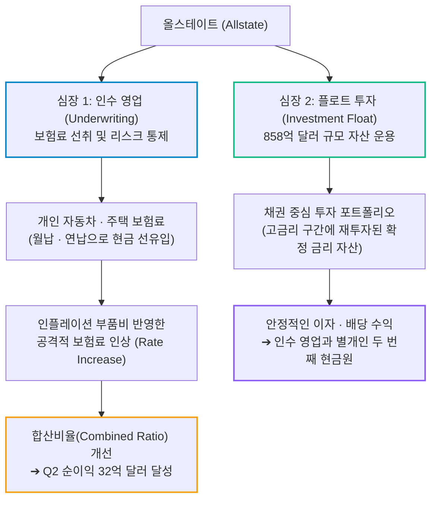
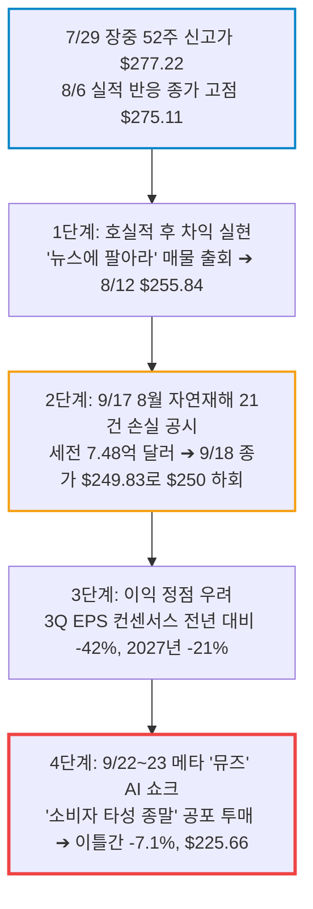
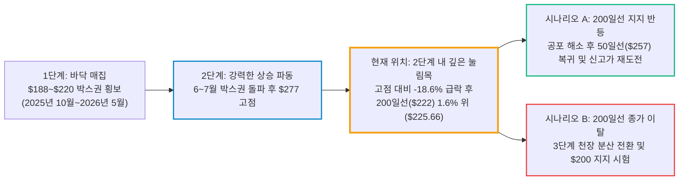

# 올스테이트(Allstate / ALL) 실전 재무 및 가치 분석 보고서

- **작성일**: 2026-09-24
- **데이터 기준**: 2026년 2분기 실적(2026-06-30 마감, 2026-08-05 발표), 2026-09-17 8월 자연재해 손실 공시, 2026-09-21 CNBC 보도 BofA 잉여현금흐름(FCF) 전략 리포트, 2026-09-22~23 메타 뮤즈(Muse) 매도, yfinance 시장 데이터 (2026-09-23 미국장 마감 기준)

대중이 메타의 AI 에이전트 한 방에 겁을 집어먹고 보험업의 종말을 떠들며 물량을 던질 때, 올스테이트는 분기 순이익 32억 달러를 찍고 40억 달러 자사주 프로그램을 돌리며 200일선 바로 위에서 버티고 있다. AI가 아무리 똑똑해져도 자연재해 손해를 대신 물어주지 못하며, 보험사의 거대한 현금 플로트(Float) 빨대는 앱 하나 나왔다고 멈추지 않는다.

## 핵심 요약

| 구분 | 핵심 요약 |
| :--- | :--- |
| **종목 및 주가** | 올스테이트 (NYSE: `ALL`) / **$225.66** (52주 범위 $188.08 ~ $277.22) |
| **최종 투자의견** | **매수 대기 (Wait for Setup)** / 펀더멘털·밸류에이션은 매수 등급이나 거래량 동반 하락이 진행 중이다. 200일선($222) 위에서 거래량 감소와 반등 종가가 확인되면 선발대 투입 (투자 가치 점수 **85.0점**, 6.1절) |
| **비즈니스 본질** | 미국 50개 주 규제 인허가로 둘러싼 개인 손해보험 과점 인프라 및 고객이 먼저 낸 보험료 플로트(Float) 858억 달러를 굴리는 캐시카우 |
| **핵심 매력 (Bull)** | Q2 매출 $18.34B(YoY +10.8%), 조정 EPS $8.99(+48% 어닝 서프라이즈), **BofA 고FCF 배당주 목록 중 FCF 수익률 최고(18%)**, 선행 PER **8.1배**, ROE **46.1%**, 40억 달러 자사주 프로그램(6월 말 잔여 26억 달러) |
| **핵심 리스크 (Bear)** | 8월 21건 자연재해 손실($748M 세전), 2027년 EPS 컨센서스 **-21%**(마진 정점 우려), 허리케인 시즌 변동성, 메타 ‘뮤즈(Muse)’ AI 비교 확산에 따른 심리적 오버행 |
| **8~9월 급락의 성격** | 실적 이후 차익실현 + 9/17 재해 손실 공시 + 9/22~23 메타 AI 발작이 겹친 급락. 가입자 이탈은 아직 데이터로 확인되지 않았다 (ALL -18.0% vs 피어 -5~7%, 2.3절) |
| **포트폴리오 성격** | 시장 연동성이 낮은 **초저베타(0.15) 복리 수비수** / **단기 테마 급등이나 인생 역전 투기꾼은 매수 금지** |

---

## 1. 비즈니스 실체: 대중이 모르는 보험의 '진짜 돈 버는 기계'와 플로트(Float)의 독점 빨대

올스테이트(The Allstate Corporation)를 'TV에서 유머 광고나 때리는 흔한 자동차 보험사' 따위로 이해하는 자는 주식시장에서 돈을 벌 자격이 없다. 이 기업의 본질은 **매달 수천만 명의 주머니에서 현금을 먼저 빨아들여 거대한 자본을 굴리는 합법적 금융 요새**다.

보험 비즈니스는 두 개의 강력한 심장으로 굴러간다.

### 1.1 돈 버는 구조: 거대한 무이자 자금 '플로트(Float)'의 위력

- **① 고객이 돈을 먼저 내는 비즈니스**: 제조업체는 물건을 만들고 팔아 수개월 뒤에 어음을 받지만, 올스테이트는 고객이 사고도 안 났는데 매달 보험료를 현금으로 받는다. 고객이 사고를 내서 보험금을 청구하기 전까지, 회사는 이 돈(약 858억 달러의 투자 자산)을 굴려 금융 수익을 챙긴다.
- **② 인플레이션 전가력(Pricing Power)**: 2022~2023년 차량 부품값과 인건비가 폭등하자 손해율이 치솟아 분기 적자까지 냈지만, 올스테이트는 각 주 규제 당국을 설득해 두 자릿수 보험료 인상을 관철시켰다. 물가가 오르면 보험료를 더 세게 올려서 마진을 복원하는 전형적인 '가격 결정권자'다.
- **③ 텔레매틱스(Telematics)와 AI를 통한 리스크 선별**: 올스테이트 산하의 아리티(Arity) 데이터 플랫폼과 드라이브와이즈(Drivewise)는 수십억 마일의 실제 운전 데이터를 추적한다. 얌전하게 운전하는 놈에겐 보험료를 깎아줘서 붙잡고, 험하게 모는 놈에겐 보험료를 폭탄처럼 때려 위험을 털어낸다.

### 1.2 왜 후발주자나 빅테크가 이 요새를 함락시키지 못하는가?

대중과 실리콘밸리 몽상가들은 "AI가 보험 시장을 파괴할 것"이라고 쉽게 지껄인다. 그러나 보험업의 진짜 진입장벽은 소프트웨어 코드가 아니라 **미국 50개 주별로 얽힌 거미줄 같은 규제 인허가와 수십조 원의 법정 지급여력 자본금(Solvency Capital)이다.**

- **미국 50개 주별 라이선스 장벽**: 전국 단위로 보험을 팔려면 각 주(State) 보험청의 까다로운 요율 승인과 준비금 감사를 통과해야 한다. 스타트업 인슈어테크(레모네이드 등)가 수년째 적자 수렁에서 헤어 나오지 못하는 이유가 바로 이 규제와 언더라이팅 데이터의 부재 때문이다.
- **자연재해를 버티는 자본 완충력**: 올스테이트는 337억 달러에 달하는 주주 자본(2026년 6월 말)과 재보험 파이프라인을 갖추고 있다. 8월 한 달 세전 7억 4,800만 달러의 재해 손실을 맞고도 40억 달러 자사주 프로그램을 굴릴 수 있는 체급은 소수의 과점 공룡들만 누리는 특권이다.

---

## 2. 최근 실적과 시장의 오독: 대중의 착시 vs 숫자의 팩트

### 2.1 2026년 2분기 확정 실적 대차대조

2026년 8월 5일 장 마감 후 발표된 2분기 실적은 올스테이트의 이익 회복력이 시장의 예상을 얼마나 무참하게 짓밟았는지 증명한다.

| 재무 지표 | Q2 2025 | Q1 2026 | Q2 2026 | 전년 동기 대비(YoY) | 판정 및 분석 |
| :--- | ---: | ---: | ---: | ---: | :--- |
| **총매출(Revenue)** | $16.55B | $16.75B | **$18.34B** | **+10.82%** | 보험료 인상 누적 효과 반영 |
| **GAAP 순이익(보통주 귀속)** | $2.08B | $2.43B | **$3.24B** | **+55.89%** | 자동차 및 주택 보험 합산비율 정상화로 이익 급증 |
| **GAAP 희석 EPS** | $7.76 | $9.25 | **$12.51** | **+61.21%** | 자사주 매입으로 주식 수가 줄어 순이익보다 더 크게 증가 |
| **조정(Adjusted) EPS** | — | $10.65 | **$8.99** | — | **월가 컨센서스($6.07)를 48.03% 상회한 메가 서프라이즈** |
| **영업활동 현금흐름** | $1.87B | $3.56B | **$2.63B** | **+40.63%** | 분기 26억 달러의 현금이 금고로 들어오는 창출력 |
| **투자 자산 총액** | $75.67B | $83.14B | **$85.81B** | **+13.40%** | 고금리 환경에서 재투자된 채권 포트폴리오 확대 |
| **자사주 매입 집행액** | $0.34B | $0.61B | **$1.05B** | **+209%** | 40억 달러 프로그램 가동 후 분기 집행액 3배로 증가 |
| **기말 보통주 수** | 263.8M | 257.8M | **254.0M** | **-3.70%** | 1년 새 유통 주식 약 980만 주 소각 |

출처: yfinance 분기 재무제표 및 실적 이력. 전년 동기 조정 EPS는 yfinance에서 제공되지 않아 비워 둔다.

40억 달러 자사주 매입 프로그램은 2026년 2월 4일 이사회가 승인했으며, 기한은 2028년 2월 29일이다. 2026년 6월 30일 기준 잔여 한도는 26억 달러로, 현재 시가총액($57.06B)의 약 4.6%에 해당한다(회사 2026년 2분기 10-Q).

### 2.2 기관 스마트머니(BofA)의 진단: AI 빅테크의 FCF 적자 vs 올스테이트의 18% FCF 수익률

대중이 화려한 AI 테크주에 취해 있을 때, 월가 대형 기관의 시선은 정반대의 현실을 주시하고 있다. 2026년 9월 21일 CNBC가 보도한 뱅크오브아메리카(BofA) 제러드 우더드(Jared Woodard) 전략가의 리포트는 시장의 맹점을 정면으로 타격한다.

- **S&P 500 FCF 수익률의 역사적 최저치**: AI 인프라에 수천억 달러를 쏟아붓는 동안, S&P 500의 잉여현금흐름(FCF) 수익률은 사상 최저 수준으로 내려앉았다.
- **AI 5대 빅테크의 1,410억 달러 FCF 적자**: 아마존, 알파벳, 메타, 마이크로소프트, 오라클은 AI 데이터센터와 GPU 확보를 위한 설비투자(CAPEX) 경쟁으로 향후 12개월간 **합산 1,410억 달러($141B)의 마이너스 FCF를** 기록할 것으로 추산된다. 천문학적인 매출을 벌어도 인프라 비용으로 전부 토해내는 '현금 먹는 하마'가 된 셈이다.
- **고FCF가 30년간 최고의 팩터**: BofA에 따르면 지난 30년간 가장 좋은 성과를 낸 팩터는 '높은 FCF'였다. 현금이 말라가는 시장에서 현금을 뿜는 기업이 희소 자산이 된다는 논리다.
- **BofA 고FCF 배당주 목록 — 올스테이트(FCF 수익률 18%)**: BofA가 제시한 고품질·고FCF 배당주 목록(올스테이트, 시그나, 해스브로 등)에서 **올스테이트는 배당주 가운데 가장 높은 FCF 수익률 18%를** 기록했다. 보도 시점 배당수익률은 약 1.8%, 연초 대비 주가는 약 17% 오른 상태였다. 이후 9월 22~23일 급락으로 9월 23일 종가 기준 연초 대비 상승률은 +8.4%로 줄었고, yfinance 애널리스트 평균 목표주가 $276.09는 현재가 대비 +22.3% 위에 있다.

### 2.3 7월 말 고점 이후 -18.6% 급락의 진짜 4대 원인과 피어 비교

올스테이트는 2026년 7월 29일 장중 52주 신고가 **$277.22를** 찍었고, 실적 발표 다음 날인 8월 6일 종가 고점 **$275.11을** 기록했다. 9월 23일 종가 **$225.66은** 장중 고점 대비 **-18.6%**, 종가 고점 대비 **-18.0%다.** 단일 악재가 아니라 4단계 연쇄 충격이 겹쳤다. 같은 8월 6일 종가 기준으로 트래블러스(TRV, -6.6%), 처브(CB, -5.3%), 프로그레시브(PGR, -5.7%)와 비교하면 **올스테이트(-18.0%)는 피어 평균 낙폭의 약 3배를 두들겨 맞았다.**

#### ① 실적 고점 형성 후 '뉴스에 팔아라(Sell the News)' 차익 실현
주가는 실적 발표 전인 7월 28~29일에 이미 $272~$277까지 치솟았다. 8월 5일 장 마감 후 발표된 2분기 실적은 조정 EPS **$8.99**(컨센서스 대비 **+48% 서프라이즈**), 분기 순이익 32억 달러라는 경이적인 수치였고, 8월 6일 주가는 +4.0% 올라 종가 $275.11을 찍었다. 그러나 기대가 주가에 이미 반영된 상태였기 때문에 단기 차익 물량이 쏟아지며 8월 12일 $255.84까지 1차 조정을 받았다.

#### ② 9월 17일 8월 자연재해 21건 손실 7억 4,800만 달러 공시 (주택보험 취약성)
경쟁사인 처브(CB)나 트래블러스(TRV)가 상업용 보험 비중이 큰 반면, 올스테이트는 **개인 주택보험(Homeowners Insurance)** 비중이 높다. 올스테이트는 9월 17일 8월 한 달간 **21건의 자연재해로 세전 7억 4,800만 달러(세후 5억 9,100만 달러)의 재해 손실이** 발생했다고 공시했다. 손실의 약 절반이 바람·우박 이벤트 1건에서 나왔고, 7~8월 누적 재해 손실은 세전 14억 3,000만 달러에 달한다. 다음 날인 9월 18일 거래량 380만 주가 터지며 종가 $249.83로 $250선이 깨졌다. 8~10월 대서양 허리케인 시즌의 정점과 맞물리며 계절적 리스크 프리미엄이 주가를 짓눌렀다.

#### ③ 보험료 인상(Rate Hike) 사이클의 이익 정점(Peak-out) 우려
올스테이트는 지난 2년간 두 자릿수 보험료 인상으로 마진을 드라마틱하게 복원했다. 문제는 월가의 이익 추정치가 이미 꺾여 있다는 점이다. 3분기 EPS 컨센서스는 $6.44로 전년 동기($11.17) 대비 -42%, 2027년 EPS 컨센서스는 $27.74로 2026년($35.26) 대비 -21%다. 보험료 인상 효과가 한 바퀴 돌고 손해율이 정상화되면 이익이 정점을 지난다는 우려가 주가에 할인 요인으로 붙어 있다.

#### ④ 9월 22~23일 메타의 AI '뮤즈(Muse)' 쇼크 ➔ '소비자 타성(Consumer Inertia) 종말' 공포 투매
$242선까지 밀려 있던 주가를 **이틀 만에 $225.66까지 끌어내린 결정적 트리거다.** 메타가 9월 8일 출시한 개인 AI 에이전트 **'뮤즈(Muse)'가** 2주 만에 미국 다운로드 250만 건으로 앱스토어 1위에 오르자, 9월 22일 시장은 '소비자 타성'에 기대 돈을 버는 은행·보험·여행주를 한꺼번에 던졌다. AI가 갱신 시점마다 보험료를 자동으로 비교해 갈아타게 만들면 보험사의 고객 유지율과 가격 결정력이 무너진다는 논리다. 올스테이트는 이날 -5.5%($242.86 → $229.50) 급락했다. 9월 23일에는 보험 비교 플랫폼 인슈리파이(Insurify)가 뮤즈의 접근을 차단했다는 소식에 장중 $232.78까지 반등했지만, 결국 평소의 2.4배인 **413만 주** 거래 속에 당일 저가 부근인 $225.66로 마감했다.

#### 피어 그룹 등락률 비교 (2026-08-06 종가 → 09-23 종가)

| 종목 | 8월 6일 종가 | 9월 23일 종가 | 8/6 종가 대비 등락률 | 비즈니스 구조 및 ALL이 더 빠진 원인 |
| :--- | :---: | :---: | :---: | :--- |
| **올스테이트 (ALL)** | **$275.11** | **$225.66** | **-18.0%** (7/29 장중 52주 고점 대비 **-18.6%**) | **개인 주택보험 비중 높아 8월 재해 손실 직격 + 개인 고객 비중 높아 AI 스위칭 공포 최대 노출** |
| 프로그레시브 (PGR) | $215.34 | $203.13 | **-5.7%** (9/3 장중 고점 대비 -9.9%) | 다이렉트 자동차보험 위주로 자연재해 노출 상대적 적음 |
| 트래블러스 (TRV) | $386.00 | $360.39 | **-6.6%** | 상업용 기업 보험 위주로 메타 AI 에이전트 공포에서 비켜남 |
| 처브 (CB) | $354.03 | $335.21 | **-5.3%** | 고액 자산가·기업 보험 위주로 가격 비교에 둔감한 고객 락인 |

### 2.4 대중의 착시 vs 데이터가 말해주는 진실

최근 올스테이트 주가가 고점($277.22) 대비 -18.6% 밀려 200일선($222) 바로 위까지 내려오자, 언론과 겁먹은 개미들은 비명을 지르고 있다. 그러나 숫자를 뜯어보면 시장이 얼마나 멍청한 오독에 빠져 있는지 적나라하게 드러난다.

| 시장과 언론의 흔한 착시 | 데이터와 장부 숫자가 말하는 냉혹한 진실 |
| :--- | :--- |
| **"AI 빅테크만 계속 오르고, 구닥다리 보험주는 현금이 말라버린다?"** | 데이터는 정반대를 가리킨다. AI 투자에 매달리는 5대 빅테크는 향후 12개월 동안 1,410억 달러의 마이너스 FCF를 낼 판이다. 반면 올스테이트는 **FCF 수익률 18%로** 현금을 토해내고 있다. 지수 전체의 현금흐름이 말라붙는 국면에서 진짜 희소성을 가진 놈은 올스테이트다. 안정적인 현금흐름을 쥐고 있어야 미래 투자, 부채 상환, 자사주 소각의 유연성을 발휘할 수 있다. |
| **"메타의 AI '뮤즈(Muse)'가 소비자 타성을 깨부수고 보험업 마진을 박살 낸다?"** | 2026년 9월 22~23일 시장을 강타한 '소비자 타성(Consumer Inertia) 종말' 공포는 아직 가입자 이탈 데이터로 확인된 적이 없는 가설이다. AI가 고객 대신 보험료를 실시간 최저가로 갈아타게 만든다 한들, **보험은 공산품이 아니라 사고 확률에 따라 가격이 매겨지는 언더라이팅 비즈니스다.** 사고뭉치 운전자가 AI를 쓴다고 보험료가 싸지는가? 위험을 잘못 계산해 싸구려로 받은 후발 보험사가 손해를 떠안는다. 게다가 9월 23일 보험 비교 플랫폼 인슈리파이가 뮤즈의 접근을 차단했다. 비교 플랫폼이 AI 에이전트에 길을 열어주지 않으면 '자동 갈아타기'도 공회전한다. 올스테이트는 수십 년간 축적된 손해율 데이터와 텔레매틱스(Arity)를 쥐고 있어, 위험 대비 가격을 매기는 데 유리한 위치에 있다. |
| **"8월에 자연재해가 21건 터져 손실 7.5억 달러가 났으니 적자 전환한다?"** | 8월 재해 손실은 세전 7억 4,800만 달러(세후 5억 9,100만 달러)다. 숫자가 커 보이지만, 올스테이트의 **2분기 1개 분기 순이익만 32억 달러에** 달한다. 8월 손실은 세후 기준으로 분기 순이익의 약 18% 수준이다. 다만 7~8월 누적 재해 손실이 세전 14억 3,000만 달러이므로, 3분기 EPS 컨센서스($6.44)가 전년 동기 대비 크게 낮아진 것은 이 손실을 반영한 결과다. 자연재해 공시는 매년 반복되는 계절 변수이지, 펀더멘털의 파괴가 아니다. |
| **"주가가 고점 $277에서 $225까지 무너졌으니 4단계 하락 폭락장이다?"** | 주가가 고점 대비 밀린 것은 사실이나, 이는 단기 급등 후 차익실현과 재해 공시, 메타 뮤즈 공포가 겹쳐진 **2단계 상승 추세 안의 깊은 눌림목이다.** 현재 주가 $225.66은 우상향 중인 200일선($222.09)보다 1.6% 위에서 지지를 시험하고 있으며, 선행 PER 8.1배로 피어(11~12배) 대비 30% 이상 할인된 가격표를 달고 있다. 종가 기준 200일선 이탈 전까지 4단계 판정은 이르다. |
| **"고금리가 꺾이면 보험사 투자 수익도 망가진다?"** | 올스테이트의 858억 달러 투자 포트폴리오는 채권 비중이 높다. 금리가 내려가면 기존에 보유한 채권의 평가이익(Unrealized Gain)이 늘어 자기자본(Equity)이 두터워지고, 금리가 오르면 신규 재투자 수익률이 높아진다. 한 방향의 충격을 다른 방향이 부분적으로 상쇄하는 구조다. |

---

## 3. 경쟁 해자 및 피어 그룹 잔혹 비교

미국 손해보험 빅4(Allstate, Progressive, Travelers, Chubb)의 성적표를 펼쳐놓고 비교하면, 올스테이트가 시장에서 얼마나 부당하게 두들겨 맞았는지 한눈에 드러난다.

| 비교 지표 | **올스테이트 (ALL)** | 프로그레시브 (PGR) | 트래블러스 (TRV) | 처브 (CB) |
| :--- | :---: | :---: | :---: | :---: |
| **현재 주가** | **$225.66** | $203.13 | $360.39 | $335.21 |
| **시가총액** | **$57.06B** | $117.90B | $75.17B | $129.32B |
| **과거 PER (Trailing P/E)** | **4.60배** | 10.38배 | 9.73배 | 11.90배 |
| **선행 PER (Forward P/E)** | **8.13배** | — (데이터 왜곡) | 11.90배 | 11.52배 |
| **PBR (Price to Book)** | **1.81배** | 3.44배 | 2.27배 | 1.72배 |
| **자기자본이익률 (ROE)** | **46.11%** | 34.94% | 26.51% | 14.82% |
| **영업이익률 (Operating Margin)** | **22.83%** | 18.21% | 23.70% | 23.53% |
| **배당수익률 (Dividend Yield)** | **1.88%** (연 $4.32) | 0.19% | 1.38% | 1.22% |
| **베타 (Beta)** | **0.150** | 0.259 | 0.451 | 0.382 |
| **주요 해자 영역** | **압도적 ROE(46%) + 자사주 $4B 환원** | 다이렉트 자동차보험 점유율 | 상업용 보험 및 기업 고객 락인 | 글로벌 하이엔드 자산가 전문 보험 |
| **약점 및 리스크** | 기후재해(개인 주택보험 노출), 2027년 감익 전망 | 높은 PBR(3.4배)에 따른 밸류 부담 | 개인 고객 기반이 약해 성장 동력 제한 | 상대적으로 낮은 ROE(14.8%) |

출처: yfinance 시장 데이터 (2026-09-23 미국장 마감 기준).

### 3.1 올스테이트만의 독보적 차별점

- **① 압도적인 밸류에이션 괴리 (선행 PER 8.1배)**: 경쟁사인 트래블러스(TRV)가 11.9배, 처브(CB)가 11.5배의 선행 PER을 받고 있을 때, 올스테이트는 8.1배에 방치되어 있다. 이 8.1배의 분모는 2026년보다 21% 줄어든 2027년 EPS 컨센서스($27.74)다. 감익을 이미 반영한 이익으로 계산해도 피어보다 30% 이상 싸다. 최근 12개월 실적 기준 PER 4.6배는 이익 정점 구간의 숫자라 그대로 믿으면 안 된다.
- **② 미친 수준의 자기자본이익률 (ROE 46.1%)**: 자기자본이익률이 무려 46.1%에 달한다. 프로그레시브(34.9%)나 트래블러스(26.5%)를 압도하는 수치다. 투입된 자본 대비 돈을 쓸어 담는 효율성이 업계 최고 수준이다.
- **③ 진짜 주주환원(배당 1.88% + 40억 달러 자사주)**: 프로그레시브는 배당수익률이 0.19%에 불과해 배당주로서의 매력이 없다. 반면 올스테이트는 연 1.88%의 현금 배당을 지급하며, 40억 달러 자사주 매입 프로그램으로 1년 새 보통주 수를 3.7% 줄였다.

---

## 4. 기술적 사이클 위치 (4단계 사이클 모델)

스탠 와인스타인(Stan Weinstein)의 4단계 사이클 모델로 판정했을 때, 올스테이트는 **2단계 상승 국면(Advancing Phase)의 중후반부에서 200일 이동평균선 지지력을 시험받는 대형 눌림목 구간에** 위치한다.

### 4.1 이동평균선 및 거래량 심층 진단

- **현재 주가**: **$225.66**
- **52주 최고가 및 최저가**: $277.22 (2026-07-29) / $188.08 (2025-10-29) ➔ **고점 대비 -18.60% 조정**
- **50일 이동평균선**: **$256.65** (현재가보다 12% 위, 향후 1차 저항선)
- **200일 이동평균선**: **$222.09** (20거래일 전 $217.16에서 우상향 중인 생명선, 현재 주가와 1.6% 격차)
- **수급 및 거래량 분석**:
    - 2026년 9월 23일 하루 거래량은 **413만 주로** 3개월 평균 거래량(약 172만 주)의 2.4배다. 9월 18일(380만 주), 9월 21일(235만 주)에도 평균을 웃도는 거래량 속에 주가가 내려왔다.
    - 9월 23일 주가는 장중 $232.78까지 반등했으나 종가 $225.66은 당일 저가 $225.62와 사실상 같다. 아래꼬리 없이 저가에 마감한 봉이다.
    - 9월 18일 이후 거래량을 동반한 하락이 이어졌고 종가가 저가에 붙었으므로, 지금은 매도 압력이 소멸한 자리가 아니라 **물량 정리가 진행 중인 자리다.** 저가 매수세 유입은 200일선 부근에서 거래량이 줄며 양봉이 나오는 것으로 확인해야 한다.

---

## 5. 밸류에이션 및 가격 타당성 검증

### 5.1 밸류에이션 배수 분해

- **선행 PER(Forward P/E)**: **8.13배** (2027년 컨센서스 예상 EPS 약 $27.7 기준, 2026년 컨센서스 $35.26 대비 -21%)
- **과거 PER(Trailing P/E)**: **4.60배** (최근 12개월 누적 희석 EPS 약 $49.1 기준. 이익 정점 구간의 숫자라 과소평가 착시가 크다)
- **PBR(Price to Book)**: **1.81배** (주당순자산가치 약 $124.8 대비)
- **배당수익률**: **1.88%** (연간 주당 $4.32, 분기당 $1.08 지급)
- **자사주 매입 여력**: 40억 달러 프로그램 중 6월 말 잔여 한도 26억 달러는 현재 시가총액($57.06B)의 약 4.6%다.

### 5.2 현재 주가는 비싼가, 싼가?

동종 손해보험 피어의 선행 PER(11~12배)과 비교하면 **올스테이트의 선행 PER 8.1배는 깊은 할인(Deep Value) 영역이다.**

- 올스테이트의 ROE가 46%에 달하는데도 PBR 1.8배, 선행 PER 8배에 거래되는 것은 시장이 자연재해 손실과 이익 정점 우려에 과도한 디스카운트를 매기고 있기 때문이다.
- 만약 시장의 오해가 풀리고 피어 평균(11~12배)보다 낮은 **Forward PER 10.5배** 수준까지만 회귀한다고 가정하자. 이미 21% 감익을 반영한 2027년 예상 EPS $27.7에 10.5배만 곱해도 적정 주가는 **$290.85에** 달한다. 현재가($225.66) 대비 **+28.9%의 가치 회귀 여지가** 열려 있다.
- 여기에 연 1.88%의 배당금과 자사주 소각에 따른 주당 가치 상승이 더해진다. 1차 지지선은 200일선($222), 최종 손절선은 $200 종가다. 손절선까지 -11.4%, 적정가까지 +28.9%이므로 손익비는 약 2.5 대 1이다.

---

## 6. 종합 평가 및 냉혹한 계좌 실행 원칙

### 6.1 6대 핵심 투자 지표 다차원 평가 매트릭스

| 평가 영역 | 가중치 | 평점 (100점 만점) | 가중 점수 | 등급 | 핵심 평가 요약 |
| :--- | :---: | :---: | :---: | :---: | :--- |
| **① 비즈니스 모델 및 해자** | 25% | **92점** | 23.00 | `S` | 미국 50개 주 규제 요새, 858억 달러 플로트, 텔레매틱스 선별력 |
| **② 실적 성장성 및 회복력** | 25% | **80점** | 20.00 | `A` | Q2 매출 +10.8%, 조정 EPS $8.99(+48% 서프라이즈). 단, 2027년 EPS 컨센서스 -21% |
| **③ 재무 건전성 및 주주환원** | 20% | **90점** | 18.00 | `S` | ROE 46.1%, **BofA 목록 내 FCF 수익률 18%**, 40억 달러 자사주 프로그램으로 주식 수 -3.7% |
| **④ 밸류에이션 매력도** | 15% | **88점** | 13.20 | `S` | 감익 반영 선행 PER 8.1배로 피어(11~12배) 대비 30% 이상 할인 |
| **⑤ 기술적 매매 타이밍** | 10% | **65점** | 6.50 | `B` | 고점 대비 -18.6% 급락 후 200일선($222) 1.6% 위, 거래량 동반 하락 진행 중 |
| **⑥ 리스크 관리 가능성** | 5% | **86점** | 4.30 | `A` | 초저베타(0.15), $200 종가 손절선 명확. 개별 악재 급락은 베타가 막지 못함 |
| **종합 가중치 환산 점수** | **100%** | — | **85.0점** | **`Buy`** | **펀더멘털과 밸류에이션은 최상급, 200일선 지지 반등 종가를 확인한 뒤 분할 매수** |

!!! info "평점 산출 검산 공식"
    종합 점수는 각 영역의 가중치를 곱해 합산한 값이다.
    `92×0.25 + 80×0.25 + 90×0.20 + 88×0.15 + 65×0.10 + 86×0.05 = 85.00점`

### 6.2 실전 결론: "그래서 지금 어쩌라는 것인가?" (Action Verdict)

#### ① 지금 당장 사야 하는가? ➔ **"아직 아니다. 선발대도 200일선에서 매도가 멈춘 것을 보고 들어가라."**

선발대는 싸 보인다고 던지는 물량이 아니다. 본대와 같은 확신이 섰을 때 먼저 들어가는 첫 물량이다. 지금 자리를 네 가지 진입 조건으로 따지면 다음과 같다.

| 선발대 진입 조건 | 9월 23일 종가 기준 | 판정 |
| :--- | :--- | :---: |
| **지지선 부근에서 종가 유지** | $225.66으로 우상향 중인 200일선($222.09)의 1.6% 위 | 충족 |
| **하락이 멈춘 신호** | 9월 18일부터 평균(약 172만 주)을 웃도는 거래량으로 하락했고, 23일은 2.4배(413만 주) 거래량에 종가($225.66)가 장중 저가($225.62)와 같은 봉으로 끝났다. RSI(14) 25.3 과매도 이후 반등 종가는 아직 없다 | **미충족** |
| **하락 원인이 펀더멘털 밖** | 8월 재해 손실은 공시로 확정되어 선행 PER 8.1배에 반영되었고, 메타 뮤즈 공포는 가입자 이탈 데이터로 확인되지 않았다. 다만 2027년 EPS 컨센서스 -21%의 감익은 실재하는 역풍이다 | 충족 |
| **손익비 2:1 이상** | 적정가 $290까지 +28.9%, 손절선 $200까지 -11.4%로 약 2.5 대 1. 그러나 첫 저항인 50일선($256.65)까지는 +13.7%로 약 1.2 대 1에 그친다 | 부분 충족 |

- **지금 사지 않는 이유**: 가격표는 싸지만 매도 물량이 아직 끝나지 않았다. 저가에 붙어 마감한 대량 거래 음봉 다음 날 들어가면, 200일선을 한 번 깨는 흔들기에 선발대가 그대로 노출된다. 손절선 $200이 -11.4% 아래로 멀다는 점도 서두를 이유가 없다는 뜻이다.
- **선발대가 들어가는 조건**: 주가가 200일선($222) 위에서 종가를 지키는 가운데 거래량이 평균(약 172만 주) 이하로 줄고, 전일보다 높은 반등 종가가 나오는 날이다. 이 조건이 확인되면 $222~$232 구간에서 선발대를 넣는다. 200일선 부근에서 사면 손절선까지 거리가 약 -10%로 줄어 손익비도 개선된다.

#### ② 이런 주식은 누가 사고, 누가 절대 사면 안 되는가?

- **❌ 절대 사지 마라 (즉시 퇴장)**: 한 달 만에 2배, 3배 터지는 테마주를 찾는 자, AI 반도체 급등주에 중독된 투기꾼. (이 주식의 베타는 0.15다. 시장이 폭등할 때 혼자 게걸음 친다고 답답해서 던질 놈은 애초에 쳐다보지도 마라.)
- **⭕ 눈독 들이고 쓸어 담아야 할 사람 (스나이퍼 매수)**: 고베타 기술주의 롤러코스터에 지친 투자자, 시장과 따로 움직이는 방파제(수비수)가 필요한 자, 적정가 $290선까지의 가치 회귀 수익과 배당·자사주 소각 복리를 노리는 가치투자자.

#### ③ 이 주식으로 '인생 역전(대박)'을 바라면 안 되는 냉혹한 이유

- 올스테이트는 시가총액 570억 달러의 성숙기 거대 금융지주사다. 매출이 하룻밤 사이에 2배로 뛰는 마법은 일어나지 않고, 월가는 2027년 이익이 오히려 21% 줄어든다고 본다. 이 주식의 진짜 가치는 공격수가 아니라, 테크주가 피바다가 될 때 시장과 따로 움직이며 배당과 자사주 소각으로 우상향하는 **'수비수'의 역할에** 있다.
- 단, 베타 0.15는 시장과의 연동성이 낮다는 뜻이지 개별 악재에 빠지지 않는다는 뜻이 아니다. 재해 공시와 AI 공포가 겹친 이번 한 달 동안 피어가 5~7% 빠질 때 올스테이트는 18% 빠졌다. 수비수에게도 손절선은 필요하다.

### 6.3 실전 가격대별 실행 시나리오 및 분할 매수 로드맵

종목 배정 예산 내부의 분할 매수 로드맵이며, 전체 포트폴리오 대비 편입 한도는 **최대 5~7% 이내로** 제한하여 운용한다.

| 구분 | 실행 조건 | 배정 비중 | 가격 기준 | 구체적 대응 방침 |
| :--- | :--- | :---: | :---: | :--- |
| **1차 진입 (선발대)** | 200일선 위 종가 유지 + 거래량 평균(약 172만 주) 이하 감소 + 반등 종가 출현 | **25%** | **$222 ~ $232** | 매도 진정을 확인한 뒤 첫 물량 진입. 조건 미충족 시 대기 |
| **2차 매수 (주력)** | 선발대 진입 후 200일선을 지킨 채 고점·저점을 높이는 반등 지속, RSI 30 위 복귀 | **55%** | **$230 ~ $240** | 바닥 다지기 및 추세 복원 확인 후 핵심 주력 물량 투입 |
| **3차 매수 (추세 불타기)** | 50일 이동평균선($257) 회복 및 안착 시 | **20%** | **$258 돌파 시** | 2단계 상승 랠리 복귀 확인 시 마지막 잔여 물량 투입 |
| **매수 보류** | 200일선($222) 종가 이탈 | — | **$222 종가 하회** | 신규 매수 중단. 지지선이 깨진 자리에서 평단가를 낮추지 않는다 |
| **손절 및 위험 관리선** | 장기 추세 완전 붕괴 또는 분기 합산비율 105% 초과 악화 | — | **$200 종가 하회** | 펀더멘털 훼손 시 미련 없이 손절 및 비중 축소 |

200일선이 종가 기준으로 깨지면 선발대 진입 조건 자체가 무너진 것이다. 이때는 $200~$210 부근에서 거래량 감소와 반등 종가가 다시 확인될 때까지 신규 매수를 멈추고, 새 지지선을 기준으로 손익비를 다시 계산한다.

### 6.4 판정을 바꿀 증거와 향후 모니터링 체크리스트

- **① 2026년 11월 4일 예정된 3분기 실적 발표**: 7~8월 누적 재해 손실(세전 14억 3,000만 달러)이 반영된 분기에서 EPS 컨센서스 $6.44(전년 동기 $11.17)를 방어해내는지, 재해를 뺀 기초 합산비율이 악화되지 않는지 확인하라.
- **② 200일 이동평균선($222.09) 종가 지지 여부**: 주가가 200일선을 지켜내고 거래량이 줄며 반등 종가가 나오면 선발대를 넣고, 반등이 이어지면 주력을 싣는다. 종가 기준으로 200일선을 깨면 신규 매수를 모두 보류한다. $200 종가 이탈 시에는 손절한다.
- **③ 40억 달러 자사주 매입 집행 속도**: 주가가 $225선까지 밀린 기회를 활용해 경영진이 잔여 한도 26억 달러를 얼마나 공격적으로 쓰는지 3분기 주식 수 변화로 확인하라.
- **④ 9~10월 대서양 허리케인 시즌 피해 규모**: 카테고리 4~5급 대형 허리케인이 미국 본토에 상륙하여 월간 재해 손실 공시(매월 셋째 주 목요일)가 분기 15억 달러를 초과하는지 모니터링하라.
- **⑤ 메타 뮤즈(Muse) 등 빅테크 AI 쇼핑 에이전트의 실제 영향력**: 비교 플랫폼의 AI 에이전트 차단이 확산되는지, 실제 가입자 이탈률(Churn rate)과 유지율(Retention rate)에 유의미한 균열이 생기는지 데이터로 추적하라.

!!! tip "최종 핵심 제언 (Executive Takeaway)"
    - **최종 투자 가치 점수**: **85.0점 / 100점** (`Buy` 등급 / 즉각 행동은 매수 대기, 200일선 지지 반등 종가 확인 후 진입)
    - **공포의 실체**: 메타 뮤즈가 소비자 타성을 깨부순다는 공포는 아직 가입자 이탈 숫자로 증명된 적이 없다. 8월 재해 손실 세후 5.9억 달러는 분기 순이익 32억 달러짜리 거함에겐 스크래치 수준이다.
    - **숫자가 증명하는 기회**: ROE 46%를 찍는 회사가 2027년 감익을 반영한 Forward PER 8.1배에 내팽개쳐졌다. 잔여 26억 달러의 자사주 매입은 주가 하방을 받치는 수급이다.
    - **행동 원칙**: 테크주 폭등을 쫓아다니며 뇌동매매하지 마라. 선발대는 200일선 위에서 매도가 멈추고 반등 종가가 나온 뒤에, 주력은 반등이 이어진 뒤에, 손절은 $200 종가 이탈에. 조건이 서기 전에는 현금으로 기다려라. 대중이 엉뚱한 공포에 질려 현금 요새를 던질 때 규칙대로 주워 담는 자만이 복리의 단열매를 누린다.
