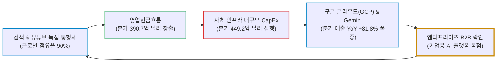

# 알파벳(Alphabet / GOOGL) 실전 재무 및 독점 가치 분석 보고서

- **작성일**: 2026-09-07
- **데이터 기준**: 2026 회계연도 2분기(2026년 6월 말 마감) 실적, 최근 3개월 핵심 뉴스(2026.07~09) 및 yfinance 시장 데이터(2026-09-04 종가 기준). 원화 환산은 모두 1달러 1,380원을 적용한다.

AI 챗봇 때문에 검색 엔진이 망한다며 설레발치는 삼류 호사가들의 헛소리에 휘둘려 세계 최강의 디지털 독점 제국을 내던지는 대중의 무지를 비웃어라. 다만 착시를 깨는 칼날은 반대편에도 들이대야 한다. 분기 매출 1,198억 달러와 클라우드 YoY +81.8% 폭증이 진짜인 만큼, '알파벳은 빅테크 중 압도적 바겐세일'이라는 통념도 숫자 앞에서는 무너진다. 최근 3개월간 쏟아진 90여 건의 뉴스와 시장 데이터가 양쪽 착시를 동시에 걷어낸다.

## 핵심 요약

| 구분 | 핵심 요약 |
| :--- | :--- |
| **종목 및 주가** | 알파벳 (Alphabet Inc., NASDAQ: `GOOGL`) / **$338.46** (52주 범위: $233.23 ~ $408.61) |
| **최종 투자의견** | **조건부 분할 매수 (Buy on Dip)** / 200일선($335.50) 지지 확인 후 눌림목 분할 저격 (투자 가치 점수 **86.1점**, 7.1절) |
| **비즈니스 본질** | 글로벌 검색 점유율 90% 독점 통행세 + 클라우드(GCP) 분기 매출 YoY +81.8% + 웨이모(Waymo) 14개 도시 주당 50만 회 독주 |
| **핵심 매력 (Bull)** | 순현금 1,216억$, 버크셔 해서웨이 1억 600만 주(9월 4일 종가 환산 약 359억$) 보유, 모건스탠리 TPU 2년 누적 매출 1,920억$ 전망, 제미니 MAU 10억 명 돌파 |
| **핵심 리스크 (Bear)** | 연 2,050억$ CapEx가 부른 분기 FCF 적자(-58.6억$), 8,110억$ 구매약정, 선행 PER 22.8배로 빅테크 피어 중 저평가가 아닌 중위권, 반독점 규제 상존 |
| **포트폴리오 성격** | 빅테크 코어 자산이되 베타 1.23으로 시장보다 더 흔들리는 **성장형 중심축(공수 겸용)** / **단기 2~3배 폭등 노리는 투기꾼과 배당(수익률 0.26%) 생활자는 매수 금지** |

---

## 1. 비즈니스 실체: 전 세계 검색 독점의 '빨대'와 클라우드 인프라의 권력

대중은 구글을 그저 편리한 무료 검색 사이트나 유튜브 동영상 플랫폼 정도로 여긴다. 그러니까 오픈AI나 앤트로픽 같은 생성형 AI 챗봇이 등장할 때마다 "구글의 검색 광고 모델은 이제 끝났다"며 호들갑을 떨고 주식을 집어 던진다.

비즈니스의 본질을 모르는 자들의 얄팍한 착각이다. 알파벳은 전 세계 80억 인류의 정보 탐색 경로에 거대한 디지털 고속도로 톨게이트를 깔아두고, 클릭할 때마다 피 같은 통행세를 걷어 들이는 **글로벌 검색 광고 독점 제국**이다. 여기에 기업들의 전산 인프라를 통째로 종속시키는 **구글 클라우드(GCP)**와 자체 AI 반도체(TPU), 그리고 실도로 무인 주행을 장악한 **웨이모(Waymo)**까지 수직 계열화하여 도저히 빠져나갈 수 없는 디지털 락인(Lock-in) 거미줄을 쳤다.

### 1.1 4대 핵심 사업 부문의 독점적 캐시 플로우

- **① 구글 서비스 (Google Services - 검색, 유튜브, 네트워크 광고, 안드로이드)**:
    - 전 세계 검색 점유율 90%에 육박하는 압도적 해자를 기반으로 전사 매출의 약 70% 이상을 책임지는 캐시카우다.
    - 안드로이드 OS, 크롬(Chrome) 브라우저, 구글 검색엔진으로 이어지는 3중 유통망은 대중의 디지털 일상을 완벽히 장악했다.
    - 유튜브 광고(분기 110.6억 달러)와 구독(YouTube Premium, YouTube TV)은 전통 방송 미디어를 완벽히 해체했다. 닐슨 조사에 따르면 2026년 6월 전체 스트리밍 시청 시간 점유율에서 유튜브는 **13.8%**로 넷플릭스(7.9%)를 더블 스코어로 압도하며 크리에이터 생태계를 독점하고 있다.
- **② 구글 클라우드 (Google Cloud Platform - GCP & Google Workspace)**:
    - 단순 서버 임대업이 아니다. 2026년 2분기 기준 분기 매출 248억 달러를 찍으며 **전년 동기 대비 +81.8%라는 경이적인 폭풍 성장**을 기록했다.
    - AWS(+36.7%)의 2.2배, Azure(+43.0%)의 1.9배에 달하는 가속 페달이다. 영업이익률도 35.6%로 급등해 AWS(39.4%)의 턱밑까지 추격했다.
    - 토머스 쿠리안 CEO가 공언했듯 포천 100대 기업의 약 90%가 제미니 엔터프라이즈를 도입했고, 기존 고객들이 약정 대비 50%나 더 많은 돈을 쏟아붓고 있다.
- **③ 자체 AI 반도체(TPU) 및 하드웨어 생태계**:
    - 브로드컴(AVGO)과의 12년 파트너십을 넘어 마벨(MRVL)과 2033년까지 최대 1,200억 달러 규모의 커스텀 반도체 계약을 체결하고 122억 달러 규모의 지분 워런트를 확보했다.
    - 10세대 TPU에는 AMD 멀티코어 CPU와 미디어텍(MediaTek) N2 칩을 결합하는 멀티소싱을 감행했다.
    - 모건스탠리 분석에 따르면 알파벳의 TPU 직접 판매 및 클라우드 결합 매출은 2027년 840억 달러와 2028년 1,080억 달러를 더해 **2년 누적 1,920억 달러(GW당 단가 270억 달러, 영업이익률 30% 가정)**에 달할 전망이다.
- **④ 기타 혁신 사업 (Other Bets - Waymo 등)**:
    - 적자 먹는 하마라는 오명을 완전히 벗어던졌다. 웨이모(Waymo)는 샌프란시스코, 피닉스, 오스틴에 이어 샌디에이고, 탬파, 덴버까지 미국 14개 도시에서 4,000대 이상의 차량으로 **주당 50만 회 이상의 완전 무인 유료 운행**을 기록하고 있다.
    - 2027년 독일 뮌헨을 시작으로 유럽연합(EU) 시장에 첫 진출하며 런던, 도쿄까지 글로벌 확장을 질주하고 있다.

### 1.2 알파벳의 디지털 인프라 및 AI 선순환 생태계

검색과 광고로 쓸어 담은 천문학적인 현금이 자체 칩(TPU)과 데이터센터 CapEx로 흘러 들어가고, 이것이 제미니(Gemini)와 클라우드 AI 서비스로 전환되어 다시 엔터프라이즈 고객을 락인하는 선순환 구조다.

---

## 2. 최근 3개월 핵심 뉴스 및 실적 흐름 심층 분석 (2026년 7월 ~ 9월)

### 2.1 최근 3개월 핵심 뉴스 타임라인 (팩트 vs 노이즈)

2026년 7월부터 9월까지 쏟아진 90여 건의 핵심 뉴스는 알파벳이 **'검색 포털'에서 'AI 전력·반도체·클라우드·자율주행을 아우르는 물리적 디지털 인프라 제국'**으로 진화하는 과정에서 시장이 겪은 극단적인 공포와 스마트머니의 탐욕을 선명하게 보여준다.

| 일자 | 주요 뉴스 및 시장 이벤트 | 영향도 | 스마트머니 관점의 핵심 분석 및 시사점 |
| :--- | :--- | :---: | :--- |
| **09.07** | **버크셔 아벨 CEO, "AI 데이터센터·알파벳 투자, AI 투 트랙 전략"** | `🟢 스마트머니` | 버크셔 해서웨이 에너지(BHE)의 전력 공급과 알파벳 지분 확대를 핵심 축으로 제시. 5월 알파벳 대규모 자금 조달 당시 6.5% 할인된 100억$ 블록딜 비화 공개. 보유 1억 600만 주는 9월 4일 종가($338.46) 환산 약 359억 달러 |
| **09.04** | **맥쿼리, "알파벳 TPU 의존도 조정 우려 충분히 반영" 목표가 $490 상향** | `🟢 호재` | 브로드컴 주가 하락이 알파벳의 TPU 파트너십 다각화 우려 때문이었으나 과도한 반응으로 판정. 하이퍼스케일러 CapEx 유입 확인 |
| **09.04** | **오픈AI·앤트로픽·그록 동시 서비스 장애 발생 (구글 제미니는 정상)** | `🟢 기술 신뢰` | 경쟁사들의 챗봇 및 API가 일제히 다운되는 동안 구글 자체 인프라의 견고성과 가용성 우위 입증 |
| **09.03** | **버크셔, 2분기에만 알파벳 170억$ 매입해 지분 1억 600만 주(3위 종목) 확보** | `🟢 스마트머니` | 5월 블록딜 100억$를 포함한 2분기 총 매입액이 170억$다. 버크셔 상장 주식 포트폴리오 3위로 수직 상승. 아벨 CEO, "버크셔 자회사들의 현업 적용 결과 구글이 AI 핵심 플레이어임을 확인" |
| **09.02** | **웨이모, 샌디에이고·탬파·덴버 유료 운행 개시 (14개 도시, 주당 50만 회 돌파)** | `🟢 사업 확장` | 4,000대 이상 무인 차량으로 미국 로보택시 시장 독점. 아마존 죽스(12개 도시 시험)와 테슬라 사이버캡(양산 지연)을 멀찌감치 따돌림 |
| **08.28** | **마벨 테크놀로지, 알파벳과의 협력 확대로 장기 성장 가시성 확보** | `🟢 호재` | 알파벳과의 커스텀 반도체 제휴가 FY29 이후 폭발적 실적 기여로 이어질 것이라는 월가 리포트 잇따라 발표 (제프리스가 제시한 $325는 알파벳이 아니라 마벨(MRVL)의 목표가다) |
| **08.27** | **딥마인드 수석 과학자 제프 딘 사임 후 창업, 데미스 허사비스 겸임** | `🟡 조직 개편` | 27년간 재직한 전설 제프 딘이 '디스커버리 루프' 창업을 위해 퇴사. 노벨상 수상자 허사비스가 수석 과학자 인수하고 코라이 카부쿠오을루가 딥마인드 총괄 |
| **08.26** | **모건스탠리, "알파벳 TPU 사업 과소평가... 향후 약 2,000억$ 매출 창출"** | `🟢 메가 호재` | TPU 시스템 판매 단가를 GW당 270억 달러로 상향. 2027년 840억$와 2028년 1,080억$를 더한 2년 누적 1,920억$가 정확한 추정치다. 목표가는 $400 유지 |
| **08.26** | **금융서비스 전용 에이전틱 AI 'Gemini Enterprise for Financial Services' 출시** | `🟢 B2B 확장` | 도이체방크, CME 그룹과 협업해 보안 MCP 커넥터 및 금융 특화 리서치 에이전트 상용화 |
| **08.26** | **웨이모, 2027년 독일 뮌헨에서 로보택시 출시… EU 시장 첫 진출** | `🟢 글로벌 확장` | 미국을 넘어 뮌헨, 런던, 도쿄로 글로벌 자율주행 영토 확장 공식 선언 |
| **08.25** | **유튜브 크리에이터 독점 확대… 넷플릭스 마진 압박 - 울프리서치** | `🟢 플랫폼 해자` | 닐슨 시청 점유율 유튜브 13.8% vs 넷플릭스 7.9%. 유튜브의 수백만 달러 크리에이터 지원 공세로 넷플릭스 콘텐츠 비용 압박 |
| **08.20** | **마벨, 알파벳과 AI 칩 파트너십 강화로 프리마켓 +10.4% 폭등** | `🟢 생태계 확장` | 알파벳에 122억$ 워런트 발행, 알파벳은 2033년까지 최대 1,200억 달러 커스텀 칩 구매 합의 (알파벳 TPU v10 및 인프라 종속 심화) |
| **08.19** | **알파벳, 2027년까지 픽셀 생산 전량 중국 밖(베트남·인도) 이전 통보** | `🟢 공급망 안정` | 지정학적 무역 분쟁 리스크를 원천 차단하고 삼성전자의 선례를 따라 동남아 턴키 공급망 완성 |
| **08.18** | **빅테크 9곳 부외 약정 3조 달러… 알파벳 구매약정 8,110억 달러(WSJ)** | `🔴 노이즈/리스크` | 데이터센터 전력과 하드웨어 확보를 위한 구매 약정이 1분기 3,320억$에서 8,110억$로 폭증. 월가 일각의 레버리지 우려 |
| **08.18** | **스탠리 드러켄밀러(듀케인), 2분기 알파벳 지분 1억 2,000만$ 재매수** | `🟢 스마트머니` | 1분기 전량 매각했던 알파벳을 2분기 포트폴리오에 전격 복귀시키며 AI 인프라 수혜 집중 |
| **08.18** | **알파벳, 스페이스X 상장 주식 5억 5,120만 주(772억 달러) 보유 확인** | `🟢 숨은 자산` | 비상장 시절부터 보유해온 스페이스X 지분 가치가 772억 달러에 달하며 막대한 재무적 안전판 입증 |
| **08.18** | **파산한 스피릿항공의 34년 데이터·코드 3,000만 줄을 1,000만$에 헐값 인수** | `🟢 AI 데이터 독점` | 75억 건 거래 데이터 및 실제 운항 데이터를 머코르와의 경매 경쟁 끝에 인수해 AI 학습 독점 자산 확보 |
| **08.17** | **호주 회사채 50억 AUD(36억$) 발행 추진 (2026년 누적 채권 850억$)** | `🟡 자금 조달` | 장기 20년물 금리 약 6.95%로 발행. 통화 다변화 및 글로벌 AI 인프라 투자 실탄 확보 |
| **08.17** | **SemiAnalysis, "10세대 TPU 개발에 AMD 멀티코어 CPU 협력" 보도** | `🟢 칩 독립성` | 브로드컴 일변도에서 벗어나 CPU 의존도가 높은 워크로드를 위해 AMD 및 미디어텍 협력 체제 구축 |
| **08.12** | **구글 제미니, 월간 활성 이용자(MAU) 10억 명 공식 돌파 (순다르 피차이)** | `🟢 서비스 장악` | 구글 역사상 가장 빠르게 성장한 제품이자 14번째 10억 사용자 플랫폼 등극. 오픈AI 챗GPT와 양강 체제 굳히기 |
| **08.10** | **모건스탠리, "하이퍼스케일러 CapEx '27년 1.4조$ 폭증... 알파벳 추정치 2,050억$로 상향"** | `🟢 인프라 폭증` | 7월 회사 가이던스(2026년 최대 2,050억$)를 월가 추정치가 그대로 수용한 것이다. 공급이 수요를 충족하지 못해 제3자 인프라(코어위브, 네비우스)까지 임대하는 초호황 국면 확인 |
| **07.28** | **빅쇼트 스티브 아이즈먼, "AI 지출 회의론"으로 알파벳 전량 매각** | `🔴 대중 투매` | CapEx 급증에 질려 수년간 보유하던 지분을 바닥에서 매각. 스마트머니가 이를 그대로 흡수 |
| **07.27** | **배런스, "구글 클라우드 매출 YoY +81.8%, OPM 35.6%로 AWS 맹추격"** | `🟢 펀더멘털` | 과거 적자 부문이던 GCP가 폭발적 이익 창출 기계로 환골탈태 |
| **07.24** | **BofA 저스틴 포스트, "실적 후 급락은 일생일대의 매수 기회" 목표가 $430** | `🟢 저가 매수` | 분기 수주잔고 500억$ 급증 및 급락 당일 선행 PER 21배 근접을 매수 논거로 제시 |
| **07.23** | **★ 실적 반영 첫 거래일 -7.13% 급락 (종가 $317.49, 장중 저가 $314.70) ★** | `🔴 단기 발작` | 2분기 FCF 적자(-58.6억$)와 연간 CapEx 가이던스 상향(최대 2,050억$)에 개미와 기관이 동시 투매. 거래량 6,942만 주로 직전 20일 평균의 3배 폭증 |
| **07.22** | **★ FY26 Q2 실적 발표(장 마감 후) ★ 매출 1,198억$(+24.2%), 클라우드 248억$(+81.8%)** | `🟢 메가 팩트` | 영업이익 407.7억$(OPM 34.0%), GAAP 순이익 1,121.9억$·EPS 9.11$. 세전이익 1,387.5억$ 가운데 980억$가 지분증권 평가이익이라, 이를 실효세율 19.1%로 세후 환산해 걷어내면 조정 EPS는 2.85$다. 분기 CapEx 449.2억$ |

### 2.2 뉴스 흐름으로 본 4대 핵심 구조적 변화와 스마트머니의 의도

- **① 버핏과 드러켄밀러의 '블록딜 싹쓸이' vs 아이즈먼의 '새가슴 투매'**:
    - 워런 버핏과 그렉 아벨이 이끄는 버크셔 해서웨이는 5월 대규모 자금 조달 당시 6.5% 할인된 블록딜로 확보한 100억 달러어치를 포함해 **2분기에만 170억 달러를 쏟아부어 보유 지분을 1억 600만 주(9월 4일 종가 환산 약 359억 달러, 버크셔 상장 포트폴리오 3위 종목)**까지 끌어올렸다. 월가의 전설 스탠리 드러켄밀러 역시 1분기에 전량 매도했던 알파벳을 2분기 1억 2,000만 달러 규모로 전격 재매수했다.
    - 반면 영화 '빅쇼트'의 스티브 아이즈먼은 AI CapEx 급증과 단기 마진 압박에 겁을 집어먹고 수년간 들고 있던 지분을 바닥에서 전량 내던졌다. 하수들이 공포에 질려 던진 물량을 버핏과 드러켄밀러 같은 진짜 스마트머니가 입을 벌리고 헐값에 받아먹은 전형적인 부의 이전이다.
- **② 분기 449억$ CapEx와 8,110억$ 구매약정의 실체: '공포의 적자'가 아닌 '후발주자 질식용 참호'**:
    - 상장 이래 최초의 분기 FCF 적자(-58.6억 달러, 영업현금흐름 390.7억 달러에서 CapEx 449.2억 달러를 뺀 값)와 8,110억 달러(약 1,119조 원)에 달하는 구매 약정을 두고 언론은 '현금 소진과 디폴트 우려(CDS 스프레드 확대)'를 운운하며 공포를 조장했다.
    - 그러나 실상은 무엇인가? 구글 클라우드 수요가 공급을 압도하여 자체 서버로 감당이 안 돼 네오클라우드(코어위브, 네비우스)와 스페이스X의 서버까지 임대해야 할 정도로 극심한 쇼티지다. 토머스 쿠리안 CEO가 폭로했듯 기존 고객들은 약정보다 50%나 더 많은 돈을 쏟아붓고 있다. 이 투자는 돈을 태우는 것이 아니라, 후발 주자들이 엄두도 못 낼 전력망과 데이터센터 참호를 파서 경쟁자를 질식시키는 과정이다.
- **③ TPU 생태계의 대확장: 브로드컴 독점에서 마벨·미디어텍·AMD로의 영리한 멀티소싱**:
    - 브로드컴(AVGO) 단일 의존에서 벗어나 마벨(1,200억$ 구매 약정 및 122억$ 지분 워런트 확보), 미디어텍(N2 Humufish), AMD(10세대 멀티코어 CPU 결합)로 가치사슬을 다변화했다.
    - 모건스탠리가 분석했듯 알파벳의 자체 TPU 판매 및 클라우드 서비스 매출은 2027~2028년 2년 누적 1,920억 달러(GW당 단가 270억 달러, 영업이익률 30% 가정)에 달하는 거대한 제2의 캐시카우로 탈바꿈하고 있다.
- **④ 플랫폼 독점의 가속화: 제미니 10억 MAU, 웨이모 주당 50만 회 무인 주행**:
    - 제미니 MAU 10억 명 돌파 및 분당 220억 개 토큰 처리, 포천 100대 기업의 90% 엔터프라이즈 도입으로 챗GPT와의 경쟁에서 완벽히 승기를 잡았다.
    - 웨이모는 14개 도시에서 4,000대 이상의 차량으로 주당 50만 회의 유료 무인 운행을 달성하며 2027년 독일 뮌헨을 시작으로 유럽 대륙까지 삼키려 하고 있다. 자율주행 껍데기만 요란한 경쟁자들과 격차를 수년 단위로 벌렸다.

---

## 3. 경쟁 해자 및 피어 그룹 잔혹 비교

빅테크 공룡들의 진검승부에서 누가 진짜 숫자를 만들어내고 있는지 냉정하게 대조해야 한다. 화려한 언론 플레이 뒤에 숨겨진 체급의 차이를 확인하라.

### 3.1 하이퍼스케일러 빅4 피어 잔혹 비교 (GOOGL vs MSFT vs AMZN vs META)

| 비교 지표 | 알파벳 (GOOGL) | 마이크로소프트 (MSFT) | 아마존 (AMZN) | 메타 (META) |
| :--- | :---: | :---: | :---: | :---: |
| **현재 주가 / 시가총액** | **$338.46 / $4.14T** | $499.70 / $3.71T | $258.51 / $2.79T | $616.77 / $1.57T |
| **최근 분기 매출 성장률** | YoY +24.2% | YoY +17.7% | YoY +19.6% | **YoY +28.0%** |
| **영업이익률 (OPM)** | 34.0% | **45.1%** | 13.7% | 34.8% |
| **클라우드 부문 성장률** | **YoY +81.8% (GCP)** | YoY +43.0% (Azure) | YoY +36.7% (AWS) | 해당 없음 |
| **클라우드 영업이익률** | **35.6% (수익성 급증)** | 비공개 (전체 45.1%) | 39.4% (정체 국면) | 해당 없음 |
| **트레일링 PER** | **17.0배 (단, 일회성 이익 포함)** | 27.9배 | 20.8배 | 23.3배 |
| **선행 PER (Forward P/E)** | 22.8배 (4사 중 3위) | 21.2배 | 24.9배 | **17.6배 (최저)** |
| **베타 (시장 대비 변동성)** | 1.23 | **1.11 (최저)** | 1.44 | 1.24 |
| **자체 AI 칩 독립도** | **최상 (TPU 생태계 완비, 마벨 협력)** | 중 (Maia 개발 중, NVDA 의존) | 중상 (Trainium/Inferentia) | 중 (MTIA 초기 단계) |
| **피지컬 AI / 로보택시** | **웨이모(Waymo) 14개 도시 상용화** | 없음 | 죽스(Zoox) 12개 도시 시험 | 없음 |

!!! warning "여기서 첫 번째 착시를 깨라: 알파벳은 '압도적 바겐세일'이 아니다"
    시중에 도는 "알파벳만 유일하게 싸다"는 말은 트레일링 PER 17.0배만 보고 떠드는 소리다. 이 수치는 2분기에 한 번 꽂힌 지분증권 평가이익 980억 달러가 분모의 이익을 부풀린 결과이고, 그 이익은 내년에 다시 오지 않는다. 일회성을 걷어낸 선행 PER로 줄을 세우면 **메타 17.6배 < 마이크로소프트 21.2배 < 알파벳 22.8배 < 아마존 24.9배**로, 알파벳은 4사 중 세 번째다. 매출 성장률도 메타(+28.0%)에 밀리고 영업이익률은 마이크로소프트(45.1%)에 11%p 뒤진다. 밸류에이션만 보고 알파벳을 사는 것은 근거가 부실하다.

그렇다면 무엇이 알파벳의 진짜 차별점인가. 밸류에이션이 아니라 **인프라 수직 계열화의 깊이**다. 클라우드 성장률 +81.8%는 2위 Azure의 1.9배이고, 그 성장을 엔비디아에 마진을 상납하지 않고 자체 ASIC(TPU)으로 소화한다. 여기에 로보택시라는 물리 세계 자산까지 상용화 단계로 올린 곳은 4사 중 알파벳뿐이다. 즉 알파벳을 사는 논거는 "싸서"가 아니라 "같은 값이면 남이 못 가진 걸 들고 있어서"다.

---

### 3.2 AI 인프라 최강 맞대결: 브로드컴(AVGO) vs 알파벳(GOOGL) — 곡괭이 파는 자 vs 인프라 짓는 자

AI 패권 경쟁에서 가장 치열하게 맞부딪히는 현실적 질문이 있다. **"곡괭이를 독점한 팹리스 제왕 브로드컴(AVGO)을 사야 하는가, 아니면 검색·클라우드·자체 반도체·자율주행까지 통째로 삼킨 플랫폼 군주 알파벳(GOOGL)을 사야 하는가?"**

두 기업은 12년간 구글의 14개 TPU 칩 설계를 함께해 온 핵심 파트너다. 그러나 포트폴리오 안에서의 성격은 가치사슬의 완전히 반대편에 서 있다.

| 점검 항목 | 브로드컴 (`AVGO`) | 알파벳 (`GOOGL`) | 냉혹한 비교 판정 |
| :--- | :---: | :---: | :--- |
| **현재 주가 / 시가총액** | **$357.89 / $1.70T** | **$338.46 / $4.14T** | AVGO가 상대적으로 가볍고 압축적 |
| **비즈니스 모델** | 팹리스 커스텀 ASIC + 통신 스위치 + 엔터프라이즈 SW | 검색 포털 + GCP 클라우드 + TPU + 웨이모 로보택시 | **에셋 라이트(AVGO) vs 에셋 헤비(GOOGL)** |
| **현금흐름 구조 (FCF)** | **TTM FCF 305억$ (매출 891억$ 대비 마진 34.2%)** | **분기 FCF -58.6억$ 적자 (연 2,050억$ CapEx 집행)** | **AVGO 압승**: CapEx를 빨아들이는 자와 지불하는 자의 차이 |
| **선행 PER (동일 기준)** | **18.5배** | 22.8배 | **AVGO 우위**: 향후 12개월 기준 4.3배p 저렴 |
| **트레일링 PER** | 45.7배 | 17.0배 | **판정 역전**: 과거 실적 기준으로는 AVGO가 2.7배 비싸다 |
| **베타 (시장 대비 변동성)** | **1.46** | 1.23 | **GOOGL 우위**: 흔들릴 때 더 크게 흔들리는 쪽은 브로드컴이다 |
| **생태계 확장성 (TAM)** | 반도체 칩 및 데이터센터 통신 장비에 국한 | **소프트웨어 + B2B 클라우드 + 피지컬 AI(로보택시)** | **GOOGL 압승**: 장기 업사이드 폭발력과 포괄 영역의 압도성 |
| **포트폴리오 내 역할** | 현금 창출력으로 미는 **'수익성 축'** | 플랫폼 독점으로 미는 **'성장 축'** | **양자택일이 아닌 상호 보완, 단 어느 쪽도 방어주는 아니다** |

!!! danger "여기서 두 번째 착시를 깨라: 브로드컴은 '방파제'가 아니다"
    브로드컴을 계좌의 안전판이나 방파제로 소개하는 글이 넘쳐난다. 숫자를 보면 정반대다. **브로드컴의 베타는 1.46으로 알파벳(1.23)보다 높다.** 시장이 10% 빠지면 브로드컴은 평균적으로 14.6%가 빠진다는 뜻이다. 현금 창출력이 좋은 것과 주가가 덜 흔들리는 것은 전혀 다른 얘기다.

    밸류에이션도 마찬가지다. 선행 PER 18.5배만 떼어 보면 싸 보이지만, 트레일링 PER은 **45.7배**다. 알파벳의 트레일링 17배를 신기루라 불렀다면, 브로드컴의 선행 18.5배에도 똑같은 의심을 적용하는 것이 공정하다. 두 종목 모두 **미래 실적 추정치에 기대어 서 있는 고베타 위험자산**이며, 진짜 방어자산은 이 둘 바깥에 있다.

#### ① 브로드컴을 먼저 놓는 근거는 '안전'이 아니라 '현금의 순도'다
- 텅 빈 계좌에 첫 종목을 올릴 때 브로드컴이 먼저 거론되는 이유는 안전해서가 아니다. "지금 막대한 돈을 쏟아붓고 있는 자(GOOGL)"와 달리 브로드컴은 **매출 891억 달러에서 305억 달러의 잉여현금을 남기는(FCF 마진 34.2%) 에셋 라이트 구조**이기 때문이다. 돈이 들어오는 속도가 눈에 보이면 버티기가 쉬워진다.
- 다만 그 대가로 브로드컴은 빅테크 CapEx 사이클에 실적이 직결된다. 고객사가 투자를 줄이는 순간 매출이 먼저 꺾인다. 반면 알파벳은 그 CapEx를 집행하는 당사자다. **같은 사이클의 정반대 끝에 서 있다는 것이 두 종목을 함께 쥐는 유일한 논리적 근거다.**

#### ② 그렇다면 알파벳(GOOGL)은 왜 결코 포기할 수 없는가
- 브로드컴이 부품과 통신에 머무를 때, 알파벳은 **90% 검색 독점 통행세, YoY +81.8% 클라우드, 월간 10억 명의 제미니, 그리고 주당 50만 회의 웨이모 로보택시**라는 '물리 세계와 디지털 세계의 융합 패권'을 쥐고 있다.
- 현재 주가($338.46)는 워런 버핏의 버크셔 해서웨이가 5월 6.5% 할인 블록딜로 확보한 추정 단가($355~$376)보다 **5~10% 더 낮고, 200일선($335.50) 바닥 지지선 바로 위**에 있다. 버핏보다 유리한 가격에서 세계 최강의 플랫폼 독점주를 잡을 기회다.

#### ③ 둘을 함께 쥔다면 반드시 지켜야 할 비중 상한
- '브로드컴(곡괭이) + 알파벳(인프라 군주)' 조합은 AI 사이클의 지출 단계와 회수 단계를 양쪽에서 잡는 구성이다. 빅테크가 CapEx를 쏟아부을 때는 브로드컴이 현금을 쓸어 담고, 인프라가 완성되어 AI 서비스가 결실을 맺을 때는 알파벳이 플랫폼 통행세를 걷는다.
- **그러나 이 둘은 같은 AI 인프라 사이클을 공유하는 상관관계 높은 자산이다.** 사이클이 통째로 꺾이면 함께 무너진다. 베타 1.46과 1.23짜리 두 종목으로 계좌를 채우는 것은 분산이 아니라 집중이다.
- 따라서 개별 종목은 **전체 계좌의 5~7% 이내**, 두 종목 합산으로도 **10~15%를 넘기지 않는 선**에서 운용해야 한다. 나머지는 지수 ETF와 현금, 그리고 베타가 낮은 자산이 받쳐야 한다. 확신이 강할수록 비중 상한을 먼저 정하는 것이 순서다.

---

## 4. 기술적 사이클 위치 (4단계 사이클 모델)

스탠 와인스타인의 4단계 주가 사이클 이론에 입각할 때, 현재 알파벳(GOOGL)의 기술적 위치는 **2단계 상승 국면 내 대형 박스권·눌림목 조정 국면**으로 판정한다.

- **실적 반영 첫 거래일의 투매와 고점 대비 낙폭**: 7월 22일 장 마감 후 실적이 공개되자 CapEx 상향과 FCF 적자 충격으로 7월 23일 주가는 하루 만에 **-7.13% 폭락해 종가 $317.49(장중 저가 $314.70)**를 찍었다. 52주 고점($408.61) 대비 종가 기준 **-22.3%**, 장중 저가 기준 -23.0%까지 패닉 셀이 출회된 국면이다.
- **200일선을 이틀 만에 되찾은 복원력**: 급락 당시 종가가 200일선(당시 $323 수준)을 뚫고 내려간 날은 **7월 23일과 24일 단 이틀뿐**이었고, 7월 27일부터 곧바로 회복해 지금까지 단 한 번도 종가로 재이탈하지 않았다. 생명선을 이틀 만에 되찾았다는 것은 매도 물량이 추세를 꺾을 만큼 두텁지 않았다는 뜻이다.
- **200일선은 우상향, 50일선은 하락 수렴**: 200일 이동평균선은 60거래일 전 $305.85에서 20거래일 전 $328.62를 거쳐 현재 **$335.50까지 꾸준히 우상향** 중이고, 현재가 $338.46은 그 바로 위(이격도 **+0.88%**)에 붙어 있다. 반대로 50일선은 20거래일 전 $356.25에서 **$348.35까지 흘러내리며** 위에서 수렴해 오고 있다. 상승하는 장기선과 하락하는 단기선이 좁혀지는 이 구간이 방향을 결정한다.
- **거래량 고갈이 말해주는 것**: 최근 20거래일 평균 거래량은 **2,224만 주**로, 60거래일 평균 **3,011만 주 대비 26% 감소**했다. 급락일 6,942만 주에 비하면 3분의 1도 안 된다. 팔 사람이 다 팔았다는 신호다.
- **버핏보다 싸게 살 수 있는 구간이다**: 버크셔가 6.5% 할인 블록딜로 매입한 5월의 주가는 종가 기준 $379.87~$402.12 범위였다. 할인율을 적용해도 매입 단가는 대략 **$355~$376**로 추정된다. 현재가 $338.46은 그보다 **5~10% 더 낮다.** 버핏과 같은 가격이 아니라, 버핏보다 유리한 가격이다.

---

## 5. 밸류에이션 및 가격 타당성 검증

주가가 정당한 프리미엄을 받고 있는지 감정을 배제하고 계산해야 한다. 유리한 숫자만 골라 담으면 계산이 아니라 자기 위안이다.

- **PER 역전 현상의 진짜 정체 (반드시 짚고 넘어가라)**:
    - 트레일링 PER은 **16.97배**인데 포워드 PER은 **22.79배**다. 성장 기업에서 미래 PER이 과거 PER보다 **높게** 나오는 이 역전은 그냥 넘길 숫자가 아니다.
    - 원인은 명확하다. 2분기 세전이익 1,387.5억 달러 가운데 **980억 달러가 지분증권 평가이익**이라는 일회성 항목이었다. 이 덕에 최근 4개 분기 순이익률이 54.8%까지 부풀었고 트레일링 EPS가 $19.94로 튀었다. 반면 시장의 향후 12개월 EPS 추정치는 **$14.85**로, 실제 영업 실력을 반영한 값이다.
    - **결론: 트레일링 PER 17배는 신기루다.** 알파벳의 실질 밸류에이션은 포워드 PER 22.8배로 봐야 하고, 이는 메타(17.6배)와 마이크로소프트(21.2배)보다 비싸고 아마존(24.9배)보다 싼 중위권이다. PEG는 1.25배로 성장 대비 무난한 수준이지 헐값이 아니다.
- **그래서 이 가격은 정당한가**:
    - 정당하다. 다만 근거는 '싸서'가 아니라 '성장의 질'이다. 클라우드 +81.8%라는 가속과 자체 TPU 기반 원가 구조는 포워드 PER 22.8배를 방어할 체력이 된다. 반대로 말하면 **클라우드 성장률이 60%대로 둔화하는 순간 이 배수는 즉시 비싸진다.** 밸류에이션이 아니라 성장률이 이 주식의 버팀목이다.
- **숫자로 확인되는 하방 안전판**:
    - 총현금 2,424.7억 달러에서 총차입금 1,207.9억 달러를 뺀 **순현금이 1,216.8억 달러(약 168조 원)**다. 시가총액의 2.9%를 현금으로 깔고 앉아 있어, CapEx가 아무리 폭증해도 유동성 위기로 번질 구조가 아니다.
    - 여기에 스페이스X 상장 지분 5억 5,120만 주(**평가액 772억 달러, 약 107조 원**)와 마벨 테크놀로지 워런트(최대 122억 달러) 같은 장부 외 자산이 얹힌다. 다만 이들은 재무제표 본문이 아니라 주석과 공시에 흩어져 있는 자산이라, 주가가 무너질 때 즉시 현금화되는 방어막으로 착각하면 안 된다.
- **TPU 및 클라우드 수익화 잠재력**:
    - 모건스탠리 추정대로 2027~2028년 2년간 TPU 시스템 판매로 1,920억 달러의 매출이 추가되고 영업이익률 30%가 찍히면 2년 누적 영업이익만 576억 달러가 붙는다. 이 시나리오가 현실화되면 CapEx 회수 주기는 월가 예상보다 빠르게 당겨진다.
    - 다만 이것은 **증권사 추정치이지 회사 가이던스가 아니다.** 현재 주가에 이미 반영된 몫이 얼마인지는 아무도 모른다. 추정치를 확정 실적처럼 계산에 넣는 순간 그게 바로 고점에서 물리는 경로다.

---

## 6. 반드시 계산에 넣어야 할 3대 리스크

이 주식을 사기 전에 계좌를 걸고 확인해야 할 위험은 셋이다. 각 위험에는 "무엇이 보이면 판단이 틀렸다고 인정할 것인지"를 숫자로 못 박아 둔다. 빠져나갈 조건을 미리 정해두지 않은 매수는 투자가 아니라 기도다.

| 리스크 | 실체 | 위험이 현실화됐다고 판단할 트리거 |
| :--- | :--- | :--- |
| **① 밸류에이션 착시** | 트레일링 PER 17배는 980억$ 일회성 평가이익이 만든 신기루다. 실질은 포워드 PER 22.8배로 메타(17.6배)·마이크로소프트(21.2배)보다 비싼 중위권이다 | 다음 분기 클라우드 성장률이 **60%대로 둔화**하는 순간, 22.8배는 즉시 비싼 값이 된다 |
| **② CapEx 회수 실패** | 연 2,050억$ 자본지출과 8,110억$ 구매약정은 되돌릴 수 없는 고정비다. 이 설비가 매출로 전환되지 않으면 감가상각이 그대로 영업이익을 갉아먹는다 | 클라우드 매출 증가액이 **분기 CapEx 증가액을 밑도는 분기가 2개 연속** 나오면 투자 회수 논리가 깨진다 |
| **③ 반독점 규제와 검색 광고 잠식** | 검색 점유율 90%는 해자인 동시에 규제 당국의 상시 표적이다. 여기에 생성형 AI가 검색 광고 트래픽을 잠식할 가능성도 남아 있다 | 검색 광고 매출 성장률이 **한 자릿수로 내려앉거나**, 크롬·안드로이드 분리 같은 구조적 시정 명령이 실제 집행 단계에 들어가면 해자 전제가 흔들린다 |

!!! warning "리스크의 성격을 구분해서 읽어라"
    ①과 ②는 숫자로 분기마다 검증되는 리스크라 대응이 가능하다. 반면 ③은 발생 시점과 강도를 예측할 수 없는 **꼬리 위험(Tail Risk)**이다. 예측하려 들지 말고, 애초에 계좌에서 감당 가능한 비중으로만 들고 가는 것이 유일한 방어법이다.

---

## 7. 종합 평가 및 냉혹한 계좌 실행 원칙

### 7.1 6대 핵심 투자 지표 다차원 평가 매트릭스

| 평가 영역 | 가중치 | 평점 (100점 만점) | 가중 점수 | 등급 | 핵심 평가 요약 |
| :--- | :---: | :---: | :---: | :---: | :--- |
| **① 비즈니스 모델 및 해자** | 25% | **98점** | 24.50 | `S+` | 검색 점유율 90%, 유튜브 시청 점유율 13.8%, 제미니 MAU 10억 명 독점 |
| **② 실적 성장성 및 가이던스** | 25% | **92점** | 23.00 | `S` | 분기 매출 YoY +24.2%, 클라우드 YoY +81.8%의 폭발적 가속 (다만 매출 성장률 자체는 메타 +28.0%에 뒤진다) |
| **③ 재무 건전성 및 현금흐름** | 20% | **80점** | 16.00 | `A-` | 분기 CapEx 449.2억$로 FCF -58.6억$ 적자이나, 순현금 1,216.8억$가 유동성 위기 가능성을 차단 |
| **④ 밸류에이션 매력도** | 15% | **72점** | 10.80 | `B` | 포워드 PER 22.8배는 피어 4사 중 3위로 **저평가가 아닌 중위권**, PEG 1.25는 무난한 수준 |
| **⑤ 기술적 매매 타이밍** | 10% | **78점** | 7.80 | `B+` | 200일선($335.50) 우상향 지지 및 거래량 26% 축소 수렴 국면 |
| **⑥ 리스크 관리 가능성** | 5% | **80점** | 4.00 | `A-` | 순현금과 우상향 200일선으로 하방 통제 가능, 단 반독점 규제는 통제 불가한 상시 변수 |
| **종합 가중치 환산 점수** | **100%** | — | **86.1점** | **`Buy`** | **밸류에이션이 아니라 성장의 질로 사는 종목, 200일선 디딤돌 분할 매수** |

### 7.2 실전 결론: "그래서 지금 어쩌라는 것인가?" (Action Verdict)

#### ① 지금 당장 사야 하는가? ➔ **"조건부로 그렇다. 선발대만 넣고 주력은 아껴둬라."**
- **이유**: 7월 23일 $317.49까지 처박았던 패닉 셀은 이미 끝났다. 종가가 200일선 아래에 머문 날은 이틀뿐이었고, 그 뒤로 단 한 번도 재이탈하지 않았다. 200일선은 $305.85에서 $335.50까지 우상향 중이고, 거래량은 60일 평균 대비 26% 말랐다. 팔 사람이 다 팔았다는 뜻이다.
- **결정적으로, 지금 가격은 버핏보다 유리하다**: 버크셔가 6.5% 할인 블록딜로 확보한 5월 추정 단가는 $355~$376다. 현재가 $338.46은 그보다 5~10% 낮다. 세계 최고의 투자자보다 싸게 살 기회를 굳이 마다할 이유가 없다.
- **그런데 왜 전액이 아니라 선발대인가**: 밸류에이션이 바닥이 아니기 때문이다. 포워드 PER 22.8배는 피어 4사 중 3위이고, 메타는 17.6배에 거래된다. 싸서 사는 게 아니라 성장의 질을 사는 것이므로, **그 성장이 분기 실적으로 계속 증명되는지 확인하며 나눠 담는 게 맞다.** 배정 현금의 30%만 선발대로 투입한다.
- **브로드컴(AVGO)과의 우선순위 및 비중 상한**: 하나만 먼저 담아야 한다면 **브로드컴이 여전히 순번상 앞**이다. 매출 891억 달러에서 305억 달러를 남기는 FCF 마진 34.2%의 에셋 라이트 구조와 선행 PER 18.5배가 알파벳(22.8배)보다 앞서기 때문이다. 다만 이것을 '안전해서'로 오해하지 마라. **브로드컴의 베타는 1.46으로 알파벳보다 더 흔들린다.**
- 두 종목은 AI 인프라 사이클의 지출 단계와 회수 단계를 양쪽에서 잡는 보완 관계이지만, 같은 사이클을 공유하는 만큼 함께 무너질 수 있다. 개별 **5~7%, 합산 10~15%**를 상한으로 못 박고, 나머지는 지수 ETF와 현금이 받치게 해라. 이 둘로 계좌를 채우는 것은 분산이 아니라 집중이다.

#### ② 이런 주식은 누가 사고, 누가 절대 사면 안 되는가?
- **❌ 절대 사지 마라 (즉시 퇴장)**:
    - 테마주나 코인처럼 한두 달 만에 계좌 2~3배 폭등을 노리는 단타 투기꾼.
    - 배당으로 생활비를 뽑아 쓰려는 사람. 배당수익률이 **0.26%**다. 1억을 넣어도 연 26만 원이다. 이 종목에서 현금흐름을 기대하는 건 착각이다.
    - AI 인프라 구축에 따른 분기별 현금흐름 출렁임과 8,110억 달러 구매약정 뉴스에 밤잠을 설치는 새가슴.
- **⭕ 반드시 눈독 들이고 주워 담아야 할 사람 (스나이퍼 대기)**:
    - 검색·클라우드·자체 반도체·로보택시를 한 종목으로 묶어 담고 싶은 자. 이 조합을 가진 기업은 지구상에 알파벳뿐이다.
    - 분기 실적을 직접 확인하며 3년 이상 들고 갈 인내심이 있는 장기 투자자. **현실적 기대 수익률은 연 10~14% 복리**다. 시총 4.1조 달러짜리 공룡에게 그 이상을 기대하는 건 산수를 못 하는 것이다.

#### ③ 이 주식으로 '인생 역전(대박)'을 바라면 안 되는 냉혹한 이유
- 시가총액이 이미 4조 1,393억 달러(약 5,712조 원)에 달하는 거대한 공룡이다. 여기서 3배가 되려면 12조 달러가 넘는 시가총액, 즉 미국 명목 GDP의 3분의 1을 웃도는 덩치가 필요하다. 물리적으로 불가능하다.
- 그렇다고 마음 놓고 졸 수 있는 수비수도 아니다. **베타는 1.23으로 시장보다 23% 더 흔들린다.** 실제로 7월에 하루 만에 -7.13%가 빠졌다. 알파벳은 계좌를 지켜주는 방파제가 아니라, **시장이 오를 때 조금 더 오르고 빠질 때 조금 더 빠지는 성장형 중심축**이다. 진짜 방파제가 필요하면 베타 0.6 이하 배당주를 따로 사라.

### 7.3 실전 가격대별 실행 시나리오 및 분할 매수 로드맵

| 구분 | 실행 조건 | 배정 비중 | 가격 기준 | 대응 방침 |
| :--- | :--- | :---: | :---: | :--- |
| **1차 진입 (선발대)** | 200일선($335.50) 위 종가 유지 확인 | 30% | $335 ~ $342 | 현재가($338.46) 구간에서 정찰대 구축 |
| **2차 매수 (주력)** | 200일선 눌림 후 반등 양봉 출현 | 35% | $322 ~ $335 | 핵심 비중 확대 (손익비 최적 구간) |
| **3차 매수 (추세 확인)** | 50일선($348.35) 종가 회복 및 3일 안착 | 25% | $348 이상 | 단기 저항 돌파 확인 후 추격 |
| **예비 현금** | 매크로 급변 및 실적 쇼크 버퍼 | 10% | — | 조건 충족 전까지 현금 보존 |
| **손절 기준선** | 7월 패닉 저점($314.70) 붕괴 | — | **$314 종가 이탈 시** | 200일선 복원 실패로 판단, 절반 이상 축소 후 재정비 |

!!! danger "손절선을 $314에 두는 이유 (초보가 가장 많이 틀리는 지점)"
    손절선은 기분이 아니라 **시장이 실제로 시험했던 가격**에 둬야 한다. $314.70은 7월 패닉 당시 장중 저가이자, 매수세가 실제로 방어해낸 자리다. 이 선이 종가로 깨지면 "패닉 저점도 못 지킨다"는 뜻이므로 논리가 무너진 것이고, 그때는 미련 없이 던져야 한다.

    반대로 손절선을 2차 매수 구간 바로 아래에 붙이는 것은 최악의 설계다. 주력 물량을 넣자마자 손절에 걸려 최대 손실만 확정하고 반등은 구경도 못 한다. 이 로드맵의 3회 분할 가중평균 매입 단가는 **$337.24**(1차 $338.46×30% + 2차 $328.50×35% + 3차 $348.00×25%, 투입분 90% 기준)이고, 손절선 $314까지는 **-6.9%**다. 반면 52주 고점($408.61) 회복 시 **+21.2%**로, **손익비는 3.07 대 1**이다. 이 비율이 3 대 1 아래로 무너지면 진입 자체를 재검토해라.

!!! tip "최종 핵심 제언 (Executive Takeaway)"
    알파벳을 둘러싼 착시는 양쪽에 있다. 첫째, "AI 챗봇 때문에 검색이 끝났다"는 공포는 클라우드 +81.8%와 제미니 MAU 10억 명 앞에서 헛소리로 판명됐다. 둘째, **"알파벳만 유일하게 싸다"는 강세론자들의 주문 역시 신기루다.** 트레일링 PER 17배는 980억 달러짜리 일회성 이익이 만든 착시일 뿐, 실질은 포워드 22.8배로 메타보다 비싸다.

    그러니 이 주식을 사는 이유는 단 하나로 정리해라. 싸서가 아니라, **검색 통행세와 자체 반도체와 로보택시를 한 몸에 가진 회사가 지구상에 여기뿐이라서**다. 스티브 아이즈먼처럼 CapEx 청구서에 겁먹고 도망치는 것도 하수지만, 밸류에이션을 오독하고 전 재산을 밀어 넣는 것은 더한 하수다. 200일선 위에서 나눠 담고, $314가 깨지면 인정하고 나와라. 그게 전부다.
