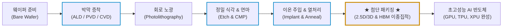
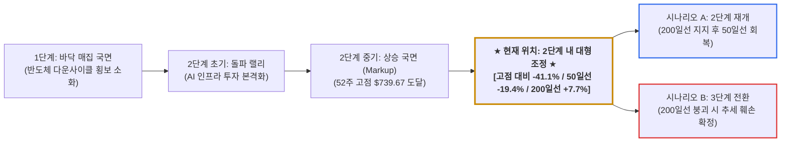
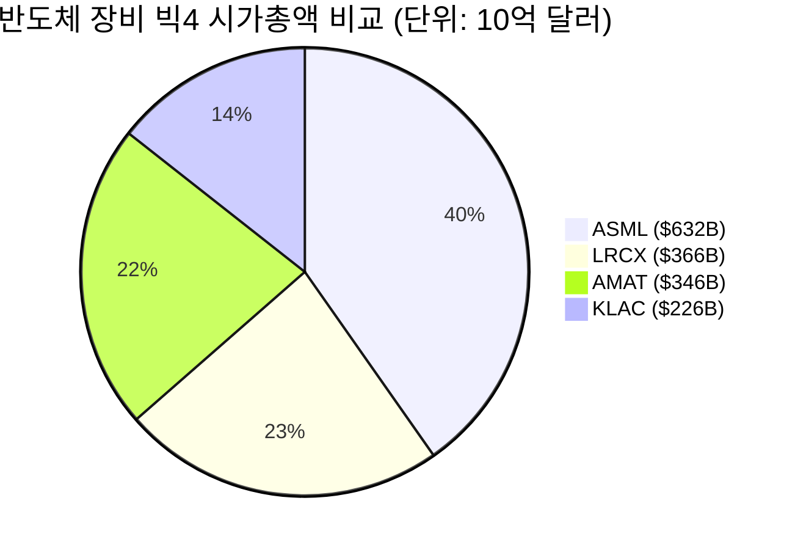

# 어플라이드 머티어리얼즈(Applied Materials, AMAT) 최신 재무 및 가치 분석 보고서

- **작성일**: 2026-09-04
- **데이터 기준**: 2026 회계연도 3분기(2026년 7월 말 마감) 실적 공시 및 yfinance 시장 데이터(2026-09-04 기준)

매출 기준 세계 1위 반도체 전공정·첨단 패키징 장비 기업인 어플라이드 머티어리얼즈(Applied Materials, Inc., `AMAT`)의 FY26 Q3 실적, 기술적 해자, 재무 건전성 및 밸류에이션 분석 자료입니다. 사상 최대 분기 실적과 52주 고점 대비 41% 하락이 동시에 나타나는 현재 국면을 다룹니다.

## 핵심 요약

| 구분 | 주요 내용 |
| :--- | :--- |
| **종목명 (티커)** | 어플라이드 머티어리얼즈 (Applied Materials, Inc., NASDAQ: `AMAT`) |
| **최종 투자 가치 점수** | **87.6점 / 100점** (`Buy` / 사업 경쟁력은 최상위, 매수 시점은 200일선 지지 확인 후 분할 접근) |
| **주요 사업 영역** | 반도체 제조 핵심 장비(박막 증착, 정밀 식각, CMP, 이온주입, 계측·검사), 첨단 패키징 솔루션, 글로벌 서비스 및 디스플레이 |
| **현재 주가 & 52주 밴드** | 현재가 **$435.91** (52주 범위: $155.40 ~ $739.67) 200일선 $404.88은 **7.7% 상회**하나, 50일선 $541.05는 **19.4% 하회** |
| **최근 분기 실적 (FY26 Q3)** | 매출액 **91억 2,000만 달러**(YoY +24.9%), Non-GAAP EPS **$3.50**(YoY +41.1%)로 시장 컨센서스 상회 |
| **다음 분기 가이던스 (FY26 Q4)** | 매출액 중간값 **102억 5,000만 달러** 제시, 분기 기준 최초로 100억 달러 돌파 예고 |
| **기술적 사이클 위치** | **2단계 상승 추세 내 대형 조정 국면**: 200일선은 지켰으나 52주 고점 대비 -41.1%, 50일선 회복에 실패하여 3단계 전환 여부를 검증하는 구간입니다 |
| **핵심 투자 포인트** | • **AI 인프라 및 첨단 패키징 수요**: 2026년 첨단 패키징 관련 매출 전년 대비 **+70% 이상 성장** 전망 • **재료 공학 기반 기술 해자**: GAA(Gate-All-Around), 3D 트랜지스터, 고대역폭 메모리(HBM) 전환에 필요한 증착·식각 장비 경쟁력 • **13분기 연속 마진 확대**: 13개 분기 연속 총이익률(Gross Margin) 개선으로 가격 결정력 입증 • **순현금 재무구조 및 주주환원**: 현금성 자산 92.3억 달러 대비 총부채 73.5억 달러의 순현금 구조, 부채비율 28.7% • **피어 대비 낮은 밸류에이션**: 선행 PER 23.6배(PEG 0.88)로 빅4(ASML 27.4배, KLAC 25.9배, LRCX 25.3배) 중 최저 |
| **핵심 모니터링 리스크** | 50일선(-19.4%) 회복 실패에 따른 추세 훼손 가능성, 대중국 수출 통제에 따른 중화권 매출 영향, FY26 상반기 영업현금흐름 급감(8.5억~16.9억 달러)의 지속 여부, 월가 최저 목표주가 $358(현재가 대비 -17.9%)이 반영하는 하방 시나리오 |

---

## 1. 쉬운 회사 설명 및 비즈니스 모델

어플라이드 머티어리얼즈(Applied Materials, AMAT)는 반도체를 직접 설계하거나 생산하는 회사가 아니라, **반도체 제조 장비를 공급하는 세계 최대 규모의 장비 기업**입니다.

반도체 공정은 수백 단계의 극도로 정밀한 화학적·물리적 작업이 필요한데, 웨이퍼(실리콘 원판) 위에 원자 단위로 얇은 막을 씌우고(증착), 불필요한 부분을 깎아내는(식각) 등의 핵심 공정에 들어가는 장비를 만듭니다. 정리하면 최첨단 AI 반도체, 스마트폰 AP, 고성능 메모리(DRAM 등)를 생산하는 데 필요한 **'반도체 공장의 도구와 기계'를 공급하는 기업**입니다.

### 1.1 3대 핵심 사업 부문

어플라이드 머티어리얼즈는 반도체 제조 전 단계에 걸쳐 장비와 서비스를 아우르는 균형 잡힌 사업 포트폴리오를 보유하고 있습니다.

| 사업 부문 | 주요 공급 제품 및 솔루션 | 핵심 역할 및 경쟁력 | AI 인프라 연계 수혜 포인트 |
| :--- | :--- | :--- | :--- |
| **반도체 시스템 (Semiconductor Systems)** | • 원자층 증착(ALD), 화학기상증착(CVD), 물리증착(PVD) • 플라즈마 식각(Etch), 화학기계연마(CMP), 이온주입 • 전자빔(eBeam) 웨이퍼 검사 및 결함 계측 장비 | 웨이퍼 가공 전반에 걸친 종합 장비 포트폴리오 제공 (턴키 솔루션) | 2nm 이하 GAA 공정과 3D HBM 적층에 필요한 증착·식각 장비 공급 |
| **어플라이드 글로벌 서비스 (AGS, Applied Global Services)** | • 장비 유지보수 및 소모품·부품 공급 • 공정 최적화 소프트웨어, AI 기반 장비 수율 관리 솔루션 • 장기 유지보수 서비스 계약(Subscription/SLA) | 장비 설치 대수(Installed Base) 확대에 따른 반복적 고마진 캐시카우 창출 | 고객사 팹 가동률 상승에 따라 안정적인 고수익 유지보수 매출 확대 |
| **디스플레이 및 인접 시장 (Display & Adjacent Markets)** | • OLED 및 첨단 디스플레이 제조 장비 • 플렉시블 및 롤러블 패널용 박막 증착 설비 | 디스플레이 고도화에 필요한 정밀 재료 가공 설비 제공 | 차세대 온디바이스 AI 기기용 프리미엄 OLED 패널 양산 지원 |

### 1.2 반도체 제조 공정 내 어플라이드 머티어리얼즈의 턴키 가치사슬

어플라이드 머티어리얼즈의 최대 강점은 특정 공정에만 편중된 경쟁사들과 달리, 웨이퍼 투입부터 칩 패키징 완성까지 거의 모든 제조 단계에 장비를 공급할 수 있다는 점입니다.

!!! note "💡 반도체 장비 생태계에서 왜 AMAT의 입지는 대체 불가능한가?"
    - **턴키(Turn-key) 공정 협력의 우위**: 반도체 팹(Fab)을 지을 때 노광 장비는 ASML, 식각은 램리서치가 강점을 지니지만, 증착·식각·세정·연마·계측 등 전 공정을 하나의 솔루션으로 묶어 공급할 수 있는 기업은 어플라이드 머티어리얼즈와 도쿄일렉트론(TEL) 정도이며, 그중 매출 규모와 제품군 폭이 가장 넓은 쪽이 어플라이드 머티어리얼즈입니다.
    - **공정 미세화 한계를 돌파하는 '재료 공학'의 힘**: 과거에는 노광 장비로 선폭만 줄이면 칩 성능이 좋아졌으나, 이제는 원자 몇 개 크기의 물리적 한계에 도달했습니다. 새로운 신소재(신소재 금속 배선, High-k 유전체 등)를 원자 단위로 다루는 재료 공학 능력이 반도체 성능을 결정짓는 핵심 병목이 되었으며, 어플라이드 머티어리얼즈는 이 분야에서 가장 넓은 제품군과 높은 매출 점유율을 확보하고 있습니다.

---

## 2. 최근 3개월 이내 주요 이슈 및 실적 분석 (2026년 6월 ~ 9월)

### 2.1 2026 회계연도 제3분기 어닝 서프라이즈 달성 (7월 말 마감)

어플라이드 머티어리얼즈는 2026 회계연도 3분기(2026년 7월 말 마감)에 매출액 **91억 2,000만 달러**(전년 동기 대비 **+24.9%**), Non-GAAP 주당순이익(EPS) **3.50달러**(전년 동기 대비 **+41.1%**)를 기록하며 시장 컨센서스를 상회했습니다.

| 실적 항목 | FY26 Q3 (2026.07 마감) | 비교 기준 | 증감 | 해석 |
| :--- | :---: | :---: | :---: | :--- |
| **총매출액 (Revenue)** | **$91.2억 ($9.12B)** | FY25 Q3 $73.02억 | **+24.9%** | AI 반도체 및 첨단 DRAM 장비 수요 확대로 사상 최대 분기 매출 경신 |
| **Non-GAAP 희석 EPS** | **$3.50** | FY25 Q3 $2.48 | **+41.1%** | 고마진 제품 비중 확대와 영업 레버리지가 매출 증가율을 상회하는 이익 증가로 연결 |
| **매출총이익률 (Gross Margin)** | **50.3%** | FY25 Q3 48.8% | **+1.5%p** | 분기 총이익률 50% 첫 돌파, **13분기 연속 전년 대비 확대** 기록 유지 |
| **영업이익률 (Operating Margin, TTM)** | **33.7%** | FY25 연간 29.9% | **+3.8%p** | 판관비 통제와 R&D 투자를 병행하면서도 수익성 개선 지속 |
| **영업활동현금흐름 (Operating CF)** | **$30.8억 ($3.08B)** | FY25 Q3 $26.34억 | **+16.9%** | 전년 동기 대비 개선되었으나 분기별 편차가 큰 항목 |
| **주주환원액 (자사주 매입+배당)** | **$14.2억** | FY25 Q3 $14.24억 | 보합 | 자사주 매입과 배당을 통한 주주환원 규모를 전년 수준으로 회복 |

!!! note "지표 산출 기준"
    매출총이익률은 GAAP 분기 기준, 영업이익률은 분기별 일회성 항목의 변동 폭을 고려한 최근 12개월(TTM) 누적 기준입니다. 영업이익률의 비교 대상은 FY25 연간 값이므로 두 지표의 산출 기간이 서로 다릅니다.

### 2.2 AI 인프라 수요 확대 및 차기 분기(Q4) 가이던스 상향

생성형 AI 모델의 연산 복잡도 증가로 초고성능 가속기(GPU/ASIC), 고대역폭 메모리(HBM), 2nm 이하 게이트올어라운드(GAA) 아키텍처 도입이 가속화되면서 회사의 성장 가이던스가 상향되었습니다.

- **첨단 패키징(Advanced Packaging) 매출 급증**:
    - AI 반도체 칩 간 데이터 전송 병목을 해결하는 2.5D/3D 이종집적 패키징 장비 수요가 확대되면서, 경영진은 **2026년 첨단 패키징 관련 연간 매출이 전년 대비 70% 이상 성장할 것**이라고 발표했습니다.
- **FY26 4분기 100억 달러 매출 가이던스 제시**:
    - 경영진은 차기 분기(FY26 Q4) 매출 가이던스의 중간값으로 약 **102억 5,000만 달러**를 제시했습니다. 분기 기준으로 처음 100억 달러를 넘어서는 수치이며, FY26 Q4까지는 실적 둔화 신호가 나타나지 않았음을 의미합니다. 다만 가이던스는 확정 실적이 아니며, FY27 이후의 수주 전망은 아직 제시되지 않았습니다.

### 2.3 글로벌 생산 능력(Capacity) 확충 및 전략적 투자

고객사의 중장기 수요 증가에 선제적으로 대응하기 위해 글로벌 제조 인프라를 확장하고 있습니다.

- **싱가포르 신규 제조 센터 가동**: 아시아 태평양 생산 거점인 싱가포르 신규 제조 센터를 가동하여 첨단 패키징 및 증착 장비의 역내 생산 능력을 확충했습니다. 고객사와 가까운 지역에서 장비를 생산함으로써 납기 단축과 물류비 절감 효과를 기대할 수 있습니다.
- **EPIC 연구개발 센터 투자 진행**: 옹스트롬(Å) 단위 미세공정과 3D DRAM 양산에 대응하는 차세대 연구개발 거점(EPIC Center)에 투자를 이어가고 있습니다. 해당 시설은 구축 단계이며 양산 기여 시점은 공개되지 않았습니다.

---

## 3. 기업 가치 및 경쟁 해자 분석

### 3.1 기술적·지적재산(IP) 기반 재료 공학 해자

반도체 미세화가 극한으로 치달으면서 이제는 단순히 회로를 얇게 그리는 광학 기술(노광)만으로는 칩의 성능을 올릴 수 없는 '원자 수준의 물리적 한계'에 직면했습니다.

- **원자 단위 재료 조작 능력**: 핀펫(FinFET)에서 **게이트올어라운드(GAA, Gate-All-Around)** 로의 트랜지스터 구조 전환 시 전류 누설을 막고 채널을 완벽히 감싸기 위해서는 극도로 정밀한 박막 증착과 식각 기술이 필수적입니다.
- **특허 포트폴리오**: 어플라이드 머티어리얼즈는 전 세계 17,000건 이상의 등록 특허를 보유하고 있으며, 고진공 상태에서 신소재 금속 배선을 구현하는 물리학·화학 융합 기술은 경쟁사가 단기간에 대체하기 어려운 기술적 해자로 작용합니다.

### 3.2 글로벌 반도체 장비 빅4 지위 및 전방위 포트폴리오

글로벌 반도체 장비 산업은 **어플라이드 머티어리얼즈(AMAT), ASML, 램리서치(LRCX), KLA(KLAC)**, 그리고 일본의 **도쿄일렉트론(TEL)** 을 포함한 상위 5개사가 전 세계 시장의 대부분을 차지하는 과점 구조입니다. 미국 증시에 상장된 4개사를 기준으로 비교하면 다음과 같습니다.

| 기업명 (티커) | 주력 핵심 분야 | 장점 및 시장 지위 | 어플라이드 머티어리얼즈 대비 상대 평가 |
| :--- | :--- | :--- | :--- |
| **어플라이드 머티어리얼즈 (`AMAT`)** | **전 공정 종합 솔루션 (증착, 식각, CMP, 첨단 패키징)** | **매출 기준 세계 1위 장비 기업** 가장 넓은 제품 포트폴리오와 턴키 공급 역량 | **기준 기업: 선행 PER 23.6배로 4사 중 최저, 시가총액은 3위** |
| **ASML (`ASML`)** | 극자외선(EUV) 노광 장비 | EUV 노광 장비의 사실상 독점 공급, 시가총액 1위($6,323억) | 노광에 집중되어 고객사 팹 증설 사이클 변동에 민감, 선행 PER 27.4배로 4사 중 최고 |
| **램리서치 (`LRCX`)** | 플라즈마 식각(Etch) 및 세정 | 고단 적층 3D NAND 식각 공정의 강자, ROE 65.1% | 메모리 업황 민감도가 높으며, 선행 PER 25.3배로 AMAT보다 높음 |
| **KLA (`KLAC`)** | 광학·전자빔 공정 제어 및 수율 계측 | 검사·계측 시장 최대 사업자, 영업이익률 42.5%로 4사 중 최고 | 장비군이 검사·계측에 집중되어 있고 시가총액($2,260억)이 가장 작으며, 부채비율 96.9%로 4사 중 가장 높음 |

### 3.3 13분기 연속 총이익률(Gross Margin) 확대와 가격 결정력

어플라이드 머티어리얼즈는 최근 실적 발표를 통해 **13개 분기 연속 총이익률(Gross Margin)을 전년 동기 대비 개선**시킨 기록을 이어갔습니다.

- 이는 단순한 원가 절감이 아니라, GAA 및 첨단 패키징 등 고부가가치 장비의 매출 비중이 확대되면서 **고객사(파운드리·메모리 기업)를 상대로 가격 결정력(Pricing Power)** 을 확보하고 있음을 의미합니다.
- 연간 총이익률 추이는 FY22 46.5% → FY23 46.7% → FY24 47.5% → FY25 48.7%로 3년 연속 상승했고, FY26 Q3에는 분기 기준 50.3%에 도달했습니다.

### 3.4 글로벌 파운드리·메모리 거인들과의 견고한 진입장벽

- **TSMC, 삼성전자, SK하이닉스, 인텔, 마이크론** 등 글로벌 톱 티어 반도체 제조사들은 수십 년간 어플라이드 머티어리얼즈의 장비를 기준으로 팹 라인을 설계하고 수율(Yield) 공정을 최적화해 왔습니다.
- 반도체 팹 라인에서 장비를 교체하는 작업은 대규모 라인 정지 비용과 수율 저하 위험을 수반하므로, 후발 주자가 가격을 낮추더라도 단기간에 점유율을 가져가기 어려운 구조적 진입장벽이 형성되어 있습니다. 다만 중국계 장비 업체가 레거시 공정 중심으로 국산화를 추진하고 있어, 최선단 공정이 아닌 성숙 노드 영역에서는 장기적으로 경쟁 압력이 커질 수 있습니다.

---

## 4. 기술적 흐름 및 사이클 국면 분석 (4단계 사이클 모델)

스탠 와인스타인(Stan Weinstein)의 주가 4단계 사이클 모델을 기준으로 하면, 현재 어플라이드 머티어리얼즈(`AMAT`)의 주가는 **2단계 상승 추세 내부에서 발생한 대형 조정 국면**에 위치합니다. 2단계 유지와 3단계(천장 분산) 전환을 가르는 분기점이며, 지표가 서로 엇갈려 한쪽으로 단정하기 어려운 상태입니다.

### 4.1 기술적 위치를 결정하는 4대 지표

| 기준선 | 값 | 현재가($435.91) 대비 | 판정 |
| :--- | :---: | :---: | :--- |
| **52주 최고가** | $739.67 | **-41.1%** | 고점 대비 40% 이상 하락은 통상적인 눌림목이 아닌 대형 조정 구간 |
| **50일 이동평균선** | $541.05 | **-19.4%** | 단기 추세선을 크게 하회, 단기 모멘텀은 명백한 하락 방향 |
| **200일 이동평균선** | $404.88 | **+7.7%** | 장기 추세선은 아직 유지, 2단계 이탈을 막고 있는 마지막 지지선 |
| **52주 최저가** | $155.40 | +180.5% | 상승분의 대부분이 조정 이전에 형성되었음을 의미 |

### 4.2 국면 판단의 3대 근거

- **① 펀더멘털은 2단계 조건을 충족합니다**:
    - AI 데이터센터 확충과 첨단 패키징 도입이라는 산업 흐름 속에서 분기 매출 91.2억 달러, Non-GAAP EPS $3.50의 사상 최대 실적과 FY26 Q4 102.5억 달러 가이던스가 뒷받침되고 있습니다. 실적이 훼손된 상태에서 나타나는 3단계 하락과는 성격이 다릅니다.
- **② 가격 지표는 추세 훼손 신호를 보내고 있습니다**:
    - 주가가 50일선을 19.4% 하회하는 상태는 단기 조정이 아니라 중기 추세가 꺾인 국면에 해당합니다. 고점 대비 -41.1%는 일반적으로 '눌림목'이 아니라 '약세 구간(-20% 이상)'으로 분류되는 낙폭입니다.
- **③ 200일선이 국면을 가르는 기준선입니다**:
    - 200일선($404.88)을 종가 기준으로 지켜내면 2단계 상승 추세의 연장으로, 거래량을 동반해 하향 이탈하면 3단계 전환으로 해석됩니다. 현재가와 200일선의 완충 구간은 7.7%에 불과하여 여유가 크지 않습니다.

!!! warning "실적과 주가가 반대로 움직이는 이유"
    사상 최대 실적과 41% 주가 하락이 공존하는 현상은, 시장이 **현재 실적이 아니라 FY27 이후의 AI 설비투자(CAPEX) 지속성**을 할인하고 있음을 시사합니다. 주가는 이미 공시된 실적이 아니라 아직 공시되지 않은 다음 사이클을 반영합니다. 따라서 실적 호조만으로 주가 반등을 전제하기보다, 200일선 지지 여부와 FY26 Q4 확정 실적·FY27 가이던스를 확인하며 분할로 접근하는 방식이 타당합니다. 전고점 회복을 전제로 한 일괄 매수는 위험이 큽니다.

---

## 5. 향후 밸류에이션 및 시장 가치 전망

### 5.1 향후 3~6개월 성장성 및 수익성 전망

- **수익성 (Profitability)**:
    - AI 가속기 생산의 병목인 HBM 및 2.5D/3D 첨단 패키징 장비의 고마진 제품 비중이 유지되면서, 최근 12개월 기준 영업이익률 33.7%와 매출총이익률 49.4%를 기록하고 있습니다. 다만 두 지표 모두 피어 그룹 내에서는 최하위권이며(영업이익률 4사 중 4위, 총이익률 4사 중 4위), 이는 종합 포트폴리오 전략에 따른 구조적 특성입니다.
- **성장성 (Growth Visibility)**:
    - 2026년 하반기부터 2027년까지 TSMC 애리조나 팹, 삼성전자 테일러 팹, 마이크론 아이다호 팹 등 대형 팹의 장비 반입이 순차적으로 진행됨에 따라 중기 수주 가시성이 확보되어 있습니다.
- **재무 건전성 및 현금흐름 (Balance Sheet & Cash Flow)**:
    - 총 현금성 자산 약 92억 3,000만 달러 대비 총부채 약 73억 5,000만 달러로 **약 18억 8,000만 달러의 순현금(Net Cash) 상태**이며, 부채비율(Debt-to-Equity)은 28.7%로 피어 그룹 중 ASML(9.1%) 다음으로 낮습니다. 이를 기반으로 연간 배당금($2.12, 배당성향 16.5%) 지급과 자사주 매입을 이어가고 있습니다.

!!! warning "영업현금흐름의 분기별 변동성"
    FY26 Q3 영업활동현금흐름 30.8억 달러는 전년 동기(26.3억 달러) 대비 개선된 수치이나, **직전 두 분기는 각각 16.9억 달러(FY26 Q1), 8.5억 달러(FY26 Q2)로 크게 낮았습니다.** 운전자본(재고·매출채권) 변동에 따라 분기별 편차가 크며, FY26 Q2 잉여현금흐름은 2.1억 달러까지 축소된 바 있습니다. 30억 달러대 현금흐름이 추세로 자리 잡았는지는 두 개 분기 연속 유지 여부로 판단할 수 있습니다.

### 5.2 밸류에이션 지표 및 월가 목표주가

현재 어플라이드 머티어리얼즈의 밸류에이션은 과거 실적 기준으로는 부담이 있으나, 시장이 기대하는 이익 성장이 실현될 경우 선행 배수 기준으로는 피어 그룹 중 가장 낮은 수준입니다.

| 밸류에이션 지표 | 현재 수치 | 해석 |
| :--- | :---: | :--- |
| **현재 주가 (Current Price)** | **$435.91** | 52주 고점($739.67) 대비 -41.1%, 200일선($404.88) 위 7.7% 지점 |
| **시가총액 (Market Cap)** | **$3,459억 ($345.94B)** | 피어 4사 중 3위 (ASML $6,323억, LRCX $3,662억에 이어) |
| **과거 12개월 PER (Trailing P/E)** | **37.64배** | 확정 실적(주당순이익 $11.58) 기준 멀티플로, 절대 수준은 부담 구간 |
| **선행 12개월 PER (Forward P/E)** | **23.62배** | 피어 4사 중 최저. **단, 주당순이익이 $11.58에서 $18.45로 59.3% 증가한다는 컨센서스를 전제**로 한 수치 |
| **PEG 비율 (PEG Ratio)** | **0.88** | 1.0 미만으로 성장률 대비 주가 수준이 낮음을 시사 |
| **자기자본이익률 (ROE)** | **41.07%** | 절대 수준은 우수하나, 피어 4사 중에서는 최하위 (KLAC 87.5%, LRCX 65.1%, ASML 53.9%) |
| **주당 배당금 (Dividend Rate)** | **연 $2.12 (배당수익률 0.48%)** | 배당성향 16.5%로 낮아 증액 여력은 있으나, 배당수익률 자체는 투자 유인이 되기 어려운 수준 |
| **월가 컨센서스 투자의견** | **Strong Buy** | 애널리스트 35인 기준 |
| **월가 평균 목표주가** | **$640.89** | 현재가 대비 **+47.0%** |
| **월가 최고 목표주가** | **$900.00** | 현재가 대비 **+106.5%** (AI 설비투자 확대 지속 시나리오) |
| **월가 최저 목표주가** | **$358.00** | 현재가 대비 **-17.9%** (설비투자 둔화 및 중화권 매출 축소 시나리오) |

!!! warning "선행 PER 23.6배가 성립하는 전제"
    선행 PER이 낮게 산출되는 이유는 주가 하락만이 아니라, **시장이 향후 12개월 주당순이익을 $18.45로 공격적으로 추정하고 있기 때문**입니다. 확정 실적 기준 주당순이익은 $11.58이므로 59.3%의 이익 증가가 전제됩니다. FY26 Q4 가이던스(102.5억 달러)가 실현되더라도 FY27 상반기 수주가 둔화되면 이 전제가 무너지며, 그 경우 선행 PER은 30배 안팎까지 올라갑니다. 밸류에이션 매력의 근거는 현재 주가가 아니라 미래 이익 추정치에 있습니다.

### 5.3 글로벌 반도체 장비 빅4 정밀 밸류에이션 비교

| 비교 항목 | 어플라이드 머티어리얼즈 (`AMAT`) | 램리서치 (`LRCX`) | ASML (`ASML`) | KLA (`KLAC`) |
| :--- | :---: | :---: | :---: | :---: |
| **선행 PER (Forward P/E)** | **23.6배 (4사 중 최저)** | 25.3배 | 27.4배 | 25.9배 |
| **과거 PER (Trailing P/E)** | **37.6배 (4사 중 최저)** | 50.0배 | 57.1배 | 47.4배 |
| **영업이익률 (Op Margin)** | **33.7% (4사 중 최저)** | 37.4% | 37.1% | 42.5% |
| **매출총이익률 (Gross Margin)** | **49.4% (4사 중 최저)** | 50.5% | 52.7% | 61.3% |
| **자기자본이익률 (ROE)** | **41.1% (4사 중 최저)** | 65.1% | 53.9% | 87.5% |
| **부채비율 (Debt to Equity)** | **28.7% (4사 중 2위)** | 33.0% | 9.1% | 96.9% |
| **시가총액 (Market Cap)** | **$3,459억 (4사 중 3위)** | $3,662억 | $6,323억 | $2,260억 |

!!! note "피어 그룹 비교 총평: 낮은 배수와 낮은 수익성의 공존"
    어플라이드 머티어리얼즈는 빅4 가운데 **선행 PER(23.6배)과 과거 PER(37.6배)이 모두 가장 낮은 동시에, 영업이익률·매출총이익률·자기자본이익률도 모두 4사 중 최저**입니다. 낮은 배수는 단순한 저평가가 아니라 전 공정을 아우르는 종합 포트폴리오 전략의 구조적 특성이 일부 반영된 결과로 볼 수 있으며, 두 가지 해석이 가능합니다.

    - **저평가로 보는 근거**: 첨단 패키징 매출 +70% 성장 전망과 FY26 Q4 100억 달러 가이던스가 실현되면 이익 증가율이 배수 격차를 메웁니다.
    - **구조적 할인으로 보는 근거**: ASML의 EUV 독점이나 KLA의 검사·계측 지배력처럼 대체 불가능한 단일 병목을 보유한 기업과 달리, 종합 장비사는 개별 공정마다 경쟁에 노출되어 마진이 낮게 형성됩니다.
    - **구분 기준**: FY27 총이익률이 50%대에 안착하면 전자, 40%대로 되돌아가면 후자에 가깝습니다.

---

## 6. 종합 평가 및 최종 투자 가치 점수

### 6.1 6대 핵심 투자 지표 다차원 평가 매트릭스

| 평가 영역 | 가중치 | 평점 (100점 만점) | 가중 점수 | 등급 | 핵심 평가 요약 |
| :--- | :---: | :---: | :---: | :---: | :--- |
| **① 비즈니스 모델 및 기술적 해자** | 25% | **96점** | 24.00 | `S+` | 재료 공학 기반 원자 단위 제어 기술과 17,000건 이상의 등록 특허, 전 공정 턴키 공급 역량 |
| **② 실적 성장성 및 가이던스** | 25% | **93점** | 23.25 | `S` | FY26 Q3 매출 +24.9%·Non-GAAP EPS +41.1%, FY26 Q4 분기 최초 100억 달러 가이던스 |
| **③ 재무 건전성 및 현금흐름** | 20% | **88점** | 17.60 | `A+` | 순현금 18.8억 달러와 부채비율 28.7%로 재무구조는 안정적이나, 영업현금흐름의 분기별 편차가 큼 |
| **④ 밸류에이션 매력도** | 15% | **85점** | 12.75 | `A+` | 선행 PER 23.6배·PEG 0.88로 피어 중 최저이나, 이익 59.3% 증가라는 공격적 전제에 의존 |
| **⑤ 기술적 매매 타이밍** | 10% | **62점** | 6.20 | `C+` | 200일선은 유지 중이나 50일선을 19.4% 하회하고 고점 대비 -41.1%로 진입 시점으로는 불리 |
| **⑥ 거시 리스크 관리 가능성** | 5% | **76점** | 3.80 | `B+` | 대중국 수출 통제 불확실성이 상존하나 대형 팹 증설 수요로 일부 상쇄 가능 |
| **종합 가중치 환산 점수** | **100%** | — | **87.60점** | **`Buy`** | **사업 경쟁력은 최상위이나 매수 시점은 200일선 지지 확인 후 분할 접근이 타당** |

사업 경쟁력(①②)이 최상위인 반면 진입 시점(⑤)의 평가가 낮은 비대칭 구조가 현재 이 종목의 성격을 요약합니다. 기업의 질과 매수 시점을 분리해 판단해야 하는 국면입니다.

---

### 6.2 최종 종합 결론 및 실행 제언

어플라이드 머티어리얼즈(Applied Materials, `AMAT`)는 반도체 제조 공정 전반에 장비를 공급하는 매출 기준 세계 1위 기업입니다. **HBM 및 첨단 패키징 장비 수요 확대(+70% 성장 전망), 2nm GAA 공정 도입, FY26 Q4 분기 최초 100억 달러 가이던스**라는 실적 근거가 확인됩니다.

동시에 **주가는 50일선을 19.4% 하회하고 52주 고점 대비 41.1% 하락한 상태**로 기술적 추세가 아직 회복되지 않았습니다. 사업 경쟁력과 밸류에이션은 매수 논거를 지지하지만 가격 흐름은 그렇지 않으므로, 한 번에 매수하는 방식보다 주가 경로에 따라 대응을 나누는 분할 전략이 적합합니다.

| 구분 | 실행 조건 | 배정 비중 | 가격 기준 |
| :--- | :--- | :---: | :--- |
| **1차 진입** | 현재가 구간에서 기본 비중 확보 | 배정 자금의 **30%** | **$420 ~ $445** |
| **2차 매수 (하락 경로)** | 200일선($404.88)까지 조정 후 지지가 확인될 때 | 배정 자금의 **30%** | **$400 ~ $415** |
| **3차 매수 (회복 경로)** | 50일선($541.05)을 회복하고 종가로 안착할 때 | 배정 자금의 **25%** | **$530 이상** |
| **예비 자금** | 손절 후 재진입 또는 추가 하락 대응용 | 배정 자금의 **15%** | 조건 충족 시까지 현금 보유 |
| **1차 목표주가** | 월가 애널리스트 35인 평균 목표주가 수렴 | — | **$640.00 (+46.8%)** / 6~12개월 |
| **2차 목표주가** | 52주 최고가($739.67) 회복 구간 | — | **$740.00 ~ $850.00** / 12개월 이상 |
| **손절 기준** | 200일선을 거래량 증가와 함께 하향 이탈 | — | **$380.00 종가 이탈 시 비중 축소** |

2차와 3차는 주가가 어느 방향으로 움직이는지에 따라 둘 중 하나만 실행됩니다. 200일선 쪽으로 내려가면 2차가, 50일선을 회복하며 올라가면 3차가 실행 대상입니다.

!!! tip "최종 핵심 제언 (Executive Takeaway)"
    - **기업의 질과 매수 시점은 별개의 문제입니다**: 첨단 반도체와 HBM을 제조하려면 이 회사의 장비가 필요하다는 사실이, 지금 주가가 저점이라는 근거가 되지는 않습니다. 두 판단을 분리해야 합니다.
    - **가격 결정력은 숫자로 확인됩니다**: 13분기 연속 총이익률 확대(FY22 46.5% → FY25 48.7% → FY26 Q3 50.3%)와 FY26 Q4 102.5억 달러 가이던스가 기술 경쟁력을 뒷받침합니다.
    - **밸류에이션 매력의 근거는 미래 추정치입니다**: 선행 PER 23.6배는 주당순이익이 $11.58에서 $18.45로 59.3% 증가한다는 전제 위에 성립합니다. FY26 Q4 확정 실적과 FY27 가이던스에서 이 전제가 유지되는지 확인하기 전까지는 분할 접근이 안전합니다.
    - **200일선이 국면의 분기점입니다**: $404.88을 종가로 지켜내는 동안에는 상승 추세 내 조정으로, 거래량을 동반해 이탈하면 추세 종료로 해석됩니다.

!!! note "투자 유의사항"
    본 자료는 공개된 재무 데이터, yfinance 시장 지표(2026-09-04 기준) 및 회사 실적 가이던스를 바탕으로 작성한 분석이며, 특정 종목에 대한 단정적 매수·매도 추천이 아닙니다. 주가와 이동평균선, 목표주가 등 시장 지표는 매 거래일 변동합니다. 모든 투자의 최종 결정과 책임은 투자자 본인에게 있습니다.
