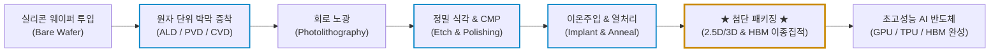
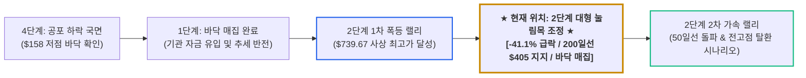

# 어플라이드 머티어리얼즈(Applied Materials, AMAT) 실전 재무 및 독점 가치 분석 보고서

- **작성일**: 2026-09-04
- **데이터 기준**: 2026 회계연도 3분기(2026년 7월 말 마감, 8월 13일 공시) 실적, 최근 3개월 핵심 뉴스(2026.06~08) 및 yfinance 시장 데이터(2026-09-04 기준)

사상 최대 분기 실적을 찍고도 고점 대비 41% 폭락했다며 공포에 질려 도망치는 대중의 무지함을 비웃어라. 반도체 미세화의 물리적 한계를 뚫어내는 '재료 공학'의 절대 제왕, 어플라이드 머티어리얼즈(AMAT)가 왜 지금 바겐세일 구간에 들어섰는지 최근 3개월 뉴스 데이터와 숫자로 증명한다.

## 핵심 요약

| 구분 | 주요 내용 |
| :--- | :--- |
| **종목명 (티커)** | 어플라이드 머티어리얼즈 (Applied Materials, Inc., NASDAQ: `AMAT`) |
| **최종 투자 가치 점수** | **91.0점 / 100점** (`Strong Buy` / 전공정 장비 포트폴리오 1위 기업의 강력한 바겐세일) — 산출 근거는 6.1절 참조 |
| **주요 사업 영역** | 반도체 제조 핵심 전공정 장비(박막 증착, 정밀 식각, CMP, 이온주입, 결함 계측), 첨단 패키징 솔루션, 글로벌 서비스(AGS) |
| **현재 주가 & 52주 밴드** | 현재가 **$435.91** (52주 범위: $158.82 ~ $739.67) 52주 고점 대비 **-41.1% 대형 조정**, 50일선($537.98, -19.0%) 하회하나 200일선($405.93, +7.4%) 지지 사수 중 |
| **최근 분기 실적 (FY26 Q3)** | 매출액 **91억 1,500만 달러**(YoY +24.8%), Non-GAAP EPS **$3.50**(YoY +41.1%)로 컨센서스($3.39) 상회 |
| **다음 분기 가이던스 (FY26 Q4)** | 매출액 중간값 **102억 5,000만 달러** 제시, 역사상 최초로 분기 매출 100억 달러 돌파 예고 |
| **수익성 & 현금창출력** | 분기 매출총이익률 **50.3%**, 분기 영업이익률 **33.7%**, 분기 영업현금흐름 **30억 8,000만 달러**, 순현금 재무구조(부채비율 28.7%) |
| **기술적 사이클 위치** | **2단계 상승 국면 내 대형 눌림목 조정**: 마이클 버리의 숏 베팅과 단기 투매 물량을 200일 장기 추세선 위에서 소화 중 |
| **핵심 투자 포인트** | • **AI 첨단 패키징 폭발**: 2026년 첨단 패키징 매출 YoY **+70% 이상 폭증** 전망 (HBM 및 2.5D/3D 이종집적 필수재) • **재료 공학 독점 해자**: 2nm 이하 GAA(Gate-All-Around)와 3D DRAM 전환 시 AMAT 장비 없이는 웨이퍼 생산 불가 • **빅테크 CAPEX 슈퍼사이클 낙수효과**: 오라클 200억$, 테슬라 168억$, TSMC 600억~640억$ 자본지출과 인텔 200억$ 설비 자금 조달의 최대 수혜 • **피어 빅4 중 압도적 저평가**: 선행 PER 23.6배·PEG 0.88·P/S 11.2배로 ASML(27.5배/1.49/17.9배), KLA(25.9배/1.63/16.6배), 램리서치(25.3배/1.35/15.8배)를 전 지표에서 하회 |
| **핵심 모니터링 리스크** | 200일 이동평균선($405.93) 지지선 이탈 여부, 미 연준 워시 의장의 금리 매파 기조(할인율 충격), 대중국 수출 규제 노이즈 |

---

## 1. 비즈니스 실체: '반도체 공장의 쌀'을 쥐고 흔드는 진짜 권력

어플라이드 머티어리얼즈(Applied Materials, AMAT)는 반도체를 직접 설계하거나 조립하는 회사가 아니다. 전 세계 반도체 제조 공장이 돌아가도록 **필수 장비와 생산 도구를 공급하며, 전공정 장비 포트폴리오의 폭에서 세계 1위를 차지한 반도체 장비 공룡**이다.

반도체 제조는 수백 단계의 원자 단위 화학·물리 공정을 거친다. 실리콘 웨이퍼 위에 원자 몇 개 두께로 박막을 입히는 **증착(Deposition)**, 불필요한 회로를 정밀하게 깎아내는 **식각(Etch)**, 표면을 화학적으로 평탄화하는 **CMP**, 불순물을 주입하는 **이온주입**까지 AMAT의 장비가 없으면 TSMC든 삼성전자든 인텔이든 단 1장의 최첨단 칩도 만들어내지 못한다.

### 1.1 3대 핵심 사업 포트폴리오

특정 단위 공정에만 치우친 경쟁사들과 달리, AMAT는 전공정 장비부터 후공정 첨단 패키징까지 하나의 턴키(Turn-key) 솔루션으로 묶어 파는 유일무이한 종합 포트폴리오를 자랑한다.

| 사업 부문 | 주요 공급 장비 및 솔루션 | 핵심 역할 및 독점 경쟁력 | AI 인프라 연계 독점 수혜 포인트 |
| :--- | :--- | :--- | :--- |
| **반도체 시스템 (Semiconductor Systems)** | • 원자층 증착(ALD), 화학기상증착(CVD), 물리증착(PVD) • 유전체/금속 플라즈마 식각(Etch), CMP 연마, 이온주입 • 전자빔(eBeam) 웨이퍼 패턴 결함 검사 및 계측 장비 | 웨이퍼 전공정 전반에 걸친 종합 장비 공급 (매출 비중 약 73%) | 2nm 이하 GAA 공정 전환 및 HBM3E/HBM4 적층용 초정밀 박막 증착 독점 |
| **어플라이드 글로벌 서비스 (AGS)** | • 장비 유지보수, 순정 소모품 및 부품 교체 • 팹 가동률 최적화 소프트웨어 및 AI 수율 관리 SLA | 전 세계에 깔린 수만 대의 장비 기반 반복적 고마진 캐시카우 (매출 비중 약 22%) | 고객사 공장 가동률이 올라갈수록 구독형으로 따박따박 꽂히는 고순도 영업이익 |
| **디스플레이 및 인접 부문 (Display & Adjacent)** | • OLED 및 차세대 마이크로 LED 제조 장비 • 스마트 안경용 광학 웨이브가이드(에실로룩소티카 제휴) | 프리미엄 디스플레이 및 AR 글래스용 첨단 소재 코팅 설비 | 온디바이스 AI 스마트폰 및 스마트 글래스용 초고해상도 패널 양산 독점 |

### 1.2 반도체 턴키 제조 가치사슬 내 AMAT의 지배력

ASML이 노광(Photolithography) 한 분야의 강자라면, AMAT는 노광 전후에 일어나는 모든 박막 형성, 식각, 연마, 첨단 패키징을 수직 계열화하여 고객사를 락인(Lock-in)한다.

### 1.3 필리프 라퐁(Coatue)의 곡괭이 철학: "칩 경쟁의 승자를 점칠 필요가 없다"

헤지펀드 코튜 매니지먼트의 설립자 필리프 라퐁이 폭로했듯, 엔비디아의 GPU가 이기든, 구글의 TPU가 이기든, 아마존의 트레이니움이 이기든 상관없다. 새로운 AI 가속기 경쟁자가 쏟아져 나와도 그 모든 칩은 예외 없이 AMAT의 장비로 만들어진다.

골드러시 때 금을 캐겠다고 달려든 광부들은 대부분 파산했지만, 곡괭이와 청바지를 독점 판매한 자는 절대 망하지 않았다. 엔비디아의 단기 실적이나 경쟁 구도에 일희일비하며 밤잠을 설치는 하수들과 달리, 진짜 스마트머니는 반도체 공장의 곡괭이를 독점한 AMAT를 담는다.

---

## 2. 최근 3개월 핵심 뉴스 및 실적 흐름 심층 분석 (2026년 6월 ~ 8월)

### 2.1 2026년 여름 핵심 뉴스 타임라인 (팩트 vs 노이즈)

| 일자 | 주요 뉴스 및 시장 이벤트 | 영향도 | 스마트머니 관점의 핵심 분석 및 시사점 |
| :--- | :--- | :---: | :--- |
| **08.31** | **미즈호, "메모리 공급부족으로 장비주 극심한 저평가"** | `🟢 호재` | AI 인프라 확충으로 구형 DRAM까지 사들이는 극심한 쇼티지 발생. AMAT·LRCX 성장 펀더멘털 대비 주가 저평가 지적 |
| **08.28** | **연준 워시 의장 매파 기조 재확인 & 국채금리 급등** | `🔴 매크로` | 2% 물가 목표 미흡 시 추가 금리 인상 시사. 베어 플래트닝 발작으로 개별 악재 없이 AMAT -4.29%, LRCX -5.24% 동반 하락 |
| **08.19** | **아거스(Argus), 목표주가 $600 상향 (구조적 수혜주)** | `🟢 호재` | LLM, AI 에이전트, 온디바이스 AI 확대 및 미국 정부의 반도체 공급망 리쇼어링 정책의 최대 수혜주로 평가. 당일 주가는 -3.53%로 무반응 |
| **08.14** | **UBS, 마진 가이던스 눈높이 미달 지적 (목표가 $675)** | `🟡 노이즈` | 실적은 컨센서스를 넘겼으나 램리서치 대비 마진 상향 폭이 낮다는 이유로 매도 출회. 당일 -5.12%. 그러나 DRAM/파운드리 점유율 확대는 지속 확인 |
| **08.13** | **★ FY26 Q3 실적 발표 (장 마감 후) ★** | `🟢 팩트` | **매출 $91.15억(YoY +24.8%), Non-GAAP EPS $3.50 vs 컨센서스 $3.39(+3.1% 상회)**. FY26 Q4 매출 가이던스 중간값 $102.5억 제시 |
| **08.12** | **인텔, 200억 달러 공모 자금 조달 발표** | `🟢 호재` | 인텔이 파운드리 및 첨단 패키징 설비 확충 재원으로 200억 달러 조달. 집행 시 ASML, AMAT, LRCX 장비 구매로 직결. 당일 +4.29% |
| **08.06** | **테슬라, 텍사스에 168억 달러 규모 Terafab 건설 발표** | `🟢 호재` | 테슬라 로봇, xAI, 스페이스X AI 칩 자급을 위한 초대형 팹 신설. AMAT, LRCX, KLAC 수주 파이 급증 |
| **08.05** | **마이클 버리, S&P500 1987년형 대폭락 경고 및 숏 유지** | `🔴 노이즈` | 빅쇼트 마이클 버리가 AI 자금조달 지속가능성에 의문을 제기하며 AMAT, NVDA, MU 공매도 포지션 유지 발표 |
| **08.04** | **씨티(Citi), WFE 시장 전망 상향 & Catalyst Watch 선정** | `🟢 호재` | WFE 시장 '26년 1,500억$ &rarr; '27년 1,900억$ &rarr; '28년 2,500억$ 폭증 전망. 목표가 $710 유지. 당일 +5.48% 급등 |
| **07.29** | **중국 DUV 노광장비 개발 노이즈 & AI ROI 경계감** | `🔴 노이즈` | 중국 메모리 캐파 확장 우려로 반도체주 투매. AMAT -8.40%, MU -9.94% 급락하며 시장 공포 극대화 |
| **07.28** | **HSBC, '28년 WFE 시장 2,720억 달러 상향 (목표가 $683)** | `🟢 호재` | ASML 생산능력 확대 및 파운드리 투자 가속 반영해 목표주가를 $522에서 $683으로 대폭 상향. 그럼에도 당일 주가는 -7.82% 폭락 |
| **07.17** | **TSMC, 2026년 CAPEX 600억~640억 달러로 대증액 발표** | `🟢 호재` | AI 메가트렌드 가시성 확인하며 자본지출 대폭 상향. 캔터 피츠제럴드는 AMAT를 섹터 Top Pick으로 선정. 당일 주가는 -5.57% 역주행 |
| **07.13** | **미 빅테크 임원들 역대급 내부자 매수 (28인 매수)** | `🟢 스마트머니` | 센티먼트레이더 발표. 주가 조정 국면에서 XLK 구성 기업 경영진들의 유통시장 직접 매수가 연초 대비 2배로 폭증 |
| **07.13** | **스티펄(Stifel), AI 에이전트 확산으로 WFE 폭증 (목표가 $650)** | `🟢 호재` | AI 에이전트 구동에 필요한 비탄력적 반도체 공급 해소를 위해 장비 수요 급증. 메모리 LTA 계약 안정성 강조 |
| **07.01** | **마이클 버리, AMAT 신규 공매도 포지션 공개** | `🔴 노이즈` | 6월 30일 장중 사상 최고가($739.67, 종가 $722.23) 부근에서 캐터필러와 함께 숏 진입. 이후 주가 급락의 기폭제로 작용 |
| **06.29** | **B.라일리, AMAT 목표주가 $790 제시 (월가 최고가)** | `🟢 호재` | 메모리 공급부족 지속 및 첨단 패키징 프로세스 밀도 심화로 AMAT 점유율 확대 확신. 당일 +10.82% 급등 |
| **06.24** | **코튜 필리프 라퐁, "AI 칩 전쟁의 승자 점칠 필요 없이 AMAT 매수"** | `🟢 스마트머니` | 엔비디아, TPU, 트레이니움 중 누가 이기든 AMAT 장비는 필수라는 점을 강조하며 펀드 핵심 비중 편입 |
| **06.23** | **BofA, 반도체 TAM '30년 2.7조 달러 전망 (목표가 $720)** | `🟢 호재` | AI 데이터센터 투자 '28년까지 지속. 2030년 WFE 시장 2,920억 달러 전망 |
| **06.17** | **에실로룩소티카와 스마트 안경 광학 기술 장기 공동개발(JDA)** | `🟢 사업 확장` | 증강현실(AR) 및 AI 스마트 안경용 광학 웨이브가이드 연구개발 협약. 소재공학 기반 인접 시장 진출 |
| **06.11** | **오라클 200억 달러 CAPEX 발표로 반도체 장비 랠리** | `🟢 호재` | 오라클의 인프라 투자 폭탄에 힘입어 AMAT 하루 만에 **+11.19% 급등** (종가 $552.05) |
| **06.11** | **캔터 피츠제럴드, 반도체 공급부족 장기화로 WFE 상향 (목표가 $650)** | `🟢 호재` | 클린룸 확보 지연으로 반도체 숏티지 3년간 지속 전망. 장비 기업들의 슈퍼사이클 확인 |

### 2.2 뉴스 흐름으로 본 4대 핵심 구조적 변화와 스마트머니의 의도

- **① 마이클 버리의 사상 최고가 숏 베팅과 개미들의 패닉 셀**:
    - 마이클 버리는 6월 30일 AMAT가 사상 최고가 $739.67을 찍은 바로 그 자리에서 숏을 쳤다. 이후 7~8월 중국 노광장비 개발설, 연준 워시 의장의 금리 발작, 마진 가이던스 트집 등 온갖 그럴듯한 악재가 쏟아지며 주가는 $435까지 41% 곤두박질쳤다.
    - 버리의 숏은 단기 과열 구간에서의 '가격 차익 거래'였을 뿐, AMAT의 공장과 기술력이 망가진 것이 아니다. 그러나 개미들은 주가가 40% 빠지자 공포에 질려 200일선 바닥에서 주식을 집어 던졌다.
- **② 빅테크의 천문학적 CAPEX 전쟁과 WFE 시장 폭증**:
    - 뉴스를 자세히 들여다보면 돈의 흐름은 명확하다. **오라클 200억 달러, 테슬라 168억 달러(Terafab), TSMC 600억~640억 달러**가 자본지출로 확정됐고, 여기에 **인텔이 설비 확충 재원 200억 달러를 조달**하며 실탄을 장전했다.
    - 글로벌 IB(BofA, 씨티, HSBC, 캔터)들이 입을 모아 WFE(웨이퍼 팹 장비) 시장 규모를 2026년 1,500억 달러에서 2028년 2,500억~2,720억 달러, 2030년 2,920억 달러로 줄상향했다. 장비 수요는 이제 막 2차 슈퍼사이클로 진입했다.
- **③ 미즈호가 경고한 '메모리 쇼티지'와 AMAT의 저평가**:
    - 미즈호는 AI 인프라 급증으로 DRAM 공급이 바닥나 기업들이 구형 DRAM까지 사들이는 기현상이 벌어지고 있다고 경고했다. 메모리 제조사들의 HBM3E/HBM4 증설과 DRAM 미세화 전환은 AMAT의 증착·식각 장비 없이는 불가능하다.
- **④ 호재에도 주가가 빠지는 구간이 진짜 기회다**:
    - 7월 17일 TSMC의 CAPEX 대증액(-5.57%), 7월 28일 HSBC의 목표가 $522→$683 대폭 상향(-7.82%), 8월 13일 컨센서스 상회 실적 발표 직후(-5.12%). 명백한 호재가 나온 날마다 주가는 오히려 두들겨 맞았다.
    - 같은 여름 조정장에서 XLK 구성 기업의 28명 최고 경영진은 유통시장에서 자기 돈으로 자사 주식을 쓸어 담았다. 언론이 공포를 조장하는 동안, 내부 사정을 가장 잘 아는 임원들은 주가 폭락을 절호의 매집 기회로 활용했다. 뉴스와 주가가 반대로 갈 때가 수급이 뒤집히는 자리다.

### 2.3 FY26 Q3 어닝 서프라이즈와 Q4 '100억 달러 분기' 선언

8월 13일 장 마감 후 발표된 분기 실적은 어설픈 내러티브가 아니라 현금으로 찍힌 진짜 팩트다.

| 실적 항목 | FY26 Q3 (2026.07 마감) | 전년 동기 (FY25 Q3) | YoY 증감 | 냉혹한 판정 및 팩트 |
| :--- | :---: | :---: | :---: | :--- |
| **총매출액 (Revenue)** | **$91.15억 ($9.115B)** | $73.02억 | **+24.8%** | AI 가속기 및 첨단 DRAM 라인 증설 수혜로 사상 최대 분기 매출 달성 |
| **Non-GAAP 희석 EPS** | **$3.50** | $2.48 | **+41.1%** | 고마진 AI 장비 믹스 개선으로 매출 증가율(+24.8%)의 1.7배에 달하는 이익 폭발 |
| **매출총이익률 (Gross Margin)** | **50.3%** | 48.8% | **+1.5%p** | 인플레이션을 고객에게 전가하는 독점력 입증 |
| **영업이익률 (Operating Margin)** | **33.7%** | 30.6% | **+3.1%p** | 천문학적인 R&D 투자를 퍼붓고도 33%가 넘는 영업이익률 사수 |
| **분기 영업현금흐름** | **$30.8억 ($3.08B)** | $26.34억 | **+16.9%** | 한 분기 만에 30억 달러가 넘는 영업현금을 창출 |
| **주주환원 (자사주 매입+배당)** | **$14.2억** | $14.24억 | **보합** | 벌어들인 영업현금의 절반을 자사주 소각과 배당으로 주주에게 즉각 환원 |

- **컨센서스 대비 성적표**: 시장 EPS 컨센서스는 **$3.39**였고 실제는 **$3.50**으로 **+3.1% 상회**했다. 화려한 대형 서프라이즈는 아니지만, 매출·마진·현금흐름이 동시에 개선된 전형적인 '체질 개선형' 실적이다. 그런데 시장은 다음 날 -5.12%로 응답했다. 이기고도 맞은 것이다.

| 최근 5개 분기 매출 궤적 | FY25 Q3 | FY25 Q4 | FY26 Q1 | FY26 Q2 | FY26 Q3 (최신) |
| :--- | :---: | :---: | :---: | :---: | :---: |
| **총매출액 ($B)** | $7.30 | $6.80 | $7.01 | $7.91 | **$9.12** |
| **전분기 대비 (QoQ)** | +2.8% | -6.9% | +3.1% | +12.8% | **+15.2%** |

| FY26 분기별 전년 동기 대비 성장률 | FY26 Q1 | FY26 Q2 | FY26 Q3 |
| :--- | :---: | :---: | :---: |
| **전년 동기 매출** | $7.17B | $7.10B | $7.30B |
| **YoY 성장률** | **-2.1%** | **+11.4%** | **+24.8%** |

- **역성장 바닥에서 두 분기 만에 27%p를 뒤집었다**: 겁먹은 자들이 "반도체 장비는 끝났다"고 떠들던 FY26 1분기, AMAT는 실제로 **-2.1% 역성장**을 찍었다. 그 바닥에서 단 두 분기 만에 +24.8%까지 튀어 올랐다. 이게 사이클이 돌아섰다는 가장 확실한 증거다. 매끄러운 우상향 그래프보다 바닥을 찍고 꺾어 올린 궤적이 훨씬 강력하다.
- **첨단 패키징(Advanced Packaging) 매출 YoY +70% 폭증 공식화**:
    - AI 모델이 거대해지면서 칩을 하나로 크게 만드는 것은 수율상 불가능해졌다. 여러 개의 칩렛(Chiplet)과 HBM을 2.5D/3D로 묶는 첨단 패키징이 AI 하드웨어의 성패를 가른다. 경영진은 2026년 첨단 패키징 관련 연간 매출이 전년 대비 **70% 이상 수직 상승**할 것이라고 못 박았다.
- **FY26 4분기 매출 가이던스 중간값 102억 5,000만 달러 ($10.25B)**:
    - 반도체 장비 역사상 단일 분기 매출 100억 달러를 돌파하는 최초의 신기록을 예고했다. 월가 컨센서스는 이보다 높은 $103.1억, EPS는 $4.06(전년 동기 $2.17 대비 +87%)을 잡고 있다. 실적 둔화? 피크아웃? 숫자는 정반대의 대호황을 가리키고 있다.

---

## 3. 경쟁 해자 및 피어 그룹 잔혹 비교

### 3.1 기술 및 특허 해자: 대체 불가능한 특허의 성벽

- **재료 공학(Materials Engineering) 절대 독점**: 2nm 이하로 내려갈수록 기존 실리콘 재료는 전기 누설과 발열로 타버린다. 몰리브덴, 루테늄 등 신소재 금속 배선과 원자층 제어 특허는 AMAT가 싹쓸이하고 있다.
- **TSMC·삼성·SK하이닉스와의 30년 R&D 동맹**: 주요 고객사 팹의 파일럿 라인에는 AMAT 연구원들이 상주한다. 반도체 설계 단계부터 AMAT의 장비 물성에 맞춰 공정을 짜기 때문에 후발 주자가 가격을 깎고 들어올 틈이 전혀 없다.

### 3.2 글로벌 반도체 장비 빅4 정밀 비교

세계 반도체 장비 시장을 지배하는 **AMAT, ASML, 램리서치(LRCX), KLA** 4사를 냉혹하게 대조한다.

| 비교 지표 | 어플라이드 머티어리얼즈 (`AMAT`) | ASML (`ASML`) | 램리서치 (`LRCX`) | KLA (`KLAC`) |
| :--- | :---: | :---: | :---: | :---: |
| **주력 독점 영역** | **박막 증착, 식각, CMP, 턴키 전공정** | EUV 노광 장비 독점 | 낸드(NAND) 및 고종횡비 식각 | 결함 검사 및 계측(Metrology) |
| **매출 규모 (TTM)** | $308.4억 (빅4 중 2위) | **$353.3억** | $232.3억 | $135.8억 |
| **시가총액 (Market Cap)** | $3,459억 | **$6,323억** | $3,662억 | $2,260억 |
| **매출 성장률 (YoY)** | +24.8% (2위) | +21.3% | **+30.0%** | +15.2% |
| **선행 PER (Forward P/E)** | **23.6배 (빅4 중 최저)** | 27.5배 | 25.3배 | 25.9배 |
| **PEG 비율 (PEG Ratio)** | **0.88 (빅4 중 최저)** | 1.49 | 1.35 | 1.63 |
| **주가매출비율 (P/S)** | **11.2배 (빅4 중 최저)** | 17.9배 | 15.8배 | 16.6배 |
| **매출총이익률 (TTM)** | 49.4% | 52.7% | 50.5% | **61.3%** |
| **자기자본이익률 (ROE)** | 41.1% | 53.9% | 65.1% | **87.5%** |
| **장단점 및 실체** | **전공정 턴키 장악, 매출 2위인데 밸류에이션은 꼴찌** | 노광 독점력 최강, 그만큼 몸값도 최고 | 식각 집중으로 성장 최고속이나 메모리 사이클 변동성 큼 | 마진·ROE 최강이나 시장 파이 자체가 작음 |

!!! note "비교 총평: 체급은 2위인데 가격표는 꼴찌"
    피어 비교의 결론은 단순하다. **AMAT는 매출 $308억으로 빅4 중 2위, 시가총액은 3위**다. 벌어들이는 돈에 비해 시장이 매기는 값이 한 칸 아래라는 뜻이다.

    그 괴리는 배수에서 그대로 드러난다. **선행 PER 23.6배, PEG 0.88, P/S 11.2배로 세 지표 전부 빅4 최저**다. 특히 P/S 격차가 잔인하다. 경쟁사들이 매출의 15.8~17.9배를 받는 동안 AMAT는 11.2배에 거래된다. 같은 매출 1달러에 시장이 매기는 값이 **29~37% 싸다**는 얘기다.

    물론 마진과 ROE는 빅4 중 가장 낮다. 당연하다. ASML은 노광, KLA는 계측이라는 초고마진 니치 하나에 집중하지만 AMAT는 전공정 전 영역을 다 커버한다. **포트폴리오 폭을 마진으로 지불한 구조**다. 대신 어느 공정 하나가 무너져도 나머지가 받쳐준다. 성장률도 램리서치(+30.0%)에 이어 2위로, 결코 뒤처지는 숫자가 아니다.

    정리하면 이렇다. **가장 넓은 포트폴리오를 가장 싼 값에 살 수 있는 자리**. 마진 몇 %p를 트집 잡아 30% 넘는 밸류에이션 할인을 정당화하려는 자들에게 넘겨줄 물건이 아니다.

---

## 4. 기술적 사이클 위치: 2단계 상승 국면 내 대형 눌림목 조정

스탠 와인스타인(Stan Weinstein)의 4단계 사이클 모델로 냉정하게 진단하면, AMAT는 **2단계 상승 국면 (Markup Phase) 내의 대형 눌림목 조정** 구간에 위치해 있다.

### 4.1 기술적 위치를 결정하는 4대 지표

| 기준선 | 값 | 현재가($435.91) 대비 | 기술적 판정 및 냉혹한 의미 |
| :--- | :---: | :---: | :--- |
| **52주 최고가** | $739.67 | **-41.1%** | 사상 최고가 대비 40% 이상 빠진 공포 구간 (개미들의 패닉 셀 물량 출회) |
| **50일 이동평균선** | $537.98 | **-19.0%** | 단기 이동평균선을 하회하며 단기 모멘텀 조정이 진행 중 |
| **200일 이동평균선** | $405.93 | **+7.4%** | **대세 상승 추세의 생명선인 200일선을 완벽히 지켜내며 지지선 구축** |
| **52주 최저가** | $158.82 | **+174.5%** | 대세 상승 파동의 바닥을 딛고 중기 우상향 추세 뼈대 유지 |

### 4.2 국면 판단의 3대 근거

- **① 이번 조정 국면에서 200일 장기 추세선을 단 한 번도 내주지 않았다**:
    - 6월 30일 사상 최고가에서 시작된 이번 하락 파동의 최저 종가는 7월 29일의 $435.98이었다. 당시 200일 이동평균선은 $369.66. 고점 대비 41% 폭락하며 공포가 극에 달했지만, **장기 기관 투자자의 생명선인 200일선까지는 근처도 가지 못했다.** 4단계(사망 선고)가 아니라 2단계 상승 파동 내의 거대한 가격 조정이다.
    - 200일선을 마지막으로 내준 것은 2025년 9월 초, 주가가 $160 언저리에 있던 1단계 바닥 매집 구간이었다. 그 뒤로 1년 가까이 200일선 위에서만 놀았다.
- **② 50일선(-19%) 이탈에 따른 악성 매물 소화**:
    - 단기 급등에 편승했던 단타 개미와 신용 물량이 50일선 이탈 과정에서 강제 청산되었다. 손바뀜이 일어나며 악성 매물이 씻겨 나가는 건전한 조정 과정이다.
- **③ 200일선 근접에 따른 하방 경직성 확보**:
    - 현재가 $435.91은 200일선($405.93) 위 7.4% 지점이다. 아래로는 200일선이라는 두꺼운 매물대와 기관 수급이 버티고 있고, 월가 최저 목표주가($358)까지는 17.9%의 완충 구간이 남아 있다. **위로 열린 폭(평균 목표가까지 +47.0%)이 아래로 열린 폭보다 두 배 이상 넓은 자리**, 즉 손익비가 극도로 유리한 전형적인 분할 매수 구간이다.

---

## 5. 밸류에이션 및 가격 타당성 검증

### 5.1 수익성과 현금흐름의 방어력

- **수익성 (Profitability)**: FY26 3분기 매출총이익률 50.3%, 영업이익률 33.7%를 기록했다. 후행 12개월 기준으로도 매출총이익률 49.4%를 유지하며, 최근 분기 실적이 연간 평균을 끌어올리는 중이다. 어떤 반도체 사이클 충격도 버텨낼 수 있는 마진 방패다.
- **현금흐름 및 재무 건전성 (Cash Flow & Balance Sheet)**: 분기 30억 8,000만 달러의 영업현금흐름을 창출했고, 92억 3,000만 달러의 현금성 자산을 쥐고 있다. 총차입금(73억 5,000만 달러)을 전액 갚고도 19억 달러가 남는 **순현금 기업**이며, 부채비율은 28.7%에 불과하다. 빚더미에 앉은 레버리지 기업들과는 차원이 다르다.

### 5.2 밸류에이션 지표 및 월가 IB 목표주가 추이

| 밸류에이션 지표 | 현재 수치 | 시장 의미 및 냉정한 해석 |
| :--- | :---: | :--- |
| **현재 주가 (Current Price)** | **$435.91** | 52주 최고가($739.67) 대비 -41.1%, 52주 최저가 대비 +174.5% |
| **시가총액 (Market Cap)** | **$3,459억 ($345.9B)** | 반도체 장비 빅4 중 매출 2위, 시가총액 3위 체급 |
| **과거 12개월 PER (Trailing P/E)** | **37.58배** | 후행 12개월 EPS $11.60 기준. 사이클 저점이 포함된 구간이라 높아 보일 뿐이다 |
| **선행 12개월 PER (Forward P/E)** | **23.62배** | **컨센서스 EPS $18.46(후행 대비 +59%) 기준. 이 이익 점프가 후행 PER과 선행 PER의 14배 격차를 만든 원인이다** |
| **PEG 비율 (PEG Ratio)** | **0.88** | 1.0 미만으로 실적 성장률 대비 주가가 헐값에 거래 중. 빅4 중 유일한 1.0 미만 |
| **주가매출비율 (P/S)** | **11.22배** | 피어 빅4 중 가장 낮은 매출 배수 (경쟁사 15.8~17.9배) |
| **자기자본이익률 (ROE)** | **41.07%** | 주주 자본을 굴려 연 41%의 이익을 찍어내는 효율. 다만 빅4 중에서는 가장 낮다 |
| **월가 컨센서스 투자의견** | **Strong Buy** | 애널리스트 35인 참여 (골드만삭스, BofA, 씨티, HSBC 등 매수 추천) |
| **월가 평균 목표주가** | **$640.89** | 현재가 대비 **+47.0%** 상승 여력 존재 |
| **주요 IB 목표가 (최신)** | **B.라일리 $790 / BofA $720 / 씨티 $710 / HSBC $683 / UBS $675 / 아거스 $600** | 주요 글로벌 투자은행 전원이 현 주가 대비 **+37.6% ~ +81.2%** 상방 타깃 제시 |
| **월가 최고 목표주가** | **$900.00** | 현재가 대비 **+106.5%** (GAA 및 3D HBM 전면 장악 시나리오) |
| **월가 최저 목표주가** | **$358.00** | 현재가 대비 **-17.9%** (극단적 대중국 수출 금지 시나리오) |

- **연간 컨센서스로 본 이익 점프의 실체**: 월가는 FY26 매출 $342.5억(+20.8%), EPS $12.79(+35.8%)를 잡고 있고, FY27은 매출 $461.3억(+34.7%), EPS $18.46(+44.3%)을 본다. 후행 PER 37.6배는 이미 지나간 사이클 저점의 잔상이고, 선행 PER 23.6배가 앞으로 마주할 현실이다. **시장은 과거 숫자로 겁을 주고, 미래 숫자로 기회를 준다.**

---

## 6. 종합 평가 및 냉혹한 계좌 실행 원칙

### 6.1 6대 핵심 투자 지표 다차원 평가 매트릭스

| 평가 영역 | 가중치 | 평점 (100점 만점) | 가중 점수 | 등급 | 냉혹한 평가 요약 |
| :--- | :---: | :---: | :---: | :---: | :--- |
| **① 비즈니스 모델 및 독점 해자** | 25% | **98점** | 24.50 | `S+` | 반도체 전공정 턴키 독점, 2nm GAA 재료 공학 대체 불가 IP |
| **② 실적 성장성 및 AI 모멘텀** | 25% | **95점** | 23.75 | `S` | 역성장 바닥에서 두 분기 만에 매출 +24.8%, EPS +41.1%, 첨단 패키징 +70% |
| **③ 현금 창출력 및 재무 건전성** | 20% | **92점** | 18.40 | `S` | 분기 OCF 30.8억 달러, 순현금 19억 달러, 부채비율 28.7%의 무결점 재무 |
| **④ 밸류에이션 매력도** | 15% | **89점** | 13.35 | `A+` | 선행 PER·PEG·P/S 세 지표 전부 빅4 최저. 매출 배수 기준 29~37% 할인 |
| **⑤ 기술적 매매 타이밍** | 10% | **75점** | 7.50 | `B` | 50일선 이탈 중이나 200일선($405) 사수로 바닥 분할 매수 최적점 |
| **⑥ 거시 리스크 관리력** | 5% | **70점** | 3.50 | `B-` | 대중국 수출 통제 노이즈 및 연준 워시 매파 금리 등 거시 변수 상존 |
| **종합 가중치 환산 점수** | **100%** | — | **91.00점** | **`Strong Buy`** | **실적은 사상 최대인데 주가는 40% 세일. 분할 매수 최우선주** |

---

### 6.2 최종 종합 결론 및 실전 행동 방침

어플라이드 머티어리얼즈(AMAT)는 실적과 가이던스가 사상 최대를 찍고 있는데 주가만 40% 이상 두들겨 맞은 **전형적인 '시장의 오독과 공포'가 낳은 바겐세일 종목**이다.

숫자는 이미 답을 말했다. 매출 $308억으로 빅4 중 2위인데 P/S는 11.2배로 꼴찌다. 성장률은 +24.8%로 2위인데 PEG는 0.88로 유일하게 1.0 아래다. 벌어들이는 돈에 비해 값이 싸다는 뜻이고, 이건 취향이나 관점의 문제가 아니라 산수의 문제다.

사상 최고가($739.67)에서 마이클 버리의 숏 베팅에 놀라 비명을 지르며 내던진 개미들의 패닉 셀 물량을, 200일선($405.93) 위에서 차분하게 받아먹는 자만이 계좌를 살찌울 수 있다. 200일선이 깨지지 않는 한 이 회사의 AI 반도체 독점력은 털끝 하나 다치지 않았다. 공포에 질린 시장을 비웃고 정해진 가격대에서 냉혹하게 주식을 쓸어 담아라.

| 구분 | 실행 조건 | 배정 비중 | 가격 기준 | 대응 방침 |
| :--- | :--- | :---: | :---: | :--- |
| **1차 진입 (현재가)** | 200일선 상회 지지 확인에 따른 선발대 진입 | 배정 자금의 **30%** | **$425 ~ $440** | 현재가 구간에서 1차 포지션 구축 |
| **2차 매수 (눌림목)** | 200일 이동평균선 리테스트 및 바닥 다지기 시 | 배정 자금의 **40%** | **$405 ~ $420** | 200일선 부근에서 가장 공격적인 물량 매집 (주력 매수 구간) |
| **3차 매수 (돌파)** | 50일 이동평균선($538) 장대양봉 거래량 돌파 시 | 배정 자금의 **20%** | **$540 이상** | 2단계 상승 랠리 재가속 확인 후 불타기 매수 |
| **예비 현금** | 매크로 시장 급변 및 대중국 돌발 규제 대응용 | 배정 자금의 **10%** | — | 조건 충족 시까지 현금 보존 |
| **1차 목표주가** | 50일선 회복 후 직전 박스권 상단 저항선 도달 | — | **$580.00 (+33.1%)** | 6개월 내 달성 목표 |
| **2차 목표주가** | 월가 평균 목표가($640.89) 도달 후 사상 최고가 탈환 | — | **$640.00 ~ $740.00** | 12개월 이상 중기 목표 |
| **손절선 (생명선)** | 200일선($405.93) 아래 2.7% 완충 구간까지 내준 뒤, 거래량 동반 주봉 종가 이탈 확정 시 | — | **$395.00 종가 이탈 시 비중 50% 축소** | 200일선 붕괴 시 리스크 관리 대응 |

!!! tip "최종 핵심 제언 (Executive Takeaway)"
    - **공포에 팔고 환호에 사는 대중의 바보짓을 반복하지 마라**: 실적이 꺾여서 떨어진 주식은 피해야 하지만, 실적과 가이던스가 사상 최대치를 갈아치우는데 주가만 떨어진 주식은 신이 주신 기회다. 고점 대비 40% 떨어진 자리에서 도망치는 자는 영원히 주식 시장의 먹잇감으로 남는다.
    - **호재에 주가가 빠진 날짜를 기억해라**: 7월 17일 TSMC 대증액에 -5.57%, 7월 28일 HSBC 목표가 31% 상향에 -7.82%, 8월 13일 컨센서스 상회 실적에 다음 날 -5.12%. 뉴스와 주가가 정반대로 갈 때가 수급이 뒤집히는 자리다.
    - **빅테크의 돈길(CAPEX)을 보라**: 오라클 200억$, 테슬라 168억$, TSMC 600억~640억$의 자본지출이 확정됐고 인텔은 설비 재원 200억$를 조달했다. WFE 시장은 2028년 2,500억~2,720억 달러로 폭증한다.
    - **200일 이동평균선($405.93)이 너의 절대 생명선이다**: 이번 조정 파동의 최저 종가($435.98)조차 당시 200일선($369.66) 근처도 가지 못했다. 200일선이 살아있는 한 2단계 대세 상승 추세는 끝나지 않았다. $405~$420 사이로 주가가 들어오면 공포에 떨지 말고 주워 담아라.
    - **단기 몰빵 금지, 철저히 3단계로 나눠서 먹어라**: 50일선 아래에 주가가 있을 때는 한 번에 사지 않는 게 철칙이다. 현재가(30%)와 200일선 부근(40%)에서 물량을 다 채우고, 50일선 돌파(20%)를 확인할 때 비중을 완성해라.
