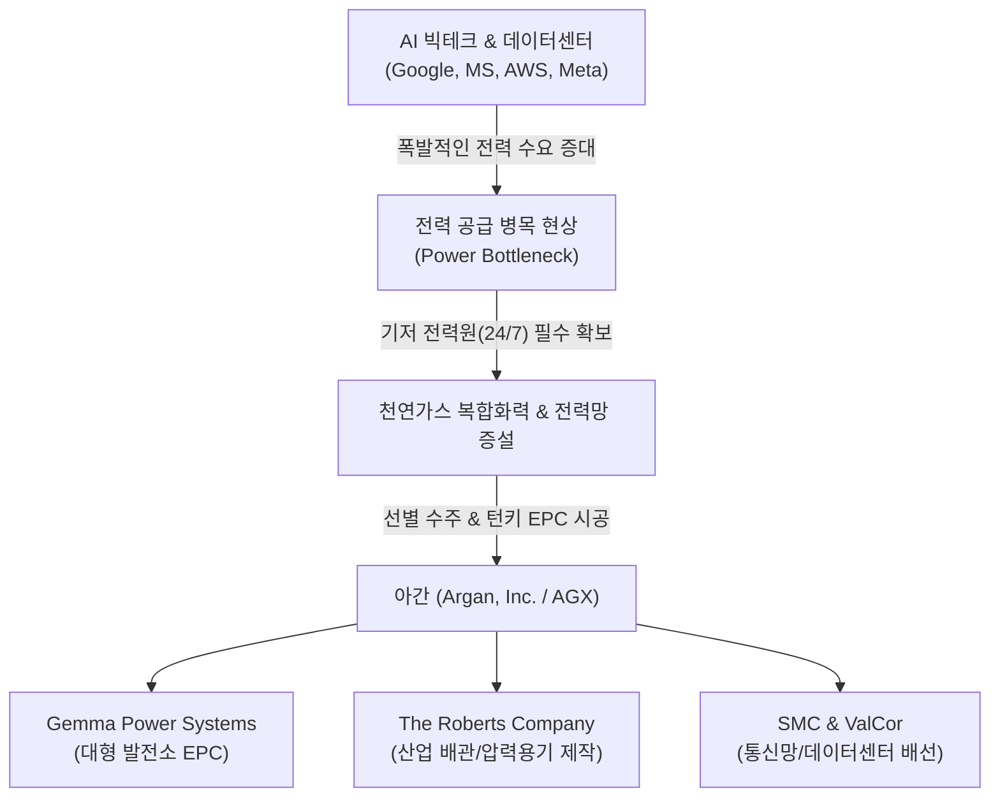
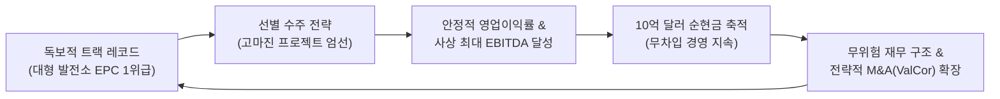
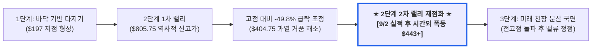

# 아간(Argan, AGX) 최신 재무 및 가치 분석 보고서

- **작성일**: 2026-09-03
- **데이터 기준**: 2026년 9월 2일 발표된 FY2027 2분기 실적(SEC Form 8-K 별첨 99.1 및 Form 10-Q, 2026년 7월 31일 마감 기준)과 동일자 종가

AI 데이터센터 발 전력 쇼티지(Power Shortage)의 실질적 수혜주이자 대규모 천연가스 복합화력 발전소 및 전력망 EPC 선별 수주, 10억 달러 무차입 순현금 자산을 보유한 아간(Argan, Inc., `AGX`)의 종합 투자 가치 및 밸류에이션 심층 분석 보고서입니다.

## 핵심 요약

| 구분 | 주요 내용 |
| :--- | :--- |
| **종목명 (티커)** | 아간 (Argan, Inc., NYSE: `AGX`) |
| **최종 투자 가치 점수** | **88.95점 / 100점** (`Buy` / 전력 인프라 상위 선호주) — 산출 근거는 7.1절 참조 |
| **주요 사업 영역** | 대형 전력 인프라 EPC, 천연가스 복합화력 발전소 건설, 신재생(BESS), 통신·데이터망 인프라 |
| **최근 주가 흐름 & 변곡점** | **역사적 최고가($805.75, 6월 30일 장중) 대비 -49.1% 급락(반토막 조정)** 후, 9월 2일 실적 직후 **시간외(After-Hours) 거래에서 +7.9% 급등($442.95) 폭발** |
| **최근 분기 실적 (FY27 Q2)** | 매출 **3억 8,398만 달러**(YoY +61.5%), 순이익 **5,330만 달러**(EPS **$3.76**), 사상 최대 실적 경신 |
| **재무 건전성 및 유동성** | 현금 및 투자자산 합계 **약 10억 2,845만 달러**, 은행 차입금 **0원 (무차입 경영)** |
| **수주 잔고 (Backlog)** | **약 25억 1,800만 달러** (전년 동기 $20억 대비 +25.9%, 단 직전 1월 말 $29억 2,900만 대비 **-14.0% 감소**) |
| **기술적 사이클 위치** | **2단계 상승 국면 (Markup Phase) 내부의 대규모 눌림목 완성 및 2차 랠리 재점화 구간** |
| **핵심 투자 포인트** | • **고점 대비 -49% 과열 해소 & 시간외 폭등**: 단기 매물 소화 후 실적 기폭제로 강력한 반등 변곡점 형성 • **AI 전력난 기저발전 수혜**: 데이터센터 전력 확보 전쟁 속 천연가스 복합화력 EPC 독점적 지위 • **사상 최대 어닝 서프라이즈**: 매출 +61.5% 급증, 분기 EPS $3.76으로 컨센서스($2.66) +41.4% 상회 • **완벽한 무차입 재무 구조**: 10억 달러 순현금 보유, 금리 변동성에 무풍지대 • **주주환원 확대**: 분기 배당 $0.375 → **$0.500 (+33.3%) 인상** 및 자기주식 $1억 4,491만 누적 매입 |
| **핵심 모니터링 리스크** | **수주 잔고 2개 분기 연속 감소($29.3억 → $25.2억)**, 선행 PER 34.6배로 밸류에이션 할인 소멸, 시간외 급등 후 정규장 갭상승 변동성, 대형 EPC 프로젝트의 공정 지연 및 자재 조달 리스크 |

---

## 1. 쉬운 회사 설명 및 비즈니스 모델

아간 (Argan, Inc., 뉴욕증권거래소 기호: `AGX`)은 대규모 전력 인프라와 발전소를 건설하고 엔지니어링 및 기술적 컨설팅 서비스를 제공하는 미국의 핵심 인프라 건설 전문 기업입니다. 주로 천연가스 복합화력 발전소, 신재생에너지(태양광 및 배터리 연계) 시설, 산업용 압력 용기 제작 및 통신망(Teledata) 인프라 구축 등의 사업을 영위하고 있습니다.

쉽게 말해, 최근 폭발적으로 증가하는 전력 수요(AI 데이터센터, 전기차, 제조업 리쇼어링 등)를 뒷받침하기 위해 **대규모 발전소와 전력망을 직접 설계하고 시공해 주는 '필수 불가결한 인프라 시공 파트너'**입니다.

### 1.1 3대 핵심 사업 부문 및 자회사 구조

아간은 지주회사 구조 아래 각 전문 분야에서 독보적인 시공 트랙 레코드를 보유한 자회사들을 통해 사업을 전개합니다.

| 사업 부문 | 주요 자회사 | 핵심 역할 및 주력 사업 | AI 인프라 연계 수혜 포인트 |
| :--- | :--- | :--- | :--- |
| **전력 사업 (Power Services)** | **Gemma Power Systems (GPS)** **Atlantic Projects Company (APC)** | • 대형 천연가스 복합화력(CCGT) 발전소 EPC • 배터리 에너지 저장장치(BESS) 및 신재생 플랜트 • 가스터빈/스팀터빈 엔지니어링 및 시공 관리 | 24시간 365일 무중단 가동이 필요한 AI 데이터센터의 필수 기저 전력원 공급 |
| **산업 엔지니어링 (Industrial Services)** | **The Roberts Company (TRC)** | • 중화학·에너지 플랜트용 대형 압력 용기 제작 • 배관 시스템 및 모듈화 구조물 엔지니어링 • 현장 정기보수 및 셧다운 턴어라운드 서비스 | 첨단 플랜트 고온·고압 배관 및 산업 설비 조달 병목 해소 |
| **통신 및 전력망 (Teledata Services)** | **Southern Maryland Cable (SMC)** **ValCor Communications** *(2026.7 인수)* | • 지하 통신망 및 전력 케이블 굴착/포설(방향성 천공) • 광케이블 백본망 및 데이터센터 내부 구조화 배선 • 초고압/저압 전력 연계 인프라 시공 | 하이퍼스케일러 데이터센터와 전력망·통신 백본을 물리적으로 직접 연결 |

!!! note "💡 왜 AI 시대에 '천연가스 복합화력'과 아간이 필수불가결할까?"
    - **간헐성 없는 24/7 기저 전력**: 태양광이나 풍력 같은 신재생에너지는 기후에 따라 발전량이 출렁이는 치명적인 간헐성을 가집니다. 초거대 AI 모델 학습과 추론을 수행하는 데이터센터는 단 1초의 전력 끊김도 용납할 수 없으므로, 즉각적이고 안정적인 전력 생산이 가능한 **천연가스 복합화력 발전소**가 유일한 현실적 대안입니다.
    - **소형원자로(SMR) 상용화 이전의 브릿지 에너지**: SMR이나 원자력 발전은 인허가와 건설에 최소 7~10년 이상 소요됩니다. 당장 2~3년 내 전력망에 연결할 수 있는 현실적인 대규모 발전원은 천연가스 터빈 발전소뿐이며, 이를 가장 빠르고 정교하게 시공할 수 있는 기업이 바로 아간입니다.

---

## 2. 최근 3개월 이내 주요 이슈 및 주가 변곡점 분석 (2026년 6월 ~ 9월)

### 2.1 고점($805.75) 대비 약 -49% 섹터 급락(Selloff)과 과열 거품 해소
* **사상 최고가 달성 후 급락 배경**: 아간(`AGX`)은 2026년 6월 30일 장중 **$805.75(종가 기준 최고 $798.55)라는 역사적 신고가**를 달성했으나, 이후 7~8월 두 달간 미국 30년물 국채금리 급등과 AI 인프라주 전반의 밸류에이션 과열 논란으로 기관들의 차익 실현 매물(Sector-led Selloff)이 쏟아졌습니다.
* **약 -49% 수직 하강과 거품 제거**: 주가는 장중 최고가 $805.75에서 9월 1일 종가 $404.75까지 **-49.8% 급락(반토막 수준 조정)**했으며, 실적 발표일인 9월 2일 종가 $410.40 기준으로는 **-49.1%** 하락한 상태였습니다. 이 조정으로 단기 과열 밸류에이션은 상당 부분 해소되었습니다.
* **수주 잔고 축소가 동반된 조정**: 같은 기간 **수주 잔고는 1월 말 $29억 2,900만에서 7월 말 $25억 1,800만으로 -14.0% 감소**했습니다. 이번 조정에는 단기 수급 요인과 더불어 향후 매출 파이프라인 축소에 대한 시장의 우려가 함께 반영된 것으로 판단됩니다.

---

### 2.2 어닝 서프라이즈와 사상 최대 실적 경신 (2026년 9월 2일 발표)
아간은 2027 회계연도 2분기(2026년 7월 31일 마감 기준)에 매출액 **3억 8,398만 달러**(전년 동기 대비 61.5% 증가), 순이익 **5,330만 달러**(주당순이익 EPS **$3.76**)를 기록하며 월가 시장 예상치(컨센서스 EPS $2.66, 매출 $2억 9,941만)를 각각 **+41.4%, +28.3% 상회**하는 역사적인 어닝 서프라이즈를 달성했습니다.

| 실적 항목 | FY27 Q2 (2026.07 마감) | FY26 Q2 (전년 동기) | 전년 동기 대비 증감률(YoY) | 시장 평가 및 판정 |
| :--- | :---: | :---: | :---: | :---: |
| **총매출액** | **$383.98M** | $237.74M | **+61.5%** | 대형 복합화력 프로젝트 공정 가속화로 폭발적 외형 성장 |
| **매출총이익** | **$74.22M** (19.3%) | $44.27M (18.6%) | **+67.7%** | 매출총이익률 0.7%p 개선, 전력 부문 단독 마진은 22% |
| **영업이익** | **$56.81M** (14.8%) | $30.06M (12.6%) | **+89.0%** | 판관비 증가율(+22.5%)이 매출 증가율을 크게 하회하며 레버리지 발생 |
| **순이익** | **$53.30M** | $35.28M | **+51.1%** | 전년 동기 법인세가 이례적으로 낮았던 기저효과로 증가율은 영업이익 대비 둔화 |
| **희석 주당순이익 (EPS)** | **$3.76** | $2.50 | **+50.4%** | 컨센서스 $2.66 대비 +41.4% 상회하는 서프라이즈 달성 |
| **조정 EBITDA** | **$70.03M** | $38.49M | **+81.9%** | 본업 현금 창출력 및 운영 마진 대폭 개선 |
| **수주 잔고 (Backlog)** | **$2.518B** | $2.0B | **+25.9%** | ⚠️ 전년 대비로는 증가했으나 **1월 말 $2.929B 대비 -14.0% 감소** |

!!! warning "실적의 이면: 수주 잔고 감소"
    이번 분기 손익계산서는 흠잡을 데 없는 사상 최대 실적이지만, **미래 매출의 선행지표인 수주 잔고는 반대 방향으로 움직였습니다.** 2026년 1월 31일 $29억 2,900만이던 백로그는 4월 말 약 $28억을 거쳐 7월 말 **$25억 1,800만**까지 두 개 분기 연속 줄었습니다.

    이는 **신규 수주 속도보다 기존 프로젝트의 매출 인식 속도가 빨랐다**는 뜻입니다. 매출이 폭발적으로 증가한 것과 백로그가 감소한 것은 같은 현상의 양면입니다. 경영진은 향후 7~15개월 내 신규 프로젝트를 추가하고 동시 수행 프로젝트를 10~12건 규모로 끌어올리겠다고 밝혔으나, **실제 신규 수주로 백로그가 반등하는지가 향후 가장 중요한 확인 지점**입니다.

---

### 2.3 실적 발표 직후 시간외 거래(After-Hours) 폭등 랠리 ($442.95+)
* **시간외 주가 수직 급등**: 9월 2일 정규장 마감($410.40) 직후 폭발적인 어닝 서프라이즈가 공시되자, 시간외 거래(Post-Market)에서 매수세가 쇄도하며 주가가 **$442.95 (+7.93%)** 까지 상승했습니다. 이는 전일 종가($404.75) 대비로는 약 +9.4%에 해당합니다.
* **숏스퀴즈 및 스마트머니 유입**: 고점 대비 반토막 난 가격대에서 사상 최대 실적이 증명되자, 공매도 포지션의 숏커버링(Short Covering)과 실적을 확인하고 진입하려던 기관 스마트머니의 대기 매수세가 맞물려 강력한 'V자 반등 트리거'가 작동했습니다.

---

### 2.4 막강한 재무 건전성 및 무차입 경영 유지
- **10억 달러를 넘어선 현금성 자산**: 2026년 7월 31일 기준 현금 및 현금성자산 **3억 6,448만 달러**와 투자자산 **6억 6,397만 달러**(단기 1억 8,341만 달러 + 장기 4억 8,056만 달러)를 합산하여 총 **10억 2,845만 달러**를 보유하고 있습니다. 직전 분기(4월 30일) $9억 7,356만에서 한 분기 만에 약 5,500만 달러가 더 늘었습니다.
- **차입금 제로(0)의 무차입 경영**: 공시상 **은행 차입금 및 금융리스 부채가 전혀 없으며(no debt)**, 소액의 운용리스 관련 부채만 존재합니다. 순현금 상태이므로 금융비용 지출이 발생하지 않습니다.
- **고금리 수혜 구조**: 현금과 투자자산 운용을 통해 이번 분기 **기타수익 순액 1,008만 달러**(전년 동기 558만 달러)를 거두었습니다. 이는 연환산 약 4,000만 달러 규모로, 세전이익의 약 15%를 차지하는 안정적인 이익 기여원입니다.
- **주주환원 확대**: 분기 배당을 주당 $0.375에서 **$0.500으로 33.3% 인상**했으며, 자기주식 매입 누적액은 **1억 4,491만 달러**에 이릅니다. 발행주식 1,582만 8,289주 가운데 유통주식은 **1,403만 2,792주**입니다.

---

### 2.5 볼트온 인수합병(M&A): ValCor Communications 인수
- **인수 개요**: 완전 자회사인 **서던 메릴랜드 케이블(Southern Maryland Cable, Inc., SMC)**이 코네티컷에 기반을 둔 통신·데이터 네트워크 시공·유지보수 기업 **'ValCor Communications, LLC'**를 인수했습니다. 거래는 **2026년 7월 31일 종결**되었으며, 초기 인수 대가는 현금과 아간 보통주를 합쳐 **약 830만 달러**입니다.
- **사업적 시너지**: ValCor는 1997년 설립되어 25년 이상 **방위·항공우주·기술 부문** 고객과 관계를 쌓아 온 기업으로, 이번 인수를 통해 텔레데이터(Teledata) 부문의 뉴잉글랜드 지역 거점과 고객 기반이 확대되었습니다. 발전소 시공(Power)에 머물지 않고 데이터망 배선과 광케이블 네트워크까지 함께 제공할 수 있는 기반을 넓혔습니다.

!!! note "인수 규모와 실적 기여 시점"
    인수 대가 **약 830만 달러**는 아간의 분기 매출(3억 8,398만 달러)의 약 2%, 보유 현금(10억 2,845만 달러)의 약 0.8%에 해당하는 **소규모 볼트온(bolt-on) 거래**입니다. 회사 CEO는 "이 볼트온 인수는 유기적으로 구축하려면 수년이 걸렸을 고객 기반으로 텔레데이터 부문의 범위를 넓힌다"라고 설명했습니다.

    거래 종결일이 **분기 마지막 날인 7월 31일**이므로 FY27 Q2 실적에 대한 기여는 발생하지 않았으며, 매출 반영은 FY27 Q3부터 시작됩니다. 지역 거점과 고객 기반 확대라는 전략적 의미를 지닌 거래이며, 단기 실적 규모를 좌우하는 인수는 아닙니다.

---

## 3. 기업의 가치 설명 및 독점적 해자 (Moat)

### 3.1 진입장벽이 높은 대형 복합화력 발전소의 독점적 트랙 레코드
- **극도로 까다로운 엔지니어링 역량**: 초대형 복합화력 발전소 시공은 고온·고압 가스터빈과 증기터빈, 열회수보일러(HRSG), 초고압 변전설비를 오차 없이 통합해야 하는 고난도 EPC 영역입니다. 경험이 없는 신규 계약업체는 진입 자체가 불가능합니다.
- **선별 수주(Selective Bidding) 전략**: 미국 내 대형 발전소를 성공적으로 완공한 트랙 레코드를 보유한 전문 시공업체는 손에 꼽힙니다. 이로 인해 아간은 발주처와의 협상에서 우위를 점하며, 마진율이 낮거나 리스크가 높은 프로젝트를 배제하고 **수익성이 확실하게 보장되는 우량 프로젝트만 골라서 수주하는 독점적 지위**를 구축했습니다.

### 3.2 메가트렌드와 맞물린 수주 잔고(Backlog) 해자와 그 한계
- **데이터센터 붐 & 리쇼어링의 기저 전력 수요**: 미국 전역의 AI 데이터센터 클러스터 증설과 반도체·배터리 공장의 리쇼어링으로 전력망 포화 상태가 지속되고 있습니다.
- **25억 달러 수주 잔고의 안정성**: 아간이 확보한 **25억 1,800만 달러**(약 3조 4천억 원) 규모의 프로젝트 백로그는 최근 12개월 매출(약 11억 8,800만 달러)의 **약 2.1년치**에 해당하며, 향후 매출과 영업이익을 상당 부분 담보해 주는 방패 역할을 합니다.
- **해자의 두께는 얇아지는 중**: 백로그는 2026년 1월 말 $29억 2,900만에서 4월 말 약 $28억, 7월 말 $25억 1,800만으로 **두 개 분기 연속 축소**되었습니다. 현재는 **해자가 유지되고 있으나 신규 수주를 통한 보충 속도가 매출 인식에 따른 소진 속도를 따라가지 못하는 상태**이며, 해자의 지속성은 향후 신규 수주 규모에 달려 있습니다.

---

## 4. 정밀 재무제표 및 분기별 실적 추이 분석 (yfinance 기반)

### 4.1 최근 6개 분기 실적 추이 비교 (FY26 Q1 ~ FY27 Q2)

공시 데이터를 바탕으로 재구성한 아간의 분기별 실적 추이입니다. 매출은 6개 분기 연속 증가했으나, **영업이익과 순이익은 FY26 Q4에서 FY27 Q1으로 넘어갈 때 한 차례 감소**한 뒤 FY27 Q2에 다시 큰 폭으로 늘었습니다. 즉 우상향 추세는 분명하지만 분기별로 매끄럽게 증가하지는 않으며, 이는 대형 프로젝트의 공정 진행률에 따라 이익이 출렁이는 EPC 업종의 구조적 특성입니다.

| 회계 분기 | 분기 마감일 | 총매출액 | 매출총이익 | 영업이익 | 당기순이익 | 희석 EPS | 순이익률 |
| :---: | :---: | :---: | :---: | :---: | :---: | :---: | :---: |
| **FY26 Q1** | 2025-04-30 | $193.66M | $36.86M | $24.34M | $22.55M | **$1.60** | 11.6% |
| **FY26 Q2** | 2025-07-31 | $237.74M | $44.27M | $30.06M | $35.28M | **$2.50** | 14.8% |
| **FY26 Q3** | 2025-10-31 | $251.15M | $46.95M | $32.63M | $30.74M | **$2.17** | 12.2% |
| **FY26 Q4** | 2026-01-31 | $262.05M | $65.60M | $47.67M | $49.21M | **$3.47** | 18.8% |
| **FY27 Q1** | 2026-04-30 | $290.95M | $61.11M | $45.40M | $46.06M | **$3.24** | 15.8% |
| **FY27 Q2** | 2026-07-31 | **$383.98M** | **$74.22M** | **$56.81M** | **$53.30M** | **$3.76** | **13.9%** |

### 4.2 재무상태표 및 자본 건전성 지표

아래 수치는 모두 **2026년 7월 31일 기준 Form 10-Q 재무상태표**를 근거로 합니다.

| 재무 항목 (2026-07-31 기준) | 수치 | 평가 및 분석 |
| :--- | :---: | :--- |
| **현금 및 현금성 자산** | **$364.48M** | 풍부한 즉각 가용 현금 유동성 |
| **단기 투자자산 (Short-term Investments)** | **$183.41M** | 만기 1년 이내 국채 및 우량 금융상품 |
| **장기 투자자산 (Long-term Investments)** | **$480.56M** | 만기 1년 초과 운용 자산 |
| **합산 현금 및 투자자산** | **$1,028.45M** (약 10.3억$) | 시가총액($5.75B)의 약 **17.9%**에 달하는 막강한 현금 버퍼 |
| **총 유동자산 (Total Current Assets)** | **$1,318.47M** | 프로젝트 운전자본을 포함한 단기 지급 능력 |
| **총 차입금 (Total Debt)** | **$0** | 은행 차입금 및 금융리스 부채 전무, 소액 운용리스 부채만 존재 |
| **순현금 (Net Cash)** | **+$1,028.45M** | 완전한 무차입 상태로 금리 변동에 무관한 재무 구조 |
| **총부채 (Total Liabilities)** | **$894.13M** | 대부분 프로젝트 선수금 및 매입채무 등 무이자성 영업부채 |
| **자기자본 (Stockholders' Equity)** | **$506.84M** | 자기주식 $144.91M 차감 후 기준, 직전 분기 대비 증가 |
| **자기자본이익률 (ROE)** | **35.4%** | 최근 4개 분기 순이익 $179.31M ÷ 기말 자기자본 기준 |
| **영업이익률 (Operating Margin)** | **15.4%** (TTM) 14.8% (당분기) | 일반 건설/EPC 기업 평균(4~6%)을 크게 상회하는 고마진 |

!!! tip "재무 분석 핵심 인사이트"
    일반적인 건설·인프라 기업들은 대형 프로젝트 착공을 위해 막대한 부채를 조달하여 금융비용 부담이 큰 반면, 아간은 **선수금 중심의 프로젝트 파이낸싱 구조와 철저한 원가 관리** 덕분에 **10억 달러가 넘는 순현금을 보유한 채 완전 무차입 경영**을 이어가고 있습니다.

    총부채 $894.13M 가운데 상당 부분은 **발주처로부터 미리 받은 선수금**입니다. 이는 이자를 물지 않는 자금이라는 점에서 유리하지만, 동시에 **향후 시공을 통해 이행해야 할 의무**에 해당합니다. 보유 현금 가운데 실제 가용 자금의 규모를 보여 주는 지표로는 회사가 별도로 공시하는 **재무상태표상 순유동성**이 적합하며, 그 값은 직전 분기 기준 **$421.4M** 수준입니다.

---

### 4.3 13F 공시 기반 주요 기관 및 스마트머니 헤지펀드 지분 현황

미국 증권거래위원회(SEC)의 최신 13F 분기 공시(2026년 6월 30일 기준)에 따르면, 아간(`AGX`)은 대형 인덱스 운용사와 퀀트·펀더멘털 헤지펀드가 함께 지분을 보유하고 있는 종목입니다.

**평가액은 13F 규정에 따라 분기 말일인 2026년 6월 30일 종가 $798.55를 기준으로 산정한 금액이며, 그 이후의 주가 변동은 반영되어 있지 않습니다.**

| 기관 / 헤지펀드명 | 보유 주식수 (Shares) | 보유 평가액 (6/30 기준) | 지분 변동률 (QoQ) | 투자 주체 성격 및 핵심 의미 |
| :--- | :---: | :---: | :---: | :--- |
| **블랙록 (BlackRock, Inc.)** | **2,209,112주** | **약 $17.64억** (약 2조 3,900억 원) | 신규 보고 ※ | 최대 주주 (유통 주식의 약 **15.7%** 보유), 글로벌 1위 운용사 |
| **뱅가드 그룹 (Vanguard Group)** | **1,372,823주** | **약 $10.96억** (약 1조 4,800억 원) | **+50.31%** | 2대 주주, 2분기 중 지분 50% 이상 추가 편입 |
| **르네상스 테크놀로지 (Renaissance Tech)** | **648,379주** | **약 $5.18억** (약 7,000억 원) | **+6.14%** | **짐 사이먼스가 창업한 대표 퀀트 헤지펀드**, 지속 매수 우위 |
| **아메리칸 센추리 (American Century)** | **447,983주** | **약 $3.58억** (약 4,840억 원) | **+6.25%** | 가치·성장 혼합형 운용사, 지속적 지분 확대 |
| **T. 로우 프라이스 (T. Rowe Price)** | **420,104주** | **약 $3.35억** (약 4,540억 원) | **+357.30%** | **글로벌 대표 성장주 운용사**, 2분기 중 지분을 **약 4.6배로 확대** |
| **론 파인 캐피털 (Lone Pine Capital)** | **368,673주** | **약 $2.94억** (약 3,980억 원) | **-6.22%** | **타이거 컵 계열 스티븐 만델**의 펀더멘털 롱숏 헤지펀드 |

!!! note "13F 데이터 해석 시 유의사항"
    - **※ 블랙록 변동률**: 일부 데이터 제공처는 블랙록의 2026년 2분기 보유분을 **신규 편입(약 $17.6억 규모)** 으로 집계합니다. 이는 실제 신규 매수라기보다 그룹 내 보고 주체 통합에 따른 표기 변경일 가능성이 있으므로, 변동률만으로 매수 강도를 판단하지 않는 편이 안전합니다.
    - **13F는 45일 지연 공시**입니다. 6월 30일 기준 보유 현황이 8월 중순에 공개되므로, 7~8월의 급락 구간에서 각 기관이 실제로 어떻게 대응했는지는 **다음 분기(9월 30일 기준) 공시가 나와야 확인**할 수 있습니다.
    - 표의 지분 변동률은 데이터 제공처 집계치이며, 펀드 내 비중은 제공처마다 산정 기준이 달라 이 보고서에서는 인용하지 않았습니다.

#### 유명 투자자 및 스마트머니 보유의 4대 핵심 시사점

- **① 르네상스 테크놀로지(Renaissance Technologies)의 퀀트 알고리즘 픽**:
    - 수학적 알고리즘과 통계 모델에 기반해 투자하는 대표적 퀀트 펀드 르네상스 테크놀로지가 **648,379주(약 5억 1,780만 달러 / 약 7,000억 원)**를 보유하고 있으며, 2분기에도 지분을 +6.14% 늘렸습니다. 퀀트 모델이 재무 건전성(무차입), 잉여현금흐름, EPS 모멘텀 팩터를 긍정적으로 평가하고 있음을 시사합니다.
- **② 타이거 컵 계열 스티븐 만델(Lone Pine Capital)의 보유**:
    - 줄리안 로버트슨 문하에서 출발한 스티븐 만델의 론 파인 캐피털이 **368,673주(약 2억 9,440만 달러)**를 보유하고 있습니다. 2분기 중 지분은 **-6.22% 축소**되었습니다. 펀더멘털 롱숏 헤지펀드로서 포지션 자체는 유지하되 비중은 소폭 줄이는 방향으로 대응한 것으로 해석됩니다.
- **③ T. 로우 프라이스(T. Rowe Price)의 지분 대폭 확대**:
    - 성장주 전문 운용사 T. 로우 프라이스가 2분기 한 분기 만에 보유 지분을 **약 4.6배로 확대(전분기 대비 +357.3%)** 했습니다. 6월 30일 기준 공시이므로, 7~8월 급락 이전에 매집이 이루어졌다는 점을 감안해야 합니다.
- **④ 높은 기관 보유 비율에 따른 수급 구조**:
    - 아간의 기관 보유 주식수는 약 **1,464만 6천 주**로 유통 주식(1,403만 2,792주)의 **약 104%**에 해당하며, 보유 기관 수는 약 **656개**입니다. 100%를 넘는 것은 공매도를 위한 주식 대차 과정에서 동일 주식이 중복 집계되기 때문이며, 실질적으로는 **유통 물량 대부분이 기관에 묶여 있다**는 의미로 해석하는 것이 타당합니다.
    - 유통 물량이 제한적이므로 공매도 포지션이 쌓인 상태에서 호재가 나오면 9월 2일 시간외 거래(+7.9%)처럼 **숏스퀴즈(Short Squeeze)로 인한 단기 급등**이 나타나기 쉬운 구조입니다. 다만 이 구조는 반대 방향으로도 작동하여, 악재 발생 시 **하락 폭 역시 증폭**된다는 점을 함께 인식해야 합니다. 6월 말 이후 -49% 급락이 그 사례입니다.

---

## 5. 기술적 흐름 및 사이클 국면 분석 (4단계 사이클 모델)

스탠 와인스타인(Stan Weinstein)의 주가 4단계 사이클 모델을 기준으로 분석했을 때, 현재 아간(`AGX`)의 주가 흐름은 **2단계 상승 국면 (Markup Phase) 내부의 대규모 눌림목(약 -49%)을 완성하고, 9월 2일 실적 발표 직후 시간외 폭등과 함께 '2차 상승 파동'을 재점화한 변곡점**에 위치해 있습니다.

### 5.1 사이클 위치 판단 3대 근거

- **① 고점($805.75) 대비 약 -49% 하락으로 기관 차익 매물 소화**:
    - 6월 30일 장중 $805.75 사상 최고가에서 9월 1일 종가 $404.75까지 **-49.8%(반토막 수준 조정)** 하락하며 단기 과열 밸류에이션과 투기적 단타 물량을 상당 부분 털어냈습니다. $400선에서 심리적·기술적 지지력을 확인했으나, **지지 구간을 형성한 기간이 아직 짧아 바닥 확정으로 단정하기는 이릅니다.**
- **② 실적 발표 직후 시간외 거래(After-Hours) 수직 급등 ($442.95+)**:
    - 2026년 9월 2일 장 마감 직후 사상 최대 어닝 서프라이즈(매출 +61.5%, EPS $3.76)가 공시되자마자, 시간외 거래에서 매수세가 폭발하며 주가가 **$442.95 (+7.9% 이상) 돌파**했습니다. 공매도 숏스퀴즈와 기관 대기 매수세가 맞물려 단기 하락 추세를 V자로 깨뜨리는 강력한 반전 신호가 발생했습니다.
- **③ 메가트렌드와 실적 성장의 완벽한 일치 (2차 랠리 돌입)**:
    - AI 데이터센터 전력 쇼티지라는 구조적 메가트렌드와 분기 순이익 5,330만 달러라는 사상 최대 실적이 확인됨에 따라, 전고점($805.75)을 향한 2단계 2차 상승 파동(Wave 2 Markup)의 조건이 갖추어졌습니다. 다만 **수주 잔고가 25억 1,800만 달러로 감소한 상태이므로, 2차 파동이 전고점까지 이어지려면 신규 수주 확대가 뒷받침되어야 합니다.**

!!! warning "단기 매매 시 주의사항"
    시간외 거래에서 이미 +7.9% 급등한 만큼, 익일 정규장 개장 시 갭상승(Gap-up) 출발에 따른 단기 차익 실현 매물이 초반에 출회될 수 있습니다. 시초가 추격 매수보다는 갭 상승 후 시초가 지지 여부나 장중 눌림목을 활용한 분할 진입이 현명합니다. 또한 **시간외 거래는 거래량이 얇아 정규장 시초가가 시간외 가격을 그대로 이어받지 않는 경우가 많다**는 점도 감안해야 합니다.

---

## 6. 향후 밸류에이션 및 시장 가치 전망

### 6.1 향후 3~6개월 성장성 및 수익성 전망
- **공정 본격화에 따른 매출 인식 지속**: 수주 잔고 25억 1,800만 달러에 포함된 대형 복합화력 프로젝트들의 터빈 설치 및 전력망 연계 공정이 진행되면서, 향후 3~6개월간 분기 매출은 높은 수준을 유지할 전망입니다.
- **프로젝트 마진 방어**: 고정비 부담이 적고 선별 수주 전략을 유지하고 있어 **12~16% 범위의 순이익률**을 이어갈 것으로 예상됩니다. 최근 6개 분기 순이익률은 11.6%에서 18.8% 사이에서 움직였으며, 직전 분기는 13.9%였습니다.
- **시장 컨센서스는 하반기 둔화를 예상**: FY2027 연간 컨센서스 EPS는 **$11.86**입니다. 상반기 누계 EPS가 **$7.01**이므로, 시장은 **하반기 EPS를 $4.85 수준으로 상반기보다 낮게** 보고 있습니다. 수주 잔고 감소와 맞물린 전망이며, 향후 3~6개월 실적은 상반기 대비 둔화될 가능성을 감안해서 접근하는 편이 합리적입니다.

### 6.2 시장 재평가(Re-rating)와 밸류에이션 매력도

현재 아간(AGX)의 주가는 역사적 고점 대비 반토막 난 위치에서 어닝 서프라이즈를 맞이했습니다. 주가 수준만 보면 큰 폭의 조정이지만, **이익 전망이 함께 하향된 결과 배수(Multiple) 기준의 밸류에이션은 피어 그룹과 유사한 수준**에 있습니다.

| 밸류에이션 지표 | 현재 수치 | 시장 평균 및 피어 그룹 대비 평가 |
| :--- | :---: | :--- |
| **정규장 종가 (Close)** | **$410.40** | 실적 발표일 종가 (52주 고점 $805.75 대비 **-49.1%** 하락 상태) |
| **시간외 주가 (After-Hours)** | **$442.95 (+7.93%)** | 어닝 서프라이즈 직후 급등 랠리 전개 |
| **전고점 회복 시 기대 수익률** | **+96.3%** | 역사적 전고점($805.75) 회복 시 2배 가까운 주가 상승 잠재력 |
| **시가총액 (Market Cap)** | **$5.75B** | 순현금 10.3억$를 감안하면 실질 기업가치(EV)는 약 **$4.72B** |
| **과거 12개월 PER (Trailing P/E)** | **32.4배** | TTM EPS $12.66 기준 |
| **선행 PER (Forward P/E)** | **34.6배** | FY27 컨센서스 EPS **$11.86** 기준 (⚠️ 과거 PER보다 높음) |
| **주당순이익 (EPS)** | **TTM $12.66** **FY27 컨센서스 $11.86** | 상반기 누계 $7.01 + 하반기 컨센서스 $4.85 |
| **월가 평균 목표주가** | **$667.80** | **현재가 대비 +62.7% 상방 여력 보유** |
| **월가 최고 목표주가** | **$800.00** | 전고점 수준까지 리레이팅 시 **+94.9% 상승 여력** |
| **주당 배당금 (Dividend)** | **연 $2.00 (배당수익률 0.49%)** | 분기 배당 $0.375 → **$0.500 인상** 반영, 추가 증액 여력 보유 |

!!! danger "주목할 밸류에이션 신호: 선행 PER이 과거 PER보다 높은 구조"
    통상 성장 기업은 미래 이익이 늘어나므로 **선행 PER이 과거 PER보다 낮게** 형성됩니다. 아간은 현재 그 반대 구조에 있습니다.

    - 과거 12개월 PER: **32.4배** (TTM EPS $12.66)
    - 선행 PER: **34.6배** (FY27 컨센서스 EPS $11.86)

    이는 **시장이 향후 12개월 이익을 지난 12개월보다 낮게 보고 있다**는 의미입니다. 배경에는 수주 잔고 감소와, 상반기에 빠르게 인식된 매출의 기저효과가 있습니다.

    주가가 하락하는 동안 이익 전망도 함께 조정되었으므로, **배수 기준의 할인 폭은 크지 않은 상태**입니다. 이 종목의 주가 상승 논리는 절대적 저평가보다는 **신규 수주 회복에 따른 컨센서스 상향** 시나리오에 연결되어 있습니다.

### 6.3 글로벌 인프라 피어 기업과의 비교

| 비교 항목 | 아간 (Argan, `AGX`) | 콴타 서비시스 (`PWR`) | 마스텍 (`MTZ`) | 이엠코어 (`EME`) |
| :--- | :---: | :---: | :---: | :---: |
| **주력 분야** | **발전소 EPC & 통신망** | 송배전 전력망 구축 | 통신·에너지 인프라 | 전기·기계 설비 |
| **부채 구조** | **완전 무차입 (순현금 10.3억$)** | 순부채 60억$ 이상 | 순부채 35억$ 이상 | 순현금 10억$ 수준 |
| **영업이익률 (TTM)** | **15.4%** | 8.2% | 5.4% | 8.9% |
| **ROE** | **35.4%** | 16.5% | 7.8% | 27.2% |
| **선행 PER (Fwd P/E)** | **34.6배** | 35.2배 | 28.6배 | 27.8배 |

!!! note "피어 비교 해석"
    아간은 **수익성(영업이익률 15.4%, ROE 35.4%)과 재무 구조(완전 무차입)에서는 피어 그룹을 확실하게 앞섭니다.** 콴타 서비시스나 마스텍이 각각 60억, 35억 달러 이상의 순부채를 안고 있는 것과 비교하면 재무적 우위는 분명합니다.

    반면 **밸류에이션에서는 할인 요인이 관찰되지 않습니다.** 선행 PER 34.6배는 콴타 서비시스(35.2배)와 사실상 같은 수준이며, 마스텍(28.6배)과 이엠코어(27.8배)보다는 높습니다. 시장은 아간의 우월한 수익성과 무차입 구조를 이미 주가에 반영하고 있는 것으로 판단됩니다.

    ※ 아간의 수치는 2026년 7월 31일 기준 공시 자료를, 피어 3사(PWR, MTZ, EME)의 수치는 각사 최근 공시 및 시장 컨센서스를 기준으로 합니다.

---

## 7. 종합 평가 및 최종 투자 가치 점수

### 7.1 6대 핵심 투자 지표 다차원 평가 매트릭스

| 평가 영역 | 가중치 | 평점 (100점 만점) | 가중 점수 | 등급 | 핵심 평가 요약 |
| :--- | :---: | :---: | :---: | :---: | :--- |
| **① 비즈니스 모델 및 해자** | 25% | **94점** | 23.50 | `S` | 복합화력 발전소 EPC의 높은 진입장벽과 선별 수주 지배력 |
| **② 실적 성장성 및 수주잔고** | 25% | **87점** | 21.75 | `A+` | FY27 Q2 매출 +61.5%, EPS $3.76 서프라이즈는 최상급이나 **백로그 -14.0% 감소로 감점** |
| **③ 재무 건전성 및 현금흐름** | 20% | **99점** | 19.80 | `S+` | 10.3억 달러 순현금, 차입금 제로(0)의 무결점 재무 구조 및 배당 33% 인상 |
| **④ 밸류에이션 매력도** | 15% | **74점** | 11.10 | `B+` | 전고점까지 +96% 업사이드는 매력적이나 **선행 PER 34.6배로 피어 대비 할인 소멸** |
| **⑤ 기술적 매매 타이밍** | 10% | **88점** | 8.80 | `A` | $400선 지지 확인 후 시간외 급등으로 2단계 2차 상승 파동 재점화 |
| **⑥ 리스크 관리 가능성** | 5% | **80점** | 4.00 | `A-` | 공기 지연 리스크는 통제 가능하나 **수주 파이프라인 축소 리스크가 신규 부각** |
| **종합 가중치 환산 점수** | **100%** | — | **88.95점** | **`Buy`** | **AI 전력 인프라 사이클의 실질 수혜주이나, 밸류에이션 할인은 이미 해소** |

!!! info "평점 산출 근거"
    종합 점수는 각 영역 평점에 가중치를 곱해 합산한 값입니다.
    `94×0.25 + 87×0.25 + 99×0.20 + 74×0.15 + 88×0.10 + 80×0.05 = 88.95점`

    수익성과 재무 구조(①③)는 최상위 등급에 해당하는 반면, **수주 잔고 감소(②)와 선행 PER이 과거 PER을 상회하는 구조(④)** 가 평점을 제약하는 요인으로 작용했습니다. 종합 등급은 **`Buy`** 입니다.

---

### 7.2 최종 종합 결론 및 실행 제언

아간(Argan, `AGX`)은 **역사적 최고가($805.75) 대비 약 -49% 급락하여 과열이 해소된 직후, 사상 최대 어닝 서프라이즈와 시간외 급등($442.95, +7.93%)을 동반하며 2차 상승 파동의 출발점에 섰습니다.** 다만 **수주 잔고 감소와 선행 PER 역전**이라는 두 가지 상반된 신호가 함께 존재하므로, 공격적 집중 투자보다는 **분할 접근과 확인 후 증액** 방식이 적합합니다.

| 구분 | 주요 액션 아이템 및 가이드 | 비중 및 가격 밴드 | 실행 일정 및 기준 |
| :--- | :--- | :---: | :--- |
| **1차 분할 매수** | 시간외 급등 후 정규장 갭상승 초반 매물 소화 시 분할 진입 | 해당 종목 배정 자금의 40~50% | **$420 ~ $445 구간 분할 매수** |
| **추가 매수 (확인 후)** | 거래량 실린 $500 안착 및 단기 하락 추세선 돌파 확인 시 | 해당 종목 배정 자금의 30~40% | **$490 ~ $510 돌파 확인 시** |
| **1차 목표주가** | 실적 리레이팅 및 월가 평균 컨센서스 도달 | **$667.80 (+62.7%)** | 3~6개월 중기 관점 |
| **2차 목표주가** | 역사적 전고점($805.75) 수렴 | **$805.00 (+96.2%)** | 6~12개월 장기 관점 **단, 신규 수주 회복이 전제 조건** |
| **손절 및 리스크선** | $400 심리적 지지선 및 이번 실적 반등 저점 붕괴 시 | **$390.00 종가 이탈** | 전량 비중 축소 및 리스크 관리 |
| **⚠️ 시나리오 점검 시점** | **FY27 Q3 실적(2026년 12월 예정)의 수주 잔고 발표** | — | 백로그가 재차 감소하면 **투자 논리 재검토 필요** |

!!! tip "최종 핵심 제언 (Executive Takeaway)"
    **강점은 분명합니다.** 주가가 고점 대비 반토막 난 구간에서도 본업은 **매출 +61.5%, EPS $3.76(컨센서스 +41.4% 상회), 영업이익 +89.0%, 순현금 10억 2,845만 달러**라는 사상 최고의 실적을 기록했습니다. 차입금이 전혀 없는 재무 구조와 분기 배당 33.3% 인상은 경영진의 이익 창출 지속성에 대한 자신감을 보여 줍니다.

    **동시에 두 가지 제약 요인이 존재합니다.** 첫째, **수주 잔고가 두 개 분기 연속 감소하여 $25억 1,800만**이 되었습니다. 매출을 빠르게 인식한 결과이기도 하지만, 신규 수주가 그 속도를 따라가지 못했음을 함께 의미합니다. 둘째, **선행 PER 34.6배가 과거 PER 32.4배를 상회합니다.** 시장은 향후 12개월 이익 둔화를 이미 가격에 반영하고 있습니다.

    종합하면 현 구간은 **가격 매력에 기반한 저가 매수 구간이라기보다, AI 전력 수요라는 구조적 추세가 실제 신규 수주로 이어지는지를 확인하며 비중을 조절하는 구간**에 해당합니다. 위험 대비 보상은 우호적이나, 그 전제는 **신규 수주를 통한 수주 잔고의 회복**입니다. 이 전제가 확인되면 전고점을 향한 리레이팅 여력이 열리고, 확인되지 않으면 투자 논리를 재점검해야 합니다.

!!! note "투자 유의사항"
    본 보고서는 공개된 재무 데이터 및 시장 컨센서스를 기반으로 작성된 분석 자료이며, 특정 종목에 대한 매수/매도 권유가 아닙니다. 모든 투자의 최종 결정과 책임은 투자자 본인에게 있습니다.
