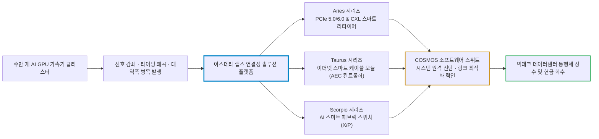
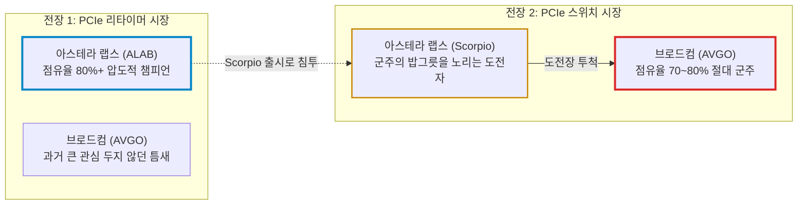
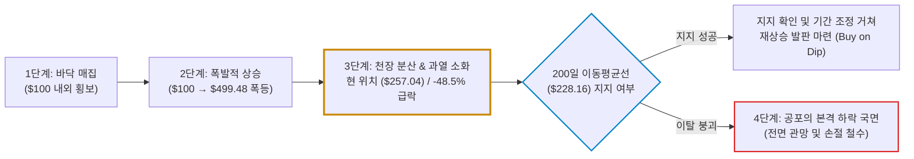

# 아스테라 랩스(Astera Labs / ALAB) 실전 재무 및 가치 분석 보고서

- **작성일**: 2026-09-15
- **데이터 기준**: 2026 회계연도 2분기(2026-06-30 종료, 8월 4일 발표) 실적 및 yfinance 시장 데이터 (2026-09-15 기준)

대중은 엔비디아의 GPU와 AI 챗봇 껍데기에만 열광하지만, 수만 개의 고성능 칩이 제 속도를 내도록 물리적 혈관을 뚫어주고 통행세를 걷는 진짜 실세는 아스테라 랩스다. 전년 동기 대비 104% 폭증한 매출과 73.7%에 달하는 비GAAP 총마진은 독점적 연결성 해자를 증명하지만, 52주 고점($499.48)에서 반토막(-48.5%)이 난 주가와 베타 3.78의 극단적 변동성은 이 종목이 아직 3단계 과열 매물을 소화하는 냉혹한 시험대 위에 서 있음을 말해 준다.

## 핵심 요약

| 구분 | 핵심 요약 |
| :--- | :--- |
| **종목 및 주가** | 아스테라 랩스 (NASDAQ: `ALAB`) / **$257.04** (52주 범위 $97.89 ~ $499.48, 고점 대비 **-48.5%**) |
| **최종 투자의견** | **조건부 분할 매수 (Buy on Dip)** / 200일선($228) 지지력 확인 후 단계적 진입 (투자 가치 점수 **85.9점**, 6.1절) |
| **비즈니스 본질** | PCIe 6.0/CXL 리타이머(Aries)와 AI 패브릭 스위치(Scorpio)로 AI 서버 클러스터 병목을 해소하는 연결성 팹리스 플랫폼 |
| **핵심 매력 (Bull)** | Q2 매출 YoY +104% 폭증($3.92억), 비GAAP 총마진 73.7% 및 영업이익률 39.1%, Scorpio X 양산 1분기 조기 달성, 순현금 12억 달러 돌파 |
| **핵심 리스크 (Bear)** | 소수 하이퍼스케일러 고객 집중도, 고점 대비 -48.5% 급락에 따른 3단계 천장 매물대 잔존, 베타 3.78의 극단적 변동성, P/S 37.1배 |
| **포트폴리오 성격** | AI 인프라 병목을 뚫는 **초고성장 공격수 위성 포지션(최대 3% 캡)** / **원금보존형, 배당 생활자, 심약한 단타족은 매수 금지** |

---

## 1. 비즈니스 실체: GPU가 아니라 '신호 왜곡과 통행세'를 틀어쥔 연결 독점 빨대

대중은 AI라고 하면 엔비디아의 GPU와 오픈AI의 화려한 챗봇 껍데기만 쳐다본다. 그러나 수천 개, 수만 개의 고성능 가속기를 한곳에 묶어놓으면 가장 먼저 터지는 문제는 연산 성능 부족이 아니라 **'데이터 전송 지연(Latency)과 신호 왜곡(Signal Degradation)'**이라는 물리적 병목이다.

구리 배선과 광섬유 위를 오가는 전자의 속도가 칩의 연산 속도를 따라가지 못하면, 수백억 달러짜리 GPU 클러스터는 데이터를 기다리느라 멍때리는 거대한 고철 덩어리로 전락한다. 아스테라 랩스는 바로 이 고속 데이터 고속도로에서 신호를 증폭·복원하고 교통 체증을 분산시키는 고성능 **연결성 솔루션(Connectivity Solutions)**을 독점적으로 공급하는 핵심 팹리스 기업이다.

### 1.1 4대 핵심 제품군: 어디서 통행세를 걷는가

- **① Aries (PCIe/CXL 스마트 리타이머 & 리드라이버)**:
    - 데이터 전송 거리가 길어질수록 감쇄되고 왜곡되는 고주파 신호를 가로채서 완전히 복원(Retiming)해 주는 필수 칩이다.
    - PCIe 5.0은 물론 최신 표준인 PCIe 6.0 및 CXL 규격을 선도적으로 지원하며, 서버 내 GPU-CPU, 가속기-메모리 간 고속 데이터 이동의 표준으로 자리 잡았다. 경쟁사가 흉내 내기 힘든 초저지연·초저전력 설계를 무기로 시장을 사실상 선점했다.
- **② Taurus (이더넷 스마트 케이블 컨트롤러 / AEC)**:
    - 랙(Rack) 내 서버와 ToR(Top-of-Rack) 스위치 사이를 연결하는 액티브 구리 케이블(AEC)용 신호 처리 반도체다.
    - 값비싸고 전력을 많이 먹는 광트랜시버 대신, 고속 구리선에서 신호를 정밀하게 복원해 데이터센터 구축 및 운영 비용(TCO)을 획기적으로 낮춰준다.
- **③ Scorpio (AI 스마트 패브릭 스위치)**:
    - 단순 리타이머 공급사를 넘어 종합 AI 인프라 플랫폼으로 진화시키는 승부수다.
    - 가속기 클러스터 간 대규모 연결을 제어하는 PCIe 스위치로, 헤드룸이 큰 GPU 간 데이터 스위칭을 최적화한다. 특히 Scorpio X 시리즈는 320레인(Lane)의 압도적 대역폭을 지원하며 엔비디아, AMD, 클라우드 커스텀 ASIC 생태계 모두에 침투하고 있다.
- **④ COSMOS (소프트웨어 관리 플랫폼)**:
    - 아스테라 랩스 칩셋을 한 번 쓰면 다른 칩으로 쉽게 바꿀 수 없는 진짜 해자다.
    - 하드웨어에 탑재된 센서를 통해 신호 무결성, 링크 안정성, 온도, 장애 징후를 실시간으로 모니터링하고 원격 최적화하는 임베디드 소프트웨어 스위트다. 하이퍼스케일러들은 장애 한 번에 수억 달러가 날아가는 것을 막기 위해 COSMOS 소프트웨어에 종속될 수밖에 없다.

### 1.2 해자의 실체: 초기 설계 락인(Design-Win)과 네트워크 효과

아스테라 랩스의 경쟁력은 단순히 반도체 스펙이 뛰어나다는 데 그치지 않는다. 주요 글로벌 하이퍼스케일러(마이크로소프트, 아마존 AWS, 구글 등) 및 엔비디아와 차세대 AI 서버의 초기 기획·설계 단계부터 공동 엔지니어링을 진행하는 **디자인 윈(Design-Win)** 파이프라인을 틀어쥐고 있다.

차세대 서버 보드에 아스테라 랩스의 칩셋 레이아웃과 핀맵, COSMOS 펌웨어가 박히면, 경쟁사가 더 싼 칩을 들고 온다 한들 보드를 다시 설계하고 수개월간 신뢰성 테스트를 거칠 빅테크는 없다. 이 잔혹한 전환 비용(Switching Cost)이 바로 73%가 넘는 경이로운 마진율의 원천이다.

### 1.3 심층 해부: 대체 불가능한 절대 해자인가, 기술력 뛰어난 'One of them'인가?

대중이 기술주를 볼 때 가장 흔하게 저지르는 착각이 바로 **"지금 시장 점유율이 80%를 넘으니 영구 불멸의 독점 기업이다"**라고 믿어버리는 것이다.

냉혹하게 까발려 말한다. 아스테라 랩스는 **'대체 불가능한 신의 기술을 가진 기업'이 절대 아니다.** 그렇다고 시장에 널리고 널린 **'흔해 빠진 One of them'도 아니다.** 이 회사의 진짜 실체는 **"표준 규격 부품 시장에서 2년 먼저 치고 나가 하이퍼스케일러 메인보드에 칩을 박아버린 '선점형 락인(First-Mover Design-Win) 챔피언'"**이다.

#### ① 왜 대중은 '대체 불가능하다'고 착각하는가? (실재하는 단기 해자)

- **물리적 병목의 타이밍 선점**: PCIe 5.0(32GT/s), 6.0(64GT/s PAM4)으로 대역폭이 뛸 때마다 구리 배선 위에서 신호 도달 거리가 급격히 쪼그라들었다. 엔비디아 H100·B200 서버 보드를 만들 때 수십 개의 GPU와 CPU 사이에 신호 복원 칩(리타이머)이 필수였는데, 빅테크가 양산할 준비가 된 시점에 안정적인 Gen5/Gen6 칩을 대량 납품할 수 있었던 회사는 아스테라 랩스(Aries)가 유일했다.
- **보드 재설계의 잔혹한 전환 비용**: 서버 메인보드는 장난감이 아니다. 보드에 아스테라 랩스 칩의 핀맵(Pin-out), 전력 공급 회로, 방열 구조를 박아두고 1년 넘게 발열과 신호 무결성 테스트를 거쳤다. 경쟁사가 10% 싼 칩을 들고 온다고 해서 수백억 달러짜리 AI 클러스터 양산을 멈추고 보드를 처음부터 다시 설계해 6~9개월간 인증 테스트를 할 빅테크는 없다.
- **COSMOS와 상호운용성(Interop) 튜닝 데이터**: 리타이머는 겉보기엔 단순 부품이지만, 수백 가지 CPU, GPU, 스위치, 광모듈과 물리적으로 신호를 주고받을 때 수많은 버그와 호환성 충돌이 터진다. 아스테라는 수년간 하이퍼스케일러들과 협업하며 축적한 방대한 호환성 펌웨어 튜닝 데이터와 원격 진단 소프트웨어(COSMOS)를 칩에 묶어 팔고 있다. 하드웨어 스펙만 베낀다고 단기간에 따라잡을 수 없는 영역이다.

#### ② 왜 '대체 불가능한 영구 독점'이 아닌가? (치명적인 구조적 한계)

- **PCIe는 표준 규격이다 (엔비디아의 CUDA가 아니다)**: 엔비디아는 전 세계 개발자들이 CUDA라는 독점 소프트웨어 언어로 코드를 짜두었기 때문에 칩을 바꾸는 게 불가능하다. 반면 아스테라 랩스의 제품은 PCI-SIG가 정한 표준 프로토콜(PCIe, CXL, Ethernet)을 따르는 하드웨어 통로 부품이다. 칩 내부 알고리즘이 뛰어나더라도 외부 인터페이스는 철저히 표준이므로, 경쟁사가 규격에 맞춰 안정적인 칩을 만들어내면 언제든 갈아 끼울 수 있는 구조다.
- **빅테크는 독점 공급자를 가장 증오한다 (듀얼 벤더 본능)**: 마이크로소프트, 구글, 아마존, 메타는 특정 부품사 하나가 73%의 총마진을 뜯어가며 배짱을 부리는 꼴을 절대 오래 두고 보지 않는다. 빅테크의 구매 제1원칙은 '듀얼 벤더(Dual Sourcing)'다. 빅테크는 지금도 마벨(Marvell), 크레도(Credo), 몽타주(Montage) 같은 후발 주자들에게 개발 자금과 스펙을 쥐어주며 2·3순위 공급사로 키우고 있다. 다음 세대 서버 폼팩터가 교체되는 시점에 빅테크는 반드시 복수 공급자를 입찰에 붙여 단가를 후려칠 것이다.
- **패브릭 스위치(Scorpio)는 독점이 아니라 '도전자'다**: 차세대 성장 동력인 Scorpio 스위치는 아스테라의 텃밭이 아니다. PCIe 스위치 시장은 브로드컴(AVGO)이 70~80%를 장악하고 있는 절대 군주의 영지다. 아스테라는 스위치 시장에서 독점자가 아니라 브로드컴의 점심밥을 뺏으러 들어간 도전자일 뿐이다.
- **광 연결(CPO / Optical I/O)이라는 장기적 위협**: PCIe 7.0(128GT/s) 이상으로 넘어가면 구리선 저항 탓에 리타이머를 아무리 박아도 신호가 죽는다. 결국 칩과 광섬유를 직접 패키징하는 실리콘 포토닉스(CPO) 기술이 본격화되면 기존 구리선 기반 리타이머의 입지는 필연적으로 좁아진다.

#### ③ 최종 판정: 계좌에서 취해야 할 현실적 시각

지금 당장(1~2년)은 아스테라 랩스가 '대체하기가 너무나 고통스러워서 사실상 독점처럼 군림하는 선점 챔피언'이 맞다. 이 기간 동안 터져 나오는 실적 폭발과 현금 창출력은 진짜다. 그러나 중장기적(3년 이후)으로는 듀얼 벤더 압박과 후발주자의 진입으로 마진이 깎여나가는 기술 부품사의 숙명을 피할 수 없다. 10년 묻어둘 코어 자산이 아니라, 인프라 증설 슈퍼 사이클 동안 강한 실적을 누리고 손익비 자리에서 치고 빠지는 **'초고수익 공격수 위성 자산'**으로 다루는 것이 정답이다.

---

## 2. 최근 실적과 시장의 오독: 대중의 착시 vs 숫자의 팩트

### 2.1 최근 3개월 핵심 타임라인 (2026.06 ~ 2026.09)

| 일자 | 주요 사건 | 시장 반응 및 데이터의 실체 |
| :--- | :--- | :--- |
| **06.20** | 주가 역사적 신고가 $499.48 기록 | AI 인프라 확장 기대감이 극에 달하며 시가총액 866억 달러, 공급자 P/S 70배 이상까지 멀티플 팽창 |
| **08.04** | 2026 회계연도 2분기 실적 발표 | 매출 $3.92억(YoY +104%), Non-GAAP EPS $0.80(컨센서스 $0.69 대비 +15.9% 서프라이즈) 달성 |
| **08.05** | Scorpio X-Series 조기 양산 공표 | 당초 일정보다 한 분기 앞당겨 320레인 스위치 양산 시작. 종합 패브릭 플랫폼 체질 전환 확인 |
| **09.03** | Citi 2026 Global TMT 컨퍼런스 | 경영진의 AI 인프라 투자 지속 확인. 그러나 빅테크 소수 고객 집중도에 대한 시장 경계감 재점화 |
| **09.15** | AI 섹터 속도 조절론 및 매크로 변동성 | 주가 $257.04로 밀리며 고점 대비 -48.5% 급락. 50일선($318.52) 이탈 후 200일선($228.16) 테스트 국면 |

### 2.2 대중의 착시 vs 숫자의 팩트

| 시장이 떠드는 것 (착시) | 데이터가 말하는 진실 (팩트) |
| :--- | :--- |
| **"주가가 반토막 났으니 성장 스토리가 꺾였다"** | 2분기 매출 성장률은 YoY +104%였고, 3분기 가이던스 역시 전분기 대비 40% 성장을 제시했다. 꺾인 것은 실적이 아니라 과열된 밸류에이션 거품이다. |
| **"단순 리타이머 칩셋은 경쟁사가 쉽게 따라잡는다"** | PCIe 6.0 및 CXL 표준 지적재산권(IP)과 COSMOS 소프트웨어 생태계가 결합된 디자인 윈 구조는 1~2년 만에 깰 수 없는 견고한 진입장벽이다. |
| **"현금 유출로 유동성 위기가 올 수 있다"** | 순현금만 약 12억 달러를 보유하고 있으며 차입성 부채는 4,441만 달러에 불과하다. 유동성 위기를 걱정할 단계가 아니라는 뜻이지, 매크로 충격에서 자유롭다는 뜻은 아니다. 이 종목을 흔드는 것은 재무 구조가 아니라 밸류에이션이다. |
| **"소수 고객 편중 때문에 언제든 버림받을 수 있다"** | 지금 당장은 양산 검증을 마친 Gen5/Gen6 리타이머 공급사가 사실상 아스테라 랩스뿐이라 단기간에 교체될 수 없다. 다만 이것은 현재 세대 보드에 한정된 우위이며, 1.3절에서 짚었듯 빅테크는 다음 폼팩터 교체 시점을 노리고 복수 공급사를 키우고 있다. |

### 2.3 2026년 2분기 핵심 재무 지표 해부

| 지표 | 수치 | 평가 및 판정 |
| :--- | :--- | :--- |
| **분기 총매출** | **3억 9,240만 달러** | 전년 동기($1.92억) 대비 **YoY +104%** 폭증. AI 서버 증설 수요 직격 흡수 |
| **비GAAP 주당순이익(EPS)** | **$0.80** | 시장 예상치($0.69)를 **+15.9% 상회**하는 어닝 서프라이즈 |
| **GAAP / 비GAAP 총마진** | **73.3% / 73.7%** | 팹리스 반도체 최상위권의 압도적 마진. 가격 결정력 건재 |
| **비GAAP 영업이익률** | **39.1%** | 막대한 R&D 지출에도 불구하고 40%에 육박하는 경이로운 이익 창출력 |
| **보유 현금성 자산** | **약 12억 5,296만 달러** | 풍부한 유동성 확보로 차세대 스위치 개발 및 설비 투자 여력 충분 |
| **차입성 부채 (Total Debt)** | **약 4,441만 달러** | 순현금 12억 달러 이상의 사실상 무차입 경영 체제 유지 |
| **차기 분기(Q3) 매출 가이던스** | **중간값 5억 5,064만 달러** | 직전 분기 대비 **QoQ 약 +40%**, 전년 동기 대비 **YoY +138.8%** 초고성장 예고 |

---

## 3. 경쟁 해자 및 피어 그룹 잔혹 비교

연결성 및 데이터센터 네트워킹 시장에서 경쟁하는 핵심 플레이어들의 지표를 동일 잣대로 발라내면 아스테라 랩스의 특수성이 명확해진다.

| 시장 지표 | 아스테라 랩스 `ALAB` | 크레도 테크놀로지 `CRDO` | 마벨 테크놀로지 `MRVL` | 브로드컴 `AVGO` |
| :--- | ---: | ---: | ---: | ---: |
| **주가 ($)** | **257.04** | 170.57 | 223.55 | 357.90 |
| **시가총액 (십억$)** | **44.59** | 32.06 | 200.91 | 1,702.71 |
| **후행 PER** | **126.0배** | 59.8배 | 74.0배 | 45.6배 |
| **선행 PER** | **40.2배** | 17.7배 | 33.3배 | 18.5배 |
| **공급자 P/S** | **37.1배** | 20.1배 | 21.3배 | 19.1배 |
| **베타 (변동성)** | **3.78** | 3.23 | 2.25 | 1.46 |
| **TTM GAAP 총마진** | **75.1%** | 68.0% | 52.2% | 68.8% |
| **TTM GAAP 영업이익률** | **22.8%** | 33.3% | 16.8% | 48.5% |

출처: yfinance 시장 데이터(2026-09-15 조회). 총마진과 영업이익률은 `ttm_income_stmt`의 `Gross Profit ÷ Total Revenue`, `Operating Income ÷ Total Revenue`다. 네 회사의 결산월이 ALAB 12월, CRDO 4월, MRVL 1월, AVGO 10월로 제각각이므로 같은 달력 구간을 비교한 값이 아니다. 또한 P/S는 시장 지표 쪽의 더 최신 TTM 매출을 쓰므로, 이익률 계산에 쓰인 매출로 역산해서 맞추려 들면 숫자가 어긋난다.

### 3.1 피어 분석의 냉혹한 결론

1. **마진율은 ALAB이 최고 수준이다**:
   - 아스테라 랩스의 총마진(75.1%)은 크레도(68.0%), 마벨(52.2%), 심지어 거인 브로드컴(68.8%)마저 능가한다. 신호 복원과 AI 스위치 영역에서 타협 없는 프리미엄을 받고 있다는 방증이다.
2. **그러나 가격표(밸류에이션) 역시 가장 비싸다**:
   - 주가가 고점 대비 반토막 났음에도 P/S 37.1배, 선행 PER 40.2배다. 크레도(P/S 20.1배, 선행 PER 17.7배)나 브로드컴(선행 PER 18.5배)과 비교하면 시장이 요구하는 성장 눈높이가 얼마나 가혹한지 알 수 있다.
3. **베타 3.78의 공포**:
   - 나스닥이나 반도체 지수가 흔들릴 때 계좌를 네 배로 강타할 수 있는 극초고변동성 종목이다. 브로드컴(베타 1.46)처럼 편안하게 장기 보유할 수 있는 수비수가 절대 아니다.

### 3.2 전장의 분리: 브로드컴이 지배자인데 아스테라 랩스는 왜 챔피언인가?

피어 비교에서 "브로드컴이 절대 군주인데 아스테라 랩스가 왜 현재 챔피언인가?"라는 의문이 드는 것은 당연하다. 링(전장)이 완전히 다른데 한 묶음으로 비교해서 생기는 착시다. 두 회사가 뛰고 있는 전장의 실체를 정확히 발라내야 한다.

#### ① 전장 1: [PCIe 리타이머(Aries)] ➔ 아스테라 랩스가 '챔피언'
- **역할**: GPU-CPU 사이 구리선에서 신호가 죽지 않게 살려내는 '신호 심폐소생술 칩'이다.
- **실체**: 브로드컴 같은 1조 달러 공룡은 칩 단가가 상대적으로 작고 메인보드마다 튜닝하느라 손이 많이 가는 이 틈새시장을 초기에 쳐다보지도 않았다. 아스테라 랩스가 이 틈을 파고들어 엔비디아 H100·B200 보드 리타이머 시장의 **80~90% 점유율을 독식**했다. 따라서 **리타이머 전장에 한해서는 아스테라 랩스가 누구도 부정할 수 없는 현재의 챔피언(수성자)**이다.

#### ② 전장 2: [PCIe 스위치(Scorpio)] ➔ 브로드컴이 '절대 군주'
- **역할**: 수십 대의 GPU, SSD, NIC 간에 데이터 트래픽을 총괄 제어하는 '거대한 데이터 고속도로 인터체인지(스위치)'다.
- **실체**: 브로드컴은 과거 최강자였던 PLX 테크놀로지를 집어삼킨 이후 데이터센터 PCIe 스위치 시장의 **70~80% 이상을 10년 넘게 독점**해 왔다. 서버에 스위치를 꽂는다면 십중팔구 브로드컴 PEX 칩이다. 브로드컴이 이 판의 **절대 군주(지배자)**인 이유다.

#### ③ 아스테라의 도발과 체급의 냉혹한 현실
아스테라 랩스는 리타이머만 팔아서는 거대 기업으로 도약할 수 없음을 안다. 그래서 브로드컴의 안방인 스위치 시장을 빼앗기 위해 320레인짜리 **Scorpio(스코르피오)**를 들고 브로드컴의 링에 **도전자(Challenger)**로 뛰어든 것이다.

| 비교 항목 | 아스테라 랩스 (`ALAB`) | 브로드컴 (`AVGO`) | 격차 및 현실 |
| :--- | :---: | :---: | :--- |
| **시가총액** | 약 **445억 달러** | 약 **1조 7,027억 달러** | **약 38배 차이** (골리앗과 다윗) |
| **TTM 매출** | 약 **12억 달러** | 약 **891억 달러** | **약 74배 차이** |
| **사업 포트폴리오** | 리타이머, AEC, PCIe 스위치 | 맞춤형 ASIC(TPU 등), 이더넷(Tomahawk), PCIe 스위치, VM웨어 | 브로드컴은 AI 인프라 전체를 지배 |

아스테라 랩스가 '챔피언'이라는 말은 **"AI 서버 신호 복원(리타이머)이라는 특정 병목 구간을 가장 먼저 틀어쥔 골목대장"**이라는 뜻이지, 브로드컴을 누른 제국의 황제라는 뜻이 절대 아니다. 오히려 Scorpio로 브로드컴의 밥그릇을 건드리기 시작했으므로, 향후 브로드컴의 보복 공세와 가격 압박 가능성까지 계산에 넣어야 한다.

---

## 4. 기술적 사이클 위치: 3단계 과열 및 천장 분산 국면

스탠 와인스타인의 4단계 사이클 모델에 비추어 보면, 아스테라 랩스는 **3단계 (천장 분산 및 변동성 심화 국면)**에 머물러 있다.

| 가격 및 기술 지표 | 수치 | 냉혹한 기술적 진단 |
| :--- | :--- | :--- |
| **52주 최고가 (06.20)** | **$499.48** | 광기의 2단계 상승 파동이 끝난 정점 |
| **현재 주가 (09.15)** | **$257.04** | 전고점 대비 **-48.5% 폭락**한 반토막 상태 |
| **50일 단순이동평균(SMA)** | **$318.52** | 주가가 50일선 아래로 **-19.3%** 크게 이탈. 단기 추세 하향 진행 중 |
| **200일 단순이동평균(SMA)** | **$228.16** | 장기 생명선. 현재가보다 **약 11.2% 낮은** 위치에 놓인 최후의 보루 |
| **52주 최저가** | **$97.89** | 지난해 하반기 조정 국면에서 형성된 저점 |

### 4.1 사이클 판단 근거

- 실적은 100% 성장하며 2단계(상승 파동)를 화려하게 지났지만, 6월 말 $499.48에서 기관들의 대규모 차익 실현 매물이 쏟아지며 전형적인 3단계 천장 분산 패턴이 완성되었다.
- 단기 이동평균선(50일선 $318.52)이 완전히 꺾여 강력한 저항선으로 변모했으며, 현재는 장기 추세 생명선인 **200일 이동평균선($228.16)**을 향해 하방 압력이 열려 있는 조정 파동이다.
- 지금 당장 반등을 예단하고 덤벼드는 것은 떨어지는 칼날을 맨손으로 쥐는 바보짓이다. 200일선 부근에서 하방 경직성을 확보하고 매물이 말라가는지 확인하는 작업이 선행되어야 한다.

---

## 5. 밸류에이션 및 가격 타당성 검증

| 지표 | 값 | 산출 기준 및 의미 |
| :--- | :--- | :--- |
| **후행 PER** | **126.0배** | 공급자 TTM EPS $2.04 기준. 여전히 절대적으로 높은 배수 |
| **선행 PER** | **40.2배** | 2027년 컨센서스 EPS $6.39 기준. 1년 뒤 이익을 미리 당겨 쓴 값이다 |
| **공급자 P/S** | **37.1배** | 공급자 TTM 매출 약 12.02억 달러 기준. 반도체 섹터 내 최상위 프리미엄 |
| **2026년 연간 EPS 컨센서스** | **$4.03** | 전년 대비 +119.1% 성장 기대치 |
| **2027년 연간 EPS 컨센서스** | **$6.39** | 전년 대비 +58.6% 추가 성장 전망 |

### 5.1 EPS 및 멀티플 민감도 분석 (가격 스트레스 테스트)

향후 12개월 동안 시장이 아스테라 랩스에 부여할 수 있는 PER 배수와 달성 가능한 EPS에 따른 가격 시나리오다.

| 시나리오 | 선행 EPS 가정 | 적용 PER 배수 | 도출 주가 | 현재가($257.04) 대비 |
| :--- | :---: | :---: | :---: | :---: |
| **하방 스트레스 (성장 둔화 & 매크로 발작)** | $5.00 | 30배 | **$150.00** | **-41.6%** |
| **보수적 방어 (컨센서스 하단)** | $5.50 | 35배 | **$192.50** | **-25.1%** |
| **기본 시나리오 (컨센서스 부합)** | $6.39 | 40배 | **$255.60** | **-0.6%** |
| **상방 확장 (Scorpio X 대폭발)** | $7.50 | 45배 | **$337.50** | **+31.3%** |

이 표가 말해주는 냉혹한 진실은 하나다. 현재 주가($257.04)는 내년 EPS $6.39와 선행 PER 40배라는 **낙관적 컨센서스를 이미 정확히 반영**하고 있다. 가이던스를 조금이라도 밑돌거나 AI 섹터 전반의 멀티플 축소가 벌어지면 $190~$200선까지 단숨에 밀려 내려갈 수 있다는 뜻이다. 이것이 지금 무턱대고 몰빵하면 안 되는 이유다.

---

## 6. 종합 평가 및 냉혹한 계좌 실행 원칙

### 6.1 6대 핵심 투자 지표 다차원 평가 매트릭스

| 평가 영역 | 가중치 | 평점 (100점 만점) | 가중 점수 | 등급 | 핵심 평가 요약 |
| :--- | :---: | :---: | :---: | :---: | :--- |
| **① 비즈니스 모델 및 해자** | 25% | **92점** | 23.00 | `S` | PCIe 6.0/CXL 리타이머 독점력, Scorpio 확장, COSMOS 락인 |
| **② 실적 성장성 및 가이던스** | 25% | **94점** | 23.50 | `S` | Q2 매출 YoY +104%, Q3 가이던스 QoQ +40%, Scorpio X 조기 양산 |
| **③ 재무 건전성 및 현금흐름** | 20% | **91점** | 18.20 | `S` | 비GAAP 총마진 73.7%, 순현금 12억 달러 이상, 사실상 무차입 경영 |
| **④ 밸류에이션 매력도** | 15% | **72점** | 10.80 | `B` | 고점 대비 반토막 났으나 P/S 37.1배, 선행 PER 40.2배로 밸류 부담 잔존 |
| **⑤ 기술적 매매 타이밍** | 10% | **70점** | 7.00 | `B-` | 3단계 천장 분산 후 급락, 50일선 이탈, 200일선($228) 지지력 검증 대기 |
| **⑥ 리스크 관리 가능성** | 5% | **68점** | 3.40 | `C+` | 200일선 기준 손절 라인은 명확하나, 베타 3.78 탓에 갭 하락이 나오면 계획한 가격에 체결된다는 보장이 없다 |
| **종합 가중치 환산 점수** | **100%** | — | **85.9점** | **`Buy`** | **독보적 펀더멘털의 괴물이나, 200일선 지지 확인 후 눌림목 저격 매수** |

### 6.2 실전 결론: "그래서 지금 어쩌라는 것인가?" (Action Verdict)

#### ① 지금 당장 사야 하는가? ➔ **"아니다. 지금 당장 전량 매수 버튼 누르지 마라."**
* **이유**: 52주 고점($499.48)에서 반토막 났다고 해서 무조건 싼 것이 아니다. 50일선($318.52) 아래로 처박힌 상태이며, 장기 생명선인 200일선($228.16)까지 약 -11.2%의 하방 갭이 아직 열려 있다.
* **지금 할 일**: 관심종목 최상단에 올려두고, 거래량이 마르면서 **200일선($225 ~ $235 구간)에서 하방 경직성과 지지 캔들이 형성되는지 지켜보는 '적극적 관망(Wait & Watch)'**이다.

#### ② 이런 주식은 누가 사고, 누가 절대 사면 안 되는가?
* **❌ 절대 사지 마라 (즉시 퇴장)**:
    * 원금에서 -10%, -20% 흔들리면 밤에 잠을 못 자는 심약한 투자자 (베타 3.78의 롤러코스터다).
    * 안정적인 배당 수익을 원하는 은퇴 생활자 (배당금은 0원이다).
    * "반토막 났으니 다음 주에 당장 50% 튀겠지"라고 기대하는 단타 투기꾼 (3단계 매물대에 머리 깨진다).
* **⭕ 반드시 눈독 들이고 주워 담아야 할 사람 (스나이퍼 대기)**:
    * AI 데이터센터의 연결성 병목과 리타이머·스위치 독점력을 명확히 이해하는 투자자.
    * 전체 계좌 자산의 **최대 3% 이내**로 철저히 한도를 묶어둘 규율이 있는 자.
    * 200일선 부근에서 손절 기준선을 엄격히 걸고 손익비 극대화 자리만 노리는 스마트 트레이더.

#### ③ 이 주식으로 '인생 역전'을 노리면 안 되는 냉혹한 이유
* **베타 3.78은 양날의 도끼다**: 주가가 오를 때 3배로 뛰지만, AI 섹터에 한파가 불면 순식간에 반토막(-48.5%)이 나는 잔혹한 변동성을 확인했다.
* **성장의 한계는 빅테크의 CAPEX가 결정한다**: 소수 하이퍼스케일러에 대한 의존도가 높아, 빅테크 중 한 곳만 차세대 랙 설계를 변경하거나 투자를 늦추면 실적 기대치가 순식간에 훼손될 수 있다.
* **포트폴리오 내 진짜 용도**: 계좌를 지켜줄 방파제가 아니라, 승률 높은 자리에서만 제한적으로 투입하는 **초고성장 공격수 위성(Satellite) 자산**이다. 코어 계좌를 여기에 몰빵하는 것은 자살행위다.

### 6.3 실전 가격대별 실행 시나리오 및 분할 매수 로드맵

종목 배정 예산 내부에서의 분할 비중이며, **전체 계좌 대비 최대 편입 한도는 3.0%**로 엄격히 제한한다.

| 구분 | 실행 조건 | 종목 예산 비중 / 계좌 한도 | 가격 기준 | 실전 대응 방침 |
| :--- | :--- | :---: | :---: | :--- |
| **관망 (현 위치)** | 50일선 아래, 200일선 도달 전 방향성 탐색 | **0%** | $257 부근 | 떨어지는 칼날에 성급히 손가락 얹지 않는다 |
| **1차 진입 (선발대)** | 200일선 지지력 확인 및 양봉 전환 | **30% / 0.9%** | **$228 ~ $238** | 최적의 손익비 타점에서 정찰대 투입 |
| **2차 매수 (주력)** | 200일선 재시험 성공 및 거래량 바닥 확인 | **40% / 1.2%** | **$220 ~ $230** | 하방 지지력 확인 후 핵심 비중 적립 |
| **3차 매수 (추세 복원)** | 하락 중인 50일선을 종가로 탈환하고 사흘 이상 안착 | **30% / 0.9%** | **$300 이상, 당시 50일선 상단** | 50일선은 계속 내려오므로 고정 가격이 아니라 탈환 여부로 판단한다 |
| **손절 기준선** | **200일선 하회 후 반등 실패** | **전량 철수** | **$215 종가 이탈** (200일선 대비 약 -6% 완충) | 미련 없이 손절 후 다음 사이클 대기 |

!!! note "손익비 계산의 진실"
    $230 부근에서 1차 진입하고 $215를 손절선으로 잡으면 주당 계획 위험은 약 -$15(-6.5%)다. 반면 1차 기술적 반등 목표가인 50일선($318)까지만 회복해도 잠재 이익은 +$88(+38.2%)에 달한다. **손익비(Risk/Reward)가 약 1:5.8**로 극대화되는 자리가 바로 200일선 지지 구간이다. 지금 $257에서 어설프게 사면 손익비는 1:1도 나오지 않는다.

!!! tip "최종 핵심 제언 (Executive Takeaway)"
    - **최종 투자 가치 점수**: **85.9점 / 100점** (`Buy on Dip` / 독점력과 실적은 최상급, 가격 조정 마무리 대기)
    - **기업의 본질을 의심하지 마라**: 전년 대비 104% 성장과 73.7%의 총마진은 거짓말을 하지 않는다. AI 데이터 고속도로의 통행세는 아스테라 랩스의 금고로 계속 들어간다.
    - **그러나 광기에 취해 비싸게 사지 마라**: 전고점 대비 반토막 났다고 해서 무조건 바닥은 아니다. 200일선($228.16) 부근에서 하방 경직성을 확인하는 자만이 안전마진과 극대화된 손익비를 동시에 챙길 수 있다.
    - **계좌 철칙**: 전체 계좌 대비 최대 3% 비중 한도를 목숨처럼 지키고, $215 붕괴 시 미련 없이 던질 준비가 된 냉혹한 투자자만 손가락을 얹어라.
