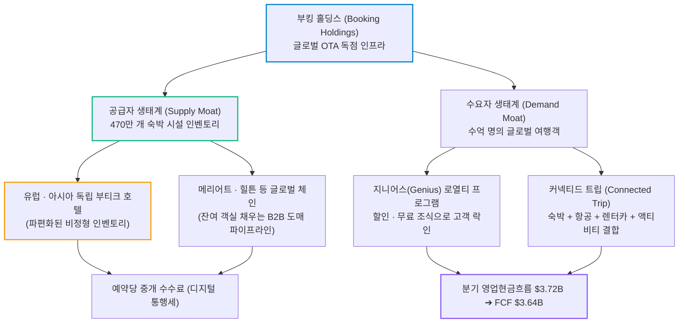
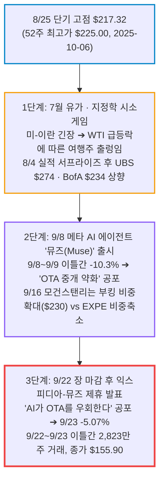
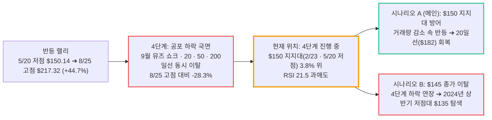

# 부킹 홀딩스(Booking Holdings / BKNG) 실전 재무 및 가치 분석 보고서

- **작성일**: 2026-09-24
- **데이터 기준**: 2026년 2분기 실적(2026-06-30 마감, 2026-08-04 발표), 2026-09-22(미 동부 16:32) 익스피디아-메타 뮤즈 제휴 발표와 9/23 OTA 동반 급락, 2026-09-16 모건스탠리 온라인 여행 커버리지(부킹 비중확대·$230), 2026-07 EU 집행위의 구글 DMA 과징금과 2026-09-08 구글 EU 여행 검색 개편, 7월 유가(WTI)·지정학 시계열, yfinance 시장 데이터 (2026-09-23 미국장 마감 기준)

대중이 메타의 '뮤즈(Muse)' AI 에이전트 뉴스 한 줄에 겁을 집어먹고 "온라인 여행 플랫폼의 종말"을 떠들며 물량을 던질 때, 부킹 홀딩스는 전 세계 470만 개 숙박 인벤토리를 틀어쥔 채 분기 36억 달러의 잉여현금흐름(FCF)을 뿜어내며 52주 저점($150.14) 턱밑까지 밀려 내려왔다. AI 챗봇이 아무리 똑똑해져도 유럽 뒷골목 부티크 호텔의 방 열쇠를 직접 쥐어줄 수는 없다. AI가 예약을 대신하더라도 파편화된 숙박 공급을 모아 둔 플랫폼을 거쳐야 한다는 것, 이것이 공포에 가려진 시장의 구조다.

## 핵심 요약

| 구분 | 핵심 요약 |
| :--- | :--- |
| **종목 및 주가** | 부킹 홀딩스 (NASDAQ: `BKNG`) / **$155.90** (52주 범위 $150.14 ~ $225.00, 2026년 4월 25:1 주식분할 반영) |
| **최종 투자의견** | **매수 대기 (Wait for Setup)** / 펀더멘털·밸류에이션은 매수 등급이나 대량 거래 투매가 진행 중이다. $150 위에서 거래량 감소와 반등 종가가 확인되면 선발대 진입 (투자 가치 점수 **82.0점**, 6.1절) |
| **비즈니스 본질** | 전 세계 470만 개 숙박 시설 인벤토리와 '커넥티드 트립' 생태계로 여행객과 숙박업주를 틀어쥔 글로벌 OTA 절대 군주 |
| **핵심 매력 (Bull)** | Q2 매출 $7.35B(YoY +8.2%), 최근 12개월 EBITDA 마진 **36.9%**(피어 1위), 분기 FCF **$3.64B**(마진 49.6%), Forward PER **12.6배**, Q2 주주환원 **$4.31B** |
| **최근 주가 변동 원인** | 9/8 메타 뮤즈 출시 → 9/22 익스피디아-뮤즈 제휴 발표로 'AI의 OTA 우회' 공포 확산, 8/25 고점 대비 -28.3% (2.2절) |
| **핵심 리스크 (Bear)** | 메타 '뮤즈' 발 AI 에이전트 직거래 확산 우려(심리적 오버행), 중동 지정학 불안에 따른 장거리 국제선 둔화, 거시경제 불확실성 |
| **포트폴리오 성격** | 경기 사이클을 타지만 압도적 해자와 FCF로 하방을 지키는 **가치회귀 스윙~중기주(베타 1.07)** / **단기 테마 폭등 투기꾼은 매수 금지** |

---

## 1. 비즈니스 실체: 전 세계 숙박 생태계의 '목줄'과 디지털 통행세

부킹 홀딩스를 '여행 갈 때 호텔이나 검색하는 흔한 예약 사이트' 따위로 이해하는 자는 플랫폼 비즈니스의 본질을 모르는 자다. 이 기업의 본질은 **전 세계 수백만 숙박업소와 수억 명의 여행객 사이를 가로막고 통행세를 징수하는 거대한 디지털 톨게이트**다.

소비자에게 친숙한 부킹닷컴(Booking.com), 아고다(Agoda), 프라이스라인(Priceline), 카약(Kayak), 그리고 레스토랑 예약 플랫폼 오픈테이블(OpenTable)은 겉으로 보기엔 제각각인 브랜드처럼 보이지만, 뒤에서는 단 하나의 거대한 중앙 인벤토리 데이터베이스로 묶여 전 세계 숙박 공급망을 쥐락펴락한다.

### 1.1 돈 버는 구조: 거대한 양면 네트워크 효과와 '커넥티드 트립'의 빨대

- **① 전 세계 470만 개 숙박 인벤토리의 양면 네트워크**: 부킹 홀딩스는 물건을 직접 사서 쌓아두는 재고 위험이 없다. 호텔과 게스트하우스가 방을 플랫폼에 올리면, 여행객이 결제할 때마다 거래액의 일정 비율을 중개 수수료(커미션)로 챙긴다. 여행객이 많으니 숙박업소가 몰려들고, 숙박업소가 많으니 여행객이 부킹을 찾는다. 이 양면 네트워크는 지난 20년간 수백억 달러의 마케팅비를 쏟아부어 구축한 철옹성이다.
- **② '커넥티드 트립(Connected Trip)'의 확장**: 과거에는 호텔 예약만 챙겼지만, 이제는 숙박에 항공권, 렌터카, 현지 투어 및 티켓, 레스토랑(OpenTable)을 하나로 엮어 원스톱으로 결제하게 만든다. 고객이 앱을 켜두는 체류 시간이 늘어날수록 고객 획득 비용(CAC)은 급감하고 고객 생애 가치(LTV)는 치솟는다.
- **③ AI를 적이 아니라 도구로 쓴다**: 부킹은 AI와 싸우는 척하지 않는다. 자회사 프라이스라인에 생성형 AI 어시스턴트 '페니(Penny)'를 심는 등 자체 AI로 숙소 추천과 업셀링(Up-selling)을 자동화해 예약 전환율을 끌어올리는 쪽을 택했다. 모건스탠리도 AI를 OTA에 대한 위협이 아니라 "새로운 고객 획득 채널이자 제품 기회"로 본다.

### 1.2 왜 빅테크 AI 챗봇이 부킹의 요새를 함락시키지 못하는가?

대중과 월가의 공포론자들은 "메타의 '뮤즈(Muse)'나 오픈AI의 챗봇이 여행 일정을 다 짜주고 직접 예약까지 해주면 부킹닷컴은 껍데기만 남고 망한다"며 설레발을 친다. 이것이야말로 여행 산업의 공급망 구조를 단 1밀리미터도 이해하지 못한 자들의 헛소리다.

- **독립 부티크 호텔은 자체 API가 없다**: 메리어트나 힐튼 같은 거대 체인은 자체 예약 시스템이 있지만, 유럽과 동남아시아에 흩어진 독립 호텔, B&B, 료칸, 민박집 대부분은 AI 에이전트와 통신할 서버조차 없다. 이들은 부킹닷컴의 엑스트라넷(Extranet) 관리 화면에 의존해 방을 팔고 정산을 받는다.
- **AI 에이전트도 결국 인벤토리를 가진 플랫폼을 거친다**: 뮤즈는 현재 호텔·렌터카 예약에서 익스피디아와 호텔스닷컴 같은 소비자용 사이트를 브라우저 자동화로 대신 조작하는 방식을 쓴다. 에이전트가 방을 찾으려면 파편화된 재고를 모아 둔 OTA 화면을 거쳐야 한다는 뜻이다. 에이전트가 직접 호텔과 거래하는 구조가 되려면 독립 숙소 수백만 곳의 재고·가격·정산 연동이 먼저 필요하고, 그 연동을 이미 쥐고 있는 쪽이 부킹이다.
- **신용과 사후 처리의 장벽**: 여행은 인생에서 가장 큰 소비 중 하나다. 낯선 해외 호텔에서 방이 오버부킹되거나 체크인이 거절당했을 때, AI 챗봇에게 따질 것인가? 24시간 40개 언어로 현지 호텔과 직접 연락해 문제를 해결해 주는 글로벌 CS 인프라와 신뢰 자산은 코드 몇 줄로 복제할 수 있는 대상이 아니다.

---

## 2. 최근 실적과 시장의 오독: 대중의 착시 vs 숫자의 팩트

### 2.1 2026년 2분기 확정 실적 대차대조

2026년 8월 4일 장 마감 후 발표된 2분기 실적은 거시경제 둔화와 지정학적 리스크 속에서도 부킹 홀딩스의 현금창출력이 얼마나 잔인할 정도로 견고한지 증명했다.

| 재무 지표 | Q2 2025 | Q1 2026 | Q2 2026 | 전년 동기 대비(YoY) | 판정 및 분석 |
| :--- | ---: | ---: | ---: | ---: | :--- |
| **총매출(Revenue)** | $6.80B | $5.53B | **$7.35B** | **+8.15%** | 룸나이트 +5%(가이던스 상단 약 1%p 상회), 총예약액 +9%로 성장 지속 |
| **영업이익(Operating Income)** | $2.25B | $1.27B | **$2.50B** | **+11.11%** | 마케팅 효율화 및 고정비 레버리지로 매출보다 빠른 이익 증가 |
| **영업이익률(Operating Margin)** | 33.10% | 22.98% | **34.00%** | **+0.90%p** | 전 세계 어떤 이커머스/플랫폼도 흉내 내지 못하는 30%대 중반 마진 |
| **정상화 EBITDA(Normalized)** | $2.72B | $1.51B | **$2.87B** | **+5.37%** | **Q2 마진 39.0%** (yfinance 기준 최근 12개월 EBITDA 마진 36.87%) |
| **GAAP 순이익** | $0.90B | $1.08B | **$1.95B** | **+117.88%** | 전년 동기 대규모 영업외손실(세전이익 $1.10B < 영업이익 $2.25B)의 기저효과 |
| **조정(Adjusted) 희석 EPS** | $2.22 | $1.14 | **$2.54** | **+14.41%** | **월가 컨센서스($2.43)를 +4.49% 상회한 어닝 서프라이즈** |
| **영업활동 현금흐름** | $3.20B | $3.22B | **$3.72B** | **+16.18%** | 분기 37억 달러의 순수 현금이 금고로 쏟아져 들어옴 |
| **설비투자(CapEx)** | $0.06B | $0.11B | **$0.08B** | — | 서버 및 IT 인프라 유지 외에 설비투자가 거의 들지 않는 라이트 에셋 |
| **잉여현금흐름(FCF)** | $3.14B | $3.11B | **$3.64B** | **+16.13%** | **FCF 마진 무려 49.55%** (매출의 절반이 순수 잉여현금으로 남음) |
| **주주환원 총액(자사주+배당)** | $1.81B | $4.11B | **$4.31B** | **+138.07%** | **자사주 매입 $3.99B + 현금배당 $0.32B** (분기 FCF 전체를 상회하는 주주환원) |
| **현금성 자산** | $17.60B | $16.02B | **$17.21B** | **-2.17%** | 분기 43억 달러를 돌려주고도 172억 달러의 유동성 유지 |
| **희석 평균 주식 수** | 8.15억 주 | 7.94억 주 | **7.70억 주** | **-5.52%** | 1년 만에 유통 주식 5.5%가 사라짐 (EPS 부양 효과) |

출처: yfinance 분기 재무제표 및 실적 이력(주식분할 25:1 반영), 룸나이트·총예약액은 회사 2분기 실적 발표.

회사는 전사적 비용 절감 프로그램(Transformation Program)의 연간 절감 목표(run-rate)를 **약 6억 5,000만 달러로** 상향했다. 늘어난 약 1억 달러의 절감분은 주로 2027년에 반영된다. 불필요한 인력 낭비를 줄이고 프로세스를 자동화하여 영업이익률을 더 끌어올리겠다는 선언이다.

### 2.2 8월 고점 대비 -28.3% 급락의 전말: 유가 시소게임과 메타 뮤즈 쇼크

부킹 홀딩스는 2026년 4월 6일 주식을 25대 1로 분할했다. 이후 5월 20일 52주 최저점 **$150.14를** 찍고 반등해, 7월 유가 시소게임을 거쳐 8월 25일 장중 고점 **$217.32까지** 44.7% 치솟았다(분할 전 기준 약 $5,433 상당). 그러나 9월 23일 종가는 **$155.90으로**, 고점 대비 **-28.3%** 밀렸다. 이 급락은 단일 악재가 아니다. 7월부터 쌓인 유가·지정학 피로감 위에 9월 메타 뮤즈 출시와 익스피디아-뮤즈 제휴 발표가 연달아 덮친 3단계 연쇄 충격의 결과다.

#### ① 7월 유가 및 지정학 시소게임: 펀더멘털이 아닌 매크로 민감도

부킹 홀딩스의 7월 주가 궤적은 펀더멘털 결함이 아니라 국제유가(WTI)와 지정학 헤드라인에 좌우되는 전형적인 경기소비재의 롤러코스터였다(날짜는 미국 거래일 기준).

- **7월 8일**: 미국-이란 휴전 종료 가능성이 거론되며 WTI가 하루 +4.37% 뛰자 부킹은 **-4.21% 급락했다.**
- **7월 15일**: 6월 PPI가 전월 대비 -0.3%로 예상(보합)을 밑돌며 인플레 우려가 완화되자 **+4.55% 급반등했다.**
- **7월 22~23일**: 중동 충돌 장기화 우려로 WTI가 이틀간 $84.91에서 $92.19로 +8.6% 뛰자 여행비 부담으로 이틀간 **-3.66% 밀렸다.**
- **7월 27일**: 미-이란 교전 일시 중단으로 WTI가 -7.50%($82.61) 폭락하자 여행 수요 회복 기대감에 **+5.26% 폭등했고,** 다음 날에도 **+6.70%** 더 올랐다.
- **8월 4일 실적 발표 이후**: 2분기 어닝 서프라이즈가 확인되자 다음 날 주가는 **+6.56%** 뛰었다. UBS는 목표주가를 $266에서 **$274로,** BofA는 $231에서 **$234(매수)로** 올렸다. 주가는 8월 25일 **$217.32까지** 치솟았다.

#### ② 9월 메타 '뮤즈' AI 등장과 9/22 익스피디아 제휴 쇼크

$217 고점을 찍은 뒤 주가를 $155까지 밀어 넣은 결정적 방아쇠는 'AI 에이전트' 공포였다.

- **9월 8일**: 메타가 개인 AI 에이전트 '뮤즈(Muse)'를 출시했다. 뮤즈는 출시 2주 만에 미국에서 250만 건 다운로드를 기록하며 앱스토어 1위에 올랐다. 부킹은 9월 8일 **-6.72%,** 9일 **-3.81%로** 이틀 만에 10% 넘게 빠졌다.
- **9월 중순**: 미즈호(Lloyd Walmsley)는 메타 분석 노트에서 뮤즈가 알파벳에 압력을 주고 OTA(부킹·익스피디아)의 중개 약화 우려를 다시 부각시킬 수 있다고 평가했다. 에어비앤비는 상대적으로 덜 취약하다고 봤다.
- **9월 16일**: 모건스탠리는 온라인 여행 커버리지를 새로 맡으며 **부킹(BKNG)을 업종 최선호주(비중확대, 목표가 $230)로** 꼽았다. 근거는 "470만 개의 고유 숙소", 60%대 중반의 직접 예약 비중, 20년간 채널 전환을 헤쳐 온 실행력이다. 반면 익스피디아(EXPE)는 2분기 월간 활성 사용자(MAU)가 전년 대비 제자리였다는 이유로 **비중축소(Underweight, 목표가 $235)로** 강등했다.
- **9월 18일**: 분기 선물·옵션 동시 만기일에 거래량이 **1,846만 주로** 불었지만, 주가 하락은 -1.54%에 그쳤다.
- **9월 22일**: 부킹은 -2.55% 하락 마감했고(1,436만 주), 장 마감 뒤인 오후 4시 32분(미 동부) 익스피디아가 메타 뮤즈와 제휴해 뮤즈 안에서 호텔·항공 예약을 제공한다고 발표했다.
- **9월 23일 시장의 투매**: 대중과 알고리즘은 "AI 에이전트가 OTA를 우회한다"는 1차원적 공포에 질려 여행주를 한꺼번에 던졌다. 익스피디아 -7%, 에어비앤비 -6%, 부킹은 **-5.07%(1,387만 주)로** 마감했다. 장중 저가는 **$155.37,** 종가는 **$155.90으로** 5월의 52주 최저점($150.14)을 3.8% 위에 두고 멈췄다. 일간 RSI(14)는 **21.5까지** 떨어졌다.

### 2.3 대중의 착시 vs 데이터가 말해주는 진실

시장이 공포에 질려 물량을 던질 때, 팩트와 제도적 현실을 뜯어보면 대중이 얼마나 허황된 착각에 빠져 있는지 폭로된다.

| 시장과 언론의 흔한 착시 | 데이터와 장부 숫자가 말하는 냉혹한 진실 |
| :--- | :--- |
| **"메타가 익스피디아(EXPE)와 손잡았으니 부킹(BKNG)은 AI에 도태된다?"** | 뮤즈가 익스피디아를 첫 여행 파트너로 고른 것은 **"빅테크 AI조차 숙박 재고를 직접 모으지 못하고 기존 OTA를 거쳐 예약을 처리한다"는 방증이다.** 지금 구조에서 AI 에이전트는 OTA를 대체하는 게 아니라 OTA로 들어오는 새 유입 채널이다. 모건스탠리가 같은 주에 익스피디아를 MAU 정체를 이유로 비중축소로 강등하고, 부킹을 470만 개 숙소와 60%대 중반의 직접 예약 비중을 근거로 최선호주($230)로 꼽은 이유도 여기에 있다. 익스피디아는 미국·체인 호텔·항공 비중이 높아 AI 가격 비교에 취약하지만, 부킹이 장악한 유럽·아시아의 파편화된 독립 숙소는 에이전트가 우회하기 가장 어려운 재고다. 다만 뮤즈가 아직 부킹과는 제휴하지 않았다는 점은 남은 변수다(6.4절). |
| **"구글 등 빅테크 검색 엔진이 자체 여행 예약(Google Travel)으로 부킹의 트래픽을 말려 죽인다?"** | 유럽에서는 규제가 정반대 방향으로 움직였다. EU 집행위는 2026년 7월 디지털시장법(DMA) 위반으로 구글에 총 8억 9,000만 유로의 과징금을 부과했고, 그중 검색 자사 우대 몫이 **4억 6,000만 유로(약 5억 2,500만 달러)다.** 구글은 60일 시정 기한에 맞춰 9월 8일 EU 여행 검색을 개편했다. **호텔·항공·레스토랑 결과를 OTA 등 중개 사이트 전용 영역과 직접 공급자 영역으로 분리했고,** 직접 공급자 영역에서는 날짜 필터·실시간 가격·설명 태그와 휴가용 숙소 유닛을 없앴다. 구글 스스로 직접 예약 트래픽이 30% 줄었다고 불평했을 정도다. 유럽 규제 당국이 구글의 자사 우대를 끊어 OTA에 불리하던 판을 걷어낸 셈이다. |
| **"중동 전쟁과 유가 폭등으로 여행 산업 전체가 영구 파괴된다?"** | 7월 시황을 보면 미-이란 교전 일시 중단으로 WTI가 $82선으로 밀리자마자 부킹은 하루 만에 +5.26% 폭등했다. 유가와 지정학 뉴스는 일시적 심리 변수에 가깝다. 2분기 매출은 전년 대비 **+8.15% 늘어난 $7.35B를** 기록했고, 영업이익은 **+11.11% 늘어난 $2.50B다.** 룸나이트는 +5%로 회사 가이던스 상단을 약 1%p 웃돌았고, 총예약액도 +9% 늘었다. |
| **"주가가 고점 $217에서 $155까지 무너졌으니 부도 위기다?"** | 부킹 홀딩스는 단 한 분기 만에 **36억 4,000만 달러(약 5조 원)의 순수 잉여현금흐름(FCF)을** 벌어들였다. FCF 마진이 49.6%다. 현금성 자산만 172억 달러를 쥐고 있으며, 2분기에만 40억 달러에 육박하는 자사주를 쓸어 담았다. 현금이 넘쳐나서 주식을 태우는 기업에게 부도 위기 운운하는 것은 코미디다. |
| **"인건비와 서버 비용이 늘어 마진이 무너진다?"** | 부킹 홀딩스는 연간 6억 5,000만 달러 절감을 목표로 하는 'Transformation Program'을 가동 중이다. 자체 머신러닝과 AI를 활용해 고객 응대(CS) 자동화율을 끌어올리고 있으며, 2분기 영업이익률은 오히려 전년 동기 대비 0.90%p 개선된 **34.00%를** 찍었다. 고정비 부담은커녕 마진이 확장되는 국면이다. |

---

## 3. 경쟁 해자 및 피어 그룹 잔혹 비교

글로벌 여행 플랫폼 빅4(Booking Holdings, Expedia, Airbnb, Trip.com)의 재무 지표를 비교하면, 왜 부킹 홀딩스가 업계의 절대 군주인지 명백히 드러난다.

| 비교 지표 | **부킹 홀딩스 (BKNG)** | 익스피디아 (EXPE) | 에어비앤비 (ABNB) | 트립닷컴 (TCOM) |
| :--- | :---: | :---: | :---: | :---: |
| **현재 주가** | **$155.90** | $259.04 | $149.58 | $40.63 |
| **시가총액** | **$117.14B** | $31.09B | $89.57B | $25.58B |
| **과거 PER (Trailing P/E)** | **18.26배** | 17.67배 | 36.93배 | 7.89배 |
| **선행 PER (Forward P/E)** | **12.60배** | **10.59배** | **24.18배** | 9.89배 |
| **PEG 배수 (PEG Ratio)** | **0.61배** | 0.74배 | 1.54배 | 1.91배 |
| **PBR (Price to Book)** | 자본잠식(대규모 자사주 매입 착시) | 25.71배 | 11.32배 | 1.08배 |
| **영업이익률 (Operating Margin)** | **34.41%** | 18.98% | 21.01% | -9.33% |
| **EBITDA 마진 (EBITDA Margin)** | **36.87%** | 18.41% | 20.98% | 17.42% |
| **베타 (Beta)** | **1.068** | 1.250 | 1.161 | -0.053 |
| **배당수익률 (Dividend Yield)** | **1.08%** (연 $1.68) | 0.74% (연 $1.92) | 없음 (0.0%) | 없음 (0.0%) |
| **52주 최고 / 최저가** | $225.00 / $150.14 | $342.00 / $185.34 | $193.45 / $110.81 | $78.99 / $38.04 |
| **주요 해자 영역** | **압도적 EBITDA 마진(36.9%) + 470만 인벤토리 + $3.6B FCF** | 미국 항공/패키지 중심 | 독특한 단독주택 숙박 공유 독점 | 중국 아웃바운드 여행 독점 |
| **약점 및 리스크** | 메타 AI 노출 우려, 유럽 경기 민감도 | 상대적으로 낮은 마진(18%), 점유율 정체 | 규제 리스크(주요 도시 단기임대 금지) | 중국 매크로 리스크 및 지정학 갈등 |

출처: yfinance 시장 데이터 (2026-09-23 미국장 마감 기준).

### 3.1 부킹 홀딩스만의 독보적 차별점

- **① 모건스탠리의 냉혹한 차별화 (BKNG 비중확대 $230 vs EXPE 비중축소 $235)**: 9월 16일 모건스탠리는 익스피디아(EXPE)의 2분기 MAU가 전년 대비 제자리였고 부킹과의 밸류에이션 격차가 더는 미국·체인 호텔·항공 편중을 반영하지 못한다며 투자의견을 **비중축소(Underweight)로** 낮췄다. 같은 기간 부킹닷컴 MAU는 약 6% 늘었다. 반면 부킹 홀딩스(BKNG)에는 470만 개 고유 숙소, 60%대 중반의 직접 예약 비중, 20년간 채널 전환을 헤쳐 온 실행력을 근거로 **비중확대(Overweight) 및 목표가 $230을** 부여했다. 메타가 누구와 먼저 제휴했든, 글로벌 숙박 인벤토리를 가장 많이 쥔 쪽은 부킹이다.
- **② 경쟁사를 압살하는 영업이익률과 EBITDA 마진(36.9%)**: 익스피디아의 EBITDA 마진은 18.4%, 에어비앤비는 21.0%에 불과하다. 부킹 홀딩스는 **36.87%로** 피어 그룹 대비 거의 2배에 달하는 마진율을 자랑한다. 똑같이 100달러를 벌어도 남기는 순수 현금의 두께가 차원이 다르다.
- **③ 에어비앤비 대비 절반 가격에 거래되는 밸류에이션**: 화려한 브랜드 파워를 자랑하는 에어비앤비(ABNB)는 선행 PER 24.18배, PEG 1.54배를 받고 있다. 반면 실질적인 현금창출력과 숙박 인벤토리에서 압도적인 1위인 부킹 홀딩스는 **선행 PER 12.60배, PEG 0.61배에** 내팽개쳐져 있다. 성장성 대비 극심한 저평가 상태다.
- **④ 천문학적인 주주환원 빨대**: 익스피디아나 에어비앤비는 배당이 없거나 미미하다. 부킹은 연 1.08%의 현금배당과 함께, 2분기 한 분기에만 40억 달러에 육박하는 자사주를 사들였다. 희석 평균 주식 수는 1년 만에 8.15억 주에서 7.70억 주로 5.5% 줄었다. 순이익이 제자리여도 주식 수가 줄어드는 만큼 주당순이익(EPS)이 올라가는 구조다.

---

## 4. 기술적 사이클 위치 (4단계 사이클 모델)

스탠 와인스타인(Stan Weinstein)의 4단계 사이클 모델로 판정했을 때, 부킹 홀딩스는 **4단계 (공포 하락 국면)의 한복판에서 올해 두 번 지켜낸 $150 지지대를 향해 내려가는 중이다.** 1단계(바닥 다지기)로 넘어갔다고 판정할 근거는 아직 없다. 주가가 20·50·200일선을 모두 밑돌고, 하락일 거래량이 평균의 2배를 넘기 때문이다.

### 4.1 이동평균선 및 거래량 심층 진단

- **현재 주가**: **$155.90** (9/23 종가, 장중 저가 $155.37)
- **52주 최고가 및 최저가**: $225.00 (2025-10-06) / $150.14 (2026-05-20) ➔ **52주 고점 대비 -30.7%, 52주 저점 대비 +3.8%**
- **20일 이동평균선**: **$182.09** (단기 가치 회귀 1차 목표)
- **50일 이동평균선**: **$191.78** (중기 저항선)
- **200일 이동평균선**: **$183.52** (장기 생명선, 현재 주가보다 약 17.7% 위)
- **수급 및 거래량 분석**:
    - $150 부근은 올해 두 번 바닥을 받친 가격대다. 2월 23일 장중 $150.62, 5월 20일 장중 $150.14까지 밀렸다가 모두 반등했다. 9월 23일 종가 $155.90은 이 지지대의 3.8% 위이며, 세 번째 시험을 앞둔 자리다. 주가는 아직 지지대를 건드리지 않았으므로, 바닥이 확인된 단계가 아니라 **지지대에 접근하는 단계다.**
    - 9월 22일(1,436만 주)과 23일(1,387만 주)은 뮤즈 쇼크 이전 50거래일 평균(약 600만 주)의 2.3~2.4배 거래량을 동반한 하락일이다. 9월 18일(1,846만 주)은 분기 선물·옵션 동시 만기일이라 주가 하락이 -1.54%에 그쳤다. **대량 거래를 동반한 하락은 매도 압력이 아직 소진되지 않았다는 뜻이다.** 거래량이 평균 수준으로 줄어들면서 주가가 버티는지를 먼저 확인해야 한다.
    - 일간 RSI(14, Wilder 방식)는 **21.5로** 과매도 기준선 30을 밑돈다. 과매도는 되돌림 반등의 조건이 갖춰졌다는 신호일 뿐, 하락이 끝났다는 증거는 아니다.

---

## 5. 밸류에이션 및 가격 타당성 검증

### 5.1 밸류에이션 배수 분해

- **선행 PER(Forward P/E)**: **12.60배** (2027년 예상 EPS 약 $12.37 기준, 주식분할 반영)
- **과거 PER(Trailing P/E)**: **18.26배** (최근 12개월 누적 희석 EPS $8.54 기준)
- **PEG 배수**: **0.61배** (1.0 미만은 성장성 대비 저평가 구간)
- **EBITDA 마진**: **36.87%** (최근 12개월)
- **배당수익률**: **1.08%** (연 $1.68)
- **월가 주요 투자은행(IB) 목표주가**:
    - **UBS**: **$274.00** (매수 유지, 8/5 실적 후 $266에서 상향, 상승 여력 **+75.75%**)
    - **모건스탠리 (Matthew Cost)**: **$230.00** (비중확대, 9/16 커버리지 개시, 2027~28년 평균 EPS의 약 18배, 상승 여력 **+47.53%**)
    - **뱅크오브아메리카 (BofA)**: **$234.00** (매수 유지, 실적 후 $231에서 상향, 상승 여력 **+50.10%**)
    - **월가 전체 평균 목표주가(37명)**: **$238.78** (상승 여력 **+53.16%**), 최저 $188.00 (+20.59%), 최고 $301.00 (+93.07%)

### 5.2 현재 주가는 비싼가, 싼가?

모건스탠리는 부킹의 적정 멀티플을 2027~28년 평균 EPS의 **약 18배로** 본다. 현재의 **Forward PER 12.60배는 그 기준보다 30% 낮은 가격표**다.

- 시장은 AI 에이전트 진입 공포로 인해 부킹의 해자가 훼손될 것이라는 과도한 할인율을 적용하고 있다.
- 만약 시장의 패닉이 진정되고, 보수적인 **Forward PER 15.0배** 수준으로만 회귀하더라도 적정 주가는 다음과 같이 산출된다:
  

    보수적 적정 주가 &nbsp;=&nbsp;
    예상 EPS ($12.37) &nbsp;×&nbsp; Target PER (15.0배) &nbsp;=&nbsp; <strong>$185.55</strong>
  

  현재 주가($155.90) 대비 **+19.0%의 가치 회귀 여지가** 열려 있다.
- 모건스탠리 기준에 가까운 **Forward PER 18.0배**를 적용할 경우 주가는 **$222.66에** 달하며, 이는 현재가 대비 **+42.8%의 상승 여력**이다.
- 하방은 올해 두 번 지켜낸 $150 지지대가 1차 방어선이다. 손절 기준선을 $145.00(-7.0%)로 잡으면 기대 손익비는 **2.7 대 1(15배 회귀)에서 6.1 대 1(18배 회귀)** 수준이다. 지지대가 깨지면 이 손익비 계산도 함께 무너진다.

---

## 6. 종합 평가 및 냉혹한 계좌 실행 원칙

### 6.1 6대 핵심 투자 지표 다차원 평가 매트릭스

| 평가 영역 | 가중치 | 평점 (100점 만점) | 가중 점수 | 등급 | 핵심 평가 요약 |
| :--- | :---: | :---: | :---: | :---: | :--- |
| **① 비즈니스 모델 및 해자** | 25% | **92점** | 23.00 | `S` | 470만 개 숙박 인벤토리, 커넥티드 트립, AI 에이전트가 우회하기 어려운 파편화된 공급망 |
| **② 실적 성장성 및 가이던스** | 25% | **80점** | 20.00 | `A` | Q2 매출 +8.2%, 조정 EPS +14.4%, 어닝 서프라이즈(+4.5%), 연간 6.5억 달러 비용 절감 |
| **③ 재무 건전성 및 현금흐름** | 20% | **90점** | 18.00 | `S` | 분기 FCF $3.64B(마진 49.6%), Q2 주주환원 $4.31B, 현금 172억 달러 |
| **④ 밸류에이션 매력도** | 15% | **85점** | 12.75 | `A+` | Forward PER 12.6배, PEG 0.61배, 모건스탠리 적정 배수(약 18배) 대비 30% 할인 |
| **⑤ 기술적 매매 타이밍** | 10% | **50점** | 5.00 | `C` | 4단계 공포 하락 진행 중, $150 지지대 3.8% 위. RSI 21.5 과매도이나 20·50·200일선 모두 아래, 대량 거래 하락 |
| **⑥ 리스크 관리 가능성** | 5% | **65점** | 3.25 | `B` | 52주 신저가 이탈 기준선($145) 명확. 단, AI 뉴스에 따른 단기 변동성 상존 |
| **종합 가중치 환산 점수** | **100%** | — | **82.0점** | **`Buy`** | **펀더멘털과 밸류에이션은 극상, 투매 진정과 $150 지지 반등 종가를 확인한 뒤 분할 진입** |

!!! info "평점 산출 검산 공식"
    종합 점수는 각 영역의 가중치를 곱해 합산한 값이다.
    `92×0.25 + 80×0.25 + 90×0.20 + 85×0.15 + 50×0.10 + 65×0.05 = 82.00점`

### 6.2 실전 결론: "그래서 지금 어쩌라는 것인가?" (Action Verdict)

#### ① 지금 당장 사야 하는가? ➔ **"아직 아니다. 선발대도 투매가 멈춘 것을 확인하고 들어가라."**

선발대는 싸 보인다고 발을 담그는 물량이 아니다. 본대와 같은 확신이 섰을 때 먼저 들어가는 첫 물량이다. 지금 자리를 네 가지 진입 조건으로 따지면 다음과 같다.

| 선발대 진입 조건 | 9월 23일 종가 기준 | 판정 |
| :--- | :--- | :---: |
| **지지선 부근에서 종가 유지** | $155.90으로 $150 지지대의 3.8% 위. 지지대를 아직 시험하지 않았다 | 충족 |
| **하락이 멈춘 신호** | 9월 22~23일 이틀 연속 평균(약 600만 주)의 2배가 넘는 거래량(합계 2,823만 주)으로 하락했고, 23일 종가($155.90)가 장중 저가($155.37)에 붙었다. RSI 21.5 과매도 이후 반등 종가는 아직 없다 | **미충족** |
| **하락 원인이 펀더멘털 밖** | 메타 뮤즈 제휴 공포와 유가·지정학 변수다. Q2 실적과 가이던스는 훼손되지 않았다 | 충족 |
| **손익비 2:1 이상** | 1차 목표 20일선 $182.09까지 +16.8%, 손절선 $145까지 -7.0%로 약 2.4 대 1 | 충족 |

- **지금 사지 않는 이유**: 가격과 손익비는 매력적이지만, 매도 물량이 아직 쏟아지고 있다. 투매의 관성이 이어지면 $150 선을 깨는 언더슈팅이 나올 수 있고, 그때 먼저 들어간 선발대는 손절선 앞에서 흔들린다. 떨어지는 칼날은 선발대로도 잡지 마라.
- **선발대가 들어가는 조건**: 주가가 $150 위에서 종가를 지키는 가운데 하락일 거래량이 평균(약 600만 주) 이하로 줄고, 전일보다 높은 반등 종가가 나오는 날이다. 이 조건이 확인되면 $150~$158 구간에서 선발대 30%를 넣는다.

#### ② 이런 주식은 누가 사고, 누가 절대 사면 안 되는가?

- **❌ 절대 사지 마라 (즉시 퇴장)**: 내일 당장 상한가를 바라는 단타족, AI 반도체 급등주만 쫓아다니는 투기꾼, 주가가 3%만 흔들려도 잠을 못 자는 심약자. (이 주식은 AI 공포가 걷히고 가치가 재평가될 때까지 2~3개월의 호흡이 필요하다.)
- **⭕ 눈독 들이고 쓸어 담아야 할 사람 (스나이퍼 매수)**: 시장이 멍청한 공포에 질려 1등 독점 우량주를 내팽개칠 때 주워 담는 가치투자자, 압도적인 잉여현금흐름(FCF)과 자사주 소각의 복리를 믿는 투자자, 적정가 $185~$223(Forward PER 15~18배) 회귀를 노리고 +19~43%의 스윙~중기 수익을 노리는 투자자.

#### ③ 이 주식으로 '인생 역전(대박)'을 바라면 안 되는 냉혹한 이유

- 부킹 홀딩스는 이미 시가총액 1,170억 달러에 달하는 글로벌 거대 기업이다. 단기 10배 폭등하는 밈코인이나 신약 바이오주가 아니다. 이 주식의 진짜 매력은 지지대 부근에서 주워 담아 200일선과 전고점을 향해 회귀할 때 **유리한 손익비로 +19~43% 구간의 수익을 노리는 '가치회귀 트레이딩'에** 있다.

### 6.3 실전 가격대별 실행 시나리오 및 분할 매수 로드맵

종목 배정 예산 내부의 분할 매수 로드맵이며, 전체 포트폴리오 대비 편입 한도는 **최대 7~10% 이내로** 엄격히 제한하여 운용한다.

| 구분 | 실행 조건 | 배정 비중 | 가격 기준 | 구체적 대응 방침 |
| :--- | :--- | :---: | :---: | :--- |
| **1차 진입 (선발대)** | $150 위 종가 유지 + 하락일 거래량 평균(약 600만 주) 이하 감소 + 반등 종가 출현 | **30%** | **$150 ~ $158** | 투매 진정을 확인한 뒤 첫 물량 진입. 조건 미충족 시 대기 |
| **2차 매수 (주력)** | 선발대 진입 후 RSI 30 위 복귀 및 전 저점을 지킨 채 고점·저점을 높이는 반등 지속 | **35%** | **$158 ~ $165** | 2·5월에 이은 세 번째 $150 지지 확인 및 단기 하락 추세 탈출 시 핵심 물량 투입 |
| **3차 매수 (추세 안착)** | 20일선($182.09) 돌파 및 200일선($183.52) 회복 시 | **25%** | **$183 ~ $186 돌파 시** | 중기 추세 복원 확인 후 불타기 매수 |
| **예비 현금** | 매크로 급변 및 돌발 변수 대응 버퍼 | **10%** | — | 조건 미충족 시 현금 보존 |
| **손절 및 위험 관리선** | 52주 신저가 완전 붕괴 및 장기 지지선 이탈 시 | — | **$145.00 일봉 종가 하회** | 펀더멘털 가정 붕괴 시 미련 없이 손절 및 비중 축소 |

$150을 종가 기준으로 하회하면 선발대 진입 조건 자체가 깨진 것이므로 신규 매수를 보류한다. 이미 선발대를 넣은 뒤라면 $145 종가 이탈 전까지는 보유하되, 추가 매수는 $150 재회복과 반등 종가를 다시 확인한 뒤에 한다.

### 6.4 판정을 바꿀 증거와 향후 모니터링 체크리스트

- **① 2026년 10월 27일(미 동부 장 마감 후) 예정된 3분기 실적 발표**: 컨센서스 EPS는 $4.49다. 7~9월 여름 성수기 룸나이트(Room Nights)가 월가 예상치를 충족하는지, 중동 리스크가 실적에 미친 영향이 제한적이었는지 확인하라.
- **② $150 지지대 수성 여부와 거래량**: 주가가 종가 기준으로 $150을 지켜내는지, 하락일 거래량이 평균(약 600만 주) 수준으로 줄어드는지, RSI가 30선 위로 탈출하는지 매일 종가를 추적하라.
- **③ 메타 '뮤즈'와 부킹 홀딩스(BKNG)의 후속 제휴 여부**: 뮤즈의 첫 여행 파트너는 미국·체인 호텔 비중이 높은 익스피디아다. 유럽·아시아 독립 숙소를 커버하려고 부킹과도 제휴하는지, 반대로 부킹을 거치지 않고 호텔과 직접 거래하는 쪽으로 가는지 후속 공시를 모니터링하라. 후자라면 1.2절의 논리를 다시 점검해야 한다.
- **④ 구글 EU 여행 검색 개편에 따른 유럽 트래픽 변화**: 9월 8일 구글이 중개 사이트 영역과 직접 공급자 영역을 분리하고 직접 공급자 영역의 실시간 가격 등을 없앤 조치가 4분기 이후 유럽 룸나이트 증가와 고객 획득 비용(CAC) 절감으로 이어지는지 확인하라.
- **⑤ 분기 40억 달러 규모 자사주 매입의 지속 여부**: 주가가 $150선 부근까지 밀린 기회를 활용해 경영진이 3분기에도 2분기($3.99B) 수준의 자사주 매입을 이어가는지 확인하라.

!!! tip "최종 핵심 제언 (Executive Takeaway)"
    - **최종 투자 가치 점수**: **82.0점 / 100점** (`Buy` 등급 / 즉각 행동은 매수 대기, $150 지지 반등 종가 확인 후 가치회귀 스윙 진입)
    - **공포의 실체**: 메타의 AI 에이전트 '뮤즈'가 온라인 여행 플랫폼을 멸망시킨다는 공포는 여행 공급망의 실체를 모르는 자들의 허상이다. 전 세계 470만 개 숙소의 방 열쇠를 쥐고 있는 것은 빅테크가 아니라 부킹 홀딩스다.
    - **숫자가 증명하는 기회**: EBITDA 마진 36.9%를 찍고 분기 36억 달러의 FCF를 뿜어내는 세계 1등 플랫폼이 Forward PER 12.6배, 52주 최저점 턱밑까지 밀려 내려왔다.
    - **행동 원칙**: 공포에 질려 패닉셀하는 대중의 물량을 비웃어라. 투매가 멈추고 $150 위에서 반등 종가가 나오면 선발대 30%를 넣고, 반등이 이어지면 본대 35%를 싣고, 손절은 $145 종가 이탈에 걸어둬라. 조건이 서기 전에는 현금으로 기다려라. 냉혹하게 숫자를 믿고 손익비가 극대화된 자리에서만 방아쇠를 당겨라.
