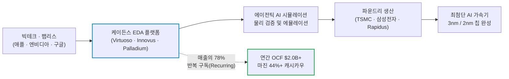
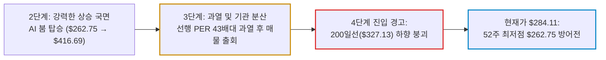

# 케이든스 디자인 시스템(Cadence Design Systems / CDNS) 실전 재무 및 가치 분석 보고서

- **작성일**: 2026-09-09
- **데이터 기준**: 2026년 2분기 실적(2026-06-30 마감), 회사 FY2026 상향 가이던스 및 yfinance 시장 데이터(2026-09-08 미국장 마감 기준)

반도체를 찍어내는 엔비디아나 TSMC가 화려한 조명을 받을 때, 그 반도체를 설계하는 소프트웨어의 목줄을 쥐고 **자체 총매출의 78%를 꼬박꼬박 들어오는 반복 구독료(Recurring Revenue)**로 채우는 진짜 독점 포식자다. 그러나 사업의 위대함과 주가의 매수 적기는 별개다. 200일선($327.13)을 깨고 내려앉은 지금, 고점 밸류에이션 거품이 빠지는 칼날을 맨손으로 잡지 마라.

## 핵심 요약

| 구분 | 핵심 요약 |
| :--- | :--- |
| **종목 및 주가** | 케이든스 디자인 시스템 (NASDAQ: `CDNS`) / **$284.11** (52주 범위 $262.75 ~ $416.69) |
| **최종 투자의견** | **조건부 분할 매수 (Buy on Dip)** / 52주 저점($262) 지지 및 200일선 회복 확인 후 진입 (투자 가치 점수 **86.0점**, 6.1절) |
| **비즈니스 본질** | 반도체 EDA 및 시스템 시뮬레이션 독과점, 78% 반복 구독 매출, 천문학적 전환 비용(Lock-in) |
| **핵심 매력 (Bull)** | Q2 매출 YoY +24.2%, 연간 성장 가이드 19% 상향, 역대급 백로그 $8.1B, Non-GAAP 마진 44%+, 에이전틱 AI 본격화 |
| **핵심 리스크 (Bear)** | 200일선 하향 이탈(-13.2%), 선행 PER 29.8배로 피어 중앙값 대비 +59% 프리미엄, 분기 SBC($147M)로 인한 GAAP vs 비GAAP 이익 괴리 |
| **포트폴리오 성격** | AI 인프라 장기 복리 사이클의 **고품질 코어 성장주(베타 1.14, 배당 0원)** / **단기 2배 폭등이나 고배당을 바라는 투기꾼은 매수 금지** |

---

## 1. 비즈니스 실체: 대중이 모르는 기업의 '목줄'과 독점 빨대

대중은 AI 반도체 열풍을 보며 엔비디아(NVDA)의 GPU나 TSMC의 파운드리 패키징에만 환호한다. 전형적인 하수들의 시야다. 실리콘 웨이퍼 위에 수백억 개의 트랜지스터를 오차 0.001%도 없이 배치하고, 열 분산과 전력 누수를 시뮬레이션하는 특수 소프트웨어 없이는 엔비디아의 블랙웰도 한 장짜리 플라스틱 쓰레기에 불과하다.

케이든스 디자인 시스템(Cadence Design Systems, `CDNS`)은 시놉시스(Synopsys, `SNPS`)와 함께 전 세계 **EDA(Electronic Design Automation, 전자 설계 자동화)** 시장을 양분하는 과점 포식자다. 반도체 설계 팹리스(애플, 엔비디아, AMD, 퀄컴)와 파운드리(TSMC, 삼성전자, 라피더스)는 케이든스의 소프트웨어 라이선스가 없으면 개발 라인 전체를 멈춰야 한다.

### 1.1 빠져나갈 구멍이 없는 극단적 락인(Lock-in)과 통행세

- **① 78%의 반복 매출(Recurring Revenue)**:
    - 케이든스의 전체 매출 중 약 78%는 구독(Subscription) 및 장기 유지보수 라이선스 계약에서 나온다. 경기가 침체되어 칩 생산 물량이 일시적으로 줄더라도, 차세대 칩을 설계하는 연구개발(R&D) 소프트웨어 구독료는 하루도 빠짐없이 입금된다.
- **② 천문학적인 전환 비용(Switching Cost)**:
    - 수천 명의 반도체 설계 엔지니어들이 10년 넘게 손에 익힌 Virtuoso, Innovus 툴체인을 경쟁사 소프트웨어로 교체하는 것은 불가능에 가깝다. 소프트웨어 하나 바꾸려다 설계 오류가 발생하면 수천억 원짜리 마스크 제작과 테이프아웃(Tape-out)이 통째로 날아간다.
- **③ 빅테크 자체 칩(ASIC) 개발 열풍의 최대 수혜**:
    - 구글, 아마존, 메타, 마이크로소프트, 테슬라 등 빅테크들이 엔비디아 의존도를 낮추기 위해 자체 AI 가속기를 직접 설계할수록 케이든스의 고가 라이선스 판매량은 기하급수적으로 폭증한다. 칩을 누가 이기든 설계 도구를 파는 케이든스는 통행세를 뜯는다.

---

## 2. 최근 실적과 시장의 오독: 대중의 착시 vs 숫자의 팩트

### 2.1 분기 실적 팩트 체크: GAAP와 Non-GAAP의 괴리를 꿰뚫어 봐라

2026년 2분기 케이든스는 시장의 기대를 훌쩍 뛰어넘는 어닝 서프라이즈를 발표했다. 그러나 월가의 화려한 비GAAP 포장에만 취해 있으면 진짜 숫자를 놓친다.

| 재무 지표 | Q2 2025 | Q1 2026 | Q2 2026 | 전년 동기 대비(YoY) | 냉혹한 데이터 분석 |
| :--- | ---: | ---: | ---: | ---: | :--- |
| **총매출** | $1,275.4M | $1,474.2M | **$1,584.5M** | **+24.2%** | 하이퍼스케일러 커스텀 실리콘 및 시스템 설계 수요 폭증 |
| **GAAP 영업이익** | $370.4M | $431.3M | **$450.0M** | **+21.5%** | GAAP 기준 영업이익률 **28.4%** 기록 |
| **Non-GAAP 영업이익률** | 42.1% | 43.5% | **44.8%** | **+2.7%p** | 고마진 소프트웨어 믹스 개선으로 44%대 고착화 |
| **GAAP 순이익** | $160.1M | $335.7M | **$367.1M** | **+129.3%** | 일회성 비용 안정화 및 견고한 탑라인 레버리지 |
| **GAAP 희석 EPS** | $0.59 | $1.23 | **$1.33** | **+125.4%** | 순수 회계 기준 주당순이익 |
| **Non-GAAP 희석 EPS** | $1.65 | $1.92 | **$2.11** | **+27.9%** | 월가 컨센서스 대폭 상회 |
| **영업현금흐름 (OCF)** | $377.6M | $355.8M | **$634.9M** | **+68.1%** | 분기 사상 최대 현금 창출력 증명 |
| **설비투자 (CapEx)** | $44.1M | $48.8M | **$59.6M** | **+35.2%** | 클라우드 에뮬레이션 인프라 구축 투자 |
| **잉여현금흐름 (FCF)** | $333.5M | $307.0M | **$575.3M** | **+72.5%** | 매출액 대비 FCF 전환율 무려 **36.3%** 달성 |

출처: GAAP 수치는 yfinance 분기 재무제표, Non-GAAP 수치는 케이든스 2026년 2분기 실적 발표(2026-06-30 마감 기준).

!!! note "GAAP EPS $1.33과 Non-GAAP EPS $2.11 사이의 $0.78 괴리"
    케이든스는 분기마다 약 **$146.9M**의 막대한 주식기준보상(SBC)과 **$34.3M**의 인수 무형자산 상각비를 지출한다. 월가는 이를 "비경상적 비용"이라며 털어내고 Non-GAAP EPS $2.11로 환호하지만, 기존 주주의 지분 희석을 유발하는 SBC는 엄연한 주주 가치 차감 요인이다. 숫자를 볼 때는 반드시 두 시선을 병행해야 한다.

### 2.2 가이던스 상향과 수주 잔고의 진실

- **연간 매출 성장률 19%로 상향 조정**: 상반기 강력한 수주 모멘텀을 바탕으로 2026 회계연도 연간 매출 가이던스를 두 자릿수 후반(19%)으로 대폭 끌어올렸다.
- **연간 영업현금흐름 약 20억 달러($2.0B) 전망**: 1년 동안 벌어들이는 순수 영업 현금만 2조 7천억 원에 달한다.
- **역대급 백로그(Backlog) 81억 달러($8.1B)**: 2분기 말 기준 향후 공급이 확정된 수주 잔고가 81억 달러를 돌파했다. 최근 12개월 매출 58.4억 달러 기준으로 약 1.4년치 매출을 미리 확보해 둔 셈이며, 업황이 꺾여도 실적 바닥을 받쳐 주는 방파제다.

### 2.3 시장의 착시 vs 냉혹한 데이터 팩트

| 시장이 보고 놀란 것 (착시) | 데이터가 말해주는 진실 (팩트) |
| :--- | :--- |
| **"실적이 어닝 서프라이즈인데 왜 주가는 최근 고점 대비 31.8%나 빠졌냐?"** | 실적이 나빠서 빠진 게 아니다. 현재 선행 EPS $9.54로 역산하면 고점 $416.69는 선행 PER **43.7배**, 지금은 **29.8배**다. 이익이 줄어서가 아니라 시장이 지불하겠다는 배수가 깎인 '멀티플 압축(Multiple Compression)'일 뿐이다. |
| **"백로그 81억 달러가 있으니 당장 실적이 폭발할 것이다"** | 케이든스의 EDA 라이선스는 고객사가 계약했다고 한 번에 장부에 잡히지 않는다. 2~3년에 걸쳐 균등 분할 인식된다. 백로그는 단기 폭등 재료가 아니라 장기 하방을 지키는 콘크리트 바닥이다. |
| **"에이전틱 AI가 엔지니어를 대체하면 소프트웨어 라이선스 구매가 줄어들 것이다"** | 무식한 소리다. AI가 설계 생산성을 높일수록 칩 설계 프로젝트 수는 10배로 늘어난다. 케이든스는 이를 지원하기 위해 더 비싼 에이전틱 AI 솔루션과 클라우드 컴퓨팅 사용료를 패키지로 팔아 단가(ARPU)를 끌어올린다. |

---

## 3. 경쟁 해자 및 피어 그룹 잔혹 비교

EDA 및 하이엔드 엔지니어링 소프트웨어 시장은 신규 진입자가 발을 들여놓을 수 없는 난공불락의 요새다. 그러나 동종 피어들과 숫자를 견주어 보면 케이든스의 상대적 밸류에이션 위치가 명확히 드러난다.

| 시장 비교 지표 | 케이든스 `CDNS` | 시놉시스 `SNPS` | Arm 홀딩스 `ARM` | 오토데스크 `ADSK` | PTC `PTC` |
| :--- | ---: | ---: | ---: | ---: | ---: |
| **현재 주가 ($)** | **284.11** | 392.03 | 261.53 | 212.21 | 133.26 |
| **시가총액 ($B)** | **78.24** | 75.13 | 279.31 | 44.35 | 14.46 |
| **후행 PER (TTM)** | **56.5배** | 68.7배 | 266.9배 | 27.5배 | 12.9배 |
| **선행 PER (Forward)** | **29.8배** | 22.4배 | 85.4배 | 14.9배 | 15.0배 |
| **주가매출비율 (P/S)** | **13.4배** | 8.0배 | 54.2배 | 5.7배 | 4.9배 |
| **EV/EBITDA** | **36.8배** | 39.7배 | 259.4배 | 19.2배 | 12.3배 |
| **최근 분기 매출 성장률 (YoY)** | **+24.2%** | +42.4% | +22.4% | +16.1% | -6.8% |
| **GAAP 영업이익률 (TTM)** | **30.8%** | 11.0% | 17.3% | 27.9% | 38.2% |

출처: yfinance 시장 데이터(2026-09-08 종가 기준). [Cadence Design Systems(CDNS)](https://finance.yahoo.com/quote/CDNS/), [Synopsys(SNPS)](https://finance.yahoo.com/quote/SNPS/), [Arm Holdings(ARM)](https://finance.yahoo.com/quote/ARM/), [Autodesk(ADSK)](https://finance.yahoo.com/quote/ADSK/), [PTC(PTC)](https://finance.yahoo.com/quote/PTC/)

비교 대상 기업들의 실제 비즈니스 성격은 다음과 같다.

- **케이든스 디자인 시스템 (Cadence Design Systems, `CDNS`)**: 반도체 설계 자동화(EDA) 툴체인, 하드웨어 에뮬레이션 장비(Palladium), 시스템 해석 소프트웨어를 공급하는 EDA 복점의 한 축.
- **시놉시스 (Synopsys, `SNPS`)**: EDA 시장을 케이든스와 절반씩 나눠 갖는 직접 경쟁자. 설계 IP 포트폴리오가 가장 넓고, 앤시스(Ansys) 인수로 시뮬레이션 영역까지 삼켰다.
- **Arm 홀딩스 (Arm Holdings, `ARM`)**: CPU 명령어 집합과 코어 IP를 라이선스하고 칩 출하량마다 로열티를 걷는 설계 자산 기업. 설계 '도구'가 아니라 설계 '자산'을 판다.
- **오토데스크 (Autodesk, `ADSK`)**: AutoCAD와 Revit을 앞세운 건축·제조 설계 소프트웨어 기업. 구독 전환을 이미 끝낸 성숙기 설계 소프트웨어의 밸류에이션 기준점.
- **PTC (PTC Inc., `PTC`)**: Creo(CAD)와 Windchill(PLM)을 공급하는 산업용 제품수명주기 관리 기업. 산업 소프트웨어 배수의 바닥을 보여 주는 피어.

EDA는 케이든스와 시놉시스의 사실상 복점이라 완전한 동종 피어 자체가 희소하다. Arm은 설계 자산, 오토데스크와 PTC는 범용 산업 설계 소프트웨어여서 사업 구성과 성장률이 서로 달라 배수를 1:1로 맞대는 것은 무리다. 게다가 후행 PER은 GAAP 실적, 선행 PER은 월가의 조정(Non-GAAP) 컨센서스를 쓰기 때문에 두 지표의 절대 수준을 직접 비교하면 안 된다.

네 피어(시놉시스·Arm·오토데스크·PTC)의 선행 PER 중앙값은 약 **18.7배**, EV/EBITDA 중앙값은 약 **29.4배**다. 케이든스는 각각 약 **59%**, **25%** 비싸다. 냉정하게 말해 케이든스는 지금도 피어 대비 싼 주식이 아니다. 고점 대비 31.8% 빠졌다는 사실이 곧 저평가를 뜻하지는 않는다.

### 3.1 피어 대비 핵심 경쟁력 및 리스크 판정

- **케이든스 vs 시놉시스 — 배수가 아니라 실적 품질의 격차다**:
    - 두 공룡이 EDA 시장을 절반씩 나눠 갖고 있지만 돈을 버는 품질은 전혀 다르다. 최근 12개월 GAAP 영업이익률은 케이든스가 **30.8%**(매출 58.4억 달러, 영업이익 18.0억 달러)인 반면 시놉시스는 **11.0%**(매출 94.2억 달러, 영업이익 10.4억 달러)에 그친다.
    - 시놉시스의 최근 분기 매출 +42.4% 성장은 앤시스 인수 합산 효과가 상당 부분을 차지하고, 그 대가로 인수 무형자산 상각과 통합 비용이 GAAP 실적을 짓눌러 후행 PER이 68.7배까지 부풀었다. 조정 실적 기준 선행 PER에서 케이든스(29.8배)가 시놉시스(22.4배)보다 33% 비싸 보이는 것은 프리미엄 차이가 아니라 이 회계 왜곡이 드리운 그림자다.
    - 대차대조표는 더 갈린다. 케이든스는 총차입금 26.5억 달러에 현금 14.4억 달러를 맞물려 **순차입금 10.4억 달러**로 가볍다. 인수 대금을 조달하며 순차입금 64.3억 달러를 짊어진 시놉시스와는 위기 국면에서 버틸 체력 자체가 다르다.
- **Arm과의 광기 비교**:
    - Arm의 후행 PER 266.9배, 선행 PER 85.4배, P/S 54.2배는 이성적인 금융 시장의 가격이 아니다. 다만 착각하지 마라. 케이든스가 "피어 대비 싸다"는 말이 성립하는 유일한 비교 대상이 이 광기 하나뿐이다.
- **성장과 마진을 동시에 들고 있는 유일한 회사**:
    - PTC의 GAAP 영업이익률 38.2%는 케이든스(30.8%)보다 높다. 그러나 PTC의 최근 분기 매출은 **-6.8% 역성장**이다. 마진이 아무리 두꺼워도 파이가 줄어드는 회사에 성장 배수를 줄 수는 없다.
    - 반대로 시놉시스는 +42.4% 성장했지만 영업이익률이 11.0%까지 주저앉았다. **+24.2% 성장과 30%대 GAAP 영업이익률, 매출 대비 36.3%의 FCF 전환율을 동시에 들고 있는 회사는 이 표에서 케이든스뿐이다.** P/S 13.4배라는 비싼 값에는 이유가 있다.

---

## 4. 기술적 사이클 위치 (4단계 사이클 모델)

스탠 와인스타인의 4단계 사이클 모델로 진단할 때, 케이든스는 **3단계 천장 분산(Distribution)을 끝내고 4단계 하락에 진입해, 52주 최저점($262.75)까지 8% 남짓 완충 구간을 남겨 둔 단기 과매도 국면**에 위치해 있다.

| 기술 지표 | 2026-09-08 기준값 | 기술적 상태 판정 |
| :--- | ---: | :--- |
| **현재 주가** | **$284.11** | **5거래일 연속 음봉**, 그사이 누적 **-16.1%** 급락 (전일 대비 -2.93%) |
| **52주 최고가** | **$416.69** | 고점 대비 **-31.8%** 급락 (과열 거품 해소) |
| **52주 최저가** | **$262.75** | 최저점 대비 불과 **+8.1%** 상회 (강력한 하방 지지선 근접) |
| **50일 이동평균선** | **$341.64** | 주가가 50일선 대비 **-16.8%** 아래 위치 (단기 역배열) |
| **200일 이동평균선** | **$327.13** | 주가가 장기 생명선인 200일선 대비 **-13.2%** 하회 (추세 이탈) |
| **최근 거래량** | **4.40M 주** | 3개월 평균(약 2.33M) 대비 **1.89배** 폭증, 직전 거래일(4.22M)과 이틀 연속 대량 거래 (기관 손절 매물 출회) |

### 4.1 차트가 말하는 냉혹한 현실

주가가 200일선($327.13)을 하향 돌파한 뒤 이틀 연속 평균의 1.8배가 넘는 거래량이 터졌다는 것은 기관 투자자들의 차익 실현 및 손절 물량이 시장에 쏟아져 나왔다는 뜻이다. 5거래일 만에 $338.78에서 $284.11까지 16.1%를 밀어낸 매도 압력은 개인이 받아낼 수 있는 크기가 아니다.

실적이 아무리 좋아도 200일선 아래에서 떨어지는 칼날을 성급하게 맨손으로 잡는 행위는 자살 행위다. 주가가 52주 최저점인 **$262.75** 부근에서 바닥을 다지며 거래량이 급감하는지, 아니면 200일선을 재탈환하는 양봉을 만드는지 눈으로 확인하기 전까지는 절대 흥분하지 마라.

### 4.2 2024~2026년 2년 8개월간 거대 박스권에 갇힌 4대 구조적 원인

차트를 길게 보면 당혹스러운 사실이 드러난다. 엔비디아나 브로드컴 같은 AI 하드웨어 수혜주들이 2~3배 폭등하는 동안, 반도체 설계 독점주라는 케이든스는 **2024년 1월 종가($288.46)에서 2026년 9월 현재($284.11)까지 2년 8개월간 수익률 -1.5%로 사실상 0% 제자리걸음**을 했다. 최저 $250에서 일시 피크 $416까지 거대한 롤러코스터 박스권에 갇혀 헛돌기만 한 데는 명확한 네 가지 구조적 이유가 있다.

| 연도 | 총매출 | GAAP 순이익 | 희석 주당순이익(EPS) | 전년 대비 EPS 성장률 | 회계적 실체 분석 |
| :---: | :---: | :---: | :---: | :---: | :--- |
| **2023년** | $4.09B | $1.04B | **$3.82** | **+23.6%** | AI 붐 초입의 가파른 레버리지 확인 |
| **2024년** | $4.64B | $1.06B | **$3.85** | **+0.8%** | 대중국 규제 및 H/W 전환기로 순이익 정체 충격 |
| **2025년** | $5.30B | $1.11B | **$4.06** | **+5.5%** | 매출 성장 대비 이익 레버리지 둔화 지속 |

- **① 2020~2023년 4배 폭등의 후유증 (미래 실적 극단적 선반영)**:
    - 2020년 초 주가 $72선에서 2023년 말 $272까지 단 4년 만에 4배 가까이 수직 폭등했다.
    - 이때 이미 2024~2025년의 AI 성장 기대를 PER 70~80배 수준까지 주가에 미리 전부 당겨썼다. 실적이 아무리 견고하게 나와도 이미 주가가 미래를 훔쳐와 꼭대기에 서 있었기 때문에 추가 상승 에너지가 고갈된 상태로 2024년을 맞이했다.
- **② 2년 연속 순이익(EPS) 성장 정체 (+0.8%의 충격)**:
    - 매출은 매년 10~15%씩 늘어났으나, 주당순이익(EPS)은 2023년 $3.82에서 2024년 $3.85(+0.8%), 2025년 $4.06(+5.5%)으로 2년간 사실상 성장이 멈췄다.
    - **대중국 수출 통제 직격탄**: 케이든스 매출의 15~17%를 차지하던 중국 알짜 시장에 미국의 첨단 EDA/반도체 수출 규제가 떨어지며 라이선스 갱신과 신규 계약이 대거 지연·축소됐다.
    - **하드웨어 에뮬레이션 공백기**: 대당 수억 원을 호가하는 주력 에뮬레이터 장비(Palladium Z2 → Z3) 세대교체를 앞두고 고객사들이 신형 출시를 기다리며 주문을 미루는 하드웨어 매출 공백이 발생했다.
    - **인건비 및 SBC 폭증**: AI 설계 엔지니어 유치 경쟁으로 연간 4억 달러가 넘는 주식기준보상(SBC)과 연구개발비가 영업이익을 짓눌렀다.
- **③ 78% '구독 모델'의 양날의 검 (단기 폭발력의 부재)**:
    - 엔비디아 같은 칩 제조사는 AI 붐이 터지면 일시불 대량 납품으로 분기 매출이 200~300%씩 튄다.
    - 반면 케이든스는 자체 총매출의 78%가 2~3년에 걸쳐 쪼개서 들어오는 '구독(Recurring)' 구조다. 칩 설계 프로젝트가 10배로 늘어도 구독료는 2~3년에 걸쳐 균등 인식되므로 분기 실적이 한 번에 폭발하지 않는다. 단기 대박을 노리는 시장의 투기 자금 입장에서 "AI 대장주라더니 분기 성장은 10~20%대냐"며 실망 매물을 던지고 하드웨어주로 옮겨간 것이다.
- **④ $416 상단의 50배 멀티플 벽과 '기간 조정(Time Correction)'**:
    - 2026년 봄 빅테크 커스텀 실리콘 열풍으로 $416까지 일시 슈팅했으나, 당시 선행 PER은 43.7배(GAAP 기준 50배 상회)에 달했다.
    - 연간 15~19% 성장하는 소프트웨어 기업에 50배 멀티플은 지속 불가능한 거품이었고, 기관들의 박스권 상단 차익 매물 폭탄을 맞으며 다시 $280대로 곤두박질쳤다.

결국 지난 2년 8개월간 케이든스가 겪은 것은 **"주가가 먼저 뛴 뒤, 멈춰 서서 실적이 올라올 때까지 기다린 전형적인 기간 조정(Time Correction, 멀티플 다이어트)"**이었다. 2024년 초에는 같은 $280대에서 PER이 70배를 넘나들었지만, 지금은 이익 체력이 누적되고 2026년 연간 가이던스가 19%로 상향된 덕분에 **선행 PER 29.8배**까지 거품이 빠졌다. 박스권 하단($260~$280)에서 바닥 지지를 집요하게 확인해야 하는 이유가 바로 여기에 있다.

---

## 5. 밸류에이션 및 가격 타당성 검증

### 5.1 선행 EPS 역산 가격 시나리오

yfinance 기준 케이든스의 2026~2027 회계연도 선행 EPS 컨센서스는 **$9.54**다. 현재 주가 $284.11은 이 예상치 기준 선행 PER 약 **29.8배** 수준에 해당한다.

| 시장 시나리오 | 적용 선행 PER | 산출 적정 주가 | 현재가($284.11) 대비 | 시나리오 발동 조건 |
| :--- | :---: | ---: | ---: | :--- |
| **Bear (비관적)** | **24.0배** | **$228.96** | **-19.4%** | 글로벌 반도체 팹리스 R&D 축소, 매크로 금리 급등으로 멀티플 추가 압축 |
| **Base (중립적)** | **30.0배** | **$286.20** | **+0.7%** | 연간 매출 19% 성장 달성, 현재 밸류에이션에서 하방 경직성 확보 |
| **Bull (낙관적)** | **38.0배** | **$362.52** | **+27.6%** | 에이전틱 AI 신제품 채택 가속, 200일선 회복 및 멀티플 프리미엄 복원 |

### 5.2 가격 타당성 판정

- 현재 주가 $284.11은 정확히 **Base 시나리오(선행 PER 30배)의 중심 가격대**에 안착해 있다. 같은 선행 EPS로 환산한 고점 배수 43.7배에서 29.8배까지, 시장이 지불하는 프리미엄의 3분의 1이 이미 깎여 나갔다.
- 시장의 추가 투매로 주가가 52주 최저선인 **$260선 초반(선행 PER 27배)**까지 밀려난다면, 이는 52주 범위의 최하단이자 고점 대비 37% 낮은 가격대다. 손익비를 따지는 매수자가 노려야 할 자리는 여기다.
- 상방 여력(Bull)은 약 +28%, 극단적 비관(Bear) 하방은 약 -19%로 **손익비는 약 1.5 대 1**이다. 나쁘지 않지만 압도적이지도 않다. Bull 시나리오의 선행 PER 38배는 피어 중앙값(18.7배)의 두 배가 넘는 배수를 시장이 다시 인정해 줘야 성립하는 숫자이므로, 이 상방을 공짜로 가정하지 마라.
- 정리하면 절대 밸류에이션은 적정 구간에 들어왔지만 상대 밸류에이션은 여전히 피어 대비 프리미엄이다. **"싸져서 사는 것"이 아니라 "품질값을 치르고 사는 것"**이라는 사실을 인정하고 진입해야 한다.

---

## 6. 종합 평가 및 냉혹한 계좌 실행 원칙

### 6.1 6대 핵심 투자 지표 다차원 평가 매트릭스

| 평가 영역 | 가중치 | 평점 (100점 만점) | 가중 점수 | 등급 | 핵심 평가 요약 |
| :--- | :---: | :---: | :---: | :---: | :--- |
| **① 비즈니스 모델 및 해자** | 25% | **96점** | 24.00 | `S` | 시놉시스와 양분한 EDA 독과점, 78% 반복 구독, 극단적 락인 |
| **② 실적 성장성 및 가이던스** | 25% | **91점** | 22.75 | `S` | Q2 매출 YoY +24.2%, 연간 가이드 19% 상향, 수주잔고 $8.1B |
| **③ 재무 건전성 및 현금흐름** | 20% | **88점** | 17.60 | `A+` | 연간 OCF $2.0B+, Non-GAAP 마진 44%+, FCF 전환율 36.3% |
| **④ 밸류에이션 매력도** | 15% | **70점** | 10.50 | `B-` | 고점 대비 31.8% 하락했으나 선행 PER 29.8배로 피어 중앙값(18.7배) 대비 59% 프리미엄 |
| **⑤ 기술적 매매 타이밍** | 10% | **67점** | 6.70 | `C+` | 200일선($327.13) 하향 이탈 및 52주 저점($262.75) 방어전 진행 중 |
| **⑥ 리스크 관리 가능성** | 5% | **89점** | 4.45 | `A` | 52주 최저점($262.75)과 200일선 복귀선 등 손절 및 대응 기준 명확 |
| **종합 가중치 환산 점수** | **100%** | — | **86.0점** | **`Buy on Dip`** | **비즈니스는 최상급 독점주, 기술적 바닥 확인 후 분할 매수** |

!!! info "평점 산출 근거"
    종합 점수는 각 영역 평점에 가중치를 곱해 합산한 값이다.
    `96×0.25 + 91×0.25 + 88×0.20 + 70×0.15 + 67×0.10 + 89×0.05 = 86.00점`

    비즈니스 해자(96점)와 실적 성장성(91점), 현금흐름(88점)은 최상위권이다. 반면 200일선을 깬 기술적 위치(67점)와 선행 PER 29.8배의 가격 매력도(70점)는 평균 수준에 머문다. 종합 **86.0점**은 기업의 품질과 진입 시점의 조건이 이만큼 벌어져 있다는 사실을 그대로 반영한 숫자다.

### 6.2 실전 결론: "그래서 지금 어쩌라는 것인가?" (Action Verdict)

#### ① 지금 당장 사야 하는가? ➔ **"몰빵하지 마라. 52주 저점을 방패 삼아 분할 정찰대만 투입해라."**

- **이유**: 실적은 의심할 여지가 없지만, 기술적으로 200일선 아래로 미끄러졌고 거래량이 터진 투매 봉이 나왔다. 시장의 칼날이 어디서 멈출지 예단하고 한 번에 목돈을 집어넣는 것은 오만이다.
- **지금 할 일**: 52주 최저점인 **$262.75** 지지 여부를 주시하면서, 배정 예산의 25% 이내로만 1차 선발대를 진입시키는 조건부 분할 대응이다.

#### ② 이런 주식은 누가 사고, 누가 절대 사면 안 되는가?

- **❌ 절대 사지 마라 (즉시 퇴장)**:
    - 1~2달 안에 50% 급등할 테마주를 찾는 투기꾼.
    - 배당 수익률로 생활비를 충당해야 하는 은퇴자 (배당금 0원, 번 돈 전액을 자사주 매입과 R&D에 재투자한다).
    - 주가 10% 흔들릴 때마다 공포에 질려 패닉 셀을 누르는 심약자.
- **⭕ 반드시 눈독 들이고 주워 담아야 할 사람 (스나이퍼 대기)**:
    - AI 혁명의 화려한 껍데기(챗봇) 대신 뒷골목 독점 통행세를 걷는 인프라 기업을 원하는 장기 복리 투자자.
    - 빅테크들의 자체 실리콘 개발 경쟁(ASIC)에서 구조적으로 승리하는 비즈니스를 계좌의 중심 코어 자산으로 삼고 싶은 자.

#### ③ 이 주식으로 '인생 역전(대박)'을 노리면 안 되는 냉혹한 이유

- **시가총액 780억 달러(약 105조 원)의 골리앗**: 이미 검증될 대로 검증된 초대형 우량 소프트웨어 기업이다. 스타트업처럼 1년에 매출이 2배가 될 수 없으며, 연간 15~20%의 안정적인 복리 성장이 정상적인 물리적 한계다.
- **포트폴리오 내 진짜 쓸모**: 단기 대박을 터뜨려 줄 도박판의 공격수가 아니라, 시장 폭락장에서도 78%의 구독 매출과 $8.1B의 백로그로 계좌의 바닥을 단단하게 지탱해 줄 **'최상급 1티어 앵커(Anchor) 자산'**이다.

### 6.3 실전 가격대별 실행 시나리오 및 분할 매수 로드맵

케이든스에 배정하기로 한 총 투자 예산 내부의 비중이며, **전체 포트폴리오 대비 최대 허용 편입 한도는 4.0% 이내**로 엄격히 제한한다.

| 구분 | 실행 조건 | 배정 비중 / 계좌 한도 | 가격 기준 | 대응 방침 |
| :--- | :--- | :---: | :---: | :--- |
| **1차 진입 (선발대)** | 현재가 부근 하락 진정 확인 시 | **25% / 1.0%** | **$275 ~ $285** | 52주 저점 위에서 1차 정찰 포지션 구축 |
| **2차 매수 (주력)** | 52주 최저가 지지 확인 후 양봉 반등 | **35% / 1.4%** | **$262 ~ $270** | 손익비가 극대화되는 구간에서 핵심 비중 집행 |
| **3차 매수 (추세 복원)** | 200일 이동평균선 돌파 및 종가 안착 | **25% / 1.0%** | **$325 ~ $330** | 장기 상승 추세 복귀 확인 후 불타기 |
| **예비 현금** | 매크로 금리 발작 대비 버퍼 | **15% / 0.6%** | — | 바닥 붕괴 시 추가 대응용으로 계좌에 보존 |
| **철수 기준선 (손절)** | 52주 저점($262.75)을 종가로 내주고 추가 이탈 | **전량 철수** | **주봉 종가 $250 하회** | 하방 지지선이 통째로 무너진 것으로 간주하고 미련 없이 철수 |

!!! tip "최종 핵심 제언 (Executive Takeaway)"
    - **최종 투자 가치 점수**: **86.0점 / 100점** (`Buy on Dip` / 비즈니스 해자 최상급, 기술적 분할 타점 대기)
    - **기업의 목줄을 보라**: 엔비디아와 빅테크가 칩을 설계하는 한, 케이든스에 바치는 78%의 구독료는 줄어들지 않는다.
    - **주가 급락에 쫄지 마라**: 같은 선행 EPS로 환산한 배수가 고점 43.7배에서 29.8배까지 내려왔다. 실적이 아니라 배수가 깎인 하락이므로, 겁먹고 던질 자리가 아니라 나눠 담을 자리다.
    - **단, 원칙 없는 물타기는 금물이다**: 52주 최저점인 **$262.75** 지지력을 철저히 확인하고, 200일선 회복을 보며 계좌 비중 4% 이내에서 냉철하게 분할 집행하라.
