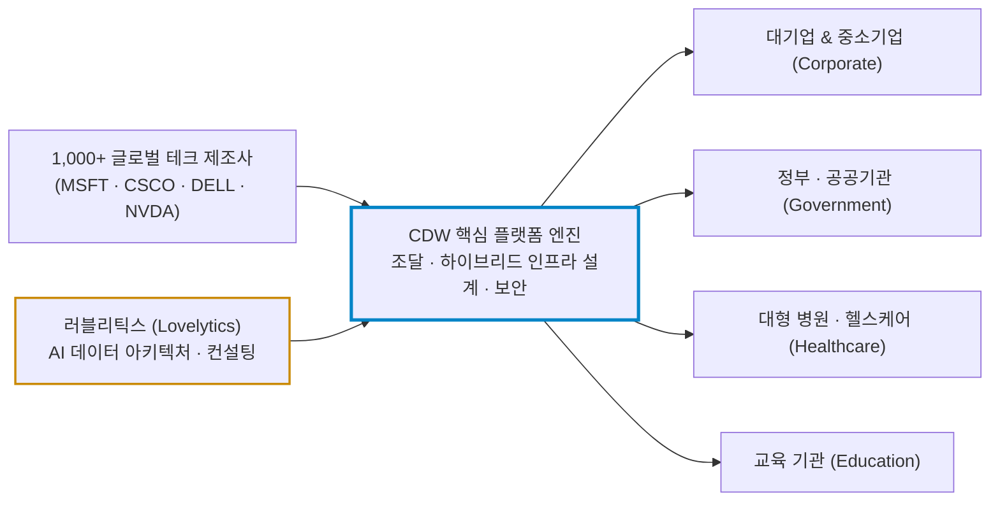
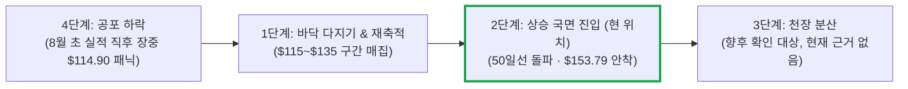

# CDW(CDW) 실전 재무 및 가치 분석 보고서

- **작성일**: 2026-09-14

대중은 2분기 마진 70bp 하락에 질겁해 투매를 던졌지만, 본질은 1,000개 글로벌 테크 브랜드를 틀어쥐고 미국 B2B IT 인프라의 통행세를 걷는 최대 사업자다. 러블리틱스(Lovelytics) 인수로 단순 하드웨어 유통 박스 떼기를 넘어 고마진 AI 데이터 컨설팅으로 체질을 전환하고 있는 CDW는, ROE 44%의 압도적 자본 효율성을 무기로 2단계 상승 파동에 복귀했다. 다만 8월 바닥에서 이미 34% 튀어오른 지금 가격은 손익비가 나오지 않는 자리이며, 이 보고서의 결론은 **"종목은 사되 가격은 기다려라"**로 요약된다.

## 핵심 요약

| 구분 | 핵심 요약 |
| :--- | :--- |
| **종목 및 주가** | CDW Corporation (NASDAQ: `CDW`) / **$153.79** (52주 범위 $97.12 ~ $169.20, 고점 대비 **-9.1%**) |
| **최종 투자의견** | **조건부 분할 매수 (Buy on Dip)** / 현재가는 추격 금지 구간, $140~$145 주력 매집 (투자 가치 점수 **86.7점**, 6.1절) |
| **비즈니스 본질** | 1,000개 벤더와 25만 개 기업·공공기관을 연결하는 미국 최대 B2B IT 솔루션 부가가치 리셀러(VAR) |
| **핵심 매력 (Bull)** | ROE 44.0%, Q2 매출 $65.7억(+10%), 어닝 서프라이즈(+3.93%), 러블리틱스 인수로 AI 데이터 태세(Data Readiness) 선점 |
| **핵심 리스크 (Bear)** | AI 서버 하드웨어 비중 급증에 따른 단기 총이익률(-70bp) 압박, 운전자본 확충에 따른 일시적 현금흐름 둔화, 현재가의 열위한 손익비(0.63:1) |
| **포트폴리오 성격** | 강력한 주주환원을 갖춘 **안정적 실적 성장주** / 베타 0.94로 시장과 유사한 변동성이며, **단기 뜬구름 테마 대박 노림수는 매수 금지** |

---

## 1. 비즈니스 실체: 단순 용산 상가가 아니라 미국 기업들의 IT '목줄'을 쥔 거대 파이프라인

대중은 CDW를 단순히 컴퓨터나 모니터, 서버를 떼어다 파는 'IT 유통상'으로 폄하한다. 비즈니스의 겉껍데기만 보고 속살을 보지 못하는 전형적인 무지다.

기업, 병원, 학교, 연방정부는 일반 소비자처럼 하이마트에 가서 노트북을 사지 않는다. 수천 대의 서버, 시스코 네트워킹 장비, 마이크로소프트 클라우드 라이선스, 사이버 보안 솔루션이 서로 엉키지 않고 돌아가도록 설계·조달·구축·유지보수해 줄 **단일 창구**가 필요하다. CDW는 마이크로소프트, 시스코, 델, 엔비디아 등 1,000개가 넘는 글로벌 테크 제조사와 25만 개 엔터프라이즈 고객 사이에서 쉽게 빠져나갈 수 없는 **통행세 징수원(Value-Added Reseller)** 노릇을 하고 있다.

이 구조의 해자는 세 가지로 압축된다:

- **① 25만 개 고객과 1,000개 공급사가 만든 네트워크 효과**: 신생 스타트업이 CDW를 건너뛰고 포춘 500대 기업이나 미국 국방부에 수만 대의 IT 장비를 직접 납품하는 것은 사실상 불가능하다. 반대로 고객사 역시 검증되지 않은 공급처에 회사의 핵심 전산망을 맡길 수 없다.
- **② 미션 크리티컬 인프라의 잔혹한 전환 비용(Lock-in)**: 은행이나 대학, 병원의 전산망을 다른 유통사로 바꾼다는 것은 시스템 다운타임 위험을 감수해야 함을 뜻한다. 한번 CDW의 컨설팅을 거쳐 장비를 세팅한 고객은 유지보수 계약을 장기간 갱신하며 종속되는 경향이 강하다.
- **③ '박스 떼기'에서 '고마진 AI 솔루션'으로의 진화 (러블리틱스 인수)**: 2026년 9월 초 전격 단행된 5억 2,500만 달러 규모의 러블리틱스(Lovelytics) 인수는 회사의 체질을 바꾸는 결정타다. 데이터브릭스(Databricks) 최상위 파트너인 러블리틱스를 품음으로써, 고객의 데이터를 정제하고 AI 모델을 얹어주는 'AI 데이터 준비 태세(Data Readiness)' 컨설팅 역량을 손에 넣었다. 단순 유통업체의 밸류에이션 굴레를 깨부수고 서비스 소프트웨어 마진을 흡수하는 발판을 마련한 것이다.

### 1.1 해자의 한계: 어디까지가 진짜 실력인가

해자를 인정하되 과대평가하지는 마라. CDW는 독점 사업자가 아니다. 3장에서 직접 대조하듯 TD 시넥스(SNX)와 인사이트 엔터프라이즈(NSIT)라는 명백한 경쟁자가 같은 시장에서 영업하고 있으며, 이들 역시 동일한 벤더 라인업을 취급한다.

- **가격 결정력은 제한적이다**: 매출총이익률 21.36%는 소프트웨어 기업의 70~80%와 비교할 수준이 아니다. CDW가 걷는 것은 독점 이윤이 아니라 유통 마진과 서비스 수수료이며, 이번 2분기 총이익률 70bp 하락이 보여주듯 **제품 믹스가 바뀌면 마진은 즉시 흔들린다.**
- **진짜 해자는 규모와 관계 자산에 있다**: 1,000개 벤더 인증과 25만 고객의 조달 이력, 수만 명 규모의 기술 인력이 만드는 진입 장벽은 실재한다. 다만 이것은 "대체 불가"가 아니라 "대체 비용이 비싸다"는 뜻이다.
- **러블리틱스 효과는 아직 숫자로 확인되지 않았다**: 인수 발표는 2026년 9월 2일이며, 매출과 마진 기여는 아직 어느 분기 실적에도 반영되지 않았다. 이 인수가 밸류에이션 리레이팅의 근거가 되려면 최소 2~3개 분기의 서비스 매출 비중 추이가 필요하다. 현 시점에서 리레이팅은 **기대이지 사실이 아니다.**

---

## 2. 최근 3개월 핵심 이슈와 시장의 오독: 대중의 착시 vs 숫자의 팩트

### 2.1 최근 3개월 핵심 뉴스 및 스마트머니 타임라인 (2026.06.24 ~ 2026.09.11)

2026년 6월 말부터 9월 중순까지의 핵심 흐름은 **'AI 인프라 및 서버 교체 사이클 확인 ➔ 2분기 마진 믹스 우려에 따른 일시적 과매도 ➔ 러블리틱스 인수를 통한 AI 데이터 체질 개선 ➔ 주가 전고점 복원'**이라는 정형화된 매집 및 리레이팅 궤적을 보여준다.

| 일자 | 주요 뉴스 및 시장 이벤트 | 영향도 | 스마트머니 관점의 핵심 분석 및 시사점 |
| :--- | :--- | :---: | :--- |
| **06.24** | **모건스탠리, 투자의견 '비중확대' 상향 및 목표주가 $142→$170 대폭 상향** | `🟢 스마트머니` | 모건스탠리(에릭 우드링 애널리스트)가 AI 인프라 구축 확대와 엔터프라이즈 서버 교체 주기(Refresh Cycle) 도래를 근거로 서버 시장 전망을 상향하고, CDW를 최우선 수혜주로 지목하며 목표가를 19.7% 상향 조정. TD 시넥스(SNX) 목표가도 동반 상향하며 IT 유통 섹터 전반의 턴어라운드 공식화 |
| **08.05** | **2026 Q2 어닝 서프라이즈 발표에도 장중 -25% 급락 ($114.90)** | `🔴 단기 과매도` | 매출 $65.72억(YoY +10%), EPS $2.91로 시장 예상($2.80)을 상회했으나, AI 서버·하드웨어 비중 급증에 따른 총이익률 70bp 하락과 운전자본 확충에 따른 일시적 FCF 둔화에 질겁한 단기 알고리즘의 패닉 투매 출회. 당일 581만 주의 폭발적 손바뀜 발생 |
| **09.02** | **AI 데이터 컨설팅 전문 '러블리틱스(Lovelytics)' 5.25억 달러 인수 발표** | `🟢 체질 전환` | 데이터브릭스 최상위 파트너를 전격 인수. 단순 하드웨어 조달을 넘어 기업 고객들의 'AI 데이터 준비 태세(Data Readiness)' 컨설팅 역량을 조기 내재화함으로써 고마진 소프트웨어·서비스 기업으로의 리레이팅 발판 구축. 다만 실적 기여는 아직 미반영 |
| **09.11** | **Citi 글로벌 TMT 컨퍼런스 참가 및 AI 실무 수요 확인 ($153.79 복원)** | `🟢 추세 복원` | 경영진이 기업들의 AI 투자가 인프라 세팅을 넘어 실제 구현·운영 단계로 진입했음을 밝히고, IT 시장 성장률을 200~300bp 상회하는 아웃퍼폼 가이던스를 재확인하며 8월 급락 전 가격대 회복 |

### 2.2 대중의 착시 vs 데이터가 증명하는 진실

| 시장이 보고 놀란 것 (대중의 착시) | 데이터가 말하는 사실 (숫자의 팩트) |
| :--- | :--- |
| **"총이익률 70bp 하락! 마진이 훼손됐다"** | **초기 AI 서버·인프라 대량 납품에 따른 믹스 왜곡일 가능성이 크다.** 2분기 매출은 $65.72억으로 전년 대비 10% 급증했고 EPS는 $2.91로 컨센서스($2.80)를 3.93% 상회했다. 모건스탠리가 6월에 예고했던 대로 서버·데이터센터 하드웨어 지출이 늘면서 일시적으로 마진율이 눌린 것으로 해석되며, 통상 대규모 납품 뒤에는 고마진 유지보수와 소프트웨어 마이그레이션이 뒤따른다. 다만 이 회복 경로는 3분기 총이익률로 확인해야 할 가설이다. |
| **"현금흐름이 말라붙었다? 유동성 위기론"** | **급증한 기업 수주를 소화하기 위한 운전자본(Working Capital) 확충으로 보인다.** 매출채권과 재고 증가로 분기 FCF가 둔화되었으며, 연간 영업현금흐름(TTM)은 $9.82억이다. 이 수치는 2분기 운전자본 확충이 반영된 값이므로, 정상화 여부는 3분기 현금흐름표로 확인해야 한다. |
| **"AI 도입은 빅테크만 돈 벌고 유통사는 소외된다"** | **러블리틱스 인수가 이 전제에 정면으로 맞선다.** 기업들의 AI 니즈는 이제 칩 구매(1단계)를 넘어 자체 데이터 통합 및 운영(2단계)으로 진입했다. CDW는 5.25억 달러로 이 관문에 진입했다. 다만 성과는 향후 실적으로 증명되어야 한다. |
| **"경기 둔화로 기업 IT 예산이 동결될 것이다"** | **9월 중순 Citi 글로벌 TMT 컨퍼런스에서 경영진이 가이던스를 재확인했다.** 기업들의 AI 디지털 전환 수요가 견조하며, CDW는 전체 IT 시장 성장률을 200~300bp 상회하는 아웃퍼폼 목표를 유지했다. 가이던스는 회사의 전망이지 확정된 실적이 아니다. |

출처: CDW Corporation 실적 공시 및 IR 자료, 모건스탠리 리서치(2026-06-24), yfinance 시장 데이터.

대중이 마진 70bp 하락이라는 단기 숫자에 놀라 주식을 집어던질 때, 스마트머니는 모건스탠리가 일찌감치 짚어낸 서버 교체 사이클을 근거로 $114~$135 구간에서 물량을 담았다. 실적 직후의 급락은 펀더멘털 훼손의 증거라기보다, 고평가 부담을 한 번에 털어내는 안전마진 창출 구간이었다고 보는 편이 정확하다.

---

## 3. 경쟁 해자 및 피어 그룹 잔혹 비교: ROE 44%의 압도적 클래스

IT 유통 및 솔루션 섹터의 경쟁사들과 숫자를 대조해 보면 CDW가 왜 이 시장의 원톱인지 적나라하게 드러난다.

| 비교 지표 | CDW (`CDW`) | TD SYNNEX (`SNX`) | Insight Enterprises (`NSIT`) | 시장 및 섹터 해석 |
| :--- | :---: | :---: | :---: | :--- |
| **자기자본이익률 (ROE)** | **44.01%** | 13.14% | 13.11% | **CDW의 자본 배치 및 이익 창출 효율이 피어 대비 3.3배 우위** |
| **영업이익률 (Operating Margin)** | **7.35%** | 2.66% | 6.18% | 단순 도매 물류(SNX)와 차별화된 고마진 솔루션 컨설팅 비중 입증 |
| **매출총이익률 (Gross Margin)** | **21.36%** | 7.05% | 22.10% | 20%대 마진 구조 유지. 다만 NSIT가 소폭 앞서며, 이 지표만으로는 우위가 아니다 |
| **선행 PER (Forward P/E)** | **12.77배** | 12.58배 | 12.48배 | **피어와 사실상 동일한 배수.** 절대적 저평가가 아니라 '같은 값에 3.3배 자본 효율'이라는 상대 우위 |
| **배당수익률 (Dividend Yield)** | **1.64%** | 0.71% | 없음 (0.00%) | 안정적 현금 창출력에 기반한 강력한 주주환원 |
| **시가총액** | **$192.3억** | $108.5억 | $55.2억 | 섹터 최대 규모의 유동성과 기관 수급 방파제 확보 |

출처: yfinance 2026-09-14 기준 시장 데이터.

### 3.1 피어 대비 핵심 경쟁력 및 리스크 판정

- **우위는 명확하다**: TD 시넥스(SNX)는 2%대 영업이익률의 단순 도매 유통업자이고, 인사이트(NSIT)는 규모의 경제와 주주환원에서 CDW에 미치지 못한다. ROE 44%는 유통업 평균을 압도하는 수치이며, 이는 낮은 자본 투입으로 이익을 뽑아내는 자산 경량(Asset-light) 모델의 산물이다.
- **그러나 "저평가"라는 결론으로 건너뛰지 마라**: 선행 PER 12.77배는 SNX 12.58배, NSIT 12.48배와 사실상 같다. **시장은 CDW에 피어 대비 프리미엄을 주지 않고 있다.** 이것을 "시장의 오류"로 단정할 수도, "유통업 멀티플의 천장"으로 해석할 수도 있다. 전자가 맞다면 리레이팅 여력이 있고, 후자가 맞다면 배수 확장 없이 EPS 성장분만 먹는 종목이다.
- **리레이팅의 유일한 열쇠**: 그 판정은 러블리틱스 인수 이후 **서비스·소프트웨어 매출 비중이 실제로 올라가는지**에 달려 있다. 이 지표가 개선되지 않으면 CDW는 계속 12배짜리 유통사로 남는다. 향후 분기 실적에서 이 항목부터 확인하라.
- **ROE 44%의 이면도 보라**: 높은 ROE에는 자사주 매입에 따른 자기자본 축소 효과가 포함된다. 자본 효율이 뛰어난 것은 사실이지만, 이 수치를 사업 수익성만의 결과로 읽으면 과대평가한다.

---

## 4. 기술적 사이클 위치 (4단계 사이클 모델)

스탠 와인스타인(Stan Weinstein)의 4단계 주가 사이클 모델을 적용해 현재 주가의 위치를 해부한다.

- **현재 위치**: **2단계 상승 국면 (초·중기 리바운드 및 추세 복원)**
- **기술적 근거**:
    - **패닉 셀링의 소화**: 8월 5일 실적 당일 581만 주의 폭발적 거래량을 동반하며 장중 $114.90까지 곤두박질쳤다. 이 저가는 200일 이동평균선($130.64)을 **12.0% 하회한 수준**으로, 200일선이 지지선으로 작동한 것이 아니라 장중에 한 차례 관통당했음을 뜻한다. 이후 종가 기준으로 $130선을 회복하며 바닥을 다졌다.
    - **이동평균선 정배열 복원**: 주가는 200일선($130.64)에 이어 50일선($140.09)을 상향 돌파했다. 현재 주가($153.79)는 주요 중장기 이동평균선을 모두 발아래 두고 있다.
    - **전고점 매물대 흡수 파동**: 8월 초 급락 직전 가격대인 $153.26을 메우며 갭(Gap)을 채웠다. 러블리틱스 인수 발표와 TMT 컨퍼런스를 계기로 거래량이 실리며 52주 신고가($169.20)를 향한 우상향 경로에 올라섰다.

### 4.1 차트가 말하는 냉혹한 현실: 추세는 맞고 가격은 늦었다

추세 판정과 진입 판정을 혼동하지 마라. 2단계 상승 국면이라는 진단은 유효하지만, 그것이 **지금 사라는 신호는 아니다.**

- **이미 34% 올랐다**: 8월 5일 장중 저가 $114.90에서 현재 $153.79까지 약 **+33.8%**다. 한 달 남짓한 기간의 V자 반등 직후이며, 진입 타이밍으로는 가장 불리한 국면이다.
- **위쪽 공간이 좁다**: 현재가에서 52주 신고가 $169.20까지는 **+10.0%**뿐인 반면, 유효한 방어선인 200일선 $130.64까지는 **-15.1%**다. 저항까지의 거리보다 지지까지의 거리가 1.5배 멀다는 뜻이며, 이 비대칭이 5.2절 손익비 계산의 실질이다.
- **$153선은 매물대다**: 8월 급락 직전 가격($153.26)은 당시 물린 보유자들의 본전 구간이다. 갭은 메웠지만, 이 구간을 뚫고 신고가로 가려면 매물 소화 시간이 필요하다. 3~5일간의 숨고르기 조정을 기다리는 편이 합리적이다.
- **다시 확인할 생명선**: 8월에 장중으로나마 200일선이 뚫렸다는 사실은, 이 종목이 악재 앞에서 15%를 순식간에 내줄 수 있음을 증명했다. 손절선을 감정이 아니라 규칙으로 정해두어야 하는 이유다.

---

## 5. 밸류에이션 및 가격 타당성 검증

### 5.1 선행 EPS 역산 가격 시나리오

밸류에이션에 들어가기 전에 **회계 기준부터 맞춰야 한다.** CDW의 후행 PER 18.48배는 GAAP 기준(TTM EPS 약 $8.32)이고, 선행 PER 12.77배는 무형자산 상각 등을 제외한 조정(Non-GAAP) 기준이다. 두 배수가 크게 벌어진 것은 실적이 나빠서가 아니라 기준이 다르기 때문이며, 이 차이를 뭉개면 "18배는 비싸고 12배는 싸다"는 식의 엉터리 결론이 나온다.

yfinance 기준 CDW의 선행 EPS(향후 12개월 조정 EPS) 컨센서스는 **$12.04**다. 현재 주가 $153.79는 이 예상치 기준 **선행 PER 약 12.77배** 수준이다. 아래 표는 이 선행 EPS를 고정한 채 적용 멀티플만 변화시킨 민감도 계산이며, EPS와 배수를 동시에 낙관적으로 올려 잡은 숫자는 분석이 아니라 희망의 산술이다.

| 시장 시나리오 | 적용 선행 PER | 산출 적정 주가 | 현재가($153.79) 대비 | 시나리오 발동 조건 |
| :--- | :---: | ---: | ---: | :--- |
| **Bear (비관적)** | **11.0배** | **$132.44** | **-13.9%** | 기업 IT 지출 둔화, 하드웨어 마진 압박 장기화, 유통사 멀티플로 재고착 |
| **Base (중립적)** | **13.5배** | **$162.54** | **+5.7%** | 가이던스 부합, 3분기 총이익률 정상화 확인, 피어(12.5배) 대비 소폭 프리미엄 인정 |
| **Bull (낙관적)** | **15.5배** | **$186.62** | **+21.3%** | 러블리틱스 연계 AI 컨설팅 매출이 실적에 반영되며 서비스 비중 상승, 소프트웨어 멀티플 일부 흡수 |

출처: yfinance 선행 EPS 컨센서스 기준 자체 민감도 산출. 적용 멀티플은 가정값이며 시장이 이를 인정한다는 보장은 없다.

### 5.2 가격 타당성 판정

**① 현재 가격의 위치**: $153.79는 Base 시나리오($162.54)에 근접한 가격이다. 상방 여력(Bull)은 약 +21.3%, 하방(Bear)은 약 -13.9%로 겉보기 비율은 1.5 대 1이다. 그러나 이는 손절선을 고려하지 않은 산술이며, 실제 계좌에서 마주할 숫자는 아래와 같다.

**② 손절선을 넣으면 결론이 바뀐다**: 6.3절이 정한 손절 기준선은 200일선 $130 종가 이탈이다. 진입 가격대별로 계산한 손익비는 다음과 같다.

| 진입 구간 | 진입 중앙값 | 손절 $130까지 위험 | Base $162 도달 시 손익비 | Bull $186 도달 시 손익비 |
| :--- | ---: | ---: | ---: | ---: |
| **현재가 추격** | $153.79 | $23.79 | **0.37 : 1** | 1.38 : 1 |
| **1차 정찰대 ($148~$152)** | $150.00 | $20.00 | **0.63 : 1** | 1.83 : 1 |
| **2차 주력 ($140~$145)** | $142.50 | $12.50 | **1.60 : 1** | 3.53 : 1 |
| **3차 하방 확장 ($132~$137)** | $134.50 | $4.50 | **6.23 : 1** | 11.58 : 1 |

**③ 이 표가 매수 로드맵을 결정한다**: 현재가에서 Base 목표까지의 손익비는 **0.37 대 1**로, 벌 수 있는 금액보다 잃을 수 있는 금액이 2.7배 크다. 종목이 우량하다는 사실과 지금 사도 된다는 판단은 별개의 문제이며, 비중은 손익비가 개선되는 아래쪽 구간에 실어야 한다. 1차 정찰대에 소액만 넣고 $140~$145 주력 구간을 기다리는 6.3절의 배분은 이 계산에서 도출된 것이다.

!!! warning "손익비 계산의 한계"
    위 계산은 수수료와 슬리피지, 갭 하락을 제외한 값이다. 실제 손실은 계획 위험을 넘어설 수 있으며, 특히 3차 하방 확장 구간($132~$137)의 위험 $4.50은 손절선과의 간격이 매우 좁아 일중 변동만으로도 이탈할 수 있다. 손익비가 높다는 것은 도달 확률이 높다는 뜻이 아니다.

**④ 주주환원의 지속성**: CDW는 연 1.64%의 배당을 지급하며 자사주 매입으로 발행주식 수를 줄여나가고 있다(2025년 3분기 1.30억 주에서 2026년 2분기 1.25억 주로 약 3.8% 감소). 주당 가치를 높이는 자본 배치는 확인되지만, 연간 영업현금흐름(TTM) $9.82억 대비 환원 규모의 지속 가능성은 3분기 현금흐름 정상화 여부와 함께 점검해야 한다.

### 5.3 월가 컨센서스 및 주요 투자은행(IB) 목표가 흐름

| 기관명 | 발표일 | 투자의견 | 목표주가 | 핵심 논거 및 시사점 |
| :--- | :---: | :---: | :---: | :--- |
| **모건스탠리 (Morgan Stanley)** | 2026-06-24 | **비중확대 (Overweight, 상향)** | **$170.00** | AI 인프라 구축 가속과 엔터프라이즈 서버 교체 주기(Refresh Cycle) 도래. IT 투자 회복의 최우선 수혜주 지목 ($142→$170 상향) |
| **모건스탠리 (Morgan Stanley)** | 2026-08-06 | **비중확대 (Overweight, 유지)** | **$170.00** | 2분기 실적 직후 마진 압박에 따른 과매도에도 불구하고 펀더멘털 신뢰 재확인 |
| **에버코어 ISI (Evercore ISI)** | 2026-05-07 | **시장상회 (Outperform)** | **$180.00** | B2B IT 솔루션 시장 지배력과 AI 엔터프라이즈 구축 수혜 반영 (집계상 최고 목표가). **단, 2분기 실적과 러블리틱스 인수 이전 자료이므로 갱신 여부 미확인** |
| **바클레이스 (Barclays)** | 2026-09-08 | 동일비중 (Equal-Weight) | $123.00 | 단기 하드웨어 마진 압박과 운전자본 확충을 감안한 보수적 시각 유지 (집계상 최저 목표가) |

출처: 각 투자은행 리서치 노트 및 yfinance 애널리스트 컨센서스 집계(2026-09-14 기준).

- **투자의견 분포**: 총 9개 기관 중 매수 7곳, 보유 2곳, 매도 0곳.
- **목표주가 집계**: 9개 기관 컨센서스 평균 **$158.89**, 최고 **$180.00**(에버코어), 최저 **$123.00**(바클레이스). 위 표에 실린 4개 기관만의 단순평균은 $160.75로, 집계 대상이 다르면 평균도 달라진다.
- 컨센서스 평균 $158.89는 현재가 대비 **+3.3%**에 불과하다. 월가 주류가 8월의 마진 쇼크를 과민반응으로 보면서도, 현재 가격에 이미 상당 부분의 회복을 반영했다고 판단하고 있다는 뜻이다. 목표가는 어느 기관의 보증도 아니며, 특히 4개월 전 목표가($180)를 현재의 상방 근거로 그대로 쓰는 것은 위험하다.

---

## 6. 종합 평가 및 냉혹한 계좌 실행 원칙

### 6.1 6대 핵심 투자 지표 다차원 평가 매트릭스

| 평가 영역 | 가중치 | 평점 (100점 만점) | 가중 점수 | 등급 | 핵심 평가 요약 |
| :--- | :---: | :---: | :---: | :---: | :--- |
| **① 비즈니스 모델 및 해자** | 25% | **90점** | 22.50 | `S-` | 1,000개 벤더와 25만 개 기관을 잇는 강력한 B2B 락인. 다만 독점이 아니며 21%대 유통 마진이 상한 |
| **② 실적 성장성 및 가이던스** | 25% | **90점** | 22.50 | `S-` | Q2 어닝 서프라이즈(+3.93%), IT 시장 성장률 +200~300bp 아웃퍼폼 가이던스 유지 |
| **③ 재무 건전성 및 현금흐름** | 20% | **88점** | 17.60 | `A+` | ROE 44%, 지속적인 자사주 소각·배당. 분기 FCF 둔화의 정상화는 3분기 확인 필요 |
| **④ 밸류에이션 매력도** | 15% | **84점** | 12.60 | `A` | 선행 PER 12.77배로 피어(12.5배)와 동일 수준. 절대 저평가가 아닌 '같은 값에 3.3배 ROE'의 상대 우위 |
| **⑤ 기술적 매매 타이밍** | 10% | **76점** | 7.60 | `B+` | 2단계 상승 추세는 유효하나 저점 대비 +34% 급반등 직후로, 진입 시점으로는 불리 |
| **⑥ 리스크 관리 가능성** | 5% | **78점** | 3.90 | `B+` | 손절선 $130은 현재가 대비 -15.5%로 깊고, 8월 장중 200일선을 12% 하회한 전력이 있다 |
| **종합 가중치 환산 점수** | **100%** | — | **86.7점** | **`Buy on Dip`** | **펀더멘털은 우수하나 현재 가격의 손익비가 열위. 종목은 사되 가격을 기다려야 하는 국면** |

!!! info "평점 산출 근거"
    종합 점수는 각 평가 영역 평점에 가중치를 곱해 합산한 값이다.  
    `90×0.25 + 90×0.25 + 88×0.20 + 84×0.15 + 76×0.10 + 78×0.05 = 86.7점`  
    비즈니스와 실적(①②)에서 최상위 평가를 받았으나, 밸류에이션(④)이 피어 대비 프리미엄 없는 동일 배수이고 진입 타이밍(⑤)과 손절 폭(⑥)이 불리해 종합 점수가 조정되었다.

---

### 6.2 실전 결론: "그래서 지금 어쩌라는 것인가?" (Action Verdict)

#### ① 지금 당장 사야 하는가? ➔ **"종목은 맞다. 그러나 이 가격은 아니다. $148 이하 눌림목에서 정찰대만 넣어라."**
* **이유**: 주가는 이미 8월 장중 저가($114.90)에서 **+33.8%** 급반등해 $153.79에 도달했다. 이 가격에서 손절선 $130을 지키며 Base 목표 $162를 노리면 손익비는 **0.37 대 1**로, 잃을 돈이 벌 돈의 2.7배다. 우량한 기업을 나쁜 가격에 사는 것은 투자가 아니라 기대에 베팅하는 행위다.
* **지금 할 일**: 추격 매수를 멈추고 현금을 정비한 뒤, $148~$152 구간에 소액 정찰 주문을, $140~$145 주력 구간에 핵심 비중 주문을 분할로 깔아두는 '스나이퍼 매수'를 준비한다. 가격이 오지 않으면 사지 않는다.

#### ② 이런 주식은 누가 사고, 누가 절대 사면 안 되는가?
* **❌ 절대 사지 마라 (즉시 퇴장)**:
    * 일주일 만에 30~50% 폭등할 밈 주식이나 테마주를 찾는 투기꾼.
    * 연 8% 이상의 고배당 현금 흐름만을 원하는 은퇴 생활자(CDW 배당수익률은 1.64%다).
    * 일시적인 분기 마진 변동에 가슴 졸이며 패닉에 빠질 초보자. 이 종목은 하루에 25% 빠진 전력이 있다.
* **⭕ 눈독 들이고 기다릴 만한 사람 (조건부 매수)**:
    * 검증된 비즈니스 해자(ROE 44%)와 주주환원을 바탕으로 **시장 평균을 완만하게 웃도는 복리 수익**을 몇 년에 걸쳐 쌓아가려는 가치 성장 투자자.
    * AI 인프라 확산의 수혜주를 피어와 같은 12배 배수에 담되, **가격이 올 때까지 기다릴 인내심**이 있는 실리주의자.
    * 러블리틱스 인수 이후 서비스 매출 비중 추이를 분기마다 추적할 의지가 있는 투자자. 이 지표가 리레이팅의 유일한 열쇠다.

#### ③ 이 주식으로 '인생 역전(대박)'을 바라면 안 되는 냉혹한 이유
* CDW는 2분기 매출만 65.7억 달러, 연환산 260억 달러 규모의 초대형 기업이다. 주가가 하루아침에 두 배, 세 배 폭등할 가능성은 사실상 없다.
* 베타 0.94는 시장과 사실상 같은 변동성이다. 이 종목을 '계좌 방파제'로 오해하지 마라. 8월 5일 하루에 장중 25%가 빠졌다는 사실이 그 착각을 정면으로 반박한다.
* 이 종목의 본질은 **꾸준한 실적과 주주환원으로 복리를 쌓는 수비형 핵심 미드필더**다. 폭발적인 홈런 타자가 아니라 매 타석 2루타를 노리는 자산으로 취급해야 한다.

---

### 6.3 실전 가격대별 실행 시나리오 및 분할 매수 로드맵

종목에 배정한 예산 기준의 비중이며, 전체 계좌 대비 최대 허용 한도는 **6% 이내**로 제한한다. 아래 배분은 5.2절 손익비 계산에서 도출된 것으로, **손익비가 개선되는 아래쪽 구간에 비중을 싣는 구조**다.

| 구분 | 실행 조건 | 종목 예산 비중 / 계좌 한도 | 가격 기준 | 대응 방침 |
| :--- | :--- | :---: | :---: | :--- |
| **관망 (현 위치)** | 현재가 $153.79는 1차 진입 구간 위 | **0%** | **$153 이상** | 손익비 0.37:1. 추격 매수 금지 |
| **1차 진입 (정찰대)** | 3~5일 숨고르기 조정 및 거래량 진정 확인 | **20% / 1.2%** | $148 ~ $152 | 손익비 0.63:1로 여전히 열위. 정찰 규모로만 진입 |
| **2차 매수 (주력)** | 50일선($140.09) 지지 리테스트 후 반등 확인 | **45% / 2.7%** | $140 ~ $145 | 손익비 1.60:1. 최적의 타점이며 핵심 비중을 여기서 완성 |
| **3차 매수 (하방 확장)** | 200일선($130.64) 종가 사수 확인 시에만 | **20% / 1.2%** | $132 ~ $137 | 종가 이탈 시 집행 취소. 손절선과 간격이 좁으므로 갭 위험 감수 |
| **예비 현금** | 3분기 총이익률 및 러블리틱스 통합 성과 확인 대기 | **15% / 0.9%** | — | 조건 충족 전까지 현금으로 보존 |
| **손절 기준선** | 200일선 종가 이탈 및 저점 이탈 | 전량 정리 검토 | **$130 종가 이탈** | 현재가 대비 -15.5%. 투자 근거 재점검 후 미련 없이 정리 |
| **목표 익절 구간** | Base 도달 / Bull 도달 | 분할 차익 실현 | **$162 / $186** | 도달 시마다 원금 회수. **신고가 추격 매수는 하지 않는다** |

!!! note "추세 추격 매수를 넣지 않은 이유"
    52주 신고가($169.20) 돌파 후 추격 매수를 가정해 보면, 진입 $171에 손절을 $148로 올려 잡아도 Bull 목표 $186까지의 손익비는 **0.68 대 1**에 그친다. 신고가 돌파가 곧 매수 신호라는 통념은 이 종목의 현재 목표가 구조에서 성립하지 않는다. 돌파는 보유분의 익절 근거이지 신규 진입의 근거가 아니다.

!!! tip "최종 핵심 제언 (Executive Takeaway)"
    - **최종 투자 가치 점수**: **86.7점 / 100점** (`Buy on Dip` / 펀더멘털은 최상위, 진입 가격은 아직 아님)
    - **단기 마진 노이즈는 기회였다. 다만 그 기회는 8월에 있었다**: 장중 -25% 폭락은 AI 하드웨어 도입 초기의 믹스 왜곡으로 해석되며, B2B 락인 해자는 훼손되지 않았다. 그러나 그 가격은 이미 34% 회복되어 사라졌다.
    - **러블리틱스는 기대이지 아직 실적이 아니다**: 단순 유통사에서 고마진 AI 데이터 컨설팅 기업으로 변모한다면 시장이 12배가 아닌 더 높은 멀티플을 부여할 수 있다. 그 판정은 향후 분기 실적의 **서비스 매출 비중**에서 나온다. 그 전까지 리레이팅을 가격에 미리 반영해 사지 마라.
    - **실행 원칙**: 지금은 사는 시간이 아니라 주문을 깔아두고 기다리는 시간이다. $140~$145 주력 구간에 비중의 절반을 배정하고, $130 200일선 종가 이탈이라는 생명선을 규칙으로 지켜라. 손익비가 맞는 자리에서만 방아쇠를 당긴다.
